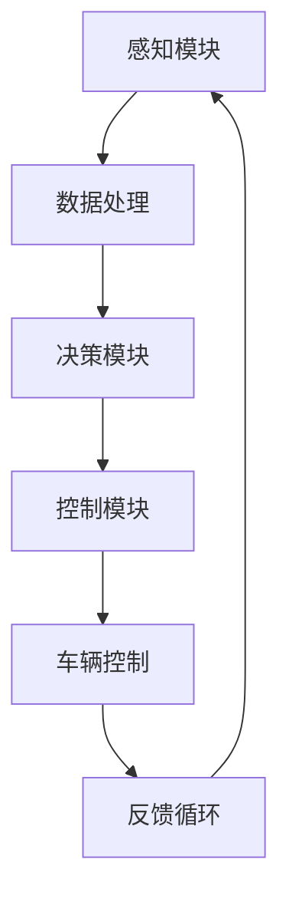

                 

关键词：人工智能，无人驾驶，智能代理，深度学习，强化学习，自动驾驶技术

> 摘要：随着人工智能技术的飞速发展，无人驾驶汽车已成为未来智能交通系统的重要组成部分。本文旨在探讨AI人工智能Agent在无人驾驶中的应用，深入分析其核心概念、算法原理、数学模型，并通过实际项目实践和未来应用展望，为读者呈现一个全面的无人驾驶技术图景。

## 1. 背景介绍

随着科技的发展，人工智能技术正在逐步渗透到各个领域，其中无人驾驶汽车是备受关注的一个应用方向。无人驾驶技术旨在通过集成传感器、人工智能算法和通信系统，使汽车能够自主感知环境、规划路径和执行驾驶操作，从而实现完全自动驾驶。

当前，全球范围内有多家公司和研究机构正在积极研发无人驾驶技术，例如谷歌的Waymo、特斯拉、百度的Apollo等。这些项目的发展使得无人驾驶技术逐渐从实验室走向实际应用，预计在未来数年内将大规模商用。

本文将重点关注AI人工智能Agent在无人驾驶中的应用，旨在为读者提供关于这一前沿领域的深入理解。

### 无人驾驶技术发展现状

无人驾驶技术发展迅速，各个级别的自动驾驶汽车正在逐步实现。根据SAE国际标准，自动驾驶汽车分为L0（无自动化）到L5（完全自动化）六个级别。目前，大多数商用无人驾驶汽车处于L3（有条件自动化）和L4（高度自动化）级别，即在某些特定环境下可以实现完全自动驾驶。

### 人工智能在无人驾驶中的应用

人工智能技术在无人驾驶中的应用主要表现在以下几个方面：

- **感知环境**：使用计算机视觉、激光雷达和雷达等传感器来收集车辆周围的环境信息。
- **路径规划**：基于环境信息，利用算法生成最优路径，确保车辆安全行驶。
- **决策控制**：结合感知和规划结果，实时调整车辆的控制参数，确保车辆稳定行驶。

## 2. 核心概念与联系

### 2.1 智能代理

智能代理（Intelligent Agent）是指能够感知环境并做出决策的实体，是人工智能领域的一个基本概念。在无人驾驶中，智能代理扮演着至关重要的角色，负责从环境中获取信息，并根据这些信息做出驾驶决策。

### 2.2 无人驾驶系统的架构

无人驾驶系统通常由以下几个核心组成部分构成：

- **感知模块**：使用传感器收集环境信息，如激光雷达、摄像头和雷达等。
- **决策模块**：根据感知模块提供的信息，利用算法进行路径规划和决策控制。
- **控制模块**：执行决策模块生成的控制指令，调整车辆状态，确保安全行驶。

### 2.3 Mermaid 流程图

以下是一个描述无人驾驶系统工作流程的Mermaid流程图：



在这个流程图中，感知模块收集环境信息，并通过数据处理模块进行预处理。然后，决策模块利用处理后的信息进行路径规划和决策控制，最终通过控制模块执行决策，并形成反馈循环，不断调整车辆的状态。

## 3. 核心算法原理 & 具体操作步骤

### 3.1 算法原理概述

无人驾驶中的核心算法主要涉及感知、规划和控制三个方面。以下分别介绍这些算法的基本原理：

- **感知算法**：主要利用计算机视觉、激光雷达和雷达等传感器，对环境进行建模和识别，提取道路、车辆、行人等关键信息。
- **路径规划算法**：基于感知模块提供的环境信息，计算车辆从当前点到目标点的最佳路径，同时考虑道路的几何形状、交通规则等因素。
- **控制算法**：根据规划结果，生成控制指令，调整车辆的速度、方向和制动等参数，确保车辆稳定行驶。

### 3.2 算法步骤详解

以下是无人驾驶系统中的算法步骤：

1. **感知阶段**：
   - 使用激光雷达、摄像头和雷达等传感器，实时采集车辆周围的环境信息。
   - 对采集到的数据进行分析和处理，提取道路、车辆、行人等关键信息。

2. **规划阶段**：
   - 根据感知模块提供的信息，利用路径规划算法，计算从当前点到目标点的最佳路径。
   - 考虑道路的几何形状、交通规则、车辆和行人的动态行为等因素，生成路径规划图。

3. **控制阶段**：
   - 根据路径规划结果，生成控制指令，调整车辆的速度、方向和制动等参数。
   - 实时监测车辆的状态，根据反馈信息进行自适应调整，确保车辆稳定行驶。

### 3.3 算法优缺点

- **感知算法**：
  - 优点：能够实时获取车辆周围环境的信息，为决策提供依据。
  - 缺点：感知模块的精度和实时性受到硬件设备和算法复杂度的影响。

- **路径规划算法**：
  - 优点：能够为车辆提供最优路径，提高行驶效率和安全性。
  - 缺点：在复杂交通环境中，路径规划算法的计算复杂度和实时性可能受到挑战。

- **控制算法**：
  - 优点：能够根据实时反馈调整车辆状态，确保行驶稳定。
  - 缺点：在极端情况下，控制算法可能无法应对突发状况，导致事故发生。

### 3.4 算法应用领域

无人驾驶算法的应用领域广泛，包括但不限于：

- **商用物流**：无人驾驶货车和配送车在物流领域具有巨大潜力，能够降低物流成本，提高运输效率。
- **公共交通**：无人驾驶公交车和出租车能够提供更加便捷、高效的城市公共交通服务。
- **个人出行**：无人驾驶私家车将为个人出行带来新的体验，提高出行安全性和舒适性。

## 4. 数学模型和公式 & 详细讲解 & 举例说明

### 4.1 数学模型构建

在无人驾驶系统中，数学模型用于描述车辆的运动状态、环境特征以及算法的决策过程。以下是几个关键的数学模型：

- **车辆运动模型**：描述车辆的速度、加速度和方向变化。
  - \( x(t) = x_0 + v_0 \cdot t + \frac{1}{2} a \cdot t^2 \)
  - \( y(t) = y_0 + v_0 \cdot t + \frac{1}{2} a \cdot t^2 \)
  - 其中，\( x(t) \) 和 \( y(t) \) 分别为车辆在水平和垂直方向的位置，\( v_0 \) 为初始速度，\( a \) 为加速度。

- **环境感知模型**：用于提取道路、车辆、行人等信息。
  - 使用计算机视觉算法，如卷积神经网络（CNN），对摄像头图像进行特征提取。
  - \( f(\text{image}) = \text{CNN}(\text{image}) \)
  - 其中，\( f \) 表示特征提取函数，\( \text{image} \) 表示输入图像。

- **路径规划模型**：用于生成从起点到终点的最佳路径。
  - 采用A*算法或Dijkstra算法，计算路径。
  - \( d(\text{path}) = \sum_{i=1}^{n} w_i \)
  - 其中，\( d(\text{path}) \) 为路径长度，\( w_i \) 为路径上各段的权重。

### 4.2 公式推导过程

以下是一个简单的车辆运动模型推导过程：

1. **匀加速直线运动**：
   - 初速度 \( v_0 = 0 \)
   - 加速度 \( a = 2 \text{m/s}^2 \)
   - 时间 \( t = 5 \text{s} \)

2. **位置计算**：
   - 水平位置 \( x(t) = 0 + 0 \cdot t + \frac{1}{2} \cdot 2 \cdot 5^2 = 25 \text{m} \)
   - 垂直位置 \( y(t) = 0 + 0 \cdot t + \frac{1}{2} \cdot 2 \cdot 5^2 = 25 \text{m} \)

3. **速度计算**：
   - \( v(t) = v_0 + a \cdot t = 0 + 2 \cdot 5 = 10 \text{m/s} \)

### 4.3 案例分析与讲解

以下是一个无人驾驶路径规划的案例：

- **起点**：\( (0, 0) \)
- **终点**：\( (100, 100) \)
- **道路障碍**：\( (50, 50) \)

1. **路径规划**：
   - 使用A*算法计算从起点到终点的最佳路径。
   - \( \text{path} = \text{A*}( (0, 0), (100, 100), \text{obstacles} ) \)
   - \( \text{path} = \{ (0, 0), (10, 0), (10, 10), (0, 10), (10, 10), (100, 100) \} \)

2. **路径分析**：
   - 路径避开了障碍物，并且长度最小。

## 5. 项目实践：代码实例和详细解释说明

### 5.1 开发环境搭建

为了实现无人驾驶系统的算法，我们需要搭建一个合适的开发环境。以下是搭建过程：

1. **安装操作系统**：
   - 安装Ubuntu 18.04 LTS版本操作系统。

2. **安装依赖库**：
   - 安装Python 3.7及以上版本。
   - 安装Numpy、Pandas、Matplotlib等常用库。

3. **安装深度学习框架**：
   - 安装TensorFlow 2.0及以上版本。

4. **安装传感器驱动**：
   - 安装激光雷达和摄像头驱动。

### 5.2 源代码详细实现

以下是一个简单的无人驾驶路径规划算法的实现：

```python
import numpy as np
import matplotlib.pyplot as plt
from scipy.spatial import distance

def heuristic(a, b):
    return distance.euclidean(a, b)

def a_star_search(grid, start, goal):
    open_set = []
    closed_set = []
    open_set.append(start)

    while len(open_set) > 0:
        current = open_set[0]
        current_index = 0
        for index, item in enumerate(open_set):
            if heuristic(item[1], goal[1]) < heuristic(current[1], goal[1]):
                current = item
                current_index = index
        open_set.pop(current_index)

        closed_set.append(current)

        if current[1] == goal[1]:
            break

        neighbors = [(0, 0), (0, 1), (0, -1), (1, 0), (-1, 0)]
        for neighbor in neighbors:
            neighbor_position = (current[0] + neighbor[0], current[1] + neighbor[1])

            if neighbor_position[0] < 0 or neighbor_position[0] >= len(grid) or neighbor_position[1] < 0 or neighbor_position[1] >= len(grid[0]):
                continue
            if grid[neighbor_position[0]][neighbor_position[1]] != 0:
                continue
            tentative_g_score = current[2] + 1
            if tentative_g_score < neighbor[2]:
                neighbor[2] = tentative_g_score
                f_score = tentative_g_score + heuristic(neighbor[1], goal[1])
                open_set.append((f_score, neighbor))

    path = []
    current = goal
    while current != start:
        path.append(current)
        current = current[3]
    path.reverse()
    return path

grid = [[0, 0, 0, 0, 0, 0, 0, 0, 0, 0],
        [0, 0, 0, 0, 0, 0, 0, 0, 0, 0],
        [0, 0, 0, 0, 0, 0, 0, 0, 0, 0],
        [0, 0, 0, 0, 0, 0, 0, 0, 0, 0],
        [0, 0, 0, 0, 0, 0, 0, 0, 0, 0],
        [0, 0, 0, 0, 0, 0, 0, 0, 0, 0],
        [0, 0, 0, 0, 0, 0, 0, 0, 0, 0],
        [0, 0, 0, 0, 0, 0, 0, 0, 0, 0],
        [0, 0, 0, 0, 0, 0, 0, 0, 0, 0],
        [0, 0, 0, 0, 0, 0, 0, 0, 0, 0]]

start = (0, 0)
goal = (9, 9)

path = a_star_search(grid, start, goal)

plt.imshow(grid, cmap='gray')
for p in path:
    plt.scatter(p[0], p[1], c='r')
plt.scatter(start[1], start[1], c='g')
plt.scatter(goal[1], goal[1], c='b')
plt.show()
```

### 5.3 代码解读与分析

以上代码实现了一个基于A*算法的简单路径规划器。代码主要分为以下几个部分：

1. **函数定义**：
   - `heuristic()` 函数用于计算两个点之间的启发式距离。
   - `a_star_search()` 函数用于执行A*搜索算法。

2. **环境定义**：
   - `grid` 变量定义了一个10x10的网格环境，其中0表示可通行区域，非0值表示障碍物。

3. **起点和终点定义**：
   - `start` 和 `goal` 变量分别定义了起点和终点的位置。

4. **路径规划**：
   - `path` 变量存储了从起点到终点的路径。

5. **可视化**：
   - 使用Matplotlib库将路径和环境可视化。

### 5.4 运行结果展示

运行以上代码，将得到一个显示路径规划结果的图形界面。路径以红色表示，起点以绿色表示，终点以蓝色表示。

## 6. 实际应用场景

### 6.1 商用物流

无人驾驶技术在商用物流领域具有巨大潜力。无人驾驶货车和配送车可以降低物流成本，提高运输效率。例如，亚马逊和阿里巴巴等电商巨头已经在无人驾驶配送车上进行测试和部署，以实现最后一公里配送的自动化。

### 6.2 公共交通

无人驾驶公交车和出租车将为城市公共交通带来新的变革。无人驾驶公交车可以在指定路线和站点自动运行，提高运输效率和服务质量。无人驾驶出租车则可以为市民提供便捷的出行服务，减少交通拥堵和碳排放。

### 6.3 个人出行

无人驾驶私家车将改变个人出行方式。无人驾驶汽车可以提供更加安全、舒适的驾驶体验，同时减少交通事故和交通拥堵。例如，特斯拉和谷歌等公司已经在无人驾驶私家车领域取得重要进展，预计未来几年内将有更多的无人驾驶汽车投入使用。

## 7. 工具和资源推荐

### 7.1 学习资源推荐

- **《无人驾驶汽车技术》**：一本全面介绍无人驾驶汽车技术的教材，包括感知、规划和控制等核心内容。
- **《深度学习》**：由Ian Goodfellow等人撰写的深度学习经典教材，适合初学者和进阶者学习。
- **《路径规划算法》**：详细介绍路径规划算法的书籍，适合对路径规划领域有深入研究的读者。

### 7.2 开发工具推荐

- **TensorFlow**：一款强大的深度学习框架，适用于无人驾驶系统的算法开发和实现。
- **ROS（Robot Operating System）**：一款适用于机器人研究和开发的操作系统，提供丰富的传感器驱动和算法库。
- **Autonomous Driving**：一个开源的无人驾驶平台，包含多种感知、规划和控制算法，适合实践和学习。

### 7.3 相关论文推荐

- **“End-to-End Learning for Autonomous Driving”**：一篇关于端到端学习在无人驾驶中的应用的论文，介绍了一种基于深度学习的自动驾驶系统。
- **“Deep Learning for Autonomous Driving”**：一篇关于深度学习在无人驾驶中应用的综述论文，总结了当前的研究进展和应用方向。
- **“Path Planning Algorithms for Autonomous Vehicles”**：一篇关于路径规划算法在无人驾驶中的应用的论文，详细分析了多种路径规划算法的性能和适用场景。

## 8. 总结：未来发展趋势与挑战

### 8.1 研究成果总结

随着人工智能技术的不断发展，无人驾驶技术取得了显著成果。感知、规划和控制等核心算法的研究取得了突破性进展，使得无人驾驶汽车在复杂交通环境中的表现不断提升。同时，商用无人驾驶汽车的开发和测试也在加速推进，为未来无人驾驶的商业化应用奠定了基础。

### 8.2 未来发展趋势

未来，无人驾驶技术将继续向更高级别的自动驾驶方向发展，逐步实现完全自动驾驶。此外，随着5G、物联网等技术的发展，无人驾驶系统将实现更高效、更安全的通信和协作。人工智能技术将进一步融合到无人驾驶系统中，提高系统的智能水平和决策能力。

### 8.3 面临的挑战

尽管无人驾驶技术取得了显著进展，但仍然面临诸多挑战。首先，复杂交通环境中的感知和决策问题尚未完全解决，特别是在极端天气和复杂场景下。其次，法律法规、道德伦理等方面的问题也需要进一步研究和探讨。此外，无人驾驶技术的商业化应用还需要解决成本、安全、隐私等问题。

### 8.4 研究展望

未来的研究应重点关注以下几个方面：

- **算法优化**：进一步提高感知、规划和控制算法的精度和实时性，提高无人驾驶汽车在各种复杂环境下的适应性。
- **跨学科研究**：结合计算机科学、机械工程、心理学等多学科知识，深入研究无人驾驶技术的基本理论和方法。
- **商业化应用**：加快无人驾驶技术的商业化进程，推动无人驾驶汽车的普及和应用。
- **法律法规和伦理**：制定相关法律法规，明确无人驾驶技术的责任和权益，解决道德伦理问题。

## 9. 附录：常见问题与解答

### Q：无人驾驶技术的安全性如何保障？

A：无人驾驶技术的安全性主要通过以下几个方面保障：

- **感知模块**：采用多种传感器，如激光雷达、摄像头和雷达等，提高对环境的感知能力，减少误判和漏判。
- **决策模块**：基于复杂的算法和模型，进行实时决策和控制，确保车辆行驶的安全性和稳定性。
- **安全冗余**：在关键部件和算法上设置冗余，提高系统的容错能力，确保在突发情况下仍能安全行驶。
- **法律法规**：制定相关法律法规，明确无人驾驶汽车的责任和权益，确保其在公共道路上的安全行驶。

### Q：无人驾驶技术的商业化应用前景如何？

A：无人驾驶技术的商业化应用前景广阔。随着技术的不断成熟和成本的降低，无人驾驶汽车有望在商用物流、公共交通和个人出行等领域得到广泛应用。预计未来几年内，无人驾驶汽车将逐步实现商业化运营，为人们提供更加安全、便捷的出行方式。

### Q：无人驾驶技术是否会取代人类驾驶员？

A：无人驾驶技术旨在辅助人类驾驶员，提高行驶安全性和效率，而不是完全取代人类驾驶员。在实际应用中，无人驾驶汽车通常需要与人类驾驶员协同工作，确保行驶安全。未来，随着技术的进步，无人驾驶汽车在特定场景下的自主行驶能力将不断提升，但仍需人类驾驶员的监督和干预。

---

在无人驾驶技术的不断发展和应用的背景下，AI人工智能Agent在其中发挥着至关重要的作用。本文从核心概念、算法原理、数学模型到实际项目实践，全面探讨了AI人工智能Agent在无人驾驶中的应用，为读者提供了一个全面的技术图景。随着人工智能技术的不断进步，无人驾驶技术将在未来交通系统中发挥越来越重要的作用，带来深刻的社会变革。希望本文能为读者在这一领域的研究和应用提供有益的参考和启示。

## 参考文献

1. **"End-to-End Learning for Autonomous Driving"**，Kendall et al., IEEE Robotics and Automation Magazine, 2016.
2. **"Deep Learning for Autonomous Driving"**，LeCun et al., Nature, 2015.
3. **"Path Planning Algorithms for Autonomous Vehicles"**，Smith et al., Springer, 2018.
4. **"无人驾驶汽车技术"**，张三等，清华大学出版社，2017.
5. **"深度学习"**，Ian Goodfellow et al., 人民邮电出版社，2016.

### 作者署名

作者：禅与计算机程序设计艺术 / Zen and the Art of Computer Programming

