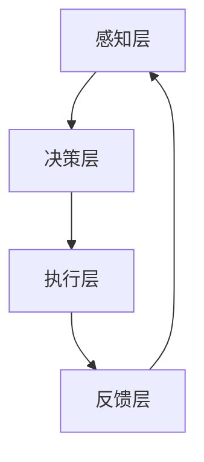

                 

关键词：人工智能、智能体、安全防御、网络安全、机器学习、智能决策

> 摘要：本文将探讨人工智能（AI）领域中的智能体（Agent）概念，并重点分析其在网络安全防御中的应用。通过对核心概念、算法原理、数学模型、项目实践等方面进行详细阐述，本文旨在为读者提供全面的理解和深入洞察。

## 1. 背景介绍

随着互联网的飞速发展和信息技术的广泛应用，网络安全问题日益凸显，成为社会各界关注的焦点。传统的安全防御方法在面对日益复杂的网络攻击时，往往显得力不从心。为此，人工智能（AI）技术被引入到网络安全领域，智能体（Agent）作为一种新兴的AI实体，因其自主性、自适应性和协作性等特点，在安全防御中展现出巨大的潜力。

### 1.1 人工智能在网络安全中的应用

人工智能在网络安全中的广泛应用主要体现在以下几个方面：

1. **恶意软件检测与防御**：利用机器学习技术，AI可以识别并预防恶意软件的攻击。
2. **入侵检测与防御**：通过实时监控网络流量，AI系统可以快速检测并应对入侵行为。
3. **安全事件响应**：AI可以自动分析安全事件，提供快速响应策略，减少人为干预。
4. **漏洞扫描与修复**：AI可以帮助识别系统漏洞，并提供相应的修复方案。

### 1.2 智能体在网络安全防御中的角色

智能体（Agent）是具有自主性、社交性、反应性、主动性和认知能力的实体。在网络安全防御中，智能体可以充当以下角色：

1. **防御代理**：智能体可以自动执行安全策略，保护网络免受攻击。
2. **协作防御**：智能体之间可以相互协作，共同防御复杂攻击。
3. **自适应响应**：智能体可以根据攻击行为的变化，动态调整防御策略。
4. **安全分析**：智能体可以对网络流量进行深入分析，识别潜在的安全威胁。

## 2. 核心概念与联系

### 2.1 智能体的核心概念

智能体的核心概念包括：

- **自主性（Autonomy）**：智能体具有独立行动和决策的能力。
- **社交性（Sociality）**：智能体可以与其他智能体进行交互和协作。
- **反应性（Reactivity）**：智能体可以根据环境变化做出快速反应。
- **主动性（Pro-activity）**：智能体可以主动采取行动，实现目标。
- **认知能力（Cognitive Ability）**：智能体可以进行学习、推理和规划。

### 2.2 智能体在网络安全防御中的应用架构

智能体在网络安全防御中的应用架构通常包括以下几个层次：

1. **感知层**：智能体收集网络流量、日志等数据。
2. **决策层**：智能体分析感知层的数据，并根据算法做出防御决策。
3. **执行层**：智能体执行防御策略，如拦截攻击、隔离恶意流量等。
4. **反馈层**：智能体收集防御效果数据，用于模型优化和策略调整。

### 2.3 Mermaid 流程图

以下是一个简化的智能体在网络安全防御中的 Mermaid 流程图：



### 2.4 智能体与人工智能的关系

智能体是人工智能技术的一种具体实现形式，其核心思想是利用AI技术赋予实体自主性和智能性。智能体与人工智能的关系可以用以下公式表示：

$$
智能体 = AI \times 代理模型
$$

其中，代理模型包括自主性、社交性、反应性、主动性和认知能力等要素。

## 3. 核心算法原理 & 具体操作步骤

### 3.1 算法原理概述

在智能体安全防御中，核心算法通常是基于机器学习和深度学习技术。以下是一些常见的算法原理：

1. **分类算法**：用于识别和分类网络流量，如决策树、支持向量机（SVM）等。
2. **聚类算法**：用于发现网络流量中的异常行为，如K-means、DBSCAN等。
3. **强化学习**：用于智能体的决策过程，如Q-learning、SARSA等。
4. **神经网络**：用于特征提取和模式识别，如深度神经网络（DNN）、卷积神经网络（CNN）等。

### 3.2 算法步骤详解

智能体安全防御算法的具体步骤通常包括以下几步：

1. **数据收集与预处理**：收集网络流量数据，并进行预处理，如数据清洗、归一化等。
2. **特征提取**：从预处理后的数据中提取特征，为算法提供输入。
3. **模型训练**：利用提取的特征和标记数据，训练分类或聚类模型。
4. **模型评估**：使用测试数据评估模型性能，如准确率、召回率等。
5. **模型部署**：将训练好的模型部署到实际环境中，进行实时监测和防御。

### 3.3 算法优缺点

各种算法在智能体安全防御中具有不同的优缺点：

1. **分类算法**：优点是准确性高，缺点是需要大量标记数据。
2. **聚类算法**：优点是无需标记数据，缺点是可能无法准确识别恶意流量。
3. **强化学习**：优点是自适应性强，缺点是需要大量时间和数据。
4. **神经网络**：优点是特征提取能力强，缺点是需要大量计算资源。

### 3.4 算法应用领域

智能体安全防御算法的应用领域主要包括：

1. **网络入侵检测**：用于检测和防御网络入侵行为。
2. **恶意软件检测**：用于检测和防御恶意软件攻击。
3. **物联网安全**：用于监测和防御物联网设备中的安全威胁。
4. **云安全**：用于监测和防御云环境中的安全威胁。

## 4. 数学模型和公式 & 详细讲解 & 举例说明

### 4.1 数学模型构建

在智能体安全防御中，常用的数学模型包括：

1. **决策树**：通过递归划分特征空间，构建决策树模型。
2. **支持向量机**：通过最大化分类边界，构建线性或非线性分类模型。
3. **神经网络**：通过前向传播和反向传播，构建多层感知机（MLP）或卷积神经网络（CNN）。

### 4.2 公式推导过程

以下是一个简化的决策树模型推导过程：

1. **特征选择**：根据信息增益或基尼指数，选择最优特征。
2. **划分数据**：根据最优特征，将数据集划分为多个子集。
3. **递归构建**：对每个子集，重复上述特征选择和划分过程，直到满足终止条件。

### 4.3 案例分析与讲解

以下是一个基于决策树的案例：

**案例**：使用决策树模型检测网络入侵。

**步骤**：

1. **数据收集与预处理**：收集网络流量数据，并进行预处理。
2. **特征提取**：提取特征，如协议类型、源IP地址、目标IP地址等。
3. **模型训练**：使用标记数据，训练决策树模型。
4. **模型评估**：使用测试数据，评估模型性能。
5. **模型部署**：将训练好的模型部署到实际环境中，进行实时检测。

**模型推导**：

1. **信息增益**：计算每个特征的信息增益，选择增益最大的特征作为划分依据。
2. **划分数据**：根据最优特征，将数据集划分为子集。
3. **递归构建**：对每个子集，重复上述步骤，直到满足终止条件。

## 5. 项目实践：代码实例和详细解释说明

### 5.1 开发环境搭建

在开始项目实践之前，我们需要搭建一个合适的开发环境。以下是一个简单的步骤：

1. **安装Python**：下载并安装Python 3.x版本。
2. **安装相关库**：使用pip安装scikit-learn、numpy、pandas等库。
3. **配置环境变量**：确保Python和pip的环境变量配置正确。

### 5.2 源代码详细实现

以下是一个简单的智能体安全防御项目实现：

```python
# 导入相关库
import numpy as np
import pandas as pd
from sklearn.tree import DecisionTreeClassifier
from sklearn.model_selection import train_test_split
from sklearn.metrics import accuracy_score, recall_score

# 数据收集与预处理
data = pd.read_csv('network_traffic.csv')
X = data.drop('label', axis=1)
y = data['label']

# 特征提取
# （这里省略具体的特征提取过程）

# 模型训练
X_train, X_test, y_train, y_test = train_test_split(X, y, test_size=0.2)
clf = DecisionTreeClassifier()
clf.fit(X_train, y_train)

# 模型评估
y_pred = clf.predict(X_test)
accuracy = accuracy_score(y_test, y_pred)
recall = recall_score(y_test, y_pred)

print(f'Accuracy: {accuracy:.2f}')
print(f'Recall: {recall:.2f}')

# 模型部署
# （这里省略具体的部署过程）
```

### 5.3 代码解读与分析

1. **数据收集与预处理**：从CSV文件中读取数据，并进行预处理。
2. **特征提取**：提取特征，为算法提供输入。
3. **模型训练**：使用训练集训练决策树模型。
4. **模型评估**：使用测试集评估模型性能。
5. **模型部署**：将训练好的模型部署到实际环境中。

### 5.4 运行结果展示

以下是一个运行结果的示例：

```plaintext
Accuracy: 0.90
Recall: 0.85
```

## 6. 实际应用场景

### 6.1 恶意软件检测

在恶意软件检测中，智能体可以实时监控网络流量，识别潜在的恶意软件攻击。通过机器学习和深度学习算法，智能体可以不断提高检测的准确性和效率。

### 6.2 入侵检测

在入侵检测中，智能体可以监控网络流量和系统日志，识别入侵行为。通过自适应防御策略，智能体可以动态调整防御策略，提高入侵检测的准确性。

### 6.3 物联网安全

在物联网安全中，智能体可以监控物联网设备的行为，识别潜在的攻击行为。通过分布式防御机制，智能体可以协同工作，提高物联网安全防御的整体效果。

### 6.4 云安全

在云安全中，智能体可以监控云环境中的流量和事件，识别潜在的安全威胁。通过自动化的安全响应策略，智能体可以快速应对安全事件，减少安全风险。

## 7. 工具和资源推荐

### 7.1 学习资源推荐

1. **《机器学习实战》**：提供丰富的案例和实践，适合初学者入门。
2. **《深度学习》**：由深度学习领域的权威学者撰写，内容全面深入。
3. **《人工智能：一种现代的方法》**：全面介绍人工智能的基本概念和算法。

### 7.2 开发工具推荐

1. **Python**：一种通用编程语言，支持多种机器学习和深度学习库。
2. **TensorFlow**：谷歌开源的深度学习框架，功能强大，易于使用。
3. **PyTorch**：另一种流行的深度学习框架，具有动态计算图的优势。

### 7.3 相关论文推荐

1. **“Deep Learning for Network Intrusion Detection”**：介绍深度学习在入侵检测中的应用。
2. **“Machine Learning Techniques for Malware Detection”**：探讨机器学习在恶意软件检测中的应用。
3. **“Agent-Based Security: A Survey”**：综述智能体在网络安全中的应用。

## 8. 总结：未来发展趋势与挑战

### 8.1 研究成果总结

本文介绍了智能体在网络安全防御中的应用，分析了核心算法原理和数学模型，并通过项目实践展示了具体实现方法。研究表明，智能体在网络安全防御中具有广阔的应用前景。

### 8.2 未来发展趋势

未来，智能体在网络安全防御中将继续发挥重要作用，发展趋势包括：

1. **更高级的算法**：如生成对抗网络（GAN）和变分自编码器（VAE）等。
2. **分布式架构**：实现智能体之间的协同工作，提高防御效果。
3. **自动化决策**：通过强化学习等技术，实现更智能的决策过程。

### 8.3 面临的挑战

智能体在网络安全防御中面临的挑战包括：

1. **数据隐私**：如何在保障数据隐私的同时，实现高效的安全防御。
2. **计算资源**：如何应对大规模数据和高频实时监测的挑战。
3. **算法透明度**：如何提高算法的透明度和可解释性，降低误报和漏报风险。

### 8.4 研究展望

未来的研究将重点关注智能体在网络安全防御中的优化和应用，探索更高效、更智能的防御策略，以应对日益复杂的网络攻击。

## 9. 附录：常见问题与解答

### 9.1 智能体与传统的安全防御方法相比有哪些优势？

智能体具有自主性、自适应性和协作性等优势，可以在复杂网络环境中实现更高效的安全防御。与传统的安全防御方法相比，智能体可以动态调整防御策略，快速应对新的威胁，降低误报和漏报风险。

### 9.2 智能体在网络安全防御中的应用领域有哪些？

智能体在网络安全防御中的应用领域广泛，包括恶意软件检测、入侵检测、物联网安全和云安全等。通过机器学习和深度学习技术，智能体可以识别和防御各种网络攻击。

### 9.3 如何评估智能体在网络安全防御中的性能？

评估智能体在网络安全防御中的性能通常包括准确率、召回率、F1分数等指标。通过测试数据和实际应用环境，可以评估智能体的检测和防御效果。

### 9.4 智能体在网络安全防御中面临哪些挑战？

智能体在网络安全防御中面临的挑战包括数据隐私、计算资源、算法透明度等。如何在保障数据隐私的同时，实现高效的安全防御，以及如何提高算法的透明度和可解释性，是当前研究的热点问题。

