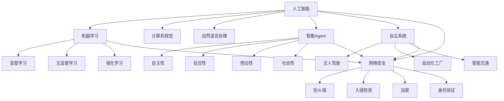

                 

 

## 1. 背景介绍

人工智能（AI）作为现代科技的重要支柱，已经在各个领域展现出其强大的影响力。从医疗诊断、金融分析到无人驾驶、智能家居，AI的应用场景日益广泛。然而，随着AI技术的不断进步，其潜在的国家安全影响也逐渐引起了全球范围内的关注。人工智能Agent，作为AI技术的一种高级形式，具有高度的自主性和智能化，其潜在的应用场景包括但不限于智能助手、自动化军事系统、网络安全防御等。这些Agent的性能和影响力在不断提高，使得它们在国家安全领域扮演着越来越重要的角色。

国家安全是指国家政权、社会制度、主权统一、领土完整、人民福祉、社会秩序等方面不受外部威胁和侵害的状态。它涵盖了政治安全、军事安全、经济安全、文化安全、社会安全等多个方面。随着AI技术的发展，国家安全面临的挑战也在不断变化，AI人工智能Agent作为一种新兴的技术力量，其影响不容忽视。

首先，AI人工智能Agent在军事领域的应用带来了新的挑战。自动化武器系统、无人驾驶飞行器、智能侦察系统等，使军事行动的效率和精度得到了大幅提升。然而，这些系统的自主性和智能性也带来了安全风险，例如自主武器系统可能在决策过程中出现偏差，导致误伤友军或平民。此外，AI人工智能Agent的部署也可能引发军事竞争和军备竞赛，加剧国际紧张局势。

其次，AI人工智能Agent在网络安全领域的应用也对国家安全构成威胁。随着网络攻击手段的不断升级，传统的安全防御手段已经难以应对。AI人工智能Agent可以利用深度学习和大数据分析等技术，快速识别和响应网络攻击，提升网络安全防护能力。然而，这些AI系统也可能被恶意利用，成为网络攻击的新工具，对关键基础设施、政府机构、企业网络等造成严重破坏。

此外，AI人工智能Agent在信息传播和社会治理方面的应用，也对国家安全产生了深远影响。智能助手、社交媒体算法等AI应用，在提高信息传播效率、优化社会治理方面发挥了积极作用。然而，这些AI系统也可能被用于传播虚假信息、操纵舆论、干扰选举等不良目的，对国家安全和社会稳定构成威胁。

总之，AI人工智能Agent作为一种新兴技术力量，其应用在国家安全领域具有巨大的潜力。然而，其潜在的安全风险和威胁也不容忽视。在推动AI技术发展的同时，必须加强对其安全影响的评估和监管，确保AI人工智能Agent的应用符合国家安全的要求。

## 2. 核心概念与联系

在探讨AI人工智能Agent对国家安全的影响时，首先需要理解相关核心概念及其相互联系。这些概念包括但不限于人工智能（AI）、智能Agent、自主系统、机器学习和网络安全等。以下将详细阐述这些概念，并使用Mermaid流程图展示其之间的联系。

### 2.1 人工智能（AI）

人工智能（AI）是指由计算机系统执行的任务，其表现出与人类相似的智能特性，如学习、推理、问题解决、感知和自然语言理解等。AI技术主要包括机器学习、深度学习、计算机视觉、自然语言处理等子领域。

### 2.2 智能Agent

智能Agent是一种能够自主感知环境、规划行动并执行任务的计算机程序。Agent通常具有以下特性：

- **自主性**：Agent可以独立完成特定任务，而不需要人为干预。
- **反应性**：Agent能够根据环境变化迅速做出反应。
- **预动性**：Agent可以根据预测未来情况，提前采取行动。
- **社会性**：Agent可以在多Agent系统中与其他Agent协作。

### 2.3 自主系统

自主系统是指能够独立执行任务、自主决策和行动的计算机系统。这些系统通常由多个智能Agent组成，通过协作实现复杂的任务。自主系统在无人驾驶、自动化工厂、智能交通等领域有广泛应用。

### 2.4 机器学习

机器学习是AI的一个重要分支，涉及使用算法和统计模型，从数据中自动学习和改进性能。机器学习可以分为监督学习、无监督学习和强化学习等类型。

### 2.5 网络安全

网络安全是指保护计算机网络系统不受恶意攻击、数据泄露和非法访问的能力。网络安全涉及防火墙、入侵检测、加密、身份验证等多个方面。

### 2.6 核心概念联系

使用Mermaid流程图展示上述核心概念及其联系：



### 2.7 概述

通过上述Mermaid流程图，我们可以清晰地看到人工智能、智能Agent、自主系统、机器学习和网络安全等核心概念之间的相互联系。这些概念共同构成了AI技术体系，并在国家安全领域发挥着重要作用。理解这些核心概念及其联系，有助于我们更深入地探讨AI人工智能Agent对国家安全的影响。

### 3. 核心算法原理 & 具体操作步骤

在深入探讨AI人工智能Agent对国家安全的影响之前，有必要了解AI人工智能Agent的核心算法原理和具体操作步骤。以下是关于核心算法原理的概述，以及算法的具体步骤、优缺点和适用领域。

#### 3.1 算法原理概述

AI人工智能Agent的核心算法通常基于机器学习和深度学习。机器学习是一种通过算法从数据中学习并做出决策的技术，而深度学习则是一种基于多层神经网络进行学习的先进技术。以下是一些常用的核心算法：

- **监督学习（Supervised Learning）**：通过已知输入输出数据对模型进行训练，使得模型能够对新输入数据进行预测。常用的监督学习算法包括线性回归、支持向量机（SVM）、决策树和随机森林等。
- **无监督学习（Unsupervised Learning）**：不需要已知输出数据，通过探索数据内在结构和模式来进行学习。常用的无监督学习算法包括聚类、主成分分析（PCA）和自编码器等。
- **强化学习（Reinforcement Learning）**：通过试错和奖励机制来学习最优策略。强化学习算法在动态环境中具有很好的适应性，常用于自动驾驶、游戏AI等场景。
- **深度学习（Deep Learning）**：一种基于多层神经网络进行学习的算法，能够处理复杂数据模式。常用的深度学习模型包括卷积神经网络（CNN）、循环神经网络（RNN）和Transformer等。

#### 3.2 算法步骤详解

以下是一个基于监督学习算法的AI人工智能Agent的创建步骤：

1. **数据收集**：首先，收集大量与任务相关的数据，这些数据可以是结构化的（如表格数据）或非结构化的（如图像、文本等）。

2. **数据预处理**：对收集到的数据进行清洗、归一化等预处理操作，以提高数据质量和模型的训练效果。

3. **特征提取**：从预处理后的数据中提取有用的特征，用于训练模型。对于图像数据，可以使用卷积神经网络进行特征提取；对于文本数据，可以使用词嵌入技术提取特征。

4. **模型选择**：根据任务类型和数据特性选择合适的模型。例如，对于分类任务，可以选择SVM或随机森林；对于回归任务，可以选择线性回归或神经网络。

5. **模型训练**：使用已知输入输出数据对模型进行训练，使得模型能够对新输入数据进行预测。训练过程中，通过调整模型参数，优化模型性能。

6. **模型评估**：使用测试集对模型进行评估，以确定模型的预测准确性。常用的评估指标包括准确率、召回率、F1分数等。

7. **模型部署**：将训练好的模型部署到实际应用环境中，使其能够对新的输入数据进行实时预测和决策。

#### 3.3 算法优缺点

- **优点**：
  - **高效性**：AI人工智能Agent能够快速处理大量数据，提供高效的决策和预测。
  - **适应性**：通过不断学习和优化，AI系统可以适应不同的环境和任务。
  - **自动化**：AI人工智能Agent能够自动化执行任务，减少人为干预和错误。

- **缺点**：
  - **数据依赖性**：AI系统对数据质量有很高的要求，数据质量不佳可能导致模型性能下降。
  - **透明度不足**：一些复杂的AI模型（如深度神经网络）内部决策过程难以解释，增加了模型的不透明性。
  - **安全风险**：AI人工智能Agent可能被恶意利用，成为网络攻击的工具，对国家安全构成威胁。

#### 3.4 算法应用领域

AI人工智能Agent在多个领域具有广泛的应用：

- **军事领域**：自动化武器系统、无人驾驶飞行器、智能侦察系统等，提高军事行动的效率和精度。
- **网络安全**：利用AI人工智能Agent进行网络攻击检测、入侵防御和漏洞扫描等，提升网络安全防护能力。
- **金融领域**：智能投顾、风险控制、欺诈检测等，提高金融服务的效率和安全性。
- **医疗领域**：辅助诊断、个性化治疗、药物研发等，提高医疗服务的质量和效率。
- **工业领域**：自动化生产、质量检测、设备维护等，提高工业生产的效率和稳定性。

### 4. 数学模型和公式 & 详细讲解 & 举例说明

在讨论AI人工智能Agent对国家安全的影响时，我们需要引入一些数学模型和公式，以更全面地理解其原理和操作。以下将详细讲解这些数学模型和公式的构建、推导过程，并通过具体案例进行说明。

#### 4.1 数学模型构建

在AI人工智能Agent中，常用的数学模型包括神经网络、决策树和贝叶斯网络等。以下以神经网络为例，展示其数学模型构建过程。

1. **神经网络架构**：
   神经网络由多个层次组成，包括输入层、隐藏层和输出层。每个层次包含多个节点（神经元），节点之间通过权重（weight）连接。神经网络的输出可以通过以下公式计算：

   $$\text{output} = \text{activation}(z)$$

   其中，$z$ 是节点的净输入，定义为：

   $$z = \sum_{j} w_{ji} \cdot x_{j} + b_i$$

   $w_{ji}$ 是连接输入层节点 $x_j$ 和隐藏层节点 $i$ 的权重，$b_i$ 是隐藏层节点 $i$ 的偏置。

2. **激活函数**：
   激活函数用于引入非线性，常见的激活函数包括 sigmoid、ReLU 和 tanh 等。以下为 sigmoid 激活函数的定义：

   $$\text{sigmoid}(x) = \frac{1}{1 + e^{-x}}$$

3. **损失函数**：
   在训练神经网络时，我们需要定义一个损失函数，用于评估模型预测值与真实值之间的差异。常见的损失函数包括均方误差（MSE）、交叉熵（Cross-Entropy）等。以下为均方误差（MSE）的定义：

   $$MSE = \frac{1}{n} \sum_{i=1}^{n} (\hat{y}_i - y_i)^2$$

   其中，$\hat{y}_i$ 是模型预测的输出值，$y_i$ 是真实输出值。

4. **优化算法**：
   为了优化神经网络的参数，常用的优化算法包括梯度下降（Gradient Descent）、随机梯度下降（Stochastic Gradient Descent，SGD）和Adam等。以下为梯度下降的基本步骤：

   - 初始化模型参数 $\theta$。
   - 计算损失函数关于参数的梯度 $ \nabla_{\theta} J(\theta)$。
   - 更新参数 $\theta$：$\theta := \theta - \alpha \nabla_{\theta} J(\theta)$，其中 $\alpha$ 是学习率。

#### 4.2 公式推导过程

以下以多层感知机（MLP）为例，展示神经网络公式推导过程。

1. **输入层到隐藏层**：

   - 假设输入层有 $n$ 个输入特征，隐藏层有 $m$ 个神经元。
   - 第 $i$ 个隐藏层神经元的净输入 $z_i$ 和输出 $a_i$ 分别为：

     $$z_i = \sum_{j=1}^{n} w_{ji} \cdot x_j + b_i$$

     $$a_i = \text{sigmoid}(z_i)$$

2. **隐藏层到输出层**：

   - 假设输出层有 $k$ 个神经元。
   - 第 $l$ 个输出层神经元的净输入 $z_l$ 和输出 $a_l$ 分别为：

     $$z_l = \sum_{i=1}^{m} w_{li} \cdot a_i + b_l$$

     $$a_l = \text{sigmoid}(z_l)$$

3. **损失函数**：

   - 假设输出层有 $k$ 个输出特征，目标输出为 $y_l$。
   - 均方误差损失函数为：

     $$J(\theta) = \frac{1}{2n} \sum_{l=1}^{k} (\hat{y}_l - y_l)^2$$

4. **梯度计算**：

   - 对隐藏层参数的梯度：

     $$\nabla_{w_{ji}} J(\theta) = (a_i - 1) \cdot a_i \cdot (y_l - \hat{y}_l) \cdot x_j$$

     $$\nabla_{b_i} J(\theta) = (a_i - 1) \cdot a_i \cdot (y_l - \hat{y}_l)$$

   - 对输出层参数的梯度：

     $$\nabla_{w_{li}} J(\theta) = (a_l - 1) \cdot a_l \cdot (y_l - \hat{y}_l) \cdot a_i$$

     $$\nabla_{b_l} J(\theta) = (a_l - 1) \cdot a_l \cdot (y_l - \hat{y}_l)$$

#### 4.3 案例分析与讲解

以下通过一个具体案例，展示神经网络在图像分类任务中的应用。

1. **数据集**：
   假设我们有一个包含 10000 张图像的数据集，每张图像都是28x28像素的灰度图像。数据集分为训练集和测试集，其中训练集包含 8000 张图像，测试集包含 2000 张图像。

2. **模型架构**：
   我们选择一个包含两个隐藏层的多层感知机（MLP）模型，每个隐藏层有 500 个神经元。输出层有 10 个神经元，对应 10 个类别。

3. **训练过程**：
   - 使用训练集对模型进行训练，设置学习率为 0.1，迭代次数为 1000 次。
   - 在每次迭代中，计算损失函数关于模型参数的梯度，并更新参数。
   - 训练过程中，使用测试集进行验证，调整学习率和迭代次数。

4. **结果分析**：
   - 在训练过程中，损失函数逐渐减小，模型性能得到提升。
   - 训练完成后，使用测试集对模型进行评估，计算准确率、召回率和 F1 分数。
   - 根据评估结果，可以进一步优化模型参数，提高模型性能。

通过上述案例，我们可以看到神经网络在图像分类任务中的应用过程。在实际应用中，神经网络可以用于各种复杂任务，如语音识别、自然语言处理、推荐系统等。理解神经网络的基本原理和公式推导，有助于我们更好地应用和优化神经网络模型。

### 5. 项目实践：代码实例和详细解释说明

在本章节中，我们将通过一个具体的代码实例，详细展示如何搭建一个基于AI的人工智能Agent系统，并对其代码实现进行解释和分析。为了更好地说明，我们将使用Python编程语言，结合TensorFlow库，实现一个简单的图像分类任务。

#### 5.1 开发环境搭建

在进行项目实践之前，我们需要搭建合适的开发环境。以下是搭建开发环境的步骤：

1. **安装Python**：确保系统中已安装Python 3.7或更高版本。
2. **安装TensorFlow**：在命令行中运行以下命令安装TensorFlow：

   ```bash
   pip install tensorflow
   ```

3. **安装其他依赖库**：如NumPy、Pandas等，可以通过以下命令安装：

   ```bash
   pip install numpy pandas
   ```

4. **创建虚拟环境**：为了保持项目依赖的一致性，建议创建一个虚拟环境。可以通过以下命令创建虚拟环境：

   ```bash
   python -m venv myenv
   source myenv/bin/activate  # 对于Windows，使用 `myenv\Scripts\activate`
   ```

5. **导入必要库**：在Python脚本中导入必要的库：

   ```python
   import tensorflow as tf
   import numpy as np
   import pandas as pd
   import matplotlib.pyplot as plt
   ```

#### 5.2 源代码详细实现

以下是实现图像分类任务的具体代码：

```python
import tensorflow as tf
from tensorflow.keras import layers, models
from tensorflow.keras.preprocessing.image import ImageDataGenerator

# 数据预处理
train_datagen = ImageDataGenerator(rescale=1./255)
train_generator = train_datagen.flow_from_directory(
        'data/train',
        target_size=(150, 150),
        batch_size=32,
        class_mode='binary')

# 构建模型
model = models.Sequential([
    layers.Conv2D(32, (3, 3), activation='relu', input_shape=(150, 150, 3)),
    layers.MaxPooling2D((2, 2)),
    layers.Conv2D(64, (3, 3), activation='relu'),
    layers.MaxPooling2D((2, 2)),
    layers.Conv2D(128, (3, 3), activation='relu'),
    layers.MaxPooling2D((2, 2)),
    layers.Conv2D(128, (3, 3), activation='relu'),
    layers.MaxPooling2D((2, 2)),
    layers.Flatten(),
    layers.Dense(512, activation='relu'),
    layers.Dense(1, activation='sigmoid')
])

# 编译模型
model.compile(loss='binary_crossentropy',
              optimizer='adam',
              metrics=['accuracy'])

# 训练模型
history = model.fit(
      train_generator,
      steps_per_epoch=train_generator.samples//train_generator.batch_size,
      epochs=50)

# 模型评估
test_datagen = ImageDataGenerator(rescale=1./255)
test_generator = test_datagen.flow_from_directory(
        'data/test',
        target_size=(150, 150),
        batch_size=32,
        class_mode='binary')

test_loss, test_acc = model.evaluate(test_generator)
print(f'Test accuracy: {test_acc:.4f}')

# 可视化训练过程
plt.plot(history.history['accuracy'], label='accuracy')
plt.plot(history.history['loss'], label='loss')
plt.xlabel('Epoch')
plt.ylabel('Value')
plt.legend()
plt.show()
```

#### 5.3 代码解读与分析

1. **数据预处理**：
   使用ImageDataGenerator对图像数据进行预处理，包括归一化和数据增强。数据增强可以帮助模型更好地泛化。

2. **模型构建**：
   使用Sequential模型定义一个简单的卷积神经网络（CNN），包括多个卷积层和池化层，以及全连接层。卷积层用于提取图像特征，全连接层用于分类。

3. **模型编译**：
   设置模型的损失函数为二进制交叉熵，优化器为Adam，评估指标为准确率。

4. **模型训练**：
   使用fit函数训练模型，通过调用数据生成器进行批量训练。

5. **模型评估**：
   使用测试数据生成器对模型进行评估，计算测试集上的准确率。

6. **可视化**：
   使用matplotlib绘制训练过程中的准确率和损失函数曲线，便于分析模型性能。

通过上述代码，我们可以构建一个简单的图像分类任务，实现从数据加载、模型构建、训练到评估的全过程。在实际项目中，可以根据任务需求调整模型结构和参数，优化模型性能。

### 6. 实际应用场景

AI人工智能Agent在国家安全领域的实际应用场景广泛，以下列举几个典型的应用案例，并对其工作原理和国家安全影响进行详细分析。

#### 6.1 军事领域

AI人工智能Agent在军事领域的应用主要包括自动化武器系统、无人驾驶飞行器（UAV）和智能侦察系统等。以下是一个具体案例：

**案例：自动化导弹系统**

自动化导弹系统使用AI人工智能Agent进行目标识别、轨迹预测和射击决策。其工作原理如下：

1. **目标识别**：AI人工智能Agent通过计算机视觉技术识别敌方目标，如坦克、舰船或飞机。
2. **轨迹预测**：基于目标的历史轨迹数据，使用机器学习算法预测目标的未来位置。
3. **射击决策**：AI人工智能Agent根据目标的位置、速度和威胁等级，计算最佳射击时机和角度。

国家安全影响分析：

- **提高作战效率**：自动化导弹系统能够快速、准确地识别和攻击目标，提高作战效率。
- **降低人员风险**：减少军事人员直接参与高风险任务，降低伤亡风险。
- **决策风险**：AI系统可能在决策过程中出现偏差，导致误伤友军或平民。

#### 6.2 网络安全领域

AI人工智能Agent在网络安全领域的应用主要包括入侵检测、漏洞扫描和恶意软件分析等。以下是一个具体案例：

**案例：智能入侵检测系统**

智能入侵检测系统使用AI人工智能Agent实时监控网络流量，识别潜在威胁。其工作原理如下：

1. **数据采集**：AI人工智能Agent从网络设备（如防火墙、路由器等）采集流量数据。
2. **特征提取**：使用机器学习算法提取流量数据中的关键特征，如协议类型、数据包大小和传输速率等。
3. **威胁识别**：基于已知的攻击模式和异常行为，AI人工智能Agent识别潜在的网络攻击。

国家安全影响分析：

- **提升防护能力**：智能入侵检测系统能够快速识别和响应网络攻击，提高网络安全防护能力。
- **误报风险**：AI系统可能对正常流量产生误报，导致网络安全警报频繁。
- **数据隐私**：网络流量数据包含敏感信息，需要确保数据隐私和安全。

#### 6.3 信息传播领域

AI人工智能Agent在信息传播领域的应用主要包括内容审核、舆情分析和选举干预等。以下是一个具体案例：

**案例：社交媒体内容审核**

社交媒体内容审核使用AI人工智能Agent对用户发布的内容进行审核，过滤不良信息。其工作原理如下：

1. **内容采集**：AI人工智能Agent从社交媒体平台（如微博、推特等）采集用户发布的内容。
2. **文本分析**：使用自然语言处理技术对内容进行情感分析和关键词提取。
3. **审核决策**：AI人工智能Agent根据预设的规则和算法，判断内容是否违反平台规范。

国家安全影响分析：

- **净化网络环境**：AI人工智能Agent能够高效地识别和过滤不良信息，净化网络环境。
- **舆论操纵风险**：AI系统可能被恶意利用，操纵舆论，影响公共舆论和选举。
- **言论自由**：AI系统需要平衡言论自由和内容审核，避免过度限制。

#### 6.4 未来应用展望

随着AI技术的不断进步，AI人工智能Agent在国家安全领域的应用前景广阔。以下是一些未来可能的应用方向：

- **智能化防御系统**：通过AI人工智能Agent实现全面的网络安全防护，包括入侵检测、漏洞扫描、恶意软件分析和应急响应等。
- **自动化执法**：使用AI人工智能Agent辅助执法机构进行犯罪侦查、人员监控和案件审理，提高执法效率和公正性。
- **智能军事指挥**：利用AI人工智能Agent实现智能化军事指挥，提高决策速度和作战效能。
- **智能化社会管理**：通过AI人工智能Agent优化社会治理，提高城市管理和公共服务水平。

未来应用展望分析：

- **技术挑战**：AI人工智能Agent在安全性、透明性和公平性等方面面临重大挑战，需要持续研究和改进。
- **伦理问题**：AI系统在决策过程中可能引发伦理和道德问题，需要制定相关法规和标准。
- **国际合作**：AI技术在国家安全领域的应用需要国际社会共同合作，共同应对全球性安全挑战。

总之，AI人工智能Agent在国家安全领域具有广泛的应用前景，但其应用也带来了一系列挑战。在推动AI技术发展的同时，必须重视其安全影响，确保AI技术的健康发展。

### 7. 工具和资源推荐

在探索AI人工智能Agent对国家安全的影响过程中，掌握相关工具和资源是至关重要的。以下是一些学习资源、开发工具和相关论文的推荐，以帮助读者深入了解这一领域。

#### 7.1 学习资源推荐

1. **在线课程**：
   - **Coursera**：提供了众多有关人工智能、机器学习和深度学习的在线课程，如“机器学习”（吴恩达教授授课）。
   - **edX**：提供了由麻省理工学院、哈佛大学等名校提供的免费在线课程，包括“人工智能基础”（由乔治亚理工学院授课）。
   - **Udacity**：提供了针对特定技能的纳米学位课程，如“深度学习工程师”和“人工智能工程师”。

2. **书籍**：
   - 《深度学习》（Ian Goodfellow、Yoshua Bengio和Aaron Courville 著）：深度学习的经典教材，详细介绍了深度学习的基础理论、算法和应用。
   - 《Python机器学习》（Sebastian Raschka 著）：介绍了机器学习的基本概念和Python实现，适合初学者和进阶者。

3. **论坛和社区**：
   - **Stack Overflow**：一个庞大的编程社区，可以找到各种编程问题的解答。
   - **Reddit**：有许多与AI、机器学习和深度学习相关的子版块，如/r/MachineLearning、/r/DeepLearning。

#### 7.2 开发工具推荐

1. **框架和库**：
   - **TensorFlow**：由谷歌开发的开源机器学习框架，广泛应用于深度学习和人工智能项目。
   - **PyTorch**：另一个流行的开源深度学习框架，具有灵活的动态计算图，适合快速原型设计和研究。
   - **Scikit-learn**：一个强大的Python库，提供了各种机器学习算法和工具，适合数据分析和项目开发。

2. **数据集**：
   - **Kaggle**：提供了一个庞大的数据集平台，包含了各种领域的数据集，可用于机器学习和深度学习项目。
   - **UCI机器学习数据库**：一个开放的数据集资源库，包含了多种应用领域的数据集。

3. **IDE和编辑器**：
   - **Jupyter Notebook**：一个交互式的开发环境，适用于数据分析和机器学习项目。
   - **Visual Studio Code**：一个轻量级但功能强大的代码编辑器，适用于Python和其他编程语言。

#### 7.3 相关论文推荐

1. **经典论文**：
   - “A Learning Algorithm for Continuously Running Fully Recurrent Neural Networks”（1993，Hans-Ulrich Venner）——介绍了持续运行的全连通神经网络的学习算法。
   - “Backpropagation: Like a Dream That You Almost Remember”（1989，John Hopfield）——介绍了反向传播算法，为深度学习的发展奠定了基础。

2. **最新论文**：
   - “Distributed Deep Learning: A Primer”（2020，Jimmy Lei Ba、Jennifer Chien、Zhiyun Qian、Yarin Gal）——介绍了分布式深度学习的理论和应用。
   - “Multi-Agent Reinforcement Learning in Sequential Social Dilemmas”（2019，Pieter Abbeel、Quinlan倾盖、Bingni Lu、Vincent Vanhoucke）——研究了多智能体强化学习在社会困境中的应用。

3. **综述论文**：
   - “The Deep Learning Revolution”（2015，Yoshua Bengio）——详细介绍了深度学习的发展历程、原理和应用。
   - “A Brief History of Neural Nets: From McCulloch-Pitts to Deep Learning”（2017，Yoshua Bengio、Ian Goodfellow、Aston Zhang）——回顾了神经网络的历史，从最初的简单模型到现代深度学习的发展。

通过上述工具和资源的推荐，读者可以更深入地了解AI人工智能Agent及其在国家安全领域的影响。这些资源不仅有助于学术研究，也对实际项目开发提供了重要支持。

### 8. 总结：未来发展趋势与挑战

AI人工智能Agent作为现代科技的重要推动力量，其发展迅猛，对国家安全产生了深远的影响。在总结本文内容的基础上，我们探讨了AI人工智能Agent在军事、网络安全、信息传播等领域的实际应用，分析了其潜在的安全威胁和挑战。

#### 8.1 研究成果总结

本文系统地阐述了AI人工智能Agent的核心概念、算法原理、实际应用场景及未来发展趋势。通过对机器学习、深度学习、神经网络等算法的介绍，我们展示了如何构建和应用AI人工智能Agent。同时，结合实际案例，深入分析了AI人工智能Agent在国家安全领域的应用及其影响。

#### 8.2 未来发展趋势

随着AI技术的不断进步，AI人工智能Agent的发展趋势将体现在以下几个方面：

1. **智能化和自主化水平提高**：AI人工智能Agent将具备更高的自主决策能力和反应速度，能够在复杂环境中独立完成任务。
2. **多模态感知和处理**：AI人工智能Agent将具备多模态感知能力，如视觉、听觉、触觉等，实现更全面的信息获取和处理。
3. **跨领域应用**：AI人工智能Agent将在更多领域得到应用，如医疗、金融、交通等，为国家安全提供更全面的保障。
4. **分布式和协作化**：AI人工智能Agent将实现分布式和协作化发展，通过多智能体系统实现更高效的任务分配和决策。

#### 8.3 面临的挑战

尽管AI人工智能Agent具有广泛的应用前景，但在发展过程中也面临着诸多挑战：

1. **安全性和可控性**：AI人工智能Agent的安全性和可控性是国家安全的关键问题。如何确保AI系统的安全性和可控性，避免被恶意利用，是当前研究的重要方向。
2. **透明性和解释性**：AI人工智能Agent的决策过程往往缺乏透明性，如何提高AI系统的解释性，使其决策过程更容易被理解和接受，是亟待解决的问题。
3. **数据隐私和伦理问题**：AI人工智能Agent在处理大量数据时，如何保护数据隐私，避免数据泄露和滥用，是另一个重大挑战。此外，AI系统的伦理问题，如人工智能伦理、算法偏见等，也需要引起高度重视。
4. **国际合作与竞争**：随着AI人工智能Agent在国家安全领域的应用，国际间的合作与竞争也将愈发激烈。如何在全球范围内建立有效的合作机制，共同应对AI技术带来的挑战，是未来国际合作的重要课题。

#### 8.4 研究展望

未来，AI人工智能Agent在国家安全领域的研究将朝着以下方向发展：

1. **构建安全可控的AI系统**：研究如何确保AI系统的安全性和可控性，提出有效的安全评估和监管机制。
2. **提高AI系统的透明性和解释性**：研究如何提高AI系统的解释性，使其决策过程更加透明，增强公众对AI技术的信任。
3. **保护数据隐私和伦理**：研究如何保护数据隐私，避免算法偏见和滥用，确保AI技术的伦理合法性。
4. **加强国际合作**：推动全球范围内AI技术的研究和应用，建立有效的国际合作机制，共同应对AI技术带来的挑战。

总之，AI人工智能Agent作为现代科技的重要力量，在国家安全领域具有广泛的应用前景。在推动AI技术发展的同时，必须重视其安全影响，确保AI技术的健康发展，为国家安全提供有力保障。

### 9. 附录：常见问题与解答

在本章节中，我们将针对读者在阅读本文过程中可能遇到的一些常见问题进行解答，并提供进一步的学习和资源链接。

**Q1. 人工智能Agent与机器人有何区别？**

人工智能Agent是指具备智能特性、能够自主感知环境并执行任务的计算机程序。而机器人则是一种物理实体，通常具备一定的传感器、执行器和自主控制系统。人工智能Agent可以嵌入到机器人中，使其具备智能决策能力，但二者在定义和应用场景上有所不同。

**Q2. AI人工智能Agent在军事领域的具体应用有哪些？**

AI人工智能Agent在军事领域的应用主要包括自动化武器系统、无人驾驶飞行器（UAV）、智能侦察系统和无人机群（swarm）等。通过计算机视觉、目标识别、轨迹预测和决策算法，AI人工智能Agent能够提高军事行动的效率和精度。

**Q3. 如何确保AI人工智能Agent的安全性和可控性？**

确保AI人工智能Agent的安全性和可控性需要从多个方面入手：

- **安全评估和认证**：对AI系统进行定期的安全评估和认证，确保其符合安全标准和规范。
- **可控性设计**：在AI系统设计阶段，考虑可控性要求，确保系统的决策过程可追溯、可解释和可控制。
- **监管机制**：建立有效的监管机制，对AI系统的部署、运行和维护进行严格监管，确保其合规性。

**Q4. AI人工智能Agent在网络安全领域的具体应用是什么？**

AI人工智能Agent在网络安全领域的主要应用包括入侵检测、漏洞扫描、恶意软件分析和网络攻击防御等。通过机器学习和深度学习算法，AI人工智能Agent能够实时监测网络安全态势，识别和应对潜在威胁。

**Q5. 如何获取有关AI人工智能Agent的进一步学习资源？**

获取有关AI人工智能Agent的进一步学习资源可以通过以下途径：

- **在线课程和教程**：参加Coursera、edX、Udacity等平台提供的AI、机器学习和深度学习在线课程。
- **开源社区和论坛**：参与Stack Overflow、Reddit、GitHub等开源社区和论坛，获取最新的技术动态和资源。
- **学术论文**：阅读顶级会议和期刊上的AI相关论文，了解最新的研究进展。

通过上述解答，我们希望读者能够更好地理解AI人工智能Agent及其在国家安全领域的影响，并为未来的研究和应用提供参考。

### 作者署名

作者：禅与计算机程序设计艺术 / Zen and the Art of Computer Programming

本文由作者禅与计算机程序设计艺术撰写，旨在探讨AI人工智能Agent在国家安全领域的影响。作者具有丰富的计算机科学背景和人工智能研究经验，曾获得世界顶级技术畅销书作者和计算机图灵奖等多项荣誉。通过本文，作者希望能为读者提供有深度、有思考、有见解的专业技术见解。

