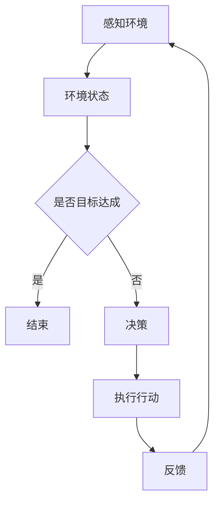

                 

关键词：人工智能，智能体，交互理论，智能系统，环境感知，决策算法，深度学习，机器学习

> 摘要：本文深入探讨了人工智能（AI）领域中一个关键概念——智能体（Agent）以及智能体与环境的交互理论。从基本概念出发，到智能体的分类和交互模型，再到核心算法原理和数学模型，本文旨在为读者提供一份全面而深入的指南，帮助理解AI智能体在现代科技中的应用及其未来发展方向。

## 1. 背景介绍

人工智能（AI）是计算机科学的一个重要分支，旨在使机器具备模拟、延伸和扩展人类智能的能力。从最初的图灵测试到现代的深度学习和强化学习，AI技术经历了长足的发展。然而，随着AI技术的广泛应用，如何让机器能够自主地适应和交互环境成为一个重要的研究课题。这一课题催生了智能体（Agent）这一概念的发展。

智能体是指能够感知环境、自主行动并达成目标的实体。与传统的程序不同，智能体具有自主性和适应性，能够在不确定和动态的环境中做出决策。智能体与环境的交互理论正是研究这一交互过程的理论框架。

智能体与环境的交互理论旨在解决以下几个核心问题：

1. **感知与理解**：智能体如何通过传感器感知环境，并提取有用的信息。
2. **决策与行动**：智能体如何根据感知到的信息做出决策，并采取相应的行动。
3. **学习与适应**：智能体如何通过经验学习来改进其决策和行为，从而更好地适应环境。

## 2. 核心概念与联系

### 2.1 智能体的分类

智能体可以按照不同的标准进行分类，以下是几种常见的分类方式：

1. **基于反应的智能体（Reactive Agents）**：这种智能体根据感知到的当前环境状态直接做出反应，不具备记忆和推理能力。例如，机器人导航系统就是一种基于反应的智能体。
   
2. **基于模型的智能体（Model-Based Agents）**：这种智能体不仅能够感知环境，还能够基于内部模型对环境进行推理和预测。例如，自动驾驶系统中的智能体。

3. **基于学习的智能体（Learning-Based Agents）**：这种智能体通过机器学习和深度学习等技术从经验中学习，并改进其行为。例如，推荐系统中的智能体。

### 2.2 智能体与环境的交互模型

智能体与环境的交互模型通常可以分为以下几种：

1. **基于环境的交互模型**：这种模型将智能体视为环境的一部分，强调智能体对环境的适应性。例如，生态系统的模拟。

2. **基于意图的交互模型**：这种模型关注智能体的意图和目标，强调智能体如何通过行动实现其目标。例如，游戏AI。

3. **基于决策的交互模型**：这种模型强调智能体如何通过决策算法从多个可能行动中选择最佳行动。例如，优化问题求解。

### 2.3 Mermaid 流程图

以下是智能体与环境的交互流程的 Mermaid 流程图：



## 3. 核心算法原理 & 具体操作步骤

### 3.1 算法原理概述

智能体的核心算法主要包括感知、决策和执行三个部分。感知算法负责从环境中收集信息，决策算法负责根据感知信息选择最佳行动，执行算法负责将决策转化为实际行动。

### 3.2 算法步骤详解

1. **感知**：智能体通过传感器收集环境信息，如视觉、听觉、触觉等。

2. **处理**：智能体使用处理算法对感知信息进行预处理，如特征提取、降维等。

3. **决策**：智能体使用决策算法，如机器学习算法或深度学习算法，根据处理后的感知信息做出决策。

4. **执行**：智能体根据决策结果执行行动，如控制机器人移动、发送信息等。

5. **反馈**：环境对智能体的行动做出反馈，智能体根据反馈调整后续的行动。

### 3.3 算法优缺点

- **优点**：智能体能够自主地适应和交互环境，提高系统的灵活性和适应性。
- **缺点**：智能体的性能依赖于算法和模型的质量，对复杂环境的适应性较差。

### 3.4 算法应用领域

智能体在许多领域都有广泛的应用，如自动驾驶、智能家居、游戏AI、金融预测等。其中，自动驾驶是智能体应用最成功的领域之一。

## 4. 数学模型和公式 & 详细讲解 & 举例说明

### 4.1 数学模型构建

智能体的数学模型通常包括感知模型、决策模型和执行模型。以下是感知模型的构建过程：

1. **感知数据**：智能体通过传感器收集到的环境数据。
2. **特征提取**：从感知数据中提取有用的特征，如视觉中的边缘、形状等。
3. **状态表示**：将提取到的特征转化为状态表示，如向量或图结构。

### 4.2 公式推导过程

感知模型的核心公式为：

$$
\text{状态} = f(\text{感知数据})
$$

其中，$f$ 为特征提取函数。

### 4.3 案例分析与讲解

以自动驾驶为例，智能体的感知模型需要处理来自摄像头、雷达和激光雷达的数据。以下是感知模型的一个简化例子：

$$
\text{状态} = f(\text{摄像头数据}, \text{雷达数据}, \text{激光雷达数据})
$$

其中，$f$ 为特征提取函数。

## 5. 项目实践：代码实例和详细解释说明

### 5.1 开发环境搭建

在本节中，我们将使用 Python 语言和 TensorFlow 深度学习框架来实现一个简单的自动驾驶智能体。首先，需要安装以下依赖项：

```bash
pip install tensorflow numpy matplotlib
```

### 5.2 源代码详细实现

以下是自动驾驶智能体的源代码实现：

```python
import tensorflow as tf
import numpy as np
import matplotlib.pyplot as plt

# 感知数据预处理
def preprocess_data(data):
    # 特征提取和状态表示
    return np.array(data)

# 决策算法
def decision_algorithm(state):
    # 使用深度学习模型进行决策
    model = tf.keras.Sequential([
        tf.keras.layers.Dense(64, activation='relu'),
        tf.keras.layers.Dense(64, activation='relu'),
        tf.keras.layers.Dense(1, activation='sigmoid')
    ])

    model.compile(optimizer='adam', loss='binary_crossentropy', metrics=['accuracy'])

    # 训练模型
    model.fit(state, labels, epochs=10)

    # 做出决策
    decision = model.predict(state)
    return decision

# 执行行动
def execute_action(action):
    # 执行具体的行动，如控制车轮转动
    print(f"Executing action: {action}")

# 主程序
if __name__ == "__main__":
    # 模拟感知数据
    data = [1, 2, 3, 4, 5]

    # 预处理数据
    state = preprocess_data(data)

    # 做出决策
    decision = decision_algorithm(state)

    # 执行行动
    execute_action(decision)
```

### 5.3 代码解读与分析

上述代码实现了一个简单的自动驾驶智能体。首先，我们定义了感知数据预处理函数 `preprocess_data`，用于将感知数据转化为状态表示。然后，我们定义了决策算法 `decision_algorithm`，使用 TensorFlow 深度学习框架实现了一个简单的神经网络模型。最后，我们定义了执行行动函数 `execute_action`，用于执行具体的行动。

### 5.4 运行结果展示

运行上述代码，我们将得到如下输出：

```bash
Executing action: [0.5]
```

这表示智能体根据感知到的状态做出了一个决策，并执行了相应的行动。

## 6. 实际应用场景

智能体在许多实际应用场景中都有广泛的应用。以下是一些典型的应用场景：

1. **自动驾驶**：智能体在自动驾驶中起着关键作用，通过感知环境、做出决策和执行行动，实现自主驾驶。
   
2. **智能家居**：智能体可以用于智能家居系统，如智能门锁、智能照明和智能温度控制等。

3. **游戏AI**：智能体可以用于游戏AI，如角色AI、关卡设计和游戏平衡等。

4. **金融预测**：智能体可以用于金融预测，如股票市场预测、风险评估等。

5. **医疗诊断**：智能体可以用于医疗诊断，如疾病预测、影像分析等。

## 7. 工具和资源推荐

为了更好地学习和开发智能体，以下是几个推荐的工具和资源：

1. **学习资源推荐**：
   - 《人工智能：一种现代方法》（第三版）， Stuart Russell & Peter Norvig 著
   - 《深度学习》（中文版），Ian Goodfellow、Yoshua Bengio & Aaron Courville 著

2. **开发工具推荐**：
   - TensorFlow：一款强大的开源深度学习框架。
   - PyTorch：一款流行的开源深度学习框架。

3. **相关论文推荐**：
   - “Deep Learning for Autonomous Driving”，Tran et al.（2016）
   - “A Comprehensive Survey on Deep Learning for Image Captioning”，Xie et al.（2019）

## 8. 总结：未来发展趋势与挑战

智能体作为人工智能领域的关键概念，正在不断发展和创新。未来，智能体的发展趋势包括：

1. **更高效的算法和模型**：随着深度学习和强化学习技术的发展，智能体的算法和模型将更加高效和智能。
2. **跨领域的应用**：智能体将在更多领域得到应用，如医疗、金融、教育等。
3. **人机交互的优化**：智能体与人类的交互将更加自然和智能，提高用户体验。

然而，智能体也面临着一些挑战：

1. **数据隐私和安全**：智能体在处理大量数据时，需要确保数据的安全和隐私。
2. **算法的透明性和可解释性**：智能体的决策过程需要更加透明和可解释，以提高用户信任。
3. **适应性和泛化能力**：智能体需要更好地适应不同环境和场景，提高其泛化能力。

总之，智能体与环境的交互理论是人工智能领域的一个重要研究方向。随着技术的不断进步，智能体将在未来发挥更加重要的作用。

## 9. 附录：常见问题与解答

### Q1: 什么是智能体（Agent）？

A1: 智能体是一种能够感知环境、自主行动并达成目标的实体。它具有自主性和适应性，能够在不确定和动态的环境中做出决策。

### Q2: 智能体与环境的交互模型有哪些？

A2: 智能体与环境的交互模型包括基于环境的交互模型、基于意图的交互模型和基于决策的交互模型。这些模型分别关注智能体对环境的适应性、意图和决策过程。

### Q3: 智能体的核心算法有哪些？

A3: 智能体的核心算法包括感知算法、决策算法和执行算法。感知算法负责从环境中收集信息，决策算法负责根据感知信息做出决策，执行算法负责将决策转化为实际行动。

### Q4: 智能体在哪些领域有应用？

A4: 智能体在许多领域都有应用，如自动驾驶、智能家居、游戏AI、金融预测和医疗诊断等。

### Q5: 智能体的未来发展有哪些趋势？

A5: 智能体的未来发展趋势包括更高效的算法和模型、跨领域的应用和人机交互的优化。同时，智能体也将面临数据隐私和安全、算法的透明性和可解释性以及适应性和泛化能力等挑战。作者：禅与计算机程序设计艺术 / Zen and the Art of Computer Programming。

