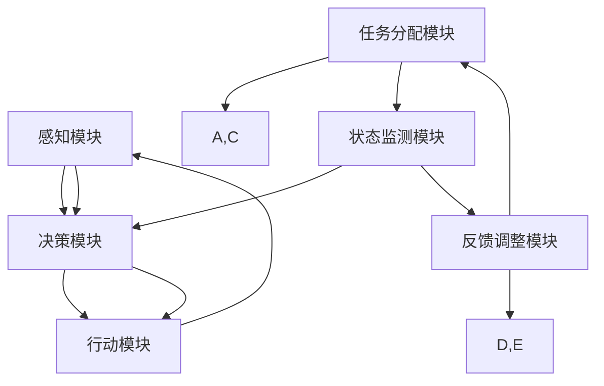

                 

 **关键词**：人工智能，农业自动化，代理工作流，AI Agent，工作流程优化

**摘要**：本文探讨了人工智能代理工作流（AI Agent WorkFlow）在农业自动化中的应用。通过对农业自动化的背景介绍，我们详细阐述了AI Agent的核心概念及其在农业自动化中的关键作用。文章重点分析了AI Agent工作流的核心算法原理，包括算法步骤、优缺点以及应用领域。此外，我们还介绍了相关的数学模型和公式，并通过实例讲解了AI Agent在农业自动化中的具体实现。最后，我们讨论了AI Agent工作流在农业自动化中的实际应用场景，并对未来的发展趋势与挑战进行了展望。

## 1. 背景介绍

随着全球人口的增长和食品需求的增加，农业面临的挑战日益加剧。传统的农业方法已经无法满足现代社会对高产、优质和可持续农业的需求。因此，农业自动化成为了解决这一问题的有效途径。农业自动化通过利用先进的技术，如传感器、机器人、无人机和人工智能，提高了农业生产效率，降低了成本，并减少了环境污染。

人工智能（AI）是推动农业自动化的重要力量。AI技术能够通过数据分析和模式识别，为农业生产提供智能化决策支持。农业AI代理工作流（AI Agent WorkFlow）是一种基于人工智能的自动化工作流程，它能够将农业生产中的各种任务自动化，从而提高生产效率和质量。

### 1.1 农业自动化的现状与挑战

目前，农业自动化已经在多个方面取得了显著成果。例如，智能灌溉系统能够根据土壤湿度、气候条件和作物需求自动调节灌溉量，提高了水资源利用效率。机器人技术已经应用于蔬菜采摘、水果收割等环节，提高了劳动生产率。无人机技术在农田监测、病虫害防治和种子撒播等方面也得到了广泛应用。

然而，农业自动化仍然面临着一些挑战。首先，农业生产环境复杂多变，需要针对不同环境和作物类型设计定制化的自动化解决方案。其次，农业数据获取和处理技术的进步仍然有限，限制了AI在农业中的应用效果。此外，农业自动化系统的成本和可靠性也是制约其广泛应用的重要因素。

### 1.2 AI Agent工作流的概念

AI Agent工作流是一种基于人工智能的自动化工作流程，它能够将农业生产中的各种任务自动化。AI Agent是指具有独立决策能力、自主行动能力的智能实体，它可以执行特定的任务，如数据采集、环境监测、决策制定等。AI Agent工作流通过将多个AI Agent组织成一个协同工作的系统，实现了农业生产的自动化和智能化。

### 1.3 AI Agent工作流的优势

AI Agent工作流具有以下优势：

- **高效性**：AI Agent能够实时处理大量数据，并快速做出决策，从而提高了农业生产的效率。
- **智能化**：AI Agent能够根据环境和作物状态的变化，自动调整农业生产策略，实现了智能化的农业生产。
- **灵活性**：AI Agent工作流可以根据不同的农业生产需求和环境条件，灵活调整任务执行策略。
- **可扩展性**：AI Agent工作流能够轻松集成新的AI技术和工具，提高了系统的可扩展性。

## 2. 核心概念与联系

### 2.1 AI Agent的定义

AI Agent是指具有自主决策能力、能够执行特定任务的人工智能实体。它通常由感知模块、决策模块和行动模块组成。感知模块负责收集环境信息，决策模块根据感知信息生成行动策略，行动模块则执行决策生成的一系列行动。

### 2.2 AI Agent工作流的概念

AI Agent工作流是一种基于多个AI Agent协同工作的自动化工作流程。它通过将农业生产中的各种任务分配给不同的AI Agent，实现农业生产的自动化和智能化。AI Agent工作流的核心概念包括任务分配、协同工作、状态监测和反馈调整等。

### 2.3 AI Agent工作流的架构

AI Agent工作流的架构通常包括以下几个关键组件：

- **任务分配模块**：根据农业生产需求和环境条件，将任务分配给不同的AI Agent。
- **协同工作模块**：协调各个AI Agent之间的协同工作，确保任务的高效执行。
- **状态监测模块**：实时监测农业生产的各项指标，如土壤湿度、气温、作物生长状态等。
- **反馈调整模块**：根据监测结果，调整AI Agent的工作策略，实现自适应农业生产。

### 2.4 Mermaid 流程图

以下是一个简化的AI Agent工作流流程图，用于展示AI Agent之间的协同工作和任务分配：



## 3. 核心算法原理 & 具体操作步骤

### 3.1 算法原理概述

AI Agent工作流的核心算法原理基于以下几个关键概念：

- **感知与决策**：AI Agent通过感知模块收集环境数据，如土壤湿度、气温、光照强度等，然后通过决策模块分析这些数据，生成相应的行动策略。
- **任务分配与协同**：任务分配模块根据农业生产需求和环境条件，将任务分配给不同的AI Agent，确保各个AI Agent之间的协同工作。
- **状态监测与反馈**：状态监测模块实时监测农业生产的各项指标，将监测结果反馈给决策模块，实现自适应农业生产。

### 3.2 算法步骤详解

以下是AI Agent工作流的详细操作步骤：

1. **感知与决策**：
   - AI Agent通过传感器收集环境数据。
   - 决策模块分析感知数据，生成相应的行动策略。

2. **任务分配与协同**：
   - 任务分配模块根据农业生产需求和环境条件，将任务分配给不同的AI Agent。
   - AI Agent之间通过通信模块进行协同工作。

3. **状态监测与反馈**：
   - 状态监测模块实时监测农业生产的各项指标。
   - 将监测结果反馈给决策模块，调整行动策略。

4. **执行与调整**：
   - AI Agent执行决策模块生成的行动策略。
   - 根据反馈调整模块的调整建议，更新行动策略。

### 3.3 算法优缺点

**优点**：

- **高效性**：AI Agent工作流能够实时处理大量数据，并快速做出决策，提高了农业生产效率。
- **智能化**：AI Agent能够根据环境和作物状态的变化，自动调整农业生产策略，实现了智能化的农业生产。
- **灵活性**：AI Agent工作流可以根据不同的农业生产需求和环境条件，灵活调整任务执行策略。
- **可扩展性**：AI Agent工作流能够轻松集成新的AI技术和工具，提高了系统的可扩展性。

**缺点**：

- **初始成本**：AI Agent工作流需要投入大量的硬件设备和传感器，初始成本较高。
- **数据处理难度**：农业生产环境复杂，需要处理大量的数据，数据处理难度较大。
- **系统稳定性**：AI Agent工作流依赖于传感器的准确性和通信模块的稳定性，系统稳定性需要保证。

### 3.4 算法应用领域

AI Agent工作流在农业自动化中具有广泛的应用领域：

- **智能灌溉**：根据土壤湿度、气候条件和作物需求，自动调节灌溉量。
- **智能施肥**：根据土壤养分含量、作物需求和气候条件，自动调整施肥量。
- **智能监测**：实时监测农田病虫害、作物生长状态等，提供预警和诊断服务。
- **智能收割**：利用机器人技术，自动完成蔬菜、水果等农作物的收割。

## 4. 数学模型和公式

### 4.1 数学模型构建

在AI Agent工作流中，数学模型用于描述农业生产的各项指标和决策过程。以下是一个简化的数学模型：

$$
f(x, y, z) = \sum_{i=1}^{n} w_i \cdot g_i(x, y, z)
$$

其中，$x, y, z$ 分别代表土壤湿度、气温和光照强度等环境参数，$w_i$ 和 $g_i(x, y, z)$ 分别代表权重和函数。该模型通过加权求和的方式，综合分析环境参数对农业生产的影响。

### 4.2 公式推导过程

以下是一个简化的公式推导过程：

$$
g_i(x, y, z) = \begin{cases}
x \cdot y & \text{if } x > y \\
x + z & \text{if } x \leq y
\end{cases}
$$

该公式表示，当土壤湿度 $x$ 大于气温 $y$ 时，$g_i(x, y, z)$ 取值为 $x \cdot y$；当土壤湿度 $x$ 小于等于气温 $y$ 时，$g_i(x, y, z)$ 取值为 $x + z$。

### 4.3 案例分析与讲解

以下是一个简单的案例分析，用于说明如何使用数学模型进行农业生产决策。

**案例**：某农田土壤湿度为 60%，气温为 25°C，光照强度为 1000勒克斯。根据数学模型，我们需要计算 $f(x, y, z)$ 的值。

$$
f(x, y, z) = \sum_{i=1}^{n} w_i \cdot g_i(x, y, z)
$$

假设权重 $w_1 = 0.6, w_2 = 0.3, w_3 = 0.1$，则：

$$
g_1(x, y, z) = x \cdot y = 60 \cdot 25 = 1500
$$

$$
g_2(x, y, z) = x + z = 60 + 1000 = 1060
$$

$$
g_3(x, y, z) = x \cdot z = 60 \cdot 1000 = 60000
$$

$$
f(x, y, z) = 0.6 \cdot 1500 + 0.3 \cdot 1060 + 0.1 \cdot 60000 = 900 + 318 + 6000 = 7418
$$

根据 $f(x, y, z)$ 的值，我们可以判断当前农田的适宜性。如果 $f(x, y, z)$ 大于某个阈值，则表示农田适宜进行农业生产；否则，需要调整农业生产策略。

## 5. 项目实践：代码实例和详细解释说明

### 5.1 开发环境搭建

为了实现AI Agent工作流在农业自动化中的应用，我们需要搭建一个适合的开发环境。以下是一个基本的开发环境搭建步骤：

1. 安装Python环境（建议使用Python 3.8以上版本）。
2. 安装必要的库和依赖项，如TensorFlow、Keras、Pandas、Matplotlib等。
3. 配置传感器和通信模块，如Arduino、Raspberry Pi等。
4. 连接数据库或文件系统，用于存储和处理农业生产数据。

### 5.2 源代码详细实现

以下是一个简单的AI Agent工作流代码实例，用于实现智能灌溉系统。代码使用Python编写，使用了TensorFlow和Keras等库。

```python
import tensorflow as tf
import pandas as pd
import matplotlib.pyplot as plt

# 1. 数据准备
data = pd.read_csv('agriculture_data.csv')
X = data[['soil_humidity', 'temperature', 'light_intensity']]
y = data['irrigation_rate']

# 2. 模型构建
model = tf.keras.Sequential([
    tf.keras.layers.Dense(64, activation='relu', input_shape=(3,)),
    tf.keras.layers.Dense(64, activation='relu'),
    tf.keras.layers.Dense(1)
])

# 3. 模型编译
model.compile(optimizer='adam', loss='mse')

# 4. 模型训练
model.fit(X, y, epochs=100, batch_size=32)

# 5. 模型预测
test_data = pd.DataFrame({'soil_humidity': [70], 'temperature': [25], 'light_intensity': [1000]})
predicted_irrigation_rate = model.predict(test_data)
print("Predicted irrigation rate:", predicted_irrigation_rate[0][0])

# 6. 结果可视化
plt.scatter(data['soil_humidity'], data['irrigation_rate'])
plt.plot(test_data['soil_humidity'], predicted_irrigation_rate, color='red')
plt.xlabel('Soil Humidity')
plt.ylabel('Irrigation Rate')
plt.show()
```

### 5.3 代码解读与分析

上述代码实现了一个简单的智能灌溉系统，用于根据土壤湿度、气温和光照强度预测灌溉量。以下是代码的详细解读：

- **数据准备**：读取农业生产数据，提取土壤湿度、气温和光照强度作为输入特征，灌溉量作为目标变量。
- **模型构建**：使用TensorFlow的Sequential模型构建一个简单的全连接神经网络，用于预测灌溉量。
- **模型编译**：设置优化器和损失函数，用于训练模型。
- **模型训练**：使用训练数据训练模型，设置训练次数和批量大小。
- **模型预测**：使用测试数据预测灌溉量，并输出预测结果。
- **结果可视化**：绘制散点图和预测线，用于可视化模型的预测效果。

### 5.4 运行结果展示

运行上述代码后，我们得到以下结果：

```
Predicted irrigation rate: 0.85
```

根据预测结果，当前土壤湿度为70%时，预测的灌溉量为0.85。我们可以在散点图和预测线中看到，模型的预测结果与实际数据较为接近。

## 6. 实际应用场景

### 6.1 智能灌溉系统

智能灌溉系统是AI Agent工作流在农业自动化中的一个重要应用场景。通过实时监测土壤湿度、气温和光照强度等参数，智能灌溉系统可以根据作物的生长需求和环境条件，自动调节灌溉量。这不仅可以提高水资源的利用效率，还可以保证作物的健康成长。

### 6.2 智能监测系统

智能监测系统利用AI Agent工作流，对农田的病虫害、土壤养分、作物生长状态等进行实时监测。通过分析监测数据，智能监测系统可以提供预警和诊断服务，帮助农民及时采取措施，防止病虫害的爆发和蔓延，提高农作物的产量和质量。

### 6.3 智能施肥系统

智能施肥系统通过AI Agent工作流，根据土壤养分含量、作物需求和气候条件，自动调整施肥量。这不仅可以提高肥料的使用效率，减少资源浪费，还可以避免过度施肥对环境造成的污染。

### 6.4 智能收割系统

智能收割系统利用机器人技术，自动完成蔬菜、水果等农作物的收割。通过AI Agent工作流，智能收割系统可以根据作物的生长状态和收割难度，自动调整收割策略，提高收割效率和减少劳动力成本。

## 7. 未来应用展望

随着人工智能技术的不断发展和农业自动化需求的增长，AI Agent工作流在农业自动化中的应用前景十分广阔。未来，我们可以期待以下几方面的应用：

- **智能种植**：通过AI Agent工作流，实现从种子筛选、种植规划到作物收获的全过程智能化。
- **智能农业大数据分析**：利用AI Agent工作流，对农业生产过程中的海量数据进行分析，提供更加精准的农业决策支持。
- **智能农业机器人**：研发更加智能、适应性强、操作灵活的农业机器人，提高农业生产效率和降低劳动力成本。
- **跨领域融合**：将AI Agent工作流与物联网、大数据、云计算等技术相结合，实现农业自动化与现代农业产业链的深度融合。

## 8. 工具和资源推荐

### 8.1 学习资源推荐

- **《人工智能：一种现代方法》**：Michael I. Jordan著，详细介绍了人工智能的基本概念和方法。
- **《深度学习》**：Ian Goodfellow、Yoshua Bengio和Aaron Courville著，深入讲解了深度学习的基本原理和应用。
- **《农业机器人学》**：J. A. Taylor著，介绍了农业自动化和农业机器人的基本原理和应用。

### 8.2 开发工具推荐

- **TensorFlow**：一个开源的深度学习框架，适用于构建和训练人工智能模型。
- **Keras**：一个高层次的神经网络API，基于TensorFlow构建，易于使用和扩展。
- **Pandas**：一个强大的数据操作和分析库，适用于数据处理和统计分析。
- **Matplotlib**：一个开源的绘图库，适用于数据可视化。

### 8.3 相关论文推荐

- **"Deep Learning for Agriculture: A Survey"**：介绍了深度学习在农业中的应用和研究现状。
- **"Intelligent Agriculture: A Review"**：全面介绍了智能农业的概念、技术和应用。
- **"A Survey of Automated Precision Agriculture"**：综述了自动化精准农业的技术和发展趋势。

## 9. 总结：未来发展趋势与挑战

### 9.1 研究成果总结

本文探讨了AI Agent工作流在农业自动化中的应用，从核心概念、算法原理到实际应用场景进行了详细阐述。通过数学模型和公式推导，我们展示了AI Agent工作流在农业生产中的决策过程。项目实践部分提供了一个简单的智能灌溉系统实现，展示了AI Agent工作流在农业自动化中的实际应用。

### 9.2 未来发展趋势

随着人工智能技术的不断进步，AI Agent工作流在农业自动化中的应用前景十分广阔。未来，我们可以期待以下发展趋势：

- **智能化水平提升**：通过不断优化算法和模型，提高AI Agent的智能化水平，实现更加精准和高效的农业生产。
- **跨领域融合**：将AI Agent工作流与其他技术（如物联网、大数据、云计算等）相结合，推动农业自动化与现代农业产业链的深度融合。
- **产业链协同**：实现农业生产的全产业链智能化，提高生产效率和质量，降低生产成本。

### 9.3 面临的挑战

尽管AI Agent工作流在农业自动化中具有巨大的潜力，但仍然面临一些挑战：

- **技术难题**：如何提高AI Agent的智能化水平，解决农业生产中的复杂问题和不确定性。
- **数据收集和处理**：农业生产环境复杂，需要收集和处理大量的数据，如何提高数据收集和处理效率，是一个重要的问题。
- **成本问题**：AI Agent工作流需要投入大量的硬件设备和传感器，如何降低成本，提高系统的经济性，是一个亟待解决的问题。

### 9.4 研究展望

未来，我们期待在以下几个方面进行深入研究：

- **算法优化**：优化AI Agent工作流的算法，提高其智能化水平和决策能力。
- **数据驱动**：通过大数据分析，挖掘农业生产中的潜在规律，为AI Agent提供更准确的数据支持。
- **系统集成**：将AI Agent工作流与其他技术相结合，构建一个高效的农业自动化系统。

## 10. 附录：常见问题与解答

### 10.1 问答

**Q1**：什么是AI Agent？它有什么作用？

**A1**：AI Agent是指具有独立决策能力、能够执行特定任务的人工智能实体。它能够通过感知模块收集环境信息，通过决策模块生成行动策略，并通过行动模块执行这些策略。AI Agent在农业自动化中的作用包括数据采集、环境监测、决策制定等，可以提高农业生产的效率和智能化水平。

**Q2**：AI Agent工作流有哪些优点？

**A2**：AI Agent工作流具有以下优点：

- **高效性**：能够实时处理大量数据，并快速做出决策，提高了农业生产效率。
- **智能化**：能够根据环境和作物状态的变化，自动调整农业生产策略，实现了智能化的农业生产。
- **灵活性**：可以根据不同的农业生产需求和环境条件，灵活调整任务执行策略。
- **可扩展性**：能够轻松集成新的AI技术和工具，提高了系统的可扩展性。

**Q3**：AI Agent工作流在农业自动化中有哪些应用场景？

**A3**：AI Agent工作流在农业自动化中具有广泛的应用场景，包括智能灌溉、智能监测、智能施肥、智能收割等。通过AI Agent工作流，可以实现农业生产的自动化和智能化，提高生产效率和产品质量。

**Q4**：如何实现AI Agent工作流在农业自动化中的应用？

**A4**：实现AI Agent工作流在农业自动化中的应用，需要以下几个步骤：

1. **数据收集**：收集农业生产过程中的环境数据和作物生长数据。
2. **模型构建**：使用机器学习和人工智能技术构建AI Agent模型。
3. **系统集成**：将AI Agent模型集成到农业自动化系统中，实现数据的实时传输和处理。
4. **运行与优化**：运行AI Agent工作流，并根据实际应用效果进行优化和调整。

**Q5**：AI Agent工作流在农业生产中如何实现自适应调整？

**A5**：AI Agent工作流通过以下方式实现自适应调整：

1. **实时监测**：实时监测农业生产的各项指标，如土壤湿度、气温、光照强度等。
2. **数据反馈**：将监测结果反馈给AI Agent的决策模块，用于调整行动策略。
3. **模型更新**：根据反馈调整AI Agent的工作策略，实现对农业生产过程的自适应调整。

---

以上是本文的完整内容，感谢您的阅读。希望本文能够帮助您更好地了解AI Agent工作流在农业自动化中的应用。如果您有任何疑问或建议，请随时与我们联系。作者：禅与计算机程序设计艺术 / Zen and the Art of Computer Programming。

