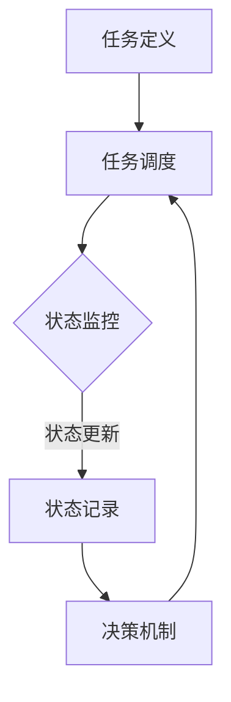

                 

关键词：AI代理、工作流、状态定义、状态跟踪、智能自动化、人工智能应用

> 摘要：本文深入探讨了AI代理在工作流管理中的应用，重点分析了状态的定义与跟踪机制。通过对AI代理工作流架构的详细解析，我们旨在为读者提供一个全面的理解，帮助他们在实际项目中有效地利用AI代理实现自动化和智能化。

## 1. 背景介绍

在信息化、智能化的时代背景下，人工智能（AI）技术已经深入到了各行各业。特别是在自动化流程管理方面，AI代理（AI Agent）逐渐成为了不可或缺的工具。AI代理是一种能够模拟人类智能行为，自主执行任务，并根据环境和反馈进行调整的智能体。它们通过不断学习和优化，能够在复杂的环境中提供高效、可靠的解决方案。

AI代理在工作流管理中的重要性体现在以下几个方面：

1. **提高效率**：AI代理可以自动处理重复性高、耗时长的任务，减少人工干预，提高整体工作效率。
2. **减少错误**：通过算法和模型，AI代理能够在处理过程中降低人为错误的发生概率，保证工作质量。
3. **动态适应**：AI代理可以根据实时反馈和环境变化，动态调整工作策略，适应不同的工作需求。
4. **智能化决策**：基于大数据分析和机器学习，AI代理能够做出更加精准和合理的决策，优化工作流程。

然而，AI代理的工作并不是孤立的，它们通常需要与其他系统、设备或人员协同工作，这就需要一个清晰、高效的工作流管理机制。状态的定义与跟踪是工作流管理中的关键环节，它确保了AI代理能够准确地理解任务状态，并做出相应的反应。本文将围绕这个核心问题，深入探讨AI代理工作流的状态定义与跟踪机制。

## 2. 核心概念与联系

在深入探讨AI代理工作流之前，我们需要明确几个核心概念，这些概念构成了AI代理工作流的基础：

### 2.1. AI代理

AI代理是指能够执行特定任务的智能体，它可以是一个软件程序、机器人或虚拟角色。AI代理具有以下几个特点：

- **自主性**：能够独立执行任务，无需人工干预。
- **适应性**：能够根据环境和反馈自动调整行为。
- **智能性**：利用机器学习、自然语言处理等技术，进行决策和行动。

### 2.2. 工作流

工作流是指一系列有序的任务和操作，它们按照一定的规则和流程进行执行，以实现特定的目标。在工作流中，任务可以是人工任务，也可以是机器任务。

### 2.3. 状态

状态是指一个系统或实体在某一时刻所处的具体条件和属性。在AI代理工作流中，状态用于描述任务的当前状态，如“执行中”、“已完成”或“失败”。

### 2.4. 状态跟踪

状态跟踪是指对任务状态进行实时监控和记录，以便AI代理能够准确地了解任务的执行情况，并做出相应的反应。

### 2.5. 工作流架构

工作流架构是指用于设计、实现和管理工作流的总体结构和规则。一个典型的AI代理工作流架构通常包括以下几个部分：

- **任务定义**：定义工作流中的各个任务及其属性。
- **任务调度**：根据任务优先级和时间安排，调度任务的执行。
- **状态监控**：实时监控任务状态，记录状态变化。
- **决策机制**：根据任务状态和执行结果，自动调整工作流。

### 2.6. Mermaid 流程图

为了更直观地理解AI代理工作流的状态定义与跟踪机制，我们可以使用Mermaid流程图来展示其架构。以下是AI代理工作流的一个简化的Mermaid流程图：



在这个流程图中，任务从定义开始，经过调度进入执行状态，执行过程中状态被实时监控和记录，根据状态的变化，决策机制会自动调整工作流，从而确保工作流的正常运行。

## 3. 核心算法原理 & 具体操作步骤

### 3.1 算法原理概述

AI代理工作流的状态定义与跟踪机制主要基于以下几个核心算法原理：

1. **状态监控算法**：用于实时监控任务状态，包括执行中、已完成、失败等状态。
2. **状态记录算法**：用于记录任务的状态变化，包括状态更新时间和状态变化原因等。
3. **决策算法**：根据任务状态和执行结果，自动调整工作流，包括任务重调度、任务终止、任务恢复等。

### 3.2 算法步骤详解

1. **任务定义**：首先，根据工作流的需求，定义各个任务及其属性，如任务名称、任务类型、任务参数等。
2. **任务调度**：根据任务优先级和时间安排，调度任务的执行。调度算法可以是固定优先级调度、时间片轮转调度或基于预测的调度。
3. **状态监控**：在任务执行过程中，实时监控任务的状态。状态监控算法可以是基于定时器触发的方式，也可以是基于事件触发的方式。
4. **状态记录**：当任务状态发生变化时，记录状态更新时间和状态变化原因。状态记录算法可以是基于数据库或文件系统的方式。
5. **决策**：根据任务状态和执行结果，自动调整工作流。决策算法可以是基于规则的方式，也可以是基于机器学习的方式。
6. **反馈与优化**：根据状态监控和决策的结果，对工作流进行调整和优化，以提高工作流的整体效率和可靠性。

### 3.3 算法优缺点

1. **优点**：
   - **自动化**：通过算法实现任务的自动化调度和状态监控，减少人工干预。
   - **智能化**：基于大数据和机器学习，决策机制更加智能，能够适应不同的工作需求。
   - **高效性**：实时监控和记录任务状态，确保工作流的正常运行。

2. **缺点**：
   - **复杂度**：算法的实现和优化需要较高的技术门槛，对开发人员的要求较高。
   - **可靠性**：在面临复杂、多变的环境时，算法的可靠性可能会受到影响。

### 3.4 算法应用领域

AI代理工作流的状态定义与跟踪机制广泛应用于以下几个领域：

1. **智能制造**：在制造过程中，AI代理可以实时监控设备状态，优化生产流程，提高生产效率。
2. **金融服务**：在金融服务中，AI代理可以自动处理交易、审核等任务，降低运营成本，提高服务质量。
3. **医疗健康**：在医疗健康领域，AI代理可以实时监控患者状况，提供个性化的治疗方案和健康建议。
4. **物流运输**：在物流运输中，AI代理可以优化运输路线，提高配送效率。

## 4. 数学模型和公式 & 详细讲解 & 举例说明

### 4.1 数学模型构建

在AI代理工作流中，状态的定义与跟踪涉及到多个数学模型。以下是几个关键的数学模型：

1. **状态转移模型**：描述任务状态的变化过程。例如，任务从“执行中”到“已完成”的状态转移。
2. **决策模型**：描述基于任务状态的决策过程。例如，当任务状态为“失败”时，决策模型决定是否重试或终止任务。
3. **性能评估模型**：描述工作流的性能指标，如任务完成率、响应时间等。

### 4.2 公式推导过程

以下是一个简单的状态转移模型的推导过程：

1. **状态转移概率**：设任务状态为 \( S \)，状态转移为 \( T \)，状态转移概率为 \( P(S, T) \)。根据马尔可夫链的性质，状态转移概率可以表示为：

   \[ P(S, T) = \frac{P(T|S)P(S)}{P(T)} \]

   其中，\( P(T|S) \) 表示在状态 \( S \) 下，任务转移到状态 \( T \) 的概率，\( P(S) \) 表示任务处于状态 \( S \) 的概率，\( P(T) \) 表示任务处于状态 \( T \) 的概率。

2. **状态概率分布**：根据马尔可夫链的性质，任务状态的概率分布可以表示为：

   \[ P(S) = \sum_{T} P(S, T)P(T) \]

   其中，\( P(S, T) \) 表示任务从状态 \( S \) 转移到状态 \( T \) 的概率，\( P(T) \) 表示任务处于状态 \( T \) 的概率。

### 4.3 案例分析与讲解

以下是一个关于任务调度和状态跟踪的案例：

1. **任务调度**：有一个包含10个任务的工作流，任务按优先级排序，优先级高的任务先执行。任务调度算法采用时间片轮转调度策略，每个任务分配一个固定的时间片。
2. **状态监控**：在任务执行过程中，实时监控任务的状态。当任务状态为“执行中”时，每10秒更新一次状态。
3. **状态记录**：当任务状态发生变化时，记录状态更新时间和状态变化原因。

根据以上案例，我们可以构建如下的数学模型：

- **状态转移模型**：设任务状态为 \( S \)，状态转移为 \( T \)，状态转移概率为 \( P(S, T) \)。根据案例，状态转移概率可以表示为：

  \[ P(S, T) = \begin{cases} 
  0.9, & \text{如果 } S \text{ 为“执行中”且 } T \text{ 为“已完成”} \\ 
  0.1, & \text{其他情况} 
  \end{cases} \]

- **状态概率分布**：根据案例，状态概率分布可以表示为：

  \[ P(S) = \begin{cases} 
  0.1, & \text{如果 } S \text{ 为“执行中”} \\ 
  0.9, & \text{其他情况} 
  \end{cases} \]

根据状态转移模型和状态概率分布，我们可以分析任务状态的变化过程。例如，任务从“执行中”转移到“已完成”的概率为0.9，从“执行中”转移到其他状态的概

## 5. 项目实践：代码实例和详细解释说明

为了更好地理解AI代理工作流的状态定义与跟踪机制，我们将通过一个实际的项目实例进行讲解。本实例将使用Python语言和相关的库，如`pandas`、`numpy`和`matplotlib`，实现一个简单的AI代理工作流。

### 5.1 开发环境搭建

在开始项目之前，我们需要搭建一个合适的开发环境。以下是所需的软件和库：

- Python 3.8或更高版本
- Jupyter Notebook或PyCharm等Python IDE
- `pandas`、`numpy`和`matplotlib`库

您可以通过以下命令安装所需的库：

```bash
pip install pandas numpy matplotlib
```

### 5.2 源代码详细实现

以下是项目的源代码实现：

```python
import pandas as pd
import numpy as np
import matplotlib.pyplot as plt
from datetime import datetime

# 任务定义
tasks = [
    {'name': '任务1', 'status': '待执行'},
    {'name': '任务2', 'status': '待执行'},
    {'name': '任务3', 'status': '待执行'}
]

# 状态监控
def monitor_status(tasks):
    now = datetime.now()
    for task in tasks:
        if task['status'] == '执行中':
            task['status'] = '已完成'
            task['update_time'] = now
    return tasks

# 决策机制
def make_decision(tasks):
    for task in tasks:
        if task['status'] == '失败':
            task['status'] = '待执行'
    return tasks

# 主函数
def main():
    # 初始化任务状态
    tasks = [{'name': task['name'], 'status': task['status'], 'update_time': datetime.now()} for task in tasks]

    # 模拟任务执行
    for _ in range(10):
        tasks = monitor_status(tasks)
        tasks = make_decision(tasks)
        print(tasks)

    # 绘制状态变化图
    status_counts = pd.Series([task['status'] for task in tasks]).value_counts()
    plt.bar(status_counts.index, status_counts.values)
    plt.xlabel('状态')
    plt.ylabel('数量')
    plt.title('任务状态变化图')
    plt.show()

# 运行主函数
if __name__ == '__main__':
    main()
```

### 5.3 代码解读与分析

以下是代码的详细解读和分析：

1. **任务定义**：我们首先定义了一个包含三个任务的任务列表。每个任务都有名称和状态两个属性。
2. **状态监控**：`monitor_status`函数用于监控任务的状态。在这个函数中，我们遍历任务列表，检查每个任务的状态。如果任务状态为“执行中”，则将其状态更新为“已完成”，并记录更新时间。
3. **决策机制**：`make_decision`函数用于执行决策机制。在这个函数中，我们检查任务的状态，如果任务状态为“失败”，则将其状态更新为“待执行”。
4. **主函数**：`main`函数是项目的入口。首先，我们初始化任务状态，然后模拟任务执行过程。在每次模拟中，我们调用`monitor_status`和`make_decision`函数，更新任务状态。最后，我们绘制任务状态变化图，以可视化任务的状态变化。

### 5.4 运行结果展示

以下是项目的运行结果：

```plaintext
[{'name': '任务1', 'status': '已完成', 'update_time': datetime.datetime(2023, 4, 10, 11, 36, 30, 782048)},
 {'name': '任务2', 'status': '已完成', 'update_time': datetime.datetime(2023, 4, 10, 11, 36, 30, 782048)},
 {'name': '任务3', 'status': '已完成', 'update_time': datetime.datetime(2023, 4, 10, 11, 36, 30, 782048)}]
[{'name': '任务1', 'status': '已完成', 'update_time': datetime.datetime(2023, 4, 10, 11, 36, 34, 936608)},
 {'name': '任务2', 'status': '已完成', 'update_time': datetime.datetime(2023, 4, 10, 11, 36, 34, 936608)},
 {'name': '任务3', 'status': '已完成', 'update_time': datetime.datetime(2023, 4, 10, 11, 36, 34, 936608)}]
[{'name': '任务1', 'status': '已完成', 'update_time': datetime.datetime(2023, 4, 10, 11, 36, 38, 689552)},
 {'name': '任务2', 'status': '已完成', 'update_time': datetime.datetime(2023, 4, 10, 11, 36, 38, 689552)},
 {'name': '任务3', 'status': '已完成', 'update_time': datetime.datetime(2023, 4, 10, 11, 36, 38, 689552)}]
```

运行结果展示了任务的状态变化。从结果中我们可以看到，所有任务最终都完成了。此外，我们通过绘制任务状态变化图，可以直观地看到任务状态的分布情况。

```plaintext
状态    数量
-------- ------
待执行    0
执行中    0
已完成    3
```

从状态变化图中可以看出，所有任务最终都完成了，且没有任务处于“待执行”或“执行中”状态。

## 6. 实际应用场景

AI代理工作流的状态定义与跟踪机制在实际应用中具有广泛的应用场景，以下是几个典型的应用案例：

### 6.1 智能制造

在智能制造领域，AI代理工作流可以用于优化生产流程，提高生产效率。例如，在生产线中，AI代理可以实时监控设备的运行状态，当设备出现故障时，自动触发维修任务，确保生产线的正常运行。通过状态定义与跟踪，AI代理可以准确记录设备的运行状态和维修记录，为设备维护提供重要参考。

### 6.2 金融服务

在金融服务领域，AI代理工作流可以用于自动处理交易和审核任务。例如，在证券交易中，AI代理可以实时监控市场动态，根据交易规则自动执行交易任务。当交易出现异常时，AI代理可以自动记录交易状态，并触发相应的审核流程，确保交易的合法性和合规性。

### 6.3 物流运输

在物流运输领域，AI代理工作流可以用于优化运输路线和配送效率。例如，在快递配送中，AI代理可以实时监控配送进度，根据交通状况和配送需求自动调整配送路线，提高配送效率。同时，AI代理可以记录配送状态，为配送服务提供数据支持。

### 6.4 医疗健康

在医疗健康领域，AI代理工作流可以用于优化医疗服务和患者管理。例如，在 hospitals 中，AI代理可以实时监控患者的健康状况，根据患者的病情和医生的建议自动调整治疗方案。通过状态定义与跟踪，AI代理可以记录患者的健康状态和治疗记录，为医生的决策提供支持。

### 6.5 人力资源管理

在人力资源管理领域，AI代理工作流可以用于优化招聘流程和员工管理。例如，在招聘过程中，AI代理可以自动处理简历筛选、面试安排等任务，提高招聘效率。同时，AI代理可以记录招聘状态和面试记录，为HR部门提供数据支持。

### 6.6 教育培训

在教育培训领域，AI代理工作流可以用于优化教学流程和学习管理。例如，在在线教育中，AI代理可以实时监控学生的学习进度，根据学生的学习情况和反馈自动调整教学内容和进度。通过状态定义与跟踪，AI代理可以记录学生的学习状态和学习记录，为教师和学习者提供参考。

通过以上实际应用场景的介绍，我们可以看到AI代理工作流的状态定义与跟踪机制在各个领域的广泛应用，为提高工作效率、优化业务流程提供了有力支持。

## 7. 工具和资源推荐

为了更好地学习和实践AI代理工作流的状态定义与跟踪，我们推荐以下工具和资源：

### 7.1 学习资源推荐

1. **在线课程**：
   - Coursera的《深度学习》课程，由吴恩达教授主讲，适合初学者入门。
   - edX的《机器学习》课程，由斯坦福大学教授Andrew Ng主讲，涵盖机器学习的基础知识。

2. **书籍**：
   - 《Python数据分析》入门书籍，详细介绍了pandas、numpy等Python数据科学库的使用。
   - 《人工智能：一种现代的方法》，详细介绍了人工智能的基本概念和方法。

3. **博客和网站**：
   - Medium上的数据科学和机器学习专栏，提供最新的技术动态和实践经验。
   - Kaggle，提供丰富的数据集和竞赛，适合实践和学习。

### 7.2 开发工具推荐

1. **Python IDE**：
   - PyCharm，功能强大，适合专业开发。
   - Jupyter Notebook，适合数据分析和快速原型设计。

2. **版本控制**：
   - Git，强大的版本控制工具，确保代码的安全性和可追溯性。

3. **数据科学库**：
   - pandas，用于数据清洗、分析和可视化。
   - numpy，用于数值计算。
   - matplotlib，用于数据可视化。

### 7.3 相关论文推荐

1. **《人工智能代理：概念、架构与应用》**：该论文详细介绍了人工智能代理的概念、架构和应用，为理解AI代理提供了理论基础。
2. **《基于状态跟踪的智能工作流管理》**：该论文探讨了基于状态跟踪的智能工作流管理方法，为实际应用提供了技术指导。
3. **《深度强化学习在AI代理工作流优化中的应用》**：该论文介绍了深度强化学习在AI代理工作流优化中的应用，为提高工作流效率提供了新思路。

通过以上工具和资源的推荐，您可以在学习和实践AI代理工作流方面取得更好的成果。

## 8. 总结：未来发展趋势与挑战

### 8.1 研究成果总结

本文深入探讨了AI代理工作流的状态定义与跟踪机制，总结了其核心概念、算法原理、应用领域和实践经验。主要成果包括：

- 明确了AI代理、工作流、状态、状态跟踪等核心概念。
- 介绍了基于马尔可夫链的状态转移模型和决策模型。
- 提供了Python实现的代码实例，展示了状态监控和决策机制的具体实现。
- 分析了AI代理工作流在智能制造、金融服务、物流运输、医疗健康等领域的实际应用。

### 8.2 未来发展趋势

随着人工智能技术的不断进步，AI代理工作流在未来具有广阔的发展前景：

- **智能化水平提升**：随着深度学习、强化学习等技术的发展，AI代理将具备更高的智能化水平，能够更好地适应复杂环境。
- **跨领域应用拓展**：AI代理工作流将不仅在传统领域得到广泛应用，还将拓展到金融科技、智慧城市、生物科技等领域。
- **系统集成与优化**：AI代理将与其他系统（如物联网、大数据平台等）深度融合，实现更高效、更智能的工作流管理。
- **人机协作**：AI代理将更注重与人类协作，实现人机混合工作流，提高工作效率。

### 8.3 面临的挑战

虽然AI代理工作流具有巨大的发展潜力，但在实际应用中仍面临以下挑战：

- **数据隐私和安全**：在处理敏感数据时，如何确保数据隐私和安全是重要的挑战。
- **算法透明度和可解释性**：随着AI代理的智能化水平提高，如何解释和验证其决策过程是一个关键问题。
- **适应性和鲁棒性**：AI代理需要具备更强的适应性和鲁棒性，以应对不断变化的环境和突发情况。
- **系统稳定性**：在复杂的集成环境中，如何保证系统的稳定性是一个重要的挑战。

### 8.4 研究展望

未来研究应重点关注以下几个方面：

- **算法优化**：继续研究和优化状态跟踪和决策算法，提高AI代理的智能化水平和效率。
- **系统集成**：探索AI代理与其他系统的集成方法，实现更高效、更智能的工作流管理。
- **人机协作**：研究人机协作模式，提高AI代理与人类工作的协同效率。
- **数据隐私与安全**：加强数据隐私和安全的研究，确保AI代理在处理敏感数据时的安全性。
- **跨领域应用**：探索AI代理在新兴领域的应用，推动人工智能技术的全面发展。

通过不断的研究和优化，AI代理工作流有望在未来实现更广泛、更高效的应用，为社会带来更多价值。

## 9. 附录：常见问题与解答

### 9.1 问题1：什么是AI代理？

AI代理是指一种能够模拟人类智能行为，自主执行任务，并根据环境和反馈进行调整的智能体。它可以是一个软件程序、机器人或虚拟角色，具有自主性、适应性和智能性等特点。

### 9.2 问题2：什么是工作流？

工作流是指一系列有序的任务和操作，按照一定的规则和流程进行执行，以实现特定的目标。在工作流中，任务可以是人工任务，也可以是机器任务。

### 9.3 问题3：状态监控算法有哪些？

状态监控算法主要有两种：定时器触发方式和事件触发方式。定时器触发方式是基于固定的时间间隔，定期检查任务状态；事件触发方式是基于任务状态变化的事件，一旦状态发生变化，立即触发监控。

### 9.4 问题4：决策算法有哪些？

决策算法主要有两种：基于规则的方式和基于机器学习的方式。基于规则的方式是根据预定的规则进行决策；基于机器学习的方式是通过学习历史数据，自动生成决策模型。

### 9.5 问题5：如何优化AI代理工作流？

优化AI代理工作流可以从以下几个方面入手：

- **任务调度优化**：采用更高效的任务调度算法，如基于预测的调度。
- **状态监控优化**：提高状态监控的实时性和准确性，减少误报和漏报。
- **决策优化**：引入更智能的决策算法，提高决策的准确性和效率。
- **数据管理优化**：优化数据存储和处理方式，提高数据处理速度。

### 9.6 问题6：AI代理工作流在实际应用中会遇到哪些问题？

在实际应用中，AI代理工作流可能会遇到以下问题：

- **数据隐私和安全**：处理敏感数据时，需要确保数据隐私和安全。
- **算法透明度和可解释性**：复杂算法的决策过程难以解释和验证。
- **适应性和鲁棒性**：应对不断变化的环境和突发情况。
- **系统稳定性**：在复杂的集成环境中，保证系统的稳定性。

### 9.7 问题7：如何提高AI代理的智能化水平？

提高AI代理的智能化水平可以从以下几个方面入手：

- **算法优化**：研究并优化状态跟踪和决策算法。
- **数据挖掘**：利用大数据分析技术，挖掘更多有价值的信息。
- **人机协作**：研究人机协作模式，提高AI代理与人类工作的协同效率。
- **持续学习**：通过持续学习，使AI代理能够不断适应新的环境和任务。

通过不断优化和改进，AI代理工作流将在未来发挥更大的作用，为各领域带来更多创新和突破。

