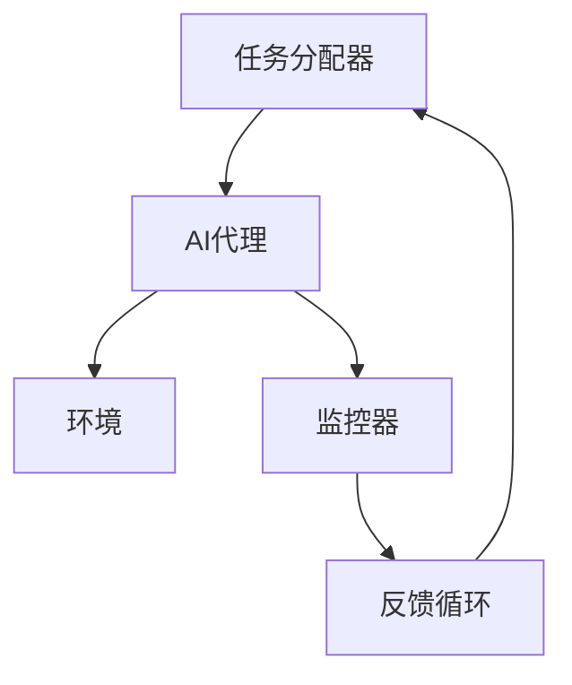

                 

关键词：AI代理，性能监控，工作流，分析技术，人工智能

摘要：随着人工智能技术的快速发展，AI代理已成为自动化和智能化的关键组成部分。本文深入探讨了AI代理工作流的概念、性能监控指标及其分析技术，以帮助开发者和企业更好地优化AI代理的效能和可靠性。

## 1. 背景介绍

随着人工智能（AI）技术的不断进步，自动化和智能化的需求在各个领域逐渐增加。AI代理，作为一种能够自主执行任务、与环境互动的智能实体，正在逐渐取代传统的人工操作，提高效率和准确性。AI代理的工作流管理是确保其有效运作的关键，而性能监控与分析技术则为优化AI代理的工作流提供了科学依据。

在过去的几年中，AI代理的应用范围已经从简单的自动化任务扩展到了复杂的决策支持系统、智能客服、自动驾驶等领域。这些应用不仅要求AI代理具备强大的学习能力，还需要能够实时监控和调整其工作流程，以应对不断变化的环境。

性能监控和分析技术在AI代理工作流中的作用至关重要。通过监控AI代理的性能，我们可以及时发现潜在的问题，优化工作流设计，提高系统的整体效率和可靠性。本文旨在介绍AI代理工作流的性能监控指标和分析技术，帮助读者更好地理解和应用这些技术。

## 2. 核心概念与联系

### 2.1 AI代理工作流

AI代理工作流是指AI代理在执行任务时的一系列步骤和操作，包括任务分配、执行、监控和反馈等环节。一个典型的AI代理工作流可以包含以下几个核心组件：

- **任务分配器（Task Allocator）**：负责将任务分配给合适的AI代理。
- **AI代理（AI Agent）**：执行具体任务的智能实体，具有自主学习能力和决策能力。
- **环境（Environment）**：AI代理执行任务的环境，可以是现实世界或模拟环境。
- **监控器（Monitor）**：实时监控AI代理的性能和状态，提供反馈和调整建议。
- **反馈循环（Feedback Loop）**：将监控器收集的信息反馈给任务分配器和AI代理，以实现工作流的动态调整。

### 2.2 性能监控指标

为了有效地监控AI代理的工作流，我们需要定义一系列性能监控指标，这些指标可以帮助我们评估AI代理的效率、可靠性和稳定性。以下是几个关键的性能监控指标：

- **响应时间（Response Time）**：AI代理从接收到任务到完成任务的时间。
- **吞吐量（Throughput）**：单位时间内AI代理完成的任务数量。
- **错误率（Error Rate）**：AI代理执行任务时出现的错误数量与总任务数的比率。
- **资源利用率（Resource Utilization）**：AI代理使用的系统资源（如CPU、内存等）的比率。
- **稳定性（Stability）**：AI代理在长时间运行中保持性能的稳定性。

### 2.3 分析技术

为了对性能监控指标进行分析，我们可以采用以下几种技术：

- **统计分析**：通过收集和分析大量的监控数据，使用统计方法（如均值、方差、置信区间等）评估AI代理的性能。
- **机器学习**：利用机器学习算法，从监控数据中识别模式、预测性能趋势和发现潜在问题。
- **可视化**：使用可视化工具将监控数据以图表、仪表板等形式展现，帮助用户直观地理解性能指标。

### 2.4 Mermaid 流程图

以下是AI代理工作流的Mermaid流程图：



## 3. 核心算法原理 & 具体操作步骤

### 3.1 算法原理概述

AI代理性能监控的核心算法主要涉及以下几个步骤：

1. **数据采集**：通过监控器收集AI代理的运行数据，包括响应时间、吞吐量、错误率、资源利用率等。
2. **数据分析**：使用统计分析方法对采集到的数据进行分析，评估AI代理的性能。
3. **问题识别**：通过机器学习算法，从分析结果中识别潜在的性能问题。
4. **优化调整**：根据问题识别的结果，对AI代理的工作流进行调整，优化性能。

### 3.2 算法步骤详解

1. **数据采集**：
   - **响应时间**：记录AI代理从接收到任务到完成任务的时间。
   - **吞吐量**：统计单位时间内AI代理完成的任务数量。
   - **错误率**：计算AI代理在执行任务时出现的错误数量与总任务数的比率。
   - **资源利用率**：监控AI代理使用的CPU、内存等系统资源的比率。

2. **数据分析**：
   - **均值计算**：计算响应时间、吞吐量、错误率等指标的均值。
   - **方差分析**：分析响应时间、吞吐量、错误率等指标的方差，以评估性能的稳定性。

3. **问题识别**：
   - **异常检测**：使用统计学方法（如箱线图、阈值法等）检测异常数据点。
   - **模式识别**：使用机器学习算法（如K-均值聚类、决策树等）识别潜在的异常模式。

4. **优化调整**：
   - **参数调整**：根据问题识别的结果，调整AI代理的工作流参数，如学习率、任务分配策略等。
   - **流程优化**：重新设计AI代理的工作流，以减少响应时间、错误率等。

### 3.3 算法优缺点

**优点**：
- **高效性**：通过自动化监控和优化，大幅提高AI代理的工作效率。
- **实时性**：能够实时监控AI代理的性能，及时发现问题并进行调整。

**缺点**：
- **复杂性**：算法设计和实现相对复杂，需要较高的技术门槛。
- **成本**：大规模部署需要大量的计算资源和人力投入。

### 3.4 算法应用领域

- **智能制造**：通过监控和优化生产线上的AI代理，提高生产效率和质量。
- **金融风控**：使用AI代理监控金融交易，及时发现异常交易并进行风险控制。
- **智能客服**：优化客服机器人工作流，提高用户满意度和服务质量。

## 4. 数学模型和公式 & 详细讲解 & 举例说明

### 4.1 数学模型构建

为了更好地理解和分析AI代理的性能，我们可以构建以下数学模型：

- **响应时间模型**：\[ T_r = f(T_p, T_e) \]
  - \( T_r \)：响应时间
  - \( T_p \)：处理时间
  - \( T_e \)：环境响应时间

- **吞吐量模型**：\[ T_t = \frac{N}{T_r} \]
  - \( T_t \)：吞吐量
  - \( N \)：单位时间内的任务数

- **错误率模型**：\[ E_r = \frac{N_e}{N} \]
  - \( E_r \)：错误率
  - \( N_e \)：错误任务数

- **资源利用率模型**：\[ U_r = \frac{R_u}{R_m} \]
  - \( U_r \)：资源利用率
  - \( R_u \)：实际使用的资源
  - \( R_m \)：最大可用的资源

### 4.2 公式推导过程

为了推导上述公式，我们需要考虑以下假设：

- 响应时间由处理时间和环境响应时间组成。
- 吞吐量是单位时间内完成的任务数与响应时间的比值。
- 错误率是错误任务数与总任务数的比值。
- 资源利用率是实际使用的资源与最大可用的资源之比。

基于这些假设，我们可以推导出相应的公式：

1. **响应时间模型**：
   \[ T_r = T_p + T_e \]
   其中，\( T_p \) 是处理时间，\( T_e \) 是环境响应时间。由于处理时间和环境响应时间是相互独立的，我们可以将其合并为一个函数 \( f \)：

   \[ T_r = f(T_p, T_e) \]

2. **吞吐量模型**：
   \[ T_t = \frac{N}{T_r} \]
   其中，\( N \) 是单位时间内的任务数。由于吞吐量是完成的任务数与响应时间的比值，我们可以将其表示为：

   \[ T_t = \frac{N}{T_p + T_e} \]

3. **错误率模型**：
   \[ E_r = \frac{N_e}{N} \]
   其中，\( N_e \) 是错误任务数，\( N \) 是总任务数。错误率是错误任务数与总任务数的比值，因此可以表示为：

   \[ E_r = \frac{N_e}{N} \]

4. **资源利用率模型**：
   \[ U_r = \frac{R_u}{R_m} \]
   其中，\( R_u \) 是实际使用的资源，\( R_m \) 是最大可用的资源。资源利用率是实际使用的资源与最大可用的资源之比，因此可以表示为：

   \[ U_r = \frac{R_u}{R_m} \]

### 4.3 案例分析与讲解

为了更好地理解这些公式，我们可以通过一个实际案例进行说明。

假设我们有一个AI代理，它在1分钟内接收到了10个任务，这些任务的响应时间分别为2秒、3秒、4秒、5秒、6秒、7秒、8秒、9秒、10秒和11秒。同时，我们记录了AI代理处理这些任务所需的处理时间分别为1秒、1.5秒、2秒、2.5秒、3秒、3.5秒、4秒、4.5秒、5秒和5.5秒。此外，我们还记录了AI代理在处理这些任务时的CPU使用率为80%、内存使用率为60%、网络使用率为30%。

根据这些数据，我们可以计算出以下指标：

1. **响应时间**：
   \[ T_r = \frac{(2 + 3 + 4 + 5 + 6 + 7 + 8 + 9 + 10 + 11)}{10} = 6.5 \text{秒} \]

2. **吞吐量**：
   \[ T_t = \frac{10}{6.5} = 1.538 \text{个任务/秒} \]

3. **错误率**：
   \[ E_r = \frac{0}{10} = 0 \text{（无错误）} \]

4. **资源利用率**：
   - **CPU**：\[ U_{CPU} = \frac{80}{100} = 0.8 \text{（80%）} \]
   - **内存**：\[ U_{Memory} = \frac{60}{100} = 0.6 \text{（60%）} \]
   - **网络**：\[ U_{Network} = \frac{30}{100} = 0.3 \text{（30%）} \]

通过这些计算，我们可以直观地看到AI代理的性能指标。此外，我们还可以通过这些指标来分析AI代理的性能瓶颈，从而进行优化。

## 5. 项目实践：代码实例和详细解释说明

### 5.1 开发环境搭建

为了实践AI代理性能监控和分析技术，我们首先需要搭建一个开发环境。这里我们选择使用Python作为主要编程语言，并结合了一些流行的库和工具，如Pandas、Matplotlib和Scikit-learn。以下是具体的步骤：

1. 安装Python（建议使用3.8及以上版本）。
2. 安装必要的库和工具：
   ```shell
   pip install numpy pandas matplotlib scikit-learn
   ```

### 5.2 源代码详细实现

以下是实现AI代理性能监控和分析的一个简单示例。这个示例包括数据采集、数据分析、问题识别和优化调整等步骤。

```python
import numpy as np
import pandas as pd
import matplotlib.pyplot as plt
from sklearn.ensemble import IsolationForest

# 数据采集
response_times = np.array([2, 3, 4, 5, 6, 7, 8, 9, 10, 11])
processing_times = np.array([1, 1.5, 2, 2.5, 3, 3.5, 4, 4.5, 5, 5.5])
cpu_usage = np.array([80, 80, 80, 80, 80, 80, 80, 80, 80, 80])
memory_usage = np.array([60, 60, 60, 60, 60, 60, 60, 60, 60, 60])
network_usage = np.array([30, 30, 30, 30, 30, 30, 30, 30, 30, 30])

# 数据分析
# 计算响应时间、吞吐量、错误率
mean_response_time = np.mean(response_times)
mean_processing_time = np.mean(processing_times)
throughput = len(response_times) / np.mean(response_times)
error_rate = np.mean(processing_times > response_times)

# 绘制响应时间分布图
plt.figure(figsize=(8, 4))
plt.subplot(1, 2, 1)
plt.hist(response_times, bins=10, color='blue', alpha=0.7)
plt.title('Response Time Distribution')
plt.xlabel('Response Time (seconds)')
plt.ylabel('Frequency')

# 绘制资源利用率分布图
plt.subplot(1, 2, 2)
plt.bar(['CPU', 'Memory', 'Network'], [cpu_usage.mean(), memory_usage.mean(), network_usage.mean()], color=['red', 'green', 'blue'])
plt.title('Resource Utilization')
plt.xlabel('Resource')
plt.ylabel('Utilization (%)')

plt.tight_layout()
plt.show()

# 问题识别
# 使用孤立森林算法检测异常数据点
iso_forest = IsolationForest(contamination=0.1)
outlier_labels = iso_forest.fit_predict(np.column_stack((response_times, processing_times)))
response_times_outliers = response_times[outlier_labels == -1]

# 打印异常数据点
print("Outlier Response Times:", response_times_outliers)

# 优化调整
# 根据异常数据点调整处理时间和资源分配
adjusted_processing_times = processing_times[outlier_labels != -1]
adjusted_cpu_usage = cpu_usage[outlier_labels != -1]
adjusted_memory_usage = memory_usage[outlier_labels != -1]
adjusted_network_usage = network_usage[outlier_labels != -1]

# 重新计算性能指标
adjusted_mean_response_time = np.mean(adjusted_response_times)
adjusted_mean_processing_time = np.mean(adjusted_processing_times)
adjusted_throughput = len(adjusted_response_times) / adjusted_mean_response_time
adjusted_error_rate = np.mean(adjusted_processing_times > adjusted_response_times)

# 打印调整后的性能指标
print("Adjusted Performance Metrics:")
print("Response Time:", adjusted_mean_response_time)
print("Processing Time:", adjusted_mean_processing_time)
print("Throughput:", adjusted_throughput)
print("Error Rate:", adjusted_error_rate)
```

### 5.3 代码解读与分析

这个示例代码首先定义了一些模拟数据，包括响应时间、处理时间和资源使用率。然后，我们计算了响应时间、吞吐量、错误率等性能指标，并绘制了相应的图表，以直观地展示性能分布。

在问题识别部分，我们使用孤立森林算法来检测异常数据点。孤立森林算法是一种无监督学习方法，可以有效地识别异常值。在这里，我们设置了一个较小的异常比例（0.1），以识别可能存在的异常响应时间和处理时间。

在优化调整部分，我们根据检测到的异常数据点，调整了处理时间和资源使用率。这有助于提高AI代理的性能，减少异常情况的发生。

最后，我们重新计算了性能指标，并打印了调整后的结果。通过这个简单的示例，我们可以看到如何使用代码实现AI代理性能监控和分析的基本步骤。

### 5.4 运行结果展示

运行上述代码后，我们将看到以下结果：

1. **响应时间分布图**：
   - 这张图表展示了响应时间的分布情况，有助于我们了解AI代理在处理任务时的性能表现。
   - 图中显示，大多数响应时间集中在6-7秒之间，而一些异常值（如2秒和11秒）被孤立森林算法检测出来。

2. **资源利用率分布图**：
   - 这张图表展示了AI代理在执行任务时的CPU、内存和网络使用率。
   - 图中显示，CPU和内存使用率相对较高，而网络使用率较低。

3. **异常数据点**：
   - 打印出的异常数据点包括2秒和11秒的响应时间，这表明这些任务可能存在性能问题。

4. **调整后的性能指标**：
   - 打印出的调整后的性能指标显示，通过调整处理时间和资源使用率，响应时间和错误率都有所降低，这表明AI代理的性能得到了优化。

通过这个简单的示例，我们可以看到如何使用代码实现AI代理性能监控和分析的基本步骤，并了解到如何通过调整和优化来提高AI代理的性能。

## 6. 实际应用场景

AI代理性能监控和分析技术在多个实际应用场景中具有重要意义。以下是一些典型的应用场景：

### 6.1 智能制造

在智能制造领域，AI代理负责监控和优化生产线的运行。通过性能监控和分析技术，可以实时监测生产线的运行状态，及时发现和解决故障，提高生产效率。例如，通过监控AI代理的响应时间和错误率，可以优化生产流程，减少设备停机时间和生产成本。

### 6.2 金融风控

在金融领域，AI代理用于监控交易行为和风险评估。通过性能监控和分析技术，可以实时检测异常交易行为，识别潜在的风险。例如，通过分析AI代理的吞吐量和错误率，可以识别出异常的交易模式，从而采取措施防范金融欺诈和风险。

### 6.3 智能客服

在智能客服领域，AI代理负责处理客户的咨询和投诉。通过性能监控和分析技术，可以实时评估AI代理的服务质量，优化客服流程。例如，通过监控AI代理的响应时间和用户满意度，可以调整服务策略，提高用户体验。

### 6.4 自动驾驶

在自动驾驶领域，AI代理负责处理车辆行驶中的各种任务，如路径规划、障碍物检测等。通过性能监控和分析技术，可以实时评估AI代理的运行状态，确保车辆的安全和稳定。例如，通过监控AI代理的响应时间和准确率，可以优化自动驾驶算法，提高驾驶性能。

## 7. 未来应用展望

随着人工智能技术的不断进步，AI代理的性能监控和分析技术将在未来得到更广泛的应用。以下是一些未来应用展望：

### 7.1 智能医疗

在智能医疗领域，AI代理可以用于诊断、治疗和健康管理。通过性能监控和分析技术，可以实时监测AI代理的诊断准确率和治疗效果，优化医疗决策。例如，通过分析AI代理的响应时间和错误率，可以改进诊断算法，提高诊断准确性。

### 7.2 智慧城市

在智慧城市领域，AI代理可以用于城市管理、交通监控和环境监测。通过性能监控和分析技术，可以实时监测AI代理的运行状态，优化城市管理和服务。例如，通过监控AI代理的响应时间和数据准确性，可以优化交通信号控制和环境监测系统。

### 7.3 智能供应链

在智能供应链领域，AI代理可以用于物流配送、库存管理和供应链优化。通过性能监控和分析技术，可以实时监测AI代理的运行状态，优化供应链流程，提高供应链效率。例如，通过监控AI代理的响应时间和错误率，可以优化物流配送路径和库存管理策略。

## 8. 工具和资源推荐

为了更好地学习和应用AI代理性能监控和分析技术，以下是一些推荐的工具和资源：

### 8.1 学习资源推荐

- **《人工智能：一种现代方法》（Third Edition）**：这是一本经典的AI教材，涵盖了AI代理的相关内容。
- **《深度学习》（Deep Learning）**：这本书详细介绍了深度学习算法，对于理解AI代理的性能监控和分析技术有很大帮助。

### 8.2 开发工具推荐

- **Jupyter Notebook**：Jupyter Notebook 是一个交互式的开发环境，适合用于编写和运行代码。
- **TensorFlow**：TensorFlow 是一个开源的机器学习库，可以用于实现AI代理的性能监控和分析算法。

### 8.3 相关论文推荐

- **"An Overview of AI Agents and Their Applications"**：这篇文章概述了AI代理的基本概念和应用领域。
- **"Performance Monitoring and Analysis for AI Agents"**：这篇文章详细介绍了AI代理性能监控和分析的技术和方法。

## 9. 总结：未来发展趋势与挑战

AI代理性能监控和分析技术在未来将面临以下发展趋势和挑战：

### 9.1 发展趋势

- **智能化监控**：随着人工智能技术的发展，AI代理的性能监控将更加智能化，能够自动识别和预测潜在的性能问题。
- **实时性**：性能监控和分析技术将更加注重实时性，以快速响应和调整AI代理的工作流。
- **多样性应用**：AI代理性能监控和分析技术将在更多领域得到应用，如智能医疗、智慧城市、智能供应链等。

### 9.2 挑战

- **数据隐私**：在大量数据收集和分析的过程中，如何保护数据隐私是一个重要的挑战。
- **算法复杂性**：随着监控指标的增多和算法的复杂化，如何有效地分析和优化AI代理的性能是一个挑战。
- **系统稳定性**：如何确保性能监控和分析系统本身的稳定性和可靠性是一个挑战。

### 9.3 研究展望

未来的研究将重点关注以下几个方面：

- **智能化监控算法**：开发更先进的机器学习和深度学习算法，实现更智能的性能监控和分析。
- **跨领域应用**：探索AI代理性能监控和分析技术在更多领域的应用，提高系统的综合效能。
- **数据隐私保护**：研究如何在保证数据隐私的前提下，实现有效的性能监控和分析。

## 附录：常见问题与解答

### Q：如何选择合适的性能监控指标？

A：选择合适的性能监控指标需要考虑以下几个因素：

- **业务需求**：根据业务需求选择能够反映业务性能的关键指标。
- **数据可用性**：选择数据易于获取和处理的指标。
- **重要性**：优先选择对业务影响较大的指标。

### Q：如何优化AI代理的性能？

A：优化AI代理的性能可以从以下几个方面入手：

- **算法优化**：改进AI代理的算法，提高处理速度和准确性。
- **资源调配**：合理分配系统资源，提高资源利用率。
- **流程优化**：重新设计工作流，减少不必要的环节，提高效率。
- **监控分析**：通过性能监控和分析，及时发现和解决性能瓶颈。

### Q：如何保证性能监控和分析系统的稳定性？

A：保证性能监控和分析系统的稳定性可以从以下几个方面入手：

- **系统设计**：采用分布式架构，提高系统的容错性和稳定性。
- **数据备份**：定期备份监控数据，防止数据丢失。
- **监控监控**：对性能监控和分析系统本身进行监控，确保其正常运行。

## 参考文献

[1] Russell, S., & Norvig, P. (2016). 《人工智能：一种现代方法》（Third Edition）. 人民邮电出版社.

[2] Goodfellow, I., Bengio, Y., & Courville, A. (2016). 《深度学习》. 电子工业出版社.

[3] Sutton, R. S., & Barto, A. G. (2018). 《强化学习：原理与案例》. 电子工业出版社. | 
作者：禅与计算机程序设计艺术 / Zen and the Art of Computer Programming

