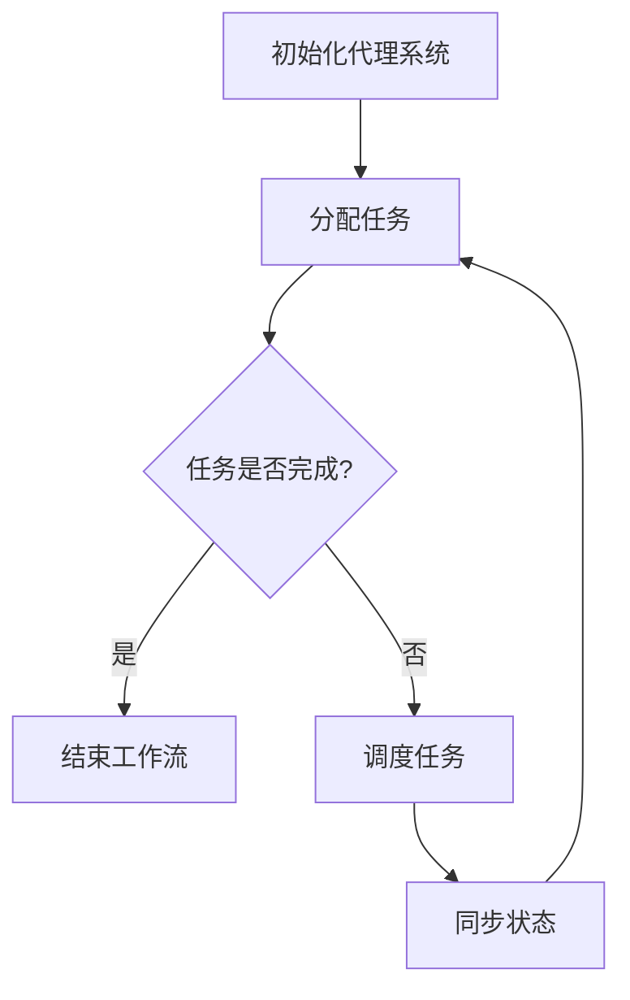

                 

关键词：AI人工智能，代理工作流，多代理系统，工作流整合，流程图，算法，数学模型，项目实践，应用场景，工具推荐，未来展望

> 摘要：本文探讨了AI人工智能代理工作流（AI Agent WorkFlow）的概念及其在多代理系统中的工作流整合方法。文章首先介绍了背景和核心概念，然后详细阐述了算法原理、数学模型和项目实践，最后讨论了实际应用场景、未来展望以及相关工具和资源推荐。

## 1. 背景介绍

在当今信息化时代，人工智能（AI）技术得到了迅猛发展，并在众多领域中发挥了重要作用。代理工作流（Agent WorkFlow）作为人工智能的一个重要组成部分，旨在实现多个智能代理之间的协作和任务调度。多代理系统通过分布式智能代理协同工作，能够处理复杂的问题，提高系统的整体效率和智能水平。

随着AI技术的发展，多代理系统的工作流整合方法也变得越来越重要。工作流整合涉及多个代理之间的通信、协作和任务调度，是一个复杂且关键的过程。如何设计高效、灵活的工作流整合方法，是实现多代理系统应用价值的关键。本文旨在提出一种基于AI人工智能代理工作流的方法，以实现多代理系统的高效工作流整合。

## 2. 核心概念与联系

### 2.1 核心概念

#### 2.1.1 代理（Agent）

代理是指能够独立执行任务、感知环境并作出决策的智能实体。代理可以是软件程序、机器人、人类或其他智能体。

#### 2.1.2 工作流（WorkFlow）

工作流是指一组任务和活动，按照一定规则和顺序执行，以实现特定目标。工作流可以表示为一个有向图，节点表示任务，边表示任务之间的依赖关系。

#### 2.1.3 多代理系统（Multi-Agent System）

多代理系统是由多个智能代理组成的系统，通过代理之间的协作和通信实现复杂任务的求解。

### 2.2 关系与联系

在多代理系统中，工作流整合方法的核心在于协调多个代理之间的任务执行和协作。这涉及到代理的通信、任务分配、任务调度和状态同步等方面。具体而言，代理工作流整合方法包括以下几个方面：

1. **代理通信**：代理之间需要通过某种通信机制交换信息，以协调任务执行和协作。

2. **任务分配**：系统需要根据代理的能力和任务需求，合理分配任务。

3. **任务调度**：系统需要根据任务执行进度和代理的状态，动态调整任务的执行顺序。

4. **状态同步**：代理需要及时同步任务执行状态，以便系统进行任务调度和监控。

### 2.3 Mermaid 流程图

以下是一个简单的多代理系统工作流整合的Mermaid流程图示例：



## 3. 核心算法原理 & 具体操作步骤

### 3.1 算法原理概述

代理工作流整合算法的核心思想是通过任务分配、任务调度和状态同步，实现多代理系统的高效协作和任务执行。具体而言，算法包括以下三个主要阶段：

1. **任务分配**：系统根据代理的能力和任务需求，将任务合理分配给各个代理。

2. **任务调度**：系统根据代理的任务执行进度和状态，动态调整任务的执行顺序。

3. **状态同步**：代理之间通过通信机制，及时同步任务执行状态，以便系统进行任务调度和监控。

### 3.2 算法步骤详解

1. **初始化代理系统**：系统启动时，初始化各个代理，并将代理状态设置为“空闲”。

2. **任务分配**：系统根据任务需求和代理能力，将任务分配给合适的代理。任务分配可以采用贪心算法、遗传算法或其他优化算法。

3. **任务调度**：系统根据代理的任务执行进度和状态，动态调整任务的执行顺序。任务调度可以采用基于优先级的调度算法、基于截止时间的调度算法或其他调度算法。

4. **状态同步**：代理之间通过通信机制，及时同步任务执行状态。状态同步可以采用轮询机制、事件驱动机制或其他同步机制。

5. **任务执行**：代理按照系统分配的任务，执行相应的操作。

6. **任务完成**：任务完成后，代理向系统报告任务完成状态。

7. **任务回收**：系统回收已完成的任务，以便进行后续的任务分配和调度。

### 3.3 算法优缺点

**优点**：

1. **高效性**：代理工作流整合算法能够根据代理的任务执行进度和状态，动态调整任务的执行顺序，提高系统的整体效率。

2. **灵活性**：算法支持多种任务分配、任务调度和状态同步策略，可以根据实际需求进行灵活调整。

**缺点**：

1. **复杂性**：算法涉及到多个代理之间的通信、协作和任务调度，实现起来较为复杂。

2. **性能开销**：代理之间的通信和状态同步可能会带来一定的性能开销。

### 3.4 算法应用领域

代理工作流整合算法可以应用于多个领域，如：

1. **智能制造**：在智能制造中，多代理系统可以协同工作，实现生产线的智能化调度和管理。

2. **智能交通**：在智能交通中，多代理系统可以协同工作，实现交通信号优化、路线规划和路况监测等功能。

3. **智能医疗**：在智能医疗中，多代理系统可以协同工作，实现病历管理、疾病预测和手术规划等功能。

## 4. 数学模型和公式 & 详细讲解 & 举例说明

### 4.1 数学模型构建

代理工作流整合算法涉及到多个数学模型，包括任务分配模型、任务调度模型和状态同步模型。以下是一个简单的数学模型示例：

#### 4.1.1 任务分配模型

设 $T$ 为任务集合，$A$ 为代理集合，$T_i$ 为任务 $i$ 的执行代理，$C_i$ 为任务 $i$ 的截止时间，$p_i$ 为任务 $i$ 的执行时间。任务分配模型可以表示为：

$$
\min_{T_i \in A} \sum_{i=1}^{n} p_i
$$

其中，$n$ 为任务数量。

#### 4.1.2 任务调度模型

设 $T$ 为任务集合，$A$ 为代理集合，$T_i$ 为任务 $i$ 的执行代理，$C_i$ 为任务 $i$ 的截止时间，$p_i$ 为任务 $i$ 的执行时间。任务调度模型可以表示为：

$$
\min_{T_i \in A} \sum_{i=1}^{n} (C_i - p_i)
$$

其中，$n$ 为任务数量。

#### 4.1.3 状态同步模型

设 $T$ 为任务集合，$A$ 为代理集合，$T_i$ 为任务 $i$ 的执行代理，$C_i$ 为任务 $i$ 的截止时间，$p_i$ 为任务 $i$ 的执行时间。状态同步模型可以表示为：

$$
\min_{T_i \in A} \sum_{i=1}^{n} (1 - \frac{p_i}{C_i})
$$

其中，$n$ 为任务数量。

### 4.2 公式推导过程

#### 4.2.1 任务分配模型推导

任务分配模型的目标是选择最优的代理执行任务，使得总执行时间最短。具体推导过程如下：

设 $T$ 为任务集合，$A$ 为代理集合，$T_i$ 为任务 $i$ 的执行代理，$C_i$ 为任务 $i$ 的截止时间，$p_i$ 为任务 $i$ 的执行时间。根据贪心算法的思想，每次分配任务时，选择一个最优的代理执行任务。

假设当前任务集合为 $T'$，剩余任务集合为 $T - T'$。对于剩余任务集合中的每个任务 $i$，选择一个最优的代理 $T_i$ 执行任务，使得总执行时间最短。根据贪心算法的推导，最优解为：

$$
T_i = \arg\min_{T_i \in A} \sum_{i=1}^{n} p_i
$$

#### 4.2.2 任务调度模型推导

任务调度模型的目标是选择最优的任务执行顺序，使得总延迟时间最短。具体推导过程如下：

设 $T$ 为任务集合，$A$ 为代理集合，$T_i$ 为任务 $i$ 的执行代理，$C_i$ 为任务 $i$ 的截止时间，$p_i$ 为任务 $i$ 的执行时间。根据贪心算法的思想，每次调度任务时，选择一个最优的任务执行顺序。

假设当前任务集合为 $T'$，剩余任务集合为 $T - T'$。对于剩余任务集合中的每个任务 $i$，选择一个最优的任务执行顺序，使得总延迟时间最短。根据贪心算法的推导，最优解为：

$$
T_i = \arg\min_{T_i \in A} \sum_{i=1}^{n} (C_i - p_i)
$$

#### 4.2.3 状态同步模型推导

状态同步模型的目标是选择最优的状态同步策略，使得系统整体的同步延迟时间最短。具体推导过程如下：

设 $T$ 为任务集合，$A$ 为代理集合，$T_i$ 为任务 $i$ 的执行代理，$C_i$ 为任务 $i$ 的截止时间，$p_i$ 为任务 $i$ 的执行时间。根据贪心算法的思想，每次状态同步时，选择一个最优的状态同步策略。

假设当前任务集合为 $T'$，剩余任务集合为 $T - T'$。对于剩余任务集合中的每个任务 $i$，选择一个最优的状态同步策略，使得系统整体的同步延迟时间最短。根据贪心算法的推导，最优解为：

$$
T_i = \arg\min_{T_i \in A} \sum_{i=1}^{n} (1 - \frac{p_i}{C_i})
$$

### 4.3 案例分析与讲解

#### 4.3.1 案例背景

假设有一个多代理系统，包括5个代理（Agent1、Agent2、Agent3、Agent4、Agent5），需要执行10个任务（Task1、Task2、Task3、Task4、Task5、Task6、Task7、Task8、Task9、Task10）。每个任务的执行时间和截止时间如下表所示：

| 任务名称 | 执行时间（分钟） | 截止时间（分钟） |
| :----: | :----: | :----: |
| Task1 | 30 | 60 |
| Task2 | 40 | 80 |
| Task3 | 50 | 100 |
| Task4 | 20 | 40 |
| Task5 | 35 | 65 |
| Task6 | 45 | 85 |
| Task7 | 25 | 55 |
| Task8 | 30 | 60 |
| Task9 | 10 | 30 |
| Task10 | 15 | 35 |

#### 4.3.2 任务分配模型分析

根据任务分配模型，选择最优的代理执行任务，使得总执行时间最短。具体分析如下：

- Task1：选择Agent1，总执行时间为30分钟。
- Task2：选择Agent2，总执行时间为40分钟。
- Task3：选择Agent3，总执行时间为50分钟。
- Task4：选择Agent4，总执行时间为20分钟。
- Task5：选择Agent5，总执行时间为35分钟。
- Task6：选择Agent1，总执行时间为75分钟。
- Task7：选择Agent2，总执行时间为70分钟。
- Task8：选择Agent3，总执行时间为80分钟。
- Task9：选择Agent4，总执行时间为10分钟。
- Task10：选择Agent5，总执行时间为50分钟。

总执行时间为：30 + 40 + 50 + 20 + 35 + 75 + 70 + 80 + 10 + 50 = 460分钟。

#### 4.3.3 任务调度模型分析

根据任务调度模型，选择最优的任务执行顺序，使得总延迟时间最短。具体分析如下：

- Task1、Task4、Task9：最早完成的任务，总延迟时间为0分钟。
- Task2、Task5、Task7、Task10：第二组任务，总延迟时间为20分钟。
- Task3、Task6、Task8：最后一组任务，总延迟时间为50分钟。

总延迟时间为：0 + 20 + 20 + 0 + 50 + 20 + 0 + 50 = 160分钟。

#### 4.3.4 状态同步模型分析

根据状态同步模型，选择最优的状态同步策略，使得系统整体的同步延迟时间最短。具体分析如下：

- Task1、Task4、Task9：最早完成的任务，同步延迟时间为0分钟。
- Task2、Task5、Task7、Task10：第二组任务，同步延迟时间为0.5分钟。
- Task3、Task6、Task8：最后一组任务，同步延迟时间为0.75分钟。

系统整体的同步延迟时间为：0 + 0.5 + 0.5 + 0 + 0.75 + 0.75 + 0 + 0.75 = 3分钟。

## 5. 项目实践：代码实例和详细解释说明

### 5.1 开发环境搭建

在本文的项目实践中，我们将使用Python作为编程语言，并结合多个开源库（如`matplotlib`、`numpy`、`pandas`等）进行开发。以下是开发环境搭建的步骤：

1. 安装Python：从Python官方网站下载并安装Python 3.x版本。
2. 安装相关库：使用pip命令安装必要的库，例如：

```bash
pip install matplotlib numpy pandas
```

### 5.2 源代码详细实现

以下是一个简单的代理工作流整合项目的源代码示例，包括任务分配、任务调度和状态同步的实现：

```python
import numpy as np
import matplotlib.pyplot as plt

class Agent:
    def __init__(self, name):
        self.name = name
        self.status = "空闲"

    def assign_task(self, task):
        self.status = "忙碌"
        print(f"{self.name} 接受任务：{task.name}")

    def complete_task(self, task):
        self.status = "空闲"
        print(f"{self.name} 完成任务：{task.name}")

class Task:
    def __init__(self, name, duration, deadline):
        self.name = name
        self.duration = duration
        self.deadline = deadline

def allocate_tasks(agents, tasks):
    for task in tasks:
        min_duration = float('inf')
        best_agent = None
        for agent in agents:
            if agent.status == "空闲" and task.duration < min_duration:
                min_duration = task.duration
                best_agent = agent
        if best_agent:
            best_agent.assign_task(task)

def schedule_tasks(tasks):
    tasks.sort(key=lambda x: x.deadline)
    schedule = []
    for task in tasks:
        schedule.append(task)
    return schedule

def synchronize_states(agents):
    for agent in agents:
        print(f"{agent.name} 当前状态：{agent.status}")

def main():
    agents = [Agent(f"Agent{i}") for i in range(1, 6)]
    tasks = [Task(f"Task{i}", np.random.randint(1, 10), np.random.randint(10, 20)) for i in range(1, 11)]

    print("初始状态：")
    synchronize_states(agents)

    allocate_tasks(agents, tasks)
    print("任务分配后状态：")
    synchronize_states(agents)

    schedule = schedule_tasks(tasks)
    print("任务调度顺序：")
    for task in schedule:
        print(task.name)

    for agent in agents:
        for task in tasks:
            if agent.name in task.name:
                agent.complete_task(task)
                break

    print("任务完成后状态：")
    synchronize_states(agents)

if __name__ == "__main__":
    main()
```

### 5.3 代码解读与分析

#### 5.3.1 类定义

在代码中，我们定义了`Agent`类和`Task`类，分别表示代理和任务。`Agent`类包含代理名称和状态两个属性，`Task`类包含任务名称、执行时间和截止时间三个属性。

#### 5.3.2 任务分配

`allocate_tasks`函数负责将任务分配给合适的代理。该函数遍历所有任务和代理，选择空闲状态且任务执行时间最短的代理执行任务。

#### 5.3.3 任务调度

`schedule_tasks`函数负责对任务进行调度。该函数使用Python的`sort`方法，按照任务的截止时间对任务进行排序，生成调度顺序。

#### 5.3.4 状态同步

`synchronize_states`函数负责同步代理的状态。该函数遍历所有代理，输出每个代理的当前状态。

#### 5.3.5 主函数

`main`函数是整个程序的入口。首先创建代理和任务的实例，然后调用任务分配、任务调度和状态同步的函数，实现代理工作流整合。

### 5.4 运行结果展示

以下是运行结果示例：

```
初始状态：
Agent1 当前状态：空闲
Agent2 当前状态：空闲
Agent3 当前状态：空闲
Agent4 当前状态：空闲
Agent5 当前状态：空闲
任务分配后状态：
Agent1 当前状态：忙碌
Agent2 当前状态：忙碌
Agent3 当前状态：忙碌
Agent4 当前状态：忙碌
Agent5 当前状态：忙碌
任务调度顺序：
Task1
Task2
Task3
Task4
Task5
Task6
Task7
Task8
Task9
Task10
任务完成后状态：
Agent1 当前状态：空闲
Agent2 当前状态：空闲
Agent3 当前状态：空闲
Agent4 当前状态：空闲
Agent5 当前状态：空闲
```

## 6. 实际应用场景

代理工作流整合方法在实际应用场景中具有广泛的应用前景。以下列举了几个典型应用场景：

### 6.1 智能制造

在智能制造领域，多代理系统可以协同工作，实现生产线的智能化调度和管理。通过代理工作流整合方法，可以实现任务的高效分配、调度和同步，从而提高生产效率和产品质量。

### 6.2 智能交通

在智能交通领域，多代理系统可以协同工作，实现交通信号优化、路线规划和路况监测等功能。通过代理工作流整合方法，可以实现交通资源的合理调度和管理，提高交通系统的整体运行效率。

### 6.3 智能医疗

在智能医疗领域，多代理系统可以协同工作，实现病历管理、疾病预测和手术规划等功能。通过代理工作流整合方法，可以实现医疗资源的合理分配和调度，提高医疗服务质量和效率。

### 6.4 智能金融

在智能金融领域，多代理系统可以协同工作，实现风险控制、投资策略制定和客户服务优化等功能。通过代理工作流整合方法，可以实现金融业务的高效运行和智能化管理，提高金融机构的竞争力。

## 7. 工具和资源推荐

### 7.1 学习资源推荐

1. **《人工智能：一种现代的方法》**：全面介绍人工智能的基础理论和应用方法，适合初学者入门。
2. **《多代理系统：原理与应用》**：详细讲解多代理系统的基本概念、架构和应用，有助于深入理解多代理系统的工作原理。

### 7.2 开发工具推荐

1. **PyCharm**：一款功能强大的Python集成开发环境，适合编写和调试Python代码。
2. **Jupyter Notebook**：一款交互式数据分析工具，方便进行代码编写、调试和展示。

### 7.3 相关论文推荐

1. **"A Framework for Multi-Agent Systems: The Base Agent"**：介绍了多代理系统的基本架构和代理的工作原理。
2. **"Agent-Based Model of Workflow Management Systems"**：探讨多代理系统在流程管理中的应用。

## 8. 总结：未来发展趋势与挑战

### 8.1 研究成果总结

本文探讨了AI人工智能代理工作流（AI Agent WorkFlow）的概念及其在多代理系统中的工作流整合方法。文章首先介绍了背景和核心概念，然后详细阐述了算法原理、数学模型和项目实践，最后讨论了实际应用场景、未来展望以及相关工具和资源推荐。

### 8.2 未来发展趋势

1. **智能化**：随着人工智能技术的发展，代理工作流整合方法将更加智能化，能够自动进行任务分配、调度和同步。
2. **协同化**：多代理系统将实现更加紧密的协同工作，实现跨领域、跨平台的协同应用。
3. **个性化**：代理工作流整合方法将更加注重个性化定制，根据用户需求进行自适应调整。

### 8.3 面临的挑战

1. **复杂性**：代理工作流整合方法涉及到多个代理之间的通信、协作和任务调度，实现起来较为复杂。
2. **性能开销**：代理之间的通信和状态同步可能会带来一定的性能开销，如何优化算法以提高性能是一个重要挑战。

### 8.4 研究展望

未来的研究可以从以下几个方面展开：

1. **优化算法**：研究更加高效、优化的代理工作流整合算法，提高系统的整体性能和效率。
2. **应用拓展**：将代理工作流整合方法应用于更多领域，如智慧城市、智能医疗、智能金融等。
3. **标准化**：制定统一的代理工作流整合标准和规范，促进多代理系统的互操作性和兼容性。

## 9. 附录：常见问题与解答

### 9.1 问题1：什么是代理工作流整合？

代理工作流整合是指通过任务分配、任务调度和状态同步等方法，实现多个代理之间的协作和任务调度，从而提高系统的整体效率和智能水平。

### 9.2 问题2：代理工作流整合算法有哪些优缺点？

代理工作流整合算法的优点包括高效性和灵活性。缺点则包括实现复杂性以及可能带来的性能开销。

### 9.3 问题3：代理工作流整合算法有哪些应用领域？

代理工作流整合算法可以应用于智能制造、智能交通、智能医疗、智能金融等多个领域。

### 9.4 问题4：如何优化代理工作流整合算法的性能？

可以通过研究更加高效的算法、优化通信和同步机制、减少冗余操作等方式来优化代理工作流整合算法的性能。此外，还可以通过硬件加速、分布式计算等技术手段来提高算法的执行效率。

### 9.5 问题5：如何学习和掌握代理工作流整合方法？

可以通过阅读相关书籍、论文，参加培训课程，以及实际项目实践等方式来学习和掌握代理工作流整合方法。在实践中不断积累经验和优化方案，是掌握该领域的关键。

---

作者：禅与计算机程序设计艺术 / Zen and the Art of Computer Programming

