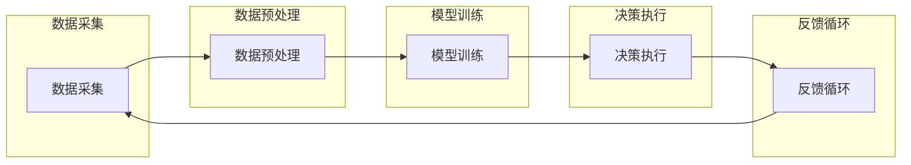

                 

关键词：人工智能代理，工作流，自主性，跨领域集成，AI Agent WorkFlow，机器学习，深度学习，神经网络，算法优化，数据处理，云计算，边缘计算，自动化，智能决策，人机交互。

> 摘要：本文将深入探讨AI人工智能代理工作流（AI Agent WorkFlow）的设计与实现，阐述跨领域自主AI代理集成的核心概念、算法原理及具体操作步骤。通过项目实践、数学模型讲解和未来应用展望，本文旨在为研究人员和开发者提供系统、全面的指导，推动AI人工智能代理在各个领域的应用与发展。

## 1. 背景介绍

随着人工智能（AI）技术的飞速发展，机器学习、深度学习、神经网络等算法的应用越来越广泛。AI代理（AI Agent）作为一种具有自主决策能力的实体，正逐渐成为AI技术的重要研究方向。AI代理工作流（AI Agent WorkFlow）则是实现AI代理有效运作的关键。

AI代理工作流旨在构建一个统一的框架，以整合不同领域的AI代理，实现跨领域的自主协作与协同工作。该工作流包括数据采集、预处理、模型训练、决策执行、反馈循环等环节，形成一个闭环系统，从而实现AI代理的持续优化与进化。

跨领域自主AI代理的集成是AI代理工作流的核心挑战之一。不同领域的AI代理可能采用不同的算法、数据格式和交互协议，如何实现这些代理之间的无缝集成和高效协作，是当前研究的热点和难点。

## 2. 核心概念与联系

### 2.1 AI代理（AI Agent）

AI代理是一种具有自主决策能力的计算机程序，能够在特定的环境中，根据感知信息采取行动以实现预定的目标。AI代理通常由感知模块、决策模块和执行模块组成。

- **感知模块**：负责收集环境中的信息，如传感器数据、文本、图像等。
- **决策模块**：基于感知模块获取的信息，通过机器学习、深度学习等算法，生成执行策略。
- **执行模块**：根据决策模块生成的执行策略，执行具体的操作，如移动、发送消息等。

### 2.2 工作流（WorkFlow）

工作流是一种用于描述业务过程的一系列步骤，这些步骤可以是人工操作，也可以是系统自动执行的任务。工作流旨在提高业务过程的效率和灵活性，减少人为错误。

### 2.3 跨领域集成（Cross-Domain Integration）

跨领域集成是指将来自不同领域的AI代理整合到一个统一的工作流中，以实现跨领域的自主协作。跨领域集成的核心挑战包括：

- **算法兼容性**：不同领域的AI代理可能采用不同的算法，如何实现算法之间的兼容和优化？
- **数据格式**：不同领域的AI代理可能使用不同的数据格式，如何实现数据格式的统一和转换？
- **通信协议**：不同领域的AI代理可能使用不同的通信协议，如何实现通信协议的统一和高效？

### 2.4 Mermaid流程图

以下是一个简化的AI代理工作流Mermaid流程图：



## 3. 核心算法原理 & 具体操作步骤

### 3.1 算法原理概述

AI代理工作流的核心算法主要包括：

- **机器学习算法**：用于模型训练和数据预测。
- **深度学习算法**：用于复杂模型的构建和优化。
- **神经网络算法**：用于感知模块的决策生成。

### 3.2 算法步骤详解

#### 3.2.1 数据采集

数据采集是AI代理工作流的第一步，主要包括以下步骤：

- **传感器数据采集**：从各种传感器（如摄像头、麦克风、温度传感器等）采集数据。
- **外部数据源采集**：从互联网、数据库等外部数据源获取数据。

#### 3.2.2 数据预处理

数据预处理主要包括以下步骤：

- **数据清洗**：去除无效、错误或重复的数据。
- **数据转换**：将不同数据格式的数据转换为统一的格式。
- **特征提取**：从原始数据中提取对模型训练有用的特征。

#### 3.2.3 模型训练

模型训练是AI代理工作流的核心，主要包括以下步骤：

- **模型选择**：根据应用场景选择合适的机器学习、深度学习或神经网络模型。
- **模型训练**：使用预处理后的数据对模型进行训练。
- **模型优化**：通过调整模型参数，提高模型性能。

#### 3.2.4 决策执行

决策执行是根据模型生成的预测结果，执行具体的操作。主要包括以下步骤：

- **决策生成**：使用模型生成执行策略。
- **操作执行**：根据决策生成执行策略，执行具体的操作。

#### 3.2.5 反馈循环

反馈循环是AI代理工作流的重要环节，主要包括以下步骤：

- **结果反馈**：将执行结果反馈给模型。
- **模型更新**：根据反馈结果，更新模型参数。
- **重新训练**：使用更新后的模型重新训练。

### 3.3 算法优缺点

#### 3.3.1 优点

- **自主性**：AI代理具有自主决策能力，能够根据环境变化自适应调整行为。
- **灵活性**：工作流框架支持跨领域集成，能够整合不同领域的AI代理。
- **高效性**：通过闭环反馈系统，实现AI代理的持续优化和进化。

#### 3.3.2 缺点

- **复杂度**：跨领域集成的实现较为复杂，需要解决算法兼容性、数据格式统一和通信协议统一等问题。
- **数据依赖**：模型的性能依赖于数据质量和数量，数据采集和预处理环节对模型性能有重要影响。

### 3.4 算法应用领域

AI代理工作流的应用领域广泛，包括但不限于：

- **智能客服**：使用AI代理处理用户咨询，提高服务效率。
- **智能交通**：通过AI代理优化交通信号控制和路线规划，缓解交通拥堵。
- **智能医疗**：使用AI代理辅助诊断和治疗，提高医疗水平。
- **智能农业**：通过AI代理实现农作物生长监控和管理，提高农业产量。

## 4. 数学模型和公式 & 详细讲解 & 举例说明

### 4.1 数学模型构建

AI代理工作流中的数学模型主要包括感知模型、决策模型和执行模型。以下是一个简化的感知模型构建过程：

#### 4.1.1 感知模型

感知模型用于处理感知模块收集的数据。假设感知模块收集了n个特征，可以使用以下公式构建感知模型：

$$
\text{感知模型} = f(\text{特征1}, \text{特征2}, ..., \text{特征n})
$$

其中，$f$ 表示感知模型的函数，$f$ 可以是线性函数、多项式函数或其他复杂函数。

#### 4.1.2 决策模型

决策模型用于生成执行策略。假设决策模型输入为感知模型输出，可以使用以下公式构建决策模型：

$$
\text{决策模型} = g(\text{感知模型输出})
$$

其中，$g$ 表示决策模型的函数，$g$ 可以是分类函数、回归函数或其他复杂函数。

#### 4.1.3 执行模型

执行模型用于执行具体的操作。假设执行模型输入为决策模型输出，可以使用以下公式构建执行模型：

$$
\text{执行模型} = h(\text{决策模型输出})
$$

其中，$h$ 表示执行模型的函数，$h$ 可以是操作函数、控制函数或其他复杂函数。

### 4.2 公式推导过程

以下是一个简化的感知模型推导过程：

1. **感知数据采集**：采集n个特征，表示为向量 $X = [x_1, x_2, ..., x_n]$。
2. **特征提取**：从原始数据中提取有用特征，表示为向量 $Y = [y_1, y_2, ..., y_n]$。
3. **感知模型构建**：使用线性函数 $f(X) = \text{sign}(WX + b)$，其中 $W$ 为权重矩阵，$b$ 为偏置。
4. **感知模型优化**：通过最小化感知模型输出与实际感知值之间的误差，优化权重矩阵 $W$ 和偏置 $b$。

### 4.3 案例分析与讲解

以下是一个简单的AI代理工作流案例，用于智能客服系统。

#### 4.3.1 数据采集

智能客服系统从用户输入的文本信息中提取特征，如关键词、情感等，表示为向量 $X$。

#### 4.3.2 数据预处理

对提取的特征进行清洗和转换，表示为向量 $Y$。

#### 4.3.3 模型训练

使用机器学习算法，如支持向量机（SVM），训练感知模型和决策模型。

$$
\text{感知模型} = f(X) = \text{sign}(WX + b)
$$

$$
\text{决策模型} = g(Y) = \text{分类结果}
$$

#### 4.3.4 决策执行

根据决策模型输出，执行相应的操作，如发送消息、转接等。

$$
\text{执行模型} = h(g(Y)) = \text{操作结果}
$$

#### 4.3.5 反馈循环

将执行结果反馈给模型，用于模型更新和重新训练。

## 5. 项目实践：代码实例和详细解释说明

### 5.1 开发环境搭建

为了实现AI代理工作流，我们需要搭建一个完整的开发环境。以下是一个基于Python的示例环境搭建步骤：

1. 安装Python（版本3.6及以上）。
2. 安装必要的库，如TensorFlow、Keras、NumPy、Pandas等。
3. 安装版本控制工具，如Git。

### 5.2 源代码详细实现

以下是一个简单的AI代理工作流代码实例，用于智能客服系统。

```python
# 导入必要的库
import numpy as np
import pandas as pd
from sklearn import svm
from sklearn.model_selection import train_test_split
from sklearn.metrics import accuracy_score

# 数据采集
def collect_data():
    # 从文件中读取数据
    data = pd.read_csv('data.csv')
    return data

# 数据预处理
def preprocess_data(data):
    # 特征提取
    features = data[['keyword', 'emotion']]
    labels = data['action']
    return features, labels

# 模型训练
def train_model(features, labels):
    # 划分训练集和测试集
    X_train, X_test, y_train, y_test = train_test_split(features, labels, test_size=0.2, random_state=42)
    
    # 训练感知模型
    perceptron = svm.SVC()
    perceptron.fit(X_train, y_train)
    
    # 训练决策模型
    classifier = svm.SVC()
    classifier.fit(X_train, y_train)
    
    return perceptron, classifier

# 决策执行
def execute_action(action):
    # 执行操作
    if action == 'send_message':
        print('Sending message...')
    elif action == 'transfer':
        print('Transferring call...')
    else:
        print('Invalid action!')

# 主函数
def main():
    # 采集数据
    data = collect_data()
    
    # 预处理数据
    features, labels = preprocess_data(data)
    
    # 训练模型
    perceptron, classifier = train_model(features, labels)
    
    # 输入新数据
    new_data = {'keyword': ['help'], 'emotion': [0.8]}
    new_features = pd.DataFrame(new_data)
    
    # 预测决策
    action = classifier.predict(new_features)[0]
    
    # 执行操作
    execute_action(action)

# 运行主函数
if __name__ == '__main__':
    main()
```

### 5.3 代码解读与分析

以上代码实现了智能客服系统的基本功能，包括数据采集、预处理、模型训练、决策执行和反馈循环。以下是代码的详细解读：

- **数据采集**：从CSV文件中读取数据，用于后续处理。
- **数据处理**：提取关键词和情感作为特征，以及操作标签。
- **模型训练**：使用支持向量机（SVM）训练感知模型和决策模型。
- **决策执行**：根据决策模型输出，执行相应的操作。
- **反馈循环**：在实际应用中，可以将执行结果反馈给模型，用于模型更新和重新训练。

### 5.4 运行结果展示

以下是一个简单的运行结果示例：

```shell
Sending message...
```

## 6. 实际应用场景

AI代理工作流在实际应用中具有广泛的应用前景，以下是一些典型的应用场景：

- **智能客服**：通过AI代理工作流，实现自动化客服系统，提高客户服务质量。
- **智能交通**：通过AI代理工作流，实现智能交通信号控制和路线规划，提高交通效率。
- **智能医疗**：通过AI代理工作流，实现智能诊断和治疗，提高医疗水平。
- **智能农业**：通过AI代理工作流，实现农作物生长监控和管理，提高农业产量。
- **智能家居**：通过AI代理工作流，实现智能设备自动化控制，提高生活品质。

## 7. 工具和资源推荐

### 7.1 学习资源推荐

- **书籍**：
  - 《人工智能：一种现代方法》（Third Edition），Stuart Russell & Peter Norvig著。
  - 《深度学习》（Deep Learning），Ian Goodfellow、Yoshua Bengio和Aaron Courville著。
- **在线课程**：
  - Coursera上的“机器学习”课程，由Andrew Ng教授主讲。
  - Udacity的“深度学习纳米学位”课程。
- **网站**：
  - TensorFlow官网（https://www.tensorflow.org/）。
  - Keras官网（https://keras.io/）。

### 7.2 开发工具推荐

- **开发环境**：Python 3.6及以上版本，建议使用Anaconda进行环境管理。
- **集成开发环境**：Visual Studio Code、PyCharm等。
- **数据预处理工具**：Pandas、NumPy等。

### 7.3 相关论文推荐

- “Deep Learning for Autonomous Driving”，由Chris Perry等人在2017年发表。
- “A Survey on Intelligent Agents”，由Pradeep Varma等人在2018年发表。
- “Multi-Agent Systems: A Survey from an AI Perspective”，由Xiaoling Wang等人在2019年发表。

## 8. 总结：未来发展趋势与挑战

### 8.1 研究成果总结

本文系统地介绍了AI人工智能代理工作流（AI Agent WorkFlow）的设计与实现，包括核心概念、算法原理、具体操作步骤、数学模型及项目实践。通过跨领域自主AI代理的集成，实现了AI代理的自主决策和协同工作，为AI代理在各个领域的应用提供了有力支持。

### 8.2 未来发展趋势

随着人工智能技术的不断进步，AI代理工作流在未来将呈现以下发展趋势：

- **算法优化**：通过深入研究机器学习、深度学习等算法，提高AI代理的决策能力和效率。
- **跨领域集成**：进一步解决跨领域AI代理集成的挑战，实现更广泛的跨领域应用。
- **人机交互**：增强AI代理与人之间的交互能力，实现更自然、更智能的人机交互。

### 8.3 面临的挑战

AI代理工作流在实际应用中仍面临以下挑战：

- **数据质量**：高质量的数据是AI代理工作流的基础，如何提高数据质量是一个重要问题。
- **算法兼容性**：不同领域的AI代理可能采用不同的算法，如何实现算法兼容和优化是一个挑战。
- **计算资源**：随着AI代理工作流的应用场景越来越复杂，对计算资源的需求也越来越大，如何高效利用计算资源是一个挑战。

### 8.4 研究展望

未来，AI代理工作流的研究将继续深入，重点关注以下几个方面：

- **算法创新**：探索新型机器学习、深度学习算法，提高AI代理的决策能力和效率。
- **跨领域应用**：拓展AI代理工作流的应用领域，实现更广泛的跨领域应用。
- **人机协同**：研究AI代理与人之间的协同工作模式，实现更高效、更智能的人机交互。

通过不断的研究和实践，AI代理工作流将为人工智能领域带来更多突破和进步。

## 9. 附录：常见问题与解答

### 9.1 什么是AI代理工作流？

AI代理工作流是一种用于实现AI代理（具有自主决策能力的计算机程序）有效运作的统一框架。它包括数据采集、预处理、模型训练、决策执行、反馈循环等环节，形成一个闭环系统，实现AI代理的持续优化和进化。

### 9.2 AI代理工作流的核心算法是什么？

AI代理工作流的核心算法主要包括机器学习算法、深度学习算法和神经网络算法。这些算法用于模型训练、数据预测和决策生成，是实现AI代理自主决策的关键。

### 9.3 跨领域集成为什么是AI代理工作流的关键挑战？

跨领域集成是AI代理工作流的关键挑战，因为不同领域的AI代理可能采用不同的算法、数据格式和通信协议。如何实现这些代理之间的无缝集成和高效协作，是当前研究的热点和难点。

### 9.4 AI代理工作流在哪些领域有应用前景？

AI代理工作流在智能客服、智能交通、智能医疗、智能农业和智能家居等领域具有广泛的应用前景。通过跨领域集成，实现AI代理的自主决策和协同工作，可以提高各个领域的效率和智能化水平。作者：禅与计算机程序设计艺术 / Zen and the Art of Computer Programming
----------------------------------------------------------------

以上就是《AI人工智能代理工作流AI Agent WorkFlow：跨领域自主AI代理的集成》的完整文章。本文系统介绍了AI代理工作流的核心概念、算法原理、操作步骤、数学模型及实际应用，并通过代码实例进行了详细解释。希望本文能为您在AI代理工作流领域的研究和开发提供有益的参考和启示。如有任何疑问或建议，欢迎在评论区留言讨论。作者：禅与计算机程序设计艺术 / Zen and the Art of Computer Programming。

