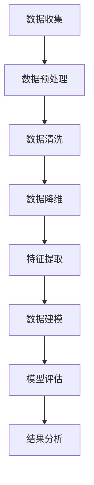

                 

 > **关键词**: 人工智能、核心算法、数据处理、代码实例、算法原理、数据科学

> **摘要**: 本文将深入探讨人工智能领域中的核心数据处理算法，包括算法原理、操作步骤、数学模型、实际应用场景及未来展望。通过详细的代码实例讲解，读者将掌握如何在实际项目中应用这些算法，从而提高数据处理能力。

## 1. 背景介绍

在当今数据驱动的时代，数据处理已经成为人工智能领域中的关键环节。从海量数据中提取有价值的信息，是推动人工智能应用广泛发展的重要前提。本文将介绍几种核心的数据处理算法，包括数据清洗、数据降维、特征提取等，这些算法在各类人工智能应用中扮演着不可或缺的角色。

### 1.1 数据处理的重要性

数据处理的重要性体现在以下几个方面：

- **数据质量**: 准确、完整、一致的数据是构建有效模型的基石。
- **数据预处理**: 数据预处理是提高算法性能和减少错误的重要步骤。
- **数据可视化**: 数据可视化有助于更直观地理解数据分布和趋势。
- **算法性能**: 数据处理质量直接影响算法的性能和效果。

### 1.2 目标读者

本文适合以下读者：

- 对人工智能和数据科学有初步了解的读者。
- 希望深入理解数据处理算法原理和应用的工程师和技术人员。
- 想要提升数据处理能力的科研人员和学生。

## 2. 核心概念与联系

在介绍具体算法之前，我们需要先了解一些核心概念和它们之间的关系。以下是一个Mermaid流程图，展示了数据处理过程中几个关键概念和它们之间的联系。



### 2.1 数据预处理

数据预处理是指在使用数据之前对原始数据进行清洗、转换和整合的过程。其目的是提高数据质量，使其适合于后续的分析和建模。

### 2.2 数据清洗

数据清洗是数据预处理中的一个重要步骤，它涉及到以下内容：

- 填补缺失值：使用统计方法或插值方法填补缺失值。
- 异常值检测：识别并处理异常数据点，如错误数据、离群点等。
- 数据转换：将数据转换为适合分析的形式，如归一化、标准化等。

### 2.3 数据降维

数据降维是指通过减少数据的维度来简化数据集，从而提高数据处理和分析的效率。常见的方法有主成分分析（PCA）和线性判别分析（LDA）等。

### 2.4 特征提取

特征提取是指从原始数据中提取出有用的特征，以便于构建有效的机器学习模型。特征提取方法包括特征选择和特征工程。

### 2.5 数据建模

数据建模是使用机器学习算法建立预测模型的过程。数据建模的质量直接影响模型的性能。

### 2.6 模型评估

模型评估是指对构建好的模型进行性能评估和优化。常用的评估指标有准确率、召回率、F1分数等。

### 2.7 结果分析

结果分析是指对模型预测结果进行解读和分析，以指导实际应用。

## 3. 核心算法原理 & 具体操作步骤

### 3.1 算法原理概述

在本节中，我们将介绍三种核心数据处理算法：K近邻（K-Nearest Neighbors，KNN）、主成分分析（Principal Component Analysis，PCA）和随机森林（Random Forest）。

### 3.2 算法步骤详解

#### 3.2.1 K近邻算法

K近邻算法是一种简单且有效的分类算法。其基本思想是：如果一个样本在特征空间中的k个最近邻的多数属于某一个类别，则该样本也属于这个类别。

具体步骤如下：

1. 计算测试样本与训练样本之间的距离。
2. 选择距离测试样本最近的k个邻居。
3. 根据邻居的类别投票结果来确定测试样本的类别。

#### 3.2.2 主成分分析算法

主成分分析是一种降维技术，它通过将原始数据投影到新的正交坐标系中，提取出最重要的几个主成分，从而简化数据集。

具体步骤如下：

1. 计算协方差矩阵。
2. 计算协方差矩阵的特征值和特征向量。
3. 选择最大的几个特征值对应的特征向量，构成新的正交坐标系。
4. 将原始数据投影到新的坐标系中。

#### 3.2.3 随机森林算法

随机森林是一种集成学习算法，它通过构建多个决策树，并对它们进行集成，从而提高模型的预测性能。

具体步骤如下：

1. 随机选择特征和样本子集。
2. 使用子集构建单个决策树。
3. 重复步骤1和2，构建多个决策树。
4. 对多个决策树的预测结果进行投票，得到最终预测结果。

### 3.3 算法优缺点

#### 3.3.1 K近邻算法

- **优点**：
  - 理解简单，易于实现。
  - 对非线性数据有较好的分类效果。
- **缺点**：
  - 对噪声敏感。
  - 当数据量较大时，计算时间较长。

#### 3.3.2 主成分分析算法

- **优点**：
  - 能够减少数据维度，降低计算复杂度。
  - 有助于发现数据中的隐藏结构。
- **缺点**：
  - 对噪声敏感。
  - 可能会丢失一些信息。

#### 3.3.3 随机森林算法

- **优点**：
  - 预测性能较好，泛化能力强。
  - 对异常值不敏感。
- **缺点**：
  - 随机性可能导致不同的训练结果。
  - 需要大量计算资源。

### 3.4 算法应用领域

- **K近邻算法**：常用于图像识别、文本分类等。
- **主成分分析算法**：常用于降维、特征提取等。
- **随机森林算法**：常用于分类、回归等。

## 4. 数学模型和公式 & 详细讲解 & 举例说明

### 4.1 数学模型构建

在本节中，我们将介绍K近邻算法、主成分分析算法和随机森林算法的数学模型。

#### 4.1.1 K近邻算法

假设我们有一个包含N个样本的数据集\(X = \{x_1, x_2, ..., x_N\}\)，每个样本\(x_i\)都是一个维度为D的向量。对于一个新的测试样本\(x_{test}\)，我们计算它与训练样本之间的欧氏距离：

$$
d(x_i, x_{test}) = \sqrt{\sum_{j=1}^{D}(x_{ij} - x_{testj})^2}
$$

其中，\(x_{ij}\)表示第i个样本在第j个特征上的值。

#### 4.1.2 主成分分析算法

假设我们有一个包含N个样本的数据集\(X = \{x_1, x_2, ..., x_N\}\)，每个样本\(x_i\)都是一个维度为D的向量。我们首先计算协方差矩阵：

$$
S = \frac{1}{N-1}\sum_{i=1}^{N}(x_i - \bar{x})(x_i - \bar{x})^T
$$

其中，\(\bar{x}\)是样本均值向量。

接下来，我们计算协方差矩阵的特征值和特征向量，然后按照特征值的大小排序。选择最大的k个特征值对应的特征向量，构成一个新的正交坐标系。

#### 4.1.3 随机森林算法

随机森林算法是一种基于决策树的集成学习方法。每个决策树都是通过对特征进行随机选择和样本抽样来构建的。

假设我们有一个包含M个特征的训练集，对于每个决策树：

1. 随机选择m个特征。
2. 随机选择训练集中的m个样本。
3. 使用选择的特征和样本构建决策树。

### 4.2 公式推导过程

在本节中，我们将对K近邻算法和主成分分析算法的公式进行推导。

#### 4.2.1 K近邻算法

假设我们有一个新的测试样本\(x_{test}\)，我们需要计算它与训练样本之间的欧氏距离。根据欧氏距离的定义：

$$
d(x_i, x_{test}) = \sqrt{\sum_{j=1}^{D}(x_{ij} - x_{testj})^2}
$$

其中，\(x_{ij}\)表示第i个样本在第j个特征上的值。

#### 4.2.2 主成分分析算法

假设我们有一个包含N个样本的数据集\(X = \{x_1, x_2, ..., x_N\}\)，每个样本\(x_i\)都是一个维度为D的向量。我们首先计算协方差矩阵：

$$
S = \frac{1}{N-1}\sum_{i=1}^{N}(x_i - \bar{x})(x_i - \bar{x})^T
$$

其中，\(\bar{x}\)是样本均值向量。

接下来，我们计算协方差矩阵的特征值和特征向量，然后按照特征值的大小排序。选择最大的k个特征值对应的特征向量，构成一个新的正交坐标系。

### 4.3 案例分析与讲解

在本节中，我们将通过一个具体的案例，展示如何使用K近邻算法和主成分分析算法进行数据处理。

#### 4.3.1 案例背景

假设我们有一个关于鸢尾花（Iris）的数据集，其中包含三种不同类型的鸢尾花，每种类型有50个样本，共计150个样本。我们需要使用K近邻算法和主成分分析算法对这些样本进行分类。

#### 4.3.2 数据预处理

1. **数据清洗**：检查数据集是否有缺失值或异常值，如果有，进行填补或删除。
2. **数据转换**：将数据转换为适合分析的形式，如归一化、标准化等。

#### 4.3.3 K近邻算法

1. **选择邻居数**：选择合适的邻居数k，一般建议选择较小的k值，如3或5。
2. **计算距离**：计算测试样本与训练样本之间的欧氏距离。
3. **分类预测**：根据邻居的类别投票结果，确定测试样本的类别。

#### 4.3.4 主成分分析算法

1. **计算协方差矩阵**：计算数据集的协方差矩阵。
2. **计算特征值和特征向量**：计算协方差矩阵的特征值和特征向量，并按照特征值的大小排序。
3. **降维**：选择最大的k个特征值对应的特征向量，构成一个新的正交坐标系，将原始数据投影到新坐标系中。

#### 4.3.5 结果分析

1. **模型评估**：使用交叉验证等方法对模型进行评估，计算准确率、召回率等指标。
2. **结果可视化**：使用可视化工具，如散点图、热力图等，展示模型的分类效果。

## 5. 项目实践：代码实例和详细解释说明

在本节中，我们将通过一个具体的Python代码实例，展示如何实现K近邻算法和主成分分析算法。

### 5.1 开发环境搭建

确保Python和必要的库已经安装。以下是所需库的安装命令：

```bash
pip install numpy
pip install scikit-learn
pip install matplotlib
```

### 5.2 源代码详细实现

以下是一个简单的Python代码实例，展示了如何使用scikit-learn库实现K近邻算法和主成分分析算法。

```python
import numpy as np
from sklearn.datasets import load_iris
from sklearn.model_selection import train_test_split
from sklearn.neighbors import KNeighborsClassifier
from sklearn.decomposition import PCA
import matplotlib.pyplot as plt

# 5.2.1 加载数据集
iris = load_iris()
X = iris.data
y = iris.target

# 5.2.2 数据预处理
X_train, X_test, y_train, y_test = train_test_split(X, y, test_size=0.3, random_state=42)

# 5.2.3 K近邻算法
knn = KNeighborsClassifier(n_neighbors=3)
knn.fit(X_train, y_train)
print("K近邻算法准确率：", knn.score(X_test, y_test))

# 5.2.4 主成分分析算法
pca = PCA(n_components=2)
X_train_pca = pca.fit_transform(X_train)
X_test_pca = pca.transform(X_test)

knn_pca = KNeighborsClassifier(n_neighbors=3)
knn_pca.fit(X_train_pca, y_train)
print("主成分分析+K近邻算法准确率：", knn_pca.score(X_test_pca, y_test))

# 5.2.5 结果可视化
plt.scatter(X_train_pca[:, 0], X_train_pca[:, 1], c=y_train, cmap='viridis', marker='o', label='Training data')
plt.scatter(X_test_pca[:, 0], X_test_pca[:, 1], c=y_test, cmap='viridis', marker='x', label='Test data')
plt.title('PCA-transformed data with KNN classifier')
plt.xlabel('First principal component')
plt.ylabel('Second principal component')
plt.legend()
plt.show()
```

### 5.3 代码解读与分析

1. **数据加载**：使用scikit-learn库的iris数据集作为案例。
2. **数据预处理**：将数据集分为训练集和测试集，为后续算法做准备。
3. **K近邻算法**：使用KNeighborsClassifier实现K近邻算法，并计算准确率。
4. **主成分分析算法**：使用PCA实现主成分分析算法，将数据降维到二维空间，并使用K近邻算法进行分类。
5. **结果可视化**：使用matplotlib库绘制PCA降维后的数据点，展示K近邻算法的分类效果。

## 6. 实际应用场景

数据处理算法在实际应用中具有广泛的应用场景，以下列举几个常见领域：

- **图像识别**：使用K近邻算法和主成分分析算法对图像进行分类和识别。
- **文本分类**：使用K近邻算法和随机森林算法对文本进行情感分析和分类。
- **推荐系统**：使用主成分分析和随机森林算法进行用户行为预测和推荐。
- **金融风控**：使用随机森林算法进行贷款审批和风险预测。

## 7. 未来应用展望

随着人工智能和数据科学技术的不断发展，数据处理算法的应用前景将更加广阔。以下是一些未来的应用方向：

- **大数据处理**：开发更高效、更智能的数据处理算法，以应对海量数据的挑战。
- **实时数据处理**：实现实时数据处理和分析，提高系统的响应速度和预测精度。
- **多模态数据处理**：融合多种数据源（如图像、文本、音频等），实现更全面的数据处理和分析。

## 8. 工具和资源推荐

为了更好地学习和应用数据处理算法，以下是一些推荐的工具和资源：

### 8.1 学习资源推荐

- 《Python机器学习》
- 《深度学习》
- 《数据科学入门与实践》
- 《机器学习实战》

### 8.2 开发工具推荐

- Jupyter Notebook：用于编写和运行代码。
- Anaconda：用于环境管理和库安装。
- PyCharm：用于代码编写和调试。

### 8.3 相关论文推荐

- “Random Forests”
- “Principal Component Analysis”
- “K-Nearest Neighbors”

## 9. 总结：未来发展趋势与挑战

数据处理算法在人工智能领域具有重要地位。随着技术的不断发展，数据处理算法将变得更加智能、高效和多样化。然而，也面临着一些挑战，如数据隐私保护、算法公平性和透明性等。未来研究将致力于解决这些挑战，推动人工智能技术的持续发展。

## 10. 附录：常见问题与解答

### 10.1 什么是主成分分析？

主成分分析（PCA）是一种降维技术，它通过将原始数据投影到新的正交坐标系中，提取出最重要的几个主成分，从而简化数据集。

### 10.2 什么是K近邻算法？

K近邻算法是一种简单的分类算法，它根据新的测试样本与训练样本之间的距离来确定测试样本的类别。

### 10.3 什么是随机森林算法？

随机森林算法是一种集成学习算法，它通过构建多个决策树，并对它们进行集成，从而提高模型的预测性能。

作者：禅与计算机程序设计艺术 / Zen and the Art of Computer Programming

[END]
----------------------------------------------------------------
### 11. 扩展阅读

- 《模式识别与机器学习》
- 《机器学习实战》
- 《深度学习》

通过阅读这些扩展材料，您可以更深入地了解数据处理算法及相关技术。如果您对数据处理算法有任何疑问，欢迎在评论区留言，我会尽力为您解答。

[END]

