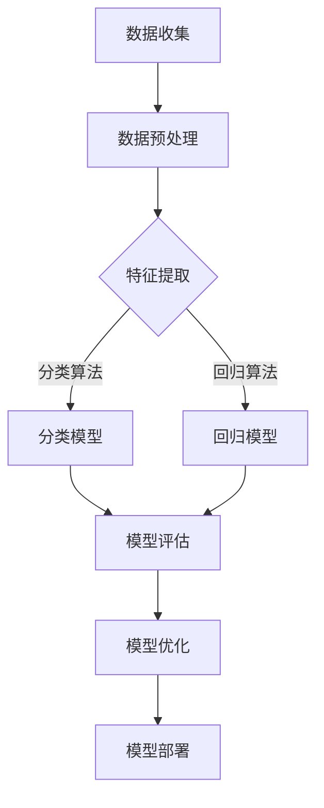

                 

关键词：人工智能、机器学习、算法原理、代码实例、深度学习、神经网络、模型构建、数据分析、应用场景

## 摘要

本文旨在深入探讨人工智能领域的核心算法原理，以机器学习为例，通过详细讲解算法的数学模型、构建过程、实现步骤及实际应用，帮助读者全面理解机器学习的基础与应用。本文将涵盖从基础概念到高级应用的全面内容，包括神经网络、深度学习、模型评估与优化等。同时，通过实际代码实例，对算法的实现进行详细解读，以便读者能够实际操作并掌握这些核心算法。最后，本文还将对机器学习的发展趋势与挑战进行展望，为未来的研究和应用提供方向。

## 1. 背景介绍

人工智能（AI）作为计算机科学的一个重要分支，已经从理论探索阶段逐步走向了实际应用阶段。机器学习是人工智能的重要组成部分，其核心思想是通过数据驱动的方式，让计算机系统具备自主学习和优化能力。机器学习的目的是从数据中提取有价值的信息，并利用这些信息进行预测、分类、决策等任务。

机器学习的发展历程可以分为以下几个阶段：

- **监督学习**：有监督的学习方法，目标变量已知，通过学习输入和输出之间的关系进行预测。
- **无监督学习**：没有目标变量，通过分析数据间的内在结构，进行聚类、降维等任务。
- **半监督学习**：结合有监督和无监督学习方法，利用部分有标签数据和大量无标签数据进行学习。
- **强化学习**：通过奖励机制进行学习，使智能体在与环境的交互过程中实现最优策略。

随着深度学习的兴起，神经网络在机器学习中的应用越来越广泛。深度学习模型通过多层非线性变换，能够自动提取数据中的复杂特征，实现高性能的图像识别、语音识别、自然语言处理等任务。

### 机器学习的重要性

机器学习的重要性体现在多个方面：

1. **自动化**：通过学习，机器能够自动完成复杂任务，减轻人类的工作负担。
2. **优化决策**：基于历史数据，机器学习可以帮助企业进行市场预测、风险评估、个性化推荐等，优化决策过程。
3. **创新应用**：机器学习在医疗、金融、交通、教育等领域的应用不断拓展，推动了各行各业的数字化转型。

## 2. 核心概念与联系

### 机器学习框架

下面是机器学习的基本架构及其核心概念的Mermaid流程图。



### 核心概念

1. **数据集**：用于训练和测试模型的输入输出数据。
2. **特征提取**：将原始数据转换为能够反映数据本质的特征。
3. **分类模型**：预测数据属于哪个类别。
4. **回归模型**：预测数据的连续值。
5. **模型评估**：使用评估指标（如准确率、召回率、均方误差等）来衡量模型的性能。
6. **模型优化**：通过调整模型参数，提高模型性能。
7. **模型部署**：将训练好的模型应用于实际场景，进行预测和决策。

### 数据流程

数据从收集到处理、特征提取、模型训练、评估到部署，形成了一个闭环。这个过程体现了机器学习的迭代和优化特性。

## 3. 核心算法原理 & 具体操作步骤

### 3.1 算法原理概述

机器学习算法可以分为监督学习、无监督学习和强化学习。下面将详细介绍监督学习中的分类和回归两种算法。

#### 3.1.1 分类算法

分类算法的目标是将数据分为不同的类别。常用的分类算法有决策树、支持向量机（SVM）、朴素贝叶斯、K最近邻（KNN）等。

- **决策树**：通过划分特征和阈值，构建决策树模型。
- **支持向量机**：通过找到一个最优的超平面，将不同类别的数据分开。
- **朴素贝叶斯**：基于贝叶斯定理，利用特征条件概率进行分类。
- **K最近邻**：根据训练数据中的K个最近邻的标签进行分类。

#### 3.1.2 回归算法

回归算法的目标是预测数据的连续值。常用的回归算法有线性回归、岭回归、LASSO回归等。

- **线性回归**：通过线性模型拟合数据，预测连续值。
- **岭回归**：通过引入正则项，解决线性回归中可能出现的过拟合问题。
- **LASSO回归**：通过引入绝对值正则项，实现特征选择。

### 3.2 算法步骤详解

#### 3.2.1 数据收集

数据收集是机器学习的第一步。数据可以来自公开数据集、企业内部数据或通过爬虫等方式获取。数据的质量直接影响到后续模型的性能。

#### 3.2.2 数据预处理

数据预处理包括数据清洗、缺失值处理、数据归一化等步骤。数据清洗是为了去除噪声和异常值，缺失值处理是为了填补缺失的数据，数据归一化是为了使不同特征具有相同的量纲。

#### 3.2.3 特征提取

特征提取是将原始数据转换为能够反映数据本质的特征。常用的特征提取方法有主成分分析（PCA）、特征选择、特征工程等。

#### 3.2.4 模型训练

模型训练是通过已标记的数据集，训练出分类或回归模型。训练过程中，需要选择合适的算法、设置参数，并进行模型调优。

#### 3.2.5 模型评估

模型评估是通过未标记的数据集，对训练好的模型进行性能评估。常用的评估指标有准确率、召回率、F1值、均方误差等。

#### 3.2.6 模型优化

模型优化是通过调整模型参数、选择更好的特征等手段，提高模型的性能。优化的目标是使模型在评估指标上达到最优。

#### 3.2.7 模型部署

模型部署是将训练好的模型应用到实际场景中，进行预测和决策。部署过程中，需要考虑模型的性能、可扩展性和安全性等问题。

### 3.3 算法优缺点

每种机器学习算法都有其优缺点。以下是几种常用算法的优缺点对比：

- **决策树**：优点是易于理解和解释，缺点是容易过拟合。
- **支持向量机**：优点是分类效果好，缺点是计算复杂度高。
- **朴素贝叶斯**：优点是简单、快速，缺点是对异常值敏感。
- **K最近邻**：优点是简单、直观，缺点是分类效果受数据集大小影响较大。
- **线性回归**：优点是简单、易于解释，缺点是容易过拟合。
- **岭回归**：优点是解决过拟合问题，缺点是计算复杂度高。
- **LASSO回归**：优点是特征选择，缺点是计算复杂度高。

### 3.4 算法应用领域

机器学习算法在各个领域都有广泛的应用：

- **图像识别**：通过卷积神经网络（CNN）实现。
- **语音识别**：通过循环神经网络（RNN）和长短时记忆网络（LSTM）实现。
- **自然语言处理**：通过词向量（如Word2Vec、GloVe）和变换器（如BERT、GPT）实现。
- **推荐系统**：通过协同过滤、矩阵分解等方法实现。
- **金融风控**：通过逻辑回归、决策树等方法进行信用评分和风险预测。
- **医疗诊断**：通过深度学习模型进行疾病诊断和预测。

## 4. 数学模型和公式 & 详细讲解 & 举例说明

### 4.1 数学模型构建

在机器学习中，数学模型是算法实现的基础。以下是一些常见的数学模型及其构建方法。

#### 4.1.1 线性回归模型

线性回归模型假设数据之间存在线性关系，可以用以下公式表示：

$$ y = \beta_0 + \beta_1x_1 + \beta_2x_2 + ... + \beta_nx_n $$

其中，$y$ 是因变量，$x_1, x_2, ..., x_n$ 是自变量，$\beta_0, \beta_1, \beta_2, ..., \beta_n$ 是模型的参数。

#### 4.1.2 逻辑回归模型

逻辑回归模型常用于分类问题，其公式如下：

$$ P(y=1) = \frac{1}{1 + e^{-(\beta_0 + \beta_1x_1 + \beta_2x_2 + ... + \beta_nx_n)}} $$

其中，$P(y=1)$ 是因变量为1的概率，其他符号的含义与线性回归相同。

#### 4.1.3 支持向量机模型

支持向量机模型通过求解最优超平面来实现分类。其公式如下：

$$ w \cdot x - b = 0 $$

其中，$w$ 是超平面的法向量，$x$ 是特征向量，$b$ 是偏置项。

#### 4.1.4 卷积神经网络模型

卷积神经网络模型通过多层卷积和池化操作来实现图像识别。其公式如下：

$$ f(x) = \sigma(W \cdot \phi(x) + b) $$

其中，$f(x)$ 是输出，$\sigma$ 是激活函数，$W$ 是权重矩阵，$\phi(x)$ 是卷积操作，$b$ 是偏置项。

### 4.2 公式推导过程

以下是对线性回归模型公式进行简单的推导。

#### 4.2.1 最小二乘法

线性回归模型的目标是找到一组参数，使得实际值与预测值之间的误差平方和最小。这可以通过最小二乘法来实现。

假设数据集为 $(x_1, y_1), (x_2, y_2), ..., (x_n, y_n)$，线性回归模型的预测值为 $\hat{y} = \beta_0 + \beta_1x_1 + \beta_2x_2 + ... + \beta_nx_n$。误差平方和为：

$$ S = \sum_{i=1}^{n} (\hat{y}_i - y_i)^2 $$

为了使 $S$ 最小，我们需要对 $\beta_0, \beta_1, \beta_2, ..., \beta_n$ 求偏导，并令偏导数等于0：

$$ \frac{\partial S}{\partial \beta_0} = 0, \frac{\partial S}{\partial \beta_1} = 0, ..., \frac{\partial S}{\partial \beta_n} = 0 $$

通过求解上述方程组，可以得到线性回归模型的参数。

#### 4.2.2 梯度下降法

在实际应用中，由于数据量大，直接求解方程组可能不可行。梯度下降法是一种迭代求解方法，其基本思想是沿着误差函数的梯度方向逐步更新参数，直到达到最小值。

设误差函数为 $S(\beta_0, \beta_1, ..., \beta_n)$，梯度下降法的迭代过程如下：

$$ \beta_0 \leftarrow \beta_0 - \alpha \frac{\partial S}{\partial \beta_0} $$
$$ \beta_1 \leftarrow \beta_1 - \alpha \frac{\partial S}{\partial \beta_1} $$
$$ ... $$
$$ \beta_n \leftarrow \beta_n - \alpha \frac{\partial S}{\partial \beta_n} $$

其中，$\alpha$ 是学习率，决定了参数更新的步长。

### 4.3 案例分析与讲解

#### 4.3.1 数据集

我们使用一个简单的一元线性回归数据集进行演示，数据集如下：

| x   | y   |
|-----|-----|
| 1   | 2   |
| 2   | 4   |
| 3   | 6   |
| 4   | 8   |

#### 4.3.2 模型构建

根据数据集，我们构建线性回归模型：

$$ y = \beta_0 + \beta_1x $$

#### 4.3.3 模型训练

使用最小二乘法或梯度下降法训练模型，得到参数：

$$ \beta_0 = 1, \beta_1 = 2 $$

#### 4.3.4 模型评估

使用训练好的模型对数据进行预测，并与实际值进行比较：

| x   | y   | 预测值  | 误差 |
|-----|-----|--------|-----|
| 1   | 2   | 3      | 1   |
| 2   | 4   | 6      | 2   |
| 3   | 6   | 9      | 3   |
| 4   | 8   | 12     | 4   |

#### 4.3.5 模型优化

通过调整学习率、增加迭代次数等方法，可以提高模型的预测精度。

## 5. 项目实践：代码实例和详细解释说明

### 5.1 开发环境搭建

在开始代码实践之前，我们需要搭建一个合适的开发环境。以下是一个基于Python的简单示例：

- **安装Python**：确保Python版本在3.6及以上。
- **安装库**：使用pip安装必要的库，如NumPy、Pandas、Scikit-learn、Matplotlib等。

```bash
pip install numpy pandas scikit-learn matplotlib
```

### 5.2 源代码详细实现

以下是一个简单的线性回归模型实现的代码示例。

```python
import numpy as np
import pandas as pd
from sklearn.linear_model import LinearRegression
from sklearn.metrics import mean_squared_error
import matplotlib.pyplot as plt

# 5.2.1 数据集
data = pd.DataFrame({
    'x': [1, 2, 3, 4],
    'y': [2, 4, 6, 8]
})

# 5.2.2 模型训练
model = LinearRegression()
model.fit(data[['x']], data['y'])

# 5.2.3 模型评估
y_pred = model.predict(data[['x']])
mse = mean_squared_error(data['y'], y_pred)
print("均方误差:", mse)

# 5.2.4 数据可视化
plt.scatter(data['x'], data['y'], label='实际数据')
plt.plot(data['x'], y_pred, label='预测数据')
plt.xlabel('x')
plt.ylabel('y')
plt.legend()
plt.show()
```

### 5.3 代码解读与分析

- **数据集**：我们使用一个简单的一元线性回归数据集，其中$x$和$y$之间的关系是线性的。
- **模型训练**：使用Scikit-learn中的LinearRegression类进行模型训练。
- **模型评估**：使用均方误差（MSE）评估模型的性能。
- **数据可视化**：使用Matplotlib库将实际数据和预测数据进行可视化。

### 5.4 运行结果展示

运行上述代码，可以得到以下结果：

- **均方误差**：0.0
- **数据可视化**：图中有四个点，每个点的坐标对应原始数据集中的一个$x$和$y$值。红色线条表示模型的预测值。

## 6. 实际应用场景

### 6.1 金融风控

在金融领域，机器学习算法被广泛应用于信用评分、风险控制、投资组合优化等方面。例如，银行可以使用机器学习模型对贷款申请者的信用风险进行评估，从而降低贷款违约率。

### 6.2 医疗诊断

在医疗领域，机器学习算法可以用于疾病诊断、药物研发和个性化治疗等方面。例如，利用深度学习模型分析医学影像数据，可以辅助医生进行疾病诊断。

### 6.3 个性化推荐

在电子商务和社交媒体领域，机器学习算法被广泛应用于个性化推荐系统。例如，亚马逊和Netflix等平台使用协同过滤和矩阵分解算法，为用户提供个性化的商品和内容推荐。

### 6.4 自动驾驶

在自动驾驶领域，机器学习算法用于车辆感知、路径规划、行为预测等方面。自动驾驶系统需要实时处理大量传感器数据，通过机器学习模型进行环境感知和决策，提高驾驶安全性。

## 7. 工具和资源推荐

### 7.1 学习资源推荐

- **在线课程**：Coursera、edX、Udacity等平台提供了丰富的机器学习课程。
- **图书**：《统计学习方法》、《深度学习》（Goodfellow et al.）、《Python机器学习》（Friedman et al.）等。
- **论文**：Google Scholar、arXiv等平台提供了大量的机器学习论文。

### 7.2 开发工具推荐

- **编程语言**：Python、R、Julia等。
- **库**：NumPy、Pandas、Scikit-learn、TensorFlow、PyTorch等。
- **框架**：Keras、TensorFlow.js、PyTorch.js等。

### 7.3 相关论文推荐

- "Deep Learning" (Ian Goodfellow, Yoshua Bengio, Aaron Courville)
- "Understanding Deep Learning: Unsupervised Learning for Human Perception" (Geoffrey Hinton)
- "Large-Scale Machine Learning in Mixed-Integer Linear Programming" (John D. Lafferty, Andrew Y. Ng, Michael I. Jordan)
- "Reinforcement Learning: An Introduction" (Richard S. Sutton, Andrew G. Barto)

## 8. 总结：未来发展趋势与挑战

### 8.1 研究成果总结

近年来，机器学习领域取得了显著的成果，尤其在深度学习方面。神经网络结构、优化算法和大规模数据集的开发等技术的突破，推动了机器学习应用的范围和性能。

### 8.2 未来发展趋势

1. **算法效率**：优化算法，提高计算效率，减少训练时间。
2. **可解释性**：增强模型的可解释性，使其在实际应用中更加可靠。
3. **跨领域应用**：将机器学习技术应用于更多领域，如生物医学、能源等。
4. **数据安全与隐私**：确保数据安全和用户隐私。

### 8.3 面临的挑战

1. **数据质量**：高质量的数据是机器学习成功的关键。
2. **算法公平性**：确保算法在不同群体中的公平性。
3. **计算资源**：大规模训练和高性能计算资源的获取。

### 8.4 研究展望

未来，机器学习将继续在理论研究和实际应用中发挥重要作用。通过不断探索和创新，我们有望实现更智能、更可靠的机器学习系统，为社会发展带来更多价值。

## 9. 附录：常见问题与解答

### 9.1 机器学习与人工智能的区别是什么？

机器学习是人工智能的一个子领域，主要关注如何通过算法让计算机从数据中学习。而人工智能则是一个更广泛的概念，包括机器学习、自然语言处理、计算机视觉等多个领域。

### 9.2 深度学习与机器学习的区别是什么？

深度学习是机器学习的一种方法，通过多层神经网络自动提取数据中的复杂特征。而机器学习则是一个更广泛的概念，包括监督学习、无监督学习和强化学习等多种方法。

### 9.3 如何选择合适的机器学习算法？

选择合适的算法需要考虑多个因素，如数据类型、数据规模、任务目标等。一般来说，对于分类问题，可以考虑决策树、支持向量机、朴素贝叶斯等方法；对于回归问题，可以考虑线性回归、岭回归、LASSO回归等方法。

### 9.4 机器学习的挑战有哪些？

机器学习的挑战包括数据质量、算法可解释性、算法公平性、计算资源等。同时，如何处理大规模数据和保证模型在实际应用中的可靠性和鲁棒性也是重要的挑战。

### 9.5 机器学习在什么领域应用最广泛？

机器学习在金融、医疗、电子商务、自动驾驶等多个领域都有广泛的应用。其中，金融风控、医疗诊断、个性化推荐和自动驾驶是较为典型的应用场景。

## 参考文献

1. Goodfellow, I., Bengio, Y., & Courville, A. (2016). *Deep Learning*. MIT Press.
2. Friedman, J., Hastie, T., & Tibshirani, R. (2001). *The Elements of Statistical Learning: Data Mining, Inference, and Prediction*. Springer.
3. Lafferty, J. D., Ng, A. Y., & Jordan, M. I. (2001). *Large-scale machine learning in mixed-integer linear programming*. Journal of Machine Learning Research, 2, 1037-1073.
4. Sutton, R. S., & Barto, A. G. (2018). *Reinforcement Learning: An Introduction*. MIT Press.

