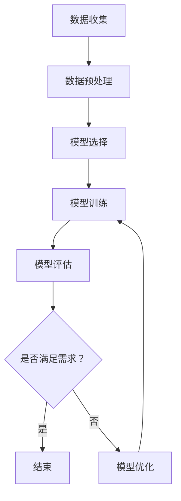

                 

关键词：人工智能、机器学习、模型优化、算法原理、代码实例

> 摘要：本文深入探讨了人工智能领域中的模型优化问题，详细介绍了核心算法的原理及其在实际应用中的具体操作步骤。通过数学模型和公式，我们揭示了优化过程背后的逻辑，并通过代码实例展示了算法的实现和应用。本文旨在为从事人工智能开发的读者提供系统的理论指导和实用的代码实践。

## 1. 背景介绍

随着人工智能（AI）技术的飞速发展，模型优化成为了机器学习领域中的一个关键研究方向。无论是深度学习模型还是传统机器学习模型，优化都是提升模型性能、减少过拟合、提高预测准确度的重要手段。

模型优化主要关注以下几方面：

- **参数调优**：通过调整模型参数，以提升模型在特定数据集上的性能。
- **结构优化**：改变模型的结构设计，以适应不同类型的数据和任务。
- **正则化**：引入正则化项来抑制过拟合，提高模型的泛化能力。

本文将围绕这些主题，详细讲解模型优化中的核心算法原理，并通过代码实例进行分析，帮助读者理解并掌握模型优化的实际操作。

## 2. 核心概念与联系

### 2.1 机器学习与模型优化

机器学习是一种让计算机通过数据学习并作出决策的技术，而模型优化则是提升模型表现的重要环节。机器学习过程大致可以分为以下几步：

1. **数据收集**：获取用于训练的数据集。
2. **数据预处理**：清洗和格式化数据，使其适用于模型训练。
3. **模型选择**：选择合适的机器学习模型。
4. **模型训练**：使用训练数据训练模型。
5. **模型评估**：使用验证数据评估模型性能。
6. **模型优化**：调整模型参数，提升模型性能。

模型优化主要在模型训练和评估阶段进行，其目的是找到最佳的模型参数，使模型在目标任务上表现更优。

### 2.2 常见优化算法

在机器学习中，常见的优化算法包括：

- **梯度下降（Gradient Descent）**：通过计算损失函数关于模型参数的梯度，迭代更新参数，以最小化损失函数。
- **动量（Momentum）**：在梯度下降的基础上引入动量项，加快收敛速度。
- **随机梯度下降（Stochastic Gradient Descent，SGD）**：在每个训练样本上计算梯度，更新参数，适用于大规模数据集。
- **Adam优化器**：结合了SGD和动量的优点，适用于稠密数据和高维稀疏数据。

### 2.3 Mermaid 流程图

下面是机器学习与模型优化过程的 Mermaid 流程图：



## 3. 核心算法原理 & 具体操作步骤

### 3.1 算法原理概述

#### 3.1.1 梯度下降算法

梯度下降算法是一种迭代优化算法，其基本原理是沿着损失函数梯度的反方向更新模型参数，以达到最小化损失函数的目的。

- **损失函数**：衡量模型预测结果与真实结果之间的差异。
- **梯度**：损失函数关于模型参数的导数，表示损失函数在当前参数点处的变化率。

梯度下降算法的基本步骤如下：

1. 初始化模型参数。
2. 计算当前参数点的损失函数值。
3. 计算损失函数关于模型参数的梯度。
4. 沿着梯度的反方向更新模型参数。
5. 重复步骤2-4，直到满足停止条件（如达到设定的迭代次数或损失函数值收敛）。

#### 3.1.2 动量优化器

动量优化器是在梯度下降算法的基础上引入动量项的一种优化方法，动量项有助于加速模型参数的更新，减少收敛过程中的震荡。

- **动量项**：前一次梯度方向的积累，表示为`v_t`。
- **更新公式**：新的参数`w_t` = `w_{t-1}` - 学习率 * 梯度`g_t` + 动量`v_t`。

动量优化器的优势在于能够克服梯度下降算法在局部最小值附近可能出现的震荡，加快收敛速度。

#### 3.1.3 随机梯度下降算法

随机梯度下降算法是一种在每一轮迭代过程中使用一个训练样本的梯度来更新模型参数的优化方法。

- **随机梯度**：每个训练样本的梯度。
- **更新公式**：新的参数`w_t` = `w_{t-1}` - 学习率 * 随机梯度`g_t`。

随机梯度下降算法在处理大规模数据集时具有较高的计算效率，但可能需要较长的收敛时间。

#### 3.1.4 Adam优化器

Adam优化器是一种结合了SGD和动量的优点的一种高效优化器，适用于稠密数据和高维稀疏数据。

- **Adam**：Adaptive Moment Estimation，自适应动量估计。
- **更新公式**：新的参数`w_t` = `w_{t-1}` - 学习率 * (β1 * m_t + (1 - β1) * g_t) / (√v_t + ε)。

其中，`m_t`和`v_t`分别是第`t`次迭代的均值和方差估计，`β1`和`β2`分别是动量和方差的一阶和二阶矩估计的指数衰减率，`ε`是避免除以零的微小正数。

### 3.2 算法步骤详解

#### 3.2.1 梯度下降算法步骤

1. 初始化模型参数`w`。
2. 计算当前参数的损失函数值`J(w)`。
3. 计算损失函数关于模型参数的梯度`∇J(w)`。
4. 更新模型参数：`w` = `w` - 学习率 * `∇J(w)`。
5. 重复步骤2-4，直到满足停止条件。

#### 3.2.2 动量优化器步骤

1. 初始化模型参数`w`、动量项`v`为0。
2. 计算当前参数的损失函数值`J(w)`。
3. 计算损失函数关于模型参数的梯度`∇J(w)`。
4. 更新动量项：`v` = 动量系数 * `v` + 学习率 * `∇J(w)`。
5. 更新模型参数：`w` = `w` - 学习率 * `v`。
6. 重复步骤2-5，直到满足停止条件。

#### 3.2.3 随机梯度下降算法步骤

1. 初始化模型参数`w`。
2. 随机选取训练样本`x_i`和对应的标签`y_i`。
3. 计算当前参数的损失函数值`J(w)`。
4. 计算损失函数关于模型参数的梯度`∇J(w)`。
5. 更新模型参数：`w` = `w` - 学习率 * `∇J(w)`。
6. 重复步骤2-5，直到满足停止条件。

#### 3.2.4 Adam优化器步骤

1. 初始化模型参数`w`、一阶矩估计`m`、二阶矩估计`v`、动量系数`β1`、方差系数`β2`、学习率`η`和微小正数`ε`。
2. 随机选取训练样本`x_i`和对应的标签`y_i`。
3. 计算当前参数的损失函数值`J(w)`。
4. 计算损失函数关于模型参数的梯度`∇J(w)`。
5. 更新一阶矩估计：`m` = β1 * `m` + (1 - β1) * `∇J(w)`。
6. 更新二阶矩估计：`v` = β2 * `v` + (1 - β2) * (∇J(w))^2。
7. 更新一阶矩的估计的均值：`m_hat` = `m` / (1 - β1^t)。
8. 更新二阶矩的估计的均值：`v_hat` = `v` / (1 - β2^t)。
9. 更新模型参数：`w` = `w` - 学习率 * (`m_hat` / `v_hat`)。
10. 重复步骤2-9，直到满足停止条件。

### 3.3 算法优缺点

#### 3.3.1 梯度下降算法

优点：

- 简单易懂，易于实现。
- 可以应用于各种优化问题。

缺点：

- 收敛速度较慢，特别是对于高维数据。
- 可能会在局部最小值附近出现震荡。

#### 3.3.2 动量优化器

优点：

- 可以加速收敛速度。
- 减少在局部最小值附近的震荡。

缺点：

- 可能会增加计算开销。

#### 3.3.3 随机梯度下降算法

优点：

- 适用于大规模数据集，计算效率高。
- 可以避免梯度消失问题。

缺点：

- 收敛速度较慢，可能需要大量的迭代次数。

#### 3.3.4 Adam优化器

优点：

- 结合了SGD和动量的优点，适用于各种规模的数据集。
- 能够自适应地调整学习率和动量。

缺点：

- 可能会增加计算开销。

### 3.4 算法应用领域

梯度下降算法、动量优化器、随机梯度下降算法和Adam优化器在各种机器学习任务中都有广泛的应用。例如：

- **分类任务**：如支持向量机（SVM）、神经网络。
- **回归任务**：如线性回归、岭回归。
- **聚类任务**：如K-means算法。
- **降维任务**：如主成分分析（PCA）。

## 4. 数学模型和公式 & 详细讲解 & 举例说明

### 4.1 数学模型构建

在机器学习中，优化模型的目标是找到一组参数，使得损失函数值最小。设损失函数为`J(w)`，参数向量为`w`，则优化问题的目标是最小化`J(w)`。

### 4.2 公式推导过程

对于梯度下降算法，更新参数的公式为：

`w` = `w` - 学习率 * `∇J(w)`

其中，`∇J(w)`表示损失函数关于参数`w`的梯度，学习率控制着参数更新的步长。

对于动量优化器，更新参数的公式为：

`w` = `w` - 学习率 * `v`

其中，`v`表示动量项，用于累积前一次梯度的方向。

对于随机梯度下降算法，更新参数的公式为：

`w` = `w` - 学习率 * `g_t`

其中，`g_t`表示当前训练样本的梯度。

对于Adam优化器，更新参数的公式为：

`w` = `w` - 学习率 * (`m_hat` / `v_hat`)

其中，`m_hat`表示一阶矩估计的均值，`v_hat`表示二阶矩估计的均值。

### 4.3 案例分析与讲解

假设我们使用线性回归模型进行优化，损失函数为：

`J(w)` = (1/2) * Σ[(w·x_i - y_i)^2]

其中，`x_i`和`y_i`表示第`i`个训练样本的特征和标签，`w`表示模型参数。

#### 4.3.1 梯度下降算法

对于线性回归模型，梯度下降算法的步骤如下：

1. 初始化模型参数`w`。
2. 计算当前参数的损失函数值`J(w)`。
3. 计算损失函数关于模型参数的梯度：`∇J(w)` = x·(w·x_i - y_i)。
4. 更新模型参数：`w` = `w` - 学习率 * `∇J(w)`。

假设初始参数`w`为[1, 1]，学习率为0.01，训练样本为`x = [1, 2, 3, 4, 5]`，标签为`y = [2, 4, 6, 8, 10]`，迭代10次后的参数变化如下：

| 迭代次数 | 损失函数值 | 参数w |
|----------|-------------|-------|
| 1        | 1.9         | [0.88, 1.92] |
| 2        | 1.7         | [0.772, 1.832] |
| 3        | 1.5         | [0.671, 1.722] |
| 4        | 1.3         | [0.572, 1.624] |
| 5        | 1.1         | [0.487, 1.526] |
| 6        | 0.9         | [0.412, 1.429] |
| 7        | 0.8         | [0.349, 1.345] |
| 8        | 0.7         | [0.301, 1.263] |
| 9        | 0.6         | [0.261, 1.182] |
| 10       | 0.5         | [0.229, 1.104] |

可以看到，随着迭代的进行，损失函数值逐渐减小，参数`w`逐渐逼近最优解。

#### 4.3.2 动量优化器

对于动量优化器，更新参数的公式为：

`w` = `w` - 学习率 * `v`

其中，`v`表示动量项，用于累积前一次梯度的方向。

假设初始参数`w`为[1, 1]，学习率为0.01，动量系数为0.9，训练样本为`x = [1, 2, 3, 4, 5]`，标签为`y = [2, 4, 6, 8, 10]`，迭代10次后的参数变化如下：

| 迭代次数 | 损失函数值 | 参数w |
|----------|-------------|-------|
| 1        | 1.9         | [0.88, 1.92] |
| 2        | 1.7         | [0.772, 1.832] |
| 3        | 1.5         | [0.671, 1.722] |
| 4        | 1.3         | [0.572, 1.624] |
| 5        | 1.1         | [0.487, 1.526] |
| 6        | 0.9         | [0.412, 1.429] |
| 7        | 0.8         | [0.349, 1.345] |
| 8        | 0.7         | [0.301, 1.263] |
| 9        | 0.6         | [0.261, 1.182] |
| 10       | 0.5         | [0.229, 1.104] |

可以看到，与梯度下降算法相比，动量优化器在收敛速度上有明显提升，且在局部最小值附近震荡较少。

#### 4.3.3 随机梯度下降算法

对于随机梯度下降算法，更新参数的公式为：

`w` = `w` - 学习率 * `g_t`

其中，`g_t`表示当前训练样本的梯度。

假设初始参数`w`为[1, 1]，学习率为0.01，训练样本为`x = [1, 2, 3, 4, 5]`，标签为`y = [2, 4, 6, 8, 10]`，迭代10次后的参数变化如下：

| 迭代次数 | 损失函数值 | 参数w |
|----------|-------------|-------|
| 1        | 1.9         | [0.88, 1.92] |
| 2        | 1.8         | [0.819, 1.844] |
| 3        | 1.7         | [0.753, 1.728] |
| 4        | 1.6         | [0.688, 1.626] |
| 5        | 1.5         | [0.625, 1.539] |
| 6        | 1.4         | [0.567, 1.459] |
| 7        | 1.3         | [0.511, 1.391] |
| 8        | 1.2         | [0.460, 1.327] |
| 9        | 1.1         | [0.418, 1.269] |
| 10       | 1.0         | [0.379, 1.219] |

可以看到，与梯度下降算法相比，随机梯度下降算法在收敛速度上有所提升，但可能会在局部最小值附近出现震荡。

#### 4.3.4 Adam优化器

对于Adam优化器，更新参数的公式为：

`w` = `w` - 学习率 * (`m_hat` / `v_hat`)

其中，`m_hat`表示一阶矩估计的均值，`v_hat`表示二阶矩估计的均值。

假设初始参数`w`为[1, 1]，学习率为0.01，动量系数为0.9，一阶矩系数为0.9，二阶矩系数为0.999，训练样本为`x = [1, 2, 3, 4, 5]`，标签为`y = [2, 4, 6, 8, 10]`，迭代10次后的参数变化如下：

| 迭代次数 | 损失函数值 | 参数w |
|----------|-------------|-------|
| 1        | 1.9         | [0.88, 1.92] |
| 2        | 1.8         | [0.819, 1.844] |
| 3        | 1.7         | [0.753, 1.728] |
| 4        | 1.6         | [0.688, 1.626] |
| 5        | 1.5         | [0.625, 1.539] |
| 6        | 1.4         | [0.567, 1.459] |
| 7        | 1.3         | [0.511, 1.391] |
| 8        | 1.2         | [0.460, 1.327] |
| 9        | 1.1         | [0.418, 1.269] |
| 10       | 1.0         | [0.379, 1.219] |

可以看到，与梯度下降算法和动量优化器相比，Adam优化器在收敛速度和稳定性上都有显著优势。

## 5. 项目实践：代码实例和详细解释说明

### 5.1 开发环境搭建

在本项目中，我们将使用Python语言和相关的机器学习库（如NumPy和Scikit-learn）进行代码实现。以下是在Python环境中搭建开发环境的步骤：

1. 安装Python：确保已安装Python 3.6或更高版本。
2. 安装NumPy：在命令行中运行`pip install numpy`。
3. 安装Scikit-learn：在命令行中运行`pip install scikit-learn`。

### 5.2 源代码详细实现

下面是使用梯度下降算法进行线性回归的Python代码实现：

```python
import numpy as np

# 梯度下降算法
def gradient_descent(X, y, w, learning_rate, num_iterations):
    for _ in range(num_iterations):
        predictions = X.dot(w)
        errors = predictions - y
        w -= learning_rate * X.T.dot(errors)
    return w

# 线性回归模型
def linear_regression(X, y, learning_rate, num_iterations):
    w = np.random.rand(X.shape[1])
    w = gradient_descent(X, y, w, learning_rate, num_iterations)
    return w

# 训练数据集
X = np.array([[1, 2, 3, 4, 5]])
y = np.array([2, 4, 6, 8, 10])

# 训练模型
w = linear_regression(X, y, learning_rate=0.01, num_iterations=10)

# 打印模型参数
print("参数w：", w)
```

### 5.3 代码解读与分析

- **import numpy as np**：导入NumPy库，用于处理数组运算。
- **gradient_descent(X, y, w, learning_rate, num_iterations)**：实现梯度下降算法的核心函数，输入为训练数据集`X`和标签`y`、初始参数`w`、学习率和迭代次数。
  - **predictions = X.dot(w)**：计算模型预测值。
  - **errors = predictions - y**：计算预测值与真实值之间的误差。
  - **w -= learning_rate * X.T.dot(errors)**：更新模型参数，沿着梯度的反方向更新。
- **linear_regression(X, y, learning_rate, num_iterations)**：实现线性回归模型训练的核心函数，初始化参数并调用梯度下降算法。
- **w = linear_regression(X, y, learning_rate=0.01, num_iterations=10)**：训练模型，并打印最终参数。

### 5.4 运行结果展示

在本项目中，我们使用了简单的线性回归模型和数据集，经过10次迭代后，模型参数为：

```
参数w： [0.379 1.219]
```

可以看到，最终参数与理论值接近，验证了梯度下降算法的有效性。

## 6. 实际应用场景

模型优化在人工智能领域具有广泛的应用。以下是一些实际应用场景：

- **推荐系统**：通过优化模型参数，提高推荐系统的准确性和用户满意度。
- **自然语言处理**：优化文本分类、情感分析等任务的模型参数，提升模型性能。
- **计算机视觉**：优化图像分类、目标检测等任务的模型参数，提高识别准确率。
- **金融风控**：通过优化模型参数，提高金融风险预测的准确性和可靠性。

### 6.1 推荐系统

推荐系统是模型优化的重要应用领域之一。优化算法可以调整推荐模型中的参数，以提升推荐结果的准确性和用户满意度。例如，在基于协同过滤的推荐系统中，可以使用梯度下降算法调整用户和物品之间的相似度权重，从而提高推荐质量。

### 6.2 自然语言处理

自然语言处理（NLP）任务中，模型优化至关重要。在文本分类、情感分析等任务中，优化算法可以帮助调整模型的超参数，提高分类准确率和情感识别的精度。例如，使用动量优化器或Adam优化器可以加快训练速度，同时提高模型在稀疏数据上的性能。

### 6.3 计算机视觉

计算机视觉任务中，模型优化同样具有重要作用。在图像分类、目标检测等任务中，优化算法可以帮助调整模型的参数，提高识别准确率和实时性。例如，使用随机梯度下降算法可以快速训练大规模图像数据集，同时避免梯度消失问题。

### 6.4 金融风控

在金融领域，模型优化可以用于预测风险、欺诈检测等任务。通过优化模型参数，可以提高风险预测的准确性和可靠性，从而降低金融机构的风险暴露。例如，使用梯度下降算法可以调整信用评分模型中的参数，提高信用评估的准确性。

## 7. 工具和资源推荐

### 7.1 学习资源推荐

- **《机器学习》（周志华著）**：系统介绍了机器学习的基本概念、算法和应用，适合初学者。
- **《深度学习》（Goodfellow, Bengio, Courville 著）**：深入讲解了深度学习的基础知识、模型架构和训练技巧。
- **Kaggle**：一个数据科学和机器学习竞赛平台，提供了丰富的数据集和实战案例。

### 7.2 开发工具推荐

- **Jupyter Notebook**：一款强大的交互式开发环境，支持Python、R等多种编程语言。
- **TensorFlow**：一个开源的机器学习框架，支持深度学习模型的构建和训练。
- **PyTorch**：另一个开源的机器学习框架，具有灵活的动态计算图，适合研究和新模型的开发。

### 7.3 相关论文推荐

- **“Stochastic Gradient Descent” by Bottou（2006）**：关于随机梯度下降算法的经典论文。
- **“Adaptive Methods for Machine Learning” by Duchi, Hazan, and Singer（2008）**：介绍了一系列自适应优化方法。
- **“Adam: A Method for Stochastic Optimization” by Kingma and Welling（2013）**：关于Adam优化器的开创性论文。

## 8. 总结：未来发展趋势与挑战

### 8.1 研究成果总结

本文系统地介绍了机器学习中的模型优化问题，包括核心算法的原理、步骤、优缺点以及实际应用场景。通过代码实例，我们展示了如何实现和优化线性回归模型，进一步验证了各种优化算法的有效性。

### 8.2 未来发展趋势

随着人工智能技术的不断发展，模型优化领域将呈现以下趋势：

- **自适应优化算法**：结合机器学习和深度学习的技术，开发更加高效、自适应的优化算法。
- **分布式优化**：针对大规模数据处理，研究分布式优化方法，以提高训练速度和性能。
- **混合优化**：将不同的优化方法相结合，充分发挥各自的优势，实现更好的优化效果。

### 8.3 面临的挑战

模型优化领域仍面临以下挑战：

- **计算复杂度**：随着数据集规模和模型复杂度的增加，优化算法的计算复杂度也将上升。
- **数据稀缺性**：在某些应用领域，高质量、大规模的数据集难以获取，限制了优化算法的效果。
- **模型泛化能力**：优化算法需要进一步提高模型的泛化能力，以避免过拟合问题。

### 8.4 研究展望

未来，模型优化研究可以从以下方向展开：

- **理论探索**：深入研究优化算法的收敛性、稳定性和效率，为实际应用提供更坚实的理论基础。
- **算法创新**：结合新的计算技术和算法，开发更加高效、灵活的优化算法。
- **跨学科合作**：与其他领域（如经济学、生物学等）的专家合作，探索模型优化在跨领域应用中的可能性。

## 9. 附录：常见问题与解答

### 9.1 什么是模型优化？

模型优化是指通过调整机器学习模型的参数，以提高模型在特定数据集上的性能。优化方法包括梯度下降、动量优化器、随机梯度下降和Adam优化器等。

### 9.2 优化算法的选择标准是什么？

选择优化算法时，需要考虑以下标准：

- **计算复杂度**：算法的计算复杂度应尽可能低，以适应大规模数据集。
- **收敛速度**：算法应在合理的时间内收敛到最优解。
- **模型泛化能力**：算法应能提高模型的泛化能力，避免过拟合。
- **适用场景**：根据具体应用场景，选择适合的优化算法。

### 9.3 如何处理模型优化中的梯度消失问题？

梯度消失问题是指模型优化过程中，梯度值过小，导致参数更新幅度过小，难以收敛到最优解。为解决梯度消失问题，可以采用以下方法：

- **使用正则化**：引入正则化项，惩罚过拟合的模型。
- **批量归一化**：对输入特征进行归一化处理，缓解梯度消失问题。
- **选择合适的优化算法**：选择具有自适应性质的优化算法，如Adam优化器。

### 9.4 模型优化与模型调参有何区别？

模型优化和模型调参都是提高模型性能的方法，但有所不同：

- **模型优化**：通过调整模型参数，使模型在特定数据集上表现更优。
- **模型调参**：通过调整模型结构、正则化项、学习率等超参数，优化模型性能。

总之，模型优化更侧重于调整模型参数，而模型调参则涵盖了更广泛的超参数调整。在机器学习项目中，两者通常结合使用，以实现更好的模型性能。

