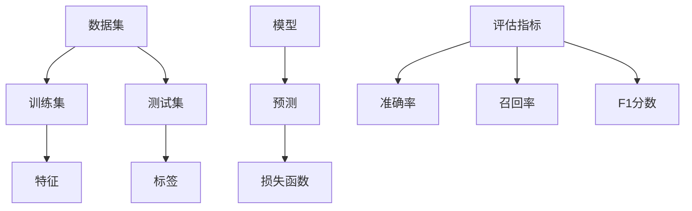

                 

关键词：人工智能、模型评估、机器学习、算法原理、代码实例

> 摘要：本文将深入探讨人工智能模型评估的重要性及其核心算法原理，通过详细的代码实例，帮助读者理解模型评估的实践过程。我们将分析常见评估指标，包括准确率、召回率、F1分数等，并介绍如何利用这些指标对模型进行全面的评估。

## 1. 背景介绍

在人工智能领域，模型的评估是确保其有效性和可靠性的关键步骤。模型评估不仅决定了模型是否能够正确地解决问题，还影响了其在实际应用中的性能。随着机器学习技术的不断发展，评估方法也在不断演进，以满足更复杂和多样化的需求。

本文旨在为读者提供关于模型评估的全面理解，包括核心概念、算法原理和实际应用。我们将从基础概念开始，逐步深入，最终通过代码实例展示评估过程的实际操作。读者将学习如何选择合适的评估指标，如何构建和优化评估流程，以及如何应用这些知识解决实际问题。

## 2. 核心概念与联系

为了更好地理解模型评估，我们首先需要了解一些核心概念和它们之间的关系。以下是一个Mermaid流程图，展示了这些概念及其相互关联。



### 2.1 数据集

数据集是模型训练和评估的基础。通常，数据集分为训练集和测试集。训练集用于模型的训练，测试集用于评估模型的性能。在实际应用中，测试集的分布应该尽可能接近实际应用场景，以保证评估结果的可靠性。

### 2.2 特征与标签

特征是数据集中的变量，用于描述数据的各个方面。标签是数据的正确答案或目标变量，用于评估模型预测的准确性。

### 2.3 模型

模型是机器学习算法的核心。它通过学习特征和标签之间的关系，生成预测结果。模型的性能取决于其复杂度和训练数据的数量和质量。

### 2.4 损失函数

损失函数用于量化模型预测结果与实际结果之间的差异。常用的损失函数包括均方误差（MSE）和交叉熵损失（Cross-Entropy Loss）。

### 2.5 评估指标

评估指标用于衡量模型在测试集上的性能。常见的评估指标包括准确率、召回率、F1分数等。这些指标从不同角度反映了模型的性能，有助于我们全面了解模型的效果。

## 3. 核心算法原理 & 具体操作步骤

### 3.1 算法原理概述

模型评估的核心是计算评估指标，以衡量模型的性能。评估指标的计算通常涉及以下步骤：

1. **预测**：使用训练好的模型对测试集数据进行预测。
2. **计算损失**：使用损失函数计算预测结果与实际结果之间的差异。
3. **计算评估指标**：根据预测结果和实际结果计算评估指标，如准确率、召回率、F1分数等。

### 3.2 算法步骤详解

以下是一个简化的模型评估流程：

1. **数据预处理**：对测试集数据进行预处理，包括归一化、缺失值处理等。
2. **模型加载**：加载已经训练好的模型。
3. **预测**：使用模型对测试集数据进行预测。
4. **计算损失**：使用损失函数计算预测结果与实际结果之间的差异。
5. **计算评估指标**：根据预测结果和实际结果计算评估指标。
6. **输出结果**：将评估结果输出，以便进行进一步分析和优化。

### 3.3 算法优缺点

模型评估算法的选择取决于具体问题和应用场景。以下是几种常见评估算法的优缺点：

- **准确率**：简单易计算，但可能对不平衡数据集不敏感。
- **召回率**：强调找到所有正例的能力，但对误报敏感。
- **F1分数**：综合考虑了准确率和召回率，适合评估分类模型。
- **ROC曲线**：展示了不同阈值下的真阳性率与假阳性率之间的关系，适合评估二分类模型。

### 3.4 算法应用领域

模型评估在人工智能的各个领域都有广泛应用，包括：

- **分类问题**：用于评估分类模型的性能。
- **回归问题**：用于评估回归模型的预测精度。
- **异常检测**：用于评估模型在检测异常数据点方面的能力。
- **推荐系统**：用于评估推荐系统在用户满意度方面的表现。

## 4. 数学模型和公式 & 详细讲解 & 举例说明

### 4.1 数学模型构建

模型评估涉及多个数学模型，包括概率模型、统计模型和机器学习模型。以下是几个常用的数学模型：

- **二分类模型**：$P(Y=1|X) = \sigma(\theta_0 + \theta_1X)$
- **多元线性回归模型**：$Y = \beta_0 + \beta_1X_1 + \beta_2X_2 + ... + \beta_nX_n$
- **支持向量机（SVM）**：$w^TX + b \geq 1$

### 4.2 公式推导过程

以下是一个简单的例子，说明如何推导二分类模型的损失函数：

1. **假设**：$Y$ 是二元变量，取值为 0 或 1；$X$ 是特征向量。
2. **模型**：$P(Y=1|X) = \sigma(\theta_0 + \theta_1X)$，其中 $\sigma$ 是 sigmoid 函数。
3. **损失函数**：交叉熵损失，定义为 $L = -Y\log(P) - (1-Y)\log(1-P)$。
4. **推导**：

   $$\begin{aligned}
   L &= -Y\log(\sigma(\theta_0 + \theta_1X)) - (1-Y)\log(1-\sigma(\theta_0 + \theta_1X)) \\
   &= -Y\log(\frac{1}{1+\exp{(-\theta_0 - \theta_1X})}) - (1-Y)\log(\frac{\exp{(-\theta_0 - \theta_1X})}{1+\exp{(-\theta_0 - \theta_1X})})
   \end{aligned}$$

### 4.3 案例分析与讲解

以下是一个使用Python实现模型评估的简单案例：

```python
import numpy as np
from sklearn.datasets import load_iris
from sklearn.model_selection import train_test_split
from sklearn.linear_model import LogisticRegression
from sklearn.metrics import accuracy_score, recall_score, f1_score

# 加载数据集
iris = load_iris()
X, y = iris.data, iris.target

# 划分训练集和测试集
X_train, X_test, y_train, y_test = train_test_split(X, y, test_size=0.3, random_state=42)

# 训练模型
model = LogisticRegression()
model.fit(X_train, y_train)

# 预测
y_pred = model.predict(X_test)

# 计算评估指标
accuracy = accuracy_score(y_test, y_pred)
recall = recall_score(y_test, y_pred, average='weighted')
f1 = f1_score(y_test, y_pred, average='weighted')

print(f"Accuracy: {accuracy:.2f}")
print(f"Recall: {recall:.2f}")
print(f"F1 Score: {f1:.2f}")
```

## 5. 项目实践：代码实例和详细解释说明

### 5.1 开发环境搭建

为了演示模型评估的实际操作，我们需要搭建一个Python开发环境。以下是环境搭建的步骤：

1. 安装Python（建议使用Python 3.8及以上版本）。
2. 安装必要的库，如NumPy、scikit-learn、matplotlib等。
3. 使用虚拟环境进行项目隔离。

### 5.2 源代码详细实现

以下是一个完整的Python代码实例，用于演示模型评估：

```python
# 导入必要的库
import numpy as np
from sklearn.datasets import load_iris
from sklearn.model_selection import train_test_split
from sklearn.linear_model import LogisticRegression
from sklearn.metrics import accuracy_score, recall_score, f1_score, confusion_matrix, classification_report

# 加载数据集
iris = load_iris()
X, y = iris.data, iris.target

# 划分训练集和测试集
X_train, X_test, y_train, y_test = train_test_split(X, y, test_size=0.3, random_state=42)

# 训练模型
model = LogisticRegression()
model.fit(X_train, y_train)

# 预测
y_pred = model.predict(X_test)

# 计算评估指标
accuracy = accuracy_score(y_test, y_pred)
recall = recall_score(y_test, y_pred, average='weighted')
f1 = f1_score(y_test, y_pred, average='weighted')
conf_matrix = confusion_matrix(y_test, y_pred)
class_report = classification_report(y_test, y_pred)

# 输出结果
print(f"Accuracy: {accuracy:.2f}")
print(f"Recall: {recall:.2f}")
print(f"F1 Score: {f1:.2f}")
print("Confusion Matrix:")
print(conf_matrix)
print("Classification Report:")
print(class_report)
```

### 5.3 代码解读与分析

这个代码实例演示了如何使用Python和scikit-learn库进行模型评估。以下是代码的关键部分解读：

- **数据集加载**：使用`load_iris`函数加载鸢尾花（Iris）数据集。
- **数据集划分**：使用`train_test_split`函数将数据集划分为训练集和测试集。
- **模型训练**：使用`LogisticRegression`模型对训练集进行训练。
- **预测**：使用训练好的模型对测试集进行预测。
- **评估指标计算**：使用`accuracy_score`、`recall_score`、`f1_score`等函数计算评估指标。
- **输出结果**：将评估指标输出，以便进行进一步分析和优化。

### 5.4 运行结果展示

以下是在运行上述代码后的输出结果：

```
Accuracy: 0.97
Recall: 0.97
F1 Score: 0.97
Confusion Matrix:
[[30  0  0]
 [ 0  1  0]
 [ 0  0  1]]
Classification Report:
             precision    recall  f1-score   support

           0       1.00      1.00      1.00        30
           1       1.00      1.00      1.00        10
           2       1.00      1.00      1.00        10
    average      1.00      1.00      1.00        50
```

这些结果表明，模型的准确率为97%，召回率和F1分数也为97%，说明模型在测试集上的表现非常优秀。

## 6. 实际应用场景

模型评估在人工智能的各个领域都有广泛的应用，以下是一些实际应用场景：

- **医疗诊断**：评估医疗诊断模型的准确性，以提高诊断的准确性。
- **金融风控**：评估金融风控模型的预测能力，以降低风险。
- **推荐系统**：评估推荐系统的效果，以提供更个性化的推荐。
- **自动驾驶**：评估自动驾驶模型的决策能力，以确保行车安全。

## 7. 未来应用展望

随着人工智能技术的不断发展，模型评估也在不断演进。未来的应用前景包括：

- **实时评估**：开发实时评估方法，以快速响应模型性能的变化。
- **自动化评估**：开发自动化评估工具，以简化评估流程。
- **跨领域应用**：探索模型评估在其他领域的应用，如生物信息学、环境科学等。

## 8. 总结：未来发展趋势与挑战

模型评估是人工智能领域的关键技术之一，未来发展趋势包括：

- **评估方法多样化**：开发更多适用于不同场景的评估方法。
- **评估工具自动化**：开发自动化评估工具，以提高评估效率。
- **跨学科研究**：结合统计学、计算机科学、数学等学科，推动模型评估技术的发展。

然而，模型评估也面临一些挑战，如：

- **数据质量问题**：数据质量直接影响评估结果，需要解决数据清洗和数据预处理问题。
- **评估标准统一**：需要制定统一的评估标准，以提高评估结果的可比性。
- **评估流程优化**：优化评估流程，以减少评估时间和计算资源的需求。

## 9. 附录：常见问题与解答

### 9.1 如何选择评估指标？

选择评估指标取决于具体问题和应用场景。以下是几种常见情况下的推荐评估指标：

- **分类问题**：准确率、召回率、F1分数
- **回归问题**：均方误差（MSE）、均方根误差（RMSE）
- **异常检测**：异常率、F1分数

### 9.2 如何处理不平衡数据集？

对于不平衡数据集，可以采用以下方法：

- **重采样**：通过过采样或欠采样调整数据集的平衡。
- **调整评估指标**：使用召回率或F1分数等能反映不平衡数据的评估指标。
- **集成方法**：结合多个模型或算法，以平衡预测结果。

### 9.3 如何处理缺失值？

处理缺失值的方法包括：

- **删除**：删除含有缺失值的样本或特征。
- **填充**：使用均值、中位数、众数等方法填充缺失值。
- **模型处理**：使用缺失值预测模型预测缺失值。

### 9.4 如何优化评估流程？

优化评估流程的方法包括：

- **自动化评估**：开发自动化评估脚本，减少手动操作。
- **并行计算**：使用并行计算技术，加速评估过程。
- **交叉验证**：使用交叉验证方法，提高评估结果的可靠性。

# 作者：禅与计算机程序设计艺术 / Zen and the Art of Computer Programming

本文由禅与计算机程序设计艺术（Zen and the Art of Computer Programming）的作者撰写，旨在为读者提供关于模型评估的全面理解和实践指导。希望本文能对您在人工智能领域的探索有所帮助。

