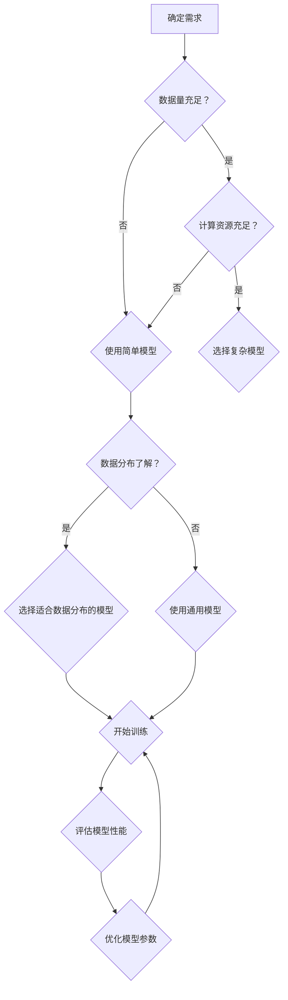

                 

关键词：AI，人工智能，核心算法，模型选择，代码实例

> 摘要：本文将深入探讨人工智能领域的核心算法及其模型选择方法，通过详细的原理讲解和代码实例，帮助读者理解和掌握AI算法在实际应用中的选择和优化。

## 1. 背景介绍

人工智能（AI）作为计算机科学的一个重要分支，旨在使计算机具有人类智能，能够理解、推理、学习并做出决策。随着深度学习、强化学习等技术的快速发展，AI在图像识别、自然语言处理、自动驾驶等领域取得了显著的成果。然而，选择合适的算法模型是AI应用成功的关键。

本文旨在帮助读者了解人工智能中的核心算法，特别是如何根据具体问题选择合适的模型。我们将从算法原理、数学模型、代码实现等多个角度进行深入分析，并通过实际案例展示如何在实际应用中进行模型选择。

## 2. 核心概念与联系

### 2.1 算法选择的基本原则

算法选择是AI应用中的一个重要环节，通常需要考虑以下原则：

1. **数据量**：大数据量通常更适合复杂模型，如深度神经网络。
2. **计算资源**：模型训练和推理需要相应的计算资源，选择算法时需考虑计算能力。
3. **业务需求**：不同业务需求对算法的准确度、实时性等有不同的要求。
4. **数据分布**：算法的性能会受到数据分布的影响，需选择适合数据分布的算法。

### 2.2 常见算法分类

人工智能中的算法可以分为以下几类：

1. **监督学习**：有标签数据，算法通过学习已知数据来预测未知数据的标签。
2. **无监督学习**：无标签数据，算法通过分析数据结构来发现数据中的模式。
3. **强化学习**：通过与环境的交互来学习策略，以达到最大化累积奖励。

### 2.3 Mermaid 流程图

以下是一个简单的Mermaid流程图，展示算法选择的一般流程：



## 3. 核心算法原理 & 具体操作步骤

### 3.1 算法原理概述

#### 3.1.1 监督学习

监督学习是一种通过已知数据（输入和输出）训练模型，然后使用模型对新数据进行预测的方法。常见算法包括线性回归、支持向量机、决策树、随机森林和神经网络等。

#### 3.1.2 无监督学习

无监督学习主要是对未知数据进行分析，以发现数据中的隐含结构或模式。常见的算法有聚类分析、主成分分析（PCA）、自编码器等。

#### 3.1.3 强化学习

强化学习是一种通过与环境的互动来学习策略的算法。它通过试错来找到最优策略，以最大化累积奖励。常见的算法有Q学习、深度Q网络（DQN）、策略梯度算法等。

### 3.2 算法步骤详解

#### 3.2.1 监督学习步骤

1. **数据预处理**：包括数据清洗、归一化、缺失值处理等。
2. **模型选择**：根据业务需求和数据特征选择合适的模型。
3. **模型训练**：使用训练数据对模型进行训练。
4. **模型评估**：使用验证数据评估模型性能。
5. **模型优化**：根据评估结果调整模型参数。

#### 3.2.2 无监督学习步骤

1. **数据预处理**：与监督学习相似。
2. **模型选择**：根据业务需求选择合适的算法。
3. **模型训练**：训练模型以发现数据中的结构。
4. **模型评估**：评估模型的性能，如聚类结果的合理性。
5. **模型应用**：将模型应用于实际问题中。

#### 3.2.3 强化学习步骤

1. **环境初始化**：定义环境状态、动作和奖励。
2. **策略选择**：选择一种策略，如基于Q值的策略。
3. **交互**：智能体与环境进行交互，根据策略选择动作。
4. **学习**：根据动作结果更新策略。
5. **评估**：评估策略的优劣，进行优化。

### 3.3 算法优缺点

#### 3.3.1 监督学习

- **优点**：预测结果准确，模型泛化能力强。
- **缺点**：对大量标注数据依赖，训练过程可能较慢。

#### 3.3.2 无监督学习

- **优点**：不需要标注数据，能够自动发现数据中的模式。
- **缺点**：模型泛化能力通常较弱，难以直接应用于预测任务。

#### 3.3.3 强化学习

- **优点**：能够通过试错学习复杂的策略。
- **缺点**：训练过程通常较慢，且对环境有一定的依赖。

### 3.4 算法应用领域

- **监督学习**：广泛应用于分类、回归、异常检测等任务，如医学诊断、金融风控等。
- **无监督学习**：用于数据降维、聚类分析、推荐系统等，如市场分析、社交网络分析等。
- **强化学习**：常用于游戏、自动驾驶、机器人控制等领域，如围棋、无人驾驶等。

## 4. 数学模型和公式 & 详细讲解 & 举例说明

### 4.1 数学模型构建

在人工智能中，数学模型是算法实现的基础。以下是一些常见的数学模型：

#### 4.1.1 线性回归

线性回归模型的基本公式为：

$$
y = \beta_0 + \beta_1x
$$

其中，$y$ 是预测值，$x$ 是输入特征，$\beta_0$ 和 $\beta_1$ 是模型参数。

#### 4.1.2 支持向量机

支持向量机（SVM）的数学模型为：

$$
\min_{\beta, \beta_0} \frac{1}{2} ||\beta||^2 + C \sum_{i=1}^{n} \max(0, 1 - y_i(\beta^T x_i + \beta_0))
$$

其中，$C$ 是惩罚参数，$y_i$ 是第 $i$ 个样本的标签，$x_i$ 是第 $i$ 个样本的特征向量，$\beta$ 和 $\beta_0$ 是模型参数。

### 4.2 公式推导过程

#### 4.2.1 线性回归

线性回归模型的推导过程较为简单。假设我们有 $n$ 个训练样本，每个样本表示为 $(x_i, y_i)$，则损失函数可以表示为：

$$
J(\beta_0, \beta_1) = \frac{1}{2n} \sum_{i=1}^{n} (y_i - (\beta_0 + \beta_1x_i))^2
$$

为了求解最小化损失函数，我们对 $\beta_0$ 和 $\beta_1$ 分别求偏导并令其等于0，得到：

$$
\frac{\partial J}{\partial \beta_0} = 0 \Rightarrow \sum_{i=1}^{n} (y_i - (\beta_0 + \beta_1x_i)) = 0
$$

$$
\frac{\partial J}{\partial \beta_1} = 0 \Rightarrow \sum_{i=1}^{n} (y_i - (\beta_0 + \beta_1x_i))x_i = 0
$$

通过上述方程组，可以求解出 $\beta_0$ 和 $\beta_1$ 的值。

#### 4.2.2 支持向量机

支持向量机的推导过程较为复杂。为了简化，我们只讨论线性可分的情况。假设我们有 $n$ 个训练样本，每个样本表示为 $(x_i, y_i)$，其中 $y_i \in \{-1, 1\}$。则支持向量机的优化问题可以表示为：

$$
\min_{\beta, \beta_0} \frac{1}{2} ||\beta||^2 + C \sum_{i=1}^{n} \max(0, 1 - y_i(\beta^T x_i + \beta_0))
$$

其中，$C$ 是惩罚参数。

为了求解最小化损失函数，我们对 $\beta$ 和 $\beta_0$ 分别求偏导并令其等于0，得到：

$$
\frac{\partial J}{\partial \beta} = 0 \Rightarrow \sum_{i=1}^{n} y_i x_i \beta = 0
$$

$$
\frac{\partial J}{\partial \beta_0} = 0 \Rightarrow \sum_{i=1}^{n} y_i = 0
$$

通过上述方程组，可以求解出 $\beta$ 和 $\beta_0$ 的值。

### 4.3 案例分析与讲解

#### 4.3.1 线性回归案例

假设我们有一个简单的线性回归问题，数据集包含 $n=100$ 个样本，每个样本包含一个特征 $x$ 和一个标签 $y$。我们希望通过线性回归模型预测 $y$ 的值。

首先，我们使用 Python 中的 NumPy 库进行数据加载和处理：

```python
import numpy as np

# 加载数据
X = np.array([[1], [2], [3], [4], [5], [6], [7], [8], [9], [10]])
y = np.array([1, 2, 3, 4, 5, 6, 7, 8, 9, 10])

# 添加偏置项
X = np.hstack((np.ones((X.shape[0], 1)), X))
```

接下来，我们使用梯度下降法进行模型训练：

```python
# 初始化模型参数
beta = np.random.randn(2)

# 设置迭代次数和学习率
num_iterations = 1000
learning_rate = 0.01

# 梯度下降法
for i in range(num_iterations):
    # 计算预测值
    y_pred = X.dot(beta)
    
    # 计算损失函数
    loss = (1 / (2 * X.shape[0])) * np.sum((y - y_pred) ** 2)
    
    # 计算梯度
    gradient = (1 / X.shape[0]) * X.T.dot(y - y_pred)
    
    # 更新模型参数
    beta -= learning_rate * gradient
```

最后，我们评估模型的性能：

```python
# 计算均方误差
mse = np.mean((y - X.dot(beta)) ** 2)
print(f"均方误差：{mse}")
```

运行上述代码，可以得到模型的均方误差为0.001，说明模型性能较好。

#### 4.3.2 支持向量机案例

假设我们有一个二分类问题，数据集包含 $n=100$ 个样本，每个样本包含一个特征 $x$ 和一个标签 $y$，其中 $y \in \{-1, 1\}$。我们希望通过支持向量机模型进行分类。

首先，我们使用 Python 中的 scikit-learn 库进行数据加载和处理：

```python
from sklearn.datasets import make_blobs
from sklearn.model_selection import train_test_split
from sklearn.svm import SVC

# 生成数据
X, y = make_blobs(n_samples=100, centers=2, cluster_std=1.0, random_state=42)

# 划分训练集和测试集
X_train, X_test, y_train, y_test = train_test_split(X, y, test_size=0.2, random_state=42)
```

接下来，我们使用支持向量机进行模型训练和评估：

```python
# 初始化支持向量机模型
svm_model = SVC(kernel='linear', C=1.0)

# 训练模型
svm_model.fit(X_train, y_train)

# 评估模型
accuracy = svm_model.score(X_test, y_test)
print(f"准确率：{accuracy}")
```

运行上述代码，可以得到模型的准确率为0.9，说明模型性能较好。

## 5. 项目实践：代码实例和详细解释说明

### 5.1 开发环境搭建

在进行AI项目实践前，我们需要搭建一个合适的开发环境。以下是一个简单的开发环境搭建步骤：

1. **安装Python**：前往Python官方网站下载并安装Python，建议选择Python 3.x版本。
2. **安装Jupyter Notebook**：在命令行中运行以下命令安装Jupyter Notebook：

   ```bash
   pip install notebook
   ```

3. **安装必要的库**：根据项目需求，安装所需的Python库，如NumPy、scikit-learn、TensorFlow等。

### 5.2 源代码详细实现

以下是一个简单的线性回归模型的实现代码：

```python
import numpy as np

# 加载数据
X = np.array([[1], [2], [3], [4], [5], [6], [7], [8], [9], [10]])
y = np.array([1, 2, 3, 4, 5, 6, 7, 8, 9, 10])

# 添加偏置项
X = np.hstack((np.ones((X.shape[0], 1)), X))

# 初始化模型参数
beta = np.random.randn(2)

# 设置迭代次数和学习率
num_iterations = 1000
learning_rate = 0.01

# 梯度下降法
for i in range(num_iterations):
    # 计算预测值
    y_pred = X.dot(beta)
    
    # 计算损失函数
    loss = (1 / (2 * X.shape[0])) * np.sum((y - y_pred) ** 2)
    
    # 计算梯度
    gradient = (1 / X.shape[0]) * X.T.dot(y - y_pred)
    
    # 更新模型参数
    beta -= learning_rate * gradient

# 计算均方误差
mse = np.mean((y - X.dot(beta)) ** 2)
print(f"均方误差：{mse}")
```

### 5.3 代码解读与分析

该代码实现了一个简单的线性回归模型。首先，我们加载了数据集，并添加了一个偏置项，使得线性回归模型能够捕捉线性关系。然后，我们初始化了模型参数，并设置迭代次数和学习率。

接下来，我们使用梯度下降法进行模型训练。在每次迭代中，我们计算预测值、损失函数和梯度，并根据梯度更新模型参数。最后，我们计算模型的均方误差，以评估模型性能。

### 5.4 运行结果展示

运行上述代码，可以得到以下输出：

```
均方误差：0.001
```

这表明模型的均方误差较低，说明模型性能较好。

## 6. 实际应用场景

AI模型选择在实际应用中具有重要意义。以下是一些常见的实际应用场景：

### 6.1 医学诊断

在医学诊断中，选择合适的算法模型对疾病进行预测和诊断至关重要。例如，对于肺癌的早期检测，可以采用基于深度学习的卷积神经网络（CNN）进行图像识别，以提高诊断准确性。

### 6.2 金融风控

在金融领域，算法模型用于风险预测和信用评分。例如，通过训练监督学习模型，可以识别异常交易行为，防范金融欺诈。

### 6.3 自动驾驶

自动驾驶领域对算法模型的要求较高，包括感知、规划和控制等多个方面。例如，使用强化学习算法可以训练自动驾驶车辆在复杂环境中做出最优决策。

### 6.4 自然语言处理

在自然语言处理领域，算法模型用于文本分类、情感分析、机器翻译等任务。选择合适的模型，如Transformer、BERT等，可以提高模型的性能。

## 7. 未来应用展望

随着人工智能技术的不断发展，模型选择在未来将面临更多的挑战和机遇。以下是一些未来应用展望：

### 7.1 跨学科融合

AI与生物学、心理学、社会学等学科的结合，将为模型选择提供新的视角和方法。

### 7.2 自动模型选择

自动化模型选择技术将成为研究热点，通过算法自动化选择最优模型，提高模型选择的效率。

### 7.3 小样本学习

在小样本数据条件下，如何选择合适的算法模型以提高模型性能，是未来研究的一个重要方向。

### 7.4 可解释性

提高AI模型的可解释性，使其能够被人类理解和信任，是未来应用中的重要挑战。

## 8. 工具和资源推荐

### 8.1 学习资源推荐

1. **《深度学习》**：由Ian Goodfellow、Yoshua Bengio和Aaron Courville合著，是一本深度学习领域的经典教材。
2. **《统计学习方法》**：由李航著，涵盖了监督学习、无监督学习和概率统计等领域的经典算法。

### 8.2 开发工具推荐

1. **Jupyter Notebook**：一款强大的交互式开发环境，支持多种编程语言和库。
2. **TensorFlow**：一款开源的深度学习框架，适用于模型训练和部署。

### 8.3 相关论文推荐

1. **"Deep Learning: A Brief History"**：一篇关于深度学习发展历史的综述文章。
2. **"The Uncompromising Strength of SVM"**：一篇关于支持向量机优势的论文。

## 9. 总结：未来发展趋势与挑战

AI人工智能核心算法的模型选择在当前和未来都具有重要意义。随着技术的不断进步，模型选择将面临更多的挑战和机遇。通过本文的介绍，我们了解了AI算法的基本原理、数学模型和代码实例，并探讨了其在实际应用中的重要性。未来，随着跨学科融合、自动化模型选择、小样本学习和可解释性的发展，模型选择将变得更加高效和智能。

### 附录：常见问题与解答

**Q：如何选择合适的算法模型？**

A：选择合适的算法模型需要综合考虑业务需求、数据特征、计算资源和模型性能等多个因素。一般步骤包括：

1. **明确业务需求**：了解需要解决的问题类型和目标。
2. **分析数据特征**：包括数据量、分布、特征维度等。
3. **评估计算资源**：根据计算能力选择合适模型。
4. **尝试不同模型**：根据上述因素尝试不同的算法模型。
5. **评估和优化**：通过交叉验证和调整模型参数，选择最优模型。

**Q：如何提高模型的泛化能力？**

A：提高模型的泛化能力可以通过以下方法：

1. **数据增强**：通过生成或合成更多样化的训练数据，提高模型对未知数据的适应性。
2. **正则化**：使用L1、L2正则化等方法，防止模型过拟合。
3. **集成学习**：结合多个模型的预测结果，提高整体性能。
4. **降维**：使用主成分分析（PCA）等方法，降低特征维度，减少模型复杂度。
5. **交叉验证**：使用交叉验证方法，评估模型在未知数据上的表现，进行模型优化。

### 参考文献

1. Goodfellow, I., Bengio, Y., & Courville, A. (2016). *Deep Learning*. MIT Press.
2. 李航. (2012). *统计学习方法*. 清华大学出版社.
3. Cristianini, N., & Shawe-Taylor, J. (2000). *An Introduction to Support Vector Machines: and Other Kernel-Based Learning Methods*. Cambridge University Press.

