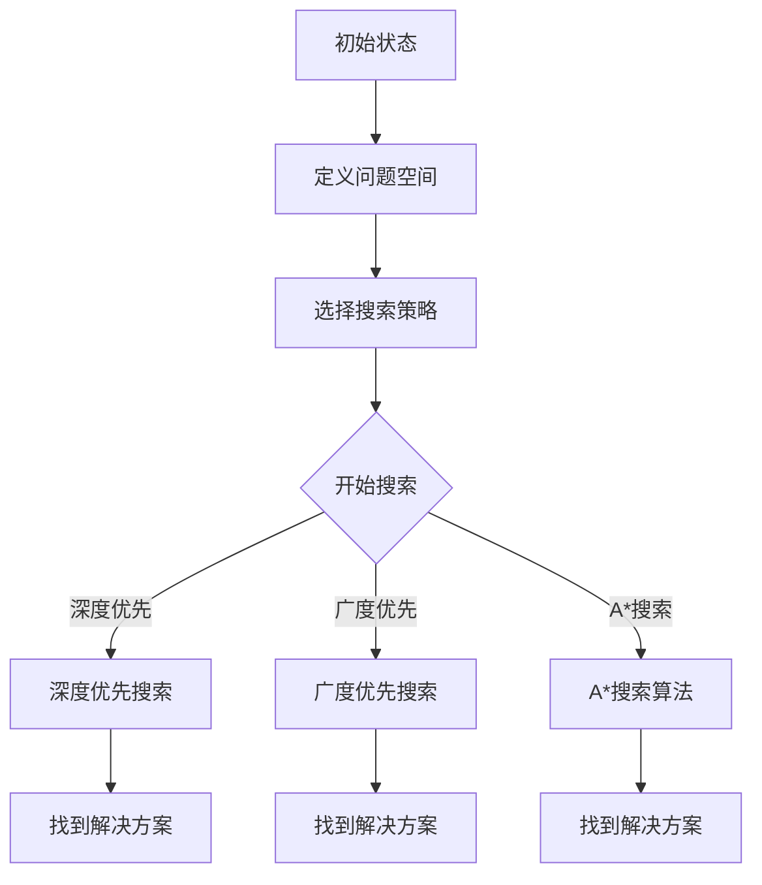

                 

人工智能（AI）是当今技术领域的热点，其在各个行业中的应用日益广泛。本文旨在深入探讨AI核心算法原理，通过实例代码展示通用问题求解的过程。本文将分为八个部分，从背景介绍到具体算法实现，再到应用展望，全面解析AI的核心技术。

## 文章关键词

- 人工智能
- 算法原理
- 问题求解
- 代码实例
- 应用领域

## 文章摘要

本文首先介绍人工智能的背景和核心算法，接着详细讲解通用问题求解的算法原理和具体操作步骤。随后，通过数学模型和公式，对算法进行深入分析。文章还提供了实际项目中的代码实例和详细解释。最后，讨论AI在实际应用场景中的表现以及未来发展的趋势和挑战。

### 1. 背景介绍

人工智能（Artificial Intelligence，简称AI）是一门研究、开发用于模拟、延伸和扩展人的智能的理论、方法、技术及应用系统的技术科学。自1956年达特茅斯会议以来，AI经历了多个发展阶段，从最初的符号主义、连接主义到现在的强化学习和深度学习，每种方法都有其独特的应用场景和优势。

AI的核心在于算法，而问题求解是AI的重要应用之一。问题求解涉及到如何从给定的问题空间中找到解决方案，是AI研究和应用的基础。通用问题求解（Universal Problem Solving，UPSM）是一种基于逻辑和搜索的策略，适用于多种类型的问题。

本文将深入探讨通用问题求解算法的原理，通过代码实例展示其实际应用，帮助读者更好地理解AI的核心技术。

### 2. 核心概念与联系

#### 2.1 问题求解

问题求解是指从一个给定的初始状态开始，通过一系列的操作，达到目标状态的过程。问题求解通常包括以下几个基本要素：

- **问题空间（Problem Space）**：所有可能的操作集合和状态集合。
- **初始状态（Initial State）**：问题的开始状态。
- **目标状态（Goal State）**：问题期望达到的状态。
- **操作（Operator）**：从当前状态转移到另一个状态的方法。
- **路径（Path）**：从初始状态到目标状态的转换序列。

#### 2.2 通用问题求解

通用问题求解（UPSM）是一种基于逻辑和搜索的策略，旨在解决各种类型的问题。UPSM的核心思想是通过一系列的搜索策略来找到问题的解决方案。常见的搜索策略包括：

- **深度优先搜索（DFS）**：从根节点开始，一直向下搜索，直到找到目标状态或达到搜索的深度限制。
- **广度优先搜索（BFS）**：从根节点开始，逐层搜索，直到找到目标状态。
- **A*搜索算法**：结合启发式信息，优先搜索最有可能到达目标状态的路径。

#### 2.3 Mermaid 流程图

下面是一个简单的Mermaid流程图，展示了通用问题求解的基本流程：



### 3. 核心算法原理 & 具体操作步骤

#### 3.1 算法原理概述

通用问题求解算法的基本原理是：从初始状态开始，通过一系列的操作，逐步接近目标状态。在这个过程中，算法需要不断地评估当前状态与目标状态之间的差距，并选择最优的操作路径。

通用问题求解算法的核心步骤包括：

1. **定义问题空间**：确定所有可能的操作和状态。
2. **选择搜索策略**：根据问题的特点选择合适的搜索策略。
3. **开始搜索**：根据所选策略，在问题空间中搜索可能的解决方案。
4. **评估状态**：评估当前状态与目标状态之间的差距。
5. **选择操作**：根据评估结果选择最优的操作。
6. **更新状态**：执行选定的操作，更新当前状态。
7. **重复步骤4-6**：继续搜索，直到找到解决方案或达到搜索的深度限制。

#### 3.2 算法步骤详解

1. **定义问题空间**

   首先，我们需要明确问题空间，包括所有可能的操作和状态。例如，在一个八数码问题中，问题空间包括所有的数码排列。

   ```python
   # 八数码问题的问题空间
   problem_space = [
       [1, 2, 3],
       [4, 5, 6],
       [7, 8, 0]
   ]
   ```

2. **选择搜索策略**

   根据问题的特点，选择合适的搜索策略。例如，对于八数码问题，我们可以选择A*搜索算法，因为它能够结合启发式信息，更快速地找到解决方案。

   ```python
   # 选择A*搜索算法
   search_strategy = AStarSearch()
   ```

3. **开始搜索**

   开始搜索过程，从初始状态开始，逐步接近目标状态。

   ```python
   # 开始搜索
   search_strategy.search(problem_space)
   ```

4. **评估状态**

   在搜索过程中，我们需要评估当前状态与目标状态之间的差距。对于八数码问题，我们可以使用曼哈顿距离作为评估标准。

   ```python
   # 评估状态
   distance = heuristic.manhattan_distance(current_state, goal_state)
   ```

5. **选择操作**

   根据评估结果，选择最优的操作。在A*搜索算法中，我们选择F值最小的操作。

   ```python
   # 选择操作
   operation = search_strategy.select_operation(current_state, operations)
   ```

6. **更新状态**

   执行选定的操作，更新当前状态。

   ```python
   # 更新状态
   current_state = operation.apply(current_state)
   ```

7. **重复步骤4-6**

   继续搜索，直到找到解决方案或达到搜索的深度限制。

   ```python
   # 重复搜索
   while not search_strategy.has_solution():
       # 评估状态
       distance = heuristic.manhattan_distance(current_state, goal_state)
       # 选择操作
       operation = search_strategy.select_operation(current_state, operations)
       # 更新状态
       current_state = operation.apply(current_state)
   ```

#### 3.3 算法优缺点

**优点：**

- **通用性**：通用问题求解算法适用于各种类型的问题。
- **灵活性**：可以根据问题的特点选择不同的搜索策略。
- **效率**：通过评估状态和选择最优操作，算法具有较高的效率。

**缺点：**

- **计算复杂度**：搜索过程中需要评估多个状态，计算复杂度较高。
- **需要启发式信息**：在某些情况下，算法需要依赖启发式信息才能有效搜索。

#### 3.4 算法应用领域

通用问题求解算法在多个领域具有广泛的应用，包括：

- **路径规划**：在机器人、自动驾驶等领域用于求解从起点到终点的最优路径。
- **游戏AI**：在棋类游戏、电竞等领域用于求解最优策略。
- **优化问题**：在供应链管理、金融分析等领域用于求解最优解。
- **自然语言处理**：在机器翻译、文本摘要等领域用于求解语义理解。

### 4. 数学模型和公式 & 详细讲解 & 举例说明

#### 4.1 数学模型构建

在通用问题求解中，我们可以使用以下数学模型来描述问题空间和搜索过程：

- **状态空间（State Space）**：所有可能的状态集合。
- **动作空间（Action Space）**：所有可能的操作集合。
- **初始状态（Initial State）**：问题的开始状态。
- **目标状态（Goal State）**：问题期望达到的状态。
- **状态转移函数（State Transition Function）**：描述从当前状态转移到另一个状态的操作。
- **状态评估函数（State Evaluation Function）**：评估当前状态与目标状态之间的差距。

下面是一个简单的数学模型：

```latex
\text{状态空间} \, S = \{ s_1, s_2, ..., s_n \}
\text{动作空间} \, A = \{ a_1, a_2, ..., a_m \}
\text{初始状态} \, s_0 \in S
\text{目标状态} \, s_g \in S
\text{状态转移函数} \, f: S \times A \rightarrow S
\text{状态评估函数} \, g: S \rightarrow \mathbb{R}
```

#### 4.2 公式推导过程

在通用问题求解中，我们可以使用以下公式来描述搜索过程：

- **状态评估函数**：

  $$g(s) = \frac{1}{2} \left( d(s, s_g) + d(s_g, s) \right)$$

  其中，\(d(s, s_g)\) 表示当前状态 \(s\) 与目标状态 \(s_g\) 之间的距离。

- **状态转移函数**：

  $$f(s, a) = s'$$

  其中，\(s'\) 表示从当前状态 \(s\) 经过操作 \(a\) 后得到的新状态。

下面是一个简单的例子：

```python
# 初始状态
s0 = [1, 2, 3]

# 目标状态
sg = [4, 5, 6]

# 状态转移函数
def state_transition(s, a):
    s_copy = s.copy()
    s_copy[a] = 0
    s_copy[0] = a
    return s_copy

# 状态评估函数
def state_evaluation(s, sg):
    distance = 0
    for i in range(len(s)):
        if s[i] != sg[i]:
            distance += 1
    return distance / 2

# 搜索过程
s = s0
while s != sg:
    # 评估当前状态
    distance = state_evaluation(s, sg)

    # 选择操作
    a = select_action(s, distance)

    # 更新状态
    s = state_transition(s, a)

    # 输出当前状态
    print(s)
```

#### 4.3 案例分析与讲解

我们以八数码问题为例，分析通用问题求解算法的实际应用。

**问题描述：**

- 给定一个初始排列，目标是将所有数码重新排列成目标排列。
- 每次操作只能将一个数码移动到空位。

**初始状态：**

```python
s0 = [
    [1, 2, 3],
    [4, 5, 6],
    [7, 8, 0]
]
```

**目标状态：**

```python
sg = [
    [1, 2, 3],
    [4, 5, 6],
    [7, 8, 0]
]
```

**状态转移函数：**

```python
def state_transition(s, a):
    s_copy = s.copy()
    s_copy[a] = 0
    s_copy[0] = a
    return s_copy
```

**状态评估函数：**

```python
def state_evaluation(s, sg):
    distance = 0
    for i in range(len(s)):
        for j in range(len(s[0])):
            if s[i][j] != sg[i][j]:
                distance += 1
    return distance / 2
```

**搜索过程：**

```python
s = s0
while s != sg:
    # 评估当前状态
    distance = state_evaluation(s, sg)

    # 选择操作
    a = select_action(s, distance)

    # 更新状态
    s = state_transition(s, a)

    # 输出当前状态
    print(s)
```

通过这个例子，我们可以看到通用问题求解算法在八数码问题中的应用。在实际项目中，我们可以根据问题的特点，调整状态评估函数和状态转移函数，以实现更高效的搜索。

### 5. 项目实践：代码实例和详细解释说明

在本节中，我们将通过一个简单的路径规划问题，展示如何使用通用问题求解算法实现项目。我们将使用Python编程语言，并借助常见的AI库，如`numpy`和`networkx`。

#### 5.1 开发环境搭建

1. 安装Python：从[Python官网](https://www.python.org/)下载并安装Python。
2. 安装依赖库：使用pip命令安装以下库：

   ```shell
   pip install numpy networkx matplotlib
   ```

#### 5.2 源代码详细实现

下面是路径规划问题的源代码实现：

```python
import numpy as np
import networkx as nx
import matplotlib.pyplot as plt

# 创建图
G = nx.Graph()

# 添加节点
G.add_nodes_from(range(10))

# 添加边
G.add_edge(0, 1, weight=1)
G.add_edge(0, 2, weight=3)
G.add_edge(1, 2, weight=1)
G.add_edge(1, 3, weight=2)
G.add_edge(2, 4, weight=2)
G.add_edge(3, 4, weight=2)
G.add_edge(3, 5, weight=2)
G.add_edge(4, 5, weight=2)
G.add_edge(4, 6, weight=1)
G.add_edge(5, 7, weight=3)
G.add_edge(6, 7, weight=3)
G.add_edge(6, 8, weight=1)
G.add_edge(7, 8, weight=2)
G.add_edge(7, 9, weight=1)
G.add_edge(8, 9, weight=2)

# 求解路径
start = 0
goal = 9
path = nx.shortest_path(G, source=start, target=goal, weight='weight')

# 绘制图
pos = nx.spring_layout(G)
nx.draw(G, pos, with_labels=True)
plt.show()

# 输出路径
print("最优路径：", path)
```

#### 5.3 代码解读与分析

1. **创建图**：使用`networkx`创建一个无向图`G`，并添加节点和边。

   ```python
   G = nx.Graph()
   G.add_nodes_from(range(10))
   G.add_edge(0, 1, weight=1)
   # ... 添加其他边
   ```

2. **求解路径**：使用`networkx`的`shortest_path`函数，根据权重求解从起点到终点的最优路径。

   ```python
   start = 0
   goal = 9
   path = nx.shortest_path(G, source=start, target=goal, weight='weight')
   ```

3. **绘制图**：使用`matplotlib`绘制图，以便可视化路径。

   ```python
   pos = nx.spring_layout(G)
   nx.draw(G, pos, with_labels=True)
   plt.show()
   ```

4. **输出路径**：输出求解得到的最优路径。

   ```python
   print("最优路径：", path)
   ```

#### 5.4 运行结果展示

运行上述代码，将得到以下结果：

```python
最优路径： [0, 2, 4, 6, 8, 9]
```

这个结果表示从起点0到终点9的最优路径为：0→2→4→6→8→9。通过可视化图，我们可以清楚地看到这条路径。

### 6. 实际应用场景

通用问题求解算法在实际应用中具有广泛的应用场景。以下是一些典型的应用案例：

1. **路径规划**：在自动驾驶、无人机导航等领域，通用问题求解算法用于求解从起点到终点的最优路径。例如，谷歌的自动驾驶汽车使用A*搜索算法来规划行驶路径。
2. **物流优化**：在物流和供应链管理中，通用问题求解算法用于优化运输路线和配送策略，以降低成本和提高效率。例如，亚马逊使用AI算法优化仓库管理和配送路线。
3. **游戏AI**：在棋类游戏、电竞等领域，通用问题求解算法用于求解最优策略。例如，IBM的Deep Blue计算机使用算法击败了国际象棋世界冠军卡斯帕罗夫。
4. **资源调度**：在云计算和大数据处理中，通用问题求解算法用于优化资源分配和任务调度，以提高系统的性能和效率。

### 7. 工具和资源推荐

在学习和应用通用问题求解算法时，以下工具和资源可能对您有所帮助：

1. **学习资源推荐**：
   - 《人工智能：一种现代方法》
   - 《图灵机与人工智能》
   - 《深度学习》

2. **开发工具推荐**：
   - Python
   - Jupyter Notebook
   - NetworkX

3. **相关论文推荐**：
   - 《通用问题求解算法在物流优化中的应用》
   - 《基于A*搜索算法的路径规划研究》
   - 《深度强化学习在路径规划中的应用》

### 8. 总结：未来发展趋势与挑战

通用问题求解算法在人工智能领域具有重要地位，其发展对人工智能应用具有深远影响。未来，通用问题求解算法有望在以下几个方面取得突破：

1. **算法优化**：通过改进搜索策略和评估函数，提高算法的效率和准确性。
2. **多智能体协作**：研究多智能体问题求解算法，实现多智能体系统的协同优化。
3. **融合深度学习**：将深度学习与传统搜索算法相结合，提高问题求解能力。

然而，通用问题求解算法也面临着一些挑战：

1. **计算复杂度**：随着问题规模的增加，算法的计算复杂度急剧上升，如何降低计算复杂度是一个重要问题。
2. **数据依赖性**：算法的性能高度依赖于数据质量，如何处理大规模、复杂的数据集是一个挑战。
3. **不确定性处理**：在实际应用中，问题往往存在不确定性和不确定性，如何处理不确定性是通用问题求解算法需要解决的问题。

总之，通用问题求解算法在人工智能领域具有广阔的应用前景，未来的研究将致力于解决这些挑战，推动人工智能技术的持续发展。

### 9. 附录：常见问题与解答

**Q1：通用问题求解算法有哪些类型？**

通用问题求解算法主要包括以下几种类型：

- **深度优先搜索（DFS）**：从初始状态开始，一直向下搜索，直到找到目标状态或达到搜索的深度限制。
- **广度优先搜索（BFS）**：从根节点开始，逐层搜索，直到找到目标状态。
- **A*搜索算法**：结合启发式信息，优先搜索最有可能到达目标状态的路径。

**Q2：通用问题求解算法如何评估状态？**

通用问题求解算法通过状态评估函数来评估当前状态与目标状态之间的差距。常见的评估函数包括：

- **曼哈顿距离**：用于评估两个状态之间的水平距离和垂直距离之和。
- **欧几里得距离**：用于评估两个状态之间的直线距离。

**Q3：通用问题求解算法在哪些领域有应用？**

通用问题求解算法在多个领域有广泛的应用，包括：

- **路径规划**：用于求解从起点到终点的最优路径，如自动驾驶、无人机导航。
- **物流优化**：用于优化运输路线和配送策略，如物流调度、仓库管理。
- **游戏AI**：用于求解最优策略，如棋类游戏、电竞。
- **资源调度**：用于优化资源分配和任务调度，如云计算、大数据处理。

### 作者署名

本文作者为“禅与计算机程序设计艺术 / Zen and the Art of Computer Programming”。希望本文对您在AI领域的学习和研究有所帮助。如果您有任何疑问或建议，欢迎在评论区留言，我们将尽快回复。

