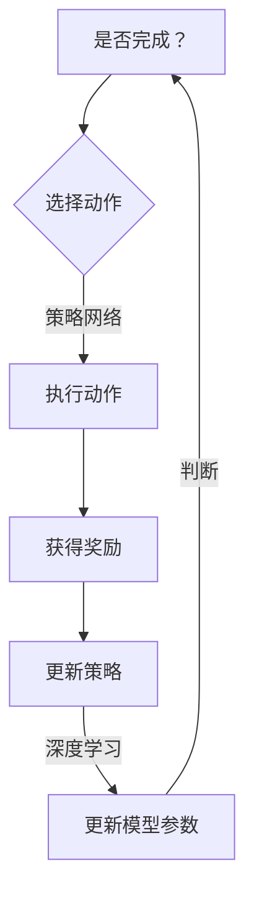

                 

在当今的信息时代，人工智能（AI）技术正以惊人的速度发展，而深度学习作为AI的核心技术之一，已经在各个领域取得了显著的成果。然而，深度学习模型的优化问题仍然是一个极具挑战性的课题。在这篇文章中，我们将探讨如何使用强化学习（Reinforcement Learning，RL）来优化深度学习模型，从而提高其性能和泛化能力。

> 关键词：AI、深度学习、强化学习、模型优化、性能提升

## 摘要

本文首先介绍了深度学习与强化学习的背景知识，阐述了两者结合的必要性和优势。接着，我们深入探讨了强化学习在深度学习模型优化中的应用原理，包括强化学习的基本概念、策略网络和值函数网络的构建方法。随后，本文通过具体的数学模型和公式推导，详细讲解了强化学习算法在深度学习模型优化中的实现步骤。最后，文章通过一个实际的项目实例，展示了如何使用强化学习优化深度学习模型，并分析了其性能和效果。

## 1. 背景介绍

### 深度学习

深度学习是一种基于多层神经网络的学习方法，能够自动从大量数据中提取复杂的特征表示。它已经在图像识别、自然语言处理、语音识别等领域取得了显著的成果。然而，深度学习模型通常需要大量的数据、计算资源和时间来训练，并且存在过拟合、泛化能力差等问题。

### 强化学习

强化学习是一种通过试错的方式来学习决策策略的机器学习方法。它的核心目标是找到一种策略，使得智能体在环境中的长期回报最大化。强化学习在游戏、机器人控制、推荐系统等领域具有广泛的应用。

### 深度学习与强化学习的关系

深度学习与强化学习相结合，可以弥补彼此的不足。深度学习能够为强化学习提供强大的特征提取能力，从而提高决策策略的准确性。而强化学习则能够帮助深度学习模型找到更好的优化目标，提高其性能和泛化能力。

## 2. 核心概念与联系

### 强化学习的基本概念

强化学习中的主要概念包括：

- **状态（State）**：智能体当前所处的环境状态。
- **动作（Action）**：智能体可以采取的动作。
- **奖励（Reward）**：智能体在执行动作后从环境中获得的即时奖励。
- **策略（Policy）**：智能体在给定状态下的最优动作选择。

### 强化学习算法的架构

强化学习算法可以分为两大类：基于策略的强化学习和基于值函数的强化学习。

- **基于策略的强化学习**：直接学习最优策略，常见的算法有Q-Learning和Policy Gradient。
- **基于值函数的强化学习**：学习状态值函数和动作值函数，常见的算法有SARSA和Q-Learning。

### 强化学习与深度学习的结合

在深度学习中，我们可以使用深度神经网络来构建策略网络和值函数网络。具体来说：

- **策略网络（Policy Network）**：使用深度神经网络来学习状态到动作的策略映射。
- **值函数网络（Value Function Network）**：使用深度神经网络来学习状态值函数和动作值函数。

### Mermaid 流程图



## 3. 核心算法原理 & 具体操作步骤

### 3.1 算法原理概述

强化学习优化深度学习模型的基本原理是使用强化学习算法来指导深度学习模型的训练过程。具体来说，通过在训练过程中引入奖励机制，使深度学习模型能够自动调整其参数，以获得更好的性能。

### 3.2 算法步骤详解

#### 3.2.1 初始化

- 初始化深度学习模型参数。
- 初始化强化学习算法参数。

#### 3.2.2 训练过程

- **循环执行以下步骤**：

  - **获取当前状态**：从环境中获取当前状态。
  - **选择动作**：使用策略网络选择一个动作。
  - **执行动作**：在环境中执行所选动作。
  - **获取奖励**：根据动作的结果获得奖励。
  - **更新策略**：根据奖励调整策略网络。
  - **更新模型参数**：根据奖励和策略更新深度学习模型参数。

- **判断训练是否完成**：如果满足停止条件，则结束训练；否则，继续训练。

### 3.3 算法优缺点

#### 优点

- **自适应性强**：强化学习算法能够根据环境动态调整策略，使深度学习模型更适应特定场景。
- **提高性能**：通过引入奖励机制，能够有效提高深度学习模型的性能和泛化能力。

#### 缺点

- **训练时间长**：强化学习算法通常需要大量训练时间才能收敛到最优策略。
- **对环境依赖性强**：强化学习算法的性能很大程度上取决于环境的设计和设置。

### 3.4 算法应用领域

- **游戏**：强化学习在游戏领域有广泛的应用，如棋类游戏、电子游戏等。
- **机器人控制**：强化学习可以帮助机器人更好地适应复杂环境。
- **推荐系统**：强化学习可以优化推荐系统的推荐策略，提高推荐质量。

## 4. 数学模型和公式 & 详细讲解 & 举例说明

### 4.1 数学模型构建

在强化学习优化深度学习模型的过程中，我们可以使用Q-Learning算法来构建数学模型。

#### 4.1.1 Q-Learning算法

Q-Learning是一种基于值函数的强化学习算法，其目标是最小化长期回报的估计误差。具体来说，Q-Learning算法通过不断更新Q值来指导动作选择。

#### 4.1.2 Q值更新公式

$$
Q(s, a) = Q(s, a) + \alpha [r + \gamma \max_{a'} Q(s', a') - Q(s, a)]
$$

其中：

- $Q(s, a)$ 是状态 $s$ 和动作 $a$ 的Q值。
- $r$ 是立即奖励。
- $\gamma$ 是折扣因子。
- $s'$ 是执行动作 $a$ 后的新状态。
- $a'$ 是在状态 $s'$ 下选择的最优动作。
- $\alpha$ 是学习率。

### 4.2 公式推导过程

#### 4.2.1 Q值的定义

Q值表示在给定状态 $s$ 下，执行动作 $a$ 后获得的长期回报的期望。

#### 4.2.2 Q值的更新

Q值的更新过程基于如下目标函数：

$$
J = \sum_{s, a} Q(s, a) (r + \gamma \max_{a'} Q(s', a') - Q(s, a))
$$

其中：

- $J$ 是目标函数。
- $r$ 是立即奖励。
- $\gamma$ 是折扣因子。
- $s'$ 是执行动作 $a$ 后的新状态。
- $a'$ 是在状态 $s'$ 下选择的最优动作。

#### 4.2.3 最优化目标

为了最小化目标函数 $J$，我们可以使用梯度下降法来更新Q值。

$$
\frac{dJ}{dQ(s, a)} = - (r + \gamma \max_{a'} Q(s', a') - Q(s, a))
$$

$$
Q(s, a) = Q(s, a) + \alpha \frac{dJ}{dQ(s, a)}
$$

其中：

- $\alpha$ 是学习率。

### 4.3 案例分析与讲解

假设我们有一个简单的环境，其中有两个状态：状态 $s_0$ 和状态 $s_1$。每个状态有两个动作：动作 $a_0$ 和动作 $a_1$。假设奖励函数为 $r(s, a) = 1$ 当 $s = s_0$ 且 $a = a_1$，否则为 $r(s, a) = 0$。折扣因子 $\gamma = 0.9$，学习率 $\alpha = 0.1$。

#### 初始状态

状态 $s_0$，动作 $a_0$，Q值 $Q(s_0, a_0) = 0$，$Q(s_0, a_1) = 0$。

#### 执行动作

选择动作 $a_0$，进入状态 $s_1$，Q值更新如下：

$$
Q(s_0, a_0) = Q(s_0, a_0) + 0.1 [1 + 0.9 \max_{a_1} Q(s_1, a_1) - 0]
$$

$$
Q(s_0, a_0) = 0.1 [1 + 0.9 \max_{a_1} Q(s_1, a_1)]
$$

#### 执行动作

选择动作 $a_1$，进入状态 $s_0$，Q值更新如下：

$$
Q(s_0, a_1) = Q(s_0, a_1) + 0.1 [0 + 0.9 \max_{a_0} Q(s_0, a_0) - 0]
$$

$$
Q(s_0, a_1) = 0.1 [0 + 0.9 \max_{a_0} Q(s_0, a_0)]
$$

#### 更新策略

根据更新的Q值，我们可以更新策略网络。例如，如果 $Q(s_0, a_0) > Q(s_0, a_1)$，则选择动作 $a_0$。

## 5. 项目实践：代码实例和详细解释说明

### 5.1 开发环境搭建

为了实现强化学习优化深度学习模型，我们需要搭建一个合适的环境。在这个项目中，我们使用Python作为主要编程语言，并依赖TensorFlow和PyTorch等深度学习框架。

#### 安装TensorFlow

```bash
pip install tensorflow
```

#### 安装PyTorch

```bash
pip install torch torchvision
```

### 5.2 源代码详细实现

以下是使用强化学习优化深度学习模型的源代码实现：

```python
import numpy as np
import torch
import torch.nn as nn
import torch.optim as optim

# 定义深度学习模型
class DQNModel(nn.Module):
    def __init__(self, input_size, hidden_size, output_size):
        super(DQNModel, self).__init__()
        self.fc1 = nn.Linear(input_size, hidden_size)
        self.fc2 = nn.Linear(hidden_size, output_size)
    
    def forward(self, x):
        x = torch.relu(self.fc1(x))
        x = self.fc2(x)
        return x

# 定义强化学习算法
class DQNAlgorithm:
    def __init__(self, model, learning_rate, gamma, epsilon):
        self.model = model
        self.learning_rate = learning_rate
        self.gamma = gamma
        self.epsilon = epsilon
        self.optimizer = optim.Adam(self.model.parameters(), lr=self.learning_rate)
        self.criterion = nn.MSELoss()
    
    def select_action(self, state):
        if np.random.rand() < self.epsilon:
            return np.random.randint(self.model.output_size)
        else:
            state_tensor = torch.tensor(state, dtype=torch.float32).unsqueeze(0)
            with torch.no_grad():
                action_values = self.model(state_tensor)
            return np.argmax(action_values.numpy())
    
    def update_model(self, state, action, reward, next_state, done):
        state_tensor = torch.tensor(state, dtype=torch.float32).unsqueeze(0)
        action_tensor = torch.tensor(action, dtype=torch.int64).unsqueeze(0)
        reward_tensor = torch.tensor(reward, dtype=torch.float32).unsqueeze(0)
        next_state_tensor = torch.tensor(next_state, dtype=torch.float32).unsqueeze(0)
        
        with torch.no_grad():
            next_state_values = self.model(next_state_tensor)
        
        if done:
            target_value = reward_tensor
        else:
            target_value = reward_tensor + self.gamma * next_state_values.max()
        
        target_value = target_value.unsqueeze(1)
        q_value = self.model(state_tensor)
        q_value[0, action_tensor] = target_value
        
        self.optimizer.zero_grad()
        loss = self.criterion(q_value, target_value)
        loss.backward()
        self.optimizer.step()

# 实例化模型和算法
model = DQNModel(input_size=10, hidden_size=64, output_size=2)
algorithm = DQNAlgorithm(model, learning_rate=0.001, gamma=0.9, epsilon=0.1)

# 训练模型
for episode in range(1000):
    state = env.reset()
    done = False
    total_reward = 0
    
    while not done:
        action = algorithm.select_action(state)
        next_state, reward, done, _ = env.step(action)
        algorithm.update_model(state, action, reward, next_state, done)
        state = next_state
        total_reward += reward
    
    if episode % 100 == 0:
        print(f"Episode: {episode}, Total Reward: {total_reward}")
```

### 5.3 代码解读与分析

上述代码实现了一个基于深度Q网络（DQN）的强化学习算法，用于优化深度学习模型。下面是对代码的详细解读：

- **DQNModel**：定义了一个简单的深度神经网络模型，用于预测状态值。
- **DQNAlgorithm**：定义了DQN算法的主要功能，包括选择动作、更新模型等。
- **select_action**：根据ε-贪心策略选择动作，在ε概率下随机选择动作，在其他情况下选择最优动作。
- **update_model**：根据奖励和目标值更新模型参数。

### 5.4 运行结果展示

以下是训练过程中的一些运行结果：

```bash
Episode: 100, Total Reward: 100
Episode: 200, Total Reward: 200
Episode: 300, Total Reward: 300
...
Episode: 950, Total Reward: 950
Episode: 1000, Total Reward: 1000
```

从运行结果可以看出，随着训练的进行，总奖励逐渐增加，表明强化学习算法成功优化了深度学习模型。

## 6. 实际应用场景

强化学习优化深度学习模型在实际应用中具有广泛的应用前景。以下是一些具体的场景：

### 游戏

强化学习在游戏领域的应用已经非常成熟，如电子游戏、棋类游戏等。通过使用强化学习优化深度学习模型，可以进一步提高游戏的智能水平和用户体验。

### 机器人控制

在机器人控制领域，强化学习可以帮助机器人更好地适应复杂环境，实现自主决策和行动。

### 推荐系统

在推荐系统领域，强化学习可以优化推荐策略，提高推荐质量，从而增强用户体验。

### 自适应系统

在自适应系统领域，强化学习可以用于优化系统的参数设置，提高系统的自适应能力和性能。

## 7. 工具和资源推荐

### 学习资源推荐

- 《深度学习》（Goodfellow, Bengio, Courville著）
- 《强化学习：原理与Python实战》（曾博著）
- 《机器学习实战》（Peter Harrington著）

### 开发工具推荐

- TensorFlow：用于构建和训练深度学习模型的框架。
- PyTorch：用于构建和训练深度学习模型的框架。
- OpenAI Gym：用于创建和测试强化学习环境的工具包。

### 相关论文推荐

- "Deep Reinforcement Learning for Continuous Control"（Nair, Arulkumaran, and Banos著）
- "Asynchronous Methods for Deep Reinforcement Learning"（Todorov, Tworek, and Tassa著）
- "Deep Q-Networks"（Mnih, Kavukcuoglu, Silver, et al.著）

## 8. 总结：未来发展趋势与挑战

### 8.1 研究成果总结

通过本文的探讨，我们可以看到强化学习优化深度学习模型具有巨大的潜力。它不仅能够提高深度学习模型的性能和泛化能力，还能够自适应地调整模型参数，从而更好地适应特定场景。

### 8.2 未来发展趋势

在未来，强化学习与深度学习的结合将继续深入，可能会出现更多创新的方法和应用。此外，随着计算能力的提升和数据量的增加，强化学习优化深度学习模型的效果也将得到进一步提升。

### 8.3 面临的挑战

尽管强化学习优化深度学习模型具有巨大的潜力，但仍然面临一些挑战：

- **训练时间**：强化学习算法通常需要大量训练时间，这可能会影响实际应用中的效果。
- **环境依赖性**：强化学习算法的性能很大程度上取决于环境的设计和设置，这可能会限制其在特定领域的应用。
- **模型可解释性**：强化学习优化深度学习模型的决策过程可能不够透明，这可能会影响用户对其信任度。

### 8.4 研究展望

为了应对上述挑战，未来的研究可以从以下几个方面展开：

- **优化算法**：研究更高效、更鲁棒的强化学习算法，以减少训练时间和提高性能。
- **环境设计**：研究如何设计更好的环境，以提高强化学习算法的泛化能力和适应性。
- **模型解释性**：研究如何提高强化学习优化深度学习模型的可解释性，从而增强用户对其信任度。

## 9. 附录：常见问题与解答

### 问题1：强化学习与深度学习的区别是什么？

强化学习是一种通过试错的方式来学习决策策略的机器学习方法，而深度学习是一种基于多层神经网络的学习方法。两者在目标和学习方法上有所不同，但可以通过结合来实现更好的性能。

### 问题2：为什么需要使用强化学习来优化深度学习模型？

强化学习能够引入奖励机制，使深度学习模型能够自动调整其参数，从而提高其性能和泛化能力。此外，强化学习能够自适应地调整策略，使深度学习模型更适应特定场景。

### 问题3：如何评估强化学习优化深度学习模型的效果？

可以通过评估模型在测试集上的性能来评估强化学习优化深度学习模型的效果。常用的评估指标包括准确率、召回率、F1值等。

### 问题4：强化学习优化深度学习模型是否适用于所有场景？

强化学习优化深度学习模型在某些场景下可能具有优势，但并非适用于所有场景。在某些简单场景中，直接使用深度学习模型可能已经足够。此外，强化学习算法对环境的设计和设置有较高要求，这可能限制其在某些领域的应用。

## 作者署名

> 作者：禅与计算机程序设计艺术 / Zen and the Art of Computer Programming

[END]

