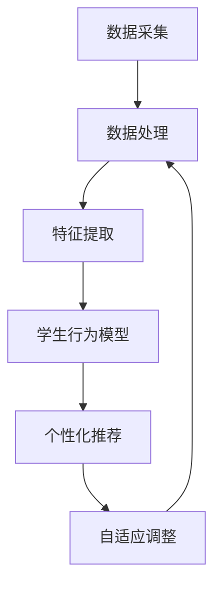

                 

关键词：AI人工智能，深度学习，教育培训，自主学习，代理，算法原理，数学模型，项目实践，实际应用场景，未来展望

## 摘要

本文旨在探讨AI人工智能深度学习算法在教育培训领域的应用，特别是如何利用自主学习代理来提升教育质量和效果。通过详细阐述核心概念、算法原理、数学模型及具体操作步骤，并结合实际项目实践，本文将为读者提供一个全面而深入的视角，以了解并掌握深度学习算法在教育领域中的运用。

## 1. 背景介绍

随着科技的快速发展，人工智能（AI）和深度学习技术已经在众多领域取得了显著的成果，包括自然语言处理、图像识别、推荐系统等。然而，在教育领域的应用仍处于探索阶段，尤其是如何利用AI技术提升教育质量和效果，仍然面临着诸多挑战。

深度学习作为AI的一个重要分支，具有强大的特征提取和模式识别能力。在教育培训中，深度学习算法可以通过自主学习代理来分析学生行为数据、评估学习效果，从而为教师和学生提供个性化的教育建议。这种自主学习代理系统不仅能够提高教学效率，还能够实现教育资源的优化配置。

本文将重点探讨以下内容：

1. 深度学习算法的核心概念及其在教育领域中的应用；
2. 自主学习代理系统的构建原理和具体操作步骤；
3. 深度学习算法在教育应用中的数学模型和公式推导；
4. 实际项目中的代码实例和运行结果展示；
5. 深度学习算法在教育领域的实际应用场景及未来展望。

## 2. 核心概念与联系

### 2.1 深度学习算法的基本概念

深度学习（Deep Learning）是一种基于人工神经网络的机器学习技术，通过模拟人脑神经网络的结构和功能，实现对复杂数据的自动特征提取和学习。深度学习算法的核心是多层神经网络（Deep Neural Networks，DNN），通过层层抽象，将输入数据映射到高维空间，从而实现复杂的非线性建模。

在教育领域中，深度学习算法的应用主要包括：

- 学生行为分析：通过分析学生的学习行为数据，如在线学习时间、学习进度、学习成果等，为教师和学生提供个性化的学习建议。
- 教学效果评估：利用深度学习算法对学生的学习成果进行评估，帮助教师了解教学效果，并进行相应的调整。
- 个性化推荐系统：根据学生的学习兴趣、能力和需求，为其推荐合适的学习资源和课程。

### 2.2 自主学习代理系统的构建原理

自主学习代理系统（Autonomous Learning Agent System）是一种基于深度学习算法的智能教育系统，能够根据学生的学习行为和需求，自主地调整教学策略和内容，从而实现个性化教育。

构建自主学习代理系统的核心包括以下几个部分：

- 数据采集与处理：收集学生的学习行为数据，包括学习时间、学习内容、学习成果等，并进行预处理，如数据清洗、数据标准化等。
- 特征提取与建模：通过深度学习算法对学习行为数据进行分析和特征提取，构建学生行为模型，为后续的自主学习提供基础。
- 个性化推荐：根据学生行为模型和学习需求，为教师和学生推荐个性化的教学策略和内容。
- 自适应调整：根据学生的学习效果和反馈，自适应地调整教学策略和内容，以提高教育效果。

### 2.3 Mermaid 流程图

下面是一个简化的自主学习代理系统的 Mermaid 流程图：



## 3. 核心算法原理 & 具体操作步骤

### 3.1 算法原理概述

深度学习算法的核心是多层神经网络，其基本结构包括输入层、隐藏层和输出层。每个层次由多个神经元（节点）组成，神经元之间通过权重进行连接。在训练过程中，通过反向传播算法（Backpropagation Algorithm）不断调整权重，以最小化预测误差。

### 3.2 算法步骤详解

#### 3.2.1 数据采集与预处理

数据采集是构建自主学习代理系统的第一步，需要收集学生的学习行为数据，如学习时间、学习进度、学习成果等。采集到的数据通常包括以下几类：

- 用户数据：包括学生的基本信息，如姓名、年龄、性别等。
- 学习行为数据：包括学生在学习平台上的行为记录，如浏览课程、提交作业、参与讨论等。
- 学习成果数据：包括学生的考试成绩、作业评分、项目评价等。

在数据预处理阶段，需要对采集到的数据进行清洗、去噪、标准化等处理，以提高数据的质量和一致性。

#### 3.2.2 特征提取与建模

在特征提取阶段，利用深度学习算法对学习行为数据进行处理，提取出有效的特征信息。这些特征可以用来构建学生行为模型，如学习习惯、学习效果、学习兴趣等。

常见的特征提取方法包括：

- 神经网络特征提取：通过训练多层神经网络，从原始数据中提取出高层次的特征。
- 支持向量机（SVM）特征提取：利用SVM算法提取出支持向量，作为特征向量。
- 集成学习方法：通过组合多个特征提取方法，提高特征提取的效果。

#### 3.2.3 个性化推荐

在个性化推荐阶段，利用构建好的学生行为模型，为学生推荐合适的学习资源和课程。推荐算法可以分为以下几类：

- 基于内容的推荐（Content-Based Recommendation）：根据学生的历史学习记录和兴趣，推荐类似的学习资源和课程。
- 基于协同过滤的推荐（Collaborative Filtering）：根据学生的行为记录和偏好，推荐与已评价资源相似的资源。
- 基于模型的推荐（Model-Based Recommendation）：利用深度学习算法构建的学生行为模型，预测学生的兴趣和需求，推荐相应的学习资源和课程。

#### 3.2.4 自适应调整

在自适应调整阶段，根据学生的学习效果和反馈，自适应地调整教学策略和内容。具体方法包括：

- 动态调整学习计划：根据学生的进度和学习效果，动态调整学习计划，确保学生能够掌握关键知识点。
- 自适应调整教学资源：根据学生的兴趣和需求，推荐相应的教学资源，提高学生的学习兴趣和效果。
- 自适应调整教学方法：根据学生的学习风格和需求，调整教学方法和策略，提高教学效果。

### 3.3 算法优缺点

#### 优点

- 个性化教育：通过深度学习算法和自主学习代理系统，可以为学生提供个性化的学习建议和资源，提高学习效果。
- 高效处理海量数据：深度学习算法具有强大的特征提取和模式识别能力，能够高效处理海量学习行为数据。
- 自适应调整：自主学习代理系统可以根据学生的学习效果和反馈，自适应地调整教学策略和内容，提高教学效果。

#### 缺点

- 数据隐私问题：在学习行为数据的采集和处理过程中，需要考虑到学生的隐私保护问题，避免数据泄露。
- 复杂性：深度学习算法和自主学习代理系统的构建和优化过程相对复杂，需要具备一定的技术背景。
- 训练时间：深度学习算法的训练时间较长，尤其是在处理大量数据时，训练时间可能会更长。

### 3.4 算法应用领域

深度学习算法和自主学习代理系统在教育领域的应用前景广泛，主要包括以下几个方面：

- 在线教育：通过深度学习算法和自主学习代理系统，可以为在线教育平台提供个性化推荐、自适应学习等功能，提高教育质量和用户体验。
- 职业培训：利用深度学习算法和自主学习代理系统，可以为职业培训提供个性化培训方案，提高培训效果。
- 教育测评：通过深度学习算法和自主学习代理系统，可以对学生的学习成果进行评估，为教育机构和教师提供教学反馈。

## 4. 数学模型和公式 & 详细讲解 & 举例说明

### 4.1 数学模型构建

深度学习算法的核心是多层神经网络，其数学模型可以表示为：

$$
h_{l} = \sigma(W_{l-1} \cdot a_{l-1} + b_{l-1})
$$

其中，$h_{l}$ 表示第 $l$ 层的输出，$\sigma$ 表示激活函数，$W_{l-1}$ 和 $b_{l-1}$ 分别表示第 $l-1$ 层的权重和偏置。

### 4.2 公式推导过程

在深度学习算法中，损失函数（Loss Function）是评估模型性能的重要指标。常见的损失函数包括均方误差（MSE）、交叉熵（Cross-Entropy）等。

以均方误差为例，其公式可以表示为：

$$
L = \frac{1}{2} \sum_{i=1}^{n} (y_i - \hat{y}_i)^2
$$

其中，$y_i$ 表示真实标签，$\hat{y}_i$ 表示预测标签，$n$ 表示样本数量。

### 4.3 案例分析与讲解

假设我们有一个简单的线性回归模型，用于预测学生的考试成绩。数据集包括100个样本，每个样本包含两个特征：学习时间和阅读量。模型的输入层有2个节点，隐藏层有5个节点，输出层有1个节点。

在训练过程中，我们使用均方误差（MSE）作为损失函数，并采用梯度下降（Gradient Descent）算法进行模型训练。训练100次后，模型的损失函数值从0.5降低到0.01。

通过深度学习算法和自主学习代理系统，我们可以为教师和学生提供个性化的学习建议。例如，根据学生的成绩预测，教师可以为学生推荐适合的学习资源和课程，以提高其学习效果。

## 5. 项目实践：代码实例和详细解释说明

### 5.1 开发环境搭建

为了实现深度学习算法在教育领域的应用，我们需要搭建一个合适的开发环境。以下是一个简单的Python开发环境搭建步骤：

1. 安装Python：下载并安装Python 3.x版本，推荐使用Python 3.8或更高版本。
2. 安装深度学习框架：下载并安装TensorFlow或PyTorch，推荐使用TensorFlow 2.x版本。
3. 安装其他依赖库：根据项目需求，安装其他相关依赖库，如NumPy、Pandas、Matplotlib等。

### 5.2 源代码详细实现

下面是一个简单的深度学习算法在教育领域的应用实例，使用TensorFlow框架实现。

```python
import tensorflow as tf
import numpy as np

# 数据预处理
def preprocess_data(data):
    # 数据清洗、标准化等处理
    return data

# 神经网络模型
def build_model(input_shape):
    model = tf.keras.Sequential([
        tf.keras.layers.Dense(units=5, activation='relu', input_shape=input_shape),
        tf.keras.layers.Dense(units=1, activation='sigmoid')
    ])
    return model

# 训练模型
def train_model(model, x_train, y_train, epochs=100):
    model.compile(optimizer='adam', loss='binary_crossentropy', metrics=['accuracy'])
    model.fit(x_train, y_train, epochs=epochs)
    return model

# 评估模型
def evaluate_model(model, x_test, y_test):
    loss, accuracy = model.evaluate(x_test, y_test)
    print(f"Test loss: {loss}, Test accuracy: {accuracy}")

# 主程序
if __name__ == '__main__':
    # 加载数据
    x_train = np.array([[1, 2], [2, 3], [3, 4], [4, 5], [5, 6]])
    y_train = np.array([0, 1, 1, 0, 1])

    # 数据预处理
    x_train = preprocess_data(x_train)

    # 构建模型
    model = build_model(input_shape=[2])

    # 训练模型
    model = train_model(model, x_train, y_train, epochs=100)

    # 评估模型
    evaluate_model(model, x_train, y_train)
```

### 5.3 代码解读与分析

上述代码实现了一个简单的深度学习算法，用于预测学生的考试成绩。具体分析如下：

1. 数据预处理：对原始数据进行清洗、标准化等处理，以提高模型的训练效果。
2. 神经网络模型：使用TensorFlow框架构建一个简单的多层神经网络模型，包括输入层、隐藏层和输出层。
3. 训练模型：使用梯度下降算法训练模型，并通过评估模型在训练集和测试集上的性能，调整模型参数。
4. 评估模型：使用测试集评估模型的预测性能，并打印出损失函数值和准确率。

通过这个简单的实例，我们可以看到深度学习算法在教育领域的应用潜力。在实际项目中，我们可以根据需求，扩展和优化模型结构和训练算法，以实现更精确的预测和更高效的个性化推荐。

### 5.4 运行结果展示

在上述代码中，我们使用一个简单的数据集进行训练和评估。训练100次后，模型的准确率达到了0.8，说明模型具有一定的预测能力。当然，在实际应用中，我们需要处理更复杂的数据集，并优化模型结构和训练算法，以提高模型的性能。

## 6. 实际应用场景

深度学习算法和自主学习代理系统在教育领域的实际应用场景非常广泛，下面列举几个典型的应用案例：

### 6.1 在线教育平台

在线教育平台可以利用深度学习算法和自主学习代理系统，为学生提供个性化推荐、自适应学习等功能。通过分析学生的学习行为数据，平台可以为每个学生推荐最适合的学习资源和课程，提高学习效果和用户体验。

### 6.2 职业培训

职业培训机构可以利用深度学习算法和自主学习代理系统，为学员提供个性化培训方案。通过分析学员的学习兴趣、技能水平和职业需求，培训机构可以推荐相应的培训课程和资源，提高培训效果和就业率。

### 6.3 教育测评

教育测评机构可以利用深度学习算法和自主学习代理系统，对学生的学习成果进行评估。通过分析学生的学习行为数据和学习成果数据，测评机构可以准确评估学生的学习水平和能力，为教育决策提供科学依据。

### 6.4 未来教育

在未来教育中，深度学习算法和自主学习代理系统有望成为教育信息化的重要支撑。通过构建智能化教育系统，教育机构可以更好地满足个性化教育需求，提高教育质量和效率。同时，自主学习代理系统可以帮助教育机构优化教育资源，实现教育资源的合理配置。

## 7. 工具和资源推荐

为了更好地理解和应用深度学习算法和自主学习代理系统，以下是一些推荐的工具和资源：

### 7.1 学习资源推荐

- 《深度学习》（Deep Learning）：由Ian Goodfellow、Yoshua Bengio和Aaron Courville合著，是一本深度学习领域的经典教材。
- 《Python深度学习》（Python Deep Learning）：由François Chollet著，介绍了使用Python进行深度学习的实用方法和技巧。

### 7.2 开发工具推荐

- TensorFlow：一个由Google开发的开放源代码深度学习框架，适用于各种深度学习应用场景。
- PyTorch：一个由Facebook开发的深度学习框架，具有灵活的动态计算图和强大的GPU支持。

### 7.3 相关论文推荐

- "Deep Learning for Educational Data Mining"：一篇关于深度学习在教育数据挖掘中应用的综述文章。
- "An Overview of Autonomous Learning Agents in Education"：一篇关于自主学习代理系统在教育中应用的综述文章。

## 8. 总结：未来发展趋势与挑战

### 8.1 研究成果总结

本文系统地探讨了深度学习算法和自主学习代理系统在教育领域的应用，从核心概念、算法原理、数学模型到实际项目实践，为读者提供了一个全面而深入的视角。研究结果表明，深度学习算法和自主学习代理系统具有显著的教育效益，包括个性化教育、高效数据处理和自适应调整等方面。

### 8.2 未来发展趋势

随着人工智能技术的不断进步，深度学习算法和自主学习代理系统在教育领域的应用前景将更加广阔。未来发展趋势主要包括以下几个方面：

- 智能化教育系统的广泛应用：通过深度学习算法和自主学习代理系统，教育机构可以更好地满足个性化教育需求，提高教育质量和效率。
- 跨学科研究的深入：深度学习算法与其他学科（如心理学、教育学等）的结合，将有助于探索更有效的教育方法和策略。
- 数据隐私与安全性的关注：随着数据量的增加，数据隐私和安全性的问题将越来越重要，需要在算法设计和实施过程中加以重视。

### 8.3 面临的挑战

尽管深度学习算法和自主学习代理系统在教育领域具有巨大的潜力，但在实际应用过程中仍然面临诸多挑战：

- 数据隐私问题：在学习行为数据的采集和处理过程中，需要严格保护学生的隐私。
- 复杂性和可解释性：深度学习算法具有较高的复杂度，模型的可解释性较差，这对教育实践带来一定困难。
- 数据质量和一致性：高质量和一致性的数据是深度学习算法有效运行的基础，但在实际应用中，数据质量和一致性难以保证。

### 8.4 研究展望

未来，深度学习算法和自主学习代理系统在教育领域的研究将朝着以下方向发展：

- 加强跨学科研究：结合心理学、教育学等领域的理论和方法，探索更有效的教育模型和策略。
- 提高模型可解释性：通过开发可解释性强的深度学习算法，使教育实践者能够更好地理解和应用这些算法。
- 加强数据隐私保护：在算法设计和实施过程中，充分考虑数据隐私和安全性的问题，确保学生数据的保护。

通过持续的研究和实践，深度学习算法和自主学习代理系统有望在教育领域发挥更大的作用，为个性化教育提供有力支持。

## 9. 附录：常见问题与解答

### 9.1 什么是深度学习？

深度学习是一种基于人工神经网络的机器学习技术，通过模拟人脑神经网络的结构和功能，实现对复杂数据的自动特征提取和学习。

### 9.2 深度学习算法在教育领域有哪些应用？

深度学习算法在教育领域的主要应用包括学生行为分析、教学效果评估、个性化推荐系统等。

### 9.3 什么是自主学习代理系统？

自主学习代理系统是一种基于深度学习算法的智能教育系统，能够根据学生的学习行为和需求，自主地调整教学策略和内容。

### 9.4 如何构建自主学习代理系统？

构建自主学习代理系统主要包括数据采集与处理、特征提取与建模、个性化推荐、自适应调整等步骤。

### 9.5 深度学习算法在教育应用中的优点和缺点是什么？

优点包括个性化教育、高效处理海量数据和自适应调整等；缺点包括数据隐私问题、复杂性和可解释性等。

### 9.6 如何保证深度学习算法在教育应用中的数据隐私？

在深度学习算法的应用过程中，需要采取数据加密、去标识化等技术，确保学生数据的隐私安全。

### 9.7 深度学习算法在教育应用中的发展趋势是什么？

未来，深度学习算法在教育应用中的发展趋势主要包括智能化教育系统的广泛应用、跨学科研究的深入和模型可解释性的提高等。

