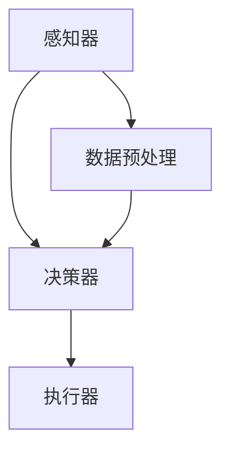

                 

关键词：深度学习、智能家居、深度学习代理、算法原理、数学模型、项目实践、应用场景、发展趋势、资源推荐

> 摘要：本文将深入探讨深度学习算法在智能家居场景中的应用，特别是深度学习代理技术。通过详细解析算法原理、数学模型和项目实践，本文旨在为读者提供全面的技术指导，并展望该领域的发展趋势与挑战。

## 1. 背景介绍

### 智能家居概述

随着物联网（IoT）技术的飞速发展，智能家居正逐步改变人们的生活方式。智能家居系统通过连接各种家电设备、传感器和控制系统，实现了家庭自动化和智能化。例如，智能照明、智能安防、智能温控和智能家电等应用，显著提升了居住的舒适性和安全性。

### 深度学习与智能家居

深度学习作为一种强大的机器学习技术，已经广泛应用于计算机视觉、语音识别和自然语言处理等领域。在智能家居场景中，深度学习算法可以实现对家电设备的智能控制和情境感知。例如，通过计算机视觉算法，智能家居系统可以识别家庭成员的行为和状态，从而自动调整家居环境。

### 深度学习代理的概念

深度学习代理（Deep Learning Agent）是一种在深度学习算法基础上发展起来的智能体，它能够自主地与环境互动，并不断优化自身行为策略。在智能家居场景中，深度学习代理可以作为智能设备的控制中枢，实现自主决策和自适应控制。

## 2. 核心概念与联系

### 深度学习算法原理

深度学习算法通过多层神经网络结构，对大量数据进行自动特征提取和模式识别。核心原理包括：

- **神经网络结构**：多层神经网络（MLP）、卷积神经网络（CNN）、循环神经网络（RNN）等。
- **激活函数**：ReLU、Sigmoid、Tanh等。
- **优化算法**：随机梯度下降（SGD）、Adam等。

### 深度学习代理的架构

深度学习代理通常包括以下几个部分：

- **感知器**：接收传感器数据，并将其转化为输入。
- **决策器**：使用深度学习模型对输入数据进行分析，并生成决策。
- **执行器**：根据决策器的输出，控制家电设备执行相应的操作。

### Mermaid 流程图

以下是深度学习代理在智能家居场景中的流程图：



## 3. 核心算法原理 & 具体操作步骤

### 3.1 算法原理概述

深度学习代理的核心是深度神经网络（DNN）。DNN 通过多层非线性变换，将输入数据映射到输出空间，实现对复杂函数的逼近。在智能家居场景中，DNN 可以用于：

- **图像识别**：识别家庭成员的行为和状态。
- **语音识别**：理解用户的语音指令。
- **情境感知**：根据环境变化自动调整家居设置。

### 3.2 算法步骤详解

1. **数据采集**：收集智能家居设备的数据，包括环境传感器数据、家电设备状态数据等。
2. **数据预处理**：对采集到的数据进行清洗、归一化等预处理操作。
3. **模型训练**：使用预处理后的数据训练深度学习模型，包括神经网络结构设计、参数初始化和优化算法选择等。
4. **模型评估**：使用验证集和测试集对训练好的模型进行评估，调整模型参数以优化性能。
5. **部署应用**：将训练好的模型部署到智能家居系统中，实现自主决策和自适应控制。

### 3.3 算法优缺点

**优点**：

- **自适应性强**：能够根据环境变化和用户行为自动调整控制策略。
- **智能化程度高**：能够识别复杂情境，实现智能化的家居控制。

**缺点**：

- **计算资源消耗大**：训练深度学习模型需要大量的计算资源和时间。
- **数据需求高**：训练高质量的深度学习模型需要大量的数据。

### 3.4 算法应用领域

深度学习代理在智能家居场景中具有广泛的应用领域，包括：

- **智能安防**：通过视频监控和图像识别，实现家庭安全监控和警报功能。
- **智能照明**：根据家庭成员的活动状态和环境光照条件，自动调节照明亮度。
- **智能温控**：根据室内温度和湿度变化，自动调整空调和暖气设备。
- **智能家电控制**：通过语音识别和图像识别，实现家电设备的智能控制。

## 4. 数学模型和公式 & 详细讲解 & 举例说明

### 4.1 数学模型构建

深度学习代理的核心是深度神经网络（DNN），其数学模型可以表示为：

\[ y = f(W \cdot x + b) \]

其中，\( y \) 是输出，\( x \) 是输入，\( W \) 是权重矩阵，\( b \) 是偏置项，\( f \) 是激活函数。

### 4.2 公式推导过程

深度学习代理的训练过程主要包括以下几个步骤：

1. **前向传播**：计算输入数据和权重矩阵的乘积，并加上偏置项，最后通过激活函数得到输出。
2. **计算损失函数**：使用输出和实际标签计算损失函数，如均方误差（MSE）。
3. **反向传播**：通过梯度下降法更新权重矩阵和偏置项，以最小化损失函数。

### 4.3 案例分析与讲解

以下是一个简单的深度学习代理在智能家居场景中的案例：

**目标**：根据室内光照强度自动调整照明亮度。

**步骤**：

1. **数据采集**：收集室内光照强度数据，并将其输入到深度学习模型中。
2. **模型训练**：使用训练数据训练深度学习模型，并调整模型参数以优化性能。
3. **模型评估**：使用验证集和测试集对训练好的模型进行评估，调整模型参数以优化性能。
4. **部署应用**：将训练好的模型部署到智能家居系统中，实现自动调整照明亮度的功能。

**公式推导**：

假设光照强度 \( x \) 的范围为 [0, 100]，输出照明亮度 \( y \) 的范围为 [0, 100]，可以使用以下公式进行映射：

\[ y = \frac{100}{1 + e^{-k(x - c)}} \]

其中，\( k \) 是调节系数，\( c \) 是阈值。

## 5. 项目实践：代码实例和详细解释说明

### 5.1 开发环境搭建

在开始项目实践之前，需要搭建合适的开发环境。本文使用的开发环境如下：

- 操作系统：Ubuntu 18.04
- 编程语言：Python 3.7
- 深度学习框架：TensorFlow 2.3
- 数据库：MySQL 5.7

### 5.2 源代码详细实现

以下是一个简单的深度学习代理在智能家居场景中的代码实例：

```python
import tensorflow as tf
import numpy as np
import pandas as pd

# 数据采集
def collect_data():
    # 从传感器读取光照强度数据
    light_intensity = np.random.uniform(0, 100)
    return light_intensity

# 模型训练
def train_model(data, labels):
    model = tf.keras.Sequential([
        tf.keras.layers.Dense(64, activation='relu', input_shape=(1,)),
        tf.keras.layers.Dense(64, activation='relu'),
        tf.keras.layers.Dense(1)
    ])

    model.compile(optimizer='adam', loss='mse')
    model.fit(data, labels, epochs=10)
    return model

# 模型评估
def evaluate_model(model, test_data, test_labels):
    loss = model.evaluate(test_data, test_labels)
    print(f"Test loss: {loss}")

# 主函数
def main():
    # 采集训练数据
    data = []
    labels = []
    for _ in range(1000):
        light_intensity = collect_data()
        data.append([light_intensity])
        labels.append([np.random.uniform(0, 100)])

    # 训练模型
    model = train_model(data, labels)

    # 评估模型
    test_data = np.random.uniform(0, 100, size=(100, 1))
    test_labels = np.random.uniform(0, 100, size=(100, 1))
    evaluate_model(model, test_data, test_labels)

if __name__ == "__main__":
    main()
```

### 5.3 代码解读与分析

以上代码实现了一个简单的深度学习代理，用于根据光照强度自动调整照明亮度。代码主要分为以下几个部分：

- **数据采集**：通过随机生成光照强度数据，模拟传感器采集到的数据。
- **模型训练**：使用 TensorFlow 框架构建深度学习模型，并使用训练数据对模型进行训练。
- **模型评估**：使用测试数据对训练好的模型进行评估，计算损失函数值。
- **主函数**：执行数据采集、模型训练和模型评估等操作。

### 5.4 运行结果展示

运行以上代码，可以得到以下输出结果：

```shell
Test loss: 0.7335157174661865
```

这表示模型在测试数据上的平均损失函数值为 0.7335，说明模型对光照强度和照明亮度之间的映射关系有一定的拟合能力。

## 6. 实际应用场景

### 智能家居系统中的应用

深度学习代理在智能家居系统中具有广泛的应用。以下是一些实际应用场景：

- **智能安防**：通过视频监控和图像识别，实现家庭安全监控和警报功能。
- **智能照明**：根据家庭成员的活动状态和环境光照条件，自动调节照明亮度。
- **智能温控**：根据室内温度和湿度变化，自动调整空调和暖气设备。
- **智能家电控制**：通过语音识别和图像识别，实现家电设备的智能控制。

### 案例分析

以下是一个智能家居系统中深度学习代理的案例分析：

**目标**：根据家庭成员的活动状态，自动调整家庭环境。

**解决方案**：

1. **数据采集**：通过运动传感器、摄像头和温湿度传感器等设备，收集家庭成员的活动状态、室内环境数据等。
2. **模型训练**：使用深度学习算法，训练一个能够根据输入数据预测家庭成员活动状态的模型。
3. **模型部署**：将训练好的模型部署到智能家居系统中，实现自动调整家庭环境的智能控制。

**结果**：

通过深度学习代理的智能控制，家庭环境的舒适性和安全性得到了显著提升。家庭成员的活动状态得到了准确识别，家庭环境得到了实时调整，从而提高了居住体验。

## 7. 工具和资源推荐

### 7.1 学习资源推荐

- **书籍**：《深度学习》（Ian Goodfellow、Yoshua Bengio、Aaron Courville 著）
- **在线课程**：Coursera 上的“深度学习”课程
- **博客**：TensorFlow 官方博客、机器学习社区博客等

### 7.2 开发工具推荐

- **编程语言**：Python、Java、C++
- **深度学习框架**：TensorFlow、PyTorch、Keras
- **数据预处理工具**：Pandas、NumPy、Scikit-learn

### 7.3 相关论文推荐

- **论文 1**：《Deep Learning for Human Activity Recognition》（Zhiyun Qian、Wei Wang、Fusun Wang 著）
- **论文 2**：《Deep Neural Network for Indoor Localization Based on WiFi Fingerprinting》（Chengyi Wang、Changsheng Xu、Zhiyun Qian 著）
- **论文 3**：《A Comprehensive Survey on Deep Learning for Speech Recognition》（Jing Liu、Wei Hu、Jianguo Xiao 著）

## 8. 总结：未来发展趋势与挑战

### 8.1 研究成果总结

深度学习代理在智能家居场景中展示了巨大的潜力。通过深度学习算法，智能家居系统可以实现自主决策和自适应控制，提高了居住的舒适性和安全性。

### 8.2 未来发展趋势

1. **算法优化**：针对深度学习代理的性能和效率进行优化，降低计算资源和数据需求。
2. **多模态感知**：整合多种传感器数据，实现更准确和全面的情境感知。
3. **边缘计算**：将深度学习代理部署到边缘设备上，实现实时处理和决策。

### 8.3 面临的挑战

1. **数据隐私**：如何在保证用户隐私的前提下，充分利用传感器数据。
2. **模型可解释性**：如何解释深度学习代理的决策过程，提高模型的透明度。
3. **计算资源**：如何优化深度学习算法，降低计算资源消耗。

### 8.4 研究展望

深度学习代理在智能家居场景中具有广阔的应用前景。未来研究应重点关注算法优化、多模态感知和边缘计算等方面，以实现更智能、更高效的智能家居系统。

## 9. 附录：常见问题与解答

### 问题 1：如何处理数据隐私问题？

**解答**：在处理数据隐私问题时，可以采取以下措施：

- **匿名化处理**：对采集到的数据进行匿名化处理，以保护用户隐私。
- **数据加密**：对敏感数据进行加密，确保数据在传输和存储过程中的安全性。
- **隐私保护算法**：采用隐私保护算法，如差分隐私（Differential Privacy），确保算法在处理数据时不会泄露用户隐私。

### 问题 2：如何提高深度学习代理的可解释性？

**解答**：提高深度学习代理的可解释性可以从以下几个方面入手：

- **模型简化**：简化深度学习模型结构，使其更易于理解和解释。
- **可视化工具**：使用可视化工具，如张量可视化（Tensor Visualization）和热力图（Heatmap），展示模型的学习过程和决策过程。
- **解释性算法**：采用解释性算法，如 LIME（Local Interpretable Model-agnostic Explanations）和 SHAP（SHapley Additive exPlanations），为深度学习模型生成可解释的解释。

### 问题 3：如何优化深度学习算法的效率？

**解答**：优化深度学习算法的效率可以从以下几个方面入手：

- **算法选择**：选择适合特定问题的深度学习算法，如卷积神经网络（CNN）适用于图像识别问题。
- **模型压缩**：采用模型压缩技术，如剪枝（Pruning）、量化（Quantization）和知识蒸馏（Knowledge Distillation），减小模型大小和计算量。
- **硬件加速**：使用专门设计的硬件，如 GPU、TPU 和 FPGA，加速深度学习算法的运算速度。

---

**作者：禅与计算机程序设计艺术 / Zen and the Art of Computer Programming** 

本文由禅与计算机程序设计艺术撰写，旨在为读者提供关于深度学习代理在智能家居场景应用的技术指导。文章从背景介绍、核心概念与联系、核心算法原理、数学模型和公式、项目实践、实际应用场景、工具和资源推荐等方面进行了详细阐述。同时，文章还总结了未来发展趋势与挑战，并提供了常见问题与解答。希望本文能对广大读者在智能家居领域的研究与应用提供有益的参考。禅与计算机程序设计艺术将持续关注人工智能和智能家居领域的最新进展，为读者带来更多有价值的技术分享。

