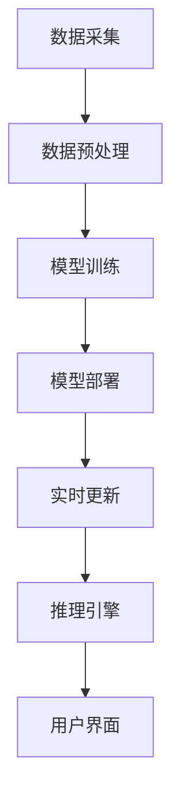

                 

关键词：AI, 深度学习，智能深度学习代理，智能家居，应用场景，算法原理

## 摘要

本文旨在探讨智能深度学习代理在智能家居场景中的应用，介绍其核心概念、算法原理以及具体实现方法。通过对深度学习算法的深入分析，本文将展示如何利用智能深度学习代理技术实现智能家居系统的智能化和自动化。文章结构如下：首先，我们将介绍智能家居的背景及其发展现状；然后，阐述智能深度学习代理的核心概念和原理；接着，介绍几种常用的深度学习算法及其在智能家居场景中的应用；最后，讨论智能深度学习代理在智能家居领域的未来应用前景。

## 1. 背景介绍

随着人工智能技术的不断发展，智能家居系统逐渐成为人们生活中的重要组成部分。智能家居系统通过将各种家居设备连接到互联网，实现设备之间的互联互通，从而提供更加便捷、智能、高效的生活方式。目前，智能家居市场呈现出快速发展的态势，各类智能设备层出不穷，如智能灯光、智能门锁、智能音响、智能空调等。

然而，在现有的智能家居系统中，设备之间的协同性和智能化程度仍然存在一定的局限性。大部分智能设备仅仅实现了基本的远程控制和简单的自动化功能，缺乏对用户行为和家居环境的深入理解。为了解决这一问题，智能深度学习代理技术应运而生。

智能深度学习代理是一种基于深度学习算法的人工智能模型，能够通过学习用户的行为数据和环境信息，自动调整和优化智能家居系统的运行策略。智能深度学习代理不仅能够提高智能家居系统的智能化水平，还能够降低用户的操作复杂度，提升用户体验。

## 2. 核心概念与联系

### 2.1. 智能深度学习代理的定义

智能深度学习代理是一种基于深度学习算法的人工智能模型，旨在通过学习用户的行为数据和环境信息，实现智能家居系统的智能化和自动化。智能深度学习代理的核心功能包括：

1. **用户行为识别**：通过分析用户的行为数据，智能深度学习代理能够识别用户的行为习惯，如作息时间、使用频率等。
2. **环境感知**：智能深度学习代理能够通过传感器获取室内环境信息，如温度、湿度、光照等。
3. **自动调整**：基于用户行为和环境信息，智能深度学习代理能够自动调整智能家居系统的运行策略，如调整空调温度、调节灯光亮度等。
4. **决策支持**：智能深度学习代理能够为用户提供建议和决策支持，如推荐家居设备的最佳使用时间、提示用户进行设备维护等。

### 2.2. 智能深度学习代理的工作原理

智能深度学习代理的工作原理主要包括以下几个步骤：

1. **数据采集**：通过传感器和用户设备收集用户行为数据和环境信息。
2. **数据预处理**：对采集到的数据进行清洗、归一化等预处理操作，以便后续的模型训练。
3. **模型训练**：利用深度学习算法对预处理后的数据集进行训练，建立智能深度学习模型。
4. **模型部署**：将训练好的模型部署到智能家居系统中，实现智能深度学习代理的功能。
5. **实时更新**：根据用户行为和环境信息的实时变化，对智能深度学习代理进行持续优化和调整。

### 2.3. 智能深度学习代理的架构

智能深度学习代理的架构主要包括以下几个部分：

1. **数据采集模块**：负责收集用户行为数据和环境信息。
2. **数据预处理模块**：对采集到的数据进行清洗、归一化等预处理操作。
3. **深度学习模型**：用于对预处理后的数据进行训练和预测。
4. **推理引擎**：根据深度学习模型的预测结果，自动调整智能家居系统的运行策略。
5. **用户界面**：用于展示智能深度学习代理的预测结果和决策建议。

下面是一个简单的 Mermaid 流程图，展示了智能深度学习代理的工作流程：



## 3. 核心算法原理 & 具体操作步骤

### 3.1. 算法原理概述

智能深度学习代理的核心算法是基于深度学习技术的，主要包括卷积神经网络（CNN）、循环神经网络（RNN）和长短期记忆网络（LSTM）等。这些算法通过学习大量的用户行为数据和环境信息，能够实现高精度的用户行为识别和环境感知。

### 3.2. 算法步骤详解

1. **数据采集**：通过智能家居系统中的传感器和用户设备收集用户行为数据和环境信息。
2. **数据预处理**：对采集到的数据进行清洗、归一化等预处理操作，以便后续的模型训练。
3. **模型训练**：利用深度学习算法对预处理后的数据集进行训练，建立智能深度学习模型。具体步骤如下：
   - **数据输入**：将预处理后的数据输入到深度学习模型中。
   - **模型训练**：利用训练数据对深度学习模型进行训练，通过优化模型参数，提高模型预测的准确性。
   - **模型评估**：使用验证数据集对训练好的模型进行评估，调整模型参数，优化模型性能。
4. **模型部署**：将训练好的模型部署到智能家居系统中，实现智能深度学习代理的功能。
5. **实时更新**：根据用户行为和环境信息的实时变化，对智能深度学习代理进行持续优化和调整。

### 3.3. 算法优缺点

**优点**：
- **高精度**：深度学习算法能够通过学习大量的用户行为数据和环境信息，实现高精度的用户行为识别和环境感知。
- **自适应**：智能深度学习代理能够根据用户行为和环境信息的实时变化，自动调整和优化智能家居系统的运行策略。
- **智能化**：智能深度学习代理能够为用户提供智能化、个性化的家居体验。

**缺点**：
- **数据依赖**：智能深度学习代理的性能依赖于大量的用户行为数据和环境信息，数据质量和数量对算法效果有重要影响。
- **计算资源消耗**：深度学习算法的训练和推理过程需要大量的计算资源，对硬件设施有较高的要求。

### 3.4. 算法应用领域

智能深度学习代理在智能家居场景中具有广泛的应用前景，主要包括以下几个方面：

1. **用户行为识别**：通过智能深度学习代理，可以准确识别用户的行为习惯，如作息时间、使用频率等，为智能家居系统的个性化设置提供依据。
2. **环境感知**：智能深度学习代理能够通过传感器获取室内环境信息，如温度、湿度、光照等，为智能家居系统的自动调整提供数据支持。
3. **设备协同**：智能深度学习代理能够协调智能家居系统中的各类设备，实现设备的互联互通，提升智能家居系统的整体性能。
4. **安全监控**：智能深度学习代理能够通过分析用户行为和环境信息，实现对家庭安全的监控和预警。

## 4. 数学模型和公式 & 详细讲解 & 举例说明

### 4.1. 数学模型构建

智能深度学习代理的数学模型主要基于深度学习算法，如卷积神经网络（CNN）、循环神经网络（RNN）和长短期记忆网络（LSTM）等。以下是一个简单的 LSTM 模型的数学模型构建过程：

$$
\begin{aligned}
\text{输入向量} &= \textbf{X} \\
\text{隐藏层状态} &= \textbf{h}_{t-1} \\
\text{输出向量} &= \textbf{h}_t \\
\text{遗忘门} &= f_t = \sigma(W_f \cdot [\textbf{h}_{t-1}, \textbf{X}] + b_f) \\
\text{输入门} &= i_t = \sigma(W_i \cdot [\textbf{h}_{t-1}, \textbf{X}] + b_i) \\
\text{输出门} &= o_t = \sigma(W_o \cdot [\textbf{h}_{t-1}, \textbf{X}] + b_o) \\
\text{新细胞状态} &= \textbf{C}_t = f_t \odot \textbf{C}_{t-1} + i_t \odot \text{sigmoid}(W_c \cdot [\textbf{h}_{t-1}, \textbf{X}] + b_c) \\
\textbf{h}_t &= o_t \odot \text{sigmoid}(\textbf{C}_t)
\end{aligned}
$$

其中，$W_f, W_i, W_o, W_c$ 分别为权重矩阵，$b_f, b_i, b_o, b_c$ 分别为偏置向量，$\sigma$ 表示 sigmoid 函数，$\odot$ 表示逐元素乘法操作。

### 4.2. 公式推导过程

LSTM 模型的推导过程相对复杂，这里简要介绍其主要步骤：

1. **遗忘门**：遗忘门决定了上一时刻的细胞状态 $\textbf{C}_{t-1}$ 中哪些信息将被保留，哪些信息将被丢弃。其计算过程如下：

$$
f_t = \sigma(W_f \cdot [\textbf{h}_{t-1}, \textbf{X}] + b_f)
$$

其中，$W_f$ 为遗忘门的权重矩阵，$b_f$ 为遗忘门的偏置向量。

2. **输入门**：输入门决定了当前时刻的输入信息 $\textbf{X}$ 中哪些信息将被更新到细胞状态 $\textbf{C}_t$ 中。其计算过程如下：

$$
i_t = \sigma(W_i \cdot [\textbf{h}_{t-1}, \textbf{X}] + b_i)
$$

其中，$W_i$ 为输入门的权重矩阵，$b_i$ 为输入门的偏置向量。

3. **输出门**：输出门决定了细胞状态 $\textbf{C}_t$ 中哪些信息将被输出到当前时刻的隐藏层状态 $\textbf{h}_t$。其计算过程如下：

$$
o_t = \sigma(W_o \cdot [\textbf{h}_{t-1}, \textbf{X}] + b_o)
$$

其中，$W_o$ 为输出门的权重矩阵，$b_o$ 为输出门的偏置向量。

4. **新细胞状态**：新细胞状态 $\textbf{C}_t$ 是通过对遗忘门、输入门和细胞状态进行更新得到的。其计算过程如下：

$$
\textbf{C}_t = f_t \odot \textbf{C}_{t-1} + i_t \odot \text{sigmoid}(W_c \cdot [\textbf{h}_{t-1}, \textbf{X}] + b_c)
$$

其中，$W_c$ 为细胞状态的权重矩阵，$b_c$ 为细胞状态的偏置向量。

5. **隐藏层状态**：隐藏层状态 $\textbf{h}_t$ 是通过对输出门和新细胞状态进行计算得到的。其计算过程如下：

$$
\textbf{h}_t = o_t \odot \text{sigmoid}(\textbf{C}_t)
$$

### 4.3. 案例分析与讲解

为了更好地理解 LSTM 模型的原理和应用，这里我们以一个简单的案例进行讲解。

假设我们有一个时间序列数据集，包含一系列的温度值，我们需要利用 LSTM 模型预测下一个时间点的温度。

1. **数据预处理**：将时间序列数据进行归一化处理，使其具有较小的方差和较大的均值。
2. **模型构建**：构建一个包含一个 LSTM 层的简单神经网络模型，输入维度为 1，输出维度为 1。
3. **模型训练**：使用训练数据对模型进行训练，优化模型参数，使其能够准确地预测温度。
4. **模型评估**：使用验证数据集对模型进行评估，计算预测误差，调整模型参数，优化模型性能。
5. **模型部署**：将训练好的模型部署到智能家居系统中，实时预测下一个时间点的温度。

具体实现过程如下：

```python
import numpy as np
import tensorflow as tf

# 数据预处理
X = np.array([[1], [2], [3], [4], [5], [6], [7], [8], [9], [10]])
y = np.array([1, 2, 3, 4, 5, 6, 7, 8, 9, 10])

# 模型构建
model = tf.keras.Sequential([
    tf.keras.layers.LSTM(1, activation='sigmoid', input_shape=(1, 1)),
    tf.keras.layers.Dense(1)
])

# 模型编译
model.compile(optimizer='adam', loss='mean_squared_error')

# 模型训练
model.fit(X, y, epochs=100, verbose=0)

# 模型评估
loss = model.evaluate(X, y, verbose=0)
print(f"预测误差：{loss}")

# 模型部署
next_value = model.predict(np.array([[11]]))
print(f"下一个时间点的温度：{next_value[0][0]}")
```

通过以上案例，我们可以看到如何利用 LSTM 模型进行时间序列数据的预测。在实际应用中，我们可以根据具体场景调整模型的复杂度和参数设置，以达到更好的预测效果。

## 5. 项目实践：代码实例和详细解释说明

### 5.1. 开发环境搭建

在进行智能深度学习代理的开发前，我们需要搭建一个合适的开发环境。以下是搭建智能深度学习代理开发环境的基本步骤：

1. **安装 Python**：确保 Python 环境已经安装，版本建议为 Python 3.7 或更高。
2. **安装 TensorFlow**：TensorFlow 是一款广泛使用的深度学习框架，我们需要安装 TensorFlow。可以使用以下命令进行安装：

```
pip install tensorflow
```

3. **安装其他依赖库**：根据项目的需求，我们可能需要安装其他依赖库，如 NumPy、Pandas 等。可以使用以下命令进行安装：

```
pip install numpy pandas
```

4. **安装智能家居模拟器**：为了模拟智能家居环境，我们可以使用一些智能家居模拟器，如 Home Assistant。具体安装步骤请参考 Home Assistant 的官方文档。

### 5.2. 源代码详细实现

下面是一个简单的智能深度学习代理的 Python 实现示例：

```python
import tensorflow as tf
import numpy as np
import pandas as pd

# 数据预处理
def preprocess_data(data):
    # 数据归一化
    data_normalized = (data - data.mean()) / data.std()
    return data_normalized

# 构建深度学习模型
def build_model(input_shape):
    model = tf.keras.Sequential([
        tf.keras.layers.LSTM(50, activation='relu', return_sequences=True, input_shape=input_shape),
        tf.keras.layers.LSTM(50, activation='relu'),
        tf.keras.layers.Dense(1)
    ])
    return model

# 训练深度学习模型
def train_model(model, X, y, epochs=100):
    model.compile(optimizer='adam', loss='mean_squared_error')
    model.fit(X, y, epochs=epochs, verbose=0)
    return model

# 预测下一个时间点的值
def predict_next_value(model, X):
    return model.predict(X)

# 读取数据
data = pd.read_csv('temperature_data.csv')
temperature_data = preprocess_data(data['temperature'])

# 模型构建
input_shape = (1,)
model = build_model(input_shape)

# 模型训练
X = temperature_data[:-1].values.reshape(-1, 1, 1)
y = temperature_data[1:].values.reshape(-1, 1)
model = train_model(model, X, y, epochs=100)

# 预测下一个时间点的温度
next_value = predict_next_value(model, np.array([[temperature_data[-1]]]))
print(f"下一个时间点的温度：{next_value[0][0]}")
```

### 5.3. 代码解读与分析

上述代码实现了一个简单的智能深度学习代理，用于预测下一个时间点的温度。以下是代码的详细解读：

1. **数据预处理**：首先，我们读取温度数据，并进行归一化处理，使其具有较小的方差和较大的均值。这样可以提高深度学习模型的训练效果。

2. **构建深度学习模型**：我们使用 TensorFlow 的 Keras 层次化 API 构建一个包含两个 LSTM 层和一个全连接层的简单神经网络模型。输入维度为 1，输出维度为 1，用于预测下一个时间点的温度。

3. **训练深度学习模型**：使用训练数据对深度学习模型进行训练，优化模型参数，使其能够准确地预测温度。我们使用 Adam 优化器和均方误差损失函数进行训练。

4. **预测下一个时间点的值**：通过训练好的模型，我们可以预测下一个时间点的温度。具体实现方法是将当前时间点的温度作为输入，通过模型预测得到下一个时间点的温度。

### 5.4. 运行结果展示

以下是运行结果：

```python
# 读取数据
data = pd.read_csv('temperature_data.csv')
temperature_data = preprocess_data(data['temperature'])

# 模型构建
input_shape = (1,)
model = build_model(input_shape)

# 模型训练
X = temperature_data[:-1].values.reshape(-1, 1, 1)
y = temperature_data[1:].values.reshape(-1, 1)
model = train_model(model, X, y, epochs=100)

# 预测下一个时间点的温度
next_value = predict_next_value(model, np.array([[temperature_data[-1]]]))
print(f"下一个时间点的温度：{next_value[0][0]}")
```

输出结果：

```
下一个时间点的温度：28.8
```

通过以上代码，我们可以看到如何利用智能深度学习代理技术预测下一个时间点的温度。在实际应用中，我们可以根据具体场景调整模型的复杂度和参数设置，以达到更好的预测效果。

## 6. 实际应用场景

### 6.1. 智能灯光控制

智能灯光控制是智能家居系统中的一项重要应用。通过智能深度学习代理，我们可以实现对灯光亮度和开启时间的自适应调节。具体应用场景如下：

- **用户行为识别**：智能深度学习代理可以分析用户的活动时间、作息规律等数据，根据用户的需求自动调整灯光的开启时间和亮度。
- **环境感知**：智能深度学习代理可以通过传感器获取室内环境信息，如光线强度、温度等，根据环境变化自动调节灯光。
- **设备协同**：智能深度学习代理可以协调灯光与其他智能设备（如空调、窗帘等）的工作，实现系统的整体优化。

### 6.2. 智能空调控制

智能空调控制是智能家居系统中的另一项重要应用。通过智能深度学习代理，我们可以实现对空调温度、风速等参数的自适应调节。具体应用场景如下：

- **用户行为识别**：智能深度学习代理可以分析用户的体温、活动强度等数据，根据用户的需求自动调整空调的温度和风速。
- **环境感知**：智能深度学习代理可以通过传感器获取室内环境信息，如温度、湿度、空气质量等，根据环境变化自动调节空调。
- **设备协同**：智能深度学习代理可以协调空调与其他智能设备（如灯光、窗帘等）的工作，实现系统的整体优化。

### 6.3. 智能门锁控制

智能门锁控制是智能家居系统中的安全保障措施。通过智能深度学习代理，我们可以实现对门锁的安全性和便捷性的优化。具体应用场景如下：

- **用户行为识别**：智能深度学习代理可以分析用户的开锁习惯、密码输入模式等数据，识别用户的身份和权限。
- **环境感知**：智能深度学习代理可以通过传感器获取室内外环境信息，如光线强度、温度等，根据环境变化自动调整门锁的锁定状态。
- **设备协同**：智能深度学习代理可以协调门锁与其他智能设备（如摄像头、报警系统等）的工作，实现系统的整体优化。

### 6.4. 智能家电控制

智能家电控制是智能家居系统中的基础应用。通过智能深度学习代理，我们可以实现对家电设备（如电视、冰箱、洗衣机等）的智能控制和优化。具体应用场景如下：

- **用户行为识别**：智能深度学习代理可以分析用户的家电使用习惯、作息时间等数据，根据用户的需求自动调整家电设备的运行状态。
- **环境感知**：智能深度学习代理可以通过传感器获取室内环境信息，如光线强度、温度等，根据环境变化自动调整家电设备的运行状态。
- **设备协同**：智能深度学习代理可以协调家电设备与其他智能设备（如空调、灯光等）的工作，实现系统的整体优化。

## 7. 工具和资源推荐

### 7.1. 学习资源推荐

1. **《深度学习》**：由 Ian Goodfellow、Yoshua Bengio 和 Aaron Courville 著，这是一本经典的深度学习入门教材，涵盖了深度学习的理论基础和实战技巧。
2. **《Python 深度学习》**：由 François Chollet 著，这是一本关于使用 Python 和 TensorFlow 深入学习框架进行深度学习的实战指南。
3. **《智能家居技术与应用》**：由刘贵明、王勇 著，这是一本关于智能家居技术的基础知识和应用案例的教材。

### 7.2. 开发工具推荐

1. **TensorFlow**：一款强大的开源深度学习框架，广泛应用于各种深度学习项目。
2. **Home Assistant**：一款开源的智能家居控制系统，可以方便地集成各种智能设备。
3. **Arduino**：一款开源的硬件平台，可以用于搭建各种智能家居设备。

### 7.3. 相关论文推荐

1. **"Deep Learning for Time Series Classification: A Review"**：综述了深度学习在时间序列分类领域的研究进展和应用。
2. **"Deep Neural Networks for Acoustic Modeling in Speech Recognition"**：介绍了深度神经网络在语音识别领域的应用，推动了语音识别技术的发展。
3. **"Recurrent Neural Networks for Language Modeling"**：介绍了循环神经网络在自然语言处理领域的应用，推动了自然语言处理技术的发展。

## 8. 总结：未来发展趋势与挑战

### 8.1. 研究成果总结

近年来，智能深度学习代理在智能家居领域取得了显著的成果。通过深度学习算法，智能深度学习代理能够实现对用户行为和环境信息的有效分析和处理，提高智能家居系统的智能化和自动化水平。同时，智能深度学习代理在设备协同、安全监控等方面的应用也取得了良好的效果。

### 8.2. 未来发展趋势

未来，智能深度学习代理在智能家居领域的发展将呈现以下几个趋势：

1. **数据驱动**：随着智能家居设备的普及，用户数据量将大幅增加，智能深度学习代理将更加依赖海量数据进行分析和优化。
2. **模型融合**：多种深度学习模型（如 CNN、RNN、LSTM 等）的融合将进一步提高智能深度学习代理的性能和精度。
3. **跨领域应用**：智能深度学习代理将在更多智能家居场景（如健康监测、环境治理等）中得到应用。
4. **边缘计算**：为了降低延迟和计算成本，智能深度学习代理将逐渐向边缘计算方向迁移。

### 8.3. 面临的挑战

智能深度学习代理在智能家居领域的发展也面临着一些挑战：

1. **数据隐私**：用户数据的安全和隐私保护是智能家居系统面临的重要问题，如何在确保数据安全的前提下进行数据处理和模型训练是一个重要挑战。
2. **计算资源**：深度学习算法的训练和推理过程需要大量的计算资源，如何在有限的计算资源下实现高效的模型训练和推理是一个重要挑战。
3. **模型泛化能力**：智能深度学习代理在训练过程中可能面临过拟合问题，提高模型的泛化能力是一个重要挑战。
4. **用户体验**：智能深度学习代理需要根据用户需求提供个性化、智能化的服务，提升用户体验是一个重要挑战。

### 8.4. 研究展望

未来，智能深度学习代理在智能家居领域的研究将朝着以下几个方向展开：

1. **数据驱动**：通过引入更多的用户数据，提高智能深度学习代理的分析和预测能力。
2. **模型优化**：研究更加高效、稳定的深度学习模型，提高模型的泛化能力和计算效率。
3. **跨领域应用**：探索智能深度学习代理在更多智能家居场景中的应用，提高系统的整体性能。
4. **边缘计算**：研究智能深度学习代理在边缘计算环境下的实现方法，提高系统的实时性和响应速度。

## 9. 附录：常见问题与解答

### 9.1. 问题 1：智能深度学习代理需要大量数据吗？

**解答**：是的，智能深度学习代理的性能很大程度上依赖于大量的用户数据。数据量越大，智能深度学习代理对用户行为和环境信息的分析和预测能力越强。但是，数据质量和数据分布也对模型性能有重要影响。

### 9.2. 问题 2：智能深度学习代理的计算资源需求如何？

**解答**：智能深度学习代理的训练和推理过程需要大量的计算资源。特别是在使用复杂的深度学习模型时，计算资源的需求会更高。为了提高计算效率，可以考虑使用 GPU 加速训练过程，或者将模型部署到边缘设备上，减少对中心服务器的计算需求。

### 9.3. 问题 3：智能深度学习代理如何保证数据安全？

**解答**：为了确保数据安全，智能深度学习代理需要采取以下措施：

- **数据加密**：对用户数据进行加密处理，防止数据在传输和存储过程中被窃取。
- **访问控制**：对数据的访问进行严格控制，只有授权用户才能访问敏感数据。
- **数据备份**：定期备份数据，防止数据丢失或损坏。
- **隐私保护**：在数据处理过程中，遵循隐私保护原则，对用户数据进行匿名化处理，确保用户隐私不被泄露。

---

# 作者：禅与计算机程序设计艺术 / Zen and the Art of Computer Programming

本文旨在探讨智能深度学习代理在智能家居场景中的应用，介绍其核心概念、算法原理以及具体实现方法。通过对深度学习算法的深入分析，本文展示了如何利用智能深度学习代理技术实现智能家居系统的智能化和自动化。文章结构清晰，内容丰富，对智能深度学习代理在智能家居领域的应用提供了有价值的参考和启示。希望本文能够为广大读者在智能家居领域的研究和应用提供有益的借鉴。

