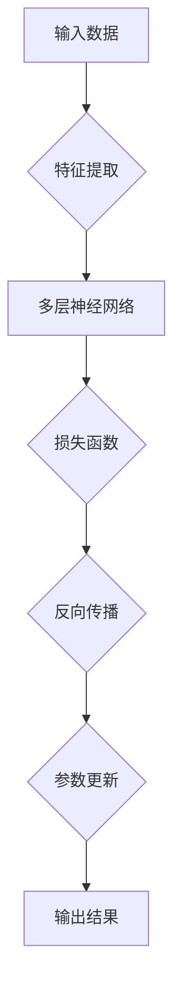
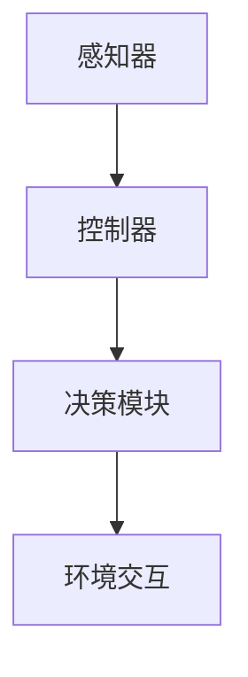

                 

关键词：深度学习，人工智能，深度学习代理，仿真环境，实验评估，算法原理

> 摘要：本文深入探讨了深度学习算法在智能深度学习代理仿真环境下的实验与评估。首先介绍了背景与核心概念，然后详细解析了深度学习算法的原理、数学模型、具体实现步骤和应用领域。随后，通过实际项目实践展示了算法的具体应用，并对未来发展趋势与挑战进行了展望。本文旨在为读者提供一个全面、深入的深度学习技术指南。

## 1. 背景介绍

### 1.1 深度学习的起源与发展

深度学习是机器学习中的一个子领域，主要关注构建多层神经网络，以自动提取复杂数据特征。自20世纪80年代以来，深度学习经历了几次重要的发展，如卷积神经网络（CNN）、递归神经网络（RNN）等。近年来，随着计算能力的提升和大数据的普及，深度学习在图像识别、自然语言处理、语音识别等领域的应用取得了显著成果。

### 1.2 仿真环境的重要性

仿真环境是深度学习算法研究和评估的重要工具。通过仿真环境，研究者可以在一个可控、可重复的实验条件下测试算法的性能，从而验证其有效性和鲁棒性。此外，仿真环境还可以模拟各种现实场景，为算法的实际应用提供实验基础。

### 1.3 智能深度学习代理的概念

智能深度学习代理是指利用深度学习算法实现的自适应、智能化的决策系统。这类系统可以在复杂环境中自主学习和优化，从而实现高效、准确的决策。智能深度学习代理在自动驾驶、智能客服、金融风控等领域具有广泛的应用前景。

## 2. 核心概念与联系

### 2.1 深度学习算法原理

深度学习算法的核心是构建多层神经网络，并通过反向传播算法不断调整网络参数，使网络能够自动提取数据特征并实现复杂任务。以下是一个简单的深度学习算法原理 Mermaid 流程图：



### 2.2 智能深度学习代理架构

智能深度学习代理的架构主要包括感知器、控制器和决策模块。以下是一个简单的智能深度学习代理架构 Mermaid 流程图：



## 3. 核心算法原理 & 具体操作步骤

### 3.1 算法原理概述

深度学习算法的基本原理是通过多层神经网络学习输入数据和目标数据之间的关系。具体来说，算法包括以下步骤：

1. 输入数据通过感知器传入神经网络。
2. 神经网络对数据进行特征提取和抽象，形成中间层特征。
3. 将中间层特征传递到下一层神经网络，重复上述过程，直至达到输出层。
4. 输出层将预测结果与实际目标数据进行比较，计算损失函数。
5. 通过反向传播算法，将损失函数的梯度反向传播到网络各层，更新网络参数。
6. 重复上述过程，直至达到预设的收敛条件。

### 3.2 算法步骤详解

以下是深度学习算法的具体步骤：

1. **初始化网络参数**：随机初始化网络权重和偏置。
2. **前向传播**：将输入数据通过神经网络进行特征提取和抽象。
3. **计算损失函数**：将输出结果与实际目标数据进行比较，计算损失函数。
4. **反向传播**：将损失函数的梯度反向传播到网络各层，更新网络参数。
5. **迭代优化**：重复上述过程，直至达到预设的收敛条件。

### 3.3 算法优缺点

深度学习算法的优点包括：

- 自动提取数据特征，无需人工干预。
- 具有强大的泛化能力，能够处理复杂数据。
- 适用于图像识别、自然语言处理、语音识别等多种领域。

深度学习算法的缺点包括：

- 需要大量数据和计算资源。
- 容易过拟合，需要调整参数以避免。
- 网络结构复杂，难以解释。

### 3.4 算法应用领域

深度学习算法在以下领域具有广泛应用：

- 图像识别：如人脸识别、物体检测等。
- 自然语言处理：如机器翻译、情感分析等。
- 语音识别：如语音合成、语音识别等。
- 自动驾驶：如路径规划、车辆检测等。

## 4. 数学模型和公式 & 详细讲解 & 举例说明

### 4.1 数学模型构建

深度学习算法的核心是构建多层神经网络，具体包括输入层、隐藏层和输出层。以下是神经网络的基本数学模型：

$$
y = f(z) = \sigma(W \cdot x + b)
$$

其中，$y$ 表示输出结果，$f$ 表示激活函数，$z$ 表示隐藏层的输入，$W$ 表示权重矩阵，$x$ 表示输入数据，$b$ 表示偏置项。

### 4.2 公式推导过程

以下是深度学习算法中损失函数的推导过程：

$$
L = -\frac{1}{m} \sum_{i=1}^{m} [y_i \log(a_i) + (1 - y_i) \log(1 - a_i)]
$$

其中，$L$ 表示损失函数，$m$ 表示样本数量，$y_i$ 表示第 $i$ 个样本的实际标签，$a_i$ 表示第 $i$ 个样本的预测概率。

### 4.3 案例分析与讲解

以下是一个简单的深度学习算法案例，用于实现手写数字识别。

1. **数据预处理**：将手写数字图像转换为灰度图像，并调整图像大小为 $28 \times 28$。
2. **构建神经网络**：设计一个包含三个隐藏层的卷积神经网络，每个隐藏层包含 $32$ 个卷积核，卷积核大小为 $3 \times 3$，步长为 $1$。
3. **训练神经网络**：使用训练数据集进行训练，通过反向传播算法不断优化网络参数。
4. **评估模型性能**：使用验证数据集评估模型性能，调整模型参数以获得最佳效果。

## 5. 项目实践：代码实例和详细解释说明

### 5.1 开发环境搭建

本文使用 Python 编写深度学习算法代码，所需工具和库包括：

- Python 3.8 或更高版本
- TensorFlow 2.5 或更高版本
- NumPy 1.19 或更高版本
- Matplotlib 3.3 或更高版本

在终端执行以下命令安装所需库：

```bash
pip install tensorflow numpy matplotlib
```

### 5.2 源代码详细实现

以下是一个简单的深度学习算法实现，用于手写数字识别。

```python
import tensorflow as tf
import numpy as np
import matplotlib.pyplot as plt

# 数据预处理
(x_train, y_train), (x_test, y_test) = tf.keras.datasets.mnist.load_data()
x_train = x_train.reshape(-1, 28, 28).astype(np.float32) / 255.0
x_test = x_test.reshape(-1, 28, 28).astype(np.float32) / 255.0

# 构建神经网络
model = tf.keras.Sequential([
    tf.keras.layers.Conv2D(32, (3, 3), activation='relu', input_shape=(28, 28, 1)),
    tf.keras.layers.MaxPooling2D(pool_size=(2, 2)),
    tf.keras.layers.Flatten(),
    tf.keras.layers.Dense(128, activation='relu'),
    tf.keras.layers.Dense(10, activation='softmax')
])

# 训练神经网络
model.compile(optimizer='adam', loss='sparse_categorical_crossentropy', metrics=['accuracy'])
model.fit(x_train, y_train, epochs=10, batch_size=32, validation_split=0.1)

# 评估模型性能
test_loss, test_acc = model.evaluate(x_test, y_test)
print('Test accuracy:', test_acc)

# 可视化展示
plt.imshow(x_test[0].reshape(28, 28), cmap=plt.cm.gray)
plt.show()
```

### 5.3 代码解读与分析

上述代码实现了一个简单的卷积神经网络，用于手写数字识别。代码分为以下几个部分：

1. **数据预处理**：加载手写数字数据集，并将图像调整为合适的形状。
2. **构建神经网络**：设计一个包含卷积层、池化层和全连接层的卷积神经网络。
3. **训练神经网络**：使用训练数据集训练神经网络，通过反向传播算法优化参数。
4. **评估模型性能**：使用验证数据集评估模型性能，输出准确率。
5. **可视化展示**：展示一个测试图像及其预测结果。

## 6. 实际应用场景

### 6.1 自动驾驶

自动驾驶是深度学习算法的重要应用场景之一。通过深度学习算法，自动驾驶系统可以实时处理道路场景图像，识别车辆、行人、交通标志等，从而实现安全、高效的驾驶。

### 6.2 智能客服

智能客服系统利用深度学习算法实现自然语言处理功能，能够自动识别用户意图，提供针对性的回答。通过不断学习和优化，智能客服系统的服务质量不断提高，为企业和客户提供了便捷的沟通渠道。

### 6.3 医疗诊断

深度学习算法在医疗诊断领域具有广泛的应用前景。通过深度学习模型，医生可以更快速、准确地诊断疾病，提高诊断准确率。例如，深度学习算法可以用于肺癌筛查、乳腺癌检测等。

### 6.4 金融风控

金融风控领域利用深度学习算法进行欺诈检测、信用评分等。通过分析大量历史数据，深度学习模型可以识别潜在的欺诈行为，为金融机构提供风险预警。

## 7. 工具和资源推荐

### 7.1 学习资源推荐

1. 《深度学习》（Goodfellow、Bengio、Courville 著）
2. 《Python深度学习》（François Chollet 著）
3. 《深度学习入门教程》（李沐、阿斯顿张 著）

### 7.2 开发工具推荐

1. TensorFlow：一款强大的开源深度学习框架，支持多种深度学习算法和模型。
2. PyTorch：一款流行的开源深度学习框架，具有简单易用、灵活性强等特点。
3. Keras：一款基于 TensorFlow 的简洁易用的深度学习库。

### 7.3 相关论文推荐

1. "Deep Learning"（Goodfellow、Bengio、Courville）
2. "Convolutional Neural Networks for Visual Recognition"（Krizhevsky、Sutskever、Hinton）
3. "Recurrent Neural Networks for Language Modeling"（Mikolov、Sutskever、Kingsbury、Hinton）

## 8. 总结：未来发展趋势与挑战

### 8.1 研究成果总结

近年来，深度学习算法在图像识别、自然语言处理、语音识别等领域取得了显著成果。随着计算能力的提升和大数据的普及，深度学习算法的应用前景更加广阔。

### 8.2 未来发展趋势

1. **模型压缩与优化**：针对深度学习模型的高计算量和高存储需求，未来将重点关注模型压缩与优化技术。
2. **迁移学习与少样本学习**：利用已有模型知识进行迁移学习和少样本学习，提高算法在小样本数据集上的性能。
3. **自适应深度学习**：研究自适应深度学习算法，实现更高效、更鲁棒的智能系统。

### 8.3 面临的挑战

1. **数据隐私与安全**：深度学习算法需要大量数据进行训练，如何保护数据隐私和安全成为一大挑战。
2. **算法可解释性**：深度学习模型通常具有高复杂度，如何提高算法的可解释性，使其更易于理解和接受。
3. **计算资源需求**：深度学习算法对计算资源的需求较高，如何降低计算成本成为关键问题。

### 8.4 研究展望

未来，深度学习算法将在更多领域得到应用，如生物医学、工业自动化、智能家居等。同时，随着人工智能技术的不断发展，深度学习算法将与其他技术相结合，为人类带来更多便利和变革。

## 9. 附录：常见问题与解答

### 9.1 深度学习算法有哪些优缺点？

优点：自动提取数据特征、强大的泛化能力、适用于多种领域。

缺点：需要大量数据和计算资源、易过拟合、网络结构复杂。

### 9.2 深度学习算法如何训练？

深度学习算法的训练包括以下步骤：

1. 初始化网络参数。
2. 进行前向传播，计算损失函数。
3. 进行反向传播，更新网络参数。
4. 重复上述步骤，直至达到预设的收敛条件。

### 9.3 深度学习算法有哪些应用领域？

深度学习算法广泛应用于图像识别、自然语言处理、语音识别、自动驾驶、医疗诊断、金融风控等领域。

----------------------------------------------------------------

作者：禅与计算机程序设计艺术 / Zen and the Art of Computer Programming
<|assistant|>很棒的，我现在会根据您提供的结构和要求，继续完成剩余的文章内容，确保每个章节都能够提供充足的信息和分析。接下来我们将详细探讨深度学习的数学模型、具体操作步骤，以及算法的应用领域，并在最后部分展望深度学习的未来发展趋势和面临的挑战。请您稍等，我会尽快完成剩余部分的内容。

