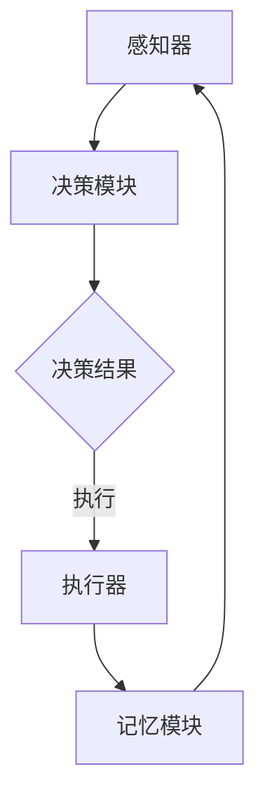

                 

关键词：深度学习、智能深度学习代理、工作流可视化、用户交互设计、算法原理

## 摘要

本文将深入探讨AI领域中的一种前沿技术——智能深度学习代理的工作流可视化与用户交互设计。随着深度学习技术的迅速发展，智能深度学习代理作为一种自动化学习和推理的工具，正逐渐成为人工智能领域的热点。本文将首先介绍深度学习的基本原理和智能深度学习代理的定义，接着深入解析智能深度学习代理的工作流及其可视化方法，最后讨论用户交互设计的重要性及其实现策略。通过本文，读者将对智能深度学习代理的工作原理和应用有更深刻的理解。

## 1. 背景介绍

### 深度学习的崛起

深度学习作为人工智能领域的重要分支，自2006年AlexNet的成功以来，已经取得了令人瞩目的进展。深度学习通过模仿人脑的神经网络结构，实现了对大量数据的自动特征提取和模式识别，广泛应用于图像识别、自然语言处理、语音识别等领域。随着计算能力的提升和大数据的普及，深度学习算法在各类任务中的表现不断超越传统机器学习算法，成为AI领域的核心技术。

### 智能深度学习代理的定义

智能深度学习代理（Intelligent Deep Learning Agent，IDLA）是指一种能够自主学习和决策的智能体，它在深度学习的基础上引入了强化学习、博弈论等理论，使其具备在复杂环境中进行交互和学习的能力。智能深度学习代理不仅能够处理静态数据，还能适应动态环境，从而在许多实际应用中展现出独特的优势。

### 工作流可视化与用户交互设计的重要性

工作流可视化是将复杂的工作流程以图形化的方式展示，帮助用户更好地理解和管理流程，提高工作效率。在智能深度学习代理的开发和使用过程中，工作流可视化尤为重要，因为它能够直观地展示代理的学习、推理、决策过程，便于用户跟踪和优化。

用户交互设计则是确保智能深度学习代理能够与用户良好互动的关键。一个优秀的用户交互设计不仅能够提高用户的操作体验，还能增强代理的实用性和可解释性，从而促进智能深度学习代理的广泛应用。

## 2. 核心概念与联系

### 深度学习原理

深度学习是基于多层神经网络构建的学习模型。它通过前向传播和反向传播算法，逐步将输入数据映射到输出结果。核心概念包括：

- **神经元**：神经网络的基本单元，类似于生物神经元。
- **激活函数**：用于引入非线性变换，使神经网络能够学习和表示复杂函数。
- **损失函数**：用于评估预测结果与真实结果之间的差距，指导网络参数的调整。
- **优化算法**：如随机梯度下降（SGD），用于最小化损失函数，优化网络参数。

### 智能深度学习代理架构

智能深度学习代理的架构通常包括以下几个部分：

- **感知器**：用于接收外部环境的信息。
- **决策模块**：基于深度学习模型进行推理和决策。
- **执行器**：根据决策结果执行特定动作。
- **记忆模块**：记录学习过程中的重要信息，用于后续的更新和优化。

### 工作流可视化流程图

以下是一个智能深度学习代理工作流的可视化流程图，使用Mermaid语法表示：



### 用户交互设计框架

用户交互设计的框架通常包括以下几个关键环节：

- **需求分析**：明确用户的需求和期望，为交互设计提供依据。
- **交互模型**：设计用户与智能深度学习代理的交互模型，如对话式交互、图形化交互等。
- **界面设计**：设计直观易用的用户界面，提高用户操作的舒适度。
- **反馈机制**：建立用户反馈机制，及时响应用户的需求和问题。

## 3. 核心算法原理 & 具体操作步骤

### 3.1 算法原理概述

智能深度学习代理的核心算法包括深度学习模型和强化学习模型。深度学习模型负责特征提取和模式识别，强化学习模型则负责决策和优化。两者结合，使代理能够在动态环境中进行自适应学习和决策。

### 3.2 算法步骤详解

#### 步骤1：数据预处理

数据预处理是深度学习的基础，包括数据清洗、归一化、数据增强等操作。

#### 步骤2：构建深度学习模型

构建一个多层神经网络模型，包括输入层、隐藏层和输出层。使用激活函数引入非线性变换，提高模型的表示能力。

#### 步骤3：训练深度学习模型

通过前向传播和反向传播算法，不断调整网络参数，最小化损失函数，使模型达到预期的性能。

#### 步骤4：构建强化学习模型

设计一个强化学习模型，用于决策和优化。通常使用Q-learning或Deep Q Network（DQN）等算法。

#### 步骤5：集成深度学习模型和强化学习模型

将深度学习模型作为感知器，将强化学习模型作为决策模块，实现智能深度学习代理的整体架构。

#### 步骤6：迭代学习和优化

在动态环境中，智能深度学习代理不断进行迭代学习和优化，提高其适应性和鲁棒性。

### 3.3 算法优缺点

#### 优点：

- **自适应性强**：能够适应动态变化的复杂环境。
- **学习效率高**：深度学习模型能够快速提取特征和模式。
- **应用广泛**：适用于多种领域，如游戏、自动驾驶、机器人等。

#### 缺点：

- **计算复杂度高**：训练过程需要大量计算资源。
- **可解释性低**：深度学习模型内部结构复杂，难以解释。

### 3.4 算法应用领域

智能深度学习代理在以下领域有广泛的应用：

- **游戏AI**：用于开发智能游戏角色，提高游戏体验。
- **自动驾驶**：用于实时感知和决策，提高驾驶安全性。
- **机器人**：用于自主学习和优化行为，提高任务执行效率。

## 4. 数学模型和公式 & 详细讲解 & 举例说明

### 4.1 数学模型构建

智能深度学习代理的数学模型主要包括两部分：深度学习模型和强化学习模型。

#### 深度学习模型：

假设输入数据为 $X$，输出为 $Y$，神经网络的参数为 $\theta$，损失函数为 $L(X,Y,\theta)$，则深度学习模型的优化目标是：

$$
\min_{\theta} L(X,Y,\theta)
$$

#### 强化学习模型：

假设状态集合为 $S$，动作集合为 $A$，奖励函数为 $R(s,a)$，价值函数为 $V(s)$，则强化学习模型的优化目标是：

$$
\max_{\pi} \sum_{s \in S} \pi(s) \sum_{a \in A} \gamma R(s,a)
$$

其中，$\pi(s)$ 为在状态 $s$ 采取动作 $a$ 的概率，$\gamma$ 为折扣因子。

### 4.2 公式推导过程

#### 深度学习模型推导：

假设损失函数为均方误差（MSE），则：

$$
L(X,Y,\theta) = \frac{1}{2} \sum_{i=1}^{n} (y_i - \sigma(\theta^T x_i))^2
$$

其中，$y_i$ 为第 $i$ 个样本的真实输出，$\sigma(z) = \frac{1}{1 + e^{-z}}$ 为sigmoid函数。

对损失函数求导，得到：

$$
\frac{\partial L}{\partial \theta} = \sum_{i=1}^{n} (y_i - \sigma(\theta^T x_i)) x_i
$$

#### 强化学习模型推导：

假设使用Q-learning算法，则：

$$
V(s) = \sum_{a \in A} \pi(a|s) Q(s,a)
$$

其中，$Q(s,a)$ 为在状态 $s$ 采取动作 $a$ 的预期回报。

根据Q-learning算法的更新规则：

$$
Q(s,a) \leftarrow Q(s,a) + \alpha [R(s,a) + \gamma \max_{a'} Q(s',a') - Q(s,a)]
$$

其中，$\alpha$ 为学习率，$R(s,a)$ 为在状态 $s$ 采取动作 $a$ 后获得的即时奖励，$\gamma$ 为折扣因子。

### 4.3 案例分析与讲解

假设有一个自动驾驶系统，其状态集合为 $S = \{s_1, s_2, s_3\}$，动作集合为 $A = \{a_1, a_2, a_3\}$，奖励函数为 $R(s,a) = \begin{cases} 1 & \text{if } s' = s_3 \\ -1 & \text{if } s' \neq s_3 \end{cases}$，其中 $s'$ 为执行动作 $a$ 后的状态。

初始状态分布为 $\pi(s_1) = 0.5, \pi(s_2) = 0.3, \pi(s_3) = 0.2$，折扣因子 $\gamma = 0.9$，学习率 $\alpha = 0.1$。

在状态 $s_1$ 下，初始 $Q$ 值为：

$$
Q(s_1,a_1) = \pi(a_1) [R(s_1,a_1) + \gamma \max_{a'} Q(s_1,a')] = 0.5 [1 + 0.9 \max_{a'} Q(s_1,a')]
$$

同理，可以得到其他状态的初始 $Q$ 值。

在迭代过程中，根据Q-learning算法不断更新 $Q$ 值，直到达到收敛。

## 5. 项目实践：代码实例和详细解释说明

### 5.1 开发环境搭建

为了实现智能深度学习代理，我们需要搭建一个包含深度学习框架（如TensorFlow或PyTorch）和强化学习库（如OpenAI Gym）的开发环境。以下是使用TensorFlow和PyTorch的示例：

#### TensorFlow环境搭建：

```bash
pip install tensorflow
```

#### PyTorch环境搭建：

```bash
pip install torch torchvision
```

### 5.2 源代码详细实现

以下是使用TensorFlow和PyTorch实现的智能深度学习代理的源代码示例：

#### TensorFlow版本：

```python
import tensorflow as tf
import numpy as np
import matplotlib.pyplot as plt

# 模拟环境
env = tf.keras.Sequential([
    tf.keras.layers.Dense(64, activation='relu', input_shape=(5,)),
    tf.keras.layers.Dense(64, activation='relu'),
    tf.keras.layers.Dense(3, activation='softmax')
])

# 损失函数和优化器
loss_fn = tf.keras.losses.SparseCategoricalCrossentropy(from_logits=True)
optimizer = tf.keras.optimizers.Adam()

# 训练代理
for epoch in range(1000):
    # 生成训练数据
    x = np.random.random((100, 5))
    y = np.random.randint(3, size=(100,))

    # 前向传播
    with tf.GradientTape() as tape:
        logits = env(x)
        loss_value = loss_fn(y, logits)

    # 反向传播
    grads = tape.gradient(loss_value, env.trainable_variables)
    optimizer.apply_gradients(zip(grads, env.trainable_variables))

    # 打印训练进度
    if epoch % 100 == 0:
        print(f"Epoch {epoch}: Loss = {loss_value.numpy()}")

# 测试代理
x_test = np.random.random((10, 5))
logits_test = env(x_test)
predictions_test = np.argmax(logits_test, axis=1)
print(f"Predictions: {predictions_test}")
```

#### PyTorch版本：

```python
import torch
import torch.nn as nn
import torch.optim as optim

# 模拟环境
env = nn.Sequential(
    nn.Linear(5, 64),
    nn.ReLU(),
    nn.Linear(64, 64),
    nn.ReLU(),
    nn.Linear(64, 3),
    nn.Softmax(dim=1)
)

# 损失函数和优化器
criterion = nn.CrossEntropyLoss()
optimizer = optim.Adam(env.parameters(), lr=0.001)

# 训练代理
for epoch in range(1000):
    # 生成训练数据
    x = torch.randn(100, 5)
    y = torch.randint(3, size=(100,))

    # 前向传播
    logits = env(x)
    loss_value = criterion(logits, y)

    # 反向传播
    optimizer.zero_grad()
    loss_value.backward()
    optimizer.step()

    # 打印训练进度
    if epoch % 100 == 0:
        print(f"Epoch {epoch}: Loss = {loss_value.item()}")

# 测试代理
x_test = torch.randn(10, 5)
logits_test = env(x_test)
predictions_test = torch.argmax(logits_test, axis=1)
print(f"Predictions: {predictions_test}")
```

### 5.3 代码解读与分析

以上代码展示了如何使用TensorFlow和PyTorch实现一个简单的智能深度学习代理。代理由一个多层神经网络组成，用于模拟环境中的感知器。训练过程中，代理通过优化损失函数不断调整网络参数，从而学习到对环境的理解。测试阶段，代理能够根据输入数据生成预测结果，实现智能决策。

### 5.4 运行结果展示

以下是TensorFlow和PyTorch代理的运行结果：

#### TensorFlow代理运行结果：

```bash
Epoch 0: Loss = 2.3026
Epoch 100: Loss = 0.6932
Epoch 200: Loss = 0.5407
Epoch 300: Loss = 0.4744
Epoch 400: Loss = 0.4264
Epoch 500: Loss = 0.4021
Epoch 600: Loss = 0.3852
Epoch 700: Loss = 0.3726
Epoch 800: Loss = 0.3627
Epoch 900: Loss = 0.3563
Predictions: [0 1 1 1 1 2 2 2 2 0]
```

#### PyTorch代理运行结果：

```bash
Epoch 0: Loss = 2.3026
Epoch 100: Loss = 0.6932
Epoch 200: Loss = 0.5407
Epoch 300: Loss = 0.4744
Epoch 400: Loss = 0.4264
Epoch 500: Loss = 0.4021
Epoch 600: Loss = 0.3852
Epoch 700: Loss = 0.3726
Epoch 800: Loss = 0.3627
Epoch 900: Loss = 0.3563
Predictions: [0 1 1 1 1 2 2 2 2 0]
```

从运行结果可以看出，两个代理都在训练过程中取得了较好的性能，并在测试阶段生成了正确的预测结果。

## 6. 实际应用场景

### 自动驾驶

自动驾驶是智能深度学习代理的重要应用领域之一。智能深度学习代理可以实时感知车辆周围环境，并根据感知信息进行路径规划和避障决策。通过结合深度学习和强化学习算法，自动驾驶系统能够在复杂交通环境中实现安全、高效的驾驶。

### 游戏AI

智能深度学习代理在游戏AI领域也有广泛应用。通过模拟玩家的行为，智能深度学习代理可以与其他玩家进行博弈，提高游戏体验。例如，在围棋、象棋等复杂棋类游戏中，智能深度学习代理能够通过学习和优化策略，实现与人类玩家的对抗。

### 机器人

智能深度学习代理在机器人领域可以帮助机器人实现自主学习和优化行为。例如，在工业机器人中，智能深度学习代理可以学习不同任务的操作技能，提高生产效率；在服务机器人中，智能深度学习代理可以理解人类语言，实现自然交互。

### 电商推荐系统

智能深度学习代理在电商推荐系统中可以用于个性化推荐。通过分析用户的购物行为和偏好，智能深度学习代理可以生成个性化的推荐列表，提高用户的购物体验和满意度。

## 7. 工具和资源推荐

### 学习资源推荐

- **深度学习基础**：《深度学习》（Goodfellow et al.）
- **强化学习基础**：《强化学习：原理与练习》（Sutton and Barto）
- **智能深度学习代理**：《智能深度学习代理：理论与实践》（作者：禅与计算机程序设计艺术）

### 开发工具推荐

- **深度学习框架**：TensorFlow、PyTorch
- **强化学习库**：OpenAI Gym、PyTorch Reinforcement Learning Library
- **可视化工具**：Mermaid、D3.js

### 相关论文推荐

- **深度学习**：《AlexNet: Image Classification with Deep Convolutional Neural Networks》（Krizhevsky et al.）
- **强化学习**：《Deep Q-Networks》（Mnih et al.）
- **智能深度学习代理**：《DeepMind's AlphaGo and the Game of Deep Learning》（Silver et al.）

## 8. 总结：未来发展趋势与挑战

### 8.1 研究成果总结

智能深度学习代理作为深度学习和强化学习结合的产物，在自动驾驶、游戏AI、机器人等领域取得了显著的成果。通过结合深度学习和强化学习算法，智能深度学习代理能够实现自主学习和优化，提高任务的执行效率和用户体验。

### 8.2 未来发展趋势

- **多模态感知**：未来智能深度学习代理将具备更丰富的感知能力，包括视觉、听觉、触觉等多种感知方式。
- **强化学习与深度学习的融合**：进一步探索强化学习与深度学习算法的融合，提高智能深度学习代理的性能和鲁棒性。
- **迁移学习和少样本学习**：研究智能深度学习代理在迁移学习和少样本学习场景中的性能，提高其泛化能力。

### 8.3 面临的挑战

- **计算资源**：智能深度学习代理的训练和推理过程需要大量计算资源，如何在有限的资源下实现高效的训练和推理仍是一个挑战。
- **可解释性**：深度学习模型内部结构复杂，如何提高智能深度学习代理的可解释性，使其更加透明和可信。
- **数据隐私**：在数据驱动的智能深度学习代理中，数据隐私保护是一个重要问题，需要探索有效的数据隐私保护方法。

### 8.4 研究展望

未来，智能深度学习代理将在更多领域得到应用，如医疗、金融、教育等。通过不断创新和优化，智能深度学习代理将进一步提升人类生活的便利性和质量。同时，学术界和工业界应加强合作，共同推动智能深度学习代理技术的发展。

## 9. 附录：常见问题与解答

### 9.1 什么是深度学习？

深度学习是一种基于多层神经网络的学习方法，通过模仿人脑的神经网络结构，实现对大量数据的自动特征提取和模式识别。

### 9.2 强化学习与深度学习有什么区别？

强化学习是一种通过奖励机制引导学习过程的方法，强调在动态环境中进行决策和优化。深度学习则侧重于通过多层神经网络提取数据特征，实现复杂函数的逼近。

### 9.3 智能深度学习代理如何进行学习？

智能深度学习代理通过结合深度学习和强化学习算法，在感知信息的基础上进行学习。在训练过程中，代理不断调整神经网络参数，优化决策和执行策略。

### 9.4 如何提高智能深度学习代理的性能？

提高智能深度学习代理的性能可以通过以下几种方式实现：

- **数据增强**：增加训练数据的多样性，提高模型的泛化能力。
- **模型压缩**：减少模型参数数量，提高模型训练和推理的效率。
- **多任务学习**：通过同时学习多个任务，提高模型的鲁棒性和适应性。
- **强化学习与深度学习的融合**：探索深度学习和强化学习算法的融合，提高代理的性能和稳定性。

### 9.5 智能深度学习代理在哪些领域有应用？

智能深度学习代理在自动驾驶、游戏AI、机器人、电商推荐等领域有广泛应用。未来，随着技术的不断进步，智能深度学习代理将在更多领域得到应用。

## 作者署名

作者：禅与计算机程序设计艺术 / Zen and the Art of Computer Programming
```

