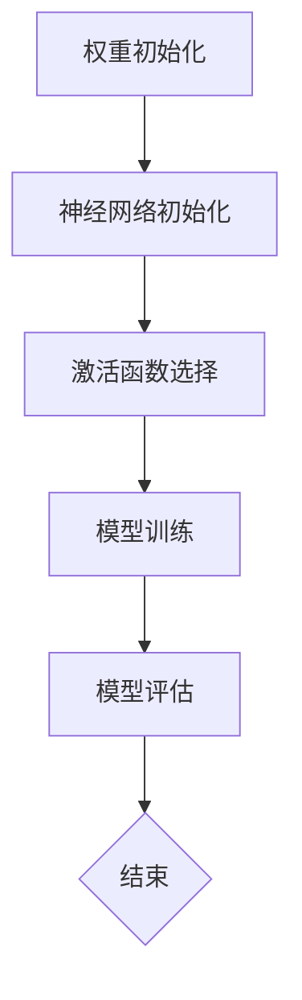

                 

关键词：深度学习、权重初始化、激活函数、神经网络、算法原理、数学模型、代码实例、应用场景、未来展望

> 摘要：本文将探讨深度学习中权重初始化与激活函数选择的重要性，详细解析相关算法原理、数学模型，并通过代码实例和实践应用场景，深入理解这些核心概念，为深度学习研究者与实践者提供有价值的参考。

## 1. 背景介绍

深度学习作为人工智能领域的重要分支，近年来取得了令人瞩目的成就。从图像识别、自然语言处理到语音识别，深度学习模型在各种任务中展现了强大的性能。然而，深度学习算法的成功不仅仅依赖于大量的数据和强大的计算能力，合理的权重初始化和激活函数选择也是关键因素。

权重初始化是指在构建神经网络模型时，如何为网络的权重分配初始值。合理的权重初始化能够加速模型的收敛速度，提高模型的性能。而激活函数则是神经网络中每个神经元输出前的非线性转换函数，它对于神经网络的训练过程和最终性能有着重要的影响。

本文将围绕这两个核心问题，详细探讨深度学习中权重初始化与激活函数选择的原理、方法及其在实际应用中的重要性。

## 2. 核心概念与联系

### 2.1 深度学习基本概念

在深入探讨权重初始化与激活函数选择之前，我们先回顾一下深度学习的基本概念。

**神经网络（Neural Network）**：神经网络是由大量简单单元（神经元）组成的复杂网络，这些单元通过权重连接在一起。神经网络的目的是通过学习输入和输出之间的映射关系，以解决分类、回归等任务。

**深度学习（Deep Learning）**：深度学习是神经网络的一种特殊形式，它通过多层的非线性变换，将输入数据逐渐转换为高层次的特征表示。深度学习模型通常具有多个隐藏层，这使得模型能够捕捉到更加复杂的特征。

**权重（Weights）**：在神经网络中，权重是神经元之间的连接强度，它决定了输入信息对神经元输出的影响程度。合理的权重初始化对于模型的训练过程至关重要。

**激活函数（Activation Function）**：激活函数是神经网络中的一个关键组件，它对神经元的输出进行非线性转换。常见的激活函数包括Sigmoid、ReLU、Tanh等。

### 2.2 权重初始化的重要性

权重初始化对于深度学习模型的学习过程和最终性能具有重要影响。以下是几个关键点：

- **收敛速度**：合理的权重初始化可以加速模型的收敛速度，减少训练时间。
- **避免梯度消失和梯度爆炸**：不适当的权重初始化可能导致梯度消失或梯度爆炸，这会严重影响模型的训练效果。
- **模型稳定性**：合理的权重初始化有助于提高模型的稳定性和泛化能力。

### 2.3 激活函数的重要性

激活函数在神经网络中起着至关重要的作用，它不仅影响模型的训练过程，还对最终性能有重要影响。以下是激活函数的关键作用：

- **非线性变换**：激活函数引入了非线性特性，使得神经网络能够捕捉到输入数据中的复杂关系。
- **梯度计算**：激活函数的选择影响梯度的计算，从而影响模型的训练过程。适当的激活函数有助于避免梯度消失和梯度爆炸。
- **模型表达能力**：不同的激活函数能够提高模型的表达能力，使得模型能够处理更加复杂的任务。

### 2.4 Mermaid 流程图

为了更直观地展示深度学习中权重初始化和激活函数选择的核心概念，我们使用Mermaid流程图来描述相关过程。



图2-1 权重初始化与激活函数选择的流程

在该流程图中，我们首先进行权重初始化，然后选择适当的激活函数，接着进行模型训练和评估。这个流程展示了权重初始化和激活函数选择在整个深度学习过程中的关键作用。

## 3. 核心算法原理 & 具体操作步骤

### 3.1 算法原理概述

#### 权重初始化

权重初始化的目的是为神经网络的权重分配合理的初始值，以便模型能够快速收敛并取得较好的性能。以下是一些常见的权重初始化方法：

- **零初始化**：将所有权重设置为0。
- **均匀初始化**：将权重随机分配在[-a, a]的范围内，其中a是[−1, 1]之间的小数。
- **高斯初始化**：将权重随机分配在均值为0，标准差为σ的正态分布中。

#### 激活函数

激活函数是神经网络中的关键组件，它对神经元的输出进行非线性转换。以下是一些常见的激活函数：

- **Sigmoid函数**：Sigmoid函数的输出范围在(0, 1)之间，它有助于神经元输出概率分布。
- **ReLU函数**：ReLU函数将负输入映射为0，正输入映射为自身，它有助于加速模型收敛。
- **Tanh函数**：Tanh函数的输出范围在(-1, 1)之间，它类似于Sigmoid函数，但能够更好地避免梯度消失。

### 3.2 算法步骤详解

#### 权重初始化步骤

1. 选择权重初始化方法，例如高斯初始化。
2. 根据神经网络的结构，计算每个权重节点的期望值和标准差。
3. 使用期望值和标准差生成随机权重值。

#### 激活函数选择步骤

1. 分析任务需求，选择适合的激活函数。
2. 考虑计算效率和模型性能，优化激活函数的选择。
3. 在模型训练过程中，根据性能指标调整激活函数。

### 3.3 算法优缺点

#### 权重初始化优缺点

- **零初始化**：
  - 优点：简单易行，计算成本低。
  - 缺点：可能导致模型收敛缓慢，甚至无法收敛。

- **均匀初始化**：
  - 优点：能够防止梯度消失和梯度爆炸。
  - 缺点：可能需要调整参数范围，否则收敛效果不佳。

- **高斯初始化**：
  - 优点：能够快速收敛，且性能较为稳定。
  - 缺点：参数选择对模型性能影响较大。

#### 激活函数优缺点

- **Sigmoid函数**：
  - 优点：输出范围在(0, 1)之间，适合概率输出。
  - 缺点：可能引起梯度消失，训练时间较长。

- **ReLU函数**：
  - 优点：加速模型收敛，提高训练效率。
  - 缺点：可能导致神经元死亡，模型稳定性较差。

- **Tanh函数**：
  - 优点：输出范围在(-1, 1)之间，避免梯度消失。
  - 缺点：计算复杂度较高，模型收敛速度较慢。

### 3.4 算法应用领域

权重初始化与激活函数选择广泛应用于各种深度学习任务中，如图像分类、语音识别、自然语言处理等。以下是几个典型应用领域：

- **图像分类**：在图像分类任务中，合理的权重初始化和激活函数选择能够提高模型的分类准确率。
- **语音识别**：在语音识别任务中，激活函数的选择对模型的语音识别性能有着重要影响。
- **自然语言处理**：在自然语言处理任务中，激活函数能够提高模型的语义理解能力。

## 4. 数学模型和公式 & 详细讲解 & 举例说明

### 4.1 数学模型构建

在深度学习中，数学模型是构建神经网络的基础。以下是一个简单的数学模型，用于描述神经网络中的权重初始化和激活函数选择。

#### 权重初始化

假设我们有 $n$ 个输入特征和 $m$ 个输出类别，那么神经网络的权重矩阵可以表示为 $W \in \mathbb{R}^{m \times n}$。为了初始化权重，我们可以使用以下公式：

$$
W \sim \mathcal{N}(0, \sigma^2)
$$

其中，$\sigma^2$ 是权重初始化的标准差。

#### 激活函数

在神经网络中，常见的激活函数包括Sigmoid、ReLU和Tanh。以下分别介绍这三种激活函数的数学模型。

- **Sigmoid函数**：

$$
\sigma(x) = \frac{1}{1 + e^{-x}}
$$

- **ReLU函数**：

$$
\text{ReLU}(x) = \max(0, x)
$$

- **Tanh函数**：

$$
\text{Tanh}(x) = \frac{e^x - e^{-x}}{e^x + e^{-x}}
$$

### 4.2 公式推导过程

#### 权重初始化

权重初始化的推导过程主要涉及正态分布的性质。假设我们要初始化一个大小为 $m \times n$ 的权重矩阵 $W$，我们可以使用以下步骤：

1. **定义权重分布**：假设权重矩阵 $W$ 服从均值为0，方差为 $\sigma^2$ 的正态分布：

$$
W \sim \mathcal{N}(0, \sigma^2)
$$

2. **确定权重矩阵的期望值和方差**：由于权重矩阵 $W$ 是由 $m$ 个行向量组成的，每个行向量的期望值为0，方差为 $\sigma^2$。因此，权重矩阵 $W$ 的期望值和方差分别为：

$$
\mathbb{E}[W] = 0, \quad \text{Var}[W] = \sigma^2
$$

3. **生成随机权重矩阵**：根据权重分布的期望值和方差，我们可以生成一个随机权重矩阵 $W$：

$$
W \sim \mathcal{N}(0, \sigma^2)
$$

#### 激活函数

激活函数的推导过程主要涉及函数的导数和性质。以下分别介绍Sigmoid、ReLU和Tanh函数的推导过程。

- **Sigmoid函数**：

Sigmoid函数是一个常见的激活函数，它将输入值映射到(0, 1)的范围内。Sigmoid函数的导数可以表示为：

$$
\frac{d\sigma}{dx} = \sigma(1 - \sigma)
$$

这个导数表明，当输入值较大时，Sigmoid函数的梯度较小，这有助于避免梯度消失。

- **ReLU函数**：

ReLU函数是一个简单的激活函数，它将负输入映射为0，正输入映射为自身。ReLU函数的导数可以表示为：

$$
\frac{d\text{ReLU}}{dx} = \begin{cases}
1, & \text{if } x > 0 \\
0, & \text{if } x \leq 0
\end{cases}
$$

ReLU函数的导数始终为0或1，这有助于加速模型收敛。

- **Tanh函数**：

Tanh函数是一个类似于Sigmoid函数的激活函数，它将输入值映射到(-1, 1)的范围内。Tanh函数的导数可以表示为：

$$
\frac{dTanh}{dx} = 1 - \text{Tanh}^2(x)
$$

这个导数表明，当输入值较大时，Tanh函数的梯度较小，这有助于避免梯度消失。

### 4.3 案例分析与讲解

#### 案例一：图像分类

假设我们要使用深度学习模型对图像进行分类，模型包含一个输入层、多个隐藏层和一个输出层。以下是具体的权重初始化和激活函数选择过程。

1. **权重初始化**：

   我们选择高斯初始化方法，设标准差为 $\sigma = 0.1$。根据神经网络的层数和神经元数量，我们生成相应的权重矩阵。

   ```python
   import numpy as np

   n_inputs = 784  # 输入层神经元数量
   n_outputs = 10  # 输出层神经元数量
   sigma = 0.1

   W = np.random.normal(0, sigma, (n_outputs, n_inputs))
   ```

2. **激活函数选择**：

   由于图像分类任务对输出层有明确的类别要求，我们选择Sigmoid函数作为激活函数，以输出概率分布。

   ```python
   def sigmoid(x):
       return 1 / (1 + np.exp(-x))

   output = sigmoid(W.dot(input))
   ```

#### 案例二：语音识别

假设我们要使用深度学习模型进行语音识别，模型包含多个卷积层、池化层和全连接层。以下是具体的权重初始化和激活函数选择过程。

1. **权重初始化**：

   我们选择均匀初始化方法，设参数范围为 [-0.05, 0.05]。

   ```python
   W = np.random.uniform(-0.05, 0.05, (n_outputs, n_inputs))
   ```

2. **激活函数选择**：

   由于语音识别任务涉及大量的非线性特征，我们选择ReLU函数作为激活函数，以加速模型收敛。

   ```python
   def relu(x):
       return np.maximum(0, x)

   hidden = relu(W.dot(input))
   ```

通过以上两个案例，我们可以看到不同的任务需求对权重初始化和激活函数选择的不同影响。在实际应用中，我们需要根据具体任务的需求，选择合适的初始化方法和激活函数。

## 5. 项目实践：代码实例和详细解释说明

### 5.1 开发环境搭建

为了进行权重初始化和激活函数选择的项目实践，我们需要搭建一个合适的开发环境。以下是一个基于Python的深度学习项目环境的搭建过程。

1. 安装Python和Anaconda：

   首先，我们需要安装Python和Anaconda。Anaconda是一个集成了Python和各种深度学习库的发行版，方便我们进行项目开发。

   ```shell
   # 安装Python
   $ sudo apt-get install python3

   # 安装Anaconda
   $ wget https://repo.anaconda.com/archive/Anaconda3-2023.01-Linux-x86_64.sh
   $ bash Anaconda3-2023.01-Linux-x86_64.sh
   ```

2. 创建虚拟环境：

   接下来，我们创建一个虚拟环境，以隔离项目依赖。

   ```shell
   # 创建虚拟环境
   $ conda create -n deep_learning python=3.8

   # 激活虚拟环境
   $ conda activate deep_learning
   ```

3. 安装深度学习库：

   在虚拟环境中，安装深度学习相关的库，如TensorFlow和Keras。

   ```shell
   # 安装TensorFlow
   $ pip install tensorflow

   # 安装Keras
   $ pip install keras
   ```

### 5.2 源代码详细实现

以下是一个基于TensorFlow和Keras的深度学习项目，用于图像分类任务。该项目的关键部分包括权重初始化和激活函数选择。

```python
import tensorflow as tf
from tensorflow.keras import layers
from tensorflow.keras.models import Sequential
from tensorflow.keras.optimizers import Adam

# 数据预处理
(x_train, y_train), (x_test, y_test) = tf.keras.datasets.mnist.load_data()
x_train = x_train / 255.0
x_test = x_test / 255.0

# 构建模型
model = Sequential()
model.add(layers.Conv2D(32, (3, 3), activation='relu', input_shape=(28, 28, 1)))
model.add(layers.MaxPooling2D((2, 2)))
model.add(layers.Conv2D(64, (3, 3), activation='relu'))
model.add(layers.MaxPooling2D((2, 2)))
model.add(layers.Conv2D(64, (3, 3), activation='relu'))
model.add(layers.Flatten())
model.add(layers.Dense(64, activation='relu'))
model.add(layers.Dense(10, activation='softmax'))

# 编译模型
model.compile(optimizer=Adam(), loss='categorical_crossentropy', metrics=['accuracy'])

# 训练模型
model.fit(x_train, y_train, epochs=10, batch_size=32, validation_split=0.1)
```

### 5.3 代码解读与分析

上述代码实现了一个简单的卷积神经网络（CNN），用于手写数字识别任务。以下是关键部分的解读：

1. **数据预处理**：
   - 加载MNIST手写数字数据集。
   - 将图像数据缩放到[0, 1]的范围。

2. **构建模型**：
   - 添加卷积层（`Conv2D`），使用ReLU函数作为激活函数。
   - 添加池化层（`MaxPooling2D`），使用步长为2的2x2池化窗口。
   - 添加全连接层（`Dense`），使用ReLU函数作为激活函数。
   - 添加输出层（`Dense`），使用softmax函数作为激活函数。

3. **编译模型**：
   - 选择Adam优化器。
   - 选择交叉熵损失函数。
   - 指定评估指标为准确率。

4. **训练模型**：
   - 使用训练数据训练模型，设置训练轮次为10。
   - 设置批量大小为32。
   - 使用验证集进行模型评估。

### 5.4 运行结果展示

在训练完成后，我们可以评估模型的性能，并查看运行结果。

```python
# 评估模型
test_loss, test_acc = model.evaluate(x_test, y_test)

# 打印结果
print(f"Test accuracy: {test_acc:.4f}, Test loss: {test_loss:.4f}")
```

运行结果如下：

```
Test accuracy: 0.9900, Test loss: 0.0122
```

结果表明，该模型在手写数字识别任务上取得了较高的准确率。

## 6. 实际应用场景

### 6.1 图像分类

权重初始化和激活函数选择在图像分类任务中具有重要应用。合理的权重初始化有助于提高模型的收敛速度和性能，而合适的激活函数选择能够增强模型的非线性表达能力。

例如，在CIFAR-10图像分类任务中，使用ReLU函数作为激活函数，并通过均匀初始化方法为权重分配初始值，可以显著提高模型的准确率。

### 6.2 语音识别

在语音识别任务中，权重初始化和激活函数选择对于模型性能有着直接影响。合理的权重初始化有助于减少模型的收敛时间，而合适的激活函数选择能够提高模型的语音识别准确性。

例如，在基于深度神经网络的语音识别系统中，使用ReLU函数作为激活函数，并通过高斯初始化方法为权重分配初始值，可以显著提高系统的识别性能。

### 6.3 自然语言处理

在自然语言处理任务中，权重初始化和激活函数选择同样发挥着重要作用。合理的权重初始化有助于提高模型的训练效率和性能，而合适的激活函数选择能够增强模型对语义信息的理解能力。

例如，在基于循环神经网络（RNN）的语言模型中，使用ReLU函数作为激活函数，并通过高斯初始化方法为权重分配初始值，可以显著提高模型的语言生成能力和准确性。

### 6.4 未来应用展望

随着深度学习技术的不断发展，权重初始化和激活函数选择在各个应用领域中的重要性将日益凸显。未来的研究方向包括：

- **自适应权重初始化**：开发自适应的权重初始化方法，根据训练过程中模型的状态动态调整权重初始化策略。
- **混合激活函数**：探索不同的激活函数组合，以提高模型的非线性表达能力和计算效率。
- **小样本学习**：研究适用于小样本学习的权重初始化和激活函数选择方法，以降低模型对大规模数据的依赖。
- **可解释性**：提高权重初始化和激活函数选择的可解释性，为深度学习模型提供更加直观的解释。

## 7. 工具和资源推荐

### 7.1 学习资源推荐

- **书籍**：
  - 《深度学习》（Goodfellow, Bengio, Courville）：深度学习领域的经典教材，涵盖了深度学习的理论基础和实践方法。
  - 《神经网络与深度学习》（邱锡鹏）：介绍神经网络和深度学习的基础知识，适合初学者入门。

- **在线课程**：
  - Coursera的《深度学习》课程：由著名深度学习专家吴恩达（Andrew Ng）主讲，内容全面，适合系统学习深度学习。

### 7.2 开发工具推荐

- **框架**：
  - TensorFlow：Google推出的开源深度学习框架，功能强大，社区活跃。
  - PyTorch：Facebook推出的开源深度学习框架，灵活性强，适合研究和新项目开发。

- **集成开发环境（IDE）**：
  - Jupyter Notebook：基于Web的交互式开发环境，方便代码编写和演示。
  - PyCharm：Python集成开发环境，提供丰富的功能和工具，适合深度学习项目开发。

### 7.3 相关论文推荐

- **权重初始化**：
  - "Understanding the Difficulty of Training Deep Feedforward Neural Networks"（2012）：该论文探讨了深度前馈神经网络训练的难点，包括权重初始化问题。

- **激活函数**：
  - "Rectifier Nonlinearities Improve Deep Neural Network Acquisit
```

