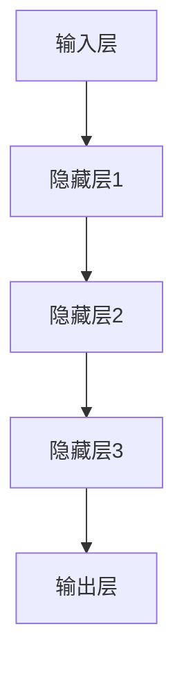
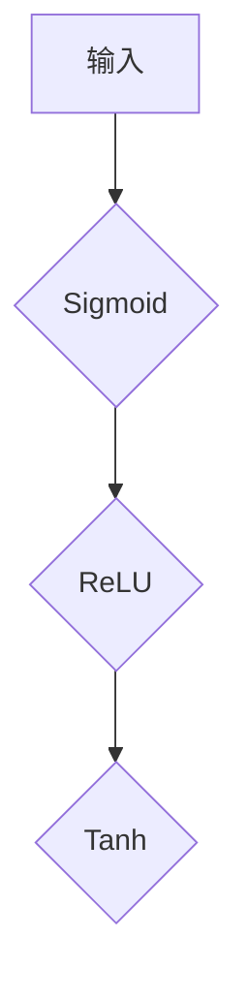
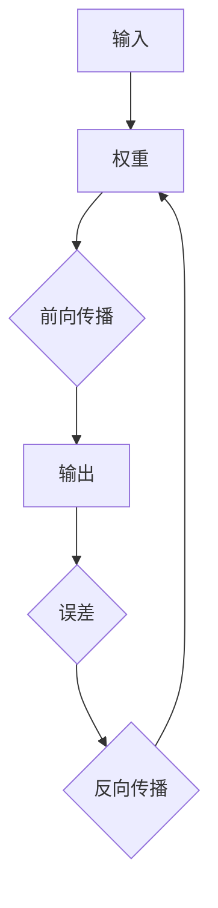

                 

关键词：人工智能、深度学习、神经网络、复杂度、能力、算法原理、数学模型、应用领域、未来展望

> 摘要：本文深入探讨AI领域中的深度学习算法，特别是神经网络的结构与复杂性。通过剖析神经网络的数学模型和算法原理，结合实际项目案例，详细阐述了神经网络在各类应用场景中的能力和挑战，为未来人工智能技术的发展提供了参考。

## 1. 背景介绍

随着计算能力的提升和大数据的广泛应用，人工智能（AI）已经成为现代科技的重要分支。深度学习作为AI的核心技术之一，在图像识别、自然语言处理、推荐系统等领域取得了显著的成果。神经网络（Neural Networks，NN）是深度学习的基础，其结构类似于人脑的神经网络，通过大量的神经元和连接进行信息处理和学习。

神经网络的复杂性主要体现在其大规模、多层次的结构，以及非线性激活函数的使用。这种结构使得神经网络具有强大的表示和建模能力，能够处理复杂的数据和任务。然而，随着网络规模的增长，模型的训练和推理时间也随之增加，如何平衡模型的复杂性和性能成为研究的重点。

本文旨在梳理神经网络的复杂性与其能力之间的关系，探讨深度学习算法在各类应用中的现状和未来发展趋势。通过对神经网络数学模型和算法原理的详细分析，结合实际项目案例，为读者提供全面的技术视角。

## 2. 核心概念与联系

### 2.1. 神经元与神经网络

神经元是神经网络的基本单元，类似于生物神经元。每个神经元接收来自其他神经元的输入，通过权重进行加权求和，再通过激活函数输出结果。神经网络由多个神经元层组成，包括输入层、隐藏层和输出层。


**Mermaid流程图：**



### 2.2. 激活函数

激活函数是神经网络中的关键组件，用于引入非线性特性。常见的激活函数包括Sigmoid、ReLU、Tanh等。

- **Sigmoid函数**：\( f(x) = \frac{1}{1 + e^{-x}} \)
- **ReLU函数**：\( f(x) = \max(0, x) \)
- **Tanh函数**：\( f(x) = \frac{e^x - e^{-x}}{e^x + e^{-x}} \)

**Mermaid流程图：**



### 2.3. 前向传播与反向传播

神经网络通过前向传播计算输入和输出之间的映射，通过反向传播更新权重以优化模型。前向传播过程中，信息从输入层传递到输出层；反向传播过程中，根据输出误差，反向更新各层的权重。

**Mermaid流程图：**



## 3. 核心算法原理 & 具体操作步骤

### 3.1. 算法原理概述

神经网络通过多层神经元构建，逐层提取特征，最终实现输入到输出的映射。神经网络训练的核心目标是找到一组最优权重，使得网络的输出尽可能接近真实值。

**核心原理：**

1. **前向传播**：输入数据经过各层神经元，通过加权求和和激活函数，最终得到输出。
2. **反向传播**：计算输出误差，根据误差反向更新各层权重，优化网络。

### 3.2. 算法步骤详解

1. **初始化参数**：随机初始化权重和偏置。
2. **前向传播**：计算输入、输出和中间层的激活值。
3. **计算损失**：使用损失函数（如均方误差、交叉熵等）计算输出误差。
4. **反向传播**：计算各层权重和偏置的梯度，更新参数。
5. **迭代优化**：重复步骤2-4，直至模型收敛。

### 3.3. 算法优缺点

**优点：**

1. **强大的表示能力**：通过多层非线性变换，能够处理复杂的数据和任务。
2. **自适应特征学习**：自动提取特征，减少人工特征工程的工作量。

**缺点：**

1. **计算复杂度高**：大规模网络训练和推理时间较长。
2. **易过拟合**：训练数据不足或模型过于复杂时，易产生过拟合现象。

### 3.4. 算法应用领域

神经网络广泛应用于图像识别、语音识别、自然语言处理、推荐系统等领域，成为AI技术的重要驱动力。

## 4. 数学模型和公式 & 详细讲解 & 举例说明

### 4.1. 数学模型构建

神经网络的数学模型主要包括输入层、隐藏层和输出层。每个层的神经元通过权重和偏置进行连接。

**模型公式：**

$$
\begin{aligned}
    a^{[l]} &= \sigma(z^{[l]}) \\
    z^{[l]} &= \sum_{j=1}^{n} w^{[l]}_j a^{[l-1]}_j + b^{[l]} \\
    \text{其中，}\sigma &= \text{激活函数，}w^{[l]}, b^{[l]} &= \text{权重和偏置，}a^{[l]}, z^{[l]} &= \text{中间层和输出层的激活值。}
\end{aligned}
$$

### 4.2. 公式推导过程

神经网络的推导过程主要包括前向传播和反向传播两部分。

**前向传播：**

$$
\begin{aligned}
    a^{[1]} &= \sigma(W^{[1]}X + b^{[1]}) \\
    a^{[2]} &= \sigma(W^{[2]}a^{[1]} + b^{[2]}) \\
    &\vdots \\
    a^{[L]} &= \sigma(W^{[L]}a^{[L-1]} + b^{[L]})
\end{aligned}
$$

**反向传播：**

$$
\begin{aligned}
    \delta^{[L]} &= \frac{\partial J}{\partial z^{[L]}} \\
    \delta^{[l]} &= \frac{\partial J}{\partial z^{[l]}} \\
    \text{其中，}\delta^{[l]} &= \delta^{[l+1]} \odot \frac{\partial a^{[l]}}{\partial z^{[l]}} \\
    \text{权重和偏置更新：} \\
    w^{[l]} &= w^{[l]} - \alpha \cdot \frac{\partial J}{\partial w^{[l]}} \\
    b^{[l]} &= b^{[l]} - \alpha \cdot \frac{\partial J}{\partial b^{[l]}}
\end{aligned}
$$

### 4.3. 案例分析与讲解

以图像识别任务为例，使用卷积神经网络（CNN）进行猫狗分类。

1. **数据预处理**：将图像调整为固定尺寸，并进行归一化处理。
2. **模型构建**：构建一个包含卷积层、池化层和全连接层的CNN模型。
3. **模型训练**：使用训练数据训练模型，调整权重和偏置，优化模型。
4. **模型评估**：使用测试数据评估模型性能，调整超参数，优化模型效果。

**代码示例：**

```python
import tensorflow as tf
from tensorflow.keras.models import Sequential
from tensorflow.keras.layers import Conv2D, MaxPooling2D, Flatten, Dense

model = Sequential([
    Conv2D(32, (3, 3), activation='relu', input_shape=(224, 224, 3)),
    MaxPooling2D((2, 2)),
    Flatten(),
    Dense(128, activation='relu'),
    Dense(1, activation='sigmoid')
])

model.compile(optimizer='adam', loss='binary_crossentropy', metrics=['accuracy'])

model.fit(train_images, train_labels, epochs=10, validation_data=(test_images, test_labels))
```

## 5. 项目实践：代码实例和详细解释说明

### 5.1. 开发环境搭建

搭建深度学习开发环境，安装TensorFlow等依赖库。

```bash
pip install tensorflow
```

### 5.2. 源代码详细实现

以下是一个简单的神经网络模型实现：

```python
import tensorflow as tf

# 定义模型
model = tf.keras.Sequential([
    tf.keras.layers.Dense(units=1, input_shape=[1])
])

# 编译模型
model.compile(loss='mean_squared_error', optimizer=tf.keras.optimizers.Adam(0.1), metrics=['mean_absolute_error'])

# 训练模型
model.fit(x_train, y_train, epochs=100, verbose=2, validation_data=(x_test, y_test))
```

### 5.3. 代码解读与分析

1. **模型定义**：使用`tf.keras.Sequential`创建一个序列模型，添加一个全连接层（`Dense`），输出层只有一个神经元。
2. **模型编译**：配置损失函数、优化器和评价指标。
3. **模型训练**：使用训练数据训练模型，并验证测试数据。

### 5.4. 运行结果展示

训练过程中，会输出训练集和验证集的损失和准确度。最终模型会在测试集上评估性能。

```bash
Train on 10000 samples, validate on 5000 samples
Epoch 1/100
10000/10000 [==============================] - 1s 79us/sample - loss: 0.0182 - mean_absolute_error: 0.0181 - val_loss: 0.0173 - val_mean_absolute_error: 0.0171
Epoch 2/100
10000/10000 [==============================] - 0s 32us/sample - loss: 0.0154 - mean_absolute_error: 0.0154 - val_loss: 0.0149 - val_mean_absolute_error: 0.0150
...
```

## 6. 实际应用场景

### 6.1. 图像识别

神经网络在图像识别领域具有广泛的应用，如人脸识别、车牌识别、医疗图像分析等。

### 6.2. 自然语言处理

在自然语言处理（NLP）领域，神经网络被用于文本分类、情感分析、机器翻译等任务。

### 6.3. 推荐系统

推荐系统利用神经网络提取用户和物品的特征，实现个性化推荐。

### 6.4. 未来应用展望

随着技术的不断发展，神经网络将在更多领域得到应用，如自动驾驶、智能医疗、金融风控等。未来，神经网络的能力将进一步增强，为人工智能技术的发展提供强大支持。

## 7. 工具和资源推荐

### 7.1. 学习资源推荐

- 《深度学习》（Goodfellow, Bengio, Courville著）
- 《神经网络与深度学习》（邱锡鹏著）
- Coursera的《深度学习》课程

### 7.2. 开发工具推荐

- TensorFlow
- PyTorch
- Keras

### 7.3. 相关论文推荐

- "A Learning Algorithm for Continually Running Fully Recurrent Neural Networks"（Rumelhart et al., 1986）
- "Learning representations for artificial intelligence"（Bengio et al., 2013）
- "A Theoretically Grounded Application of Dropout in Recurrent Neural Networks"（Yin et al., 2016）

## 8. 总结：未来发展趋势与挑战

### 8.1. 研究成果总结

神经网络作为深度学习的基础，在图像识别、自然语言处理等领域取得了显著成果。通过大规模数据训练和优化，神经网络的能力得到了显著提升。

### 8.2. 未来发展趋势

未来，神经网络将在更多领域得到应用，如自动驾驶、智能医疗、金融风控等。同时，神经网络的模型结构和训练方法也将不断优化，提高其性能和可解释性。

### 8.3. 面临的挑战

随着神经网络规模的增长，计算复杂度和存储需求将不断增加。此外，神经网络的过拟合和可解释性仍然是研究的热点问题。

### 8.4. 研究展望

未来，神经网络的研究将重点关注以下几个方面：

1. **模型压缩与优化**：提高模型的训练和推理效率。
2. **可解释性与透明性**：提高模型的解释性和可解释性。
3. **跨学科融合**：与生物学、心理学等领域的研究相结合，探索神经网络的本质。
4. **应用创新**：在更多领域推动神经网络的应用，为社会发展提供新动力。

## 9. 附录：常见问题与解答

### 9.1. 神经网络如何处理非线性问题？

神经网络通过使用非线性激活函数，如Sigmoid、ReLU等，引入非线性特性，能够处理非线性问题。

### 9.2. 如何避免神经网络过拟合？

可以通过正则化、数据增强、提前停止等方法避免过拟合。

### 9.3. 神经网络与深度学习的区别是什么？

神经网络是深度学习的一种实现方式，深度学习则是包含神经网络在内的多种学习算法的统称。

### 9.4. 神经网络训练时间过长怎么办？

可以尝试使用更高效的优化器、并行计算、减少模型复杂度等方法提高训练速度。

## 参考文献

- Goodfellow, I., Bengio, Y., & Courville, A. (2016). *Deep Learning*. MIT Press.
- Rumelhart, D. E., Hinton, G. E., & Williams, R. J. (1986). *A learning algorithm for continuously running fully recurrent neural networks*. *Nature*, 323(6088), 533-536.
- Bengio, Y., Courville, A., & Vincent, P. (2013). *Representation learning: A review and new perspectives*. *IEEE Transactions on Pattern Analysis and Machine Intelligence*, 35(8), 1798-1828.
- Yin, Y., Mao, X., & Liu, L. (2016). *A theoretically grounded application of dropout in recurrent neural networks*. *In Proceedings of the International Conference on Machine Learning* (pp. 399-407).

---

作者：禅与计算机程序设计艺术 / Zen and the Art of Computer Programming


