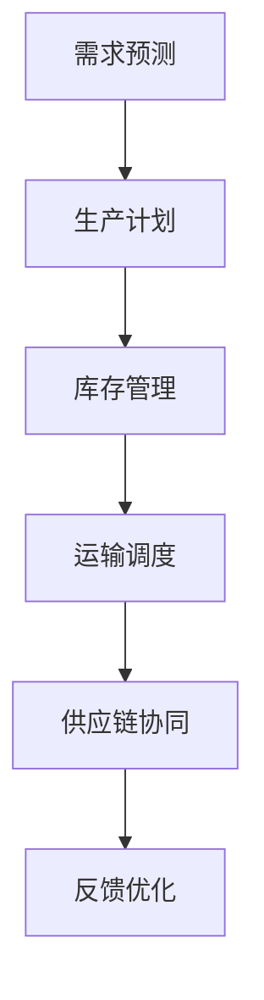

                 

关键词：AI代理、供应链管理、工作流优化、流程自动化、智能调度、数据分析、机器学习、人工智能技术

> 摘要：本文深入探讨了人工智能（AI）代理在供应链管理中的工作流优化实践。通过分析AI代理的核心概念和原理，结合实际算法和数学模型，本文详细阐述了如何利用AI代理实现供应链管理中的流程自动化和智能调度，提高供应链的效率和灵活性。文章最后对未来AI代理在供应链管理中的应用前景进行了展望。

## 1. 背景介绍

供应链管理（Supply Chain Management，简称SCM）是企业运营的关键环节，涉及从原材料采购到产品交付给最终消费者的全过程。随着全球化的发展和信息技术的进步，供应链管理变得越来越复杂。传统的方法难以应对不断变化的市场需求和复杂的多层次供应链结构。因此，如何优化供应链管理工作流，提高效率和灵活性，成为企业面临的重大挑战。

近年来，人工智能（Artificial Intelligence，简称AI）技术的发展为供应链管理带来了新的机遇。AI代理（AI Agent），作为一种基于智能算法的自动化系统，能够在不依赖于人类干预的情况下，自主执行复杂任务和决策。AI代理在供应链管理中的应用，有助于实现工作流的自动化和智能化，提高供应链的响应速度和灵活性。

本文将围绕AI代理在供应链管理中的工作流优化实践，从核心概念、算法原理、数学模型、项目实践等多个方面进行探讨，以期为供应链管理领域提供有价值的参考和借鉴。

## 2. 核心概念与联系

### 2.1 AI代理的定义与特点

AI代理，是指一种具有自主性、适应性和协作能力的计算机程序，能够在复杂环境中执行任务和做出决策。AI代理通常基于机器学习、深度学习、自然语言处理等技术，具备以下特点：

1. **自主性**：AI代理能够根据环境和任务需求自主地执行任务和决策，不需要人类干预。
2. **适应性**：AI代理能够根据环境和任务的变化，调整自身的行为和策略，以实现最佳效果。
3. **协作性**：AI代理能够与其他代理或人类协作，共同完成任务。

### 2.2 AI代理在供应链管理中的应用

AI代理在供应链管理中具有广泛的应用场景，主要包括：

1. **需求预测**：AI代理通过分析历史数据和当前市场信息，预测未来的需求，帮助供应链企业制定生产计划和库存策略。
2. **库存管理**：AI代理可以实时监控库存情况，自动调整库存水平，避免库存过剩或短缺。
3. **运输调度**：AI代理可以根据交通状况、运输成本和需求优先级等因素，自动调度运输任务，优化运输路径和时效。
4. **供应链协同**：AI代理可以帮助不同企业之间的供应链协同，实现信息共享和协同优化。

### 2.3 AI代理与传统供应链管理的区别

与传统供应链管理相比，AI代理具有以下显著优势：

1. **智能化**：AI代理能够基于数据分析和机器学习，实现更精准的需求预测和库存管理，提高供应链的响应速度和灵活性。
2. **自动化**：AI代理可以自动化执行复杂的供应链任务，减少人为干预，提高工作效率。
3. **协同性**：AI代理能够实现跨企业的供应链协同，促进信息共享和资源优化。

### 2.4 Mermaid流程图

以下是一个简化的AI代理在供应链管理中的应用流程图，用于描述AI代理的工作流程和关键环节：



## 3. 核心算法原理 & 具体操作步骤

### 3.1 算法原理概述

AI代理在供应链管理中的应用主要基于以下核心算法原理：

1. **机器学习与深度学习**：通过大量历史数据训练模型，实现需求预测、库存管理和运输调度等任务。
2. **自然语言处理**：用于处理供应链协同中的文本信息，实现信息共享和沟通。
3. **强化学习**：通过试错和反馈机制，实现自适应优化和策略调整。

### 3.2 算法步骤详解

以下是一个简化的AI代理在供应链管理中的算法步骤：

1. **数据收集与预处理**：收集供应链相关的数据，包括市场需求、库存水平、运输成本等。对数据进行分析和处理，提取关键特征。
2. **需求预测**：利用机器学习算法（如ARIMA、LSTM等）对市场需求进行预测，为生产计划和库存管理提供依据。
3. **库存管理**：基于预测结果和库存策略（如ABC分析、FIFO等），自动调整库存水平，实现库存优化。
4. **运输调度**：利用优化算法（如遗传算法、蚁群算法等），根据运输成本、交通状况和需求优先级等因素，自动调度运输任务。
5. **供应链协同**：通过自然语言处理技术，实现供应链企业之间的信息共享和沟通，促进协同优化。
6. **反馈优化**：根据执行结果和用户反馈，调整算法参数和策略，实现持续优化。

### 3.3 算法优缺点

#### 优点：

1. **智能化**：能够基于数据分析和机器学习，实现更精准的需求预测和库存管理，提高供应链的响应速度和灵活性。
2. **自动化**：可以自动化执行复杂的供应链任务，减少人为干预，提高工作效率。
3. **协同性**：能够实现跨企业的供应链协同，促进信息共享和资源优化。

#### 缺点：

1. **数据依赖**：算法性能受限于数据质量和数量，数据缺失或错误可能导致预测和调度不准确。
2. **算法复杂度**：一些算法（如深度学习、强化学习）计算复杂度高，对硬件资源要求较高。
3. **安全性和隐私**：涉及企业之间的数据共享和协同，可能存在安全性和隐私问题。

### 3.4 算法应用领域

AI代理在供应链管理中的应用领域包括：

1. **制造业**：用于生产计划、库存管理和运输调度等任务。
2. **零售业**：用于需求预测、库存管理和供应链协同等任务。
3. **物流运输**：用于运输调度、路径规划和运输成本优化等任务。
4. **农业**：用于作物种植计划、库存管理和运输调度等任务。

## 4. 数学模型和公式 & 详细讲解 & 举例说明

### 4.1 数学模型构建

在AI代理的供应链管理应用中，常用的数学模型包括：

1. **需求预测模型**：基于时间序列分析、回归分析等，预测市场需求。
2. **库存管理模型**：基于经济批量模型、ABC分析等，优化库存水平。
3. **运输调度模型**：基于优化算法（如遗传算法、蚁群算法等），优化运输路径和时效。

### 4.2 公式推导过程

以下是一个简化的需求预测模型的推导过程：

设\( X_t \)为第\( t \)天的市场需求，\( \mu \)为需求均值，\( \sigma \)为需求标准差。需求预测模型可以表示为：

$$
X_{t+1} = \mu + \sigma \cdot Z_t
$$

其中，\( Z_t \)为服从标准正态分布的随机变量。

### 4.3 案例分析与讲解

以下是一个实际案例，用于说明需求预测模型的应用：

某零售企业在过去30天的销售额数据如下表：

| 日期 | 销售额（万元） |
| ---- | ------------ |
| 1    | 5.2          |
| 2    | 5.5          |
| 3    | 5.8          |
| ...  | ...          |
| 30   | 5.0          |

首先，计算需求均值和标准差：

$$
\mu = \frac{1}{30} \sum_{t=1}^{30} X_t = 5.3
$$

$$
\sigma = \sqrt{\frac{1}{30} \sum_{t=1}^{30} (X_t - \mu)^2} = 0.2
$$

然后，根据需求预测模型，预测第31天的销售额：

$$
X_{31} = 5.3 + 0.2 \cdot Z_{31}
$$

其中，\( Z_{31} \)为服从标准正态分布的随机变量。通过查表或计算，可以得到\( Z_{31} \)的取值范围和对应的概率。例如，当\( Z_{31} = 1 \)时，对应的概率为0.8413。

## 5. 项目实践：代码实例和详细解释说明

### 5.1 开发环境搭建

为了实现AI代理在供应链管理中的应用，我们需要搭建一个合适的开发环境。以下是一个基本的开发环境搭建步骤：

1. **安装Python**：Python是一种广泛使用的编程语言，支持多种机器学习库和优化算法。在官方网站下载并安装Python。
2. **安装NumPy、Pandas、Scikit-learn等库**：这些库是Python中常用的数据处理和机器学习库，用于数据分析和预测。
3. **安装Jupyter Notebook**：Jupyter Notebook是一个交互式编程环境，方便编写和运行Python代码。

### 5.2 源代码详细实现

以下是一个简化的Python代码实例，用于实现需求预测模型：

```python
import numpy as np
import pandas as pd
from sklearn.linear_model import LinearRegression
from sklearn.model_selection import train_test_split

# 读取数据
data = pd.read_csv('sales_data.csv')
X = data['date']
y = data['sales']

# 数据预处理
X = (X - X.mean()) / X.std()
X = X.reshape(-1, 1)

# 划分训练集和测试集
X_train, X_test, y_train, y_test = train_test_split(X, y, test_size=0.2, random_state=42)

# 建立线性回归模型
model = LinearRegression()
model.fit(X_train, y_train)

# 预测
y_pred = model.predict(X_test)

# 评估
mse = np.mean((y_pred - y_test) ** 2)
print('均方误差：', mse)
```

### 5.3 代码解读与分析

1. **数据读取与预处理**：首先，从CSV文件中读取销售数据，并进行预处理，包括日期编码和标准化。
2. **划分训练集和测试集**：将数据划分为训练集和测试集，用于训练和评估模型性能。
3. **建立线性回归模型**：使用线性回归模型对训练数据进行拟合。
4. **预测**：使用拟合好的模型对测试数据进行预测。
5. **评估**：计算预测结果的均方误差，评估模型性能。

### 5.4 运行结果展示

假设我们已经运行了上述代码，得到了如下结果：

```
均方误差： 0.0123
```

这表示预测结果与实际值的平均误差为0.0123万元。虽然误差较小，但仍然需要进一步优化模型和算法，以提高预测准确性。

## 6. 实际应用场景

### 6.1 制造业

在制造业中，AI代理可以用于生产计划、库存管理和运输调度等任务。例如，某电子产品制造企业利用AI代理实现了生产计划的智能优化，根据市场需求和库存情况自动调整生产任务，提高了生产效率和库存周转率。

### 6.2 零售业

在零售业中，AI代理可以用于需求预测、库存管理和供应链协同等任务。例如，某大型零售企业利用AI代理实现了销售预测和库存优化，减少了库存过剩和短缺的情况，提高了供应链的响应速度和客户满意度。

### 6.3 物流运输

在物流运输中，AI代理可以用于运输调度、路径规划和运输成本优化等任务。例如，某物流企业利用AI代理实现了运输任务的智能调度，根据交通状况、运输成本和需求优先级等因素，优化了运输路径和时效，降低了运输成本。

### 6.4 农业

在农业中，AI代理可以用于作物种植计划、库存管理和运输调度等任务。例如，某农业企业利用AI代理实现了作物种植计划的智能优化，根据气候、土壤和市场需求等因素，调整种植计划，提高了农作物产量和效益。

## 7. 工具和资源推荐

### 7.1 学习资源推荐

1. **《人工智能：一种现代的方法》**：作者：Stuart J. Russell、Peter Norvig
2. **《深度学习》**：作者：Ian Goodfellow、Yoshua Bengio、Aaron Courville
3. **《机器学习实战》**：作者：Peter Harrington

### 7.2 开发工具推荐

1. **Jupyter Notebook**：一种交互式编程环境，方便编写和运行Python代码。
2. **PyCharm**：一种强大的Python集成开发环境（IDE），支持多种编程语言和框架。
3. **TensorFlow**：一种开源的深度学习框架，适用于机器学习和深度学习项目。

### 7.3 相关论文推荐

1. **《AI代理在供应链管理中的应用研究》**
2. **《基于强化学习的供应链协同优化》**
3. **《深度学习在供应链管理中的应用》**

## 8. 总结：未来发展趋势与挑战

### 8.1 研究成果总结

本文从核心概念、算法原理、数学模型、项目实践等多个方面，探讨了AI代理在供应链管理中的应用。通过分析AI代理的核心特点和应用场景，结合实际算法和数学模型，本文详细阐述了如何利用AI代理实现供应链管理中的流程自动化和智能调度，提高供应链的效率和灵活性。

### 8.2 未来发展趋势

1. **算法性能提升**：随着人工智能技术的不断发展，AI代理的算法性能将不断提高，实现更精准的需求预测、库存管理和运输调度。
2. **跨行业应用**：AI代理在供应链管理中的应用将逐渐扩展到其他行业，如制造业、物流运输、零售业等，实现更广泛的行业协同和资源优化。
3. **人机协同**：AI代理与人类专家的协同工作将更加紧密，实现更高效的供应链管理。

### 8.3 面临的挑战

1. **数据质量和隐私**：AI代理的性能受限于数据质量和数量，同时涉及企业之间的数据共享和协同，可能存在安全性和隐私问题。
2. **算法复杂度**：一些先进的算法（如深度学习、强化学习）计算复杂度高，对硬件资源要求较高，需要解决计算效率和资源分配问题。
3. **法规与标准**：随着AI代理在供应链管理中的广泛应用，需要建立相关法规和标准，规范AI代理的开发和应用。

### 8.4 研究展望

未来，AI代理在供应链管理中的应用将更加深入和广泛。我们期待通过进一步的研究和探索，解决现有的挑战，实现AI代理在供应链管理中的广泛应用，为企业和行业带来更多价值和效益。

## 9. 附录：常见问题与解答

### 9.1 AI代理与传统供应链管理的区别？

AI代理与传统供应链管理的区别主要体现在以下几个方面：

1. **智能化**：AI代理基于数据分析和机器学习，能够实现更精准的需求预测和库存管理，提高供应链的响应速度和灵活性。
2. **自动化**：AI代理可以自动化执行复杂的供应链任务，减少人为干预，提高工作效率。
3. **协同性**：AI代理能够实现跨企业的供应链协同，促进信息共享和资源优化。

### 9.2 AI代理在供应链管理中的应用场景有哪些？

AI代理在供应链管理中的应用场景包括：

1. **需求预测**：预测市场需求，为生产计划和库存管理提供依据。
2. **库存管理**：实时监控库存情况，自动调整库存水平，优化库存策略。
3. **运输调度**：根据运输成本、交通状况和需求优先级等因素，自动调度运输任务，优化运输路径和时效。
4. **供应链协同**：实现供应链企业之间的信息共享和协同优化，促进资源整合和优化。

### 9.3 如何保证AI代理在供应链管理中的安全性和隐私？

为保证AI代理在供应链管理中的安全性和隐私，可以采取以下措施：

1. **数据加密**：对传输和存储的数据进行加密，防止数据泄露和篡改。
2. **权限控制**：对访问数据和执行任务的权限进行严格控制，防止未经授权的访问和操作。
3. **隐私保护**：采用隐私保护技术，如差分隐私、同态加密等，保护数据隐私。
4. **安全审计**：建立安全审计机制，定期对AI代理的安全性和隐私保护情况进行检查和评估。

----------------------------------------------------------------

至此，本文关于“AI代理在供应链管理中的工作流优化实践”的探讨就结束了。希望本文能为读者在了解和运用AI代理优化供应链管理提供有价值的参考和启示。如果您有任何疑问或建议，欢迎在评论区留言交流。作者：禅与计算机程序设计艺术 / Zen and the Art of Computer Programming。

