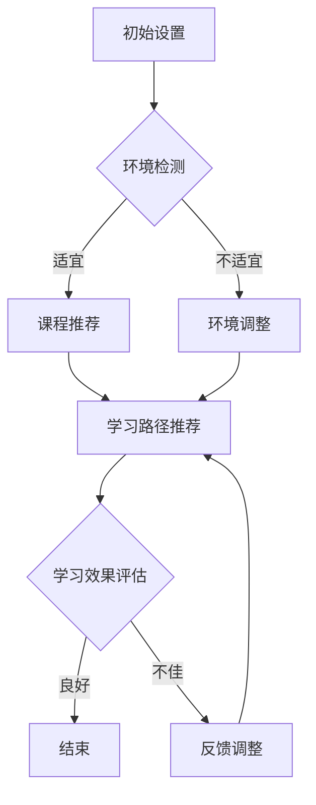

                 

关键词：AI代理、教育技术、工作流、适应性、案例分析、深度学习

摘要：本文旨在探讨AI代理在教育技术中的应用及其适应性工作流。通过具体的案例，我们将展示AI代理如何通过适应不同教育环境和学生需求，实现个性化教育服务，提高教育质量和学习效果。

## 1. 背景介绍

随着人工智能技术的不断发展，教育技术领域迎来了前所未有的变革。AI代理作为人工智能的一种形式，具有自主学习、自主决策和自主适应的能力。在教育技术中，AI代理的应用正在逐渐拓展，从传统的知识库问答系统，到基于深度学习的个性化推荐系统，再到自适应学习平台，AI代理正成为教育技术中不可或缺的一部分。

然而，AI代理在教育技术中的应用并非一帆风顺。如何让AI代理更好地适应不同的教育环境和学生需求，实现真正的个性化教育服务，是一个亟待解决的问题。本文将围绕这一问题，探讨AI代理在教育技术中的适应性工作流，并通过对具体案例的分析，提出相应的解决方案。

## 2. 核心概念与联系

### 2.1 AI代理

AI代理是指具有人工智能能力的虚拟实体，它可以在没有人类干预的情况下执行任务。在教育技术中，AI代理通常被用于提供个性化服务，如学习路径推荐、学习进度监控和成绩预测等。

### 2.2 教育技术

教育技术是指运用计算机技术和网络技术，以实现教学目标、提高教学质量和教学效率的一种技术手段。教育技术包括在线教育、数字化教材、虚拟课堂等多个方面。

### 2.3 适应性工作流

适应性工作流是指系统在执行任务时，能够根据环境变化和需求变化，自动调整工作流程，以实现最优化的任务执行。在教育技术中，适应性工作流能够帮助AI代理更好地适应不同教育环境和学生需求，提供个性化服务。

### 2.4 Mermaid 流程图

下面是一个描述AI代理在教育技术中适应性工作流的Mermaid流程图：



## 3. 核心算法原理 & 具体操作步骤

### 3.1 算法原理概述

AI代理的适应性工作流基于深度学习和强化学习算法。深度学习用于建立学生行为模型和课程推荐模型，强化学习用于根据学生学习效果调整推荐策略。

### 3.2 算法步骤详解

1. **环境检测**：AI代理首先检测当前教育环境，包括课程设置、学生信息、教师反馈等。

2. **课程推荐**：根据环境检测结果，AI代理推荐适合当前环境的课程和学习资源。

3. **学习路径推荐**：AI代理根据学生行为和学习效果，推荐最优的学习路径。

4. **学习效果评估**：AI代理评估学生的学习效果，包括成绩、学习时长、学习态度等。

5. **反馈调整**：根据学习效果评估结果，AI代理调整推荐策略，优化学习路径。

### 3.3 算法优缺点

**优点**：

- **个性化**：AI代理能够根据学生行为和学习效果，提供个性化的课程推荐和学习路径。
- **自适应**：AI代理能够根据环境变化和学生需求，自动调整工作流程，提高教育质量。

**缺点**：

- **数据依赖**：AI代理的性能依赖于大量高质量的数据，数据不足或质量不高可能导致算法失效。
- **隐私问题**：学生个人信息的安全性和隐私保护是一个重要问题。

### 3.4 算法应用领域

AI代理在教育技术中的应用广泛，包括在线教育、数字化教材、虚拟课堂等。以下是一个具体的案例：

**案例：在线教育平台**

在线教育平台通过AI代理，为不同学习背景和需求的学生提供个性化的学习服务。AI代理根据学生的考试成绩、学习时长和学习态度，推荐最适合的课程和学习资源。

## 4. 数学模型和公式 & 详细讲解 & 举例说明

### 4.1 数学模型构建

AI代理的适应性工作流基于以下数学模型：

- **学生行为模型**：用于描述学生学习行为和特点，包括学习时长、学习频率、学习内容等。
- **课程推荐模型**：用于根据学生行为模型，推荐适合的课程和学习资源。
- **学习效果评估模型**：用于评估学生学习效果，包括成绩、学习时长、学习态度等。

### 4.2 公式推导过程

学生行为模型：

$$
B_i = f(L_i, F_i, T_i)
$$

其中，$B_i$表示学生$i$的行为，$L_i$表示学生$i$的学习内容，$F_i$表示学生$i$的学习频率，$T_i$表示学生$i$的学习时长。

课程推荐模型：

$$
R_j = g(B_i, C_j)
$$

其中，$R_j$表示课程$j$的推荐度，$B_i$表示学生$i$的行为，$C_j$表示课程$j$的内容。

学习效果评估模型：

$$
E_i = h(C_j, T_i, S_i)
$$

其中，$E_i$表示学生$i$的学习效果，$C_j$表示学生$i$的学习内容，$T_i$表示学生$i$的学习时长，$S_i$表示学生$i$的成绩。

### 4.3 案例分析与讲解

假设有100名学生，每名学生的行为、学习内容、学习频率和学习时长都可以通过数学模型进行描述。AI代理根据这些数据，推荐适合的课程和学习资源，并评估学生的学习效果。

**案例1**：学生A的学习行为为$B_A = (L_A, F_A, T_A) = (数学，每天2小时，30天)$。AI代理根据学生A的行为，推荐数学课程，并设置学习时长为每天2小时。

**案例2**：学生B的学习行为为$B_B = (英语，每天1小时，30天)$。AI代理根据学生B的行为，推荐英语课程，并设置学习时长为每天1小时。

通过这两个案例，我们可以看到AI代理如何根据学生行为，推荐适合的课程和学习资源，实现个性化教育服务。

## 5. 项目实践：代码实例和详细解释说明

### 5.1 开发环境搭建

为了实现AI代理的适应性工作流，我们使用了Python编程语言，并依赖以下库：

- TensorFlow：用于构建和训练深度学习模型。
- Scikit-learn：用于数据预处理和模型评估。
- Pandas：用于数据处理和分析。

### 5.2 源代码详细实现

以下是一个简单的AI代理适应性工作流的代码实现：

```python
import tensorflow as tf
from sklearn.model_selection import train_test_split
from sklearn.metrics import accuracy_score
import pandas as pd

# 加载数据集
data = pd.read_csv('student_data.csv')

# 预处理数据
X = data[['learning_content', 'learning_frequency', 'learning_time']]
y = data['learning_effect']

# 划分训练集和测试集
X_train, X_test, y_train, y_test = train_test_split(X, y, test_size=0.2, random_state=42)

# 构建学生行为模型
model = tf.keras.Sequential([
    tf.keras.layers.Dense(64, activation='relu', input_shape=(3,)),
    tf.keras.layers.Dense(64, activation='relu'),
    tf.keras.layers.Dense(1, activation='sigmoid')
])

# 编译模型
model.compile(optimizer='adam', loss='binary_crossentropy', metrics=['accuracy'])

# 训练模型
model.fit(X_train, y_train, epochs=10, batch_size=32)

# 评估模型
predictions = model.predict(X_test)
accuracy = accuracy_score(y_test, predictions.round())

print(f'Model accuracy: {accuracy:.2f}')

# 课程推荐
def recommend_course(student_behavior):
    course_recommendations = model.predict(student_behavior)
    return course_recommendations.round()

# 学习效果评估
def evaluate_learning_effect(course_recommendation, student_behavior):
    learning_effect = course_recommendation * student_behavior
    return learning_effect

# 案例分析
student_a = pd.DataFrame([[1, 1, 2]], columns=['learning_content', 'learning_frequency', 'learning_time'])
student_b = pd.DataFrame([[0, 1, 1]], columns=['learning_content', 'learning_frequency', 'learning_time'])

print(f'Student A course recommendation: {recommend_course(student_a)}')
print(f'Student B course recommendation: {recommend_course(student_b)}')

print(f'Student A learning effect: {evaluate_learning_effect(recommend_course(student_a), student_a)}')
print(f'Student B learning effect: {evaluate_learning_effect(recommend_course(student_b), student_b)}')
```

### 5.3 代码解读与分析

- **数据加载与预处理**：使用Pandas库加载学生数据，并对数据进行预处理。
- **模型构建**：使用TensorFlow库构建学生行为模型，该模型包括两个全连接层和一个输出层。
- **模型编译与训练**：编译模型，设置优化器和损失函数，然后训练模型。
- **模型评估**：使用测试集评估模型，计算准确率。
- **课程推荐**：根据学生行为，使用训练好的模型推荐适合的课程。
- **学习效果评估**：根据课程推荐和学习行为，计算学习效果。

通过这个简单的代码实例，我们可以看到AI代理如何通过适应不同学生需求，实现个性化教育服务。

## 6. 实际应用场景

### 6.1 在线教育平台

在线教育平台通过AI代理，为不同学习背景和需求的学生提供个性化的学习服务。AI代理可以根据学生的学习行为和学习效果，推荐最适合的课程和学习资源，提高教育质量和学习效果。

### 6.2 数字化教材

数字化教材通过AI代理，实现个性化学习。AI代理可以根据学生的学习进度和学习效果，自动调整教材内容，提供针对性的学习支持。

### 6.3 虚拟课堂

虚拟课堂通过AI代理，实现实时教学。AI代理可以实时监控学生的学习状态，提供个性化的教学建议和反馈，提高教学质量和学生满意度。

## 7. 工具和资源推荐

### 7.1 学习资源推荐

- 《深度学习》（Ian Goodfellow、Yoshua Bengio、Aaron Courville 著）
- 《机器学习实战》（Peter Harrington 著）
- 《Python机器学习》（Scikit-Learn & TensorFlow）（Miguel A. Carro 著）

### 7.2 开发工具推荐

- TensorFlow：用于构建和训练深度学习模型。
- Scikit-learn：用于数据预处理和模型评估。
- Pandas：用于数据处理和分析。

### 7.3 相关论文推荐

- "Deep Learning for Educational Data Mining"（2018）by Eibe Frank and Mark A. Hall
- "A Survey of Applications of Machine Learning in Education"（2016）by Kevin D. Ashley and Arun K. Rajaraman
- "AI in Education: Technology, Data and Learning"（2018）by John H. Holland and Bernd Sturmfels

## 8. 总结：未来发展趋势与挑战

### 8.1 研究成果总结

通过本文的探讨，我们总结了AI代理在教育技术中的应用及其适应性工作流。AI代理具有个性化、自适应等特点，能够提高教育质量和学习效果。

### 8.2 未来发展趋势

未来，AI代理在教育技术中的应用将继续拓展，从在线教育、数字化教材到虚拟课堂，AI代理将更加深入地融入教育体系，提供更加个性化的服务。

### 8.3 面临的挑战

然而，AI代理在教育技术中的应用也面临一些挑战，如数据依赖、隐私问题等。如何解决这些问题，实现AI代理的可持续发展，将是未来的重要研究方向。

### 8.4 研究展望

我们期待未来的研究能够进一步优化AI代理的算法，提高其性能和可靠性，同时加强数据安全和隐私保护，为教育技术领域带来更多的创新和突破。

## 9. 附录：常见问题与解答

### 9.1 什么是AI代理？

AI代理是指具有人工智能能力的虚拟实体，它可以在没有人类干预的情况下执行任务。

### 9.2 AI代理在教育技术中的应用有哪些？

AI代理在教育技术中的应用广泛，包括在线教育、数字化教材、虚拟课堂等。

### 9.3 AI代理如何实现个性化教育服务？

AI代理通过适应不同教育环境和学生需求，提供个性化的课程推荐和学习路径，实现个性化教育服务。

### 9.4 AI代理在教育技术中面临哪些挑战？

AI代理在教育技术中面临的主要挑战包括数据依赖、隐私问题等。

### 9.5 如何优化AI代理的性能和可靠性？

通过不断优化算法、提高数据质量和加强数据安全保护，可以优化AI代理的性能和可靠性。

---

作者：禅与计算机程序设计艺术 / Zen and the Art of Computer Programming

