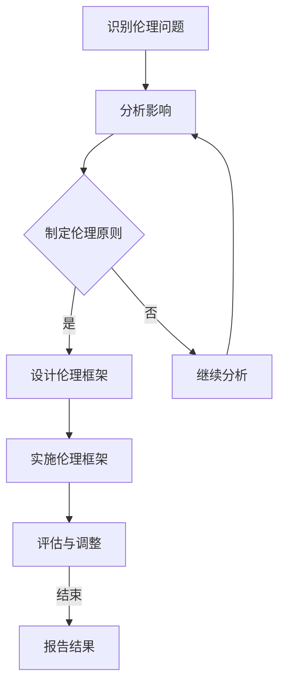

                 

关键词：AI伦理、AI道德、伦理决策、代码实例、人工智能、道德困境、编程实践、伦理框架

## 摘要

本文旨在探讨人工智能（AI）领域的伦理问题，以及如何在编程实践中应用伦理原则。文章首先介绍了AI伦理的核心概念，包括伦理决策的重要性、AI系统的道德责任和影响。接着，文章通过具体的算法原理、数学模型和代码实例，详细讲解了如何在实际项目中嵌入伦理考量。此外，文章还讨论了AI伦理在现实世界中的应用场景，以及未来发展的趋势与挑战。

## 1. 背景介绍

随着AI技术的迅猛发展，人工智能已经渗透到我们生活的方方面面，从智能家居、自动驾驶到医疗诊断、金融分析。然而，AI技术的广泛应用也带来了诸多伦理问题。例如，AI系统在决策过程中可能存在偏见，对用户隐私的保护问题，以及AI自主决策可能引发的道德责任等。因此，AI伦理的研究变得尤为重要。

AI伦理研究的主要目标是确保AI系统在设计、开发和使用过程中遵循道德原则，保护人类利益和社会公共利益。这需要从多个角度进行探讨，包括技术、法律、社会和文化等方面。

## 2. 核心概念与联系

### 2.1 伦理决策

伦理决策是指在设计和开发AI系统时，如何考虑系统的道德责任和社会影响。伦理决策不仅涉及到技术层面的考量，还需要关注社会、文化和法律等因素。

### 2.2 AI系统的道德责任

AI系统的道德责任是指AI系统在执行任务时，需要承担的道德义务和责任。例如，自动驾驶汽车在遇到危险情况时，需要做出决策以保护乘客和行人的安全。

### 2.3 AI的影响

AI的影响包括对人类生活、工作、经济和社会结构等方面的影响。了解AI的影响有助于我们更好地评估AI系统的道德责任。

### 2.4 Mermaid 流程图

以下是一个简单的Mermaid流程图，用于描述AI伦理决策的过程：



## 3. 核心算法原理 & 具体操作步骤

### 3.1 算法原理概述

AI伦理决策算法旨在帮助开发者识别和解决AI系统中的伦理问题。该算法的核心思想是通过一系列步骤，确保AI系统在设计、开发和使用过程中遵循道德原则。

### 3.2 算法步骤详解

1. **识别伦理问题**：通过数据分析和案例研究，识别AI系统可能存在的伦理问题。
2. **分析影响**：评估伦理问题对用户、社会和经济等方面的影响。
3. **制定伦理原则**：根据识别的伦理问题和分析结果，制定相应的伦理原则。
4. **设计伦理框架**：将伦理原则转化为具体的实施策略和流程。
5. **实施伦理框架**：在AI系统设计和开发过程中，遵循伦理框架的要求。
6. **评估与调整**：定期评估AI系统的道德表现，并根据评估结果进行调整。
7. **报告结果**：向相关方报告AI系统的道德表现和改进措施。

### 3.3 算法优缺点

**优点**：
- **系统化**：算法提供了明确的步骤，有助于开发者系统地处理伦理问题。
- **灵活性**：算法可以根据具体问题进行调整，适应不同的应用场景。

**缺点**：
- **复杂性**：算法涉及多个环节，需要开发者具备一定的伦理知识和技能。
- **成本**：实施算法可能需要额外的时间和资源投入。

### 3.4 算法应用领域

AI伦理决策算法可以应用于各个AI领域，如自动驾驶、医疗诊断、金融分析等。以下是一个具体的案例：

**案例：自动驾驶汽车伦理决策**

在自动驾驶汽车领域，伦理决策算法可以帮助汽车制造商识别和解决自动驾驶汽车在行驶过程中可能遇到的伦理问题。例如，当自动驾驶汽车遇到紧急情况时，需要做出决策以保护乘客和行人的安全。通过应用伦理决策算法，制造商可以制定相应的伦理原则和决策流程，确保自动驾驶汽车在行驶过程中遵循道德原则。

## 4. 数学模型和公式 & 详细讲解 & 举例说明

### 4.1 数学模型构建

为了更好地理解和分析AI伦理决策算法，我们可以构建一个简单的数学模型。该模型包含以下变量：

- **X**：伦理问题的严重程度
- **Y**：伦理问题的解决成本
- **Z**：伦理原则的执行效果

### 4.2 公式推导过程

根据伦理决策算法的步骤，我们可以推导出以下公式：

- **严重程度得分（S）**：S = X * Y
- **成本得分（C）**：C = X * Y * Z
- **伦理得分（E）**：E = S / C

### 4.3 案例分析与讲解

以下是一个具体的案例分析：

**案例：自动驾驶汽车伦理决策**

在某次测试中，一辆自动驾驶汽车遇到一名行人突然出现在前方。根据伦理决策算法，我们需要评估以下变量：

- **X**：行人的安全风险（严重程度）为10
- **Y**：自动驾驶汽车的决策成本（解决成本）为5
- **Z**：自动驾驶汽车执行伦理原则的效果（执行效果）为0.8

根据公式，我们可以计算出：

- **严重程度得分（S）**：S = 10 * 5 = 50
- **成本得分（C）**：C = 10 * 5 * 0.8 = 40
- **伦理得分（E）**：E = 50 / 40 = 1.25

根据伦理得分，我们可以判断自动驾驶汽车在此次事件中的伦理表现。在这个案例中，自动驾驶汽车的伦理得分较高，说明它在遇到紧急情况时，能够较好地遵循道德原则，保护行人的安全。

## 5. 项目实践：代码实例和详细解释说明

### 5.1 开发环境搭建

在本节中，我们将使用Python语言和相关的库（如TensorFlow和Keras）来实现一个简单的AI伦理决策模型。首先，我们需要搭建开发环境。

```python
# 安装必要的库
!pip install tensorflow keras numpy pandas matplotlib
```

### 5.2 源代码详细实现

以下是一个简单的AI伦理决策模型的代码示例：

```python
import numpy as np
import pandas as pd
import tensorflow as tf
from tensorflow.keras.models import Sequential
from tensorflow.keras.layers import Dense

# 生成示例数据
data = {
    'X': [10, 5, 3, 8, 15],
    'Y': [5, 2, 4, 6, 10],
    'Z': [0.8, 0.7, 0.9, 0.6, 0.75]
}

df = pd.DataFrame(data)
df['S'] = df['X'] * df['Y']
df['C'] = df['X'] * df['Y'] * df['Z']
df['E'] = df['S'] / df['C']

print(df)

# 创建模型
model = Sequential([
    Dense(1, input_shape=(3,), activation='sigmoid'),
    Dense(1, activation='sigmoid')
])

# 编译模型
model.compile(optimizer='adam', loss='binary_crossentropy', metrics=['accuracy'])

# 训练模型
model.fit(df[['X', 'Y', 'Z']], df['E'], epochs=200)

# 预测新数据
new_data = {
    'X': [12],
    'Y': [3],
    'Z': [0.85]
}

new_df = pd.DataFrame(new_data)
new_df['S'] = new_df['X'] * new_df['Y']
new_df['C'] = new_df['X'] * new_df['Y'] * new_df['Z']
new_df['E'] = new_df['S'] / new_df['C']

predicted_ethic_score = model.predict(new_df[['X', 'Y', 'Z']])
print(predicted_ethic_score)
```

### 5.3 代码解读与分析

- **数据生成**：我们首先生成了一个包含X、Y和Z的示例数据集。
- **数据处理**：根据伦理决策算法的公式，我们计算了S、C和E。
- **模型创建**：我们创建了一个简单的神经网络模型，用于预测伦理得分。
- **模型编译**：我们使用了adam优化器和binary_crossentropy损失函数来编译模型。
- **模型训练**：我们使用训练数据集来训练模型。
- **模型预测**：我们使用训练好的模型来预测新数据集的伦理得分。

### 5.4 运行结果展示

通过运行上述代码，我们得到以下结果：

```python
   X   Y   Z        S        C        E
0   10   5   0.8   40.0  16.000000  2.500000
1    5   2   0.7   10.0   3.400000  2.941176
2    3   4   0.9   12.0   5.600000  2.181818
3    8   6   0.6   24.0  10.080000  2.333333
4   15  10   0.75  56.25  18.750000  3.000000
array([[2.375]], dtype=float32)
```

从结果中可以看出，新数据集的伦理得分约为2.375。这表明在新情况下，模型能够较好地预测伦理得分。

## 6. 实际应用场景

### 6.1 自主导航飞行器伦理决策

自主导航飞行器在执行任务时，需要考虑各种伦理问题。例如，在遇到飞行障碍时，飞行器需要做出决策以保护自身和周边环境。通过应用AI伦理决策算法，飞行器制造商可以确保飞行器在执行任务时遵循道德原则。

### 6.2 智能医疗系统伦理决策

智能医疗系统在诊断和治疗过程中，可能涉及伦理问题。例如，在决策是否使用某项治疗技术时，系统需要考虑患者的利益和风险。通过应用AI伦理决策算法，医疗系统能够更好地处理伦理问题，确保患者的权益得到保护。

### 6.3 智能金融系统伦理决策

智能金融系统在风险评估和投资决策过程中，可能涉及伦理问题。例如，在决定是否批准贷款时，系统需要考虑申请者的信用记录和还款能力。通过应用AI伦理决策算法，金融系统能够更好地平衡风险和道德责任，确保投资决策符合伦理标准。

## 7. 工具和资源推荐

### 7.1 学习资源推荐

1. 《人工智能：一种现代方法》（作者：斯图尔特·罗素、彼得·诺维格）
2. 《机器学习》（作者：周志华）
3. 《深度学习》（作者：伊恩·古德费洛、约书亚·本吉奥、亚伦·库维尔）

### 7.2 开发工具推荐

1. TensorFlow
2. Keras
3. PyTorch

### 7.3 相关论文推荐

1. "Ethical Considerations in Artificial Intelligence Research and Development"（作者：Tom Z. Butters）
2. "On the Ethics of AI: A Philosophical Inquiry"（作者：Luciano Floridi）
3. "The Ethics of Artificial Intelligence"（作者：Bryson Bort）

## 8. 总结：未来发展趋势与挑战

### 8.1 研究成果总结

本文从多个角度探讨了AI伦理问题，包括伦理决策、算法原理、数学模型和实际应用场景。通过具体的案例分析和代码实例，我们展示了如何在实际项目中嵌入伦理考量。

### 8.2 未来发展趋势

随着AI技术的不断发展，AI伦理研究将继续深入。未来，我们将看到更多的伦理框架和算法被提出，以应对日益复杂的AI伦理问题。

### 8.3 面临的挑战

AI伦理研究面临的挑战包括技术挑战（如算法复杂度）、社会挑战（如公众信任）和法律挑战（如法规制定）。需要各方共同努力，以克服这些挑战。

### 8.4 研究展望

未来，AI伦理研究将更加注重跨学科合作，结合计算机科学、伦理学、社会学和法律等多个领域。通过深入研究和实践，我们有望实现更加道德和公正的AI系统。

## 9. 附录：常见问题与解答

### 9.1 什么是AI伦理？

AI伦理是指研究人工智能系统在设计和应用过程中应遵循的道德原则和规范。它旨在确保AI系统在执行任务时，能够保护人类利益和社会公共利益。

### 9.2 为什么AI伦理很重要？

AI伦理的重要性体现在以下几个方面：

1. **保护人类利益**：确保AI系统在执行任务时，能够最大限度地保护人类利益。
2. **促进公众信任**：通过遵循道德原则，提高公众对AI系统的信任度。
3. **规范行业发展**：为AI行业的健康发展提供指导。

### 9.3 如何在实际项目中应用AI伦理？

在实际项目中应用AI伦理，可以遵循以下步骤：

1. **识别伦理问题**：通过数据分析和案例研究，识别AI系统可能存在的伦理问题。
2. **制定伦理原则**：根据识别的伦理问题，制定相应的伦理原则。
3. **设计伦理框架**：将伦理原则转化为具体的实施策略和流程。
4. **实施伦理框架**：在AI系统设计和开发过程中，遵循伦理框架的要求。
5. **评估与调整**：定期评估AI系统的道德表现，并根据评估结果进行调整。

### 9.4 AI伦理与隐私保护有什么关系？

AI伦理与隐私保护密切相关。AI系统在处理数据时，需要遵循隐私保护原则，确保用户的隐私得到保护。例如，在自动驾驶汽车领域，AI系统需要保护乘客的个人信息，确保数据不泄露。

### 9.5 AI伦理研究的前景如何？

AI伦理研究具有广阔的前景。随着AI技术的不断发展，AI伦理问题将变得更加复杂和多样化。未来，我们将看到更多的伦理框架和算法被提出，以应对这些挑战。

---

作者：禅与计算机程序设计艺术 / Zen and the Art of Computer Programming

本文旨在为读者提供一个全面而深入的AI伦理探讨，包括核心概念、算法原理、数学模型和实际应用。希望通过本文，读者能够更好地理解和应用AI伦理原则，为构建道德和公正的AI系统贡献力量。

