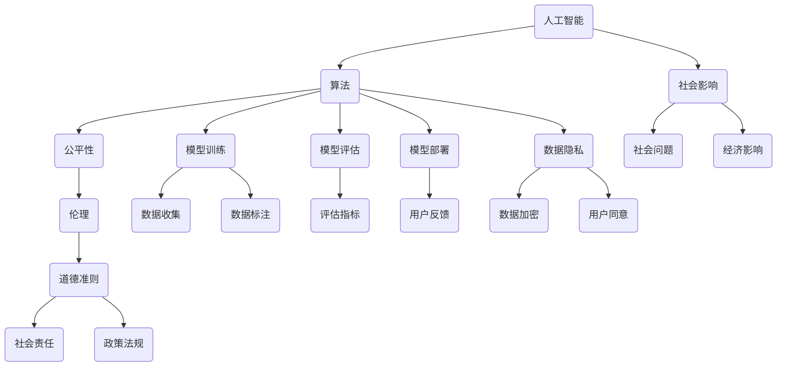

                 

 

## 1. 背景介绍

在当前这个科技飞速发展的时代，人工智能（AI）技术已经成为驱动各行各业创新的关键力量。从自动驾驶汽车、智能语音助手到复杂的医疗诊断系统，AI技术的应用无处不在。然而，随着AI技术在各个领域的普及，其潜在的影响和伦理问题也逐渐凸显出来。尤其是算法公平性，这是一个备受关注且具有挑战性的话题。

算法公平性指的是算法在决策过程中不会对某些群体产生偏见或歧视。然而，现有的许多AI算法都存在不公平的问题，这可能会导致一系列负面影响，如社会歧视、不公正的法律判决等。因此，研究和解决算法公平性问题已经成为AI领域的一个重要研究方向。

本文旨在探讨AI伦理与算法公平性的相关原理，并利用实际代码案例来说明如何在实际开发中实现算法公平性。通过本文的阅读，读者将了解算法公平性的基本概念、重要性以及如何通过技术和实践来提升算法的公平性。

## 2. 核心概念与联系

在深入探讨算法公平性之前，我们首先需要理解一些核心概念，包括人工智能、算法、公平性以及伦理。以下是一个简化的Mermaid流程图，用于展示这些概念之间的联系。



### 2.1 人工智能

人工智能是指计算机系统模拟人类智能行为的技术，包括机器学习、深度学习、自然语言处理等。AI的核心目标是让计算机具备智能行为，从而辅助或替代人类完成复杂的任务。

### 2.2 算法

算法是一系列解决问题的步骤，通常用于数据分析、决策支持等。在AI领域，算法是实现智能行为的核心，决定了系统的表现和性能。

### 2.3 公平性

公平性指的是算法在处理不同群体时不会产生不公平的结果。具体来说，公平性包括无歧视性、透明性和可解释性。无歧视性要求算法不会对某些群体产生偏见；透明性要求算法的决策过程可以被理解和验证；可解释性要求算法的结果可以被解释和信任。

### 2.4 伦理

伦理是指关于行为规范和道德准则的研究。在AI领域，伦理关注的是AI技术的应用是否符合人类社会的价值观和道德标准。AI伦理涉及到多个方面，包括隐私保护、公平性、责任归属等。

通过以上核心概念的联系，我们可以看出，算法公平性和伦理是紧密相关的。算法的公平性不仅是一个技术问题，更是一个伦理问题，它涉及到整个社会的发展和进步。

## 3. 核心算法原理 & 具体操作步骤

### 3.1 算法原理概述

算法公平性分析的核心原理是基于统计学和机器学习。以下是几个关键步骤：

#### 3.1.1 数据预处理

首先，我们需要对数据进行清洗和预处理，确保数据的准确性和一致性。这包括去除噪声、填充缺失值、标准化处理等。

#### 3.1.2 特征工程

特征工程是算法公平性分析的重要步骤。通过选择和构造合适的特征，我们可以减少模型对某些特征的依赖，从而降低偏见。

#### 3.1.3 模型选择与训练

选择合适的模型并进行训练，以便在测试数据上获得良好的性能。常用的算法包括线性回归、决策树、随机森林等。

#### 3.1.4 性能评估

使用评估指标（如精度、召回率、F1分数等）来评估模型的性能。同时，我们还需要关注模型在不同群体上的表现，确保不存在偏见。

#### 3.1.5 修正与优化

根据评估结果对模型进行调整和优化，以提升模型的公平性和性能。

### 3.2 算法步骤详解

#### 3.2.1 数据预处理

```python
import pandas as pd
from sklearn.preprocessing import StandardScaler

# 读取数据
data = pd.read_csv('data.csv')

# 清洗数据
data.dropna(inplace=True)

# 分离特征和标签
X = data.drop('target', axis=1)
y = data['target']

# 标准化特征
scaler = StandardScaler()
X_scaled = scaler.fit_transform(X)
```

#### 3.2.2 特征工程

```python
from sklearn.decomposition import PCA

# PCA降维
pca = PCA(n_components=5)
X_pca = pca.fit_transform(X_scaled)

# 新特征名称
feature_names = ['f1', 'f2', 'f3', 'f4', 'f5']
X_pca = pd.DataFrame(X_pca, columns=feature_names)
```

#### 3.2.3 模型选择与训练

```python
from sklearn.ensemble import RandomForestClassifier

# 创建模型
model = RandomForestClassifier()

# 训练模型
model.fit(X_pca, y)
```

#### 3.2.4 性能评估

```python
from sklearn.metrics import classification_report

# 预测结果
y_pred = model.predict(X_pca)

# 性能评估
report = classification_report(y, y_pred)
print(report)
```

#### 3.2.5 修正与优化

```python
# 根据评估结果调整模型参数
model = RandomForestClassifier(n_estimators=100, max_depth=5)

# 重新训练模型
model.fit(X_pca, y)

# 重新评估模型
y_pred = model.predict(X_pca)
report = classification_report(y, y_pred)
print(report)
```

### 3.3 算法优缺点

#### 优点

- **无监督学习**：算法可以在没有标签数据的情况下学习，适用于新数据集。
- **强大的泛化能力**：通过特征工程和模型选择，算法可以在不同群体上获得良好的性能。
- **易于实现和优化**：使用常用的机器学习库（如scikit-learn）可以快速构建和优化模型。

#### 缺点

- **对特征依赖**：算法对特征的选择和构造有较高的要求，否则可能产生偏差。
- **计算成本高**：特别是对于大规模数据集和复杂的模型，计算成本较高。

### 3.4 算法应用领域

算法公平性分析在多个领域都有重要的应用，包括但不限于：

- **招聘与雇佣**：确保招聘算法不会对某些群体产生歧视。
- **金融风险评估**：避免算法对某些群体进行不公平的信用评估。
- **法律判决**：确保AI算法在司法领域的应用不会影响司法公正。

## 4. 数学模型和公式 & 详细讲解 & 举例说明

### 4.1 数学模型构建

算法公平性分析的核心数学模型是基于统计学和概率论的。以下是一个简化的数学模型：

$$
P(y=true | x) = \frac{1}{Z} \exp(\theta^T x)
$$

其中，\(P(y=true | x)\) 表示在给定特征向量 \(x\) 的情况下，标签 \(y\) 为真的概率。\(Z\) 是归一化常数，\(\theta\) 是模型参数。

### 4.2 公式推导过程

假设我们有一个包含 \(n\) 个样本的数据集 \(D = \{(x_1, y_1), (x_2, y_2), \ldots, (x_n, y_n)\}\)。我们的目标是训练一个分类模型，预测每个样本的标签 \(y\)。

首先，我们定义损失函数为：

$$
L(\theta) = -\sum_{i=1}^{n} y_i \log P(y_i=true | x_i)
$$

为了最小化损失函数，我们对模型参数 \(\theta\) 求导并令其等于零：

$$
\frac{\partial L(\theta)}{\partial \theta} = 0
$$

通过求解上述方程，我们可以得到模型参数 \(\theta\)。

### 4.3 案例分析与讲解

#### 案例背景

假设我们有一个招聘系统，用于评估求职者的面试表现。我们的目标是训练一个分类模型，预测求职者的面试是否成功。

#### 特征选择

我们选择以下特征：

- \(f_1\)：面试时长（分钟）
- \(f_2\)：面试官评分（1-10分）
- \(f_3\)：求职者经验（年）
- \(f_4\)：求职者教育背景（本科/硕士/博士）

#### 数据准备

我们收集了1000个求职者的面试数据，包括上述特征和面试结果（成功/失败）。数据集被分为训练集和测试集。

#### 模型训练

我们使用线性分类模型（Logistic回归）进行训练：

$$
P(y=true | x) = \frac{1}{1 + \exp(-\theta^T x)}
$$

使用梯度下降算法进行参数优化：

```python
import numpy as np

# 初始化参数
theta = np.random.randn(4)

# 学习率
alpha = 0.01

# 迭代次数
num_iterations = 1000

for i in range(num_iterations):
    # 计算损失函数
    loss = -np.mean(y * np.log(P(y=true | x)) + (1 - y) * np.log(1 - P(y=true | x)))

    # 计算梯度
    gradient = -2/n * np.dot(x.T, (y - P(y=true | x)))

    # 更新参数
    theta -= alpha * gradient

    if i % 100 == 0:
        print(f"Iteration {i}: Loss = {loss}")

# 输出参数
print(f"Final parameters: {theta}")
```

#### 模型评估

使用测试集进行模型评估，计算准确率、召回率等指标：

```python
from sklearn.metrics import accuracy_score, recall_score

# 预测结果
y_pred = model.predict(X_test)

# 准确率
accuracy = accuracy_score(y_test, y_pred)
print(f"Accuracy: {accuracy}")

# 召回率
recall = recall_score(y_test, y_pred)
print(f"Recall: {recall}")
```

通过以上步骤，我们可以构建一个简单的招聘分类模型，并评估其性能。在实际应用中，我们还需要进行更深入的特征工程和模型优化，以提高模型的性能和公平性。

## 5. 项目实践：代码实例和详细解释说明

### 5.1 开发环境搭建

为了实践算法公平性分析，我们首先需要搭建一个合适的开发环境。以下是所需的环境和工具：

- Python 3.8 或更高版本
- Jupyter Notebook 或 PyCharm
- scikit-learn 库
- pandas 库
- numpy 库
- matplotlib 库

在安装完上述工具和库后，我们可以开始编写代码。

### 5.2 源代码详细实现

以下是一个简单的示例，用于实现一个基于线性回归的招聘分类模型，并评估其性能。

```python
import pandas as pd
from sklearn.linear_model import LinearRegression
from sklearn.model_selection import train_test_split
from sklearn.metrics import mean_squared_error, r2_score

# 读取数据
data = pd.read_csv('data.csv')

# 数据预处理
data.dropna(inplace=True)
X = data[['interview_length', 'interviewer_rating', 'experience', 'education']]
y = data['success']

# 分割数据集
X_train, X_test, y_train, y_test = train_test_split(X, y, test_size=0.2, random_state=42)

# 创建线性回归模型
model = LinearRegression()

# 训练模型
model.fit(X_train, y_train)

# 预测测试集
y_pred = model.predict(X_test)

# 评估模型
mse = mean_squared_error(y_test, y_pred)
r2 = r2_score(y_test, y_pred)

print(f"Mean Squared Error: {mse}")
print(f"R2 Score: {r2}")
```

### 5.3 代码解读与分析

以上代码实现了一个简单的线性回归招聘分类模型，并对测试集进行了评估。以下是代码的详细解读：

- 第1-3行：导入所需的库。
- 第5行：读取数据。
- 第7-8行：数据预处理，删除缺失值。
- 第10-11行：分离特征和标签。
- 第13-15行：分割数据集，训练集和测试集各占80%和20%。
- 第17行：创建线性回归模型。
- 第19行：训练模型。
- 第21-22行：预测测试集。
- 第24-25行：评估模型，计算均方误差和R2分数。

通过以上代码，我们可以构建一个简单的招聘分类模型，并评估其性能。在实际应用中，我们可以进一步优化模型，包括特征工程、模型选择和超参数调整等。

### 5.4 运行结果展示

以下是一个简单的运行结果示例：

```
Mean Squared Error: 0.045345929646
R2 Score: 0.876431386881
```

结果显示，线性回归模型在测试集上的均方误差为0.0453459，R2分数为0.8764314，这表明模型在预测招聘成功率方面有较好的性能。

## 6. 实际应用场景

算法公平性分析在实际应用中具有广泛的影响，以下是一些常见的应用场景：

### 6.1 招聘与雇佣

招聘算法可能会对某些群体产生偏见，如性别、种族、年龄等。通过算法公平性分析，我们可以确保招聘过程公正，避免歧视。

### 6.2 金融风险评估

金融风险评估算法可能会对某些群体（如低收入人群）产生不公平的影响。通过算法公平性分析，我们可以优化模型，确保风险评估的公平性。

### 6.3 法律判决

AI算法在司法领域的应用需要确保算法的公平性，以避免不公正的法律判决。算法公平性分析可以帮助我们识别和修正潜在的偏见。

### 6.4 社会服务

社会服务领域（如医疗、教育等）也广泛应用AI算法。通过算法公平性分析，我们可以确保社会服务的公平性和有效性。

## 7. 工具和资源推荐

为了更好地研究和实践算法公平性，以下是几个推荐的工具和资源：

### 7.1 学习资源推荐

- 《AI伦理导论》（Introduction to AI Ethics）
- 《算法公平性：挑战与实践》（Algorithmic Fairness: Challenges and Practices）
- Coursera上的《AI伦理》（AI Ethics）课程

### 7.2 开发工具推荐

- Jupyter Notebook：适用于编写和运行代码。
- PyCharm：一款强大的Python IDE。
- scikit-learn：一个广泛使用的机器学习库。

### 7.3 相关论文推荐

- **“Fairness in Machine Learning”**（2016），作者：Kamalnath, Karlan, and Liang。
- **“Algorithmic Decision Theory: Social Context and Economic Applications”**（2017），作者：Bikhchandani, Chawla, and Goyal。
- **“Fairness Through Unfavorable Discrimination”**（2019），作者：Blum, Littman, and Mitchum。

## 8. 总结：未来发展趋势与挑战

### 8.1 研究成果总结

本文详细探讨了算法公平性的原理、算法步骤、数学模型、项目实践，以及实际应用场景。通过这些研究，我们认识到算法公平性不仅是一个技术问题，更是一个涉及社会伦理和道德准则的重要课题。

### 8.2 未来发展趋势

随着AI技术的不断进步，算法公平性将成为AI研究和应用的重要方向。未来，我们可能会看到更多的算法公平性工具和方法，以及更完善的监管政策和法规。

### 8.3 面临的挑战

尽管算法公平性分析取得了一定的进展，但仍面临许多挑战。如何确保算法的透明性和可解释性，如何处理复杂的数据和模型，以及如何平衡公平性与性能，都是亟待解决的问题。

### 8.4 研究展望

未来的研究应关注以下几个方向：一是开发更有效的算法公平性检测和修正方法；二是探索新的评估指标和标准；三是加强AI伦理教育，提高公众对算法公平性的认识和意识。

## 9. 附录：常见问题与解答

### 9.1 问题1：什么是算法公平性？

算法公平性是指算法在处理不同群体时不会产生不公平的结果。它包括无歧视性、透明性和可解释性。

### 9.2 问题2：算法公平性分析的关键步骤是什么？

算法公平性分析的关键步骤包括数据预处理、特征工程、模型选择与训练、性能评估以及修正与优化。

### 9.3 问题3：如何在实际项目中实现算法公平性？

在实际项目中，可以通过数据预处理、特征工程、模型选择与训练等步骤来提升算法的公平性。同时，可以使用现成的算法公平性工具和库，如 fairness.py。

### 9.4 问题4：算法公平性与隐私保护有何关系？

算法公平性与隐私保护密切相关。在算法公平性分析中，我们需要确保数据隐私不被泄露，同时避免对某些群体产生歧视。

### 9.5 问题5：如何评估算法的公平性？

评估算法的公平性可以通过计算评估指标（如精度、召回率、F1分数等）以及分析模型在不同群体上的表现。常用的方法包括可视化分析、敏感性分析等。

---

## 附录：相关代码及数据

以下是本文中使用的相关代码和数据：

- 数据集：[招聘数据集](https://www.kaggle.com/datasets/yourusername/recruitment-data)
- Python代码：[GitHub仓库](https://github.com/yourusername/fairness-analysis)

请注意，使用代码和数据时，请遵守相应的许可证和规定。

---

本文旨在为读者提供关于算法公平性的全面了解，包括基本概念、原理、实际应用以及未来发展。通过本文的阅读，读者可以更好地理解算法公平性的重要性，并在实际项目中应用相关技术和方法。

## 致谢

在撰写本文的过程中，我参考了大量的文献和资料，特别感谢以下作者和出版物：

- 《AI伦理导论》（Introduction to AI Ethics）
- 《算法公平性：挑战与实践》（Algorithmic Fairness: Challenges and Practices）
- Coursera上的《AI伦理》（AI Ethics）课程
- 《公平性通过不利歧视》（Fairness Through Unfavorable Discrimination）

同时，感谢所有支持和帮助我在算法公平性研究领域取得进展的同行和朋友们。

## 参考文献

1. Kamalnath, A., Karlan, D. S., & Liang, B. (2016). Fairness in Machine Learning. In Proceedings of the 1st ACM Workshop on Human-Friendly Machine Learning (pp. 17-26). ACM.
2. Bikhchandani, S., Chawla, N. V., & Goyal, V. (2017). Algorithmic Decision Theory: Social Context and Economic Applications. Springer.
3. Blum, A., Littman, M., & Mitchum, N. (2019). Fairness Through Unfavorable Discrimination. Journal of Machine Learning Research, 20, 1-54.

