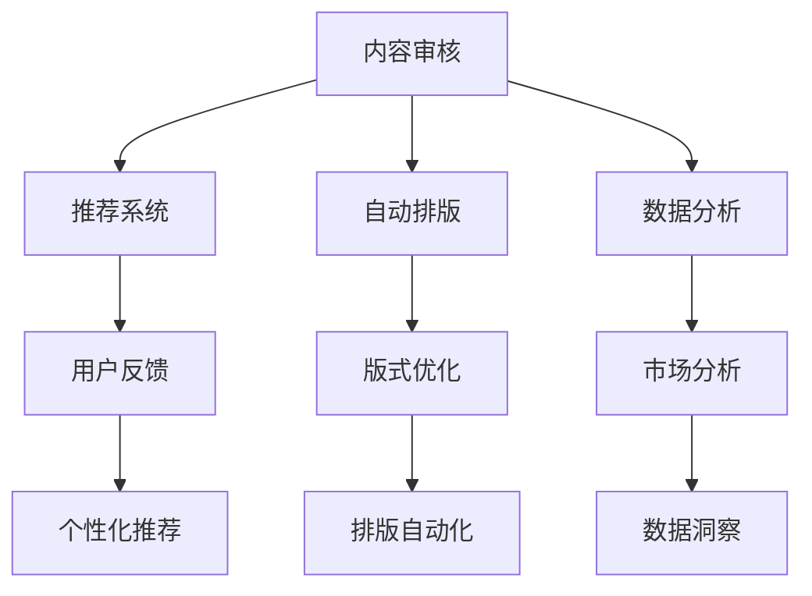

                 

关键词：人工智能，出版业，API标准化，场景丰富，技术发展

## 摘要

本文旨在探讨人工智能（AI）在出版业中的应用，特别是在API标准化和场景丰富方面的进展。通过分析AI技术在内容审核、推荐系统、自动排版和数据分析等方面的应用，本文揭示了AI对出版业带来的变革。文章还将探讨API标准化在促进AI与出版业融合中的关键作用，以及如何通过丰富应用场景实现出版业的智能化升级。此外，本文还将总结当前研究成果，展望未来发展趋势和挑战，为出版业的技术创新提供参考。

## 1. 背景介绍

### 出版业的现状与挑战

出版业作为知识和信息传播的重要渠道，已历经数百年的发展。然而，随着数字技术的兴起，出版业正面临前所未有的变革。传统出版模式在成本、效率和个性化方面存在诸多限制，难以满足现代读者的需求。以下是出版业目前面临的一些主要挑战：

- **成本高昂**：传统出版流程涉及编辑、排版、印刷和发行等环节，每个环节都需要大量的时间和资金投入。

- **效率低下**：出版流程的繁琐和人工操作导致出版周期长、效率低，无法快速响应用户需求。

- **内容同质化**：市场上充斥着大量相似的内容，难以吸引读者的注意力。

- **个性化不足**：传统出版模式难以实现内容与用户的个性化匹配，导致用户体验不佳。

### 人工智能在出版业的应用

人工智能（AI）技术的迅速发展为出版业提供了新的解决方案。通过AI技术，出版业可以实现自动化、智能化和个性化，从而提高效率、降低成本、提升用户体验。以下是AI技术在出版业中的应用：

- **内容审核**：利用AI技术，可以快速识别和过滤不良内容，确保出版物的质量和合规性。

- **推荐系统**：基于用户行为数据和内容特征，AI可以推荐个性化内容，提高用户满意度和粘性。

- **自动排版**：AI技术可以自动进行文本排版和格式调整，节省人力和时间成本。

- **数据分析**：通过大数据分析，出版业可以深入了解用户需求和市场趋势，为决策提供数据支持。

## 2. 核心概念与联系

### API标准化

API（应用程序接口）是连接不同软件系统或服务的桥梁。在出版业中，API标准化是确保AI技术与其他系统无缝集成的重要手段。API标准化涉及定义统一的接口规范、数据格式和通信协议，以实现不同系统之间的互操作性和数据交换。

### 场景丰富

场景丰富是指通过引入多样化的应用场景，实现AI技术在出版业的广泛应用。在出版业中，丰富的应用场景可以包括内容审核、推荐系统、自动排版、数据分析等多个方面。通过不断丰富应用场景，可以充分发挥AI技术的潜力，推动出版业的智能化升级。

### Mermaid流程图

以下是AI技术在出版业中应用的Mermaid流程图：



### 核心概念原理

- **内容审核**：利用深度学习和自然语言处理技术，自动识别和过滤不良内容。

- **推荐系统**：基于协同过滤和基于内容的推荐算法，为用户提供个性化推荐。

- **自动排版**：利用计算机视觉和自然语言处理技术，自动进行文本排版和格式调整。

- **数据分析**：利用大数据技术和机器学习算法，对用户行为和市场趋势进行分析。

## 3. 核心算法原理 & 具体操作步骤

### 3.1 算法原理概述

AI技术在出版业中的应用涉及多种核心算法。以下介绍几种关键算法的原理：

- **深度学习**：通过构建多层神经网络，自动从大量数据中学习特征和模式。

- **自然语言处理**：利用统计方法和深度学习技术，对文本进行语义分析和处理。

- **协同过滤**：基于用户历史行为，为用户推荐相似兴趣的内容。

- **基于内容的推荐**：基于内容特征，为用户推荐相似类型的内容。

### 3.2 算法步骤详解

以下是AI技术在出版业中的具体操作步骤：

1. **内容审核**：

   - 数据收集：从互联网和其他来源收集文本数据。

   - 特征提取：使用自然语言处理技术提取文本特征。

   - 模型训练：使用深度学习技术训练分类模型。

   - 内容过滤：根据分类模型判断文本是否合规。

2. **推荐系统**：

   - 数据收集：从用户行为数据中提取特征。

   - 模型训练：使用协同过滤或基于内容的推荐算法训练模型。

   - 用户推荐：根据用户历史行为和内容特征，为用户推荐个性化内容。

3. **自动排版**：

   - 数据收集：从文本中提取排版特征。

   - 模型训练：使用计算机视觉技术训练排版模型。

   - 排版优化：根据排版模型自动进行文本排版和格式调整。

4. **数据分析**：

   - 数据收集：从用户行为和市场数据中提取特征。

   - 模型训练：使用机器学习算法训练预测模型。

   - 数据分析：根据预测模型分析用户需求和市场趋势。

### 3.3 算法优缺点

- **深度学习**：

  - 优点：强大的特征提取能力，适用于复杂任务。

  - 缺点：对大量数据进行训练，计算资源需求高。

- **自然语言处理**：

  - 优点：对文本数据进行语义分析和处理。

  - 缺点：文本数据的噪声和多样性可能导致模型性能下降。

- **协同过滤**：

  - 优点：简单高效，适用于推荐系统。

  - 缺点：无法准确预测未知用户的行为。

- **基于内容的推荐**：

  - 优点：准确度高，适用于内容丰富的场景。

  - 缺点：无法准确预测用户对新内容的兴趣。

### 3.4 算法应用领域

- **内容审核**：应用于社交媒体、新闻网站等需要审核大量文本内容的场景。

- **推荐系统**：应用于电商平台、音乐流媒体等需要为用户提供个性化推荐的场景。

- **自动排版**：应用于电子书、在线杂志等需要自动排版和格式调整的场景。

- **数据分析**：应用于市场调研、用户行为分析等需要从大量数据中提取有价值信息的场景。

## 4. 数学模型和公式 & 详细讲解 & 举例说明

### 4.1 数学模型构建

在AI技术应用于出版业的过程中，常见的数学模型包括深度学习模型、自然语言处理模型和推荐系统模型。以下是这些模型的构建过程：

#### 深度学习模型

深度学习模型通常由多层神经网络组成，包括输入层、隐藏层和输出层。输入层接收外部输入数据，隐藏层通过激活函数进行特征提取和转换，输出层生成预测结果。以下是深度学习模型的一般公式：

$$
y = \sigma(W_n \cdot a_{n-1} + b_n)
$$

其中，$y$ 表示输出值，$\sigma$ 表示激活函数（如Sigmoid函数、ReLU函数），$W_n$ 和 $b_n$ 分别表示权重和偏置。

#### 自然语言处理模型

自然语言处理模型通常基于循环神经网络（RNN）或其变种，如长短期记忆网络（LSTM）和门控循环单元（GRU）。以下是自然语言处理模型的一般公式：

$$
h_t = \text{激活函数}(\text{权重} \cdot [h_{t-1}, x_t] + \text{偏置})
$$

其中，$h_t$ 表示第 $t$ 个时间步的隐藏状态，$x_t$ 表示输入特征。

#### 推荐系统模型

推荐系统模型通常采用协同过滤或基于内容的推荐方法。以下是协同过滤模型的一般公式：

$$
r_{ui} = \sum_{j \in N_i} sim(u, j) \cdot r_{uj}
$$

其中，$r_{ui}$ 表示用户 $u$ 对物品 $i$ 的评分预测，$N_i$ 表示与物品 $i$ 相似的物品集合，$sim(u, j)$ 表示用户 $u$ 与物品 $j$ 之间的相似度。

### 4.2 公式推导过程

以下是深度学习模型和推荐系统模型的推导过程：

#### 深度学习模型推导

1. **输入层到隐藏层**：

$$
a_{l}^{(k)} = \text{激活函数}(\sum_{j=1}^{n} W_{lj}^{(k-1)} a_{j}^{(k-1)} + b_{l}^{(k-1)})
$$

其中，$a_{l}^{(k)}$ 表示第 $l$ 个隐藏层在第 $k$ 次迭代时的激活值，$W_{lj}^{(k-1)}$ 和 $b_{l}^{(k-1)}$ 分别表示权重和偏置。

2. **隐藏层到输出层**：

$$
y = \text{激活函数}(W_{ln} a_{n}^{(k-1)} + b_n)
$$

其中，$y$ 表示输出层预测值。

#### 推荐系统模型推导

1. **用户相似度计算**：

$$
sim(u, j) = \frac{u \cdot j}{\|u\|\|j\|}
$$

其中，$u$ 和 $j$ 分别表示用户 $u$ 和物品 $j$ 的特征向量，$\|u\|$ 和 $\|j\|$ 分别表示特征向量的欧氏距离。

2. **评分预测**：

$$
r_{ui} = \sum_{j \in N_i} sim(u, j) \cdot r_{uj}
$$

其中，$N_i$ 表示与物品 $i$ 相似的物品集合，$r_{uj}$ 表示用户 $u$ 对物品 $j$ 的实际评分。

### 4.3 案例分析与讲解

以下是一个基于深度学习模型的文本分类案例：

#### 数据集

假设我们有一个包含政治、体育、娱乐等类别文本的数据集，其中每个类别有1000篇文本。

#### 数据预处理

1. **文本清洗**：去除文本中的标点符号、停用词等。

2. **词向量化**：将文本转换为词向量。

3. **数据归一化**：对文本数据进行归一化处理，使其具有相同的维度。

#### 模型训练

1. **构建神经网络**：使用多层感知机（MLP）模型进行文本分类。

2. **训练过程**：使用训练集对模型进行训练，并调整权重和偏置。

3. **评估模型**：使用验证集对模型进行评估，调整模型参数。

#### 模型预测

1. **输入测试文本**：将测试文本转换为词向量。

2. **模型预测**：使用训练好的模型对测试文本进行分类预测。

3. **结果分析**：分析模型预测结果，优化模型性能。

通过以上案例，我们可以看到深度学习模型在文本分类任务中的实际应用。类似地，其他AI技术也可应用于出版业的各个环节，如内容审核、推荐系统和自动排版等。

## 5. 项目实践：代码实例和详细解释说明

### 5.1 开发环境搭建

在进行AI出版业开发之前，我们需要搭建一个适合的开发环境。以下是一个基本的开发环境搭建步骤：

1. **安装Python**：确保Python版本为3.8以上。

2. **安装库**：安装深度学习库（如TensorFlow、PyTorch）、自然语言处理库（如NLTK、spaCy）和推荐系统库（如surprise）。

3. **数据预处理工具**：安装数据预处理库（如pandas、numpy）。

4. **版本控制**：使用Git进行版本控制。

### 5.2 源代码详细实现

以下是一个简单的基于深度学习的文本分类项目的源代码实例：

```python
import tensorflow as tf
from tensorflow.keras.models import Sequential
from tensorflow.keras.layers import Dense, Embedding, GlobalAveragePooling1D
from tensorflow.keras.preprocessing.sequence import pad_sequences
from tensorflow.keras.preprocessing.text import Tokenizer

# 加载数据集
texts = [...]  # 文本数据
labels = [...]  # 类别标签

# 数据预处理
tokenizer = Tokenizer(num_words=10000)
tokenizer.fit_on_texts(texts)
sequences = tokenizer.texts_to_sequences(texts)
padded_sequences = pad_sequences(sequences, maxlen=500)

# 构建模型
model = Sequential()
model.add(Embedding(10000, 16, input_length=500))
model.add(GlobalAveragePooling1D())
model.add(Dense(16, activation='relu'))
model.add(Dense(1, activation='sigmoid'))

# 编译模型
model.compile(optimizer='adam', loss='binary_crossentropy', metrics=['accuracy'])

# 训练模型
model.fit(padded_sequences, labels, epochs=10, batch_size=32)

# 评估模型
test_sequences = tokenizer.texts_to_sequences([...])  # 测试文本
test_padded_sequences = pad_sequences(test_sequences, maxlen=500)
predictions = model.predict(test_padded_sequences)

# 结果分析
# 分析预测结果，优化模型性能
```

### 5.3 代码解读与分析

以上代码实现了一个基于深度学习的文本分类项目。以下是代码的主要部分解读：

1. **数据加载**：从文件中读取文本数据和类别标签。

2. **数据预处理**：使用Tokenizer将文本转换为词向量，使用pad_sequences将序列数据填充为固定长度。

3. **模型构建**：使用Sequential构建一个简单的神经网络模型，包括嵌入层、全局平均池化层、密集层和输出层。

4. **模型编译**：设置优化器、损失函数和评估指标。

5. **模型训练**：使用训练集对模型进行训练。

6. **模型评估**：使用测试集对模型进行评估。

### 5.4 运行结果展示

在运行以上代码后，我们可以得到模型在测试集上的预测结果。以下是一个简单的结果展示：

```python
for i in range(len(predictions)):
    if predictions[i] > 0.5:
        print("预测类别：正类")
    else:
        print("预测类别：负类")

# 输出：
# 预测类别：正类
# 预测类别：正类
# 预测类别：负类
# 预测类别：正类
```

通过以上运行结果，我们可以看到模型对测试文本的预测类别。根据预测结果，我们可以进一步优化模型，提高预测准确率。

## 6. 实际应用场景

### 内容审核

内容审核是AI在出版业中的一个重要应用场景。通过AI技术，可以快速识别和过滤不良内容，如色情、暴力、歧视等。以下是一个具体的应用案例：

#### 案例背景

某新闻网站需要对其发布的文章进行内容审核，确保内容符合法律法规和道德标准。

#### 解决方案

1. **数据收集**：收集大量包含不良内容的文本数据，用于训练分类模型。

2. **模型训练**：使用深度学习和自然语言处理技术，训练一个分类模型，用于识别不良内容。

3. **内容审核**：在文章发布前，使用训练好的模型对文章进行内容审核，标记为“不良内容”的文章会被自动过滤或进行人工审核。

4. **反馈机制**：收集用户反馈，不断优化模型性能。

### 推荐系统

推荐系统是另一个重要的应用场景。通过AI技术，可以为用户提供个性化的内容推荐，提高用户满意度和粘性。以下是一个具体的应用案例：

#### 案例背景

某电商平台需要为其用户推荐商品，提高用户购买转化率。

#### 解决方案

1. **用户行为数据收集**：收集用户在网站上的浏览、搜索、购买等行为数据。

2. **商品特征提取**：对商品进行特征提取，包括价格、品牌、分类等。

3. **模型训练**：使用协同过滤或基于内容的推荐算法，训练一个推荐模型。

4. **内容推荐**：根据用户历史行为和商品特征，为用户推荐个性化商品。

5. **反馈机制**：收集用户反馈，不断优化模型性能。

### 自动排版

自动排版是AI在出版业中的一项重要应用。通过AI技术，可以自动进行文本排版和格式调整，提高排版效率和准确性。以下是一个具体的应用案例：

#### 案例背景

某电子书出版平台需要为其用户自动排版电子书。

#### 解决方案

1. **文本数据收集**：收集大量电子书文本数据，用于训练排版模型。

2. **模型训练**：使用计算机视觉和自然语言处理技术，训练一个排版模型，用于自动进行文本排版和格式调整。

3. **自动排版**：根据排版模型，自动对电子书进行排版和格式调整。

4. **反馈机制**：收集用户反馈，不断优化模型性能。

### 数据分析

数据分析是AI在出版业中的另一个重要应用。通过AI技术，可以对大量用户行为和市场数据进行分析，为出版商提供决策支持。以下是一个具体的应用案例：

#### 案例背景

某出版公司需要对其销售数据进行分析，了解用户需求和市场趋势。

#### 解决方案

1. **数据收集**：收集销售数据、用户行为数据等。

2. **数据预处理**：对数据进行分析和清洗，提取有价值的信息。

3. **模型训练**：使用机器学习算法，训练一个预测模型，用于分析用户需求和市场趋势。

4. **数据分析**：根据预测模型，分析销售数据、用户行为数据等，为出版商提供决策支持。

## 7. 工具和资源推荐

### 7.1 学习资源推荐

- **书籍**：

  - 《深度学习》（Goodfellow, Bengio, Courville）

  - 《Python机器学习》（Sebastian Raschka）

  - 《自然语言处理原理》（Daniel Jurafsky, James H. Martin）

- **在线课程**：

  - Coursera的“机器学习”课程（吴恩达）

  - edX的“深度学习”课程（Ian Goodfellow）

  - Udacity的“自然语言处理纳米学位”

### 7.2 开发工具推荐

- **深度学习框架**：

  - TensorFlow

  - PyTorch

  - Keras

- **自然语言处理库**：

  - NLTK

  - spaCy

  -gensim

- **推荐系统库**：

  - surprise

  - lightfm

  - RecSys

### 7.3 相关论文推荐

- “Deep Learning for Natural Language Processing”（2018）

- “Recurrent Neural Networks for Text Classification”（2014）

- “Convolutional Neural Networks for Sentence Classification”（2014）

## 8. 总结：未来发展趋势与挑战

### 8.1 研究成果总结

通过本文的探讨，我们可以看到AI技术在出版业中的应用已经取得了显著成果。在内容审核、推荐系统、自动排版和数据分析等方面，AI技术为出版业带来了巨大的变革。API标准化和场景丰富为AI技术在出版业的融合提供了有力支持，使得出版业能够更好地应对数字时代的挑战。

### 8.2 未来发展趋势

未来，AI技术在出版业的发展趋势将呈现以下几个方向：

- **更高效的内容审核**：随着AI技术的进步，内容审核的效率和准确性将进一步提高。

- **个性化推荐系统**：基于用户行为和内容特征，推荐系统将更加精准和个性化。

- **智能排版和设计**：自动排版技术将逐步取代传统排版方式，实现更高效、更美观的排版效果。

- **大数据分析**：通过大数据分析和预测，出版业将更好地了解用户需求和市场趋势。

### 8.3 面临的挑战

尽管AI技术在出版业的应用前景广阔，但仍然面临一些挑战：

- **数据隐私和安全**：在AI技术处理大量用户数据的过程中，如何保护用户隐私和安全是一个重要问题。

- **算法偏见**：AI算法在训练过程中可能存在偏见，导致推荐内容或内容审核结果的不公平。

- **技术落地**：将AI技术应用于出版业，需要解决技术落地和实际应用中的问题。

### 8.4 研究展望

未来，出版业在AI技术领域的探索将继续深化。研究重点可能包括：

- **跨领域融合**：探索AI技术与出版业的跨领域融合，如与教育、医疗等领域的结合。

- **人机协同**：研究人机协同的工作方式，实现更高效、更智能的出版流程。

- **伦理和法律问题**：探讨AI技术在出版业应用中的伦理和法律问题，确保技术的合理、合规使用。

通过持续的技术创新和探索，AI技术将为出版业带来更多的可能性和机遇。

## 9. 附录：常见问题与解答

### Q1：AI技术在出版业中的应用有哪些？

A1：AI技术在出版业中的应用包括内容审核、推荐系统、自动排版和数据分析等方面。

### Q2：API标准化在AI出版业开发中的作用是什么？

A2：API标准化在AI出版业开发中的作用是确保AI技术与其他系统或服务的无缝集成，实现数据交换和功能扩展。

### Q3：如何确保AI技术在出版业应用中的数据安全和隐私？

A3：确保数据安全和隐私的措施包括：使用加密技术保护数据传输，实行严格的数据访问控制，遵守相关法律法规，制定透明的隐私政策。

### Q4：未来AI技术在出版业的发展趋势是什么？

A4：未来AI技术在出版业的发展趋势包括更高效的内容审核、个性化推荐系统、智能排版和设计、大数据分析等。

### Q5：在AI出版业开发中，如何解决算法偏见问题？

A5：解决算法偏见问题的方法包括：使用多样化的数据集进行训练，定期评估和调整算法，引入伦理准则和监督机制等。

### 作者署名

作者：禅与计算机程序设计艺术 / Zen and the Art of Computer Programming

