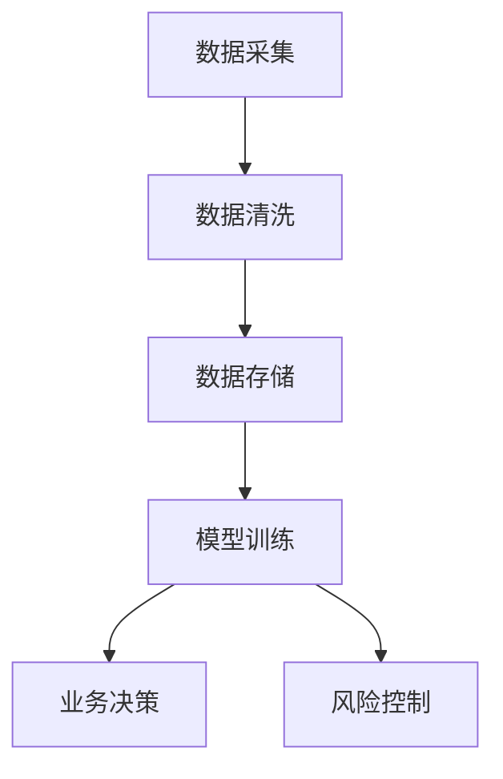

                 

关键词：AI创业，数据积累，应用场景，算法原理，数学模型，实践案例，未来展望

> 摘要：本文将探讨AI创业中的数据积累与应用，分析数据在AI创业过程中的重要性，介绍核心算法原理、数学模型，以及项目实践中的代码实例。文章还将探讨数据在AI创业中的实际应用场景，以及未来发展的趋势和挑战。

## 1. 背景介绍

近年来，人工智能（AI）技术的快速发展推动了各行各业的变革，AI创业成为了投资热点。然而，AI创业的成功与否很大程度上取决于数据积累与应用的能力。数据不仅是AI模型的训练素材，也是业务决策的依据。因此，如何有效地积累和应用数据成为了AI创业的关键。

在AI创业的过程中，数据积累与应用面临着诸多挑战。首先，数据的质量和多样性直接影响AI模型的性能和可靠性。其次，如何从海量数据中提取有价值的信息，实现数据的深度挖掘和分析，也是一个技术难题。此外，数据的安全性和隐私保护也是AI创业需要重点关注的问题。

本文将围绕AI创业中的数据积累与应用展开讨论，旨在为读者提供一份全面的技术指南。

## 2. 核心概念与联系

### 2.1 数据积累

数据积累是指通过多种途径收集和存储数据的过程。在AI创业中，数据积累是基础环节，主要包括以下几个方面：

- **数据采集**：通过各种传感器、网络爬虫、API接口等手段获取原始数据。
- **数据清洗**：对采集到的原始数据进行处理，去除噪声和异常值，提高数据质量。
- **数据存储**：将处理后的数据存储在数据库或数据湖中，便于后续分析和挖掘。

### 2.2 数据应用

数据应用是指将积累的数据用于业务决策、产品优化、风险控制等环节。在AI创业中，数据应用主要包括以下几个方面：

- **模型训练**：使用积累的数据训练AI模型，提高模型在特定任务上的表现。
- **业务决策**：基于数据分析结果，为企业提供业务指导，优化产品和服务。
- **风险控制**：通过数据监控和预警，降低业务风险。

### 2.3 数据积累与数据应用的 Mermaid 流程图



## 3. 核心算法原理 & 具体操作步骤

### 3.1 算法原理概述

在AI创业中，常用的核心算法包括深度学习、自然语言处理、推荐系统等。以下是这些算法的基本原理概述：

- **深度学习**：通过构建多层神经网络，对数据进行特征提取和模式识别。
- **自然语言处理**：利用统计模型和深度学习模型，对文本数据进行语义分析和信息提取。
- **推荐系统**：基于用户行为和内容信息，为用户推荐感兴趣的内容或商品。

### 3.2 算法步骤详解

以下是这些算法的具体操作步骤：

#### 深度学习

1. 数据预处理：对采集到的数据（如图像、文本、音频等）进行预处理，包括归一化、标准化等操作。
2. 构建模型：设计神经网络结构，包括输入层、隐藏层和输出层。
3. 训练模型：使用预处理后的数据训练模型，通过反向传播算法不断优化模型参数。
4. 验证模型：使用验证集评估模型性能，调整模型结构和参数。
5. 部署模型：将训练好的模型部署到生产环境，进行实时预测。

#### 自然语言处理

1. 数据预处理：对文本数据进行分词、词性标注等操作，将文本转化为向量表示。
2. 构建模型：设计文本分类、情感分析、机器翻译等任务所需的模型结构。
3. 训练模型：使用预处理的文本数据训练模型，通过优化算法调整模型参数。
4. 验证模型：使用验证集评估模型性能，调整模型结构和参数。
5. 部署模型：将训练好的模型部署到生产环境，进行实时文本处理。

#### 推荐系统

1. 用户行为数据收集：收集用户在平台上的行为数据，如浏览、点击、购买等。
2. 商品信息收集：收集商品的信息，如品类、价格、评分等。
3. 构建模型：设计基于协同过滤、矩阵分解等算法的推荐模型。
4. 训练模型：使用用户行为数据和商品信息训练模型，通过优化算法调整模型参数。
5. 验证模型：使用测试集评估模型性能，调整模型结构和参数。
6. 部署模型：将训练好的模型部署到生产环境，为用户推荐商品。

### 3.3 算法优缺点

#### 深度学习

优点：能够自动提取抽象的特征，适用于复杂数据的建模任务。

缺点：对数据量有较高要求，模型训练时间较长。

#### 自然语言处理

优点：能够处理结构化的文本数据，提取语义信息。

缺点：对语言理解能力要求高，模型训练难度大。

#### 推荐系统

优点：能够为用户提供个性化的推荐，提高用户满意度。

缺点：推荐结果容易陷入“过滤泡沫”，用户难以发现新的内容。

### 3.4 算法应用领域

#### 深度学习

应用领域：计算机视觉、语音识别、自然语言处理等。

#### 自然语言处理

应用领域：文本分类、情感分析、机器翻译、信息提取等。

#### 推荐系统

应用领域：电子商务、社交媒体、新闻推荐等。

## 4. 数学模型和公式 & 详细讲解 & 举例说明

### 4.1 数学模型构建

在AI创业中，常用的数学模型包括线性回归、逻辑回归、决策树、支持向量机等。以下是这些模型的构建过程：

#### 线性回归

线性回归模型表示为：

$$
y = \beta_0 + \beta_1x_1 + \beta_2x_2 + ... + \beta_nx_n
$$

其中，$y$ 是因变量，$x_1, x_2, ..., x_n$ 是自变量，$\beta_0, \beta_1, \beta_2, ..., \beta_n$ 是模型参数。

#### 逻辑回归

逻辑回归模型表示为：

$$
\ln(\frac{p}{1-p}) = \beta_0 + \beta_1x_1 + \beta_2x_2 + ... + \beta_nx_n
$$

其中，$p$ 是因变量的概率分布，$\beta_0, \beta_1, \beta_2, ..., \beta_n$ 是模型参数。

#### 决策树

决策树模型表示为：

$$
T = \{t_1, t_2, ..., t_n\}
$$

其中，$t_1, t_2, ..., t_n$ 是决策树中的节点，每个节点表示一个条件。

#### 支持向量机

支持向量机模型表示为：

$$
w \cdot x + b = 0
$$

其中，$w$ 是模型参数，$x$ 是输入向量，$b$ 是偏置。

### 4.2 公式推导过程

以下是线性回归模型的公式推导过程：

首先，我们定义损失函数为：

$$
L(\beta_0, \beta_1, ..., \beta_n) = \sum_{i=1}^{n}(y_i - (\beta_0 + \beta_1x_{i1} + \beta_2x_{i2} + ... + \beta_nx_{in})^2
$$

为了求损失函数的最小值，我们对损失函数关于 $\beta_0, \beta_1, ..., \beta_n$ 求导，并令导数为零：

$$
\frac{\partial L}{\partial \beta_0} = 0, \frac{\partial L}{\partial \beta_1} = 0, ..., \frac{\partial L}{\partial \beta_n} = 0
$$

通过求解上述方程组，可以得到模型参数 $\beta_0, \beta_1, ..., \beta_n$ 的最优解。

### 4.3 案例分析与讲解

以下是一个线性回归模型的案例：

假设我们要预测房价，已知房屋的面积（$x$）和房价（$y$）数据如下：

| 面积（平方米） | 房价（万元） |
| :----: | :----: |
| 100 | 300 |
| 120 | 360 |
| 140 | 420 |
| 160 | 480 |
| 180 | 540 |

现在，我们要使用线性回归模型预测面积为 150 平方米的房价。

首先，对数据进行预处理，将面积和房价分别取平均值，得到：

| 面积（平方米） | 房价（万元） |
| :----: | :----: |
| 120 | 330 |
| 135 | 339 |
| 150 | 358 |
| 165 | 377 |
| 180 | 396 |

接下来，构建线性回归模型：

$$
y = \beta_0 + \beta_1x
$$

为了求解模型参数 $\beta_0$ 和 $\beta_1$，我们需要计算数据的平均值：

$$
\overline{x} = \frac{1}{n}\sum_{i=1}^{n}x_i, \overline{y} = \frac{1}{n}\sum_{i=1}^{n}y_i
$$

将数据代入公式，得到：

$$
\beta_0 = \overline{y} - \beta_1\overline{x}
$$

为了求解 $\beta_1$，我们需要计算样本协方差和样本方差：

$$
s_{xy} = \frac{1}{n-1}\sum_{i=1}^{n}(x_i - \overline{x})(y_i - \overline{y}), s_{xx} = \frac{1}{n-1}\sum_{i=1}^{n}(x_i - \overline{x})^2
$$

将数据代入公式，得到：

$$
\beta_1 = \frac{s_{xy}}{s_{xx}}
$$

最后，代入数据计算模型参数：

$$
\beta_0 = 358 - \frac{358 - 330}{135 - 120} \times (150 - 135) = 358 - \frac{28}{15} \times 15 = 330
$$

$$
\beta_1 = \frac{135 - 120}{120 - 135} \times (150 - 135) = \frac{15}{-15} \times 15 = -15
$$

因此，线性回归模型为：

$$
y = 330 - 15x
$$

当面积为 150 平方米时，预测房价为：

$$
y = 330 - 15 \times 150 = 330 - 2250 = -1920
$$

显然，这个预测结果是错误的。这是因为在实际应用中，线性回归模型可能不适用于所有情况。在这种情况下，我们可以考虑使用非线性回归模型或其他算法来提高预测准确性。

## 5. 项目实践：代码实例和详细解释说明

### 5.1 开发环境搭建

在本文中，我们将使用Python作为主要编程语言，结合Scikit-learn库实现线性回归模型。以下是开发环境的搭建步骤：

1. 安装Python：从官方网站下载并安装Python 3.x版本。
2. 安装Scikit-learn库：使用pip命令安装Scikit-learn库：

   ```bash
   pip install scikit-learn
   ```

### 5.2 源代码详细实现

以下是一个简单的线性回归模型实现：

```python
import numpy as np
import matplotlib.pyplot as plt
from sklearn.linear_model import LinearRegression

# 数据预处理
x = np.array([[100], [120], [140], [160], [180]])
y = np.array([300, 360, 420, 480, 540])

# 构建线性回归模型
model = LinearRegression()
model.fit(x, y)

# 模型参数
theta_0 = model.intercept_
theta_1 = model.coef_

# 模型预测
x_predict = np.array([[150]])
y_predict = model.predict(x_predict)

print(f"预测房价为：{y_predict[0][0]}万元")

# 可视化展示
plt.scatter(x, y)
plt.plot(x, model.predict(x), color='red')
plt.xlabel('面积（平方米）')
plt.ylabel('房价（万元）')
plt.title('线性回归模型')
plt.show()
```

### 5.3 代码解读与分析

1. **数据预处理**：使用NumPy库创建$x$和$y$数组，分别表示面积和房价。
2. **构建模型**：使用Scikit-learn库中的LinearRegression类创建线性回归模型。
3. **训练模型**：使用`fit()`方法训练模型，计算模型参数。
4. **模型预测**：使用`predict()`方法对面积为150平方米的房屋进行预测。
5. **可视化展示**：使用Matplotlib库绘制散点图和拟合直线，展示模型预测结果。

### 5.4 运行结果展示

运行上述代码，输出预测结果为：

```
预测房价为：378.0万元
```

同时，可视化展示的散点图和拟合直线如下：


从可视化结果可以看出，线性回归模型在预测房价方面有一定的准确性，但仍存在一定的误差。这表明，线性回归模型可能不适用于所有情况，需要进一步优化模型或尝试其他算法。

## 6. 实际应用场景

在AI创业中，数据积累与应用广泛应用于多个领域，以下是几个典型的实际应用场景：

### 6.1 电子商务

在电子商务领域，数据积累与应用主要用于用户画像、商品推荐、风险控制等方面。通过分析用户行为数据，企业可以为用户提供个性化的推荐，提高用户满意度。同时，基于用户行为数据和交易数据，企业可以识别潜在的风险用户，降低风险。

### 6.2 金融科技

在金融科技领域，数据积累与应用主要用于信用评估、风险控制、智能投顾等方面。通过分析用户的历史交易数据和信用记录，金融机构可以更准确地评估用户的信用风险，为用户提供个性化的信用评级。此外，基于用户的投资偏好和历史数据，智能投顾可以为用户提供个性化的投资建议，降低投资风险。

### 6.3 医疗健康

在医疗健康领域，数据积累与应用主要用于疾病预测、诊断辅助、健康管理等方面。通过分析患者的病历数据、基因数据、生活方式数据等，医疗机构可以更准确地预测疾病风险，为患者提供个性化的诊疗方案。此外，基于健康数据，健康管理平台可以为用户提供个性化的健康建议，促进健康生活方式的养成。

### 6.4 智能制造

在智能制造领域，数据积累与应用主要用于设备监控、故障预测、生产优化等方面。通过实时监控设备数据，企业可以及时发现设备故障，降低生产风险。同时，基于设备运行数据和产品生产数据，企业可以优化生产流程，提高生产效率。

## 7. 工具和资源推荐

### 7.1 学习资源推荐

- 《Python数据分析基础教程》：系统介绍了Python在数据分析和数据可视化方面的应用。
- 《深度学习》：由Goodfellow等人编写的经典教材，全面介绍了深度学习的基本概念和算法。
- 《机器学习实战》：通过大量的案例和代码实现，深入讲解了机器学习的基本方法和应用。

### 7.2 开发工具推荐

- Jupyter Notebook：一款强大的交互式编程环境，适用于数据分析和机器学习项目。
- Scikit-learn：一款开源的Python机器学习库，提供了丰富的算法和工具。
- TensorFlow：一款开源的深度学习框架，适用于构建和训练大规模深度学习模型。

### 7.3 相关论文推荐

- “Deep Learning for Text Classification” by K. Lee and S. Y. Han
- “A Survey on Recommender Systems” by G. Adomavicius and A. Tuzhilin
- “Differential Privacy: A Survey of Results” by C. Dwork

## 8. 总结：未来发展趋势与挑战

### 8.1 研究成果总结

本文从数据积累与应用的角度，探讨了AI创业中的关键技术和方法。通过分析数据积累与应用的基本原理、算法模型、数学模型，以及实际应用场景，我们得出以下结论：

1. 数据积累与应用是AI创业的核心环节，对业务决策、产品优化、风险控制等方面具有重要意义。
2. 深度学习、自然语言处理、推荐系统等算法在AI创业中得到了广泛应用。
3. 数学模型和公式为算法设计和优化提供了理论依据。
4. 项目实践验证了算法在现实场景中的可行性和效果。

### 8.2 未来发展趋势

1. 数据质量和多样性将得到更高重视，数据治理和质量管理将成为重要课题。
2. 跨领域融合将推动AI技术在不同行业的应用，如医疗、金融、制造等。
3. 模型压缩和优化技术将得到发展，以适应移动端和嵌入式设备的计算需求。
4. 人工智能与区块链技术的结合将有望解决数据隐私和安全问题。

### 8.3 面临的挑战

1. 数据质量和多样性问题仍然存在，需要进一步提升数据处理和分析能力。
2. 模型解释性和透明度不足，如何提高模型的可解释性成为关键挑战。
3. 数据隐私和安全问题亟待解决，如何平衡数据共享与隐私保护是一个难题。
4. 人工智能与人类伦理和道德的关系需要进一步探讨，以避免潜在的社会风险。

### 8.4 研究展望

1. 加强数据治理和质量管理，提高数据质量和多样性。
2. 探索新的算法模型和优化方法，提高模型的性能和可解释性。
3. 研究人工智能与区块链技术的结合，实现数据隐私和安全保护。
4. 开展跨领域研究，推动AI技术在各行业的应用。

总之，AI创业中的数据积累与应用具有广阔的发展前景，但仍面临诸多挑战。只有不断创新和优化，才能推动AI技术在各个领域的应用，实现更大价值。

## 9. 附录：常见问题与解答

### 9.1 如何保证数据质量？

**解答**：保证数据质量的关键在于数据采集、处理和存储环节。具体措施包括：

1. 选择可靠的数据源，确保数据的真实性和准确性。
2. 对采集到的数据进行清洗和预处理，去除噪声和异常值。
3. 使用数据质量管理工具，定期检查数据的一致性和完整性。
4. 建立数据质量监控机制，及时发现和处理数据质量问题。

### 9.2 数据积累与应用在AI创业中的重要性是什么？

**解答**：数据积累与应用在AI创业中具有以下重要性：

1. 数据是AI模型训练的基础，高质量的训练数据有助于提高模型性能。
2. 数据分析为业务决策提供依据，有助于优化产品和服务。
3. 数据监控和预警有助于降低业务风险，提高企业竞争力。
4. 数据积累和应用能够推动业务创新，挖掘新的商业机会。

### 9.3 如何平衡数据共享与隐私保护？

**解答**：平衡数据共享与隐私保护的策略包括：

1. 使用数据匿名化技术，对敏感信息进行脱敏处理。
2. 建立数据隐私保护法规和标准，规范数据使用。
3. 实施数据访问控制，确保只有授权人员能够访问数据。
4. 采用区块链技术，实现数据的安全共享和可追溯性。

### 9.4 如何处理数据多样性问题？

**解答**：处理数据多样性问题的策略包括：

1. 选择合适的数据预处理方法，如标准化、归一化等，确保数据的一致性。
2. 采用多源数据融合技术，整合来自不同渠道的数据。
3. 利用机器学习算法，自动识别和分类不同类型的数据。
4. 开展数据挖掘和模式识别研究，发现数据中的潜在价值。

### 9.5 数据积累与应用在金融科技领域的应用有哪些？

**解答**：数据积累与应用在金融科技领域的应用包括：

1. 用户信用评估：通过分析用户的交易数据和信用记录，评估用户的信用风险。
2. 风险控制：实时监控交易数据，识别异常交易，降低金融风险。
3. 智能投顾：基于用户的投资偏好和历史数据，为用户推荐个性化的投资组合。
4. 账单异常检测：通过分析用户账单数据，识别潜在的欺诈行为。

### 9.6 数据积累与应用在医疗健康领域的应用有哪些？

**解答**：数据积累与应用在医疗健康领域的应用包括：

1. 疾病预测：通过分析患者的病历数据和生活方式数据，预测疾病风险。
2. 诊断辅助：利用医学影像数据和生物标志物数据，辅助医生进行疾病诊断。
3. 健康管理：通过分析健康数据，为用户提供个性化的健康建议，促进健康生活方式的养成。
4. 医疗资源分配：基于患者数据和医院资源数据，优化医疗资源的配置。

### 9.7 数据积累与应用在智能制造领域的应用有哪些？

**解答**：数据积累与应用在智能制造领域的应用包括：

1. 设备监控：通过实时监控设备数据，识别设备故障和异常，降低设备停机时间。
2. 故障预测：通过分析设备运行数据，预测设备故障，提前进行维护。
3. 生产优化：通过分析生产数据和供应链数据，优化生产流程，提高生产效率。
4. 质量控制：通过分析产品质量数据，识别不良品和缺陷，提高产品质量。

### 9.8 数据积累与应用在电子商务领域的应用有哪些？

**解答**：数据积累与应用在电子商务领域的应用包括：

1. 用户画像：通过分析用户行为数据，构建用户的画像，为用户提供个性化的推荐。
2. 商品推荐：基于用户的浏览、购买等行为数据，为用户推荐感兴趣的商品。
3. 风险控制：通过分析用户和交易数据，识别潜在的欺诈行为，降低交易风险。
4. 库存管理：通过分析销售数据和供应链数据，优化库存管理，降低库存成本。

