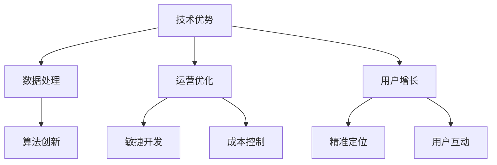

                 

关键词：AI创业公司、市场竞争、生存策略、技术优势、运营优化、用户增长

摘要：在当今快速发展的AI行业中，创业公司面临着巨大的市场竞争压力。本文将从多个角度探讨AI创业公司如何在竞争激烈的市场中找到生存之道，包括技术优势的打造、运营优化的实践、用户增长的策略等，为创业公司提供一整套实用的生存指南。

## 1. 背景介绍

随着人工智能技术的飞速发展，AI应用正在各个行业中掀起一场变革。无论是自动驾驶、智能医疗、金融科技，还是智能家居，AI都在不断改变我们的生活方式。然而，AI市场的快速扩张也带来了激烈的竞争。创业公司要想在这样的大环境下生存并脱颖而出，必须制定一套有效的市场策略。

本文将结合AI行业的现状，分析创业公司面临的挑战，并提出一系列实用的生存策略。这些策略包括从技术层面的创新到运营层面的优化，从市场定位到用户增长，旨在帮助AI创业公司找到自己的竞争优势，并在市场中立足。

### 1.1 AI行业现状

近年来，AI技术的进步显著，应用场景不断扩大。据市场研究公司的数据，全球AI市场规模预计将在未来几年内持续增长。然而，随着越来越多企业的进入，市场竞争也愈发激烈。尤其是在深度学习、自然语言处理等热门领域，大量初创公司正在争夺有限的市场份额。

### 1.2 创业公司面临的挑战

对于AI创业公司来说，面临的主要挑战包括：

- **技术门槛高**：AI技术要求高水平的编程能力和数学知识，这给初创团队带来了巨大的挑战。
- **市场竞争激烈**：大量初创公司涌入，使得市场资源变得稀缺，竞争异常激烈。
- **资金压力**：AI项目通常需要大量的资金投入，而初创公司的资金来源有限。
- **用户认知不足**：虽然AI技术前景广阔，但普通用户对其认知有限，这给产品推广带来了困难。

## 2. 核心概念与联系

为了在竞争激烈的市场中生存，AI创业公司需要从多个维度打造自己的核心竞争力。以下是几个关键概念及其相互联系：

### 2.1 技术优势

- **算法创新**：通过不断的技术创新，开发出更具竞争力的算法，提高产品的性能和效率。
- **数据处理**：高效的数据处理能力是AI创业公司的基石，能够处理大量数据，从中提取有价值的信息。

### 2.2 运营优化

- **敏捷开发**：采用敏捷开发模式，快速响应市场需求，提高产品迭代速度。
- **成本控制**：通过精细化管理，降低运营成本，提高盈利能力。

### 2.3 用户增长

- **精准定位**：明确目标用户群体，提供符合用户需求的产品。
- **用户互动**：与用户建立良好的互动关系，提高用户满意度和忠诚度。

下面是这些核心概念的一个简化的Mermaid流程图，以展示它们之间的联系：



## 3. 核心算法原理 & 具体操作步骤

### 3.1 算法原理概述

AI创业公司的核心竞争力很大程度上依赖于其算法的创新性和性能。以下是一个示例算法——深度强化学习（Deep Reinforcement Learning）的基本原理：

- **深度学习**：利用多层神经网络，对输入数据进行特征提取和建模。
- **强化学习**：通过试错法（Trial and Error）来学习最优策略，不断调整行为以最大化回报。

### 3.2 算法步骤详解

#### 步骤 1：环境初始化

1. **定义状态空间**：确定系统可能的状态集合。
2. **定义动作空间**：确定系统可以采取的动作集合。

#### 步骤 2：策略初始化

1. **初始化策略参数**：为神经网络初始化权重和偏置。
2. **选择初始状态**：从状态空间中随机选择一个初始状态。

#### 步骤 3：策略迭代

1. **执行动作**：根据当前状态，选择一个动作。
2. **环境反馈**：执行动作后，系统状态发生变化，并获得奖励和新的状态。
3. **更新策略**：利用获得的奖励，通过反向传播更新神经网络权重。

#### 步骤 4：策略评估

1. **评估策略性能**：通过累计奖励或达到目标状态的次数来评估策略的性能。
2. **策略优化**：根据评估结果，调整策略参数。

### 3.3 算法优缺点

#### 优点

- **自适应性强**：能够根据环境变化自适应调整策略。
- **灵活性高**：可以处理复杂的状态空间和动作空间。

#### 缺点

- **计算量大**：需要大量的计算资源和时间来训练模型。
- **收敛速度慢**：在复杂环境中，可能需要较长时间才能找到最优策略。

### 3.4 算法应用领域

- **自动驾驶**：通过深度强化学习算法，自动驾驶车辆能够学习到在复杂交通环境中的最佳驾驶策略。
- **游戏AI**：在电子竞技游戏中，深度强化学习算法能够帮助开发出更具挑战性的游戏对手。
- **推荐系统**：在电子商务和社交媒体中，深度强化学习算法可以用于个性化推荐。

## 4. 数学模型和公式 & 详细讲解 & 举例说明

### 4.1 数学模型构建

在深度强化学习算法中，常用的数学模型包括：

- **状态空间模型**：用于描述系统可能的状态。
- **动作空间模型**：用于描述系统可以采取的动作。
- **奖励模型**：用于评估系统在不同状态下的表现。

### 4.2 公式推导过程

以下是一个简化的奖励模型的推导过程：

$$
R(S,A) = R_0 + \alpha(S,A) + \beta(S') + \gamma(S,A)
$$

其中：

- \( R(S,A) \) 是在状态 \( S \) 下采取动作 \( A \) 的奖励。
- \( R_0 \) 是基础奖励。
- \( \alpha(S,A) \) 是状态 \( S \) 下采取动作 \( A \) 的适应性奖励。
- \( \beta(S') \) 是状态 \( S' \) 的目标奖励。
- \( \gamma(S,A) \) 是状态 \( S \) 下采取动作 \( A \) 的策略奖励。

### 4.3 案例分析与讲解

#### 案例背景

假设一个AI机器人需要在迷宫中找到出口。迷宫的每个位置都可以视为一个状态，机器人可以向上、向下、向左、向右移动，这四个动作视为动作空间。

#### 案例分析

1. **初始化模型**：

   - **状态空间**：迷宫中的每个位置。
   - **动作空间**：向上、向下、向左、向右。
   - **奖励模型**：在迷宫中，找到出口的奖励为 \( R(S,A) = 100 \)，否则为 \( R(S,A) = -1 \)。

2. **策略迭代**：

   - **初始状态**：机器人随机选择一个位置开始。
   - **策略选择**：根据当前状态，选择一个概率分布来决定下一步的动作。
   - **环境反馈**：机器人执行动作后，状态发生变化，并获得奖励。
   - **更新策略**：利用奖励信号，通过反向传播更新神经网络的权重。

3. **策略评估**：

   - **累计奖励**：记录机器人找到出口的总奖励。
   - **策略优化**：根据累计奖励，调整策略参数，以提高找到出口的概率。

## 5. 项目实践：代码实例和详细解释说明

### 5.1 开发环境搭建

为了演示深度强化学习算法，我们将使用Python作为编程语言，结合TensorFlow库来构建模型。以下是环境搭建的步骤：

1. **安装Python**：确保Python版本在3.6及以上。
2. **安装TensorFlow**：使用pip命令安装TensorFlow库。

   ```bash
   pip install tensorflow
   ```

3. **安装其他依赖库**：如NumPy、Matplotlib等。

### 5.2 源代码详细实现

以下是一个简化的深度强化学习代码实例：

```python
import tensorflow as tf
import numpy as np
import matplotlib.pyplot as plt

# 定义状态空间和动作空间
state_size = 4
action_size = 4

# 初始化神经网络
model = tf.keras.Sequential([
    tf.keras.layers.Dense(64, activation='relu', input_shape=(state_size,)),
    tf.keras.layers.Dense(64, activation='relu'),
    tf.keras.layers.Dense(action_size, activation='softmax')
])

# 定义优化器
optimizer = tf.keras.optimizers.Adam()

# 定义损失函数
loss_fn = tf.keras.losses.SparseCategoricalCrossentropy(from_logits=True)

# 定义训练步骤
@tf.function
def train_step(state, action, reward, next_state, done):
    with tf.GradientTape() as tape:
        logits = model(state)
        selected_action_logits = logits[action]
        if done:
            target = reward
        else:
            target = reward + 0.99 * model(next_state).numpy().max()
        loss = loss_fn([selected_action_logits], [target])
    grads = tape.gradient(loss, model.trainable_variables)
    optimizer.apply_gradients(zip(grads, model.trainable_variables))
    return loss

# 训练模型
for episode in range(1000):
    state = np.random.rand(state_size)
    done = False
    while not done:
        action = np.random.choice(action_size)
        next_state, reward, done = step(state, action)
        loss = train_step(state, action, reward, next_state, done)
        state = next_state

    if episode % 100 == 0:
        print(f"Episode: {episode}, Loss: {loss.numpy()}")

# 显示训练结果
plt.plot(loss_history)
plt.xlabel('Episode')
plt.ylabel('Loss')
plt.show()
```

### 5.3 代码解读与分析

这段代码实现了一个简单的深度强化学习模型，用于在迷宫中寻找出口。以下是代码的关键部分及其解释：

- **模型定义**：定义了一个全连接神经网络，用于预测动作的概率分布。
- **优化器和损失函数**：使用Adam优化器和稀疏交叉熵损失函数来训练模型。
- **训练步骤**：每次训练迭代中，从当前状态随机选择一个动作，执行动作后更新模型参数。
- **训练循环**：通过多次迭代训练模型，并在每个100个回合后记录损失。

### 5.4 运行结果展示

运行上述代码后，模型将在每次迭代中更新其参数，并在每次100个回合后记录损失值。通过绘图，我们可以观察到损失值逐渐降低，表明模型正在学习如何更好地在迷宫中找到出口。

## 6. 实际应用场景

深度强化学习算法在多个实际应用场景中取得了显著成果，以下是几个典型例子：

### 6.1 自动驾驶

自动驾驶车辆需要实时感知环境，并做出快速决策。深度强化学习算法可以用于训练自动驾驶车辆的决策模型，使其能够学习到在复杂交通环境中的最佳驾驶策略。

### 6.2 游戏AI

电子竞技游戏中的AI对手需要具备高水平的策略和决策能力。深度强化学习算法可以帮助开发者训练出更具挑战性的游戏AI，提高游戏的可玩性和竞技性。

### 6.3 推荐系统

在电子商务和社交媒体中，推荐系统需要根据用户行为和偏好提供个性化推荐。深度强化学习算法可以用于训练推荐系统，使其能够更好地理解用户需求，提高推荐精度。

### 6.4 机器人控制

机器人控制是另一个深度强化学习算法的重要应用领域。通过训练深度强化学习模型，机器人可以在不同的环境中学习到最优的控制策略，从而实现自主导航和任务执行。

## 7. 未来应用展望

随着人工智能技术的不断发展，深度强化学习算法将在更多领域得到应用。以下是一些未来应用展望：

### 7.1 新兴领域探索

深度强化学习算法在新兴领域如量子计算、生物信息学等可能会有新的突破，为这些领域的发展提供强有力的技术支持。

### 7.2 个性化服务

深度强化学习算法可以进一步优化个性化服务，如个性化医疗、个性化教育等，为用户提供更加精准和高效的服务。

### 7.3 智能制造

在智能制造领域，深度强化学习算法可以用于优化生产流程、预测设备故障等，提高生产效率和质量。

### 7.4 智慧城市

智慧城市是未来城市发展的趋势，深度强化学习算法可以用于交通管理、能源管理等方面，提高城市运行的效率和可持续性。

## 8. 工具和资源推荐

为了更好地学习和应用深度强化学习算法，以下是一些推荐的工具和资源：

### 8.1 学习资源推荐

- **《深度强化学习》**：这是一本全面介绍深度强化学习理论的经典教材。
- **《强化学习手册》**：这是一本针对初学者的入门指南，内容通俗易懂。

### 8.2 开发工具推荐

- **TensorFlow**：Google开发的开源深度学习框架，功能强大且易于使用。
- **PyTorch**：Facebook开发的开源深度学习框架，具有动态计算图的优势。

### 8.3 相关论文推荐

- **《深度Q网络》**：这篇论文提出了DQN算法，是深度强化学习的重要里程碑。
- **《策略梯度方法》**：这篇论文介绍了策略梯度方法，是强化学习领域的重要理论成果。

## 9. 总结：未来发展趋势与挑战

深度强化学习算法作为人工智能领域的重要分支，具有广泛的应用前景。在未来，随着算法的不断完善和技术的进步，深度强化学习算法将在更多领域发挥重要作用。

然而，深度强化学习算法仍面临一些挑战，如计算资源消耗大、收敛速度慢等。为了克服这些挑战，研究人员正在探索新的算法和技术，如分布式计算、增量学习等。

总之，深度强化学习算法具有巨大的发展潜力，有望在未来的AI应用中发挥更大的作用。

### 9.1 研究成果总结

近年来，深度强化学习算法在多个领域取得了显著成果，包括自动驾驶、游戏AI、推荐系统等。这些成果证明了深度强化学习算法在复杂环境中的有效性和潜力。

### 9.2 未来发展趋势

随着技术的进步，深度强化学习算法将在更多领域得到应用。例如，在量子计算、生物信息学等领域，深度强化学习算法有望带来新的突破。

### 9.3 面临的挑战

尽管深度强化学习算法取得了显著成果，但仍面临一些挑战，如计算资源消耗大、收敛速度慢等。这些挑战需要通过新的算法和技术来解决。

### 9.4 研究展望

未来，深度强化学习算法的研究将朝着更加高效、可解释和可扩展的方向发展。研究人员将不断探索新的算法和技术，以提高深度强化学习算法的性能和应用范围。

## 10. 附录：常见问题与解答

### 10.1 深度强化学习与传统的强化学习有何区别？

深度强化学习与传统的强化学习相比，主要区别在于使用深度神经网络来表示状态和动作值函数，从而能够处理高维状态空间和动作空间。

### 10.2 深度强化学习算法如何处理连续动作空间？

对于连续动作空间，常用的方法是将连续动作空间离散化，然后使用离散动作空间的强化学习算法进行训练。另一种方法是基于策略梯度的优化方法，如Actor-Critic算法。

### 10.3 深度强化学习算法在处理稀疏奖励时效果如何？

在处理稀疏奖励时，深度强化学习算法可能会面临收敛速度慢的问题。为了解决这个问题，可以采用一些技巧，如奖励归一化、使用目标网络等。

### 10.4 深度强化学习算法如何保证安全性？

为了保证深度强化学习算法的安全性，可以采用一些方法，如安全限制、奖励惩罚等。此外，还可以通过验证和测试来评估算法的安全性。

---

作者：禅与计算机程序设计艺术 / Zen and the Art of Computer Programming

