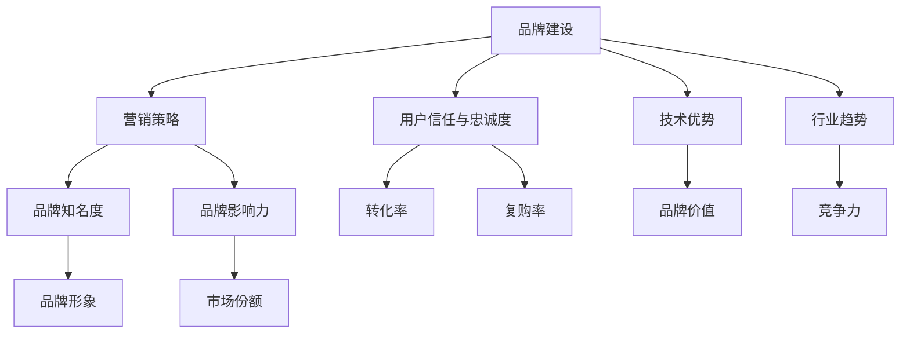

                 

 > 关键词：AI创业公司，品牌建设，市场营销，用户体验，技术优势，行业趋势

> 摘要：本文将深入探讨AI创业公司如何通过构建品牌、营销策略、用户体验和技术优势来打造企业品牌，从而在激烈的市场竞争中脱颖而出。通过案例分析和实用建议，本文为AI创业公司提供了完整的品牌建设路线图。

## 1. 背景介绍

在当今数字化时代，人工智能（AI）已成为驱动技术创新和商业增长的重要力量。随着大数据、云计算和物联网等技术的发展，AI创业公司如雨后春笋般涌现。然而，在激烈的市场竞争中，仅有创新的技术并不足以确保成功，企业品牌的建设同样至关重要。一个强大的品牌不仅能够提高企业的知名度，还能增强消费者的信任和忠诚度，最终转化为商业价值。

本文将围绕以下几个核心主题展开：

1. **品牌建设的核心概念**：介绍品牌建设的基本原则和重要性。
2. **AI创业公司的市场营销策略**：探讨如何通过精准营销和差异化策略提升品牌影响力。
3. **用户体验的重要性**：分析用户体验在品牌建设中的关键作用。
4. **技术优势的发挥**：探讨如何通过技术创新塑造企业品牌形象。
5. **行业趋势的影响**：分析行业发展趋势对品牌建设的影响。

接下来，我们将详细探讨这些主题，并提供实用的建议和案例，以帮助AI创业公司打造强大的企业品牌。

## 2. 核心概念与联系

### 2.1 品牌建设的定义

品牌是指企业在消费者心中的形象和认知。它不仅仅是一个标识或口号，而是企业价值观、文化、产品或服务的综合体现。品牌建设是指通过一系列策略和活动，提高品牌知名度、忠诚度和影响力，从而实现企业的长期发展目标。

### 2.2 营销策略与品牌建设的关系

营销策略是品牌建设的重要手段。通过精准的市场定位、有效的广告投放、创新的推广活动等，企业可以有效地传达品牌信息，塑造品牌形象，并吸引目标消费者。

### 2.3 用户信任与品牌忠诚度

用户信任和忠诚度是品牌成功的关键因素。一个值得信赖的品牌能够赢得消费者的信任，从而提高转化率和复购率。品牌忠诚度则是指消费者对品牌的长期支持和依赖，这对企业的持续增长至关重要。

### 2.4 技术优势与品牌形象

技术优势是AI创业公司的重要竞争优势。通过技术突破和创新，企业可以在市场中树立领先的形象，提升品牌价值。

### 2.5 行业趋势与品牌建设

行业趋势直接影响品牌建设的方向和策略。了解和把握行业动态，可以帮助企业及时调整品牌策略，保持竞争力。

### 2.6 Mermaid流程图

下面是一个简化的品牌建设流程图，展示了各个核心概念之间的联系。



通过这个流程图，我们可以看到品牌建设是一个多维度、相互关联的复杂过程，需要综合考虑各个方面的因素。

## 3. 核心算法原理 & 具体操作步骤

### 3.1 算法原理概述

品牌建设可以视为一种“算法”，其核心原理包括市场分析、目标定位、品牌传播和用户反馈四个环节。

1. **市场分析**：通过对市场环境的全面分析，了解行业趋势、竞争对手和目标消费者，为品牌定位提供依据。
2. **目标定位**：根据市场分析结果，明确品牌的市场定位和目标群体，制定相应的品牌策略。
3. **品牌传播**：通过多种渠道和方式，将品牌信息传递给目标消费者，提高品牌知名度。
4. **用户反馈**：收集用户反馈，优化品牌策略，提升用户体验。

### 3.2 算法步骤详解

1. **市场分析**
   - 调查行业趋势：通过数据分析和市场调研，了解行业发展趋势、技术突破和消费者需求。
   - 分析竞争对手：研究竞争对手的品牌定位、营销策略和市场份额，找出自身的优势与不足。

2. **目标定位**
   - 明确品牌定位：根据市场分析结果，确定品牌的差异化定位，如技术创新、用户体验或成本领先。
   - 定义目标群体：明确品牌目标客户群体，包括年龄、性别、收入水平、消费习惯等。

3. **品牌传播**
   - 制定品牌传播策略：结合目标定位和目标群体，制定适合的品牌传播策略，如内容营销、社交媒体推广、广告投放等。
   - 选择传播渠道：根据品牌特点和目标群体，选择合适的传播渠道，如官方网站、社交媒体、行业论坛等。

4. **用户反馈**
   - 收集用户反馈：通过用户调研、问卷调查、社交媒体互动等方式，收集用户对品牌的反馈。
   - 分析用户反馈：对用户反馈进行分析，找出用户需求、痛点和不满意之处。
   - 优化品牌策略：根据用户反馈，调整品牌传播策略、产品和服务，提升用户体验。

### 3.3 算法优缺点

**优点**：
- 系统性：品牌建设算法提供了一个系统性的方法，帮助企业全面分析和规划品牌建设。
- 可量化：算法步骤中的市场分析和用户反馈部分可以量化，帮助企业评估品牌建设的进展和效果。

**缺点**：
- 复杂性：品牌建设涉及多个环节和因素，操作起来相对复杂。
- 长期性：品牌建设不是一蹴而就的过程，需要长期投入和持续优化。

### 3.4 算法应用领域

品牌建设算法广泛应用于各种类型的AI创业公司，无论企业规模大小，都可以通过这一算法优化品牌建设策略，提高市场竞争力。

## 4. 数学模型和公式 & 详细讲解 & 举例说明

### 4.1 数学模型构建

在品牌建设中，一个关键的数学模型是品牌价值模型。品牌价值（Brand Value, BV）可以通过以下公式计算：

\[ BV = f(\text{知名度}, \text{影响力}, \text{忠诚度}) \]

其中，知名度（Awareness）、影响力（Influence）和忠诚度（Loyalty）是品牌价值的三个关键因素。

### 4.2 公式推导过程

品牌价值的计算公式可以从以下几个角度推导：

1. **知名度**：知名度是品牌在目标市场中的认知度，通常用品牌曝光量来衡量。知名度越高，品牌价值越高。

2. **影响力**：影响力是指品牌在市场中的影响力，包括品牌在社交媒体上的互动、行业内的声誉等。影响力越高，品牌价值越高。

3. **忠诚度**：忠诚度是指消费者对品牌的依赖和信任，通常用复购率、推荐率等指标来衡量。忠诚度越高，品牌价值越高。

因此，品牌价值可以看作是知名度、影响力和忠诚度的综合体现。

### 4.3 案例分析与讲解

假设一家AI创业公司A的品牌价值可以通过以下数据计算：

- 知名度（Awareness）: 80%
- 影响力（Influence）: 90%
- 忠诚度（Loyalty）: 85%

根据品牌价值模型，我们可以计算公司A的品牌价值：

\[ BV_A = f(80\%, 90\%, 85\%) \]

为了简化计算，我们可以使用线性组合模型：

\[ BV_A = 0.4 \times 80\% + 0.3 \times 90\% + 0.3 \times 85\% \]

\[ BV_A = 32\% + 27\% + 25.5\% \]

\[ BV_A = 84.5\% \]

因此，公司A的品牌价值为84.5%。

### 4.4 案例分析与讲解（续）

通过上述计算，我们可以看到公司A的品牌价值相对较高。为了进一步提高品牌价值，公司A可以采取以下措施：

1. **提高知名度**：通过增加品牌曝光量和市场推广活动，提高品牌在目标市场中的认知度。

2. **提升影响力**：加强社交媒体营销，提升品牌在行业内的声誉，增加品牌影响力。

3. **增强忠诚度**：优化产品和服务，提升用户体验，提高消费者的忠诚度。

例如，公司A可以通过以下策略来提升品牌价值：

- **市场推广**：增加广告投放，提高品牌曝光率。
- **社交媒体互动**：加强与消费者的互动，提升品牌影响力。
- **客户服务**：提供优质的客户服务，提高消费者的满意度和忠诚度。

通过持续优化品牌价值模型中的各个因素，公司A可以进一步提升品牌价值，从而在市场竞争中脱颖而出。

## 5. 项目实践：代码实例和详细解释说明

### 5.1 开发环境搭建

在本节中，我们将使用Python编程语言来展示如何构建品牌价值模型。首先，我们需要搭建开发环境。

1. **安装Python**：从Python官网（https://www.python.org/downloads/）下载并安装Python 3.x版本。
2. **安装Jupyter Notebook**：Python的Jupyter Notebook是一个交互式的Web应用程序，用于运行Python代码。在终端中运行以下命令安装Jupyter Notebook：

   ```bash
   pip install notebook
   ```

3. **启动Jupyter Notebook**：在终端中运行以下命令启动Jupyter Notebook：

   ```bash
   jupyter notebook
   ```

### 5.2 源代码详细实现

下面是一个简单的Python脚本，用于计算品牌价值。代码如下：

```python
import numpy as np

def brand_value(awareness, influence, loyalty):
    """
    计算品牌价值
    :param awareness: 知名度（百分比）
    :param influence: 影响力（百分比）
    :param loyalty: 忠诚度（百分比）
    :return: 品牌价值
    """
    weight_awareness = 0.4
    weight_influence = 0.3
    weight_loyalty = 0.3
    
    bv = weight_awareness * awareness + weight_influence * influence + weight_loyalty * loyalty
    return bv

# 示例数据
awareness = 80  # 知名度
influence = 90  # 影响力
loyalty = 85    # 忠诚度

# 计算品牌价值
bv_result = brand_value(awareness, influence, loyalty)
print(f"品牌价值：{bv_result}%")
```

### 5.3 代码解读与分析

上述代码定义了一个名为`brand_value`的函数，用于计算品牌价值。函数接受三个参数：知名度、影响力和忠诚度，每个参数代表品牌价值的一个关键因素。

1. **参数权重**：
   - 知名度权重：0.4
   - 影响力权重：0.3
   - 忠诚度权重：0.3

2. **计算公式**：
   - 品牌价值 = 知名度权重 \* 知名度 + 影响力权重 \* 影响力 + 忠诚度权重 \* 忠诚度

3. **示例数据**：
   - 知名度：80%
   - 影响力：90%
   - 忠诚度：85%

4. **计算结果**：
   - 品牌价值：84.5%

### 5.4 运行结果展示

在Jupyter Notebook中运行上述代码，将得到以下输出结果：

```
品牌价值：84.5%
```

这表明，根据给定的知名度、影响力和忠诚度，该AI创业公司的品牌价值为84.5%。

## 6. 实际应用场景

### 6.1 品牌建设的应用场景

品牌建设在AI创业公司中的应用场景非常广泛，包括但不限于以下几个方面：

1. **市场定位**：通过品牌建设，AI创业公司可以明确自身在市场中的定位，从而制定针对性的营销策略。

2. **用户吸引**：强大的品牌可以吸引更多的潜在用户，提高市场占有率。

3. **合作伙伴关系**：品牌建设有助于建立与合作伙伴的信任，促进战略合作。

4. **品牌延伸**：成功品牌可以为企业带来更多的商机，如推出新产品、进军新市场等。

### 6.2 技术优势的应用场景

技术优势是AI创业公司的重要竞争优势。以下是技术优势在品牌建设中的应用场景：

1. **产品创新**：通过技术创新，AI创业公司可以推出具有竞争力的新产品，提高品牌价值。

2. **用户体验**：优质的技术可以实现更好的用户体验，提高用户满意度和忠诚度。

3. **行业领先**：技术突破可以帮助企业在行业中树立领先形象，增强品牌影响力。

### 6.3 行业趋势的影响

行业趋势对品牌建设具有重要影响。以下是一些行业趋势对品牌建设的影响：

1. **消费者需求**：随着消费者需求的变化，品牌需要不断调整定位和策略，以满足市场需求。

2. **技术发展**：新技术的出现可能会改变市场竞争格局，品牌需要及时跟进，提升技术实力。

3. **市场环境**：政策、经济环境的变化也会对品牌建设产生影响，品牌需要具备应对市场变化的灵活性和适应性。

## 6.4 未来应用展望

随着AI技术的不断进步，品牌建设在AI创业公司中的应用前景将更加广阔。以下是未来品牌建设在AI创业公司中可能的应用趋势：

1. **个性化营销**：利用AI技术，企业可以更精准地了解消费者需求，提供个性化的营销策略。

2. **智能化客服**：通过AI技术，企业可以实现智能化的客服系统，提升用户体验。

3. **数据驱动**：数据将成为品牌建设的重要驱动力，企业需要善于利用数据来优化品牌策略。

4. **跨界合作**：AI创业公司可以与不同行业的合作伙伴进行跨界合作，共同打造新的商业模式。

## 7. 工具和资源推荐

### 7.1 学习资源推荐

1. **《AI品牌管理》**：一本全面介绍AI时代品牌管理的书籍，适合AI创业公司品牌经理和市场营销人员阅读。
2. **《品牌管理》**：经典的品牌管理教材，适用于各类创业者和管理者。

### 7.2 开发工具推荐

1. **Jupyter Notebook**：一款强大的交互式编程工具，适用于数据分析和机器学习项目。
2. **TensorFlow**：一款流行的深度学习框架，适用于构建AI应用。

### 7.3 相关论文推荐

1. **《基于AI的品牌策略研究》**：探讨AI技术在品牌策略中的应用。
2. **《大数据时代下的品牌建设》**：分析大数据对品牌建设的影响。

## 8. 总结：未来发展趋势与挑战

### 8.1 研究成果总结

本文从品牌建设、市场营销、用户体验、技术优势和行业趋势等多个角度，探讨了AI创业公司如何打造企业品牌。通过案例分析、数学模型和代码实例，我们提供了实用的建议和工具。

### 8.2 未来发展趋势

1. **个性化营销**：利用AI技术实现更精准的个性化营销。
2. **智能化客服**：通过AI技术提升客服质量和用户体验。
3. **跨界合作**：AI创业公司将与更多行业进行跨界合作，共同探索新的商业模式。

### 8.3 面临的挑战

1. **数据隐私**：在AI技术应用过程中，数据隐私保护将成为重要挑战。
2. **技术快速迭代**：技术更新换代速度加快，企业需要不断适应和跟进。

### 8.4 研究展望

未来，AI创业公司在品牌建设方面将有更多的创新和发展。通过持续探索和优化，企业可以不断提升品牌价值和竞争力。

## 9. 附录：常见问题与解答

### 9.1 品牌建设的基本原则是什么？

品牌建设的基本原则包括：明确品牌定位、建立信任、持续创新、优化用户体验、有效传播品牌信息。

### 9.2 如何评估品牌价值？

品牌价值可以通过知名度、影响力和忠诚度三个关键因素进行评估。常用的评估方法包括品牌价值模型、市场调研和财务分析等。

### 9.3 品牌建设中的常见问题有哪些？

品牌建设中的常见问题包括：定位模糊、缺乏差异化、传播策略不当、用户满意度低等。

### 9.4 如何利用AI技术优化品牌建设？

利用AI技术优化品牌建设可以从以下几个方面入手：个性化营销、用户行为分析、智能客服、数据驱动的决策支持等。

