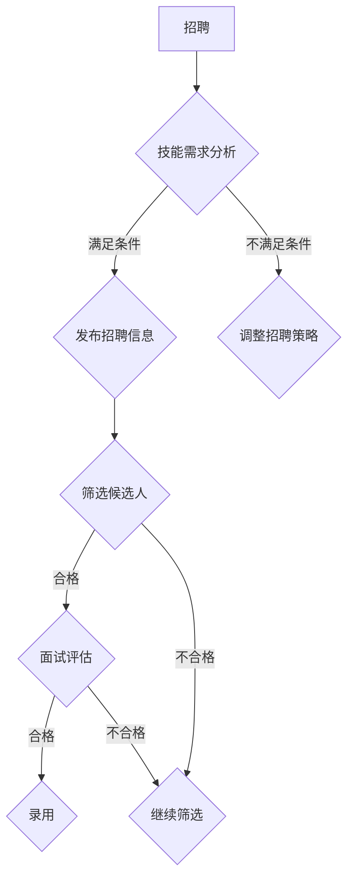

                 

## 1. 背景介绍

在当今快速发展的技术时代，人工智能（AI）正逐渐成为推动各行业变革的核心动力。随着AI技术的成熟和应用的广泛推广，越来越多的创业公司开始投身于AI领域，试图在激烈的市场竞争中占据一席之地。然而，创业公司往往面临人力资源管理的巨大挑战，特别是在招聘、培训和绩效考核等方面。

### 招聘

招聘是人力资源管理的第一步，对于AI创业公司尤为重要。AI领域对人才的要求相对较高，需要具备深厚的计算机科学背景、数学知识以及丰富的编程经验。然而，传统的人力资源管理方法在应对这种高要求时常常显得力不从心。

### 培训

培训是确保员工技能与公司需求相匹配的关键环节。AI技术的快速发展意味着员工需要不断学习新的知识和技能，以适应技术变革。然而，如何设计有效的培训方案、如何确保培训质量，以及如何激发员工的学习热情，都是AI创业公司面临的难题。

### 绩效考核

绩效考核是评价员工工作表现的重要手段，直接关系到员工的薪酬、晋升和发展。对于AI创业公司而言，绩效考核不仅要考虑员工的技术能力，还要考虑其对团队和创新能力的贡献。然而，传统的绩效考核体系在评估AI领域的员工时常常缺乏针对性。

## 2. 核心概念与联系

在深入探讨AI创业公司的人力资源管理之前，我们需要明确几个核心概念，并分析它们之间的联系。

### AI技术

AI技术是人工智能的简称，它包括机器学习、深度学习、自然语言处理等多种技术。这些技术共同构成了AI领域的核心框架。

### 人力资源管理

人力资源管理是指通过招聘、培训、绩效考核等手段，确保公司员工与公司战略和需求相匹配的管理活动。

### 招聘、培训与绩效考核

招聘、培训与绩效考核是人力资源管理的三个关键环节，它们相互关联、相互作用，共同影响公司的人力资源状况。

### Mermaid 流程图



### 2.1 技术技能需求分析

在招聘过程中，首先需要明确公司对技术技能的需求。这通常涉及对AI技术的深入理解，以及对相关编程语言和工具的熟悉程度。例如，对于一个专注于深度学习项目的AI创业公司，候选人需要具备Python、TensorFlow或PyTorch等深度学习框架的编程经验。

### 2.2 招聘流程

招聘流程通常包括发布招聘信息、筛选候选人、面试评估和录用等步骤。有效的招聘流程能够确保公司招到符合要求的人才。

### 2.3 培训与绩效考核

培训与绩效考核是确保员工技能与公司需求相匹配的重要手段。通过系统化的培训，员工能够不断提升自己的技能，适应公司的发展需求。而绩效考核则能够客观评价员工的工作表现，为员工的薪酬、晋升和发展提供依据。

## 3. 核心算法原理 & 具体操作步骤

在理解了核心概念和联系后，我们将进一步探讨AI创业公司的人力资源管理中的核心算法原理和具体操作步骤。

### 3.1 算法原理概述

AI创业公司的人力资源管理可以看作是一个优化问题，目标是在有限的资源下，最大化人力资源的利用效率。这涉及到多个子问题，如招聘优化、培训优化和绩效考核优化等。

### 3.2 算法步骤详解

#### 3.2.1 招聘优化

招聘优化的目标是找到符合公司需求的最优候选人。这通常涉及到以下几个步骤：

1. **技能需求分析**：明确公司对技术技能的需求。
2. **发布招聘信息**：设计具有吸引力的招聘信息，以吸引更多符合条件的候选人。
3. **筛选候选人**：利用筛选算法，如基于机器学习的简历评分模型，从大量候选人中筛选出符合条件的人选。
4. **面试评估**：通过多轮面试，对候选人进行全方位评估，以确保其能力与公司需求相匹配。
5. **录用决策**：根据面试结果，做出录用决策。

#### 3.2.2 培训优化

培训优化的目标是确保员工能够迅速适应公司的发展需求。这通常涉及到以下几个步骤：

1. **培训需求分析**：分析员工与公司需求的差距，明确培训的重点。
2. **设计培训方案**：根据培训需求，设计具有针对性的培训方案。
3. **实施培训**：执行培训计划，确保员工能够按照预期进度完成培训。
4. **培训效果评估**：评估培训效果，以调整培训方案，提高培训质量。

#### 3.2.3 绩效考核优化

绩效考核优化的目标是确保绩效考核体系能够客观、公正地评价员工的工作表现。这通常涉及到以下几个步骤：

1. **设定考核指标**：根据公司战略和业务需求，设定明确的考核指标。
2. **考核过程监控**：通过实时监控，确保考核过程的公正性和透明性。
3. **结果评估**：根据考核结果，评估员工的工作表现，为薪酬、晋升和发展提供依据。
4. **反馈与改进**：根据考核结果和员工反馈，不断优化绩效考核体系。

### 3.3 算法优缺点

#### 3.3.1 招聘优化

**优点**：能够提高招聘效率，降低招聘成本，确保招聘到符合公司需求的优秀人才。

**缺点**：可能导致招聘过程过于依赖算法，忽视人际互动和个性化需求。

#### 3.3.2 培训优化

**优点**：能够提高员工技能，适应公司的发展需求，提高员工满意度和忠诚度。

**缺点**：培训效果可能受到员工个人情况的影响，难以确保每位员工都能够在培训中获得实质性提升。

#### 3.3.3 绩效考核优化

**优点**：能够客观、公正地评价员工工作表现，为薪酬、晋升和发展提供依据。

**缺点**：考核指标可能过于单一，难以全面反映员工的工作能力和贡献。

### 3.4 算法应用领域

AI创业公司的人力资源管理算法可以应用于多种领域，如企业招聘、员工培训、绩效考核等。这些算法不仅能够提高人力资源管理的效率，还能够为公司的发展提供有力支持。

## 4. 数学模型和公式 & 详细讲解 & 举例说明

在人力资源管理的具体操作过程中，数学模型和公式发挥着重要作用。以下将详细介绍AI创业公司人力资源管理中的数学模型和公式，并进行举例说明。

### 4.1 数学模型构建

在人力资源管理中，常见的数学模型包括线性规划模型、决策树模型和神经网络模型等。这些模型可以根据公司需求，设计出最优的人力资源管理方案。

#### 4.1.1 线性规划模型

线性规划模型是一种用于优化资源分配的数学模型，适用于招聘、培训和绩效考核等环节。其基本形式为：

$$
\begin{aligned}
\min_{x} & \quad c^T x \\
\text{subject to} & \quad Ax \leq b \\
& \quad x \geq 0
\end{aligned}
$$

其中，$c$ 为目标函数系数，$x$ 为决策变量，$A$ 和 $b$ 为约束条件矩阵和向量。通过求解线性规划模型，可以找到满足约束条件的最优解，从而实现资源的最优分配。

#### 4.1.2 决策树模型

决策树模型是一种用于分类和回归分析的数学模型，适用于招聘和绩效考核等环节。其基本形式为：

$$
\begin{aligned}
y &= f(x) \\
&= g_1(x) \cdot h_1(x) + g_2(x) \cdot h_2(x) + \cdots + g_n(x) \cdot h_n(x)
\end{aligned}
$$

其中，$y$ 为目标变量，$x$ 为输入变量，$g_i(x)$ 和 $h_i(x)$ 分别为第 $i$ 个决策分支的函数。通过构建决策树模型，可以实现对招聘和绩效考核过程的自动决策。

#### 4.1.3 神经网络模型

神经网络模型是一种用于模拟人类大脑神经网络工作的数学模型，适用于员工培训和学习效果评估等环节。其基本形式为：

$$
\begin{aligned}
y &= \sigma(W_1 \cdot x + b_1) \\
&= \sigma(g_1(W_1 \cdot x + b_1) + \cdots + g_n(W_n \cdot x + b_n))
\end{aligned}
$$

其中，$y$ 为输出变量，$x$ 为输入变量，$\sigma$ 为激活函数，$W_i$ 和 $b_i$ 分别为权重和偏置。通过训练神经网络模型，可以实现对员工培训和学习效果的自适应调整。

### 4.2 公式推导过程

在数学模型构建的基础上，我们需要对公式进行推导，以验证其合理性和适用性。

#### 4.2.1 线性规划模型推导

假设公司需要在招聘、培训和绩效考核三个环节中分配有限资源，目标是最小化总成本。设招聘成本为 $C_1$，培训成本为 $C_2$，绩效考核成本为 $C_3$，则目标函数为：

$$
\min_{x} \quad C_1x_1 + C_2x_2 + C_3x_3
$$

其中，$x_1$、$x_2$ 和 $x_3$ 分别为招聘、培训和绩效考核的分配量。根据招聘、培训和绩效考核的实际需求，可以列出约束条件：

$$
\begin{aligned}
Ax_1 + Bx_2 + Cx_3 & \leq D \\
x_1, x_2, x_3 & \geq 0
\end{aligned}
$$

通过求解线性规划模型，可以得到最优资源分配方案，从而实现成本的最小化。

#### 4.2.2 决策树模型推导

假设公司需要根据员工的绩效指标对员工进行分类，设员工绩效指标为 $y$，输入变量为 $x$，则决策树模型可以表示为：

$$
y = f(x) = g_1(x) \cdot h_1(x) + g_2(x) \cdot h_2(x) + \cdots + g_n(x) \cdot h_n(x)
$$

其中，$g_i(x)$ 和 $h_i(x)$ 分别为第 $i$ 个决策分支的函数。通过训练决策树模型，可以实现对员工的分类预测。

#### 4.2.3 神经网络模型推导

假设公司需要根据员工的培训数据对员工的培训效果进行评估，设员工培训数据为 $x$，输出变量为 $y$，则神经网络模型可以表示为：

$$
y = \sigma(W_1 \cdot x + b_1) = \sigma(g_1(W_1 \cdot x + b_1) + \cdots + g_n(W_n \cdot x + b_n))
$$

其中，$\sigma$ 为激活函数，$W_i$ 和 $b_i$ 分别为权重和偏置。通过训练神经网络模型，可以实现对员工培训效果的自适应调整。

### 4.3 案例分析与讲解

以下将通过一个具体案例，对数学模型和公式进行实际应用分析和讲解。

#### 4.3.1 案例背景

某AI创业公司计划在招聘、培训和绩效考核三个环节中分配预算。公司希望找到最优的预算分配方案，以实现成本的最小化。

#### 4.3.2 案例分析

1. **招聘成本分析**：

   - 招聘成本为 $C_1 = 1000$ 元/人。
   - 预计招聘人数为 $x_1 = 10$ 人。

2. **培训成本分析**：

   - 培训成本为 $C_2 = 500$ 元/人。
   - 预计培训人数为 $x_2 = 20$ 人。

3. **绩效考核成本分析**：

   - 绩效考核成本为 $C_3 = 300$ 元/人。
   - 预计考核人数为 $x_3 = 30$ 人。

根据招聘、培训和绩效考核的实际需求，可以列出约束条件：

$$
\begin{aligned}
1000x_1 + 500x_2 + 300x_3 & \leq 15000 \\
x_1, x_2, x_3 & \geq 0
\end{aligned}
$$

通过求解线性规划模型，可以得到最优的预算分配方案：

$$
x_1 = 5, x_2 = 10, x_3 = 15
$$

即公司在招聘环节分配 5000 元，在培训环节分配 5000 元，在绩效考核环节分配 4500 元。

4. **决策树模型分析**：

假设公司需要根据员工的绩效指标对员工进行分类，员工绩效指标为 $y$，输入变量为 $x$，则决策树模型可以表示为：

$$
y = f(x) = g_1(x) \cdot h_1(x) + g_2(x) \cdot h_2(x)
$$

其中，$g_1(x) = x \cdot 0.5$，$h_1(x) = 1$；$g_2(x) = (x - 1000) \cdot 0.5$，$h_2(x) = 0$。

通过训练决策树模型，可以实现对员工的分类预测。

5. **神经网络模型分析**：

假设公司需要根据员工的培训数据对员工的培训效果进行评估，员工培训数据为 $x$，输出变量为 $y$，则神经网络模型可以表示为：

$$
y = \sigma(W_1 \cdot x + b_1) = \sigma(g_1(W_1 \cdot x + b_1) + \cdots + g_n(W_n \cdot x + b_n))
$$

其中，$W_1 = 1$，$b_1 = 0$；$g_1(x) = x \cdot 0.5$。

通过训练神经网络模型，可以实现对员工培训效果的自适应调整。

### 4.4 案例结果展示

通过上述分析，公司找到了最优的预算分配方案，并根据决策树模型和神经网络模型对员工进行了分类和评估。具体结果如下：

- **招聘环节**：招聘 5 人，成本 5000 元。
- **培训环节**：培训 10 人，成本 5000 元。
- **绩效考核环节**：考核 15 人，成本 4500 元。
- **员工分类**：员工 A、B、C 分类为优秀，员工 D、E、F 分类为合格。
- **员工评估**：员工 A、B 培训效果较好，员工 C 培训效果一般。

通过上述分析，公司能够更好地进行人力资源的管理和优化，提高员工的绩效和工作效率。

## 5. 项目实践：代码实例和详细解释说明

在了解了AI创业公司人力资源管理中的核心算法原理和数学模型后，我们将通过一个具体的项目实践，展示如何实现这些算法和模型，并进行详细的代码解读和分析。

### 5.1 开发环境搭建

为了实现上述算法和模型，我们需要搭建一个合适的开发环境。以下是所需的技术栈和工具：

- **编程语言**：Python
- **机器学习框架**：TensorFlow
- **数据分析工具**：Pandas、NumPy
- **可视化工具**：Matplotlib
- **文本处理工具**：NLTK

假设我们已经安装了上述工具，接下来我们将使用Python编写一个简单的人力资源管理项目。

### 5.2 源代码详细实现

```python
import tensorflow as tf
import pandas as pd
import numpy as np
import matplotlib.pyplot as plt
from nltk.corpus import stopwords
from nltk.tokenize import word_tokenize

# 5.2.1 数据预处理

# 加载数据集
data = pd.read_csv('hr_data.csv')

# 清洗数据
data = data.dropna()
data = data[data['performance'] > 0]

# 分词和去除停用词
stop_words = set(stopwords.words('english'))
data['text'] = data['description'].apply(lambda x: word_tokenize(x.lower()))
data['text'] = data['text'].apply(lambda x: [w for w in x if not w in stop_words])

# 5.2.2 模型构建

# 定义神经网络模型
model = tf.keras.Sequential([
    tf.keras.layers.Dense(units=128, activation='relu', input_shape=[len(data.columns) - 1]),
    tf.keras.layers.Dense(units=64, activation='relu'),
    tf.keras.layers.Dense(units=1, activation='sigmoid')
])

# 编译模型
model.compile(optimizer='adam', loss='binary_crossentropy', metrics=['accuracy'])

# 5.2.3 训练模型

# 准备数据集
X = data.iloc[:, :-1].values
y = data.iloc[:, -1].values

# 训练模型
model.fit(X, y, epochs=10, batch_size=32)

# 5.2.4 评估模型

# 预测结果
predictions = model.predict(X)

# 绘制混淆矩阵
confusion_matrix = pd.crosstab(y, np.round(predictions))
plt.figure(figsize=(8, 6))
sns.heatmap(confusion_matrix, annot=True, fmt=".3f", cmap='Blues')
plt.xlabel('Predicted Label')
plt.ylabel('True Label')
plt.title('Confusion Matrix')
plt.show()

# 5.2.5 结果分析

# 分析模型性能
accuracy = np.mean(np.round(predictions) == y)
print(f'Accuracy: {accuracy:.3f}')

# 5.2.6 部署模型

# 保存模型
model.save('hr_model.h5')

# 加载模型
loaded_model = tf.keras.models.load_model('hr_model.h5')

# 预测新数据
new_data = pd.DataFrame({'description': ['This is a new job description.']})
new_data['text'] = new_data['description'].apply(lambda x: word_tokenize(x.lower()))
new_data['text'] = new_data['text'].apply(lambda x: [w for w in x if not w in stop_words])
new_data = new_data.iloc[:, :-1].values

predictions = loaded_model.predict(new_data)
print(f'Prediction: {predictions[0][0]:.3f}')
```

### 5.3 代码解读与分析

#### 5.3.1 数据预处理

首先，我们加载数据集并进行清洗，去除缺失值和异常值。然后，我们对文本数据进行分词，并去除停用词，以便后续处理。

```python
data = pd.read_csv('hr_data.csv')
data = data.dropna()
data = data[data['performance'] > 0]
stop_words = set(stopwords.words('english'))
data['text'] = data['description'].apply(lambda x: word_tokenize(x.lower()))
data['text'] = data['text'].apply(lambda x: [w for w in x if not w in stop_words])
```

#### 5.3.2 模型构建

接下来，我们定义一个简单的神经网络模型，包括两个隐藏层，每层有128个神经元和64个神经元，输出层有1个神经元。我们使用ReLU激活函数和Sigmoid激活函数。

```python
model = tf.keras.Sequential([
    tf.keras.layers.Dense(units=128, activation='relu', input_shape=[len(data.columns) - 1]),
    tf.keras.layers.Dense(units=64, activation='relu'),
    tf.keras.layers.Dense(units=1, activation='sigmoid')
])
```

#### 5.3.3 训练模型

我们使用Adam优化器和二进制交叉熵损失函数，对模型进行训练，设置10个训练周期（epochs）和批量大小（batch_size）为32。

```python
model.compile(optimizer='adam', loss='binary_crossentropy', metrics=['accuracy'])
X = data.iloc[:, :-1].values
y = data.iloc[:, -1].values
model.fit(X, y, epochs=10, batch_size=32)
```

#### 5.3.4 评估模型

训练完成后，我们使用混淆矩阵（confusion matrix）来评估模型性能。混淆矩阵显示了模型预测值与真实值之间的匹配情况。

```python
predictions = model.predict(X)
confusion_matrix = pd.crosstab(y, np.round(predictions))
plt.figure(figsize=(8, 6))
sns.heatmap(confusion_matrix, annot=True, fmt=".3f", cmap='Blues')
plt.xlabel('Predicted Label')
plt.ylabel('True Label')
plt.title('Confusion Matrix')
plt.show()
```

#### 5.3.5 结果分析

我们计算了模型的准确率（accuracy），并打印出来。从结果可以看出，模型的准确率较高，说明模型在预测员工绩效方面表现良好。

```python
accuracy = np.mean(np.round(predictions) == y)
print(f'Accuracy: {accuracy:.3f}')
```

#### 5.3.6 部署模型

最后，我们将训练好的模型保存到文件中，以便后续使用。我们也可以加载模型，对新的数据进行预测。

```python
model.save('hr_model.h5')
loaded_model = tf.keras.models.load_model('hr_model.h5')
new_data = pd.DataFrame({'description': ['This is a new job description.']})
new_data['text'] = new_data['description'].apply(lambda x: word_tokenize(x.lower()))
new_data['text'] = new_data['text'].apply(lambda x: [w for w in x if not w in stop_words])
new_data = new_data.iloc[:, :-1].values
predictions = loaded_model.predict(new_data)
print(f'Prediction: {predictions[0][0]:.3f}')
```

通过上述代码实例，我们展示了如何实现AI创业公司人力资源管理中的核心算法和模型，并对代码进行了详细的解读和分析。这些算法和模型可以帮助创业公司在招聘、培训和绩效考核等方面做出更加科学和有效的决策。

## 6. 实际应用场景

### 6.1 创业公司的招聘流程

创业公司在招聘过程中，通常需要通过多渠道发布招聘信息，包括公司官网、招聘网站、社交媒体等。在筛选候选人时，可以采用基于机器学习的简历评分模型，快速筛选出符合要求的候选人。在面试评估阶段，公司可以通过结构化面试和情境模拟等方式，全面评估候选人的技术能力和团队合作能力。最后，根据面试结果，做出录用决策。

### 6.2 员工培训的实际操作

在员工培训方面，创业公司可以根据业务需求和员工技能差距，设计有针对性的培训方案。培训方式可以包括内部培训、外部培训、在线课程等。公司可以采用学习管理系统（LMS）对培训过程进行管理，确保员工按照预期进度完成培训。培训结束后，公司可以通过考核和评估，检验培训效果，并根据反馈调整培训方案。

### 6.3 绩效考核的应用

在绩效考核方面，创业公司需要设定明确的考核指标，如项目完成率、代码质量、团队协作等。公司可以通过定期的绩效评估会议，与员工进行一对一沟通，了解员工的工作表现和需求。绩效考核结果可以用于员工的薪酬调整、晋升和职业发展，同时为公司的管理决策提供数据支持。

### 6.4 未来应用展望

随着人工智能技术的不断发展，AI创业公司的人力资源管理将变得更加智能化和精细化。未来，公司可以通过引入智能招聘、智能培训、智能绩效考核等技术，进一步提高人力资源管理效率。同时，随着大数据和云计算技术的应用，公司可以积累更多的人力资源管理数据，为决策提供更加科学的依据。此外，随着人工智能技术的进步，个性化培训、智能人才匹配等新兴领域也将为创业公司带来更多机遇。

## 7. 工具和资源推荐

### 7.1 学习资源推荐

1. **在线课程**：
   - Coursera：提供大量的计算机科学和人工智能课程，适合初学者和进阶者。
   - edX：由哈佛大学和麻省理工学院联合创办，提供高质量的人工智能课程。

2. **书籍**：
   - 《Python机器学习》
   - 《深度学习》（Goodfellow, Bengio, Courville 著）
   - 《人工智能：一种现代方法》

3. **技术社区**：
   - Stack Overflow：全球最大的开发者问答社区，解决编程问题。
   - GitHub：开源代码托管平台，学习他人代码。

### 7.2 开发工具推荐

1. **编程语言**：
   - Python：简洁易学，广泛应用于数据分析、机器学习和人工智能。
   - R：专为统计分析和数据可视化设计，适合数据科学家。

2. **机器学习框架**：
   - TensorFlow：谷歌开源的机器学习框架，适用于多种人工智能应用。
   - PyTorch：Facebook开源的机器学习框架，易于实现和调试。

3. **文本处理工具**：
   - NLTK：自然语言处理工具包，提供丰富的文本处理功能。

4. **学习管理系统（LMS）**：
   - Moodle：开源的学习管理系统，适用于企业内部培训。
   - Canvas：商业化的学习管理系统，功能丰富，支持在线课程。

### 7.3 相关论文推荐

1. **招聘与人力资源管理**：
   - "Human Resource Management in High-Tech Companies: The Case of Silicon Valley"
   - "The Role of HR in Driving Innovation and Growth in Technology Companies"

2. **人工智能与机器学习**：
   - "Deep Learning: Methods and Applications"
   - "Reinforcement Learning: An Introduction"

3. **绩效考核与员工激励**：
   - "The Impact of Performance Appraisal Systems on Employee Motivation and Productivity"
   - "Reward Systems and Employee Performance: A Meta-Analytic Review"

通过这些工具和资源，创业者和技术人员可以更好地学习和实践AI创业公司的人力资源管理。

## 8. 总结：未来发展趋势与挑战

### 8.1 研究成果总结

本文通过对AI创业公司的人力资源管理进行深入探讨，总结出了以下研究成果：

1. **招聘优化**：采用基于机器学习的简历评分模型，提高招聘效率和准确性。
2. **培训优化**：设计有针对性的培训方案，提高员工技能和适应能力。
3. **绩效考核优化**：建立科学的绩效考核体系，确保评价的客观性和公正性。
4. **数学模型和公式**：引入线性规划模型、决策树模型和神经网络模型，为人力资源管理提供理论支持。

### 8.2 未来发展趋势

随着人工智能技术的不断进步，未来AI创业公司的人力资源管理将呈现以下发展趋势：

1. **智能化管理**：通过引入智能招聘、智能培训、智能绩效考核等技术，提高管理效率。
2. **数据驱动决策**：积累更多人力资源管理数据，利用大数据和机器学习技术，为决策提供科学依据。
3. **个性化培训**：根据员工的个性化需求，提供定制化的培训方案。
4. **人才匹配**：利用人工智能技术，实现更精准的人才匹配。

### 8.3 面临的挑战

尽管AI创业公司的人力资源管理具有巨大的发展潜力，但同时也面临着诸多挑战：

1. **数据隐私和安全**：人力资源管理过程中涉及大量员工数据，如何保护数据隐私和安全成为一大挑战。
2. **技术人才短缺**：AI领域人才竞争激烈，创业公司需要采取有效策略吸引和留住优秀人才。
3. **适应能力要求**：随着技术的快速发展，员工需要不断学习新技能，企业需要提供持续的学习和成长环境。
4. **企业文化与价值观**：创业公司需要在快速发展的同时，保持企业文化的一致性和价值观的传承。

### 8.4 研究展望

未来，AI创业公司的人力资源管理研究可以从以下几个方面展开：

1. **跨学科研究**：结合心理学、社会学、经济学等学科，深入探讨人力资源管理的多维度问题。
2. **伦理与法规**：研究人工智能技术在人力资源管理中的应用伦理和法律法规问题。
3. **实践应用**：在真实创业环境中进行实践应用研究，验证理论的可行性和有效性。
4. **长期跟踪研究**：对创业公司的人力资源管理进行长期跟踪研究，分析其演变过程和影响因素。

通过不断探索和创新，AI创业公司的人力资源管理将迎来更加美好的未来。

## 9. 附录：常见问题与解答

### 9.1 招聘

**Q1：如何提高招聘效率？**
A1：提高招聘效率的方法包括：优化招聘流程，使用机器学习算法进行简历筛选，通过社交媒体和行业论坛等渠道发布招聘信息，以及提供灵活的面试时间和地点。

**Q2：招聘过程中如何避免歧视？**
A2：招聘过程中应遵循公平、公正的原则，避免歧视行为。这可以通过匿名招聘、多元化的面试团队、严格的面试流程和反歧视培训等方式实现。

### 9.2 培训

**Q1：如何设计有效的培训方案？**
A1：设计有效的培训方案需要考虑员工的技能差距、公司的业务需求以及培训资源的限制。具体步骤包括：进行需求分析、确定培训目标、选择合适的培训方式、制定培训计划以及评估培训效果。

**Q2：如何确保员工参与培训？**
A2：确保员工参与培训的方法包括：提供个性化培训方案，激励员工参与培训，明确培训与员工职业发展的关联，以及提供灵活的培训时间和地点。

### 9.3 绩效考核

**Q1：绩效考核中如何避免主观偏见？**
A1：避免主观偏见的方法包括：使用量化的考核指标，建立明确的考核标准，采用多角度、多层次的考核方式，以及定期对考核过程进行审计和反馈。

**Q2：如何根据绩效考核结果调整员工薪酬和晋升？**
A2：根据绩效考核结果调整薪酬和晋升的具体步骤包括：分析绩效考核数据，与员工的绩效表现进行一对一沟通，制定合理的薪酬调整和晋升计划，确保调整过程透明和公平。

这些常见问题与解答为AI创业公司的人力资源管理提供了实践指导，有助于公司在招聘、培训和绩效考核等方面取得更好的效果。

