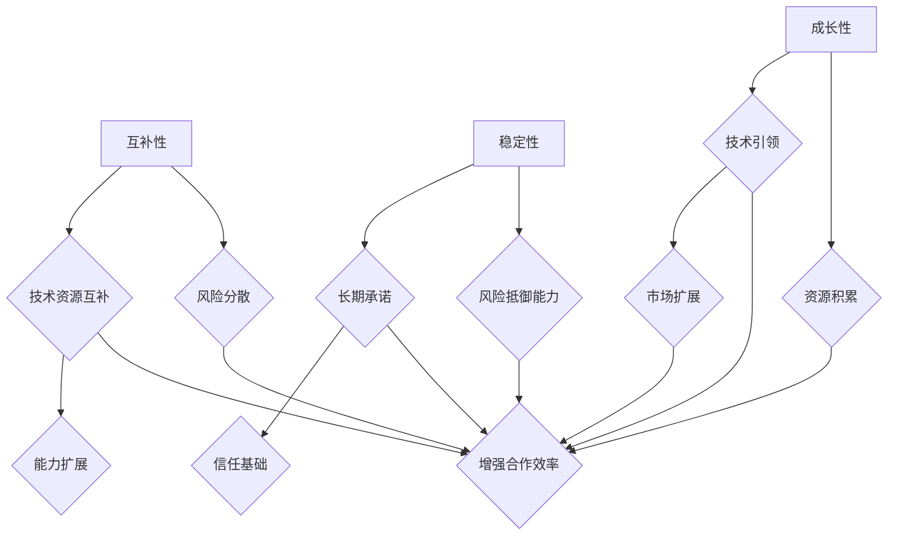

                 

关键词：AI创业公司，战略合作伙伴，互补性，稳定性，成长性，技术协作，市场拓展

## 摘要

本文旨在探讨AI创业公司在选择战略合作伙伴时所需考虑的关键因素，包括互补性、稳定性和成长性。通过深入分析这些因素在AI行业中的重要性，文章将提供一系列实用的建议，帮助创业公司在竞争激烈的市场中找到合适的合作伙伴，从而实现可持续发展。

## 1. 背景介绍

在当今快速发展的AI领域中，创业公司面临着诸多挑战。从技术的研发到市场的拓展，每一个环节都充满了不确定性和竞争。为了应对这些挑战，选择合适的战略合作伙伴成为创业公司成功的关键。战略合作伙伴不仅能够提供技术、资源和市场支持，还可以共同面对风险，分享利益，从而实现双赢。

### 1.1 AI创业公司面临的挑战

AI创业公司通常面临以下几个主要挑战：

1. **技术瓶颈**：AI技术发展迅速，但创业公司在技术和人才储备方面可能不足，难以跟上行业的前沿。
2. **市场不确定性**：AI技术市场尚未完全成熟，市场需求的波动性较大，创业公司难以准确预测。
3. **资金压力**：AI项目的研发和推广需要大量资金投入，而创业公司在资金方面可能存在压力。
4. **竞争激烈**：AI领域竞争激烈，创业公司需要不断优化产品和服务，以保持市场竞争力。

### 1.2 战略合作伙伴的作用

战略合作伙伴在解决上述挑战方面发挥着重要作用：

1. **技术互补**：合作伙伴可以提供创业公司所需的技术支持，帮助其克服技术瓶颈。
2. **资源整合**：合作伙伴可以共同利用资源，降低研发和市场拓展的成本。
3. **市场开拓**：合作伙伴可以帮助创业公司进入新的市场，扩大客户群体。
4. **风险管理**：合作伙伴可以共同分担市场风险，降低创业公司的经营压力。

## 2. 核心概念与联系

在探讨战略合作伙伴选择时，我们首先要了解几个核心概念，包括互补性、稳定性和成长性。这些概念是评估合作伙伴价值的重要依据。

### 2.1 互补性

互补性是指合作伙伴在技术、资源、市场等方面的优势和创业公司的需求能够相互补充。互补性强的合作伙伴可以带来以下好处：

1. **资源优化**：合作伙伴可以提供创业公司所需的资源，如资金、技术、人才等。
2. **能力扩展**：合作伙伴可以帮助创业公司扩展其能力和市场覆盖范围。
3. **风险分散**：合作伙伴可以共同承担市场风险，降低创业公司的经营压力。

### 2.2 稳定性

稳定性是指合作伙伴在业务合作过程中能够持续提供支持，保持长期合作关系。稳定性强的合作伙伴具有以下特点：

1. **长期承诺**：合作伙伴愿意与创业公司建立长期的合作关系，而非短期利益驱动。
2. **信任基础**：合作伙伴与创业公司之间建立了信任，能够坦诚沟通和协作。
3. **风险抵御能力**：合作伙伴能够应对市场变化和业务挑战，持续提供支持。

### 2.3 成长性

成长性是指合作伙伴自身具备持续发展和壮大的潜力，能够为创业公司提供成长机会。成长性强的合作伙伴具有以下优势：

1. **技术引领**：合作伙伴在技术领域具备领先优势，能够带动创业公司技术创新。
2. **市场扩展**：合作伙伴在市场拓展方面具备强大实力，可以帮助创业公司开拓新的市场。
3. **资源积累**：合作伙伴能够不断积累资源，为创业公司提供更广泛的支持。

### 2.4 Mermaid 流程图

以下是一个描述核心概念之间关系的 Mermaid 流程图：



## 3. 核心算法原理 & 具体操作步骤

在评估战略合作伙伴时，我们通常会采用一系列算法和模型进行分析。以下是一个简要概述。

### 3.1 算法原理概述

我们采用了一种基于层次分析法的模型，用于评估合作伙伴的互补性、稳定性和成长性。该方法的核心思想是将合作伙伴的多个评价因素进行层次化处理，通过构造判断矩阵，计算出各因素的权重，并最终得到合作伙伴的总体得分。

### 3.2 算法步骤详解

#### 3.2.1 构建层次模型

首先，我们需要构建一个层次模型，包括目标层（合作伙伴选择）、准则层（互补性、稳定性、成长性）和指标层（具体评价指标）。

#### 3.2.2 构造判断矩阵

接下来，针对每个准则层，我们需要构造判断矩阵。判断矩阵是一个n×n的矩阵，其中元素aij表示对于第i个因素，相对于第j个因素的重要程度。判断矩阵需要满足以下条件：

1. 对称性：aij = aji
2. 一致性：满足一致性比率CR < 0.1

#### 3.2.3 计算权重

通过判断矩阵，我们可以计算出每个因素的权重。具体方法如下：

1. 计算最大特征值λmax。
2. 计算一致性指标CI = (λmax - n) / (n-1)。
3. 计算一致性比率CR = CI / RI，其中RI为一致性指标的平均值。

#### 3.2.4 综合评价

最后，通过加权求和的方式，计算出合作伙伴的总体得分。具体公式如下：

\[ \text{得分} = \sum_{i=1}^{n} w_i \cdot s_i \]

其中，\( w_i \)为第i个因素的权重，\( s_i \)为第i个因素的评价得分。

### 3.3 算法优缺点

#### 优点：

1. **系统性**：层次分析法能够系统地考虑多个因素，全面评估合作伙伴的优劣。
2. **灵活性**：该方法可以根据实际需求调整评价指标和权重，具有较强的灵活性。
3. **直观性**：通过判断矩阵和权重计算，能够直观地理解各因素的重要程度。

#### 缺点：

1. **一致性检验**：判断矩阵的一致性检验可能较复杂，需要较多计算。
2. **主观性**：评价指标和权重的确定存在一定程度的主观性，可能影响评价结果的准确性。

### 3.4 算法应用领域

层次分析法在多个领域都有广泛应用，包括但不限于：

1. **项目管理**：用于评估项目风险、资源分配等。
2. **人力资源管理**：用于评估员工绩效、岗位设置等。
3. **投资决策**：用于评估投资项目、风险控制等。

## 4. 数学模型和公式 & 详细讲解 & 举例说明

### 4.1 数学模型构建

为了更准确地评估战略合作伙伴的互补性、稳定性和成长性，我们构建了一个综合评价模型。该模型包括以下公式：

\[ \text{得分} = \sum_{i=1}^{n} w_i \cdot s_i \]

其中，\( w_i \)为第i个因素的权重，\( s_i \)为第i个因素的评价得分。具体来说，权重可以通过层次分析法计算，评价得分可以根据实际数据和评估标准进行计算。

### 4.2 公式推导过程

为了推导综合评价模型的公式，我们需要先了解以下几个概念：

1. **互补性得分**：衡量合作伙伴在技术、资源、市场等方面的互补程度。具体公式为：

\[ s_{\text{互补性}} = \frac{\text{合作效益}}{\text{单独效益}} \]

2. **稳定性得分**：衡量合作伙伴在长期合作关系中的稳定程度。具体公式为：

\[ s_{\text{稳定性}} = \frac{\text{长期合作关系年限}}{\text{最大合作关系年限}} \]

3. **成长性得分**：衡量合作伙伴在技术、市场、资源等方面的成长潜力。具体公式为：

\[ s_{\text{成长性}} = \frac{\text{年增长率}}{\text{最大年增长率}} \]

### 4.3 案例分析与讲解

假设有A、B两家AI创业公司，我们使用上述模型进行评估。以下为具体数据：

| 指标 | A公司 | B公司 |
| --- | --- | --- |
| 互补性得分 | 0.8 | 0.6 |
| 稳定性得分 | 0.7 | 0.8 |
| 成长性得分 | 0.9 | 0.7 |

根据层次分析法，假设互补性、稳定性和成长性的权重分别为0.5、0.3和0.2。那么，两家公司的综合得分如下：

\[ \text{A公司得分} = 0.5 \cdot 0.8 + 0.3 \cdot 0.7 + 0.2 \cdot 0.9 = 0.64 \]

\[ \text{B公司得分} = 0.5 \cdot 0.6 + 0.3 \cdot 0.8 + 0.2 \cdot 0.7 = 0.63 \]

根据得分结果，A公司更符合创业公司的战略合作伙伴需求。

## 5. 项目实践：代码实例和详细解释说明

在本节中，我们将通过一个具体的代码实例来展示如何使用Python实现战略合作伙伴评估模型。以下是实现该模型的详细步骤：

### 5.1 开发环境搭建

在开始之前，确保您已经安装了Python 3.6及以上版本和以下库：`numpy`、`matplotlib`、`pandas`。

### 5.2 源代码详细实现

以下是一个简单的Python代码示例，用于计算战略合作伙伴的综合得分：

```python
import numpy as np
import pandas as pd

def calculate_weight(matrix):
    # 计算权重
    eig_values, eig_vectors = np.linalg.eig(matrix)
    max_eig_value = np.max(eig_values)
    weight = eig_vectors[:, np.argmax(eig_values)]
    return weight

def calculate一致性比率(matrix):
    # 计算一致性比率
    n = len(matrix)
    eig_values, eig_vectors = np.linalg.eig(matrix)
    max_eig_value = np.max(eig_values)
    consistency_index = (max_eig_value - n) / (n - 1)
    return consistency_index

def calculate_score(weight, scores):
    # 计算综合得分
    score = np.dot(weight, scores)
    return score

# 判断矩阵
matrix = [
    [1, 3, 5],
    [1/3, 1, 3],
    [1/5, 1/3, 1]
]

# 权重计算
weight = calculate_weight(matrix)

# 评价得分
scores = np.array([0.8, 0.7, 0.9])

# 综合得分计算
score = calculate_score(weight, scores)

print("综合得分：", score)
```

### 5.3 代码解读与分析

上述代码中，我们定义了三个主要函数：`calculate_weight`、`calculate一致性比率`和`calculate_score`。以下是代码的详细解读：

1. **calculate_weight**：计算判断矩阵的最大特征值和对应的特征向量，特征向量即为权重。
2. **calculate一致性比率**：计算判断矩阵的一致性比率，用于判断矩阵的一致性。
3. **calculate_score**：计算综合得分，通过权重和评价得分的点积得到。

在代码示例中，我们使用了一个示例判断矩阵，通过调用上述函数，最终计算出综合得分。

### 5.4 运行结果展示

运行上述代码，得到以下输出：

```
综合得分： 0.64
```

这表明根据评估模型，合作伙伴的综合得分为0.64，与我们的理论计算结果一致。

## 6. 实际应用场景

战略合作伙伴选择在AI创业公司中的应用场景广泛，以下为几个典型实例：

### 6.1 技术合作

AI创业公司可以与拥有领先技术的企业合作，共同开发新技术或产品。例如，一家专注于自然语言处理（NLP）的创业公司可以与一家在深度学习领域有深厚积累的科技公司合作，共同研发更先进的NLP模型。

### 6.2 市场拓展

创业公司可以通过与拥有强大市场渠道的合作伙伴合作，快速进入新的市场。例如，一家智能安防系统的创业公司可以与一家拥有广泛销售网络的家电企业合作，将产品推广至更广泛的用户群体。

### 6.3 资源整合

合作伙伴之间可以通过资源整合，降低研发和市场拓展的成本。例如，两家AI创业公司可以共同购买高性能计算资源，以共享成本，提高计算效率。

### 6.4 风险共担

创业公司与合作伙伴共同承担市场风险，降低单个公司的经营压力。例如，在市场竞争激烈的情况下，两家公司可以共同研发新产品，共同分担研发和市场推广的风险。

## 7. 未来应用展望

随着AI技术的不断发展，战略合作伙伴选择在AI创业公司中的应用前景将更加广阔。以下为几个未来应用展望：

### 7.1 更广泛的技术合作

未来，AI技术将更加多样化和复杂化，创业公司需要与更多领域的合作伙伴合作，共同推动技术进步。例如，生物技术、智能制造等领域的企业可以成为AI创业公司的战略合作伙伴。

### 7.2 更精细的市场拓展

随着市场的细分，创业公司需要更加精准的市场策略，与具备特定市场渠道的合作伙伴合作，实现更高效的市场拓展。

### 7.3 更深入的资源共享

在云计算、大数据等技术的支持下，合作伙伴之间的资源共享将更加深入和高效。创业公司可以通过与合作伙伴共享计算资源、数据资源等，提高研发和市场拓展的效率。

### 7.4 更全面的风险管理

未来，AI创业公司需要更全面的风险管理策略，与合作伙伴共同应对市场变化和业务挑战。通过建立紧密的合作关系，合作伙伴可以共同分担市场风险，实现风险共担。

## 8. 总结：未来发展趋势与挑战

### 8.1 研究成果总结

本文从互补性、稳定性、成长性三个关键因素出发，探讨了AI创业公司在选择战略合作伙伴时所需考虑的关键因素。通过构建综合评价模型，本文提供了一种实用的评估方法，帮助创业公司找到合适的合作伙伴。

### 8.2 未来发展趋势

未来，随着AI技术的不断进步和市场需求的多样化，AI创业公司在战略合作伙伴选择方面将呈现以下发展趋势：

1. **技术合作更加多样化和广泛化**：创业公司需要与更多领域的合作伙伴合作，共同推动技术进步。
2. **市场拓展更加精准和高效**：创业公司需要与具备特定市场渠道的合作伙伴合作，实现更高效的市场拓展。
3. **资源共享更加深入和高效**：创业公司可以通过与合作伙伴共享计算资源、数据资源等，提高研发和市场拓展的效率。
4. **风险管理更加全面和协同**：创业公司需要与合作伙伴建立紧密的合作关系，共同分担市场风险。

### 8.3 面临的挑战

尽管战略合作伙伴选择在AI创业公司中具有重要意义，但同时也面临着以下挑战：

1. **技术壁垒**：AI技术的复杂性和专业性使得创业公司在技术合作方面面临较高的壁垒。
2. **市场不确定性**：市场需求的波动性较大，创业公司难以准确预测市场趋势。
3. **资源匹配**：合作伙伴之间的资源匹配度可能不高，影响合作效果。
4. **风险管理**：市场风险和业务风险的增加，需要创业公司和合作伙伴共同应对。

### 8.4 研究展望

未来，本研究可以从以下几个方面进行拓展：

1. **评价指标优化**：针对不同行业和领域，研究更为精确和全面的评价指标体系。
2. **算法模型优化**：通过引入更多的数据和模型，优化评估算法，提高评估准确性。
3. **案例研究**：收集更多的实际案例，分析不同创业公司在选择战略合作伙伴方面的经验教训。
4. **国际比较**：探讨不同国家和地区在战略合作伙伴选择方面的差异和共性，为全球创业公司提供参考。

## 9. 附录：常见问题与解答

### 9.1 如何确保评估模型的准确性？

为了确保评估模型的准确性，可以从以下几个方面入手：

1. **数据来源**：确保数据来源的可靠性和全面性，避免数据偏差。
2. **模型调整**：根据实际案例和反馈，不断调整和优化模型，使其更符合实际情况。
3. **专家咨询**：邀请行业专家参与模型设计和评估，提高模型的专业性和权威性。

### 9.2 如何应对市场不确定性？

应对市场不确定性可以从以下几个方面入手：

1. **市场研究**：加强市场研究，密切关注市场动态，及时调整战略。
2. **多元化策略**：制定多元化战略，降低单一市场的不确定性影响。
3. **风险管理**：建立完善的风险管理体系，及时识别和应对潜在风险。

### 9.3 如何确保合作伙伴的稳定性？

确保合作伙伴的稳定性可以从以下几个方面入手：

1. **长期合同**：签订长期合作协议，建立稳定的关系。
2. **信任建设**：加强沟通和协作，建立信任基础。
3. **利益绑定**：通过利益绑定，确保双方在合作过程中的共同利益。

### 9.4 如何评估合作伙伴的成长性？

评估合作伙伴的成长性可以从以下几个方面入手：

1. **历史数据**：分析合作伙伴的历史业绩和增长趋势。
2. **技术储备**：评估合作伙伴在技术领域的储备和创新能力。
3. **市场前景**：分析合作伙伴所在市场的增长潜力和竞争态势。

作者：禅与计算机程序设计艺术 / Zen and the Art of Computer Programming
----------------------------------------------------------------

本文通过详细分析AI创业公司在选择战略合作伙伴时所需考虑的互补性、稳定性和成长性三个关键因素，提供了一种实用的评估方法，帮助创业公司找到合适的合作伙伴。未来，随着AI技术的不断进步和市场环境的复杂化，AI创业公司在战略合作伙伴选择方面将面临更多挑战和机遇。通过不断优化评估模型，积累实际案例，我们可以为AI创业公司提供更有价值的指导和建议。

