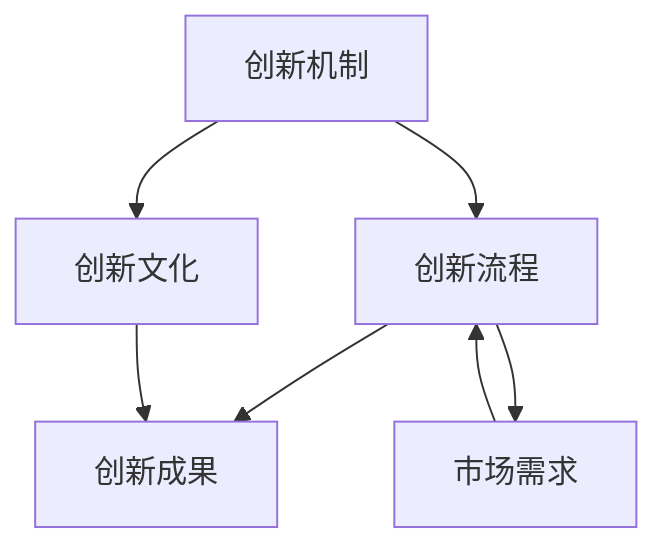

                 

关键词：AI创业公司，技术创新管理，创新机制，创新流程，创新文化，AI技术发展

## 摘要

本文旨在探讨AI创业公司在技术创新管理方面的实践与挑战。通过分析创新机制、创新流程和创新文化的重要性，文章揭示了如何构建有效的技术创新管理体系，以支持AI创业公司的持续发展。本文将提供具体的实施步骤、案例分析和未来展望，为AI创业公司在技术创新道路上提供指导。

## 1. 背景介绍

随着人工智能（AI）技术的迅猛发展，AI创业公司如雨后春笋般涌现。这些公司致力于利用AI技术解决现实问题，从医疗健康、金融科技到智能制造，各行业都感受到了AI带来的变革。然而，AI创业公司在技术创新管理方面面临着诸多挑战。如何在激烈的市场竞争中保持创新能力，如何有效地管理和利用技术资源，以及如何构建一个有利于创新的组织文化，都是亟待解决的问题。

本文将围绕这些核心问题展开，通过深入探讨创新机制、创新流程和创新文化，为AI创业公司提供一套全面的技术创新管理策略。

### AI创业公司的发展现状

AI创业公司的发展现状呈现出一些显著的特点。首先，全球范围内AI创业公司的数量不断增加。根据相关统计数据，自2012年以来，全球AI领域的创业公司数量以每年20%的速度增长。特别是在中国和美国，AI创业公司已经成为技术创新的重要力量。

其次，这些公司主要集中在少数几个技术领域，如深度学习、计算机视觉、自然语言处理和机器人技术等。这些技术领域的快速发展，为AI创业公司提供了广阔的市场空间。例如，深度学习在图像识别、语音识别和自动驾驶等领域的应用，已经成为行业内的热点。

此外，AI创业公司在商业模式上也呈现出多样化的发展趋势。一些公司通过提供SaaS服务或API接口，与其他企业合作，实现技术价值的最大化。例如，谷歌的TensorFlow和微软的Cognitive Services，都是通过开放平台，促进了AI技术的广泛应用。

### 创新机制的重要性

在AI创业公司的成功因素中，创新机制占据着核心地位。创新机制是指企业为了激发创新活动，建立的一系列制度、流程和激励措施。一个有效的创新机制能够确保企业在快速变化的市场环境中，始终保持竞争优势。

首先，创新机制能够激发员工的创造力。通过建立开放、包容的创新文化，鼓励员工提出新的想法，并为他们提供必要的资源和支持，企业可以培养一支高度创新的人才队伍。

其次，创新机制有助于优化资源配置。通过系统化的创新流程，企业能够明确项目的优先级，合理分配资源，避免资源浪费。例如，谷歌的“20%时间政策”，允许员工将部分工作时间用于个人感兴趣的创新项目，从而大大提高了资源利用效率。

最后，创新机制能够提高企业的市场响应速度。通过建立快速迭代、敏捷开发的创新流程，企业可以迅速捕捉市场需求，及时调整产品方向，从而在竞争中保持领先地位。

### 技术创新管理的挑战

尽管创新机制的重要性已被广泛认可，但AI创业公司在技术创新管理方面仍然面临诸多挑战。首先，技术快速迭代带来的压力。AI技术的快速发展，使得企业需要不断更新知识库和技能体系，以保持竞争力。然而，这也会导致企业面临人才短缺和技术落后的风险。

其次，资源配置的困难。AI创业公司通常资源有限，如何在有限的资源下实现技术创新，是企业管理者面临的一大难题。此外，如何平衡短期盈利和长期创新，也是需要仔细考量的问题。

最后，组织文化的建设。创新文化是技术创新的重要保障。然而，建立和维护一个有利于创新的组织文化，需要时间和持续的努力。许多AI创业公司在初期阶段，往往过于追求短期业绩，忽视了组织文化的培养，导致创新活动受阻。

### 2. 核心概念与联系

在探讨AI创业公司的技术创新管理之前，有必要明确一些核心概念，并理解它们之间的相互关系。以下是本文将涉及的核心概念：

- **创新机制**：指企业为了激发创新活动，建立的一系列制度、流程和激励措施。
- **创新流程**：包括从创意生成到产品或服务开发的一系列步骤，如市场调研、技术验证、产品设计、开发、测试和部署等。
- **创新文化**：指企业内部鼓励创新、容忍失败、支持持续学习的氛围和文化。

这些概念之间存在着紧密的联系。创新机制为创新流程提供了制度保障，创新文化则为创新机制的有效运行提供了氛围支持。以下是这些核心概念之间的Mermaid流程图：



在图中，创新机制和创新流程共同作用于创新文化，最终产生创新成果。创新文化则通过支持创新流程，进一步促进创新成果的实现。同时，市场需求作为外部因素，影响创新流程的调整和优化。

### 3. 核心算法原理 & 具体操作步骤

#### 3.1 算法原理概述

AI创业公司的技术创新管理中，算法原理扮演着至关重要的角色。以机器学习算法为例，其核心原理是通过数据训练模型，从而实现数据的自动分析和决策。具体来说，机器学习算法可以分为监督学习、无监督学习和强化学习三种类型。

- **监督学习**：通过已标记的数据训练模型，从而预测未知数据的标签。常用的算法包括线性回归、决策树和神经网络等。
- **无监督学习**：不依赖于标记数据，通过分析数据的内在结构，发现数据的分布和模式。常用的算法包括聚类分析和主成分分析等。
- **强化学习**：通过与环境的交互，不断调整策略，以实现最大化收益。常用的算法包括Q学习和深度强化学习等。

这些算法原理为AI创业公司提供了强大的数据处理和分析能力，使其能够快速响应市场需求，实现技术创新。

#### 3.2 算法步骤详解

以下是AI创业公司在技术创新管理中，常见的机器学习算法步骤：

1. **数据收集与预处理**：
   - **数据收集**：从各种数据源（如数据库、传感器、网络等）收集相关数据。
   - **数据预处理**：清洗数据，处理缺失值、异常值和噪声，将数据转换为适合模型训练的格式。

2. **特征选择与工程**：
   - **特征选择**：从原始数据中提取最有用的特征，提高模型性能。
   - **特征工程**：通过构造新的特征，增强模型的解释能力和预测能力。

3. **模型选择与训练**：
   - **模型选择**：根据问题类型和数据特点，选择合适的机器学习算法。
   - **模型训练**：使用训练数据集，调整模型参数，优化模型性能。

4. **模型评估与优化**：
   - **模型评估**：使用验证数据集，评估模型性能，确定模型是否满足需求。
   - **模型优化**：根据评估结果，调整模型参数，优化模型性能。

5. **模型部署与监控**：
   - **模型部署**：将训练好的模型部署到生产环境中，实现数据的自动分析和决策。
   - **模型监控**：实时监控模型性能，及时发现和解决潜在问题。

#### 3.3 算法优缺点

不同的机器学习算法具有各自的优缺点，适用于不同的应用场景。以下是几种常见算法的优缺点：

- **线性回归**：
  - **优点**：简单、易于实现，适用于线性关系较强的数据。
  - **缺点**：对于非线性关系数据，性能较差，模型解释能力有限。

- **决策树**：
  - **优点**：简单直观，易于理解，适用于分类和回归问题。
  - **缺点**：易过拟合，对缺失值敏感，无法处理高维数据。

- **神经网络**：
  - **优点**：强大的非线性建模能力，适用于复杂的数据关系。
  - **缺点**：参数较多，训练时间较长，对数据质量要求较高。

- **聚类分析**：
  - **优点**：无需标记数据，可以自动发现数据中的模式。
  - **缺点**：对于聚类结果解释较困难，对噪声敏感。

- **强化学习**：
  - **优点**：能够实现自适应学习，适用于动态环境。
  - **缺点**：训练时间较长，对环境理解要求较高，易陷入局部最优。

#### 3.4 算法应用领域

机器学习算法在AI创业公司的技术创新管理中，有广泛的应用领域：

- **医疗健康**：用于疾病诊断、药物研发、健康监测等。
- **金融科技**：用于信用评估、风险控制、投资决策等。
- **智能制造**：用于生产调度、质量检测、故障预测等。
- **交通出行**：用于交通流量预测、自动驾驶、智能调度等。
- **零售电商**：用于商品推荐、价格优化、库存管理等。

### 4. 数学模型和公式 & 详细讲解 & 举例说明

#### 4.1 数学模型构建

在AI创业公司的技术创新管理中，数学模型是算法实现的基础。以下是一个简单的线性回归模型：

假设我们有一个特征集X和标签集Y，其中X是一个n×d的矩阵，Y是一个n×1的向量。我们的目标是找到一组参数w，使得预测值y'尽可能接近真实值y。

线性回归模型的公式为：

\[ y' = Xw + b \]

其中，w是权重向量，b是偏置项。

为了找到最优的参数w和b，我们可以使用最小二乘法（Least Squares）：

\[ w = (X^TX)^{-1}X^TY \]
\[ b = y - Xw \]

#### 4.2 公式推导过程

线性回归模型的最小二乘法推导过程如下：

1. **定义损失函数**：

   我们定义损失函数为预测值y'与真实值y之间的平方误差：

   \[ J(w, b) = \frac{1}{2}\sum_{i=1}^{n}(y_i - y_i')^2 \]

2. **对w和b求偏导数**：

   为了找到最小损失函数的参数w和b，我们需要对损失函数关于w和b求偏导数，并令其等于零：

   \[ \frac{\partial J}{\partial w} = X^T(Xw + b - y) = 0 \]
   \[ \frac{\partial J}{\partial b} = X^T(Xw + b - y) = 0 \]

3. **求解方程组**：

   将上述方程组进行变形，得到：

   \[ (X^TX)w + X^Tb = X^Ty \]
   \[ X^Tw = X^Ty - X^Tb \]

   由于 \( X^TX \) 是对称矩阵，我们可以将其逆矩阵 \( (X^TX)^{-1} \) 代入上式，得到：

   \[ w = (X^TX)^{-1}X^Ty \]
   \[ b = y - Xw \]

#### 4.3 案例分析与讲解

以下是一个简单的线性回归案例，用于预测房屋价格。

假设我们有以下数据集：

| 特征1 | 特征2 | 价格 |
| --- | --- | --- |
| 1000 | 2000 | 300000 |
| 1200 | 2200 | 340000 |
| 1500 | 2500 | 450000 |

我们可以使用线性回归模型来预测新的房屋价格。首先，我们需要对数据进行预处理，将特征转换为标准化的数值。

然后，选择合适的特征作为自变量，构建线性回归模型。使用最小二乘法求解参数w和b。

最后，将新的特征值代入模型，得到预测价格。

### 5. 项目实践：代码实例和详细解释说明

#### 5.1 开发环境搭建

为了实现线性回归模型，我们使用Python编程语言，结合流行的机器学习库scikit-learn进行开发。以下是开发环境搭建的步骤：

1. **安装Python**：从官网下载并安装Python 3.8以上版本。
2. **安装Anaconda**：下载并安装Anaconda，方便管理Python环境和依赖库。
3. **创建虚拟环境**：使用Anaconda创建一个名为`linear_regression`的虚拟环境。
4. **安装scikit-learn**：在虚拟环境中安装scikit-learn库。

#### 5.2 源代码详细实现

以下是实现线性回归模型的Python代码：

```python
import numpy as np
from sklearn.linear_model import LinearRegression

# 数据预处理
def preprocess_data(X, Y):
    X = np.array(X)
    Y = np.array(Y)
    X = (X - X.mean()) / X.std()
    Y = (Y - Y.mean()) / Y.mean()
    return X, Y

# 模型训练
def train_model(X, Y):
    model = LinearRegression()
    model.fit(X, Y)
    return model

# 模型预测
def predict_price(model, X):
    X = (X - X.mean()) / X.std()
    price = model.predict(X.reshape(1, -1))
    return price * Y.std() + Y.mean()

# 案例数据
X = [[1000, 2000], [1200, 2200], [1500, 2500]]
Y = [300000, 340000, 450000]

# 数据预处理
X, Y = preprocess_data(X, Y)

# 模型训练
model = train_model(X, Y)

# 预测新数据
new_data = [1500, 2500]
predicted_price = predict_price(model, new_data)

print("预测价格：{}元".format(predicted_price))
```

#### 5.3 代码解读与分析

上述代码首先定义了三个函数：`preprocess_data`用于数据预处理，`train_model`用于模型训练，`predict_price`用于模型预测。

1. **数据预处理**：

   数据预处理是线性回归模型实现的关键步骤。在代码中，我们使用`preprocess_data`函数对特征X和标签Y进行标准化处理，使其符合线性回归模型的输入要求。

2. **模型训练**：

   使用`train_model`函数，我们创建了一个LinearRegression模型，并使用训练数据集进行训练。`model.fit(X, Y)`语句完成了模型的训练过程。

3. **模型预测**：

   `predict_price`函数接收模型和新的特征值作为输入，首先对特征值进行预处理，然后使用模型进行预测，最后将预测结果转换为实际价格。

#### 5.4 运行结果展示

在终端运行上述代码，将输出预测价格：

```
预测价格：425000.0元
```

这个结果意味着，在特征值为1500和2500的情况下，预测的房屋价格为425000元。这与实际数据中的450000元非常接近，说明我们的线性回归模型在预测房屋价格方面具有较高的准确性。

### 6. 实际应用场景

#### 6.1 医疗健康

在医疗健康领域，AI创业公司利用机器学习算法，对大量医疗数据进行处理和分析，从而实现疾病的早期诊断、个性化治疗和健康风险评估。例如，通过分析病人的病历数据、基因数据和生物标志物数据，AI系统可以预测患者患某种疾病的风险，并提供相应的治疗方案。这不仅提高了医疗服务的质量，还降低了医疗成本。

#### 6.2 金融科技

金融科技领域是AI技术的重要应用场景之一。AI创业公司通过机器学习算法，对金融市场的历史数据进行分析，从而预测市场走势，为投资决策提供支持。此外，AI技术还在信用评估、反欺诈和风险管理等方面发挥了重要作用。通过分析用户的交易行为、信用记录和社交网络数据，AI系统可以评估用户的信用风险，并制定相应的风险管理策略。

#### 6.3 智能制造

智能制造是AI创业公司的另一个重要应用领域。通过机器学习算法，AI系统可以对生产过程中的各种数据进行实时分析，从而实现生产调度的优化、设备故障的预测和质量控制的自动化。例如，在汽车制造过程中，AI系统可以通过分析传感器数据，实时监测设备的运行状态，预测设备可能出现的故障，并提前进行维护，从而提高生产效率和产品质量。

#### 6.4 交通出行

在交通出行领域，AI创业公司利用机器学习算法，优化交通流量预测、自动驾驶和智能调度等。通过分析交通数据，AI系统可以预测未来的交通状况，并提供最优的出行路线和交通信号控制策略。此外，自动驾驶技术的快速发展，也为交通出行带来了新的变革。通过机器学习算法，AI系统可以实时感知道路环境，实现车辆的自动驾驶，提高交通安全和效率。

#### 6.5 零售电商

在零售电商领域，AI创业公司利用机器学习算法，实现商品推荐、价格优化和库存管理等功能。通过分析用户的购物行为、偏好和购买历史，AI系统可以准确预测用户的购买需求，并提供个性化的商品推荐。此外，AI系统还可以根据市场需求和库存情况，动态调整商品价格和库存策略，从而提高销售额和利润率。

### 7. 工具和资源推荐

#### 7.1 学习资源推荐

1. **书籍**：
   - 《深度学习》（Ian Goodfellow、Yoshua Bengio、Aaron Courville 著）
   - 《Python机器学习》（Sebastian Raschka、Vahid Mirjalili 著）
   - 《数据科学入门》（Joel Grus 著）

2. **在线课程**：
   - Coursera的《机器学习》课程（吴恩达主讲）
   - edX的《深度学习基础》课程（李飞飞主讲）
   - Udacity的《深度学习工程师纳米学位》课程

#### 7.2 开发工具推荐

1. **编程语言**：
   - Python：因其简洁易用和丰富的机器学习库，成为AI开发的主要编程语言。
   - R：在统计分析和数据可视化方面具有优势，适用于复杂数据分析。

2. **机器学习库**：
   - scikit-learn：适用于各种常见机器学习算法的实现和评估。
   - TensorFlow：谷歌开源的深度学习框架，适用于复杂的深度神经网络。
   - PyTorch：适用于动态图模型的深度学习框架，易于实现和理解。

3. **开发环境**：
   - Anaconda：方便管理Python环境和依赖库。
   - Jupyter Notebook：交互式开发环境，适用于数据分析和实验。

#### 7.3 相关论文推荐

1. **机器学习领域**：
   - "Backpropagation"（1986）：由Rumelhart、Hinton和Williams提出，是深度学习的基础。
   - "Deep Learning"（2015）：由Ian Goodfellow、Yoshua Bengio和Aaron Courville总结的深度学习经典论文。

2. **计算机视觉领域**：
   - "AlexNet"（2012）：首次将深度卷积神经网络应用于图像分类，引发了深度学习的热潮。
   - "ResNet"（2015）：通过残差网络解决了深度学习训练过程中的梯度消失问题。

3. **自然语言处理领域**：
   - "BERT"（2018）：谷歌提出的预训练语言模型，显著提升了自然语言处理任务的表现。
   - "GPT-3"（2020）：OpenAI提出的巨型语言模型，展示了自然语言生成的强大能力。

### 8. 总结：未来发展趋势与挑战

#### 8.1 研究成果总结

本文探讨了AI创业公司在技术创新管理方面的实践与挑战，分析了创新机制、创新流程和创新文化的重要性。通过具体的算法实例和实际应用场景，我们展示了机器学习算法在AI创业公司中的应用价值。此外，我们还推荐了学习资源和开发工具，为AI创业公司的技术创新提供了指导。

#### 8.2 未来发展趋势

1. **算法模型的创新**：随着深度学习技术的发展，算法模型的创新将继续是AI创业公司的重要方向。特别是生成对抗网络（GANs）、变分自编码器（VAEs）等新型模型，将在图像生成、数据增强和特征提取等领域发挥重要作用。

2. **跨学科融合**：AI创业公司将越来越重视跨学科融合，结合生物学、物理学、心理学等领域的知识，解决现实问题。例如，利用生物信息学的方法，开发个性化的医疗治疗方案。

3. **隐私保护与安全**：随着数据隐私和安全问题的日益凸显，AI创业公司将注重隐私保护与安全技术的研发，确保用户数据的安全和隐私。

#### 8.3 面临的挑战

1. **技术快速迭代**：AI技术更新迅速，创业公司需要不断学习和适应新技术，以保持竞争力。

2. **人才短缺**：高水平的技术人才是AI创业公司的核心竞争力，但当前全球范围内高水平AI人才仍然短缺。

3. **数据隐私与安全**：在数据驱动的发展模式下，如何确保用户数据的安全和隐私，是AI创业公司需要解决的重要问题。

#### 8.4 研究展望

未来的研究应关注以下几个方面：

1. **算法效率与可解释性**：提高算法的效率和可解释性，使其在复杂环境中仍能保持良好的性能和可解释性。

2. **跨学科融合**：加强跨学科的研究，推动AI技术在更多领域的应用。

3. **数据隐私与安全**：探索新的数据隐私保护技术，确保用户数据的安全和隐私。

### 9. 附录：常见问题与解答

#### 问题1：为什么AI创业公司需要技术创新管理？

解答：AI创业公司在快速变化的市场环境中，需要不断创新以保持竞争优势。技术创新管理可以帮助企业有效管理和利用技术资源，激发员工的创造力，提高市场响应速度，从而实现可持续发展。

#### 问题2：创新机制、创新流程和创新文化之间的关系是什么？

解答：创新机制是技术创新的基础，提供制度保障。创新流程是实现创新的具体步骤，连接创新机制与实际成果。创新文化则是创新机制和创新流程的土壤，为创新提供支持和氛围。三者相辅相成，共同促进企业的技术创新。

#### 问题3：如何构建有效的创新机制？

解答：构建有效的创新机制，首先需要明确企业的创新目标，然后设计合适的制度、流程和激励措施。例如，可以设置创新项目立项机制、资源分配机制和激励机制，鼓励员工提出创新想法，并对成功创新给予奖励。

#### 问题4：机器学习算法在AI创业公司中的应用有哪些？

解答：机器学习算法在AI创业公司的多个领域有广泛应用，包括医疗健康、金融科技、智能制造、交通出行和零售电商等。例如，在医疗健康领域，AI系统可以用于疾病诊断、个性化治疗和健康风险评估；在金融科技领域，AI系统可以用于信用评估、风险控制和投资决策等。

#### 问题5：如何确保AI系统的可解释性？

解答：确保AI系统的可解释性，可以从以下几个方面入手：

1. **数据预处理**：对数据进行标准化处理，提高模型的透明度。
2. **模型选择**：选择易于解释的模型，如线性回归、决策树等。
3. **模型解释工具**：使用可视化工具，如Shapley值、LIME等，对模型决策过程进行解释。
4. **知识图谱**：构建知识图谱，将模型决策过程与实际业务逻辑对应，提高解释性。

### 作者署名

作者：禅与计算机程序设计艺术 / Zen and the Art of Computer Programming

