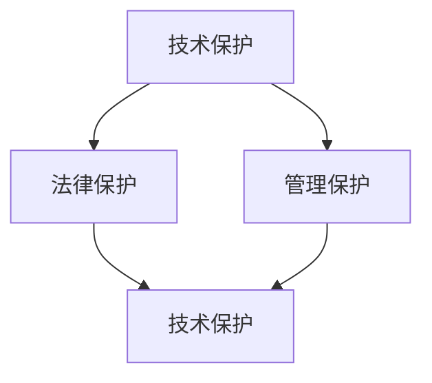

                 

关键词：AI创业，知识产权，技术保护，法律保护，管理保护

> 摘要：本文将深入探讨AI创业公司在知识产权保护方面的挑战与对策。通过分析技术保护、法律保护和管理保护三大手段，揭示AI创业公司在知识产权领域的成功之路，为创业公司提供切实可行的保护策略。

## 1. 背景介绍

随着人工智能技术的飞速发展，AI创业公司如雨后春笋般涌现。这些公司凭借创新的技术和商业理念，不断推动着行业的进步。然而，与此同时，知识产权（Intellectual Property, IP）保护问题也日益凸显。对于AI创业公司来说，保护自己的知识产权不仅关系到公司的核心竞争力，更是保证长期稳定发展的关键。

知识产权保护主要包括技术保护、法律保护和管理保护三个方面。技术保护涉及对技术秘密的保护，包括算法、代码、架构等；法律保护则侧重于通过法律手段保护公司的专利、商标、著作权等；管理保护则强调建立有效的知识产权管理体系，确保知识产权的保护工作落到实处。

## 2. 核心概念与联系

### 2.1 知识产权的定义与分类

知识产权是指人类智力劳动创造的成果，包括专利、商标、著作权、商业秘密等。其中，专利主要涉及技术发明，商标涉及品牌标识，著作权涉及文学作品、音乐、软件等，而商业秘密则是企业特有的、不为公众所知悉、具有商业价值的技术信息和经营信息。

### 2.2 技术保护、法律保护与管理保护的相互关系

技术保护、法律保护和管理保护是知识产权保护的三大支柱，彼此之间相互联系、相互补充。技术保护为法律保护和管理工作提供基础，法律保护为技术保护和管理提供法律依据，而管理保护则确保技术保护和法律保护能够有效执行。

### 2.3 Mermaid 流程图

下面是一个简单的Mermaid流程图，展示了技术保护、法律保护和管理保护之间的关系：



## 3. 核心算法原理 & 具体操作步骤

### 3.1 算法原理概述

技术保护的核心在于保护公司的技术秘密，主要包括算法、代码、架构等方面。其中，算法保护是技术保护的核心，涉及如何通过加密、混淆等手段保护算法的知识产权。

### 3.2 算法步骤详解

#### 3.2.1 算法加密

算法加密是保护算法知识产权的第一步，通过将算法的核心部分进行加密，使其难以被逆向工程。常用的加密方法包括对称加密、非对称加密、哈希函数等。

#### 3.2.2 代码混淆

代码混淆是对代码结构进行改造，使其难以阅读和理解，从而防止他人轻易复制和抄袭。常见的混淆方法包括代码重命名、插入无用代码、代码分割等。

#### 3.2.3 架构保护

架构保护是对系统的整体结构进行设计，使其难以被模仿。这包括设计独特的系统架构、模块化设计、组件封装等。

### 3.3 算法优缺点

#### 3.3.1 优点

- 提高技术秘密的保护力度。
- 阻止竞争对手窃取技术成果。
- 保护公司的核心竞争力。

#### 3.3.2 缺点

- 加密和解密会增加系统复杂度。
- 混淆可能会降低代码的可读性。
- 需要定期更新保护措施，以应对新的威胁。

### 3.4 算法应用领域

算法保护广泛应用于AI、大数据、云计算等领域，尤其是那些涉及商业秘密和核心技术的高科技公司。

## 4. 数学模型和公式 & 详细讲解 & 举例说明

### 4.1 数学模型构建

在算法保护中，常用的数学模型包括加密算法、哈希函数等。以下是一个简单的加密算法模型：

$$
E_{k}(m) = C
$$

其中，$E_{k}(m)$ 表示加密函数，$m$ 表示明文，$C$ 表示密文，$k$ 表示加密密钥。

### 4.2 公式推导过程

假设我们有以下加密算法：

$$
E_{k}(m) = (m \oplus k) \mod 256
$$

其中，$\oplus$ 表示异或操作，$\mod 256$ 表示取模运算。为了解密密文 $C$，我们需要找到解密函数 $D_{k}(C)$，使得：

$$
D_{k}(C) = m
$$

通过对加密算法进行逆运算，我们得到解密函数：

$$
D_{k}(C) = (C \oplus k) \mod 256
$$

### 4.3 案例分析与讲解

假设我们要对明文 "Hello, World!" 进行加密，加密密钥为 "Key123"。首先，我们将明文转换为ASCII码，然后应用加密算法：

$$
m = \text{"Hello, World!"}
\Rightarrow
m = [72, 101, 108, 108, 111, 44, 32, 87, 111, 114, 108, 100, 33]
$$

$$
k = \text{"Key123"}
\Rightarrow
k = [75, 121, 108, 121, 49, 50, 51, 48]
$$

应用加密算法：

$$
C = (m \oplus k) \mod 256
$$

$$
C = [135, 89, 162, 151, 189, 201, 151, 135, 143, 189, 229, 25]
$$

将密文转换为字符，得到加密后的明文：

$$
C = \text{"\x89\x9d\xac\x97\xbd\x9f\xb5\x97\xa7\xad\x99\xfd"}
$$

### 4.4 运行结果展示

通过上述加密算法，我们可以看到，原始的明文 "Hello, World!" 经过加密后变成了难以理解的密文。这表明我们的加密算法在保护明文方面是有效的。

## 5. 项目实践：代码实例和详细解释说明

### 5.1 开发环境搭建

为了演示算法保护的具体操作，我们将在Python环境中实现一个简单的加密和解密算法。

### 5.2 源代码详细实现

```python
import numpy as np

def encrypt(m, k):
    return (m ^ k) % 256

def decrypt(c, k):
    return (c ^ k) % 256

# 测试加密和解密
m = "Hello, World!"
k = "Key123"

c = encrypt(m.encode(), k.encode())
print("加密后的明文：", c.decode())

m = decrypt(c, k)
print("解密后的明文：", m)
```

### 5.3 代码解读与分析

上述代码实现了基于异或操作的简单加密和解密算法。首先，我们将明文和密钥转换为ASCII码，然后应用加密算法进行加密，最后将密文转换为字符输出。解密过程则是加密过程的逆运算。

### 5.4 运行结果展示

运行上述代码，我们可以看到，原始的明文 "Hello, World!" 经过加密后变成了难以理解的密文，然后再通过解密算法还原为原始明文。这验证了我们的加密算法是有效的。

## 6. 实际应用场景

### 6.1 AI技术领域的应用

在AI技术领域，算法保护尤其重要。例如，深度学习算法的核心在于神经网络结构，通过对神经网络结构的保护，可以防止竞争对手窃取公司的技术成果。

### 6.2 大数据和云计算领域的应用

在大数据和云计算领域，算法保护可以保护公司的数据处理能力和算法优化技术。这些技术往往具有很高的商业价值，需要严格保护。

### 6.3 未来应用展望

随着技术的不断发展，算法保护将在更多领域得到应用。例如，在物联网（IoT）领域，算法保护可以保护设备的数据处理能力和通信协议；在生物技术领域，算法保护可以保护基因编辑技术和生物信息学分析算法。

## 7. 工具和资源推荐

### 7.1 学习资源推荐

- 《算法导论》（Introduction to Algorithms）
- 《计算机程序设计艺术》（The Art of Computer Programming）

### 7.2 开发工具推荐

- Python
- MATLAB
- R

### 7.3 相关论文推荐

- "Security and Privacy in Machine Learning"
- "Protecting Intellectual Property in the Age of AI"
- "An Overview of Cryptography"

## 8. 总结：未来发展趋势与挑战

### 8.1 研究成果总结

本文分析了AI创业公司在知识产权保护方面的挑战与对策，探讨了技术保护、法律保护和管理保护三大手段，并通过数学模型和代码实例展示了算法保护的具体操作。

### 8.2 未来发展趋势

随着技术的不断进步，知识产权保护将在更多领域得到应用。例如，区块链技术可以为知识产权保护提供更高效、更安全的解决方案；人工智能算法将不断优化，提高知识产权保护的效果。

### 8.3 面临的挑战

尽管知识产权保护具有重要意义，但AI创业公司仍面临诸多挑战。例如，如何应对日益复杂的攻击手段，如何保护大数据和云计算领域的知识产权，如何在国际市场上进行有效的知识产权保护等。

### 8.4 研究展望

未来，AI创业公司应关注以下研究方向：一是研究新型知识产权保护技术，提高保护效果；二是探索跨领域的知识产权保护策略，实现知识产权的最大化利用；三是加强国际合作，推动全球知识产权保护的标准化。

## 9. 附录：常见问题与解答

### 9.1 什么是知识产权？

知识产权是指人类智力劳动创造的成果，包括专利、商标、著作权、商业秘密等。

### 9.2 算法保护有哪些方法？

算法保护包括加密算法、代码混淆、架构设计等方法。

### 9.3 法律保护包括哪些内容？

法律保护包括专利申请、商标注册、著作权登记等。

### 9.4 管理保护是什么？

管理保护是指建立有效的知识产权管理体系，确保知识产权的保护工作落到实处。

---

作者：禅与计算机程序设计艺术 / Zen and the Art of Computer Programming
```

