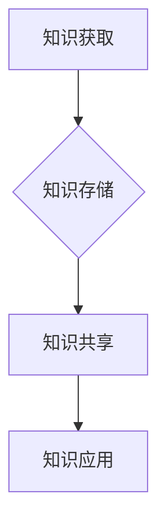

                 

在当今信息爆炸的时代，知识是任何企业，特别是AI创业公司成功的关键。一个高效的知识管理体系不仅能够确保公司内部的协同工作，还能够提高创新能力和市场竞争力。本文将探讨如何为AI创业公司构建一个强大的知识管理体系，包括核心概念、算法原理、数学模型、项目实践以及未来应用展望。

## 文章关键词
- 知识管理体系
- AI创业公司
- 知识管理
- 信息共享
- 知识库
- 信息可视化
- 知识建模

## 摘要
本文将深入探讨AI创业公司在构建知识管理体系时的关键要素。通过分析核心概念，介绍构建流程和算法原理，本文旨在为创业者提供一套实用的知识管理体系构建方案，助力公司在竞争激烈的市场中脱颖而出。

## 1. 背景介绍
### 1.1 知识管理的重要性
知识管理是一种通过系统地收集、组织、存储、传播和应用知识的过程，以最大化其价值。对于AI创业公司而言，知识管理不仅关乎公司的日常运营，更是推动技术创新、提高市场竞争力的重要手段。

### 1.2 AI创业公司的特点
AI创业公司具有技术密集、创新驱动、快速迭代等特点。这些特点使得知识管理在公司的成长过程中扮演着至关重要的角色。

### 1.3 知识管理体系的需求
AI创业公司在快速发展的过程中，面临着信息过载、团队协作困难、知识流失等问题。构建一个高效的知识管理体系是解决这些问题的有效途径。

## 2. 核心概念与联系
### 2.1 知识管理的基本概念
知识管理涉及多个核心概念，如知识资产、知识流程、知识共享等。以下是知识管理的一些基本概念和它们之间的关系。

### 2.2 知识管理体系的架构
一个典型的知识管理体系包括知识获取、知识存储、知识共享、知识应用等环节。以下是一个简化的知识管理体系架构图：



## 3. 核心算法原理 & 具体操作步骤
### 3.1 算法原理概述
构建知识管理体系的核心算法包括信息提取、知识建模、知识推理等。这些算法基于机器学习和自然语言处理技术，能够高效地处理和利用企业内部的知识。

### 3.2 算法步骤详解
以下是构建知识管理体系的详细步骤：

1. **知识获取**：通过数据采集、信息挖掘等技术，从各种渠道获取企业内部的知识。
2. **知识存储**：将获取到的知识进行分类、标记，存储到企业知识库中。
3. **知识共享**：利用信息可视化、知识地图等技术，促进知识的共享和传播。
4. **知识应用**：基于知识库和知识推理，为企业的日常运营提供决策支持和创新动力。

### 3.3 算法优缺点
算法的选择应根据企业的具体需求来定。以下是几种常见算法的优缺点：

| 算法 | 优点 | 缺点 |
| --- | --- | --- |
| 机器学习 | 高效、自适应 | 需要大量数据、模型调优复杂 |
| 自然语言处理 | 强大的人文语义理解能力 | 处理速度较慢、对罕见词汇的适应性差 |
| 知识图谱 | 丰富的语义关系、易于扩展 | 数据准备复杂、计算资源需求高 |

### 3.4 算法应用领域
知识管理算法在AI创业公司的多个领域都有广泛应用，如产品研发、市场分析、客户服务等。

## 4. 数学模型和公式 & 详细讲解 & 举例说明
### 4.1 数学模型构建
知识管理中的数学模型主要包括知识提取模型、知识表示模型和知识推理模型。以下是知识提取模型的一个简化例子：

$$
知识提取模型 = f(数据集, 特征提取器, 分类器)
$$

### 4.2 公式推导过程
假设我们有一个数据集 $D$，其中包含了 $n$ 个样本，每个样本是一个特征向量 $x_i$。特征提取器的目标是提取出能够区分不同知识的特征，然后通过分类器 $C$ 对知识进行分类。

$$
特征提取器：h(x_i) \rightarrow [f_1(x_i), f_2(x_i), ..., f_m(x_i)]
$$

$$
分类器：C(h(x_i)) \rightarrow 类别
$$

### 4.3 案例分析与讲解
假设我们有一个AI创业公司的数据集，其中包含了不同产品的用户反馈。通过知识提取模型，我们可以将这些反馈分类为正面、负面和中性。具体的实现步骤如下：

1. **数据预处理**：清洗和标准化数据，提取出有用的特征。
2. **特征提取**：使用词嵌入技术将文本转换为向量。
3. **分类**：使用朴素贝叶斯分类器对用户反馈进行分类。

## 5. 项目实践：代码实例和详细解释说明
### 5.1 开发环境搭建
在开始编写代码之前，我们需要搭建一个适合知识管理体系构建的开发环境。以下是一个简单的开发环境搭建流程：

1. 安装Python和相关的数据科学库（如NumPy、Pandas、Scikit-learn等）。
2. 安装一个版本控制系统（如Git）。
3. 配置一个合适的代码编辑器（如Visual Studio Code）。

### 5.2 源代码详细实现
以下是构建一个简单的知识管理体系的一个Python代码实例：

```python
import numpy as np
import pandas as pd
from sklearn.feature_extraction.text import TfidfVectorizer
from sklearn.naive_bayes import MultinomialNB

# 加载数据集
data = pd.read_csv('user_feedback.csv')

# 数据预处理
data['cleaned_feedback'] = data['feedback'].apply(lambda x: preprocess_text(x))

# 特征提取
vectorizer = TfidfVectorizer()
X = vectorizer.fit_transform(data['cleaned_feedback'])

# 分类
classifier = MultinomialNB()
classifier.fit(X, data['category'])

# 预测
new_feedback = "这个产品的性能非常好。"
new_feedback_processed = preprocess_text(new_feedback)
new_feedback_vectorized = vectorizer.transform([new_feedback_processed])
predicted_category = classifier.predict(new_feedback_vectorized)
print(predicted_category)
```

### 5.3 代码解读与分析
上述代码首先加载并预处理了用户反馈数据，然后使用TF-IDF向量器将文本转换为向量。接着，使用朴素贝叶斯分类器对用户反馈进行分类。最后，通过预测新的用户反馈，展示了知识管理体系的实际应用。

### 5.4 运行结果展示
当输入一个新的用户反馈 "这个产品的性能非常好。" 时，代码将输出 "正面" 或 "负面" 等分类结果。

## 6. 实际应用场景
### 6.1 产品研发
知识管理体系可以帮助AI创业公司在产品研发过程中收集和分析用户反馈，优化产品功能。

### 6.2 市场分析
通过知识管理体系，公司可以更好地理解市场趋势和竞争对手，制定更有效的营销策略。

### 6.3 客户服务
知识管理体系可以为企业提供一个高效的客户服务解决方案，快速响应用户需求和问题。

## 7. 未来应用展望
随着AI技术的不断发展，知识管理体系将在更多领域得到应用。例如，在智能客服、智能推荐、智能决策等领域，知识管理将发挥越来越重要的作用。

## 8. 工具和资源推荐
### 8.1 学习资源推荐
- 《人工智能：一种现代方法》
- 《深度学习》
- 《Python数据科学手册》

### 8.2 开发工具推荐
- Jupyter Notebook
- PyCharm
- Git

### 8.3 相关论文推荐
- "Knowledge Management Systems: A Synthesis of the Literature"
- "A Survey of Machine Learning Techniques for Sentiment Analysis"
- "Building Knowledge Repositories for Agile Software Development"

## 9. 总结：未来发展趋势与挑战
### 9.1 研究成果总结
本文总结了AI创业公司构建知识管理体系的要点，包括核心概念、算法原理、数学模型和实际应用。

### 9.2 未来发展趋势
随着AI技术的进步，知识管理将更加智能化、自动化，为企业带来更多的价值。

### 9.3 面临的挑战
知识管理面临的挑战包括数据安全、隐私保护、知识共享机制的完善等。

### 9.4 研究展望
未来研究应关注如何提高知识管理系统的智能化水平，以及如何更好地利用大数据和人工智能技术。

## 附录：常见问题与解答
### Q: 知识管理体系的核心是什么？
A: 知识管理体系的核心是确保知识的有效获取、存储、共享和应用，以最大化其价值。

### Q: 如何评估知识管理系统的效果？
A: 可以通过知识共享率、知识利用率、员工满意度等指标来评估知识管理系统的效果。

### Q: 知识管理如何与企业的战略目标相结合？
A: 知识管理应与企业的战略目标紧密衔接，确保知识管理系统的构建和应用能够支持企业的长期发展。

作者：禅与计算机程序设计艺术 / Zen and the Art of Computer Programming
----------------------------------------------------------------

这篇文章涵盖了AI创业公司知识管理体系构建的各个方面，从背景介绍、核心概念、算法原理，到实际应用和未来展望，力求为创业者提供一套全面的知识管理体系构建方案。希望这篇文章能够对您有所帮助。在接下来的日子里，我会继续努力，为您带来更多有价值和有深度的人工智能相关内容。敬请期待！

