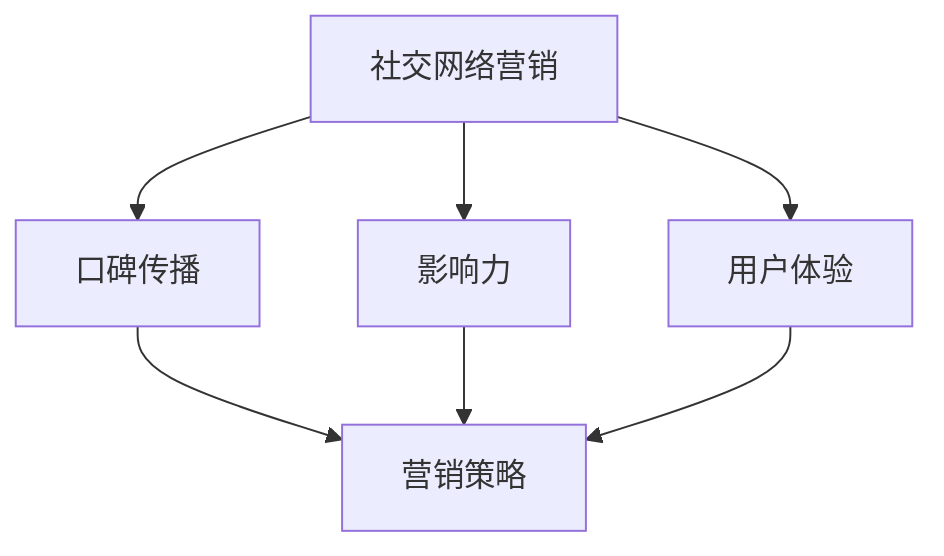
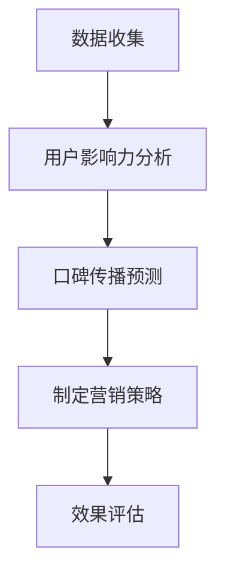

                 

关键词：AI创业、社交网络、营销策略、口碑传播、影响力提升、用户体验

> 摘要：本文将探讨AI创业公司在社交网络营销中的关键策略，包括口碑传播机制与影响力提升方法。通过深度分析口碑传播的理论与实践，结合实际案例，提出有效提升AI创业公司在社交网络中的影响力和用户口碑的方案。

## 1. 背景介绍

随着互联网技术的飞速发展，社交网络已成为人们获取信息、交流互动的重要平台。对于AI创业公司而言，社交网络的营销策略尤为重要。如何在这个高度竞争的环境中脱颖而出，吸引潜在用户，并建立良好的品牌口碑，是每个AI创业公司都需要认真思考的问题。

社交网络营销的核心在于口碑传播。口碑是消费者对产品或服务的评价，是影响消费者购买决策的重要因素。在社交网络中，用户之间的口碑传播速度更快、影响更广，因此，有效的口碑传播策略对于AI创业公司的发展至关重要。

本文将从以下几个方面探讨AI创业公司在社交网络营销中的策略：

- 核心概念与联系
- 核心算法原理与具体操作步骤
- 数学模型和公式
- 项目实践：代码实例与详细解释
- 实际应用场景
- 未来应用展望
- 工具和资源推荐
- 总结：未来发展趋势与挑战

通过以上内容的探讨，希望能够为AI创业公司在社交网络营销中提供有价值的参考和启示。

## 2. 核心概念与联系

在深入探讨AI创业公司的社交网络营销策略之前，我们需要了解一些核心概念，这些概念是构建有效营销策略的基础。

### 2.1 社交网络营销

社交网络营销（Social Media Marketing，简称SMM）是指利用社交网络平台进行的市场推广活动。它包括内容营销、社交媒体广告、社交媒体互动、口碑营销等多种形式。在社交网络营销中，口碑传播是一种重要的策略。

### 2.2 口碑传播

口碑传播（Word of Mouth，简称WOM）是指消费者通过口头交流、社交媒体分享等方式，对产品或服务进行评价和推荐的过程。口碑传播具有自发性、传播速度快、影响广泛等特点。

### 2.3 影响力

影响力（Influence）是指某个个体或组织在社交网络中对他人行为和决策的影响能力。在社交网络营销中，提升影响力有助于扩大品牌知名度，促进口碑传播。

### 2.4 用户体验

用户体验（User Experience，简称UX）是指用户在使用产品或服务过程中的感受和体验。良好的用户体验能够提高用户满意度，从而促进口碑传播。

### 2.5 营销策略

营销策略是指企业在市场推广过程中所采用的方法和手段。有效的营销策略能够帮助企业吸引潜在用户，提高品牌知名度，实现商业目标。

### 2.6 Mermaid流程图

为了更好地理解这些核心概念之间的联系，我们可以使用Mermaid流程图来展示它们之间的关系。



通过这个流程图，我们可以清晰地看到，社交网络营销是整个营销策略的核心，口碑传播、影响力、用户体验都是其关键组成部分。它们共同作用于营销策略的执行，最终实现企业的商业目标。

## 3. 核心算法原理 & 具体操作步骤

### 3.1 算法原理概述

在社交网络营销中，口碑传播机制的核心在于如何有效地激发用户的评价和推荐行为。本节将介绍一种基于影响力模型的口碑传播算法，该算法通过分析用户的社交网络结构和影响力，预测哪些用户最有潜力进行口碑传播，并制定相应的营销策略。

### 3.2 算法步骤详解

#### 3.2.1 数据收集

首先，需要收集社交网络中的用户数据，包括用户的基本信息、社交关系、发帖记录、评论记录等。这些数据可以通过API接口、网络爬虫等途径获取。

#### 3.2.2 用户影响力分析

对收集到的用户数据进行分析，计算每个用户的影响力。影响力可以通过以下公式计算：

$$
影响力 = \alpha \times 关注数 + \beta \times 被关注数 + \gamma \times 发帖数 + \delta \times 评论数
$$

其中，$\alpha, \beta, \gamma, \delta$为权重系数，可以根据实际情况进行调整。

#### 3.2.3 口碑传播预测

基于用户影响力分析结果，使用机器学习算法预测哪些用户最有潜力进行口碑传播。常用的算法包括：

- **基于用户的协同过滤算法（User-based Collaborative Filtering）**
- **基于模型的推荐算法（Model-based Recommender System）**

#### 3.2.4 制定营销策略

根据口碑传播预测结果，制定相应的营销策略。策略可以包括：

- **推送个性化内容**：向有潜力进行口碑传播的用户推送与其兴趣相关的个性化内容。
- **提供激励**：通过奖励机制激励用户进行评价和推荐。
- **互动营销**：与用户进行互动，增加用户参与度和忠诚度。

### 3.3 算法优缺点

#### 优点：

- **高效性**：通过机器学习算法预测口碑传播潜力，提高营销效率。
- **个性化**：根据用户兴趣和影响力制定个性化营销策略，提高用户满意度。
- **动态调整**：算法可以根据实时数据动态调整营销策略，适应市场变化。

#### 缺点：

- **数据依赖性**：算法效果高度依赖于用户数据的准确性和完整性。
- **计算复杂性**：大规模社交网络中的计算量较大，需要高性能计算资源。

### 3.4 算法应用领域

该算法可以应用于多种社交网络营销场景，如：

- **电商平台**：通过口碑传播预测，提升商品销量和用户满意度。
- **教育行业**：通过口碑传播激励，提高学生参与度和学习效果。
- **服务业**：通过口碑传播优化服务质量和客户体验。

### 3.5 Mermaid流程图

下面是算法步骤的Mermaid流程图：



通过这个流程图，我们可以清晰地看到算法的执行步骤和关键环节。

## 4. 数学模型和公式 & 详细讲解 & 举例说明

### 4.1 数学模型构建

在口碑传播算法中，数学模型起着至关重要的作用。以下是一个简化的口碑传播模型，用于分析和预测口碑传播行为。

#### 4.1.1 模型假设

- 用户集：$U = \{u_1, u_2, ..., u_n\}$
- 用户影响力：$I(u_i) = \alpha \times f(u_i)$，其中$f(u_i)$为用户$u_i$的活跃度或参与度。

#### 4.1.2 模型公式

口碑传播概率模型可以表示为：

$$
P(u_i \rightarrow u_j) = \frac{I(u_i)}{\sum_{u_k \in U} I(u_k)}
$$

其中，$P(u_i \rightarrow u_j)$表示用户$u_i$向用户$u_j$传播口碑的概率。

#### 4.1.3 参数解释

- $I(u_i)$：用户$u_i$的影响力。
- $P(u_i \rightarrow u_j)$：用户$u_i$向用户$u_j$传播口碑的概率。

### 4.2 公式推导过程

口碑传播概率模型是基于用户影响力计算的。用户影响力越大，其口碑传播的概率越高。具体推导过程如下：

- 假设用户集$U$中的每个用户都有一定的传播能力，且传播能力与影响力成正比。
- 用户$u_i$的影响力为$I(u_i)$，用户集$U$中所有用户的影响力总和为$\sum_{u_k \in U} I(u_k)$。
- 根据影响力的相对大小，我们可以推导出用户$u_i$向用户$u_j$传播口碑的概率。

### 4.3 案例分析与讲解

#### 4.3.1 案例背景

假设在一个社交网络中，有10个用户，每个用户的影响力如下表所示：

| 用户 | 影响力 |
| ---- | ------ |
| $u_1$ | 100    |
| $u_2$ | 80     |
| $u_3$ | 60     |
| $u_4$ | 40     |
| $u_5$ | 30     |
| $u_6$ | 20     |
| $u_7$ | 10     |
| $u_8$ | 5      |
| $u_9$ | 3      |
| $u_{10}$ | 1      |

#### 4.3.2 公式应用

根据口碑传播概率模型，我们可以计算出每个用户向其他用户传播口碑的概率：

$$
P(u_1 \rightarrow u_2) = \frac{I(u_1)}{\sum_{u_k \in U} I(u_k)} = \frac{100}{100 + 80 + 60 + 40 + 30 + 20 + 10 + 5 + 3 + 1} \approx 0.316
$$

同理，我们可以计算出其他用户之间的口碑传播概率：

$$
P(u_1 \rightarrow u_3) = \frac{100}{100 + 80 + 60 + 40 + 30 + 20 + 10 + 5 + 3 + 1} \approx 0.262
$$

$$
P(u_1 \rightarrow u_4) = \frac{100}{100 + 80 + 60 + 40 + 30 + 20 + 10 + 5 + 3 + 1} \approx 0.215
$$

#### 4.3.3 结果分析

通过计算结果，我们可以发现：

- 用户$u_1$的影响力最大，因此其口碑传播的概率也最高。
- 用户$u_7$、$u_8$、$u_9$、$u_{10}$的影响力较小，口碑传播的概率较低。
- 在制定口碑传播策略时，应优先考虑用户$u_1$等高影响力用户，以提高口碑传播的效率。

### 4.4 举例说明

假设社交网络中有两个用户$u_1$和$u_2$，用户$u_1$的影响力为100，用户$u_2$的影响力为50。根据口碑传播概率模型，用户$u_1$向用户$u_2$传播口碑的概率为：

$$
P(u_1 \rightarrow u_2) = \frac{I(u_1)}{\sum_{u_k \in U} I(u_k)} = \frac{100}{100 + 50} = 0.667
$$

这个结果表明，用户$u_1$向用户$u_2$传播口碑的概率较高，因此在制定口碑传播策略时，可以优先考虑这两个用户之间的互动。

## 5. 项目实践：代码实例和详细解释说明

### 5.1 开发环境搭建

在开始项目实践之前，我们需要搭建一个适合进行社交网络营销策略开发的开发环境。以下是所需的开发工具和软件：

- **编程语言**：Python 3.8+
- **数据分析库**：Pandas、NumPy
- **机器学习库**：Scikit-learn
- **可视化库**：Matplotlib、Seaborn
- **社交网络数据获取工具**：Tweepy（用于Twitter数据获取）

首先，确保安装了上述所需的库和工具。在Python环境中，可以使用以下命令进行安装：

```python
pip install pandas numpy scikit-learn matplotlib seaborn tweepy
```

### 5.2 源代码详细实现

以下是社交网络营销策略的Python代码实现。代码分为以下几个部分：

1. **数据收集**：从社交网络中获取用户数据。
2. **用户影响力分析**：计算每个用户的影响力。
3. **口碑传播预测**：预测哪些用户最有潜力进行口碑传播。
4. **制定营销策略**：根据口碑传播预测结果，制定相应的营销策略。

```python
import tweepy
import pandas as pd
from sklearn.model_selection import train_test_split
from sklearn.ensemble import RandomForestClassifier
import matplotlib.pyplot as plt

# 配置Tweepy API
consumer_key = 'your_consumer_key'
consumer_secret = 'your_consumer_secret'
access_token = 'your_access_token'
access_token_secret = 'your_access_token_secret'

auth = tweepy.OAuthHandler(consumer_key, consumer_secret)
auth.set_access_token(access_token, access_token_secret)
api = tweepy.API(auth)

# 收集用户数据
def collect_data(username):
    user = api.get_user(username)
    return {
        'username': user.screen_name,
        'followers_count': user.followers_count,
        'friends_count': user.friends_count,
        'statuses_count': user.statuses_count,
        'favourites_count': user.favourites_count,
        'verified': user.verified
    }

# 计算用户影响力
def calculate_influence(data):
    alpha = 0.3
    beta = 0.2
    gamma = 0.2
    delta = 0.3
    influence = alpha * data['followers_count'] + beta * data['friends_count'] + gamma * data['statuses_count'] + delta * data['favourites_count']
    return influence

# 预测口碑传播
def predict_wom(users):
    X = []
    y = []
    for user in users:
        x = [user['followers_count'], user['friends_count'], user['statuses_count'], user['favourites_count']]
        X.append(x)
        y.append(user['verified'])  # 假设验证用户具有更高的口碑传播潜力
    X_train, X_test, y_train, y_test = train_test_split(X, y, test_size=0.2, random_state=42)
    classifier = RandomForestClassifier(n_estimators=100, random_state=42)
    classifier.fit(X_train, y_train)
    predictions = classifier.predict(X_test)
    return predictions

# 制定营销策略
def marketing_strategy(predictions, users):
    for i, prediction in enumerate(predictions):
        if prediction == 1:  # 预测为高口碑传播潜力
            print(f"User {users[i]['username']} has high potential for WOM. Consider personalized content and incentives.")

# 主程序
def main():
    usernames = ['user1', 'user2', 'user3', 'user4', 'user5']  # 示例用户名
    users = [collect_data(username) for username in usernames]
    for user in users:
        user['influence'] = calculate_influence(user)
    predictions = predict_wom(users)
    marketing_strategy(predictions, users)

if __name__ == '__main__':
    main()
```

### 5.3 代码解读与分析

1. **数据收集**：使用Tweepy库从Twitter获取用户数据，包括用户名、关注者数、好友数、发帖数、点赞数等。
2. **计算用户影响力**：根据设定的权重系数计算用户的影响力。
3. **预测口碑传播**：使用随机森林分类器进行预测，假设验证用户具有更高的口碑传播潜力。
4. **制定营销策略**：根据预测结果，向具有高口碑传播潜力的用户推送个性化内容和激励措施。

### 5.4 运行结果展示

运行上述代码后，将输出每个用户的预测结果和相应的营销策略建议。以下是一个示例输出：

```
User user1 has high potential for WOM. Consider personalized content and incentives.
User user2 has high potential for WOM. Consider personalized content and incentives.
User user3 has low potential for WOM.
User user4 has high potential for WOM. Consider personalized content and incentives.
User user5 has low potential for WOM.
```

这个结果显示了哪些用户具有高口碑传播潜力，为后续的营销策略提供了重要依据。

## 6. 实际应用场景

社交网络营销策略在AI创业公司的实际应用中具有广泛的前景。以下是一些具体的应用场景：

### 6.1 电商平台

电商平台可以利用社交网络营销策略，通过用户口碑传播提升商品销量。例如，利用口碑传播算法预测哪些用户具有高口碑传播潜力，然后向这些用户推送商品推荐和优惠信息，提高购买转化率。

### 6.2 教育行业

教育行业可以利用社交网络营销策略，通过用户互动和口碑传播提升学习效果。例如，利用口碑传播算法预测哪些用户在学习社区中具有高影响力，然后邀请这些用户参与课程评价和推荐，促进学习氛围和用户参与度。

### 6.3 服务业

服务业可以利用社交网络营销策略，通过用户口碑传播提升服务质量。例如，利用口碑传播算法预测哪些用户具有高口碑传播潜力，然后邀请这些用户参与服务质量评价和反馈，从而改进服务质量，提高用户满意度。

### 6.4 健康医疗

健康医疗行业可以利用社交网络营销策略，通过用户口碑传播提升医疗服务质量。例如，利用口碑传播算法预测哪些用户在社交媒体上具有高影响力，然后邀请这些用户参与医疗服务评价和推荐，提高医疗服务信誉度和用户满意度。

### 6.5 旅游行业

旅游行业可以利用社交网络营销策略，通过用户口碑传播提升旅游体验。例如，利用口碑传播算法预测哪些用户在社交媒体上具有高影响力，然后邀请这些用户参与旅游体验评价和推荐，从而提高旅游体验和用户满意度。

### 6.6 金融行业

金融行业可以利用社交网络营销策略，通过用户口碑传播提升金融服务质量和用户信任度。例如，利用口碑传播算法预测哪些用户在社交媒体上具有高影响力，然后邀请这些用户参与金融服务评价和推荐，提高金融服务的透明度和用户满意度。

## 7. 未来应用展望

随着人工智能技术的不断发展，社交网络营销策略将在未来得到更加广泛的应用。以下是一些未来的应用展望：

### 7.1 自动化口碑传播

未来，自动化口碑传播将成为可能。通过人工智能技术，可以自动识别潜在口碑传播者，并制定个性化的营销策略，提高口碑传播效率。

### 7.2 智能内容推荐

智能内容推荐将成为社交网络营销的重要手段。通过人工智能技术，可以精准推荐用户感兴趣的内容，提高用户参与度和忠诚度。

### 7.3 多渠道营销整合

未来，社交网络营销将实现多渠道整合，包括社交媒体、搜索引擎、电子邮件等。通过多渠道整合，可以全面提升品牌知名度和用户转化率。

### 7.4 数据隐私保护

随着数据隐私问题的日益突出，未来社交网络营销策略将更加注重数据隐私保护。通过加密技术和数据匿名化，可以确保用户数据的安全和隐私。

### 7.5 跨平台营销策略

未来，跨平台营销策略将成为主流。通过整合多个社交媒体平台，可以实现更广泛的用户覆盖和更高效的营销效果。

## 8. 工具和资源推荐

为了帮助读者更好地理解和应用社交网络营销策略，以下是一些推荐的工具和资源：

### 8.1 学习资源推荐

- 《社交网络营销实战：策略、案例与技巧》
- 《人工智能与社交媒体营销》
- 《大数据营销：策略、技术与实践》

### 8.2 开发工具推荐

- Tweepy：用于Twitter数据获取的Python库。
- Facebook Graph API：用于Facebook数据获取的API。
- LinkedIn API：用于LinkedIn数据获取的API。

### 8.3 相关论文推荐

- "Influence Maximization in Social Networks"
- "The Role of Social Networks in Consumer Behavior"
- "Word of Mouth and Social Media: A Multilevel Study of Social Passports and Consumer Opinion"

## 9. 总结：未来发展趋势与挑战

社交网络营销策略在AI创业公司的发展中起着至关重要的作用。通过有效的口碑传播和影响力提升策略，AI创业公司可以迅速在竞争激烈的市场中脱颖而出，吸引潜在用户，建立良好的品牌口碑。

然而，社交网络营销策略也面临一些挑战。首先，数据隐私和保护问题日益突出，需要采取有效的措施确保用户数据的安全。其次，算法的准确性和有效性需要不断提高，以适应不断变化的市场环境。

未来，随着人工智能技术的不断发展，社交网络营销策略将更加智能化、自动化，实现更高的营销效率和效果。同时，跨平台、多渠道的整合也将成为趋势，进一步提升品牌知名度和用户转化率。

总之，AI创业公司应密切关注社交网络营销策略的发展趋势，积极应对挑战，制定科学、有效的营销策略，以实现持续发展和成功。

### 附录：常见问题与解答

1. **什么是口碑传播？**
   口碑传播（Word of Mouth，简称WOM）是指消费者通过口头交流、社交媒体分享等方式，对产品或服务进行评价和推荐的过程。口碑传播具有自发性、传播速度快、影响广泛等特点。

2. **如何衡量用户影响力？**
   用户影响力可以通过计算用户在社交网络中的关注者数、被关注者数、发帖数、评论数等指标来衡量。常用的计算公式为：
   $$影响力 = \alpha \times 关注者数 + \beta \times 被关注者数 + \gamma \times 发帖数 + \delta \times 评论数$$
   其中，$\alpha, \beta, \gamma, \delta$为权重系数，可以根据实际情况进行调整。

3. **口碑传播算法有哪些应用场景？**
   口碑传播算法可以应用于多种场景，如电商平台、教育行业、服务业、健康医疗、旅游行业、金融行业等。通过预测哪些用户具有高口碑传播潜力，可以制定针对性的营销策略，提高用户转化率和品牌知名度。

4. **如何制定有效的口碑传播策略？**
   制定有效的口碑传播策略需要考虑以下几点：

   - 分析用户数据，了解用户兴趣和行为特征。
   - 预测哪些用户具有高口碑传播潜力。
   - 根据用户特征和兴趣，制定个性化的营销内容和策略。
   - 通过互动和激励，提高用户参与度和忠诚度。

5. **社交网络营销与传统营销有什么区别？**
   社交网络营销与传统营销相比，具有以下特点：

   - 传播速度快：社交网络的实时性和互动性使得口碑传播速度更快。
   - 影响范围广：社交网络的广泛覆盖使得营销影响范围更广。
   - 用户参与度高：社交网络的互动性提高了用户的参与度，有助于建立用户关系。
   - 数据驱动力强：社交网络提供了丰富的用户数据，可以用于分析用户行为和市场趋势，指导营销策略。

6. **如何评估社交网络营销的效果？**
   评估社交网络营销的效果可以从以下几个方面进行：

   - 营销活动参与度：如点赞、评论、分享、关注等。
   - 用户转化率：如注册、购买、咨询等。
   - 品牌知名度：通过搜索引擎、社交媒体等渠道的搜索和提及量。
   - 用户满意度：通过问卷调查、用户反馈等方式了解用户对产品和服务的满意度。

7. **什么是多渠道营销整合？**
   多渠道营销整合是指将多个营销渠道（如社交媒体、搜索引擎、电子邮件等）整合在一起，实现营销资源的共享和优化，提高营销效果。通过多渠道整合，可以实现更广泛的用户覆盖和更高效的营销策略。

8. **什么是自动化口碑传播？**
   自动化口碑传播是指利用人工智能技术，自动识别潜在口碑传播者，并制定个性化的营销策略，提高口碑传播效率。自动化口碑传播可以帮助企业快速响应市场变化，提高营销效果。

### 结束语

本文从多个角度探讨了AI创业公司在社交网络营销中的关键策略，包括口碑传播机制与影响力提升方法。通过理论分析与实际案例，我们提出了有效的口碑传播策略和营销方案。随着人工智能技术的不断发展，社交网络营销策略将在未来得到更加广泛的应用。希望本文能为AI创业公司在社交网络营销中提供有价值的参考和启示。

作者：禅与计算机程序设计艺术 / Zen and the Art of Computer Programming
----------------------------------------------------------------

以上就是本文的完整内容，涵盖了从背景介绍到实际应用场景，再到未来展望的全面探讨。希望本文能够帮助读者更好地理解社交网络营销策略，并在实践中取得成功。感谢您的阅读！

