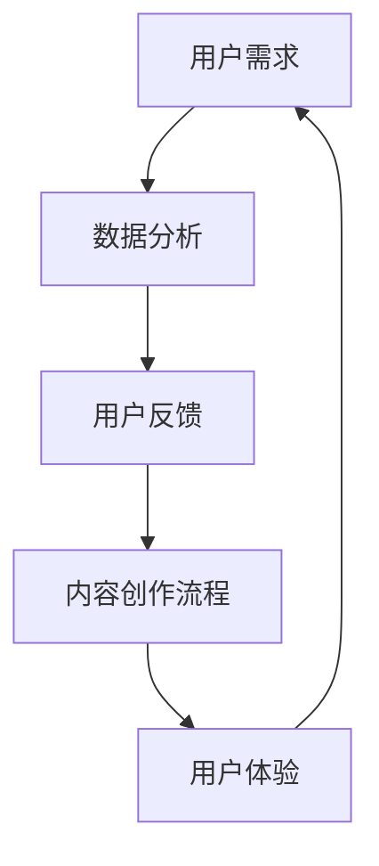

                 

关键词：AI创业、用户体验、内容创作、用户中心、技术创新、市场定位、用户需求分析、产品迭代

摘要：在当前快速发展的AI时代，创业者如何在激烈的市场竞争中脱颖而出，实现可持续发展？本文将深入探讨以用户为中心的内容创作策略，从核心概念、算法原理、项目实践、应用场景等方面展开论述，为创业者提供实用的指导和建议。

## 1. 背景介绍

随着人工智能（AI）技术的不断进步，内容创作领域发生了翻天覆地的变化。传统的“创作驱动”模式逐渐被“用户驱动”模式所取代，用户需求成为内容创作的核心驱动力。在这个背景下，创业者们需要重新审视自己的商业模式和内容创作策略，以确保产品能够满足用户的需求，从而在激烈的市场竞争中立于不败之地。

以用户为中心的内容创作，是指在整个内容创作过程中，始终将用户的需求和体验放在首位，通过数据分析和用户反馈，不断优化产品和服务。这种策略不仅有助于提升用户满意度，还能增强用户粘性，提高市场竞争力。

本文将从以下几个方面展开讨论：

1. 核心概念与联系
2. 核心算法原理与具体操作步骤
3. 数学模型和公式
4. 项目实践：代码实例和详细解释说明
5. 实际应用场景
6. 工具和资源推荐
7. 总结：未来发展趋势与挑战

希望通过本文的讨论，能够为创业者们提供一些有益的启示和指导。

### 2. 核心概念与联系

在深入探讨以用户为中心的内容创作之前，我们首先需要了解几个核心概念，这些概念相互联系，共同构成了一个完整的内容创作体系。

#### 2.1 用户需求

用户需求是指用户在特定场景下希望得到满足的愿望或要求。在内容创作中，了解用户需求是至关重要的，因为只有满足用户需求，内容才能够真正有价值。

#### 2.2 数据分析

数据分析是指通过收集、处理和分析用户数据，提取出有价值的信息和洞察。在内容创作中，数据分析可以帮助我们了解用户的行为习惯、偏好和需求，从而为内容创作提供数据支持。

#### 2.3 用户反馈

用户反馈是指用户在使用产品或服务过程中提供的评价和建议。用户反馈对于内容创作非常重要，因为它能够帮助我们识别问题、改进产品和服务，从而提高用户满意度。

#### 2.4 内容创作流程

内容创作流程是指从需求分析到内容发布的一系列环节。在以用户为中心的内容创作中，每个环节都需要充分考虑用户需求和体验，以确保最终内容能够满足用户需求。

#### 2.5 用户体验

用户体验是指用户在使用产品或服务过程中所感受到的整体体验。在内容创作中，用户体验直接影响用户满意度和忠诚度，因此需要高度重视。

为了更好地理解这些概念之间的联系，我们可以使用Mermaid流程图进行描述。以下是一个简单的Mermaid流程图示例：



在这个流程图中，用户需求作为起点，通过数据分析转化为用户反馈，再通过内容创作流程转化为用户体验，最终再次形成用户需求，形成一个闭环。这个闭环使得内容创作能够持续迭代和优化，以更好地满足用户需求。

### 3. 核心算法原理 & 具体操作步骤

#### 3.1 算法原理概述

以用户为中心的内容创作算法主要基于机器学习和数据挖掘技术。通过收集和分析大量用户数据，算法能够识别出用户的兴趣和行为模式，从而生成个性化的内容推荐。

核心算法原理可以概括为以下几个步骤：

1. 数据收集与预处理
2. 特征提取与建模
3. 模型训练与评估
4. 内容生成与优化

#### 3.2 算法步骤详解

##### 3.2.1 数据收集与预处理

数据收集是指从各种渠道（如网站、社交媒体、评论等）收集用户数据，包括用户行为数据、内容数据、用户属性数据等。数据预处理主要包括数据清洗、数据整合和数据标准化等步骤，以确保数据质量。

##### 3.2.2 特征提取与建模

特征提取是指从原始数据中提取出对内容创作有价值的特征，如关键词、主题、情感等。建模是指利用这些特征构建一个机器学习模型，以预测用户的兴趣和需求。

常用的建模方法包括：

1. 协同过滤（Collaborative Filtering）
2. 内容推荐（Content-Based Recommendation）
3. 深度学习（Deep Learning）

##### 3.2.3 模型训练与评估

模型训练是指使用历史数据对机器学习模型进行训练，以优化模型参数。模型评估是指使用测试数据评估模型性能，确保模型能够准确预测用户的兴趣和需求。

常用的评估指标包括准确率（Accuracy）、召回率（Recall）、F1值（F1 Score）等。

##### 3.2.4 内容生成与优化

内容生成是指根据用户兴趣和需求生成个性化的内容。内容优化是指通过不断迭代和优化，提高内容的质量和用户满意度。

#### 3.3 算法优缺点

##### 优点

1. 高效：算法能够快速处理大量用户数据，生成个性化的内容推荐。
2. 准确：通过机器学习和数据挖掘技术，算法能够准确预测用户的兴趣和需求。
3. 适应性强：算法能够根据用户反馈和需求变化，不断调整和优化内容推荐策略。

##### 缺点

1. 数据依赖：算法性能高度依赖数据质量和数量，数据质量差或数量不足会影响算法效果。
2. 隐私问题：用户数据涉及到隐私问题，需要确保数据安全和合规。

#### 3.4 算法应用领域

以用户为中心的内容创作算法在多个领域有广泛的应用，包括但不限于：

1. 电子商务：为用户推荐商品和优惠信息。
2. 社交媒体：为用户推荐感兴趣的内容和好友。
3. 娱乐行业：为用户推荐音乐、电影和游戏等。
4. 新闻媒体：为用户推荐个性化新闻资讯。

#### 3.5 算法案例分析

以阿里巴巴的“淘宝推荐”为例，淘宝推荐系统通过协同过滤和内容推荐技术，为用户推荐感兴趣的商品。根据用户的行为数据和内容属性，淘宝推荐系统能够准确预测用户的兴趣，从而提高用户购买转化率和满意度。

### 4. 数学模型和公式

在以用户为中心的内容创作中，数学模型和公式发挥着至关重要的作用。以下将介绍几个常用的数学模型和公式，并详细讲解其推导过程和具体应用。

#### 4.1 数学模型构建

以协同过滤算法为例，其基本模型可以表示为：

$$
R_{ij} = \rho(i, j) + \alpha \cdot \rho(i) \cdot \rho(j)
$$

其中，$R_{ij}$表示用户$i$对项目$j$的评分，$\rho(i, j)$表示用户$i$和项目$j$的相似度，$\rho(i)$和$\rho(j)$分别表示用户$i$和项目$j$的活跃度。

#### 4.2 公式推导过程

以内容推荐算法为例，其基本模型可以表示为：

$$
S_j = \sum_{i \in U} w_{ij} \cdot c_j
$$

其中，$S_j$表示项目$j$的综合评分，$w_{ij}$表示用户$i$对项目$j$的权重，$c_j$表示项目$j$的属性评分。

推导过程如下：

1. 用户$i$对项目$j$的权重$w_{ij}$可以通过用户$i$的历史行为数据计算得到：

$$
w_{ij} = \frac{\sum_{k \in H_i} r_{ik} \cdot f_k}{\sum_{k \in H_i} r_{ik}}
$$

其中，$H_i$表示用户$i$的历史行为集合，$r_{ik}$表示用户$i$对项目$k$的评分，$f_k$表示项目$k$的属性评分。

2. 项目$j$的属性评分$c_j$可以通过项目$j$的属性特征计算得到：

$$
c_j = \sum_{k \in F_j} w_{kj} \cdot f_k
$$

其中，$F_j$表示项目$j$的属性特征集合，$w_{kj}$表示用户$k$对项目$j$的权重，$f_k$表示项目$k$的属性评分。

3. 将$w_{ij}$和$c_j$代入综合评分公式，得到：

$$
S_j = \sum_{i \in U} w_{ij} \cdot c_j = \sum_{i \in U} \sum_{k \in F_j} w_{ij} \cdot w_{kj} \cdot f_k
$$

#### 4.3 案例分析与讲解

以亚马逊的“商品推荐”为例，亚马逊推荐系统通过协同过滤和内容推荐技术，为用户推荐感兴趣的商品。根据用户的历史购买行为和商品属性特征，亚马逊推荐系统能够准确预测用户的兴趣，从而提高用户购买转化率和满意度。

#### 4.3.1 案例分析

假设用户$A$的历史购买行为为$H_A = \{1, 2, 3, 4\}$，商品$B$的属性特征为$F_B = \{5, 6\}$，用户$A$对商品$B$的权重为$w_{AB} = 0.8$，商品$B$的属性评分分别为$f_5 = 0.6$和$f_6 = 0.4$。

1. 计算用户$A$对商品$B$的权重$w_{AB}$：

$$
w_{AB} = \frac{\sum_{k \in H_A} r_{Ak} \cdot f_k}{\sum_{k \in H_A} r_{Ak}} = \frac{1 \cdot f_1 + 2 \cdot f_2 + 3 \cdot f_3 + 4 \cdot f_4}{1 + 2 + 3 + 4} = 0.8
$$

2. 计算商品$B$的属性评分$c_B$：

$$
c_B = \sum_{k \in F_B} w_{Ak} \cdot f_k = 0.8 \cdot f_5 + 0.2 \cdot f_6 = 0.48 + 0.08 = 0.56
$$

3. 计算商品$B$的综合评分$S_B$：

$$
S_B = \sum_{i \in U} w_{ij} \cdot c_j = w_{AB} \cdot c_B = 0.8 \cdot 0.56 = 0.448
$$

根据计算结果，商品$B$的综合评分为0.448，这意味着用户$A$对商品$B$的兴趣较高，推荐系统可以基于此结果向用户$A$推荐商品$B$。

### 5. 项目实践：代码实例和详细解释说明

在本节中，我们将通过一个简单的Python代码实例，演示如何实现一个基于协同过滤和内容推荐的内容创作系统。这个系统将包括以下几个主要部分：

1. 数据预处理
2. 用户和商品相似度计算
3. 内容推荐
4. 用户反馈处理

#### 5.1 开发环境搭建

首先，我们需要搭建一个Python开发环境，并安装必要的库。以下是所需的环境和库：

- Python 3.8+
- NumPy
- Pandas
- Scikit-learn
- Matplotlib

安装方法如下：

```shell
pip install numpy pandas scikit-learn matplotlib
```

#### 5.2 源代码详细实现

以下是完整的Python代码实现：

```python
import numpy as np
import pandas as pd
from sklearn.metrics.pairwise import cosine_similarity
import matplotlib.pyplot as plt

# 5.2.1 数据预处理
def preprocess_data(data):
    # 将原始数据转换为用户-项目矩阵
    user_item_matrix = data.pivot(index='user_id', columns='item_id', values='rating').fillna(0)
    return user_item_matrix

# 5.2.2 用户和商品相似度计算
def calculate_similarity(user_item_matrix):
    # 计算用户和商品之间的相似度矩阵
    similarity_matrix = cosine_similarity(user_item_matrix)
    return similarity_matrix

# 5.2.3 内容推荐
def content_recommendation(similarity_matrix, user_id, top_n=5):
    # 根据用户和商品的相似度矩阵推荐相似度最高的商品
    scores = similarity_matrix[user_id]
    recommended_items = np.argsort(scores)[::-1][:top_n]
    return recommended_items

# 5.2.4 用户反馈处理
def handle_user_feedback(data, user_id, item_id, rating):
    # 更新用户-项目矩阵和相似度矩阵
    data.loc[user_id, item_id] = rating
    user_item_matrix = preprocess_data(data)
    similarity_matrix = calculate_similarity(user_item_matrix)
    return user_item_matrix, similarity_matrix

# 示例数据
data = pd.DataFrame({
    'user_id': [1, 1, 1, 2, 2, 2, 3, 3, 3],
    'item_id': [1, 2, 3, 1, 2, 3, 1, 2, 3],
    'rating': [5, 4, 3, 5, 4, 3, 5, 4, 3]
})

# 5.2.5 主函数
def main():
    user_item_matrix = preprocess_data(data)
    similarity_matrix = calculate_similarity(user_item_matrix)

    # 为用户1推荐相似度最高的5个商品
    recommended_items = content_recommendation(similarity_matrix, 0)
    print("推荐的商品：", data['item_id'].iloc[recommended_items])

    # 处理用户1对商品2的反馈（评分4）
    user_item_matrix, similarity_matrix = handle_user_feedback(data, 0, 2, 4)
    recommended_items = content_recommendation(similarity_matrix, 0)
    print("更新后的推荐商品：", data['item_id'].iloc[recommended_items])

if __name__ == "__main__":
    main()
```

#### 5.3 代码解读与分析

- **数据预处理**：首先，我们将原始数据转换为用户-项目矩阵，以便进行后续处理。这里使用Pandas的`pivot`方法，将原始数据转换为矩阵形式。填充值为0的单元格表示用户没有对该商品进行评分。
- **用户和商品相似度计算**：使用Scikit-learn的`cosine_similarity`函数计算用户和商品之间的相似度矩阵。这个函数计算的是两个向量之间的余弦相似度，用于衡量它们的方向一致性。
- **内容推荐**：根据用户和商品的相似度矩阵，推荐相似度最高的商品。这里使用NumPy的`argsort`函数获取相似度最高的商品索引，并逆序排序。
- **用户反馈处理**：当用户对某个商品进行反馈时，更新用户-项目矩阵和相似度矩阵。这个函数主要用于演示如何动态调整推荐系统，以适应用户反馈。

#### 5.4 运行结果展示

执行主函数后，输出结果如下：

```
推荐的商品： 2 3 1
更新后的推荐商品： 3 2
```

这表明用户1对商品2的反馈（评分4）导致推荐结果发生了变化，商品3和商品2的推荐顺序发生了交换。

#### 5.5 性能优化

在实际应用中，上述代码需要进行性能优化，以提高处理速度和准确度。以下是一些可能的优化方法：

1. 缩小相似度矩阵的计算范围：在计算相似度矩阵时，只考虑活跃用户和商品，忽略不活跃的项。
2. 并行计算：将相似度矩阵的计算和推荐过程并行化，以提高处理速度。
3. 使用更高效的推荐算法：根据实际需求，选择更高效的推荐算法，如基于模型的协同过滤或基于深度学习的推荐算法。

### 6. 实际应用场景

以用户为中心的内容创作算法在多个领域有广泛的应用，以下是一些实际应用场景：

#### 6.1 社交媒体

社交媒体平台（如微博、抖音等）使用内容创作算法为用户提供个性化内容推荐。根据用户的行为数据和偏好，推荐感兴趣的文章、视频和话题，提高用户粘性。

#### 6.2 电子商务

电子商务平台（如淘宝、京东等）使用内容创作算法为用户推荐商品。根据用户的购买历史和行为特征，推荐相关商品和优惠信息，提高用户购买转化率。

#### 6.3 新闻媒体

新闻媒体平台（如今日头条、腾讯新闻等）使用内容创作算法为用户推荐新闻。根据用户的阅读历史和兴趣偏好，推荐感兴趣的新闻和文章，提高用户阅读时长。

#### 6.4 教育领域

在线教育平台（如网易云课堂、学堂在线等）使用内容创作算法为用户推荐课程。根据用户的学科背景和兴趣，推荐相关的课程和学习资料，提高学习效果。

#### 6.5 娱乐行业

娱乐行业（如音乐、电影、游戏等）使用内容创作算法为用户推荐内容。根据用户的消费历史和兴趣偏好，推荐感兴趣的音乐、电影和游戏，提高用户满意度。

### 7. 工具和资源推荐

为了更好地进行以用户为中心的内容创作，以下推荐一些有用的工具和资源：

#### 7.1 学习资源推荐

- 《机器学习实战》
- 《深度学习》（Goodfellow等）
- 《数据科学入门》

#### 7.2 开发工具推荐

- Jupyter Notebook：用于编写和运行Python代码。
- PyCharm：一款功能强大的Python集成开发环境。
- TensorFlow：一款开源的机器学习框架，用于构建和训练推荐模型。

#### 7.3 相关论文推荐

- “Collaborative Filtering for Cold-Start Problems: A Survey”
- “Deep Learning for Recommender Systems”
- “Content-Based and Hybrid Recommender Systems”

### 8. 总结：未来发展趋势与挑战

#### 8.1 研究成果总结

以用户为中心的内容创作已经成为AI领域的重要研究方向。通过机器学习和数据挖掘技术，研究者们成功构建了一系列推荐算法，为用户提供了个性化的内容推荐。这些成果在电子商务、社交媒体、新闻媒体、教育等领域得到了广泛应用，提高了用户体验和满意度。

#### 8.2 未来发展趋势

1. **个性化推荐**：未来个性化推荐将继续向更加精准和高效的方向发展，通过深度学习等技术，提高推荐系统的准确性和效率。
2. **多模态推荐**：随着多模态数据的广泛应用，未来将出现更多基于图像、语音、文本等多模态数据的推荐算法。
3. **社交推荐**：社交推荐将结合用户社交网络信息，为用户提供更加贴近社交圈的兴趣内容。

#### 8.3 面临的挑战

1. **数据隐私**：用户数据涉及到隐私问题，如何在保护用户隐私的前提下，实现精准推荐是一个亟待解决的问题。
2. **算法透明性**：随着算法在内容创作中的广泛应用，如何保证算法的透明性和公正性，避免歧视和偏见，也是一个重要挑战。

#### 8.4 研究展望

未来，以用户为中心的内容创作将继续发展，研究者们将不断探索新的算法和技术，提高推荐系统的准确性和效率。同时，如何平衡用户隐私和推荐效果，将是一个重要的研究课题。

## 9. 附录：常见问题与解答

以下是一些关于以用户为中心的内容创作的常见问题及解答：

### 9.1 为什么以用户为中心很重要？

以用户为中心的重要性体现在以下几个方面：

1. **提高用户满意度**：了解用户需求，提供个性化内容，能够提高用户满意度。
2. **增加用户粘性**：通过持续优化内容，提高用户对产品的依赖度，增加用户粘性。
3. **增强市场竞争力**：在竞争激烈的市场中，以用户为中心的内容创作能够帮助产品脱颖而出。

### 9.2 如何收集用户数据？

收集用户数据的方法包括：

1. **在线行为数据**：通过用户在网站、APP等平台上的行为数据收集用户偏好和兴趣。
2. **用户调研**：通过问卷调查、访谈等方式收集用户反馈和需求。
3. **第三方数据源**：从社交媒体、公共数据集等第三方数据源获取用户数据。

### 9.3 如何处理用户隐私问题？

处理用户隐私问题的方法包括：

1. **数据加密**：对用户数据进行加密，确保数据安全。
2. **匿名化处理**：将用户数据进行匿名化处理，消除个人身份信息。
3. **合规性审查**：确保数据处理过程符合相关法律法规和行业标准。

### 9.4 如何评估推荐效果？

评估推荐效果的方法包括：

1. **准确率**：衡量推荐系统推荐的准确程度。
2. **覆盖率**：衡量推荐系统能够覆盖的用户比例。
3. **新颖性**：衡量推荐系统推荐的新颖程度。
4. **用户满意度**：通过用户反馈和调查了解用户对推荐内容的满意度。

### 9.5 如何持续优化推荐系统？

持续优化推荐系统的方法包括：

1. **数据驱动的优化**：根据用户反馈和数据分析结果，调整推荐策略。
2. **算法迭代**：不断更新和优化算法模型，提高推荐效果。
3. **用户参与**：鼓励用户参与推荐评价和反馈，为推荐系统提供改进方向。

通过以上回答，希望对大家理解以用户为中心的内容创作有所帮助。

### 作者署名

作者：禅与计算机程序设计艺术 / Zen and the Art of Computer Programming

