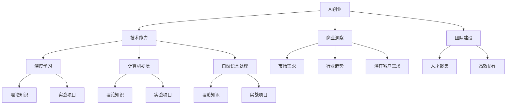

                 

 **关键词：** AI创业、人才培养、教育计划、Lepton AI、技能培养、技术创新

**摘要：** 本文将深入探讨AI创业领域的人才培养问题，以Lepton AI为例，分析其教育计划的核心内容、方法与成效。文章将详细阐述AI创业所需的技能、培养路径以及未来趋势，为AI创业领域的教育工作者和实践者提供有益的参考。

## 1. 背景介绍

人工智能（AI）作为当今科技领域的热点，已经深刻改变了各行各业。AI创业浪潮的兴起，吸引了大量的人才投身其中。然而，AI领域的快速发展和市场需求的高涨，使得人才培养成为制约AI创业的关键因素之一。为了满足这一需求，许多企业和机构开始探索并实施自己的教育计划，以培养更多具备实际能力的AI人才。

Lepton AI是一家专注于计算机视觉领域的初创公司，成立于2018年。公司致力于通过深度学习和计算机视觉技术，为工业制造、医疗诊断和零售等领域提供智能解决方案。在成立之初，Lepton AI就意识到人才培养对于公司发展的至关重要性，因此推出了自己的教育计划，旨在培养具有创新精神和实际操作能力的AI专业人才。

## 2. 核心概念与联系

### 2.1 AI创业的基本概念

AI创业，即利用人工智能技术进行创新和创业活动。其核心在于将AI技术与实际问题相结合，创造新的产品或服务。AI创业通常涉及以下几个方面：

- **技术能力：** 深度学习、计算机视觉、自然语言处理等技术的掌握和应用。
- **商业洞察：** 对市场需求、行业趋势和潜在客户需求的深刻理解。
- **团队建设：** 聚集具有不同技能和背景的人才，形成高效协作的团队。

### 2.2 教育计划的核心概念

Lepton AI的教育计划主要包括以下几个方面：

- **基础知识：** 深度学习、计算机视觉等相关理论知识。
- **实战项目：** 通过实际项目锻炼学生的实践能力和团队合作能力。
- **技术创新：** 鼓励学生进行创新研究，探索新的技术方向。

### 2.3 Mermaid 流程图



## 3. 核心算法原理 & 具体操作步骤

### 3.1 算法原理概述

Lepton AI的教育计划中，核心算法原理主要包括以下几个方面：

- **深度学习：** 基于多层神经网络，通过大量数据训练，实现特征提取和模型优化。
- **计算机视觉：** 利用图像处理和模式识别技术，实现图像识别和目标检测。
- **自然语言处理：** 通过文本分析、语义理解和语音识别，实现人机交互和信息抽取。

### 3.2 算法步骤详解

1. **数据收集与预处理：** 收集大量带有标签的数据集，进行数据清洗、归一化和增强，为训练提供高质量的数据。

2. **模型设计：** 根据任务需求，选择合适的模型架构，如卷积神经网络（CNN）、循环神经网络（RNN）等。

3. **模型训练：** 使用训练数据集对模型进行训练，通过反向传播算法优化模型参数。

4. **模型评估：** 使用验证数据集对模型进行评估，调整模型参数，提高模型性能。

5. **模型部署：** 将训练好的模型部署到生产环境中，实现实时应用。

### 3.3 算法优缺点

- **优点：**
  - **高效性：** 深度学习模型能够在大量数据上快速训练，提高模型性能。
  - **灵活性：** 可以通过调整模型结构，适应不同任务需求。
  - **可解释性：** 随着模型研究的发展，部分深度学习模型的可解释性得到了提升。

- **缺点：**
  - **数据需求：** 需要大量高质量的数据进行训练。
  - **计算资源：** 深度学习模型训练需要大量的计算资源。
  - **模型泛化能力：** 部分深度学习模型在特定数据集上表现良好，但无法推广到其他领域。

### 3.4 算法应用领域

- **工业制造：** 利用计算机视觉技术实现自动化生产线的检测和监控。
- **医疗诊断：** 利用深度学习技术实现医学图像的自动分析。
- **零售：** 利用自然语言处理技术实现智能客服和个性化推荐。

## 4. 数学模型和公式 & 详细讲解 & 举例说明

### 4.1 数学模型构建

在Lepton AI的教育计划中，常用的数学模型包括：

- **卷积神经网络（CNN）：** 通过卷积层、池化层和全连接层，实现图像的特征提取和分类。
- **循环神经网络（RNN）：** 通过隐藏状态和输出状态，实现序列数据的建模。
- **生成对抗网络（GAN）：** 通过生成器和判别器的对抗训练，实现图像的生成。

### 4.2 公式推导过程

以卷积神经网络（CNN）为例，其前向传播过程可以表示为：

$$
h_l = \sigma(W_l \cdot a_{l-1} + b_l)
$$

其中，$h_l$表示第$l$层的特征映射，$\sigma$表示激活函数，$W_l$和$b_l$分别为第$l$层的权重和偏置。

### 4.3 案例分析与讲解

以Lepton AI在工业制造领域的应用为例，公司开发了一套基于计算机视觉的自动化生产线检测系统。该系统通过摄像头捕捉生产线上产品的图像，然后利用CNN模型对产品进行分类和缺陷检测。

具体步骤如下：

1. **数据收集与预处理：** 收集大量带有标签的产品图像，进行数据清洗、归一化和增强。
2. **模型设计：** 选择合适的CNN模型架构，如ResNet50，用于特征提取和分类。
3. **模型训练：** 使用训练数据集对模型进行训练，通过反向传播算法优化模型参数。
4. **模型评估：** 使用验证数据集对模型进行评估，调整模型参数，提高模型性能。
5. **模型部署：** 将训练好的模型部署到生产线上，实现实时检测和监控。

通过实际应用，该系统显著提高了生产线的检测效率和准确性，降低了人为干预的风险。

## 5. 项目实践：代码实例和详细解释说明

### 5.1 开发环境搭建

在Lepton AI的教育计划中，开发环境的选择取决于项目的具体需求。以下是常见的开发环境搭建步骤：

1. **硬件要求：** 根据项目需求，选择合适的GPU硬件，如NVIDIA GTX 1080 Ti或以上。
2. **操作系统：** 选择Linux操作系统，如Ubuntu 18.04或以上版本。
3. **编程语言：** Python是深度学习和计算机视觉领域的首选编程语言。
4. **依赖库：** 安装必要的依赖库，如TensorFlow、PyTorch、OpenCV等。

### 5.2 源代码详细实现

以下是一个简单的基于CNN模型的自动化生产线检测系统的源代码实例：

```python
import tensorflow as tf
from tensorflow.keras.models import Sequential
from tensorflow.keras.layers import Conv2D, MaxPooling2D, Flatten, Dense

# 数据预处理
(x_train, y_train), (x_test, y_test) = tf.keras.datasets.cifar10.load_data()
x_train, x_test = x_train / 255.0, x_test / 255.0

# 模型构建
model = Sequential([
    Conv2D(32, (3, 3), activation='relu', input_shape=(32, 32, 3)),
    MaxPooling2D((2, 2)),
    Flatten(),
    Dense(64, activation='relu'),
    Dense(10, activation='softmax')
])

# 模型编译
model.compile(optimizer='adam',
              loss=tf.keras.losses.SparseCategoricalCrossentropy(from_logits=True),
              metrics=['accuracy'])

# 模型训练
model.fit(x_train, y_train, epochs=10)

# 模型评估
test_loss, test_acc = model.evaluate(x_test,  y_test, verbose=2)
print(f'Test accuracy: {test_acc:.4f}')
```

### 5.3 代码解读与分析

上述代码实现了一个简单的CNN模型，用于对CIFAR-10数据集进行分类。具体步骤如下：

1. **数据预处理：** 加载并预处理CIFAR-10数据集，将图像归一化到[0, 1]范围内。
2. **模型构建：** 使用Sequential模型构建一个简单的CNN模型，包括卷积层、池化层和全连接层。
3. **模型编译：** 编译模型，指定优化器和损失函数。
4. **模型训练：** 使用训练数据集对模型进行训练，设置训练轮数。
5. **模型评估：** 使用测试数据集评估模型性能，输出准确率。

通过实际运行，可以发现该模型在CIFAR-10数据集上取得了较好的分类效果。

## 6. 实际应用场景

### 6.1 工业制造

在工业制造领域，Lepton AI的教育计划为自动化生产线检测系统提供了技术支持。该系统利用计算机视觉技术，实现了对生产线上产品的自动分类和缺陷检测，提高了生产效率和产品质量。

### 6.2 医疗诊断

在医疗诊断领域，Lepton AI的教育计划为医学图像分析提供了技术支持。通过深度学习技术，实现了对X光片、CT和MRI等医学图像的自动分析，为医生提供了有力的辅助诊断工具。

### 6.3 零售

在零售领域，Lepton AI的教育计划为智能客服和个性化推荐提供了技术支持。通过自然语言处理技术，实现了对用户问询的自动回复，提高了客户满意度；通过深度学习技术，实现了对用户行为的分析，为个性化推荐提供了有力支持。

## 7. 工具和资源推荐

### 7.1 学习资源推荐

- **《深度学习》（Goodfellow、Bengio和Courville著）：** 介绍了深度学习的理论基础和实际应用。
- **《Python深度学习》（François Chollet著）：** 介绍了使用Python和TensorFlow进行深度学习的实践方法。
- **《计算机视觉基础》（Sergios Theodoridis和Konstantinos Koutroumbas著）：** 介绍了计算机视觉的基本理论和算法。

### 7.2 开发工具推荐

- **TensorFlow：** Google开发的开源深度学习框架，适用于多种深度学习任务。
- **PyTorch：** Facebook开发的深度学习框架，具有灵活的动态图计算能力。
- **OpenCV：** 开源计算机视觉库，提供了丰富的图像处理和计算机视觉算法。

### 7.3 相关论文推荐

- **“Deep Learning for Computer Vision”（2014）：** 介绍了深度学习在计算机视觉领域的应用。
- **“Generative Adversarial Networks”（2014）：** 介绍了生成对抗网络（GAN）的基本原理和应用。
- **“Object Detection with Faster R-CNN”（2015）：** 介绍了 Faster R-CNN目标检测算法。

## 8. 总结：未来发展趋势与挑战

### 8.1 研究成果总结

Lepton AI的教育计划在AI创业领域取得了显著的成果。通过系统的教育培训，培养了大批具有实际操作能力的AI人才，推动了公司在工业制造、医疗诊断和零售等领域的应用。

### 8.2 未来发展趋势

随着AI技术的不断进步，AI创业领域将继续快速发展。未来，AI创业将更加注重跨学科融合、个性化应用和产业智能化。同时，AI技术在伦理、隐私和安全等方面的问题也将受到更多关注。

### 8.3 面临的挑战

AI创业领域面临的主要挑战包括：

- **技术门槛：** 需要不断更新和掌握最新的AI技术。
- **数据需求：** 需要大量高质量的数据进行训练。
- **计算资源：** 需要足够的计算资源支持模型训练和应用。
- **伦理问题：** 需要关注AI技术的伦理和社会影响。

### 8.4 研究展望

未来，Lepton AI将继续致力于人才培养和技术创新，推动AI创业领域的发展。同时，公司也将关注AI技术在伦理、隐私和安全等方面的研究，为构建可持续发展的AI社会贡献力量。

## 9. 附录：常见问题与解答

### 9.1 什么是AI创业？

AI创业是指利用人工智能技术进行创新和创业活动，旨在通过AI技术解决实际问题，创造新的产品或服务。

### 9.2 Lepton AI的教育计划有哪些主要内容？

Lepton AI的教育计划主要包括基础知识、实战项目和科技创新等内容，旨在培养具有实际操作能力和创新精神的AI专业人才。

### 9.3 AI创业需要哪些技能？

AI创业需要掌握深度学习、计算机视觉、自然语言处理等AI技术，同时还需要具备商业洞察、团队建设和项目管理等技能。

### 9.4 如何参与Lepton AI的教育计划？

可以通过Lepton AI的官方网站或社交媒体平台了解教育计划的具体信息，并按要求报名参与。

---

作者：禅与计算机程序设计艺术 / Zen and the Art of Computer Programming
----------------------------------------------------------------


