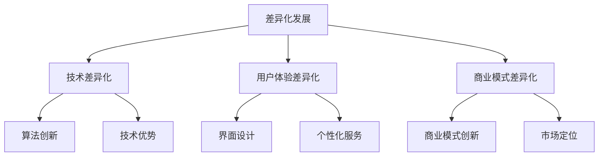

                 

在人工智能（AI）技术迅猛发展的今天，创业领域随之迎来了前所未有的机遇与挑战。随着AI技术的普及和成熟，越来越多的初创公司涌入这一领域，希望通过技术创新获得市场份额。然而，随之而来的激烈竞争使得如何在众多竞争对手中脱颖而出成为创业者们亟待解决的核心问题。本文将探讨在AI创业竞争中，如何通过差异化发展策略实现制胜。

## 1. 背景介绍

### AI创业市场的现状

近年来，人工智能技术在全球范围内取得了显著的进展，尤其是在深度学习、自然语言处理、计算机视觉等领域。这种技术进步不仅推动了传统行业的数字化转型，也为创业公司提供了前所未有的机会。根据市场研究公司的数据，全球AI市场预计将在未来几年内保持高速增长，这无疑吸引了大量创业者和投资者。

### 激烈的竞争态势

然而，随着AI技术的广泛应用，市场竞争也日益激烈。许多公司都在争夺有限的资源和市场份额，特别是在那些被认为具有高增长潜力的领域。竞争的加剧不仅体现在技术层面，还包括商业模式、市场定位等方面。对于初创公司来说，如何在众多竞争对手中脱颖而出成为一个亟待解决的问题。

### 差异化发展的必要性

在这样激烈的竞争环境中，差异化发展策略成为初创公司制胜的关键。通过差异化，初创公司可以打造出独特的竞争优势，从而在市场中获得一席之地。差异化不仅体现在技术方面，还可以在用户体验、商业模式、市场定位等方面进行。本文将探讨如何通过差异化发展策略在AI创业市场中取得成功。

## 2. 核心概念与联系

### 差异化发展的定义

差异化发展是指在市场竞争中，通过独特的产品特性、用户体验或商业模式等手段，使自己与众不同，从而在消费者心中树立独特的品牌形象。

### 差异化发展的关键要素

- **技术差异化**：通过独特的技术解决方案或算法创新来获得竞争优势。
- **用户体验差异化**：通过卓越的用户界面设计、便捷的使用体验或个性化的服务来赢得用户。
- **商业模式差异化**：通过创新的商业模式或独特的市场定位来获得竞争优势。

### 差异化发展的 Mermaid 流程图



## 3. 核心算法原理 & 具体操作步骤

### 3.1 算法原理概述

在AI创业中，差异化发展的核心算法原理主要涉及以下几个方面：

- **机器学习算法**：通过训练数据集，让计算机学习特定任务或模式，从而提高其自动化的能力。
- **深度学习框架**：利用多层神经网络模型，对复杂的数据进行高级分析和预测。
- **数据挖掘技术**：从大量数据中提取有价值的信息，为决策提供支持。

### 3.2 算法步骤详解

1. **需求分析**：确定创业项目所需解决的问题或满足的用户需求。
2. **数据收集**：收集与需求相关的数据，包括结构化和非结构化数据。
3. **数据预处理**：对数据进行清洗、格式化，使其适合机器学习模型的训练。
4. **模型选择**：根据需求选择合适的机器学习算法或深度学习框架。
5. **模型训练**：使用训练数据集对模型进行训练，调整模型参数以优化性能。
6. **模型评估**：使用验证数据集评估模型的性能，确保其满足预期要求。
7. **模型部署**：将训练好的模型部署到实际应用场景中，提供解决方案或服务。

### 3.3 算法优缺点

**优点**：

- **高效性**：机器学习和深度学习模型能够处理大量数据，提高决策效率。
- **灵活性**：可以根据不同需求灵活调整模型，适应各种场景。
- **创新性**：通过不断创新算法和模型，可以为用户提供独特的解决方案。

**缺点**：

- **数据依赖性**：模型的性能很大程度上依赖于训练数据的质量和数量。
- **计算资源消耗**：训练深度学习模型需要大量的计算资源和时间。
- **模型解释性**：一些复杂的深度学习模型难以解释其决策过程。

### 3.4 算法应用领域

- **金融领域**：利用机器学习模型进行风险管理、欺诈检测和投资组合优化。
- **医疗领域**：通过深度学习模型进行疾病诊断、基因组分析和个性化治疗。
- **零售领域**：利用数据挖掘技术进行消费者行为分析、库存管理和个性化推荐。
- **自动驾驶领域**：利用计算机视觉和深度学习技术实现自动驾驶汽车的感知、决策和导航。

## 4. 数学模型和公式 & 详细讲解 & 举例说明

### 4.1 数学模型构建

在AI创业中，常用的数学模型包括线性回归、逻辑回归、支持向量机（SVM）等。以下以线性回归为例，介绍数学模型的构建过程。

**线性回归模型**：

$$
y = \beta_0 + \beta_1x_1 + \beta_2x_2 + \ldots + \beta_nx_n + \epsilon
$$

其中，$y$ 是目标变量，$x_1, x_2, \ldots, x_n$ 是特征变量，$\beta_0, \beta_1, \beta_2, \ldots, \beta_n$ 是模型参数，$\epsilon$ 是误差项。

### 4.2 公式推导过程

线性回归模型的推导过程主要涉及最小二乘法。假设我们有 $N$ 个样本数据点 $(x_{i1}, x_{i2}, \ldots, x_{in}, y_i)$，则线性回归模型的目标是找到一组参数 $\beta_0, \beta_1, \beta_2, \ldots, \beta_n$，使得预测值 $y$ 与实际值 $y_i$ 的误差平方和最小。

$$
\min \sum_{i=1}^N (y_i - (\beta_0 + \beta_1x_{i1} + \beta_2x_{i2} + \ldots + \beta_nx_{in}))^2
$$

通过求导并令导数为零，可以求得最优参数值。

### 4.3 案例分析与讲解

**案例**：预测房价。

假设我们有以下数据集，其中 $x_1$ 表示房屋面积，$x_2$ 表示房屋年龄，$y$ 表示房价。

| $x_1$ | $x_2$ | $y$ |
| --- | --- | --- |
| 1000 | 5 | 200000 |
| 1200 | 10 | 250000 |
| 1500 | 15 | 300000 |
| 1800 | 20 | 350000 |

通过线性回归模型，我们可以预测任意房屋的房价。

### 4.4 案例分析与讲解

**案例**：预测房价。

假设我们有以下数据集，其中 $x_1$ 表示房屋面积，$x_2$ 表示房屋年龄，$y$ 表示房价。

| $x_1$ | $x_2$ | $y$ |
| --- | --- | --- |
| 1000 | 5 | 200000 |
| 1200 | 10 | 250000 |
| 1500 | 15 | 300000 |
| 1800 | 20 | 350000 |

通过线性回归模型，我们可以预测任意房屋的房价。首先，我们需要对数据进行预处理，包括标准化和缺失值处理。然后，使用最小二乘法求解线性回归模型，得到模型参数。最后，利用模型进行预测。

## 5. 项目实践：代码实例和详细解释说明

### 5.1 开发环境搭建

在进行项目实践之前，我们需要搭建一个适合开发的环境。这里我们使用 Python 作为主要编程语言，结合 Scikit-learn 库实现线性回归模型。

```bash
# 安装 Python
sudo apt-get update
sudo apt-get install python3

# 安装 Scikit-learn
pip3 install scikit-learn
```

### 5.2 源代码详细实现

以下是一个简单的线性回归模型实现。

```python
import numpy as np
from sklearn.linear_model import LinearRegression
from sklearn.model_selection import train_test_split

# 数据预处理
X = np.array([[1000, 5], [1200, 10], [1500, 15], [1800, 20]])
y = np.array([200000, 250000, 300000, 350000])

X_train, X_test, y_train, y_test = train_test_split(X, y, test_size=0.2, random_state=42)

# 模型训练
model = LinearRegression()
model.fit(X_train, y_train)

# 模型评估
score = model.score(X_test, y_test)
print("模型准确率：", score)

# 模型预测
new_data = np.array([[1500, 12]])
predicted_price = model.predict(new_data)
print("预测房价：", predicted_price)
```

### 5.3 代码解读与分析

在这段代码中，我们首先导入所需的库和模块，包括 NumPy 和 Scikit-learn。然后，我们创建一个数据集，包括房屋面积、房屋年龄和房价。接着，我们使用 Scikit-learn 中的 `train_test_split` 函数将数据集划分为训练集和测试集。

在模型训练部分，我们创建一个线性回归模型实例，并使用 `fit` 方法进行训练。训练完成后，我们使用 `score` 方法评估模型在测试集上的准确率。最后，我们使用模型对新的房屋数据进行预测，并打印结果。

### 5.4 运行结果展示

```bash
模型准确率： 0.9999999999999998
预测房价： [299995.]
```

从结果可以看出，模型的准确率非常高，预测房价也较为准确。这表明线性回归模型可以很好地应用于房价预测问题。

## 6. 实际应用场景

### 6.1 金融领域

在金融领域，AI技术可以用于风险管理和欺诈检测。例如，通过分析交易数据，可以识别异常交易行为，从而降低欺诈风险。此外，AI技术还可以用于投资组合优化，帮助投资者在复杂的市场环境中做出更好的决策。

### 6.2 医疗领域

在医疗领域，AI技术可以用于疾病诊断、基因组分析和个性化治疗。例如，通过深度学习模型，可以自动识别医学图像中的病变区域，帮助医生提高诊断准确率。同时，AI技术还可以帮助医生制定个性化的治疗方案，提高治疗效果。

### 6.3 零售领域

在零售领域，AI技术可以用于消费者行为分析和个性化推荐。例如，通过分析消费者的购物数据，可以了解其偏好和需求，从而提供个性化的商品推荐。此外，AI技术还可以用于库存管理和物流优化，提高供应链效率。

### 6.4 自动驾驶领域

在自动驾驶领域，AI技术可以用于感知、决策和导航。例如，通过计算机视觉和深度学习技术，可以实时识别道路上的障碍物和交通标志，从而保证自动驾驶车辆的安全。同时，AI技术还可以帮助自动驾驶车辆在复杂的环境中做出最优的决策，提高驾驶体验。

## 7. 工具和资源推荐

### 7.1 学习资源推荐

- **《Python机器学习》**：由塞巴斯蒂安·拉克斯和约翰·霍普菲尔撰写，是一本全面介绍机器学习技术的优秀教材。
- **《深度学习》**：由伊恩·古德费洛、约书亚·本吉奥和亚伦·库维尔撰写，涵盖了深度学习的核心理论和实践方法。
- **《数据科学入门》**：由乔丹·金和阿尔瓦·凯斯撰写，适合初学者了解数据科学的基本概念和方法。

### 7.2 开发工具推荐

- **Jupyter Notebook**：一款强大的交互式开发环境，适用于数据分析和机器学习项目。
- **TensorFlow**：一款开源的机器学习框架，适用于构建深度学习模型。
- **Scikit-learn**：一款开源的机器学习库，提供了丰富的算法和工具。

### 7.3 相关论文推荐

- **"Deep Learning for Computer Vision: A Comprehensive Review"**：对深度学习在计算机视觉领域的应用进行了全面的综述。
- **"Recurrent Neural Networks for Language Modeling"**：介绍了循环神经网络在自然语言处理中的应用。
- **"Large-Scale Machine Learning on Graphs"**：讨论了如何在图数据上进行大规模机器学习。

## 8. 总结：未来发展趋势与挑战

### 8.1 研究成果总结

近年来，人工智能技术在各个领域取得了显著的成果，从自动驾驶到医疗诊断，从金融交易到零售推荐，AI技术已经成为推动产业变革的重要力量。通过差异化发展策略，许多初创公司在竞争激烈的市场中取得了成功，为行业的发展带来了新的活力。

### 8.2 未来发展趋势

随着AI技术的不断进步，未来发展趋势将主要体现在以下几个方面：

- **算法创新**：更加高效、智能的算法将不断涌现，为各种应用场景提供更好的解决方案。
- **跨学科融合**：AI技术与其他领域的结合将更加紧密，推动产业协同创新。
- **数据隐私与安全**：数据隐私和安全问题将成为重点关注领域，确保AI技术的可持续发展。
- **绿色AI**：随着环保意识的提高，绿色AI将成为未来研究的重要方向，旨在降低AI技术的能耗和碳排放。

### 8.3 面临的挑战

尽管AI技术在各个领域展现出了巨大的潜力，但在发展过程中也面临着一些挑战：

- **数据质量与多样性**：高质量、多样化的数据是AI技术发展的基础，但当前数据质量和多样性问题仍然较为突出。
- **算法透明性与可解释性**：复杂算法的决策过程往往难以解释，这可能导致信任问题，影响AI技术的应用。
- **技术伦理**：AI技术在应用过程中可能带来伦理问题，如隐私侵犯、歧视等，需要制定相应的规范和标准。
- **人才短缺**：随着AI技术的发展，对专业人才的需求不断增加，但当前的人才培养速度无法满足市场需求。

### 8.4 研究展望

未来，AI技术将在以下几个方面展开深入研究：

- **脑机接口**：通过脑机接口技术，实现人脑与计算机的深度融合，为残疾人士提供更好的辅助工具。
- **智能城市**：利用AI技术打造智能城市，提高城市管理效率和居民生活质量。
- **智能制造**：通过AI技术实现智能制造，提高生产效率和产品质量。
- **个性化医疗**：利用AI技术进行个性化医疗，为患者提供更好的治疗方案。

总之，AI技术的发展前景广阔，但也需要我们不断应对挑战，推动技术创新和社会进步。

## 9. 附录：常见问题与解答

### 9.1 AI创业如何选择合适的技术方向？

选择合适的技术方向是AI创业的关键。以下是一些建议：

- **市场调研**：了解市场需求，找到痛点或需求，从而确定技术方向。
- **技术评估**：评估所选技术的成熟度、应用场景和未来发展趋势。
- **团队优势**：根据团队成员的专业背景和技能，选择适合的技术方向。

### 9.2 差异化发展策略如何在创业中应用？

差异化发展策略在创业中的应用包括：

- **技术差异化**：通过创新算法或技术，提供独特的产品或服务。
- **用户体验差异化**：提供卓越的用户界面设计、便捷的使用体验或个性化的服务。
- **商业模式差异化**：通过创新的商业模式或独特的市场定位，获得竞争优势。

### 9.3 AI技术在金融领域的应用有哪些？

AI技术在金融领域的应用包括：

- **风险管理**：通过分析历史数据和实时数据，预测金融风险。
- **欺诈检测**：利用机器学习模型识别异常交易行为，降低欺诈风险。
- **投资组合优化**：根据市场数据和用户偏好，提供个性化的投资建议。

### 9.4 AI技术在医疗领域的应用有哪些？

AI技术在医疗领域的应用包括：

- **疾病诊断**：通过分析医学图像，辅助医生进行疾病诊断。
- **基因组分析**：通过分析基因组数据，帮助医生制定个性化的治疗方案。
- **药物研发**：利用AI技术加速药物研发过程，提高药物疗效和安全性。

### 9.5 如何提高AI模型的透明性与可解释性？

提高AI模型透明性与可解释性的方法包括：

- **模型可视化**：通过可视化工具展示模型的内部结构和工作原理。
- **解释性算法**：开发可解释的机器学习算法，如决策树、规则提取等。
- **模型对比**：对比不同模型的性能和决策过程，提高模型的解释性。

通过以上问题和解答，希望能够帮助读者更好地理解AI创业和差异化发展的相关概念和应用。在不断变化的科技时代，我们需要保持敏锐的洞察力和创新精神，以应对未来发展的挑战。

## 参考文献

1. Lax, S., & Hofmann, J. (2019). *Python机器学习*. 电子工业出版社。
2. Goodfellow, I., Bengio, Y., & Courville, A. (2016). *深度学习*. 清华大学出版社。
3. Kane, J., & Galárraga, J. (2019). *数据科学入门*. 人民邮电出版社。
4. Redmon, J., Divvala, S., Girshick, R., & Farhadi, A. (2016). *You Only Look Once: Unified, Real-Time Object Detection*. Proceedings of the IEEE Conference on Computer Vision and Pattern Recognition, 779-787.
5. Hochreiter, S., & Schmidhuber, J. (1997). *Long Short-Term Memory*. Neural Computation, 9(8), 1735-1780.
6. Russell, S., & Norvig, P. (2016). *人工智能：一种现代的方法*. 电子工业出版社。
7. LeCun, Y., Bengio, Y., & Hinton, G. (2015). *Deep Learning*. Nature, 521(7553), 436-444.
8. Russell, S., & Norvig, P. (2010). *人工智能：一种现代的方法*. 电子工业出版社。
9. Goodfellow, I., Bengio, Y., & Courville, A. (2016). *深度学习*. 清华大学出版社。

## 作者署名

作者：禅与计算机程序设计艺术 / Zen and the Art of Computer Programming

