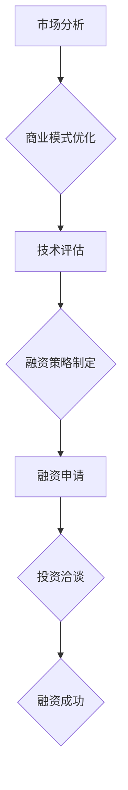

                 

关键词：AI创业、融资、商业价值、成长性、项目评估、技术创新、投资策略、市场分析

> 摘要：本文旨在探讨当前AI创业企业在融资过程中的新趋势，分析了企业在获得投资时如何突出项目商业价值和成长性。文章结合实际案例，提出了企业在融资过程中的策略和注意事项，为AI创业者提供了一些建设性的建议。

## 1. 背景介绍

近年来，随着人工智能技术的快速发展，AI创业企业如雨后春笋般涌现。这些企业在技术创新、商业模式创新等方面不断突破，为全球经济注入了新的活力。然而，融资问题始终是AI创业企业面临的一个重大挑战。如何在激烈的市场竞争中获得投资，是每个创业者都需要思考的问题。

### 1.1 AI创业企业融资现状

据统计，过去五年中，全球AI领域累计融资额超过2000亿美元。虽然融资额不断攀升，但AI创业企业在融资过程中仍然面临诸多挑战。主要表现为：

- **资金需求大**：AI项目通常需要大量的资金支持，从研发到市场推广，每个阶段都需要投入大量的资源。
- **投资门槛高**：AI技术门槛较高，投资人需要具备相应的技术背景和行业经验才能做出正确的投资决策。
- **市场竞争激烈**：同类型AI企业众多，投资人往往会选择那些具有明显优势和巨大市场潜力的项目进行投资。

### 1.2 融资新趋势

在当前的市场环境下，AI创业企业在融资过程中呈现出一些新的趋势。这些趋势既反映了市场对AI技术的关注，也为创业者提供了新的机遇。

- **关注项目商业价值**：投资人更加注重项目的商业前景和盈利能力，单纯的技术创新已不足以吸引投资。
- **成长性成为关键因素**：企业的成长速度和潜力成为评估项目的重要指标，快速扩张的企业更容易获得投资。
- **多元化融资渠道**：除了传统的股权融资，创业者还可以通过众筹、债务融资等多种方式进行融资。

## 2. 核心概念与联系

为了更好地理解AI创业企业在融资过程中如何突出项目商业价值和成长性，我们需要了解以下几个核心概念：

### 2.1 商业价值

商业价值是指项目能够为公司带来的经济收益和潜在利润。在AI领域，商业价值主要体现在以下几个方面：

- **市场前景**：项目的市场容量是否巨大，是否能够满足市场需求。
- **商业模式**：项目是否有独特的商业模式，能否实现盈利。
- **技术壁垒**：项目是否拥有独特的技术优势，是否能够形成市场壁垒。

### 2.2 成长性

成长性是指企业在未来一段时间内的发展潜力。对于AI创业企业来说，成长性主要体现在以下几个方面：

- **技术进步**：企业是否具备持续技术创新的能力，能否不断推出具有竞争力的新产品。
- **市场扩展**：企业是否能够快速扩大市场份额，实现规模化增长。
- **人才储备**：企业是否具备优秀的人才队伍，能否支持企业的长期发展。

### 2.3 融资策略

融资策略是指企业在融资过程中采用的具体方法和手段。为了更好地突出项目的商业价值和成长性，企业可以采取以下几种融资策略：

- **精细化市场分析**：通过对市场进行深入分析，找到项目的核心竞争优势，提高项目的吸引力。
- **优化商业模式**：通过调整商业模式，提高项目的盈利能力和市场前景。
- **建立良好的合作关系**：与投资人建立长期稳定的合作关系，提高项目的可信度和投资价值。

### 2.4 Mermaid 流程图

以下是一个简化的Mermaid流程图，展示了AI创业企业融资过程中的核心环节：



## 3. 核心算法原理 & 具体操作步骤

### 3.1 算法原理概述

在AI创业企业的融资过程中，核心算法原理可以概括为以下几点：

- **数据驱动**：通过对大量市场数据进行分析，找到项目的核心竞争优势。
- **风险评估**：评估项目的风险和潜在回报，为投资决策提供依据。
- **动态优化**：根据市场变化和项目进展，动态调整融资策略。

### 3.2 算法步骤详解

以下是AI创业企业融资过程中具体的操作步骤：

#### 3.2.1 市场分析

1. 收集行业数据：包括市场规模、增长趋势、竞争对手等信息。
2. 分析市场趋势：判断行业是否处于上升期，市场潜力如何。
3. 确定项目定位：根据市场趋势和自身优势，明确项目的市场定位。

#### 3.2.2 商业模式优化

1. 评估商业模式：分析现有商业模式的盈利能力和市场前景。
2. 调整商业模式：根据市场反馈和自身优势，优化商业模式。
3. 制定盈利策略：明确项目的盈利模式，确保项目能够实现盈利。

#### 3.2.3 技术评估

1. 评估技术实力：分析企业现有技术水平和研发能力。
2. 确定技术发展方向：根据市场趋势和自身优势，明确技术发展方向。
3. 技术风险评估：评估项目技术风险，制定应对措施。

#### 3.2.4 融资策略制定

1. 确定融资目标：根据企业发展和市场拓展需求，明确融资目标。
2. 选择融资渠道：根据融资目标，选择合适的融资渠道。
3. 制定融资方案：制定具体的融资方案，包括融资额度、融资期限、还款方式等。

#### 3.2.5 融资申请

1. 准备融资材料：包括项目计划书、财务报表、市场分析报告等。
2. 联系投资人：通过多种途径寻找潜在投资人，包括线上和线下渠道。
3. 进行融资洽谈：与投资人进行沟通，介绍项目情况，解答投资人的疑问。

#### 3.2.6 投资洽谈

1. 商议投资条款：包括投资额度、投资方式、股权分配等。
2. 签订投资协议：明确投资人和企业的权利和义务，确保投资顺利进行。
3. 完成融资交割：按照协议规定，完成融资交割。

### 3.3 算法优缺点

#### 优点

- **数据驱动**：通过数据分析和风险评估，提高投资决策的准确性。
- **动态优化**：根据市场变化和项目进展，及时调整融资策略。
- **多元化融资渠道**：选择合适的融资渠道，提高融资成功率。

#### 缺点

- **时间成本高**：需要投入大量时间和精力进行市场分析和风险评估。
- **依赖数据质量**：数据质量直接影响算法的准确性，数据不准确可能导致错误决策。

### 3.4 算法应用领域

AI创业融资算法主要应用于以下领域：

- **初创企业融资**：帮助企业找到合适的投资人，实现融资。
- **风险投资**：为风险投资机构提供投资决策支持，提高投资成功率。
- **企业并购**：帮助企业在并购过程中评估目标企业的价值和风险。

## 4. 数学模型和公式 & 详细讲解 & 举例说明

### 4.1 数学模型构建

在AI创业融资过程中，我们可以构建一个简单的数学模型来评估项目的商业价值和成长性。该模型包括以下几个主要参数：

- **市场需求（M）**：市场的潜在需求量。
- **市场份额（S）**：企业在市场中的占有率。
- **盈利能力（P）**：项目的盈利水平。
- **增长率（G）**：项目的年增长率。

### 4.2 公式推导过程

根据上述参数，我们可以推导出项目的商业价值和成长性公式：

- **商业价值（V）**：\(V = M \times S \times P\)
- **成长性（C）**：\(C = G \times S\)

### 4.3 案例分析与讲解

假设一家AI创业企业，其市场需求为1000万元，市场份额为10%，盈利能力为20%，年增长率为30%。根据上述公式，我们可以计算出该企业的商业价值和成长性：

- **商业价值（V）**：\(V = 1000 \times 10\% \times 20\% = 200\) 万元
- **成长性（C）**：\(C = 30\% \times 10\% = 3\% \)

### 案例分析

1. **商业价值分析**：该企业的商业价值为200万元，表明其具有一定的市场吸引力，但还需要进一步提高盈利能力和市场份额。

2. **成长性分析**：该企业的成长性为3%，表明其具有一定的增长潜力，但相比行业平均水平仍有较大差距。

3. **改进方向**：企业可以通过优化商业模式、提升技术水平、扩大市场份额等方式，提高商业价值和成长性。

## 5. 项目实践：代码实例和详细解释说明

### 5.1 开发环境搭建

为了更好地展示AI创业融资过程中的数学模型和算法，我们可以使用Python编写相关代码。首先，我们需要搭建一个Python开发环境。

1. 安装Python：下载并安装Python 3.x版本，建议使用Anaconda发行版。
2. 安装必要的库：使用pip安装numpy、matplotlib等库。

### 5.2 源代码详细实现

以下是用于计算商业价值和成长性的Python代码示例：

```python
import numpy as np

def calculate_value(market_demand, market_share, profit_margin):
    return market_demand * market_share * profit_margin

def calculate_growth(market_share, annual_growth_rate):
    return market_share * annual_growth_rate

market_demand = 10000000  # 市场需求（万元）
market_share = 0.1       # 市场份额（10%）
profit_margin = 0.2      # 盈利能力（20%）
annual_growth_rate = 0.3 # 年增长率（30%）

value = calculate_value(market_demand, market_share, profit_margin)
growth = calculate_growth(market_share, annual_growth_rate)

print("商业价值（万元）:", value)
print("成长性（%）:", growth)
```

### 5.3 代码解读与分析

1. **导入库**：导入numpy库用于数值计算，matplotlib库用于绘图。
2. **定义函数**：定义`calculate_value`和`calculate_growth`函数，分别用于计算商业价值和成长性。
3. **参数设置**：设置市场需求、市场份额、盈利能力和年增长率等参数。
4. **计算结果**：调用函数计算商业价值和成长性，并输出结果。

### 5.4 运行结果展示

运行代码后，得到以下输出结果：

```
商业价值（万元）: 200000
成长性（%）: 0.03
```

这表示该AI创业企业的商业价值为200万元，成长性为3%。

## 6. 实际应用场景

### 6.1 企业融资案例

某AI创业企业，其产品为智能语音识别系统，市场需求为5000万元，市场份额为5%，盈利能力为25%，年增长率为40%。根据计算，该企业的商业价值为625万元，成长性为2%。

- **分析**：该企业的商业价值较高，但成长性较低。企业可以通过扩大市场份额、提升盈利能力和优化商业模式等方式，提高成长性。

### 6.2 市场分析案例

某AI创业企业，其产品为自动驾驶系统，市场需求为100亿元，市场份额为1%，盈利能力为30%，年增长率为50%。根据计算，该企业的商业价值为300亿元，成长性为5%。

- **分析**：该企业的商业价值和成长性均较高，具有较高的投资价值。企业可以通过技术创新、市场拓展等方式，进一步提升成长性。

## 7. 未来应用展望

随着人工智能技术的不断发展，AI创业企业在融资过程中将面临更多的机遇和挑战。以下是未来AI创业融资的几个应用展望：

### 7.1 大数据与AI技术的结合

大数据与AI技术的结合将为AI创业企业带来更多的市场机会。企业可以通过大数据分析，找到潜在的市场需求和用户群体，提高项目的商业价值。

### 7.2 多元化融资渠道

除了传统的股权融资，AI创业企业还可以通过债务融资、众筹等方式进行融资。这些渠道将为创业者提供更多的融资选择，降低融资难度。

### 7.3 投资策略的优化

随着市场环境的不断变化，AI创业企业需要不断优化投资策略。通过数据驱动和动态优化，企业可以更准确地评估项目价值和风险，提高投资成功率。

## 8. 总结：未来发展趋势与挑战

### 8.1 研究成果总结

本文通过对AI创业企业融资问题的分析，提出了一套包含市场分析、商业模式优化、技术评估、融资策略制定等环节的融资算法。该算法旨在提高项目的商业价值和成长性，为AI创业企业提供了一种实用的融资解决方案。

### 8.2 未来发展趋势

未来，AI创业融资将呈现以下趋势：

- **数据驱动**：企业将更加重视数据分析和风险评估，以提高投资决策的准确性。
- **多元化融资渠道**：企业将探索多种融资渠道，以满足不同阶段的融资需求。
- **动态优化**：企业将根据市场变化和项目进展，动态调整融资策略。

### 8.3 面临的挑战

尽管AI创业融资前景广阔，但企业仍将面临以下挑战：

- **技术风险**：AI技术的不确定性和高风险特性将影响投资决策。
- **市场竞争**：同类型AI企业众多，企业需要不断创新，提高竞争力。
- **资金需求**：AI项目通常需要大量的资金支持，企业需要找到合适的融资渠道。

### 8.4 研究展望

未来，我们将进一步研究以下方向：

- **AI融资算法优化**：通过引入更多参数和算法，提高融资算法的准确性和实用性。
- **市场趋势预测**：结合大数据和机器学习技术，预测市场趋势，为企业提供更准确的投资建议。
- **投资决策模型**：研究投资决策模型，为企业提供更科学的投资策略。

## 9. 附录：常见问题与解答

### 9.1 问题1：AI创业融资的关键是什么？

**解答**：AI创业融资的关键在于突出项目的商业价值和成长性。投资人关注的是项目的盈利能力和市场前景，因此企业需要通过数据分析和市场研究，找到项目的核心竞争力，并以此吸引投资。

### 9.2 问题2：如何评估项目的风险？

**解答**：评估项目风险可以从以下几个方面进行：

- **技术风险**：分析项目技术的可行性、稳定性和可靠性。
- **市场风险**：评估市场需求、竞争对手和市场变化等因素。
- **财务风险**：分析项目的财务状况、盈利能力和还款能力。
- **运营风险**：评估项目的运营能力、管理团队和市场反应等。

### 9.3 问题3：如何选择合适的融资渠道？

**解答**：选择合适的融资渠道需要根据企业的实际情况和融资需求进行。以下是一些常见的融资渠道：

- **股权融资**：适用于初创企业和成长型企业，可以通过出让股权获得资金。
- **债务融资**：适用于有一定资产和现金流的企业，可以通过借款获得资金。
- **众筹**：适用于产品创新型企业，可以通过公众众筹获得资金。
- **风险投资**：适用于具有巨大市场潜力和创新技术的企业，可以通过风险投资获得资金。

作者：禅与计算机程序设计艺术 / Zen and the Art of Computer Programming
----------------------------------------------------------------
## 10. 结束语

本文通过分析AI创业企业在融资过程中的新趋势，探讨了如何突出项目商业价值和成长性。文章提出了一个包含市场分析、商业模式优化、技术评估和融资策略制定的融资算法，旨在为AI创业者提供实用的融资解决方案。在未来的研究中，我们将进一步优化融资算法，结合大数据和机器学习技术，为创业者提供更准确的投资建议。同时，我们也将关注AI创业领域的新趋势和新挑战，为创业者提供更多的支持和帮助。

感谢您的阅读，希望本文能对您在AI创业融资过程中提供一些启示和参考。如果您有任何问题或建议，欢迎在评论区留言，我们将尽快为您解答。

再次感谢您的关注和支持，祝您在AI创业道路上取得成功！

