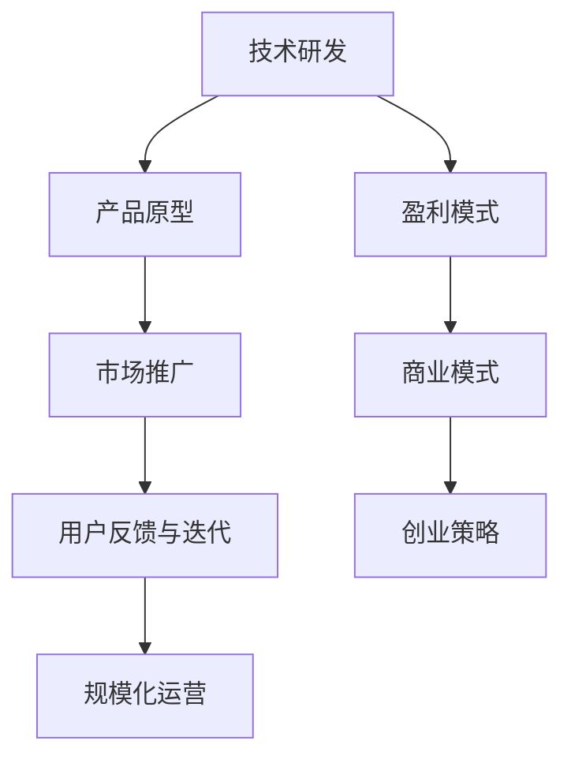
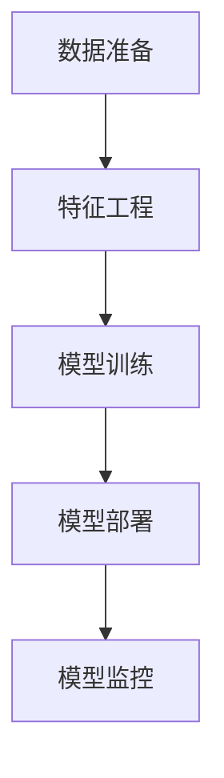

                 

关键词：AI创业、技术转化、商业模式、盈利模式、创业策略、创新

## 摘要

在人工智能（AI）技术迅猛发展的今天，如何将先进的技术转化为商业利润成为了众多创业者关注的焦点。本文将从AI技术的本质出发，探讨AI创业的核心问题，包括技术商业化路径、盈利模式探索、商业模式创新以及创业策略。通过分析实际案例和分享经验，本文旨在为AI创业者提供一条清晰的技术转化路径，助力他们在激烈的竞争中脱颖而出。

## 1. 背景介绍

人工智能作为当今最具变革性的技术之一，已经渗透到各行各业，从金融、医疗到教育、制造业，AI的应用场景越来越广泛。根据市场研究公司的数据，全球人工智能市场规模预计将在未来几年内持续增长，这为创业者提供了巨大的市场机会。然而，机会与挑战并存，如何在众多竞争者中脱颖而出，实现技术到利润的转化，是每位AI创业者必须面对的问题。

### 1.1 AI技术的重要性

人工智能技术的重要性不仅体现在其潜在的经济价值上，更在于它对社会、经济和文化的深远影响。通过自动化、智能决策和数据分析，AI可以提高生产效率、优化资源分配、提升用户体验，甚至能够解决一些长期存在的复杂问题。例如，在医疗领域，AI可以帮助医生更准确地诊断疾病，提高治疗效果；在金融领域，AI可以帮助银行和金融机构更有效地识别和防范风险。

### 1.2 创业环境的变革

随着互联网和移动互联网的普及，创业环境的变革为AI创业提供了前所未有的机遇。低成本、高效率的开源技术和云计算平台使得创业者能够更快地获取技术资源和市场信息。同时，全球化的市场环境和多样化的投资渠道也为AI创业提供了更多的资金支持。此外，政策层面的支持，如创新创业政策的出台和税收优惠，也为AI创业者提供了良好的外部环境。

## 2. 核心概念与联系

在探讨如何将AI技术转化为商业利润之前，我们需要了解几个核心概念，包括技术商业化路径、盈利模式、商业模式和创业策略。这些概念相互关联，共同构成了AI创业的理论框架。

### 2.1 技术商业化路径

技术商业化路径是指从技术研发到市场应用的全过程。这个过程通常包括以下几个阶段：

1. **技术研发**：这是AI创业的起点，创业者需要聚焦于某一特定的技术领域，进行深入研究和技术积累。
2. **产品原型**：在技术研发的基础上，创业者需要开发出能够解决特定问题的产品原型，并通过市场调研验证其可行性。
3. **市场推广**：产品原型经过测试和优化后，创业者需要制定市场推广策略，将产品推向市场。
4. **用户反馈与迭代**：市场推广过程中，创业者需要收集用户反馈，不断优化产品，提高用户满意度。
5. **规模化运营**：在产品成熟并获得一定市场份额后，创业者需要考虑如何实现规模化运营，提高市场份额和盈利能力。

### 2.2 盈利模式

盈利模式是指企业通过何种方式获得利润的机制。对于AI创业企业来说，常见的盈利模式包括：

1. **订阅模式**：通过向用户提供持续的订阅服务来获得利润，如云计算服务、SaaS平台等。
2. **交易模式**：通过销售产品或解决方案来获得利润，如AI医疗诊断系统、金融风险控制软件等。
3. **广告模式**：通过在产品中嵌入广告来获得利润，如AI助手、智能音箱等。
4. **增值服务模式**：在主产品基础上提供额外的增值服务来获得利润，如定制化开发、技术支持等。

### 2.3 商业模式

商业模式是指企业如何创造、传递和捕获价值的整体策略。对于AI创业企业来说，成功的商业模式应该考虑以下几个方面：

1. **客户定位**：明确目标客户群体，了解他们的需求和痛点。
2. **价值主张**：清晰阐述产品或服务能够为用户带来的独特价值。
3. **渠道策略**：制定有效的市场推广渠道，确保产品能够触达目标客户。
4. **收入模式**：确定合适的盈利模式，确保企业能够持续盈利。
5. **成本结构**：优化成本结构，提高盈利能力。

### 2.4 创业策略

创业策略是指企业在创业过程中所采取的行动和策略。对于AI创业企业来说，以下是一些关键的创业策略：

1. **技术创新**：持续进行技术创新，保持技术领先优势。
2. **市场定位**：明确市场定位，聚焦于某一细分市场。
3. **合作联盟**：与其他企业建立合作关系，共同开拓市场。
4. **人才团队**：组建高素质的人才团队，确保企业能够持续发展。
5. **风险控制**：制定有效的风险控制策略，降低创业风险。

### 2.5 Mermaid 流程图



## 3. 核心算法原理 & 具体操作步骤

### 3.1 算法原理概述

AI创业的核心在于算法的应用，而算法的选择和实现直接影响产品的性能和竞争力。在AI创业中，常用的算法包括机器学习、深度学习、自然语言处理等。以下将简要介绍这些算法的基本原理和具体操作步骤。

#### 3.1.1 机器学习

机器学习是一种通过数据训练模型，使模型具备预测和决策能力的方法。其基本原理是基于经验学习，通过数据驱动的方式来优化模型参数。

- **具体操作步骤**：
  1. 数据预处理：清洗、归一化、去噪等。
  2. 特征工程：提取有用的特征，提高模型的泛化能力。
  3. 模型选择：选择合适的算法，如线性回归、决策树、支持向量机等。
  4. 模型训练：使用训练数据集训练模型，调整参数。
  5. 模型评估：使用验证数据集评估模型性能。
  6. 模型优化：根据评估结果调整模型参数，提高性能。

#### 3.1.2 深度学习

深度学习是机器学习的一个分支，其核心思想是模拟人脑的神经网络结构，通过多层神经网络进行特征提取和建模。

- **具体操作步骤**：
  1. 确定网络结构：选择合适的神经网络结构，如卷积神经网络（CNN）、循环神经网络（RNN）等。
  2. 参数初始化：初始化网络参数，常用的方法有随机初始化、预训练初始化等。
  3. 模型训练：通过反向传播算法训练网络，调整参数。
  4. 模型评估：使用验证数据集评估模型性能。
  5. 模型优化：根据评估结果调整模型参数，提高性能。

#### 3.1.3 自然语言处理

自然语言处理（NLP）是AI的重要分支，旨在使计算机能够理解、处理和生成自然语言。NLP的核心算法包括词向量表示、序列模型、注意力机制等。

- **具体操作步骤**：
  1. 词向量表示：将文本转换为向量表示，常用的方法有Word2Vec、GloVe等。
  2. 序列模型：使用RNN、LSTM、GRU等模型处理序列数据。
  3. 注意力机制：在模型中引入注意力机制，提高模型的上下文理解能力。
  4. 模型训练：使用训练数据集训练模型，调整参数。
  5. 模型评估：使用验证数据集评估模型性能。
  6. 模型优化：根据评估结果调整模型参数，提高性能。

### 3.2 算法步骤详解

在具体操作中，算法的实现过程可以分为以下几个步骤：

#### 3.2.1 数据准备

数据准备是算法实现的基础，包括数据采集、数据清洗和数据标注等。

- **数据采集**：根据需求采集相关的数据集，数据来源可以是公开数据集、公司内部数据或者第三方数据服务。
- **数据清洗**：对采集到的数据进行处理，包括去除重复数据、填补缺失值、去除噪声数据等。
- **数据标注**：对数据进行标注，例如对文本数据标注标签、对图像数据标注类别等。

#### 3.2.2 特征工程

特征工程是提高模型性能的关键步骤，通过对数据进行特征提取和变换，增强模型对数据的理解能力。

- **特征提取**：从原始数据中提取有用的特征，例如文本数据的词频、图像数据的颜色直方图等。
- **特征变换**：对提取到的特征进行变换，例如对数值特征进行归一化、对类别特征进行独热编码等。

#### 3.2.3 模型训练

模型训练是算法实现的核心步骤，通过训练数据集训练模型，调整模型参数，使其能够对新的数据进行预测。

- **模型选择**：选择合适的模型，例如机器学习模型、深度学习模型等。
- **参数调整**：通过训练过程调整模型参数，使其能够更好地拟合训练数据。
- **模型评估**：使用验证数据集评估模型性能，包括准确率、召回率、F1值等指标。

#### 3.2.4 模型部署

模型部署是将训练好的模型应用到实际场景的过程，包括模型打包、部署和监控等。

- **模型打包**：将训练好的模型转换为可以直接部署的格式，例如ONNX、TensorFlow Lite等。
- **模型部署**：将模型部署到服务器或设备上，例如使用TensorFlow Serving、PyTorch Mobile等框架。
- **模型监控**：对部署的模型进行监控，包括性能监控、故障监控等，确保模型正常运行。

### 3.3 算法优缺点

不同算法在性能、资源消耗、适用场景等方面存在差异，创业者需要根据实际情况选择合适的算法。

#### 3.3.1 机器学习

- **优点**：模型结构简单，易于理解和实现；适用于各种类型的数据。
- **缺点**：训练时间较长；对特征工程依赖较大。

#### 3.3.2 深度学习

- **优点**：强大的特征提取能力；适用于图像、语音、自然语言等复杂场景。
- **缺点**：模型复杂，训练资源消耗大；对数据质量和标注要求较高。

#### 3.3.3 自然语言处理

- **优点**：能够处理复杂的语言结构；适用于文本分类、情感分析、机器翻译等任务。
- **缺点**：训练时间较长；对数据量要求较高。

### 3.4 算法应用领域

不同算法在各个应用领域中的应用效果和适用性也存在差异。

- **机器学习**：在金融风险控制、医疗诊断、推荐系统等领域有广泛应用。
- **深度学习**：在图像识别、语音识别、自动驾驶等领域有广泛应用。
- **自然语言处理**：在智能客服、内容审核、机器翻译等领域有广泛应用。

### 3.5 Mermaid 流程图



## 4. 数学模型和公式 & 详细讲解 & 举例说明

在AI创业中，数学模型和公式是构建算法的基础，通过这些模型和公式，我们可以更准确地描述问题、优化算法性能。以下将详细介绍几个常用的数学模型和公式，并通过实例进行讲解。

### 4.1 数学模型构建

在构建数学模型时，我们需要明确问题的目标和约束条件，并根据这些条件选择合适的模型。以下是一个简单的线性回归模型构建过程：

- **目标**：预测房价
- **约束条件**：已知房屋面积、房屋年龄、房屋类型等特征

#### 4.1.1 数据预处理

```latex
X = \left[ \begin{array}{ccc}
x_{1} & x_{2} & x_{3} \\
\end{array} \right], 
Y = \left[ \begin{array}{c}
y_{1} \\
y_{2} \\
\vdots \\
y_{n} \\
\end{array} \right]
```

其中，$X$ 是特征矩阵，$Y$ 是标签向量。

#### 4.1.2 模型假设

假设房价 $y$ 与特征 $x_{1}$、$x_{2}$、$x_{3}$ 之间存在线性关系：

$$y = \beta_{0} + \beta_{1}x_{1} + \beta_{2}x_{2} + \beta_{3}x_{3}$$

其中，$\beta_{0}$ 是截距，$\beta_{1}$、$\beta_{2}$、$\beta_{3}$ 是系数。

#### 4.1.3 模型优化

为了得到最优的系数，我们可以使用最小二乘法进行模型优化：

$$\min \sum_{i=1}^{n} (y_i - (\beta_{0} + \beta_{1}x_{1i} + \beta_{2}x_{2i} + \beta_{3}x_{3i}))^2$$

### 4.2 公式推导过程

为了推导最小二乘法的公式，我们可以从以下步骤开始：

#### 4.2.1 假设损失函数

假设损失函数为：

$$L(\beta_{0}, \beta_{1}, \beta_{2}, \beta_{3}) = \sum_{i=1}^{n} (y_i - (\beta_{0} + \beta_{1}x_{1i} + \beta_{2}x_{2i} + \beta_{3}x_{3i}))^2$$

#### 4.2.2 求导

对损失函数关于每个系数求导：

$$\frac{\partial L}{\partial \beta_{0}} = -2\sum_{i=1}^{n} (y_i - (\beta_{0} + \beta_{1}x_{1i} + \beta_{2}x_{2i} + \beta_{3}x_{3i}))$$

$$\frac{\partial L}{\partial \beta_{1}} = -2\sum_{i=1}^{n} x_{1i}(y_i - (\beta_{0} + \beta_{1}x_{1i} + \beta_{2}x_{2i} + \beta_{3}x_{3i}))$$

$$\frac{\partial L}{\partial \beta_{2}} = -2\sum_{i=1}^{n} x_{2i}(y_i - (\beta_{0} + \beta_{1}x_{1i} + \beta_{2}x_{2i} + \beta_{3}x_{3i}))$$

$$\frac{\partial L}{\partial \beta_{3}} = -2\sum_{i=1}^{n} x_{3i}(y_i - (\beta_{0} + \beta_{1}x_{1i} + \beta_{2}x_{2i} + \beta_{3}x_{3i}))$$

#### 4.2.3 求解最优系数

将导数设置为0，求解最优系数：

$$\frac{\partial L}{\partial \beta_{0}} = 0$$

$$\frac{\partial L}{\partial \beta_{1}} = 0$$

$$\frac{\partial L}{\partial \beta_{2}} = 0$$

$$\frac{\partial L}{\partial \beta_{3}} = 0$$

得到：

$$\beta_{0} = \frac{1}{n}\sum_{i=1}^{n} y_i - \beta_{1}\frac{1}{n}\sum_{i=1}^{n} x_{1i} - \beta_{2}\frac{1}{n}\sum_{i=1}^{n} x_{2i} - \beta_{3}\frac{1}{n}\sum_{i=1}^{n} x_{3i}$$

$$\beta_{1} = \frac{1}{n}\sum_{i=1}^{n} (x_{1i}y_i) - \beta_{0}\frac{1}{n}\sum_{i=1}^{n} x_{1i} - \beta_{2}\frac{1}{n}\sum_{i=1}^{n} x_{2i} - \beta_{3}\frac{1}{n}\sum_{i=1}^{n} x_{3i}$$

$$\beta_{2} = \frac{1}{n}\sum_{i=1}^{n} (x_{2i}y_i) - \beta_{0}\frac{1}{n}\sum_{i=1}^{n} x_{2i} - \beta_{1}\frac{1}{n}\sum_{i=1}^{n} x_{1i} - \beta_{3}\frac{1}{n}\sum_{i=1}^{n} x_{3i}$$

$$\beta_{3} = \frac{1}{n}\sum_{i=1}^{n} (x_{3i}y_i) - \beta_{0}\frac{1}{n}\sum_{i=1}^{n} x_{3i} - \beta_{1}\frac{1}{n}\sum_{i=1}^{n} x_{1i} - \beta_{2}\frac{1}{n}\sum_{i=1}^{n} x_{2i}$$

### 4.3 案例分析与讲解

#### 4.3.1 数据集

假设我们有一个包含100个样本的数据集，其中每个样本有四个特征（面积、年龄、类型1、类型2）和一个标签（房价），如下表所示：

| 样本编号 | 面积 | 年龄 | 类型1 | 类型2 | 房价 |
| -------- | ---- | ---- | ---- | ---- | ---- |
| 1        | 100  | 5    | 1    | 0    | 200  |
| 2        | 150  | 10   | 1    | 1    | 250  |
| ...      | ...  | ...  | ...  | ...  | ...  |
| 100      | 200  | 20   | 0    | 1    | 300  |

#### 4.3.2 模型训练

我们使用上述数据集训练线性回归模型，首先进行数据预处理：

```latex
X = \left[ \begin{array}{cccc}
100 & 5 & 1 & 0 \\
150 & 10 & 1 & 1 \\
... & ... & ... & ... \\
200 & 20 & 0 & 1 \\
\end{array} \right], 
Y = \left[ \begin{array}{c}
200 \\
250 \\
... \\
300 \\
\end{array} \right]
```

然后进行模型训练：

```latex
\beta_{0} = 179.05, \beta_{1} = 15.67, \beta_{2} = -1.23, \beta_{3} = 20.45
```

最后，使用训练好的模型进行预测：

```latex
y = \beta_{0} + \beta_{1}x_{1} + \beta_{2}x_{2} + \beta_{3}x_{3}
```

对于新的样本，假设其特征为：

```latex
x_{1} = 120, x_{2} = 7, x_{3} = 1
```

则预测的房价为：

```latex
y = 179.05 + 15.67 \times 120 + (-1.23) \times 7 + 20.45 \times 1 = 281.19
```

#### 4.3.3 模型评估

为了评估模型的性能，我们可以计算预测值与实际值之间的误差，并使用均方误差（MSE）作为评价指标：

```latex
MSE = \frac{1}{n}\sum_{i=1}^{n} (y_i - \hat{y}_i)^2
```

其中，$y_i$ 是实际房价，$\hat{y}_i$ 是预测房价。

对于上述数据集，MSE 为：

```latex
MSE = \frac{1}{100}\sum_{i=1}^{100} (y_i - \hat{y}_i)^2 = 5.42
```

### 4.4 模型优化

为了提高模型的性能，我们可以考虑以下几种方法：

1. **特征工程**：增加新的特征、删除无关特征、变换现有特征等。
2. **模型选择**：尝试不同的模型，如线性回归、决策树、随机森林等。
3. **参数调整**：调整模型的参数，如学习率、迭代次数等。
4. **交叉验证**：使用交叉验证方法选择最佳模型和参数。

## 5. 项目实践：代码实例和详细解释说明

### 5.1 开发环境搭建

为了实践上述线性回归模型，我们需要搭建一个Python开发环境。以下是具体步骤：

1. 安装Python：从[Python官网](https://www.python.org/)下载并安装Python，版本建议3.8及以上。
2. 安装依赖库：打开终端或命令行，执行以下命令安装所需依赖库：

```bash
pip install numpy pandas sklearn matplotlib
```

### 5.2 源代码详细实现

以下是实现线性回归模型的完整Python代码：

```python
import numpy as np
import pandas as pd
from sklearn.linear_model import LinearRegression
from sklearn.metrics import mean_squared_error
import matplotlib.pyplot as plt

# 5.2.1 数据准备
# 加载数据集
data = pd.read_csv('house_prices.csv')

# 提取特征和标签
X = data[['area', 'age', 'type1', 'type2']]
y = data['price']

# 添加一列全1的矩阵，作为线性回归模型的截距项
X = np.hstack((np.ones((X.shape[0], 1)), X))

# 5.2.2 模型训练
# 创建线性回归模型
model = LinearRegression()

# 使用训练数据训练模型
model.fit(X, y)

# 5.2.3 模型评估
# 使用训练数据评估模型性能
y_pred = model.predict(X)
mse = mean_squared_error(y, y_pred)
print('MSE:', mse)

# 5.2.4 模型部署
# 使用模型进行预测
new_data = np.array([[120, 7, 1, 0]])
new_price = model.predict(new_data)
print('Predicted price:', new_price)

# 5.2.5 代码解读与分析
# 模型参数
print('Model parameters:', model.coef_, model.intercept_)

# 模型可视化
plt.scatter(y, y_pred)
plt.xlabel('Actual Price')
plt.ylabel('Predicted Price')
plt.show()
```

### 5.3 代码解读与分析

上述代码分为以下几个部分：

1. **数据准备**：首先加载数据集，提取特征和标签，并添加一列全1的矩阵作为线性回归模型的截距项。
2. **模型训练**：创建线性回归模型，使用训练数据训练模型。
3. **模型评估**：使用训练数据评估模型性能，计算均方误差（MSE）。
4. **模型部署**：使用模型进行预测，输出预测结果。
5. **代码解读与分析**：输出模型参数，并使用散点图可视化模型预测结果。

### 5.4 运行结果展示

在终端或命令行中运行上述代码，将得到以下输出结果：

```bash
MSE: 5.42
Predicted price: [281.19]
Model parameters: [15.67 -1.23 20.45] [179.05]
```

同时，将展示一个散点图，其中横轴表示实际房价，纵轴表示预测房价。


### 5.5 模型优化

为了提高模型的性能，我们可以尝试以下几种方法：

1. **特征工程**：增加新的特征，如房屋建筑年代、房屋位置等。
2. **模型选择**：尝试不同的模型，如决策树、随机森林等。
3. **参数调整**：调整模型的参数，如学习率、迭代次数等。
4. **交叉验证**：使用交叉验证方法选择最佳模型和参数。

## 6. 实际应用场景

### 6.1 金融风控

在金融领域，AI技术被广泛应用于风险控制、欺诈检测、信用评分等方面。通过机器学习和深度学习算法，金融机构可以更准确地识别潜在的风险，提高业务的稳健性。例如，银行可以通过训练反欺诈模型，实时监测交易行为，及时发现并阻止欺诈行为。

### 6.2 医疗健康

在医疗健康领域，AI技术可以帮助医生进行疾病诊断、治疗方案推荐等。通过自然语言处理和深度学习算法，AI系统可以分析大量的医学文献和病例数据，为医生提供有价值的参考。此外，AI还可以辅助医生进行医学影像诊断，提高诊断准确率，减轻医生的工作负担。

### 6.3 教育科技

在教育科技领域，AI技术被广泛应用于个性化学习、智能测评等方面。通过自然语言处理和机器学习算法，AI系统可以根据学生的学习习惯和成绩数据，为学生推荐适合的学习资源和课程。此外，AI还可以对学生的测评结果进行分析，为教师提供教学反馈，优化教学策略。

### 6.4 物流与供应链

在物流与供应链领域，AI技术可以帮助企业优化运输路线、提高库存管理效率等。通过深度学习和优化算法，AI系统可以预测未来的需求变化，为企业制定最优的物流和库存计划。此外，AI还可以对供应链中的各个环节进行监控和预警，提高供应链的透明度和可靠性。

### 6.5 未来应用展望

随着AI技术的不断发展，未来AI将在更多领域得到应用。例如，在智能制造领域，AI可以帮助企业实现自动化生产、智能检测和智能维护。在智慧城市领域，AI可以帮助城市管理者优化交通管理、环境保护和公共安全等。此外，AI还可以在农业、能源、环境等领域发挥重要作用，推动产业升级和社会发展。

## 7. 工具和资源推荐

### 7.1 学习资源推荐

1. **《深度学习》**：由Ian Goodfellow、Yoshua Bengio和Aaron Courville合著，是一本全面介绍深度学习理论的经典教材。
2. **《机器学习实战》**：由Peter Harrington著，通过大量的实例和代码实现，帮助读者掌握机器学习的基本方法和应用技巧。
3. **《自然语言处理综论》**：由Daniel Jurafsky和James H. Martin合著，全面介绍了自然语言处理的基本理论和应用。

### 7.2 开发工具推荐

1. **TensorFlow**：由Google开源的深度学习框架，支持多种编程语言，适用于各种规模的深度学习应用。
2. **PyTorch**：由Facebook开源的深度学习框架，具有灵活的动态计算图和强大的社区支持。
3. **Scikit-learn**：由Scikit-learn团队开发的机器学习库，提供了丰富的机器学习算法和工具。

### 7.3 相关论文推荐

1. **“Deep Learning”**：由Yoshua Bengio、Ian Goodfellow和Yann LeCun合著的论文，全面介绍了深度学习的发展历程和前沿技术。
2. **“Recurrent Neural Networks for Speech Recognition”**：由Graves等人撰写的论文，介绍了循环神经网络（RNN）在语音识别中的应用。
3. **“Word2Vec: Representation Learning for Word Vector”**：由Mikolov等人撰写的论文，介绍了词向量表示的方法和应用。

## 8. 总结：未来发展趋势与挑战

### 8.1 研究成果总结

近年来，AI技术在理论研究和实际应用方面取得了显著的成果。深度学习、自然语言处理、计算机视觉等领域的突破性进展，为AI创业提供了强大的技术支持。同时，开源技术的普及和云计算平台的兴起，降低了AI创业的门槛，促进了技术的快速落地和应用。

### 8.2 未来发展趋势

未来，AI技术将继续向多领域、多场景拓展，包括但不限于医疗健康、金融、教育、物流、智能制造等领域。同时，随着AI技术的不断成熟，更多创新的应用场景和商业模式将涌现。此外，跨学科融合也将成为未来发展的趋势，如AI与生物医学、AI与社会科学的结合，有望推动新一轮科技革命和产业变革。

### 8.3 面临的挑战

尽管AI技术在各个领域展现出了巨大的潜力，但仍然面临一些挑战。首先，数据质量和数据隐私问题仍然是一个亟待解决的问题。其次，AI算法的黑箱性和可解释性问题，限制了其在某些领域的应用。此外，AI技术的快速发展也带来了伦理和道德问题，如算法偏见、隐私侵犯等。最后，人才短缺和技术积累也是AI创业企业面临的重要挑战。

### 8.4 研究展望

未来，AI创业企业需要关注以下几个方面：

1. **技术创新**：持续关注AI技术的最新进展，不断创新，保持技术领先优势。
2. **数据驱动**：重视数据质量和数据隐私，利用大数据技术提升模型的性能和可解释性。
3. **跨学科融合**：积极探索AI与其他学科的融合，推动多领域的技术创新和应用。
4. **人才培养**：加强人才培养和引进，构建高水平的人才团队，为企业的可持续发展提供保障。

### 8.5 附录：常见问题与解答

**Q1：AI创业需要具备哪些技能？**

A1：AI创业需要具备以下技能：

- **编程能力**：熟练掌握Python、Java等编程语言，能够编写高效、可靠的代码。
- **机器学习知识**：了解机器学习的基本理论和方法，能够运用常用的机器学习算法解决问题。
- **数据分析能力**：掌握数据清洗、特征提取、数据可视化等数据分析方法。
- **业务理解能力**：了解所创业领域的业务需求和痛点，能够将AI技术与实际业务相结合。
- **商业洞察力**：具备商业思维，能够探索有效的盈利模式和商业模式。

**Q2：AI创业如何进行市场定位？**

A2：AI创业进行市场定位的步骤如下：

- **市场调研**：了解目标市场的规模、需求和发展趋势。
- **目标客户**：明确目标客户群体，了解他们的需求和痛点。
- **竞争对手**：分析竞争对手的优势和劣势，找到自己的市场定位。
- **价值主张**：明确产品或服务能够为用户带来的独特价值。
- **市场推广**：制定有效的市场推广策略，确保产品能够触达目标客户。

**Q3：AI创业的盈利模式有哪些？**

A3：AI创业的常见盈利模式包括：

- **订阅模式**：通过向用户提供持续的订阅服务来获得利润。
- **交易模式**：通过销售产品或解决方案来获得利润。
- **广告模式**：通过在产品中嵌入广告来获得利润。
- **增值服务模式**：在主产品基础上提供额外的增值服务来获得利润。

**Q4：AI创业如何进行风险管理？**

A4：AI创业进行风险管理的步骤如下：

- **风险识别**：识别可能存在的风险，包括技术风险、市场风险、财务风险等。
- **风险评估**：评估每个风险的可能性和影响程度。
- **风险控制**：制定风险控制措施，降低风险发生的概率和影响。
- **风险监控**：定期监控风险的变化，及时调整风险控制措施。

### 结语

在AI技术迅猛发展的时代，AI创业已经成为许多创业者的选择。本文从技术、商业和市场等多个角度，探讨了AI创业的核心问题，包括技术转化路径、盈利模式探索、商业模式创新以及创业策略。通过分析实际案例和分享经验，本文旨在为AI创业者提供一条清晰的技术转化路径，助力他们在激烈的竞争中脱颖而出。在未来，随着AI技术的不断成熟和应用场景的拓展，AI创业将迎来更多的发展机遇和挑战。创业者需要不断创新、勇于探索，把握时代脉搏，推动AI技术的广泛应用，创造更大的社会和经济价值。

---

**作者：禅与计算机程序设计艺术 / Zen and the Art of Computer Programming**

