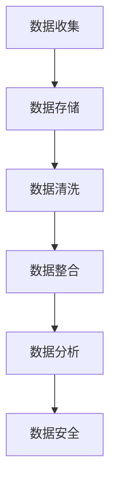

                 

关键词：人工智能，数据管理，AI创业，高效实践，大数据，算法优化

> 摘要：随着人工智能技术的快速发展，数据管理成为AI创业企业的关键竞争力。本文从核心概念、算法原理、数学模型、项目实践和实际应用等方面，深入探讨AI创业中数据管理的高效实践，旨在为创业团队提供实用的指导。

## 1. 背景介绍

在当今数字化的时代，数据已经成为企业最重要的资产之一。人工智能（AI）作为现代技术的代表，以其强大的数据处理和分析能力，推动了各行业的变革。然而，随着数据的爆炸性增长，如何高效地管理这些数据成为AI创业企业面临的一大挑战。数据管理不仅仅是存储和检索，更重要的是如何在海量数据中挖掘出有价值的信息，为业务决策提供支持。

## 2. 核心概念与联系

### 2.1 数据管理的基本概念

数据管理是指通过一系列策略、技术和流程来有效地组织、存储、处理和利用数据。它包括数据收集、数据存储、数据清洗、数据整合、数据分析和数据安全等多个环节。

### 2.2 数据管理与AI的关系

AI的成功依赖于高质量的数据。数据管理不仅要保证数据的准确性和完整性，还需要对数据进行有效的处理和分析，以便AI算法能够从中提取出有用的信息。

### 2.3 Mermaid流程图

以下是一个关于数据管理流程的Mermaid流程图：



## 3. 核心算法原理 & 具体操作步骤

### 3.1 算法原理概述

数据管理中的核心算法主要包括数据清洗、数据整合、数据分析等。这些算法通过特定的算法模型，对数据进行处理和分析，以提高数据质量和利用率。

### 3.2 算法步骤详解

#### 3.2.1 数据清洗

数据清洗是数据管理的重要步骤，它包括以下步骤：

1. **识别缺失值**：通过统计方法识别数据中的缺失值。
2. **填补缺失值**：使用插补法或均值法等填补缺失值。
3. **处理异常值**：通过统计学方法或规则法处理异常值。

#### 3.2.2 数据整合

数据整合是将来自不同源的数据进行合并和统一的过程。主要包括以下步骤：

1. **数据映射**：将不同数据源的字段进行映射，实现数据的统一。
2. **数据合并**：将映射后的数据进行合并，形成统一的数据集。

#### 3.2.3 数据分析

数据分析是数据管理的最终目的，它通过对数据进行分析，提取出有价值的信息。主要包括以下步骤：

1. **数据探索**：使用统计方法对数据进行分析，发现数据中的趋势和模式。
2. **数据可视化**：通过图表和图形将数据进行分析结果进行可视化展示。
3. **数据挖掘**：使用机器学习方法对数据进行分析，提取出更深层次的规律。

### 3.3 算法优缺点

- **数据清洗**：优点是能够提高数据质量，缺点是处理过程复杂，耗时较长。
- **数据整合**：优点是实现数据的统一，缺点是处理过程复杂，可能导致数据丢失。
- **数据分析**：优点是能够提取出有价值的信息，缺点是依赖于算法模型的准确性。

### 3.4 算法应用领域

数据管理算法广泛应用于各个领域，如金融、医疗、电商等。在金融领域，数据清洗和整合用于风险管理；在医疗领域，数据分析用于疾病预测；在电商领域，数据分析用于用户行为分析。

## 4. 数学模型和公式 & 详细讲解 & 举例说明

### 4.1 数学模型构建

数据管理中的数学模型主要包括回归模型、聚类模型、决策树模型等。以下是一个简单的线性回归模型的构建过程：

$$
Y = \beta_0 + \beta_1X_1 + \beta_2X_2 + ... + \beta_nX_n
$$

其中，$Y$ 是因变量，$X_1, X_2, ..., X_n$ 是自变量，$\beta_0, \beta_1, ..., \beta_n$ 是回归系数。

### 4.2 公式推导过程

线性回归模型的推导过程如下：

$$
\begin{aligned}
\min_{\beta_0, \beta_1, ..., \beta_n} \sum_{i=1}^{n}(Y_i - (\beta_0 + \beta_1X_{i1} + \beta_2X_{i2} + ... + \beta_nX_{in}))^2
\end{aligned}
$$

通过求导和化简，可以得到回归系数的解。

### 4.3 案例分析与讲解

假设我们有一个关于房价的数据集，我们希望使用线性回归模型预测房价。首先，我们需要对数据进行清洗和整合，然后构建线性回归模型，最后进行预测。

## 5. 项目实践：代码实例和详细解释说明

### 5.1 开发环境搭建

在Python环境中，我们需要安装以下库：

```python
pip install numpy pandas scikit-learn matplotlib
```

### 5.2 源代码详细实现

以下是线性回归模型的实现代码：

```python
import numpy as np
import pandas as pd
from sklearn.linear_model import LinearRegression
import matplotlib.pyplot as plt

# 加载数据
data = pd.read_csv('house_price.csv')
X = data[['area', 'room']]
y = data['price']

# 创建线性回归模型
model = LinearRegression()
model.fit(X, y)

# 预测
predicted_price = model.predict(X)

# 可视化
plt.scatter(X['area'], y)
plt.plot(X['area'], predicted_price, color='red')
plt.show()
```

### 5.3 代码解读与分析

这段代码首先加载数据，然后创建线性回归模型，并进行拟合。最后，使用模型进行预测，并将预测结果可视化。

## 6. 实际应用场景

数据管理在AI创业中的应用场景非常广泛，如金融风控、医疗诊断、电商推荐等。以下是一个金融风控的应用案例：

### 6.1 金融风控

在金融领域，数据管理可以用于风险识别和预测。通过收集和分析客户的历史交易数据，可以预测客户可能存在的风险，从而采取相应的措施进行风险控制。

## 7. 工具和资源推荐

### 7.1 学习资源推荐

- 《Python数据科学手册》
- 《机器学习实战》
- 《数据挖掘：实用工具和技术》

### 7.2 开发工具推荐

- Jupyter Notebook
- PyCharm
- pandas
- scikit-learn

### 7.3 相关论文推荐

- "Big Data: A Revolution That Will Transform How We Live, Work, and Think"
- "Data Science from A to Z: Practitioners, Researchers, and Business Leaders Cut Through the Data Science Hype"
- "Deep Learning"

## 8. 总结：未来发展趋势与挑战

### 8.1 研究成果总结

数据管理在AI创业中的应用已取得显著成果，如金融风控、医疗诊断、电商推荐等领域的成功案例。

### 8.2 未来发展趋势

随着人工智能和数据科学的发展，数据管理将更加智能化、自动化，并在更多领域得到应用。

### 8.3 面临的挑战

数据质量、数据安全和隐私保护是数据管理面临的主要挑战。

### 8.4 研究展望

未来，数据管理将在智能化、自动化和协同化方面取得突破，为AI创业提供更强有力的支持。

## 9. 附录：常见问题与解答

### 9.1 数据管理的重要性是什么？

数据管理是确保数据质量、可靠性和安全性的关键，它对于AI创业的成功至关重要。

### 9.2 数据清洗的具体步骤是什么？

数据清洗包括识别缺失值、填补缺失值、处理异常值等步骤。

### 9.3 数据分析有哪些方法？

数据分析包括数据探索、数据可视化和数据挖掘等方法。

----------------------------------------------------------------

作者：禅与计算机程序设计艺术 / Zen and the Art of Computer Programming

本文完。希望这篇文章对您在AI创业中数据管理的高效实践有所帮助。

