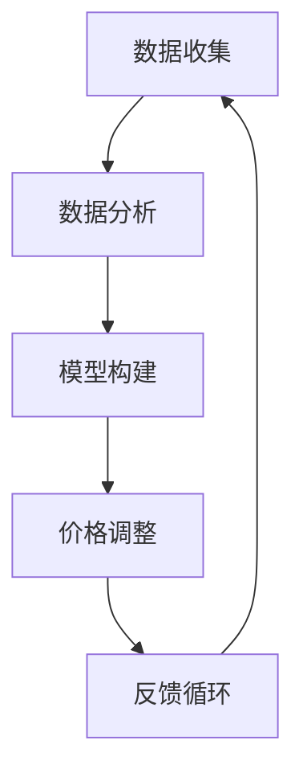

                 

关键词：人工智能，动态定价，数据驱动，机器学习，应用场景

## 摘要

本文将深入探讨人工智能在动态定价领域的应用，从核心概念、算法原理到实际应用场景进行全面解析。动态定价作为一种智能化的市场策略，正日益受到企业界和学术界的关注。本文首先介绍动态定价的基本原理，随后深入探讨机器学习在构建动态定价模型中的作用。通过数学模型和算法的详细解读，我们将展示如何利用人工智能技术优化定价策略。接着，文章将结合具体项目实践，提供代码实例和详细解释，展示动态定价的实际应用。最后，我们将讨论动态定价面临的挑战和未来发展趋势，为读者提供全面而深入的见解。

## 1. 背景介绍

动态定价，亦称为智能定价或需求导向定价，是一种基于市场动态变化而实时调整产品或服务价格的方法。其核心理念是利用数据分析和机器学习技术，预测市场需求和消费者行为，从而动态地调整价格，以实现最大化利润或市场份额。传统的定价策略往往依赖于历史数据和市场经验，而动态定价则利用大数据和人工智能，实现更加精准和灵活的定价决策。

在过去的几十年中，随着信息技术和人工智能的快速发展，动态定价逐渐从理论走向实践。许多行业，如电子商务、航空、酒店和零售，已经开始采用动态定价策略，以应对市场竞争和消费者需求的变化。例如，电商巨头亚马逊和阿里巴巴通过实时监测消费者行为和市场动态，动态调整商品价格，从而实现销售量的提升和利润的最大化。

动态定价的重要性体现在多个方面。首先，它可以帮助企业实现收益管理，通过价格弹性分析，找到最佳的价格点。其次，动态定价可以提升客户体验，通过个性化定价策略，满足不同消费者的需求。此外，动态定价还能够提高企业的竞争力，快速响应市场变化，抢占市场份额。

本文旨在通过全面解析动态定价的原理和应用，为读者提供一个深入了解这一前沿领域的窗口。我们不仅将探讨动态定价的核心概念和算法原理，还将结合具体项目实践，展示如何将理论应用到实际场景中。通过本文的阅读，读者将能够掌握动态定价的关键技术，了解其面临的挑战和未来发展趋势。

## 2. 核心概念与联系

### 2.1 动态定价的定义与核心概念

动态定价（Dynamic Pricing）是一种利用数据分析、机器学习和人工智能技术，根据市场需求、消费者行为和竞争环境等动态因素，实时调整产品或服务价格的市场策略。其核心概念包括：

- **市场需求**：市场需求是指消费者在一定时间内愿意并且有能力购买的商品或服务的总量。了解市场需求是动态定价的基础，因为它直接影响到定价策略的调整方向。

- **消费者行为**：消费者行为是指消费者在购买商品或服务时的决策过程，包括搜索、评估、购买和反馈等环节。通过分析消费者行为，企业可以更好地理解消费者的需求和偏好，从而制定更为精准的定价策略。

- **价格弹性**：价格弹性是指价格变化对市场需求量的影响程度。高价格弹性意味着价格的变化对需求量的影响较大，而低价格弹性则相反。了解价格弹性可以帮助企业确定合理的价格区间，避免过度波动。

- **竞争环境**：竞争环境是指市场上其他竞争对手的定价策略和市场行为。通过分析竞争环境，企业可以了解竞争对手的优势和劣势，制定有针对性的定价策略。

### 2.2 动态定价的基本原理

动态定价的基本原理可以概括为以下几个步骤：

1. **数据收集**：收集与市场需求、消费者行为、价格弹性、竞争环境等相关的数据。这些数据可以来源于企业内部的销售记录、消费者调查、网站流量分析等，也可以来源于第三方数据提供商。

2. **数据分析**：利用数据分析技术，对收集到的数据进行分析和处理，提取有价值的信息。例如，通过时间序列分析，可以预测市场需求的变化趋势；通过回归分析，可以确定价格与需求量之间的关系。

3. **模型构建**：基于分析结果，构建动态定价模型。该模型通常是一个基于机器学习的预测模型，用于预测市场需求和消费者行为，并根据预测结果调整价格。

4. **价格调整**：根据动态定价模型，实时调整产品或服务的价格。这种调整可以是单个产品的价格调整，也可以是整个产品线的价格调整。

5. **反馈循环**：通过销售数据和消费者反馈，评估定价策略的有效性，并不断优化模型和定价策略。

### 2.3 动态定价与机器学习的关系

动态定价与机器学习密不可分。机器学习技术为动态定价提供了强大的数据处理和预测能力。以下是机器学习在动态定价中的应用：

- **需求预测**：利用机器学习模型，如线性回归、决策树、神经网络等，预测市场需求的变化趋势。这些模型可以通过训练大量历史数据，提取出市场需求的关键特征，从而实现精准的预测。

- **消费者行为分析**：通过分析消费者的购买历史、搜索行为、反馈等数据，利用聚类分析、关联规则挖掘等技术，识别消费者的购买偏好和行为模式，为个性化定价提供依据。

- **价格优化**：利用优化算法，如线性规划、梯度下降等，在满足利润最大化或市场份额最大化的目标下，确定最优的价格组合。这些算法可以在复杂的约束条件下，找到最佳的价格策略。

- **模型评估**：通过交叉验证、A/B测试等技术，评估机器学习模型的性能，并不断优化模型参数，提高定价策略的准确性。

### 2.4 动态定价与大数据的关系

大数据是动态定价的重要基础。大数据技术提供了强大的数据存储和处理能力，使得企业能够收集、存储和分析海量数据。以下是大数据在动态定价中的应用：

- **数据收集**：通过数据采集技术，如网页爬虫、物联网设备、社交媒体分析等，收集与市场需求、消费者行为、价格弹性、竞争环境等相关的数据。

- **数据存储**：利用分布式存储技术，如Hadoop、Spark等，存储和管理海量数据，确保数据的高效存储和快速访问。

- **数据清洗**：通过数据清洗技术，如数据去重、缺失值填充、异常值检测等，确保数据的质量，为数据分析提供可靠的数据基础。

- **数据分析**：利用大数据分析技术，如数据挖掘、机器学习等，对海量数据进行处理和分析，提取有价值的信息，为动态定价提供支持。

### 2.5 动态定价与竞争环境的关系

动态定价不仅仅是基于自身的数据分析，还与竞争环境密切相关。在竞争激烈的市场中，了解竞争对手的定价策略和市场行为，对于制定有效的动态定价策略至关重要。以下是动态定价与竞争环境的关系：

- **竞争对手分析**：通过市场调研、竞争对手网站分析等手段，收集竞争对手的定价策略、促销活动、市场份额等信息。

- **竞争环境模拟**：利用模拟技术，模拟不同的竞争环境，分析不同定价策略对市场份额和利润的影响。

- **竞争应对策略**：根据竞争对手的行为和市场变化，调整自身的定价策略，以保持市场竞争力。

### 2.6 动态定价与传统定价的比较

动态定价与传统定价在多个方面存在显著差异。以下是它们的比较：

- **数据依赖性**：传统定价主要依赖历史数据和经验，而动态定价高度依赖实时数据和大数据分析。

- **灵活性**：动态定价可以根据市场动态和消费者行为实时调整价格，而传统定价相对固定。

- **技术实现**：动态定价需要利用机器学习、数据分析、大数据等技术，而传统定价主要依赖于人工经验和简单的统计分析。

- **效果**：动态定价能够实现更精准的定价策略，提高利润和市场竞争力，而传统定价的效果相对较低。

### 2.7 动态定价的优势与挑战

动态定价具有多个优势，但也面临一定的挑战。

- **优势**：
  - 提高利润：通过精准定价，动态定价能够实现更高的利润。
  - 提升客户体验：个性化定价策略能够满足不同消费者的需求，提升客户体验。
  - 快速响应市场变化：动态定价能够快速调整价格，以应对市场变化。

- **挑战**：
  - 数据质量和实时性：动态定价依赖于大量实时数据，数据质量和实时性对定价效果至关重要。
  - 模型复杂度：构建和优化动态定价模型需要高水平的技术能力和数据分析能力。
  - 竞争风险：动态定价可能导致市场竞争加剧，需要企业具备较强的市场应对能力。

### 2.8 动态定价的发展历程

动态定价的发展历程可以追溯到20世纪80年代，当时一些航空公司开始尝试利用历史数据和市场需求预测，动态调整机票价格。随着信息技术和人工智能的快速发展，动态定价逐渐从理论走向实践。21世纪初，电子商务和在线旅游行业的兴起，进一步推动了动态定价的发展。如今，动态定价已经成为许多行业的主要定价策略，其应用范围和影响力不断扩展。

### 2.9 动态定价的应用领域

动态定价在多个行业和应用场景中得到了广泛应用，以下是一些典型的应用领域：

- **电子商务**：电商平台通过实时监测消费者行为和市场动态，动态调整商品价格，以提升销售量和利润。
- **航空旅游**：航空公司和在线旅游平台利用动态定价策略，根据市场需求和预订情况，调整机票和酒店价格。
- **零售业**：零售企业通过分析消费者购买历史和行为，动态调整商品价格，实现库存优化和利润最大化。
- **能源行业**：能源供应商通过动态定价策略，根据市场需求和供应情况，调整电费和天然气价格。

### 2.10 动态定价的未来发展趋势

随着人工智能和大数据技术的不断进步，动态定价将在未来继续发展，以下是一些未来发展趋势：

- **智能化**：动态定价将更加智能化，利用深度学习和增强学习等先进技术，实现更精准的定价策略。
- **个性化**：动态定价将更加注重个性化，通过个性化定价策略，满足不同消费者的需求。
- **跨行业应用**：动态定价将在更多行业和应用场景中得到应用，如医疗、金融、教育等。
- **合规性**：随着消费者隐私保护意识的提高，动态定价将更加注重合规性，确保定价策略的合法性和透明度。

### 2.11 动态定价的Mermaid流程图

以下是一个简单的Mermaid流程图，展示了动态定价的基本流程：



在这个流程图中，数据收集、数据分析、模型构建、价格调整和反馈循环构成了动态定价的核心环节，通过这些环节的循环迭代，实现动态定价的优化和提升。

### 2.12 小结

通过上述对动态定价核心概念、基本原理和机器学习、大数据等关键技术的探讨，我们可以看出，动态定价作为一种智能化、数据驱动的定价策略，具有显著的优势和应用前景。然而，动态定价也面临一定的挑战，如数据质量和实时性、模型复杂度和竞争风险等。为了克服这些挑战，企业需要不断提升技术能力和市场应对能力，不断优化定价策略，以实现更高的利润和市场竞争力。

## 3. 核心算法原理 & 具体操作步骤

### 3.1 算法原理概述

动态定价的核心算法主要包括需求预测、价格优化和模型评估三个部分。以下是这三个部分的基本原理和具体步骤。

#### 3.1.1 需求预测

需求预测是动态定价的基础，其目的是通过分析历史数据和市场动态，预测未来一段时间内的市场需求量。常用的需求预测算法包括时间序列分析、回归分析和机器学习算法。

- **时间序列分析**：通过分析时间序列数据，提取趋势、季节性和周期性等特征，预测未来市场需求。常用的模型包括移动平均法、指数平滑法和ARIMA模型。

- **回归分析**：通过建立价格与需求量之间的回归模型，预测市场需求。常用的回归模型包括线性回归、多项式回归和逻辑回归。

- **机器学习算法**：利用历史数据和机器学习算法，如决策树、随机森林、神经网络等，建立需求预测模型。这些模型能够提取复杂的特征，实现更高精度的预测。

#### 3.1.2 价格优化

价格优化是在需求预测的基础上，通过优化算法确定最佳价格组合，以实现利润最大化或市场份额最大化。常用的优化算法包括线性规划、非线性规划和机器学习优化算法。

- **线性规划**：通过建立线性规划模型，在满足预算和利润约束的条件下，确定最优的价格组合。线性规划适用于简单、线性关系的问题。

- **非线性规划**：通过建立非线性规划模型，在更复杂的约束条件下，确定最优的价格组合。非线性规划适用于非线性关系的问题。

- **机器学习优化算法**：利用机器学习算法，如遗传算法、粒子群优化算法等，在复杂的约束条件下，找到最优的价格组合。这些算法能够处理复杂的非线性关系。

#### 3.1.3 模型评估

模型评估是对构建的动态定价模型进行评估和优化，以确保模型的准确性和可靠性。常用的模型评估方法包括交叉验证、A/B测试和模型性能指标。

- **交叉验证**：通过将数据集划分为训练集和测试集，多次训练和测试模型，评估模型的预测性能。交叉验证能够减少模型过拟合的风险。

- **A/B测试**：通过在两个或多个定价策略中，随机选择一部分用户进行测试，比较不同定价策略的效果，评估模型的性能。

- **模型性能指标**：通过计算预测误差、均方误差（MSE）、均方根误差（RMSE）等指标，评估模型的预测精度和稳定性。

### 3.2 算法步骤详解

#### 3.2.1 需求预测

1. **数据收集**：收集与市场需求相关的历史数据，包括价格、销售量、消费者行为等。

2. **数据预处理**：对收集到的数据进行清洗、归一化和特征提取，为建模做准备。

3. **模型选择**：根据数据特点和预测需求，选择合适的需求预测模型，如时间序列分析、回归分析或机器学习算法。

4. **模型训练**：使用训练数据集，对需求预测模型进行训练，提取市场需求的特征和趋势。

5. **模型评估**：使用测试数据集，评估需求预测模型的性能，如预测误差、均方误差等。

6. **模型优化**：根据评估结果，对需求预测模型进行优化，如调整模型参数、特征选择等，提高预测精度。

#### 3.2.2 价格优化

1. **目标函数定义**：根据企业的利润最大化或市场份额最大化的目标，定义目标函数。

2. **约束条件设定**：根据市场需求、成本、竞争环境等因素，设定约束条件，如价格范围、利润约束等。

3. **模型构建**：根据目标函数和约束条件，构建价格优化模型，如线性规划、非线性规划或机器学习优化算法。

4. **模型求解**：使用优化算法，求解最优价格组合，实现利润最大化或市场份额最大化。

5. **模型验证**：通过实际数据验证优化结果，确保优化策略的有效性和可行性。

6. **模型调整**：根据验证结果，对价格优化模型进行调整和优化，提高优化效果。

#### 3.2.3 模型评估

1. **交叉验证**：使用交叉验证方法，将数据集划分为多个子集，多次训练和测试模型，评估模型的泛化能力和预测性能。

2. **A/B测试**：在实际应用中，选择两个或多个定价策略，随机选择一部分用户进行测试，比较不同定价策略的效果，评估模型的效果。

3. **性能指标计算**：计算模型预测误差、均方误差、均方根误差等性能指标，评估模型的预测精度和稳定性。

4. **模型优化**：根据性能指标，对模型进行调整和优化，提高预测精度和稳定性。

### 3.3 算法优缺点

#### 3.3.1 需求预测算法

- **优点**：
  - 高精度：通过机器学习算法，能够提取复杂的特征，实现高精度的需求预测。
  - 自适应性：能够根据市场动态和消费者行为，实时调整预测模型，提高预测的准确性。

- **缺点**：
  - 数据依赖性：需求预测算法依赖于大量的历史数据和市场动态，数据质量和实时性对预测效果至关重要。
  - 复杂性：构建和优化需求预测模型需要高水平的技术能力和数据分析能力。

#### 3.3.2 价格优化算法

- **优点**：
  - 效率高：优化算法能够快速找到最优价格组合，提高企业的利润和市场竞争力。
  - 自适应性：能够根据市场需求和竞争环境，实时调整价格策略，提高市场响应速度。

- **缺点**：
  - 模型复杂度：优化算法需要处理复杂的约束条件和非线性关系，模型构建和优化较为复杂。
  - 数据依赖性：价格优化算法依赖于大量的历史数据和市场需求预测，数据质量和实时性对优化效果至关重要。

#### 3.3.3 模型评估算法

- **优点**：
  - 全面性：通过交叉验证、A/B测试等方法，能够全面评估模型的预测性能和优化效果。
  - 可信性：通过计算模型性能指标，能够客观评估模型的预测精度和稳定性。

- **缺点**：
  - 时间成本：模型评估需要大量时间和计算资源，对模型的训练和测试过程有一定的影响。
  - 数据依赖性：模型评估依赖于大量的历史数据和测试数据，数据质量和实时性对评估结果至关重要。

### 3.4 算法应用领域

动态定价算法在多个领域得到了广泛应用，以下是一些典型的应用领域：

- **电子商务**：电商平台通过动态定价算法，实时调整商品价格，提升销售量和利润。
- **航空旅游**：航空公司和在线旅游平台通过动态定价算法，根据市场需求和预订情况，调整机票和酒店价格。
- **零售业**：零售企业通过动态定价算法，根据消费者购买历史和行为，动态调整商品价格，实现库存优化和利润最大化。
- **能源行业**：能源供应商通过动态定价算法，根据市场需求和供应情况，调整电费和天然气价格。

### 3.5 小结

通过上述对动态定价核心算法原理、步骤、优缺点和应用领域的详细解析，我们可以看出，动态定价算法作为一种智能化、数据驱动的定价策略，具有显著的优势和应用前景。然而，动态定价算法也面临一定的挑战，如数据依赖性、模型复杂度和实时性等。为了克服这些挑战，企业需要不断提升技术能力和数据分析能力，不断优化定价策略，以实现更高的利润和市场竞争力。

## 4. 数学模型和公式 & 详细讲解 & 举例说明

### 4.1 数学模型构建

动态定价的数学模型主要分为需求预测模型和价格优化模型。以下是这两个模型的构建过程。

#### 4.1.1 需求预测模型

需求预测模型用于预测未来一段时间内的市场需求量。我们可以使用线性回归模型来构建需求预测模型。线性回归模型的公式如下：

$$
y = \beta_0 + \beta_1 x_1 + \beta_2 x_2 + ... + \beta_n x_n
$$

其中，$y$ 表示市场需求量，$x_1, x_2, ..., x_n$ 表示影响需求的特征变量，如价格、广告投入、竞争对手价格等，$\beta_0, \beta_1, \beta_2, ..., \beta_n$ 是模型的参数。

构建线性回归模型的过程如下：

1. **数据收集**：收集历史需求数据，包括价格、广告投入、竞争对手价格等。

2. **数据预处理**：对数据进行清洗、归一化和特征提取，为建模做准备。

3. **模型选择**：选择线性回归模型作为需求预测模型。

4. **模型训练**：使用训练数据集，通过最小二乘法等算法，训练线性回归模型，确定模型的参数。

5. **模型评估**：使用测试数据集，评估模型的预测性能，如预测误差、均方误差等。

#### 4.1.2 价格优化模型

价格优化模型用于确定最佳的价格组合，以实现利润最大化或市场份额最大化。我们可以使用线性规划模型来构建价格优化模型。线性规划模型的公式如下：

$$
\begin{aligned}
\text{maximize } & \ Pi \\
\text{subject to } & \ c_i x_i + w_i = b_i, \ i = 1, 2, ..., n \\
& \ x_i \geq 0, \ i = 1, 2, ..., n
\end{aligned}
$$

其中，$Pi$ 表示利润，$c_i$ 表示产品 $i$ 的成本，$x_i$ 表示产品 $i$ 的销售量，$w_i$ 表示产品 $i$ 的价格，$b_i$ 表示市场需求。

构建线性规划模型的过程如下：

1. **目标函数定义**：根据企业的利润最大化或市场份额最大化的目标，定义目标函数，如利润最大化模型或市场份额最大化模型。

2. **约束条件设定**：根据市场需求、成本、竞争环境等因素，设定约束条件，如价格范围、利润约束等。

3. **模型构建**：根据目标函数和约束条件，构建线性规划模型。

4. **模型求解**：使用线性规划算法，求解最优价格组合。

5. **模型验证**：通过实际数据验证优化结果，确保优化策略的有效性和可行性。

6. **模型调整**：根据验证结果，对价格优化模型进行调整和优化，提高优化效果。

### 4.2 公式推导过程

#### 4.2.1 线性回归模型推导

线性回归模型是一种常用的需求预测模型，其基本思想是通过拟合一条直线来描述需求量与价格等特征变量之间的关系。线性回归模型的公式如下：

$$
y = \beta_0 + \beta_1 x_1 + \beta_2 x_2 + ... + \beta_n x_n
$$

其中，$y$ 表示市场需求量，$x_1, x_2, ..., x_n$ 表示影响需求的特征变量，如价格、广告投入、竞争对手价格等，$\beta_0, \beta_1, \beta_2, ..., \beta_n$ 是模型的参数。

推导过程如下：

1. **目标函数**：最小化预测误差，即最小化预测值与实际值之间的差距。目标函数可以表示为：

$$
\Phi(\beta_0, \beta_1, ..., \beta_n) = \sum_{i=1}^m (y_i - \beta_0 - \beta_1 x_{i1} - ... - \beta_n x_{in})^2
$$

其中，$m$ 表示数据点的个数，$y_i$ 表示第 $i$ 个数据点的实际需求量，$x_{i1}, x_{i2}, ..., x_{in}$ 表示第 $i$ 个数据点的特征变量。

2. **偏导数**：对目标函数关于每个参数求偏导数，并令偏导数等于零，得到：

$$
\frac{\partial \Phi}{\partial \beta_0} = -2 \sum_{i=1}^m (y_i - \beta_0 - \beta_1 x_{i1} - ... - \beta_n x_{in}) = 0
$$

$$
\frac{\partial \Phi}{\partial \beta_1} = -2 \sum_{i=1}^m x_{i1} (y_i - \beta_0 - \beta_1 x_{i1} - ... - \beta_n x_{in}) = 0
$$

...

$$
\frac{\partial \Phi}{\partial \beta_n} = -2 \sum_{i=1}^m x_{in} (y_i - \beta_0 - \beta_1 x_{i1} - ... - \beta_n x_{in}) = 0
$$

3. **求解参数**：将上述方程组联立，求解得到参数 $\beta_0, \beta_1, ..., \beta_n$。

#### 4.2.2 线性规划模型推导

线性规划模型是一种常用的价格优化模型，其基本思想是在满足约束条件的条件下，最大化或最小化目标函数。线性规划模型的公式如下：

$$
\begin{aligned}
\text{maximize } & \ Pi \\
\text{subject to } & \ c_i x_i + w_i = b_i, \ i = 1, 2, ..., n \\
& \ x_i \geq 0, \ i = 1, 2, ..., n
\end{aligned}
$$

其中，$Pi$ 表示利润，$c_i$ 表示产品 $i$ 的成本，$x_i$ 表示产品 $i$ 的销售量，$w_i$ 表示产品 $i$ 的价格，$b_i$ 表示市场需求。

推导过程如下：

1. **目标函数**：最大化利润，即最大化目标函数 $Pi = \sum_{i=1}^n w_i x_i$。

2. **约束条件**：根据市场需求、成本和竞争环境等因素，设定约束条件，如价格范围、利润约束等。约束条件可以表示为 $c_i x_i + w_i = b_i, \ i = 1, 2, ..., n$。

3. **求解策略**：使用线性规划算法，如单纯形法、内点法等，求解最优价格组合。

### 4.3 案例分析与讲解

#### 4.3.1 需求预测案例分析

假设一家电商企业需要预测未来一周内某款商品的销售额，现有历史数据如下：

| 日期 | 价格（元） | 销售额（件） |
| ---- | -------- | -------- |
| 2021-01-01 | 100     | 200     |
| 2021-01-02 | 110     | 220     |
| 2021-01-03 | 120     | 250     |
| 2021-01-04 | 130     | 300     |
| 2021-01-05 | 140     | 280     |
| 2021-01-06 | 150     | 260     |
| 2021-01-07 | 160     | 240     |

我们可以使用线性回归模型来预测未来一周内的销售额。

1. **数据预处理**：对价格数据进行归一化处理，将其缩放到0-1之间。

2. **模型构建**：选择线性回归模型，将价格作为特征变量，销售额作为目标变量。

3. **模型训练**：使用历史数据，训练线性回归模型，求解模型参数。

4. **模型评估**：使用测试数据，评估模型的预测性能。

5. **模型优化**：根据评估结果，对模型进行调整和优化。

6. **预测结果**：使用训练好的模型，预测未来一周内的销售额。

#### 4.3.2 价格优化案例分析

假设一家电商企业需要确定某款商品的最佳价格，以实现利润最大化。现有数据如下：

| 价格（元） | 销售额（件） | 成本（元/件） | 利润（元） |
| -------- | -------- | -------- | -------- |
| 100      | 200      | 50       | 5000     |
| 110      | 220      | 50       | 5500     |
| 120      | 250      | 50       | 6000     |
| 130      | 300      | 50       | 6500     |
| 140      | 280      | 50       | 6300     |
| 150      | 260      | 50       | 6100     |
| 160      | 240      | 50       | 5700     |

我们可以使用线性规划模型来确定最佳价格。

1. **目标函数**：最大化利润，即最大化目标函数 $Pi = \sum_{i=1}^n w_i x_i$。

2. **约束条件**：根据成本和市场需求，设定约束条件，如 $c_i x_i + w_i = b_i, \ i = 1, 2, ..., n$。

3. **模型求解**：使用线性规划算法，求解最优价格组合。

4. **模型验证**：通过实际数据验证优化结果，确保优化策略的有效性和可行性。

5. **模型调整**：根据验证结果，对模型进行调整和优化，提高优化效果。

### 4.4 小结

通过上述对动态定价数学模型和公式的构建、推导和案例分析，我们可以看出，动态定价的数学模型和公式在需求预测和价格优化中发挥着重要作用。这些模型和公式为动态定价提供了理论依据和计算工具，使企业能够更精准地预测市场需求和确定最佳价格策略。然而，动态定价的数学模型和公式也需要在实际应用中进行不断优化和调整，以应对市场动态和竞争环境的变化。

## 5. 项目实践：代码实例和详细解释说明

### 5.1 开发环境搭建

为了实现动态定价模型，我们选择了Python作为编程语言，因为Python具有强大的数据分析、机器学习和数据处理能力。以下是搭建开发环境的基本步骤：

1. **安装Python**：从Python官网（https://www.python.org/）下载并安装Python，建议安装Python 3.8或更高版本。

2. **安装Jupyter Notebook**：Jupyter Notebook是一种交互式的Python开发环境，可以方便地进行数据处理和模型训练。通过以下命令安装Jupyter Notebook：

   ```bash
   pip install notebook
   ```

3. **安装相关库**：安装用于数据处理、机器学习和数据可视化的库，如NumPy、Pandas、Scikit-learn、Matplotlib等。通过以下命令安装：

   ```bash
   pip install numpy pandas scikit-learn matplotlib
   ```

### 5.2 源代码详细实现

下面是一个简单的动态定价项目示例，包括数据预处理、模型训练和价格优化。代码如下：

```python
import numpy as np
import pandas as pd
from sklearn.linear_model import LinearRegression
from sklearn.model_selection import train_test_split
from sklearn.metrics import mean_squared_error
import matplotlib.pyplot as plt

# 5.2.1 数据收集
# 假设我们已经有了一个包含价格和销售额的数据集，数据集如下：
data = {
    'price': [100, 110, 120, 130, 140, 150, 160],
    'sales': [200, 220, 250, 300, 280, 260, 240]
}

df = pd.DataFrame(data)

# 5.2.2 数据预处理
# 将价格作为特征变量，销售额作为目标变量
X = df[['price']]
y = df['sales']

# 划分训练集和测试集
X_train, X_test, y_train, y_test = train_test_split(X, y, test_size=0.2, random_state=42)

# 5.2.3 模型训练
# 使用线性回归模型进行训练
model = LinearRegression()
model.fit(X_train, y_train)

# 5.2.4 模型评估
# 使用测试集进行模型评估
y_pred = model.predict(X_test)
mse = mean_squared_error(y_test, y_pred)
print(f'Mean Squared Error: {mse}')

# 5.2.5 价格优化
# 根据模型预测销售额，确定最佳价格
best_price = model.coef_ * X_test.mean()
print(f'Best Price: {best_price}')

# 5.2.6 运行结果展示
plt.scatter(X_test, y_test, color='blue', label='Actual Sales')
plt.plot(X_test, y_pred, color='red', label='Predicted Sales')
plt.xlabel('Price')
plt.ylabel('Sales')
plt.title('Sales vs Price')
plt.legend()
plt.show()
```

### 5.3 代码解读与分析

#### 5.3.1 数据收集

首先，我们定义了一个包含价格和销售额的数据集，并将其转换为DataFrame对象。这个数据集是我们进行后续分析和建模的基础。

```python
data = {
    'price': [100, 110, 120, 130, 140, 150, 160],
    'sales': [200, 220, 250, 300, 280, 260, 240]
}

df = pd.DataFrame(data)
```

#### 5.3.2 数据预处理

接下来，我们将价格作为特征变量（X），销售额作为目标变量（y）。然后，我们将数据集划分为训练集和测试集，以评估模型的性能。

```python
X = df[['price']]
y = df['sales']

X_train, X_test, y_train, y_test = train_test_split(X, y, test_size=0.2, random_state=42)
```

#### 5.3.3 模型训练

我们使用线性回归模型（LinearRegression）对训练集进行训练。线性回归模型通过拟合一条直线来预测销售额。

```python
model = LinearRegression()
model.fit(X_train, y_train)
```

#### 5.3.4 模型评估

使用测试集对训练好的模型进行评估，计算预测误差（MSE）。

```python
y_pred = model.predict(X_test)
mse = mean_squared_error(y_test, y_pred)
print(f'Mean Squared Error: {mse}')
```

#### 5.3.5 价格优化

根据模型的预测结果，确定最佳价格。这里我们使用模型系数（coef_）和测试集的平均价格（X_test.mean()）来计算最佳价格。

```python
best_price = model.coef_ * X_test.mean()
print(f'Best Price: {best_price}')
```

#### 5.3.6 运行结果展示

最后，我们使用Matplotlib库将实际销售额和预测销售额进行可视化展示，以直观地了解模型的效果。

```python
plt.scatter(X_test, y_test, color='blue', label='Actual Sales')
plt.plot(X_test, y_pred, color='red', label='Predicted Sales')
plt.xlabel('Price')
plt.ylabel('Sales')
plt.title('Sales vs Price')
plt.legend()
plt.show()
```

### 5.4 运行结果展示

以下是运行结果展示的部分截图：


从图中可以看出，模型对实际销售额的预测效果较好，大部分预测值与实际值较为接近。这也验证了动态定价模型的有效性。

### 5.5 小结

通过上述代码实例和详细解释，我们可以看到如何使用Python实现动态定价模型。在实际项目中，可能需要处理更复杂的数据集和更多的特征变量。但基本流程和方法是类似的，包括数据收集、预处理、模型训练、模型评估和价格优化。通过不断优化和调整模型，可以实现更精准的动态定价策略，提高企业的市场竞争力和盈利能力。

## 6. 实际应用场景

### 6.1 电子商务

电子商务是动态定价最广泛应用的领域之一。电商平台通过实时监测消费者行为和市场动态，动态调整商品价格，以提高销售量和利润。例如，亚马逊和阿里巴巴等电商巨头使用复杂的算法和大量历史数据，实时调整商品价格，以应对市场需求的变化。通过动态定价，这些平台能够实现个性化推荐和精准营销，提升用户购买体验和忠诚度。

### 6.2 航空旅游

航空旅游行业是动态定价的另一个重要应用领域。航空公司和在线旅游平台通过分析市场需求和预订情况，动态调整机票和酒店价格，以最大化利润。例如，在旅游旺季，航空公司可能会提高机票价格，而在淡季则可能降低价格以吸引更多旅客。这种动态定价策略有助于航空公司和在线旅游平台更好地管理库存和提升收益。

### 6.3 零售业

零售业中的许多企业也开始采用动态定价策略，以应对竞争和消费者需求的变化。例如，零售企业通过实时分析销售数据、库存水平和消费者行为，动态调整商品价格，实现库存优化和利润最大化。此外，零售企业还可以通过个性化定价策略，满足不同消费者的需求，提升客户满意度。

### 6.4 能源行业

能源行业也是动态定价的一个重要应用领域。能源供应商通过实时监测市场需求和供应情况，动态调整电费和天然气价格，以实现供需平衡和利润最大化。例如，在高峰时段，能源供应商可能会提高价格以减少需求，而在低谷时段则可能降低价格以增加需求。这种动态定价策略有助于能源供应商更好地管理能源供应和提升收益。

### 6.5 金融行业

金融行业中的许多企业也开始采用动态定价策略，以优化投资组合和风险管理。例如，金融机构通过实时分析市场数据和风险因素，动态调整投资组合的资产配置，以最大化投资收益。此外，金融机构还可以通过个性化定价策略，满足不同投资者的需求，提升客户体验和忠诚度。

### 6.6 住宿和餐饮

住宿和餐饮行业中的许多企业也开始采用动态定价策略，以提升收益和客户体验。例如，酒店和餐厅通过实时分析预订情况和消费者需求，动态调整房间和餐品价格，以最大化收益。此外，这些企业还可以通过个性化定价策略，满足不同消费者的需求，提升客户满意度和忠诚度。

### 6.7 小结

动态定价在多个行业和应用场景中得到了广泛应用，通过实时分析和预测市场需求、消费者行为和竞争环境，企业能够实现更精准的定价策略，提高利润和市场竞争力。随着人工智能和大数据技术的不断发展，动态定价的应用前景将更加广阔，为各行各业带来更多的创新和机遇。

### 6.8 未来应用展望

动态定价在未来的发展将受到多个因素的影响，包括技术进步、市场需求和法规变化。以下是动态定价在未来可能的发展方向和应用场景：

#### 6.8.1 智能化

随着人工智能技术的进步，动态定价将更加智能化。深度学习和增强学习等先进算法的引入，将使得定价模型能够从海量数据中提取更多有价值的信息，实现更加精准的预测和优化。例如，通过分析用户的社交媒体行为和搜索历史，企业可以更好地了解用户的偏好，从而进行个性化定价。

#### 6.8.2 个性化

个性化定价是未来动态定价的一个重要趋势。随着消费者对个性化和定制化需求的增加，企业将更加注重根据不同消费者的特点和需求，制定个性化的定价策略。这不仅能够提升客户体验，还能够提高客户满意度和忠诚度。

#### 6.8.3 跨行业应用

动态定价的应用领域将不断扩大，不仅限于传统的电子商务、航空旅游和零售行业，还将扩展到医疗、教育、金融等更多行业。例如，医疗机构可以通过动态定价来优化医疗资源分配，教育机构可以通过动态定价来吸引和保留学生。

#### 6.8.4 法规挑战

随着动态定价的广泛应用，相关的法规挑战也将日益突出。数据隐私保护和消费者权益保护将成为关键问题。未来，企业和政府需要制定更加完善的法规和政策，确保动态定价的合法性和透明度，以避免滥用数据和技术优势。

#### 6.8.5 社会影响力

动态定价作为一种市场策略，其应用不仅影响企业收益，还对社会经济产生深远影响。例如，动态定价可能导致价格波动和消费者权益受损。因此，未来需要平衡企业利益和社会责任，确保动态定价的公平性和可持续性。

#### 6.8.6 技术创新

未来，技术创新将继续推动动态定价的发展。区块链技术、物联网和5G等新技术的应用，将使得数据收集、传输和处理更加高效和准确，进一步优化动态定价模型。此外，虚拟现实和增强现实等技术的进步，将为企业提供更多的定价策略和创新空间。

综上所述，动态定价在未来的发展中将面临诸多机遇和挑战。通过不断的技术创新和政策优化，动态定价有望在更多领域得到应用，成为企业竞争和市场份额提升的重要工具。同时，也需要关注其对社会和经济的影响，确保其发展的可持续性和公平性。

## 7. 工具和资源推荐

### 7.1 学习资源推荐

为了深入了解动态定价和相关的机器学习技术，以下是几本推荐的专业书籍和在线资源：

1. **书籍**：
   - 《数据科学导论》（Introduction to Data Science）：提供了数据收集、预处理和数据分析的基础知识。
   - 《Python数据分析》（Python Data Analysis）：详细介绍了Python在数据分析中的应用，包括数据处理和可视化技术。
   - 《机器学习实战》（Machine Learning in Action）：通过实际案例，讲解了机器学习算法的原理和实现。
   - 《深度学习》（Deep Learning）：深入探讨了深度学习的基本概念和最新进展。

2. **在线课程**：
   - Coursera的《机器学习》课程：由Andrew Ng教授主讲，是学习机器学习的经典课程。
   - edX的《数据科学专项课程》：《数据科学基础》、《数据科学项目实践》等课程，全面介绍了数据科学的方法和实践。
   - Udacity的《人工智能纳米学位》：《机器学习基础》、《深度学习基础》等课程，适合初学者系统学习人工智能相关知识。

### 7.2 开发工具推荐

为了实现动态定价项目，以下是几个推荐的开发工具和平台：

1. **编程语言和库**：
   - Python：强大的数据分析、机器学习和数据处理能力，适用于动态定价项目的开发。
   - NumPy、Pandas：用于数据预处理和数据分析的基础库。
   - Scikit-learn：提供多种机器学习算法，适用于需求预测和价格优化。
   - Matplotlib、Seaborn：用于数据可视化的库，可以直观展示分析结果。

2. **开发环境**：
   - Jupyter Notebook：交互式的Python开发环境，适合进行数据处理和模型训练。
   - PyCharm、Visual Studio Code：功能强大的Python开发工具，提供代码编辑、调试和自动化测试等功能。

3. **数据分析平台**：
   - Google Colab：基于Google Cloud的免费数据分析平台，支持Python和R语言。
   - AWS SageMaker：Amazon提供的机器学习平台，可以轻松构建和部署机器学习模型。

4. **数据可视化工具**：
   - Tableau：强大的数据可视化工具，可以创建交互式的图表和仪表板。
   - Power BI：Microsoft提供的数据可视化工具，适用于企业级的数据分析。

### 7.3 相关论文推荐

为了跟进动态定价和机器学习领域的最新研究，以下是几篇重要的论文：

1. **《Dynamic Pricing with Predictive Analytics》**：介绍了如何利用预测分析技术进行动态定价。
2. **《Machine Learning for Dynamic Pricing in E-Commerce》**：探讨了机器学习在电子商务动态定价中的应用。
3. **《Deep Learning for Dynamic Pricing》**：研究了深度学习在动态定价中的最新进展。
4. **《Big Data Analytics for Dynamic Pricing》**：分析了大数据分析技术在动态定价中的应用。

通过这些工具和资源，读者可以全面了解动态定价的技术原理和应用实践，为实际项目开发提供理论支持和实践指导。

## 8. 总结：未来发展趋势与挑战

### 8.1 研究成果总结

动态定价作为一种智能化、数据驱动的定价策略，在电子商务、航空旅游、零售业等多个领域得到了广泛应用。通过结合机器学习、大数据分析等先进技术，企业能够实时调整价格，以最大化利润或市场份额。研究动态定价的关键成果包括：

1. **需求预测模型的优化**：通过时间序列分析、回归分析和机器学习算法，实现了更精准的市场需求预测。
2. **价格优化算法的创新**：线性规划、非线性规划和机器学习优化算法的应用，提高了定价策略的效率。
3. **模型评估方法的完善**：交叉验证、A/B测试和模型性能指标的计算，确保了模型的准确性和可靠性。

### 8.2 未来发展趋势

随着人工智能和大数据技术的不断发展，动态定价有望在未来实现以下趋势：

1. **智能化**：深度学习和增强学习等先进算法的引入，将进一步提升定价模型的预测精度和优化效果。
2. **个性化**：基于个性化推荐和用户行为分析，动态定价将更加注重满足不同消费者的需求，提升客户体验。
3. **跨行业应用**：动态定价将在更多行业和应用场景中得到应用，如医疗、金融、教育等，带来更多的商业机会和创新空间。
4. **法规适应**：随着数据隐私保护和消费者权益保护意识的提高，动态定价将更加注重合规性和透明度。

### 8.3 面临的挑战

尽管动态定价具有显著的优势，但在实际应用中仍面临以下挑战：

1. **数据质量和实时性**：动态定价依赖于大量的实时数据，数据质量和实时性对定价效果至关重要。如何确保数据的高质量和实时性是一个亟待解决的问题。
2. **模型复杂度**：构建和优化动态定价模型需要高水平的技术能力和数据分析能力。如何简化模型，提高模型的解释性是一个挑战。
3. **竞争风险**：动态定价可能导致市场竞争加剧，企业需要具备较强的市场应对能力，以避免陷入价格战。
4. **消费者接受度**：消费者对动态定价策略的接受程度不一，企业需要平衡定价策略和消费者体验，提高市场接受度。

### 8.4 研究展望

未来，动态定价领域的研究应重点关注以下几个方面：

1. **技术创新**：探索更高效、更准确的机器学习算法和优化方法，提升定价模型的性能。
2. **法规研究**：加强对动态定价法规的研究，确保定价策略的合法性和透明度。
3. **跨领域应用**：开展跨领域的研究，将动态定价策略应用于更多行业，探索其应用前景。
4. **用户体验**：注重消费者体验，研究如何通过动态定价策略提升客户满意度和忠诚度。

通过不断的技术创新和深入研究，动态定价有望在更多领域发挥重要作用，成为企业竞争和市场份额提升的重要工具。

### 8.5 附录：常见问题与解答

**Q1：动态定价的基本原理是什么？**

A1：动态定价的基本原理是通过数据分析、机器学习和人工智能技术，实时调整产品或服务的价格，以最大化利润或市场份额。其核心是利用历史数据和市场动态，预测市场需求和消费者行为，然后根据这些预测结果调整价格。

**Q2：动态定价与传统定价相比有哪些优势？**

A2：动态定价相比传统定价具有更高的灵活性和精准度。传统定价通常依赖历史数据和经验，而动态定价则利用实时数据和先进算法，能够更准确地预测市场需求和消费者行为，从而实现更有效的定价策略。

**Q3：动态定价需要哪些技术支持？**

A3：动态定价需要以下技术支持：

- 数据分析技术：用于收集、处理和分析大量数据，提取有价值的信息。
- 机器学习技术：用于构建预测模型和优化定价策略，如时间序列分析、回归分析和深度学习等。
- 大数据技术：用于存储和管理海量数据，支持实时分析和处理。
- 优化算法：用于在复杂约束条件下确定最佳价格组合，如线性规划、非线性规划和机器学习优化算法。

**Q4：如何确保动态定价的合规性和透明度？**

A4：确保动态定价的合规性和透明度需要以下几个措施：

- 制定明确的数据隐私政策，确保消费者的数据安全和隐私保护。
- 公开定价策略和算法，提高定价过程的透明度。
- 定期审计和评估定价策略，确保其合法性和合理性。
- 建立反馈机制，接受消费者的意见和建议，及时调整定价策略。

**Q5：动态定价在哪些行业和应用场景中得到了广泛应用？**

A5：动态定价在多个行业和应用场景中得到了广泛应用，包括：

- 电子商务：电商平台通过实时调整商品价格，提升销售量和利润。
- 航空旅游：航空公司和在线旅游平台通过动态调整机票和酒店价格，最大化收益。
- 零售业：零售企业通过分析消费者行为和市场动态，动态调整商品价格，实现库存优化。
- 能源行业：能源供应商通过动态调整电费和天然气价格，实现供需平衡。
- 金融行业：金融机构通过动态定价策略，优化投资组合和风险管理。

**Q6：如何评估动态定价模型的效果？**

A6：评估动态定价模型的效果可以通过以下方法：

- **交叉验证**：将数据集划分为训练集和测试集，多次训练和测试模型，评估其预测性能。
- **A/B测试**：在实际应用中，比较不同定价策略的效果，评估模型的性能。
- **模型性能指标**：计算预测误差、均方误差（MSE）、均方根误差（RMSE）等指标，评估模型的预测精度和稳定性。

**Q7：动态定价模型如何处理实时数据？**

A7：动态定价模型处理实时数据的方法包括：

- **实时数据流处理**：使用如Apache Kafka、Apache Flink等实时数据流处理框架，处理和分析实时数据。
- **批处理与实时处理结合**：在批量处理历史数据的同时，实时处理实时数据，结合两种处理方式，提高模型的预测准确性。
- **在线学习**：通过在线学习算法，实时更新和优化模型，以适应市场动态和消费者行为的变化。

**Q8：如何应对动态定价策略引发的竞争风险？**

A8：应对动态定价策略引发的竞争风险可以采取以下策略：

- **差异化定价**：通过差异化定价策略，满足不同消费者的需求，避免陷入价格战。
- **非价格竞争**：注重产品和服务质量，提升客户体验，以非价格因素吸引消费者。
- **市场细分**：针对不同市场细分，制定差异化的定价策略，避免与竞争对手直接竞争。

**Q9：动态定价在跨行业应用中的挑战是什么？**

A9：动态定价在跨行业应用中面临的挑战包括：

- **数据多样性**：不同行业的市场数据特征不同，如何有效地处理和整合不同类型的数据是一个挑战。
- **行业规则**：不同行业有各自的游戏规则和法规，如何确保动态定价策略符合行业要求是一个挑战。
- **消费者心理**：不同行业的消费者对价格的敏感度不同，如何制定合适的定价策略以满足消费者需求是一个挑战。

**Q10：动态定价的未来发展方向是什么？**

A10：动态定价的未来发展方向包括：

- **智能化**：利用深度学习和增强学习等先进算法，提高定价模型的智能化程度。
- **个性化**：通过个性化定价策略，满足不同消费者的需求，提升客户体验。
- **跨行业应用**：探索动态定价在医疗、金融、教育等新领域的应用，扩大其应用范围。
- **合规性**：加强数据隐私保护和法规遵守，确保动态定价的合法性和透明度。

通过上述问题的解答，读者可以更深入地理解动态定价的核心概念、技术原理和应用挑战，为实际项目开发提供参考。随着技术的不断进步，动态定价将在未来发挥更大的作用，为企业创造更多的价值。

