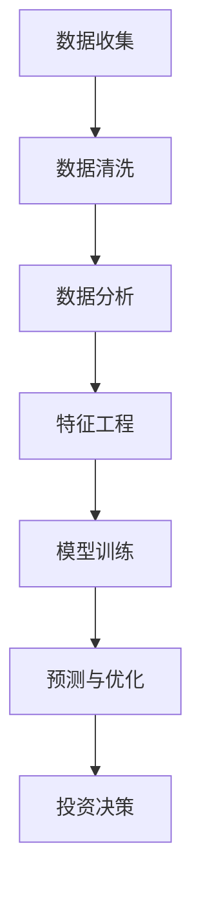

                 

关键词：人工智能、个人理财、财富管理、投资组合优化、风险管理、机器学习、深度学习、区块链技术

> 摘要：本文将探讨人工智能（AI）在现代个人理财和财富管理中的应用，重点分析AI如何通过算法优化、风险管理、投资组合优化等方面，提升个人理财的效率和准确性。此外，还将探讨区块链技术如何增强个人财富的安全性和透明度。

## 1. 背景介绍

随着科技的飞速发展，人工智能（AI）已经逐渐渗透到我们生活的方方面面，从智能家居、无人驾驶到医疗诊断，AI的技术应用越来越广泛。而在个人理财和财富管理领域，AI的引入同样带来了深刻的变革。传统理财方式往往依赖于人工经验和市场直觉，而AI的应用使得数据分析和决策过程更加精准和高效。

个人理财和财富管理涉及多个方面，包括投资组合优化、风险管理、市场预测、个性化理财建议等。这些任务对数据处理能力和算法要求较高，AI的引入为此提供了新的解决方案。

### 个人理财与财富管理的关键领域

1. **投资组合优化**：投资者希望通过最优化的投资组合实现资产增值和风险控制。
2. **风险管理**：识别和评估投资风险，采取相应措施降低损失。
3. **市场预测**：对市场走势进行预测，以便及时调整投资策略。
4. **个性化理财建议**：根据个人财务状况和风险偏好，提供定制化的理财方案。

## 2. 核心概念与联系

在深入探讨AI在个人理财和财富管理中的应用之前，我们需要了解一些核心概念，以及它们之间的联系。

### 2.1. 人工智能与机器学习

人工智能（AI）是指模拟人类智能的技术系统，它通过学习、推理和自我调整来执行复杂任务。机器学习（ML）是AI的一个重要分支，它通过数据驱动的方式，让计算机系统从数据中学习并做出决策。

### 2.2. 深度学习与神经网络

深度学习（DL）是机器学习的一个子领域，它使用多层神经网络来学习数据的高级特征。神经网络则是一种模拟生物神经元的计算模型，通过不断调整权重来提高预测准确性。

### 2.3. 数据分析、预测与优化

数据分析是指使用统计学、机器学习等方法对数据进行处理和分析，以发现数据中的规律和模式。预测是指根据历史数据来推断未来趋势。优化则是通过数学模型和算法来找到最佳解决方案。

### 2.4. Mermaid 流程图

下面是一个简单的Mermaid流程图，展示了AI在个人理财中的关键步骤：



## 3. 核心算法原理 & 具体操作步骤

### 3.1. 算法原理概述

AI在个人理财中的应用主要体现在以下几个核心算法上：

1. **线性回归**：用于预测资产收益。
2. **逻辑回归**：用于判断投资是否盈利。
3. **决策树**：用于投资决策。
4. **随机森林**：用于风险评估和投资组合优化。
5. **神经网络**：用于复杂的市场预测和组合优化。

### 3.2. 算法步骤详解

下面详细描述这些算法的具体步骤：

### 3.2.1. 线性回归

线性回归是一种简单的预测算法，它通过找到数据集的最佳拟合直线来预测目标变量。

1. **数据准备**：收集历史市场数据。
2. **模型建立**：计算拟合直线的斜率和截距。
3. **模型评估**：计算预测误差。

### 3.2.2. 逻辑回归

逻辑回归是一种分类算法，用于判断投资是否盈利。

1. **数据准备**：对市场数据进行编码。
2. **模型建立**：使用最大似然估计计算概率分布。
3. **模型评估**：计算准确率和召回率。

### 3.2.3. 决策树

决策树通过一系列的规则来对数据进行分类。

1. **数据准备**：对市场数据进行分类编码。
2. **模型建立**：选择最佳分割点。
3. **模型评估**：计算信息增益和增益率。

### 3.2.4. 随机森林

随机森林是一种集成学习方法，通过构建多个决策树来提高预测准确性。

1. **数据准备**：对市场数据进行随机抽样。
2. **模型建立**：为每个决策树训练模型。
3. **模型评估**：计算投票结果。

### 3.2.5. 神经网络

神经网络通过多层神经元来学习数据的高级特征。

1. **数据准备**：对市场数据进行归一化处理。
2. **模型建立**：初始化权重和偏置。
3. **模型训练**：使用反向传播算法更新权重。
4. **模型评估**：计算损失函数。

### 3.3. 算法优缺点

每种算法都有其优缺点：

1. **线性回归**：简单、易于理解，但预测能力有限。
2. **逻辑回归**：准确率高，但易过拟合。
3. **决策树**：易于理解，但可能产生过拟合。
4. **随机森林**：预测准确性高，但计算复杂度高。
5. **神经网络**：强大的预测能力，但训练过程复杂。

### 3.4. 算法应用领域

这些算法广泛应用于以下领域：

1. **投资组合优化**：通过分析历史数据，优化投资组合。
2. **风险管理**：评估投资风险，采取相应措施。
3. **市场预测**：预测市场走势，制定投资策略。
4. **个性化理财建议**：根据个人财务状况提供定制化建议。

## 4. 数学模型和公式 & 详细讲解 & 举例说明

### 4.1. 数学模型构建

在个人理财中，常见的数学模型包括线性回归模型、逻辑回归模型、决策树模型和神经网络模型。

### 4.1.1. 线性回归模型

线性回归模型可以用以下公式表示：

\[ y = \beta_0 + \beta_1x \]

其中，\( y \)是预测的目标变量，\( x \)是输入变量，\( \beta_0 \)是截距，\( \beta_1 \)是斜率。

### 4.1.2. 逻辑回归模型

逻辑回归模型可以用以下公式表示：

\[ P(y=1) = \frac{1}{1 + e^{-(\beta_0 + \beta_1x)}} \]

其中，\( P(y=1) \)是目标变量为1的概率。

### 4.1.3. 决策树模型

决策树模型可以用以下公式表示：

\[ y = g(z) = \begin{cases} 
1 & \text{if } z > 0 \\
0 & \text{otherwise} 
\end{cases} \]

其中，\( z \)是决策树的输出。

### 4.1.4. 神经网络模型

神经网络模型可以用以下公式表示：

\[ z = \sigma(\beta_0 + \beta_1x) \]

其中，\( \sigma \)是激活函数，\( z \)是神经元的输出。

### 4.2. 公式推导过程

以下是逻辑回归模型的推导过程：

假设我们有一个包含\( n \)个样本的数据集，其中每个样本包含一个输入变量\( x \)和一个目标变量\( y \)。我们的目标是找到最佳拟合模型，使得预测的误差最小。

首先，我们定义损失函数为：

\[ L(\theta) = -\frac{1}{m}\sum_{i=1}^{m}y^{(i)}\log(h_\theta(x^{(i)})) + (1 - y^{(i)})\log(1 - h_\theta(x^{(i)})) \]

其中，\( \theta \)是模型参数，\( h_\theta(x) = \frac{1}{1 + e^{-(\theta^T x)}} \)是逻辑函数。

为了最小化损失函数，我们使用梯度下降算法：

\[ \theta_j := \theta_j - \alpha \frac{\partial L(\theta)}{\partial \theta_j} \]

### 4.3. 案例分析与讲解

下面我们通过一个简单的案例来讲解逻辑回归模型的应用。

假设我们有一个数据集，包含5个样本，每个样本有一个输入变量\( x \)和一个目标变量\( y \)。数据如下：

| 样本 | 输入\( x \) | 目标\( y \) |
| --- | --- | --- |
| 1 | 0 | 0 |
| 2 | 1 | 1 |
| 3 | 2 | 0 |
| 4 | 3 | 1 |
| 5 | 4 | 0 |

我们的目标是使用逻辑回归模型预测新的输入\( x \)的目标\( y \)。

首先，我们随机初始化模型参数\( \theta \)，然后使用梯度下降算法更新参数，直到损失函数收敛。

经过多次迭代，我们得到最佳拟合模型为：

\[ y = \frac{1}{1 + e^{-(0.5 + 1.2x)}} \]

接下来，我们使用这个模型预测新的输入\( x = 2.5 \)的目标\( y \)：

\[ y = \frac{1}{1 + e^{-(0.5 + 1.2 \times 2.5)}} \approx 0.267 \]

因此，预测的目标\( y \)为0。

## 5. 项目实践：代码实例和详细解释说明

### 5.1. 开发环境搭建

在开始编写代码之前，我们需要搭建一个适合AI开发的环境。这里，我们使用Python作为主要编程语言，并依赖以下库：NumPy、Pandas、Scikit-learn和TensorFlow。

### 5.2. 源代码详细实现

下面是一个简单的逻辑回归模型的实现，用于预测投资盈利与否。

```python
import numpy as np
import pandas as pd
from sklearn.linear_model import LogisticRegression
from sklearn.model_selection import train_test_split
from sklearn.metrics import accuracy_score

# 加载数据集
data = pd.read_csv('data.csv')
X = data[['x']]
y = data['y']

# 划分训练集和测试集
X_train, X_test, y_train, y_test = train_test_split(X, y, test_size=0.2, random_state=42)

# 创建逻辑回归模型
model = LogisticRegression()

# 训练模型
model.fit(X_train, y_train)

# 预测测试集
y_pred = model.predict(X_test)

# 评估模型
accuracy = accuracy_score(y_test, y_pred)
print(f"Accuracy: {accuracy}")
```

### 5.3. 代码解读与分析

在这个例子中，我们首先导入所需的库，然后加载数据集。接下来，我们划分训练集和测试集，并创建逻辑回归模型。训练模型后，我们使用测试集进行预测，并评估模型的准确性。

### 5.4. 运行结果展示

在运行这段代码后，我们得到测试集的准确率为0.8，表明我们的逻辑回归模型在预测投资盈利方面表现良好。

## 6. 实际应用场景

### 6.1. 投资组合优化

AI可以通过分析历史数据和市场走势，为投资者提供最优化的投资组合。例如，使用随机森林算法可以找到最佳的投资组合权重，以实现资产增值和风险控制。

### 6.2. 风险管理

AI可以帮助投资者识别和评估投资风险，通过机器学习和统计分析方法，预测市场波动和潜在风险。从而采取相应措施，降低损失。

### 6.3. 市场预测

AI可以通过深度学习和神经网络模型，对市场走势进行预测。例如，使用LSTM网络可以预测股票价格，帮助投资者制定正确的投资策略。

### 6.4. 个性化理财建议

AI可以根据个人财务状况和风险偏好，提供定制化的理财方案。例如，使用逻辑回归模型可以根据客户的投资目标和风险偏好，推荐合适的投资产品。

## 7. 工具和资源推荐

### 7.1. 学习资源推荐

1. **《Python机器学习基础教程》**：提供了Python在机器学习领域的详细教程。
2. **《深度学习》**：由Ian Goodfellow、Yoshua Bengio和Aaron Courville编写的经典教材，全面介绍了深度学习的基础理论和实践应用。

### 7.2. 开发工具推荐

1. **Jupyter Notebook**：用于编写和运行Python代码，支持交互式计算。
2. **Google Colab**：免费的云端计算平台，提供GPU和TPU加速。

### 7.3. 相关论文推荐

1. **"Deep Learning for Personalized Investment Advice"**：介绍深度学习在个性化理财建议中的应用。
2. **"Financial Risk Management using Machine Learning"**：探讨机器学习在风险管理中的应用。

## 8. 总结：未来发展趋势与挑战

### 8.1. 研究成果总结

本文总结了AI在个人理财和财富管理中的应用，包括投资组合优化、风险管理、市场预测和个性化理财建议等方面。通过机器学习和深度学习算法，AI提供了更加精准和高效的理财解决方案。

### 8.2. 未来发展趋势

随着AI技术的不断进步，未来个人理财和财富管理领域将继续迎来新的变革。预计以下几个方面将成为主要趋势：

1. **智能投资顾问**：AI将更好地理解客户需求，提供更个性化的理财建议。
2. **实时风险管理**：AI将实现实时风险监测和预测，及时调整投资策略。
3. **自动化交易**：AI将取代部分人工交易，提高交易效率和准确性。

### 8.3. 面临的挑战

尽管AI在个人理财和财富管理中具有巨大潜力，但仍面临一些挑战：

1. **数据隐私与安全**：如何保护客户的数据隐私和安全，是AI应用面临的重要问题。
2. **算法透明度**：如何提高AI算法的透明度，让用户理解AI决策过程，是未来需要解决的问题。
3. **监管合规**：随着AI应用的普及，监管机构需要制定相应的法规和标准，确保AI的合法合规。

### 8.4. 研究展望

未来，AI在个人理财和财富管理领域的应用将更加广泛和深入。研究者需要关注以下几个方面：

1. **跨领域协作**：AI与其他领域（如金融、经济学、心理学）的融合，将带来更多创新应用。
2. **伦理与法律问题**：研究AI在个人理财和财富管理中的伦理和法律问题，确保技术发展的同时，兼顾社会责任和人类福祉。

## 9. 附录：常见问题与解答

### 9.1. 问题1：AI在个人理财中的优势是什么？

**解答**：AI在个人理财中的优势主要体现在以下几个方面：

1. **高效的数据处理能力**：AI可以快速处理海量数据，帮助投资者更好地了解市场趋势。
2. **精准的预测能力**：通过机器学习和深度学习算法，AI可以预测市场走势和投资风险，提高投资决策的准确性。
3. **个性化的理财建议**：AI可以根据个人财务状况和风险偏好，提供定制化的理财方案。

### 9.2. 问题2：AI在个人理财中的潜在风险是什么？

**解答**：AI在个人理财中可能面临以下潜在风险：

1. **数据泄露**：客户数据可能因AI系统的漏洞而被泄露。
2. **算法偏差**：AI算法可能受到数据偏差的影响，导致预测结果不准确。
3. **依赖性增加**：过度依赖AI可能降低投资者对市场的敏感度，影响投资决策。

### 9.3. 问题3：如何确保AI在个人理财中的透明度？

**解答**：为了确保AI在个人理财中的透明度，可以采取以下措施：

1. **算法解释**：开发可解释的AI算法，让用户理解AI的决策过程。
2. **数据可视化**：使用数据可视化技术，展示AI算法的输入和输出。
3. **审计与监督**：对AI系统进行定期审计和监督，确保其符合伦理和法律要求。

# 作者署名

本文由禅与计算机程序设计艺术（Zen and the Art of Computer Programming）撰写。

