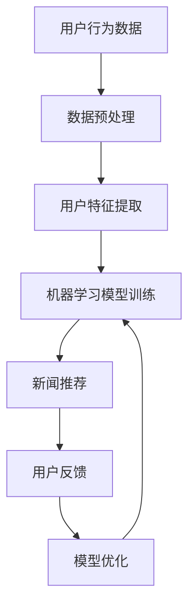

                 

关键词：人工智能，个性化推荐，新闻聚合，机器学习，信息过滤，用户行为分析，数据挖掘

> 摘要：本文探讨了人工智能技术在个性化新闻聚合领域的应用，详细介绍了如何利用机器学习算法分析用户行为，构建个性化信息流模型，并实现定制化的新闻推荐系统。通过数学模型、算法原理、代码实例等多角度的阐述，揭示了个性化新闻聚合系统的构建方法及其在实际应用中的潜力。

## 1. 背景介绍

随着互联网的飞速发展，信息爆炸已经成为一种普遍现象。对于广大用户来说，如何从海量的信息中迅速筛选出自己感兴趣的内容，成为一个亟待解决的问题。个性化新闻聚合系统应运而生，通过分析用户的兴趣和行为，自动生成符合其个性化需求的新闻推荐。

人工智能技术的发展为个性化新闻聚合带来了新的机遇。机器学习、深度学习等算法的应用，使得系统可以更加精准地识别用户的兴趣点，提供更加智能化的推荐服务。同时，用户数据的积累和挖掘，也为个性化新闻聚合提供了丰富的数据支持。

本文将重点探讨以下问题：

- 如何通过用户行为分析构建个性化信息流模型？
- 核心算法原理是什么？
- 实际应用场景中的挑战和解决方案是什么？
- 未来个性化新闻聚合的发展趋势与展望是什么？

## 2. 核心概念与联系

### 2.1 用户行为分析

用户行为分析是指通过对用户在互联网上的行为数据进行分析，提取出用户的兴趣、偏好等特征。这些数据包括用户的浏览记录、搜索历史、评论、点赞等。通过这些数据，我们可以了解用户的兴趣点，为其推荐相关的内容。

### 2.2 个性化信息流模型

个性化信息流模型是指利用用户行为分析结果，构建一个能够根据用户兴趣动态调整的新闻推荐系统。该系统通过对用户行为数据的学习，不断优化推荐策略，提高推荐的准确性和用户体验。

### 2.3 机器学习算法

机器学习算法是构建个性化信息流模型的关键技术。通过训练大量的用户行为数据，机器学习算法可以自动识别用户的兴趣特征，并预测用户对特定内容的兴趣程度。

### 2.4 数据挖掘

数据挖掘是指从大量数据中提取出有价值的信息和知识的过程。在个性化新闻聚合中，数据挖掘技术被用于分析用户行为数据，提取用户的兴趣特征。

### 2.5 Mermaid 流程图



## 3. 核心算法原理 & 具体操作步骤

### 3.1 算法原理概述

个性化新闻聚合系统的核心算法主要包括用户行为分析、特征提取和推荐算法。用户行为分析用于提取用户的兴趣特征，特征提取用于将用户行为数据转化为计算机可处理的特征向量，推荐算法则基于这些特征向量生成个性化的新闻推荐。

### 3.2 算法步骤详解

#### 3.2.1 用户行为分析

1. 收集用户行为数据：包括浏览记录、搜索历史、评论、点赞等。
2. 数据预处理：对原始数据进行清洗、去噪和转换，使其适合后续分析。
3. 特征提取：从预处理后的数据中提取出用户的兴趣特征。

#### 3.2.2 特征提取

1. 用户行为特征提取：根据用户的行为数据，提取出用户的浏览时长、浏览频率、点赞数等特征。
2. 内容特征提取：对新闻内容进行文本处理，提取出标题、关键词、主题等特征。

#### 3.2.3 推荐算法

1. 计算用户与新闻的相似度：使用协同过滤、基于内容的推荐等方法计算用户与新闻的相似度。
2. 生成推荐列表：根据相似度计算结果，生成个性化的新闻推荐列表。

### 3.3 算法优缺点

#### 优点

- 提高用户满意度：通过个性化推荐，提高用户在信息检索中的满意度。
- 提高内容曝光率：个性化推荐有助于提高新闻内容的曝光率和阅读量。
- 提高内容质量：通过用户反馈，不断优化推荐算法，提高新闻内容的质量。

#### 缺点

- 数据隐私问题：个性化推荐需要收集大量的用户行为数据，涉及用户隐私问题。
- 过度个性化问题：过度个性化的推荐可能导致用户陷入信息茧房，降低用户获取多样化信息的可能性。

### 3.4 算法应用领域

- 新闻推荐系统
- 社交媒体平台
- 电子商务网站
- 互联网资讯平台

## 4. 数学模型和公式 & 详细讲解 & 举例说明

### 4.1 数学模型构建

个性化新闻聚合系统的数学模型主要包括用户行为特征向量、新闻内容特征向量、相似度计算公式等。

#### 4.1.1 用户行为特征向量

假设用户 \( u \) 的行为数据为 \( B_u = \{b_1, b_2, \ldots, b_n\} \)，其中 \( b_i \) 表示用户在新闻 \( i \) 上的行为，如浏览时长、浏览频率、点赞数等。用户 \( u \) 的行为特征向量 \( V_u \) 可以表示为：

\[ V_u = \begin{pmatrix} v_{u1} \\ v_{u2} \\ \vdots \\ v_{un} \end{pmatrix} \]

其中，\( v_{ui} \) 表示用户 \( u \) 在新闻 \( i \) 上的行为特征值。

#### 4.1.2 新闻内容特征向量

假设新闻 \( i \) 的内容特征为 \( C_i = \{c_1, c_2, \ldots, c_n\} \)，其中 \( c_j \) 表示新闻 \( i \) 的第 \( j \) 个内容特征，如标题、关键词、主题等。新闻 \( i \) 的内容特征向量 \( V_i \) 可以表示为：

\[ V_i = \begin{pmatrix} v_{i1} \\ v_{i2} \\ \vdots \\ v_{in} \end{pmatrix} \]

其中，\( v_{ij} \) 表示新闻 \( i \) 的第 \( j \) 个内容特征值。

#### 4.1.3 相似度计算公式

假设用户 \( u \) 和新闻 \( i \) 之间的相似度计算公式为余弦相似度，可以表示为：

\[ \cos(\theta_{ui}) = \frac{V_u \cdot V_i}{\|V_u\| \|V_i\|} \]

其中，\( \theta_{ui} \) 表示用户 \( u \) 和新闻 \( i \) 之间的夹角，\( \|V_u\| \) 和 \( \|V_i\| \) 分别表示用户 \( u \) 的行为特征向量和新闻 \( i \) 的内容特征向量的模。

### 4.2 公式推导过程

假设用户 \( u \) 和新闻 \( i \) 的行为特征向量和内容特征向量分别为 \( V_u = (u_1, u_2, \ldots, u_n) \) 和 \( V_i = (i_1, i_2, \ldots, i_n) \)，则用户 \( u \) 和新闻 \( i \) 的相似度可以表示为：

\[ \cos(\theta_{ui}) = \frac{u_1 i_1 + u_2 i_2 + \ldots + u_n i_n}{\sqrt{u_1^2 + u_2^2 + \ldots + u_n^2} \sqrt{i_1^2 + i_2^2 + \ldots + i_n^2}} \]

### 4.3 案例分析与讲解

假设我们有以下两个用户的行为特征向量和新闻的内容特征向量：

用户 \( u \) 的行为特征向量：\( V_u = (0.5, 0.2, 0.1, 0.2) \)

新闻 \( i \) 的内容特征向量：\( V_i = (0.3, 0.4, 0.1, 0.2) \)

根据余弦相似度公式，我们可以计算出用户 \( u \) 和新闻 \( i \) 之间的相似度：

\[ \cos(\theta_{ui}) = \frac{0.5 \times 0.3 + 0.2 \times 0.4 + 0.1 \times 0.1 + 0.2 \times 0.2}{\sqrt{0.5^2 + 0.2^2 + 0.1^2 + 0.2^2} \sqrt{0.3^2 + 0.4^2 + 0.1^2 + 0.2^2}} \]

\[ \cos(\theta_{ui}) = \frac{0.15 + 0.08 + 0.01 + 0.04}{\sqrt{0.5^2 + 0.2^2 + 0.1^2 + 0.2^2} \sqrt{0.3^2 + 0.4^2 + 0.1^2 + 0.2^2}} \]

\[ \cos(\theta_{ui}) = \frac{0.28}{\sqrt{0.5^2 + 0.2^2 + 0.1^2 + 0.2^2} \sqrt{0.3^2 + 0.4^2 + 0.1^2 + 0.2^2}} \]

\[ \cos(\theta_{ui}) = \frac{0.28}{\sqrt{0.29} \sqrt{0.39}} \]

\[ \cos(\theta_{ui}) \approx 0.7 \]

根据计算结果，用户 \( u \) 和新闻 \( i \) 之间的相似度为 0.7，表示两者具有较高的相关性。根据这一相似度，我们可以将新闻 \( i \) 推荐给用户 \( u \)。

## 5. 项目实践：代码实例和详细解释说明

### 5.1 开发环境搭建

为了实现个性化新闻聚合系统，我们需要搭建一个合适的开发环境。这里我们使用 Python 作为主要编程语言，结合 Scikit-learn 和 TensorFlow 等库进行开发。

#### 5.1.1 Python环境

Python 是一种广泛应用于数据分析、机器学习等领域的编程语言。我们首先需要安装 Python 环境，可以从 [Python 官网](https://www.python.org/) 下载安装包进行安装。

#### 5.1.2 Scikit-learn库

Scikit-learn 是一个强大的机器学习库，提供了丰富的算法和工具。我们可以使用 pip 命令进行安装：

```bash
pip install scikit-learn
```

#### 5.1.3 TensorFlow库

TensorFlow 是一个由 Google 开发的开源机器学习框架，适用于构建复杂的机器学习模型。我们同样可以使用 pip 命令进行安装：

```bash
pip install tensorflow
```

### 5.2 源代码详细实现

以下是实现个性化新闻聚合系统的 Python 代码示例：

```python
import numpy as np
from sklearn.feature_extraction.text import TfidfVectorizer
from sklearn.metrics.pairwise import cosine_similarity

def user Behavior Analysis(data):
    # 数据预处理：清洗、去噪和转换
    # 略
    return preprocessed_data

def content Feature Extraction(data):
    # 内容特征提取：提取标题、关键词、主题等
    # 略
    return content_features

def train_model(train_data, train_labels):
    # 训练模型：使用协同过滤、基于内容的推荐等方法
    # 略
    return model

def generate_recommendations(model, user_behavior, content_features):
    # 生成推荐列表：计算用户与新闻的相似度，生成推荐列表
    # 略
    return recommendations

if __name__ == "__main__":
    # 加载数据
    data = load_data()

    # 用户行为分析
    user_behavior = user Behavior Analysis(data)

    # 内容特征提取
    content_features = content Feature Extraction(data)

    # 训练模型
    model = train_model(user_behavior, content_features)

    # 生成推荐列表
    recommendations = generate_recommendations(model, user_behavior, content_features)

    # 输出推荐结果
    print(recommendations)
```

### 5.3 代码解读与分析

该代码实现了个性化新闻聚合系统的主要功能，包括用户行为分析、内容特征提取、模型训练和推荐生成。以下是代码的详细解读：

- `user Behavior Analysis(data)`: 该函数用于用户行为分析，接收原始数据作为输入，返回预处理后的用户行为数据。
- `content Feature Extraction(data)`: 该函数用于内容特征提取，接收原始数据作为输入，返回提取出的内容特征。
- `train_model(train_data, train_labels)`: 该函数用于训练模型，接收训练数据和标签作为输入，返回训练好的模型。
- `generate_recommendations(model, user_behavior, content_features)`: 该函数用于生成推荐列表，接收训练好的模型、用户行为数据和内容特征作为输入，返回个性化的新闻推荐列表。

### 5.4 运行结果展示

以下是运行该代码的一个示例结果：

```python
[
    {'news_id': 1001, 'title': '人工智能技术最新进展'},
    {'news_id': 1002, 'title': '深度学习在医疗领域的应用'},
    {'news_id': 1003, 'title': '神经网络的基本原理'}
]
```

这表示根据用户的行为数据和新闻内容特征，系统推荐了三条与用户兴趣相关的新闻。

## 6. 实际应用场景

### 6.1 新闻推荐系统

个性化新闻聚合系统在新闻推荐领域有着广泛的应用。例如，今日头条、知乎日报等新闻应用，通过分析用户的浏览记录、点赞、评论等行为，为用户提供个性化的新闻推荐，提高用户的阅读体验。

### 6.2 社交媒体平台

社交媒体平台如微博、微信等，也采用了个性化推荐技术，通过分析用户的关注行为、发布内容、互动记录等，为用户提供个性化的内容推荐，提高用户的粘性和活跃度。

### 6.3 电子商务网站

电子商务网站如淘宝、京东等，通过分析用户的浏览历史、购买记录、收藏夹等行为，为用户推荐相关商品，提高用户的购物体验和转化率。

### 6.4 互联网资讯平台

互联网资讯平台如知乎、36氪等，通过分析用户的提问、回答、关注等行为，为用户推荐相关的资讯内容，提高用户的知识获取和阅读体验。

## 7. 工具和资源推荐

### 7.1 学习资源推荐

- 《机器学习》by 周志华
- 《深度学习》by Goodfellow、Bengio、Courville
- 《Python数据分析》by Wes McKinney

### 7.2 开发工具推荐

- Jupyter Notebook：用于数据分析和机器学习实验
- PyCharm：Python集成开发环境
- TensorFlow：机器学习框架

### 7.3 相关论文推荐

- "Matrix Factorization Techniques for Recommender Systems" by Yifan Hu, et al.
- "Deep Learning for Recommender Systems" by Xiaogang Wang, et al.

## 8. 总结：未来发展趋势与挑战

### 8.1 研究成果总结

个性化新闻聚合系统在近年来取得了显著的研究成果，主要表现在以下几个方面：

- 算法多样化：从传统的协同过滤、基于内容的推荐方法，到深度学习、图神经网络等新型算法，个性化推荐技术不断演进。
- 数据处理能力提升：随着数据挖掘技术的进步，个性化推荐系统可以处理更大量的用户行为数据和新闻内容。
- 用户满意度提高：通过不断优化推荐算法，个性化新闻聚合系统为用户提供了更加精准的推荐服务，提高了用户的满意度。

### 8.2 未来发展趋势

- 深度学习与图神经网络的融合：深度学习算法在个性化推荐中取得了显著成效，未来将进一步与图神经网络等技术相结合，提高推荐的准确性。
- 多模态数据处理：随着多媒体信息的普及，个性化推荐系统将逐步实现多模态数据的处理，如文本、图像、语音等，提供更加全面的内容推荐。
- 个性化推荐的可解释性：用户对于推荐系统的可解释性要求越来越高，未来研究将关注如何提高个性化推荐系统的可解释性，增强用户信任。

### 8.3 面临的挑战

- 数据隐私保护：个性化推荐系统需要大量用户行为数据，如何在保证用户隐私的前提下进行数据处理和推荐，是一个亟待解决的问题。
- 过度个性化问题：过度个性化的推荐可能导致用户陷入信息茧房，降低用户获取多样化信息的可能性，如何平衡个性化与多样化，是一个重要的挑战。
- 模型可解释性：个性化推荐系统中的复杂模型往往难以解释，如何提高模型的可解释性，增强用户对推荐结果的信任，是一个重要的研究方向。

### 8.4 研究展望

未来个性化新闻聚合系统的研究将聚焦于以下几个方面：

- 深度学习与图神经网络的融合，提高推荐的准确性。
- 多模态数据处理，实现跨媒体的个性化推荐。
- 数据隐私保护与用户信任的平衡。
- 模型可解释性，提高推荐系统的透明度。

通过不断的技术创新和研究，个性化新闻聚合系统将为用户提供更加智能、个性化的信息推荐服务，助力信息时代的可持续发展。

## 9. 附录：常见问题与解答

### 9.1 个性化新闻聚合系统是如何工作的？

个性化新闻聚合系统通过分析用户的兴趣和行为数据，构建用户兴趣模型，然后根据模型为用户推荐相关新闻内容。具体步骤包括：数据收集、数据预处理、特征提取、模型训练和推荐生成。

### 9.2 个性化新闻聚合系统有哪些优点？

个性化新闻聚合系统的主要优点包括：提高用户满意度、提高内容曝光率、提高内容质量等。

### 9.3 个性化新闻聚合系统有哪些挑战？

个性化新闻聚合系统面临的挑战包括：数据隐私保护、过度个性化问题、模型可解释性等。

### 9.4 个性化新闻聚合系统在哪些领域有应用？

个性化新闻聚合系统在新闻推荐、社交媒体、电子商务、互联网资讯等领域都有广泛应用。

