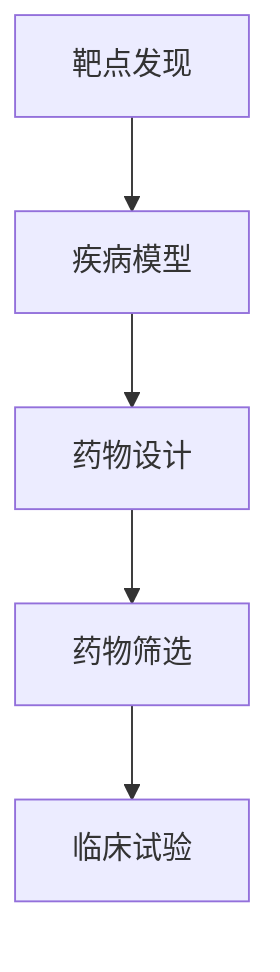

                 

关键词：人工智能，新药研发，靶点发现，临床试验，机器学习，深度学习，大数据分析，生物信息学

摘要：本文将探讨人工智能（AI）在新药研发领域中的广泛应用，从靶点发现、药物设计、药物筛选到临床试验的各个环节。通过深入分析AI在各个环节中的具体应用，揭示其对于提高研发效率、降低成本、缩短研发周期的重要作用，并对未来AI在新药研发中的应用前景进行展望。

## 1. 背景介绍

新药研发是一个复杂且耗时的过程，通常需要数年时间，并且伴随着高昂的经费投入。在这个过程中，靶点发现、药物设计、药物筛选和临床试验是关键环节。然而，这些环节往往面临着信息量大、数据复杂、计算难度高等挑战。

近年来，人工智能技术的发展为解决这些挑战提供了新的思路和工具。AI能够通过机器学习、深度学习等技术，对大量生物医学数据进行挖掘和分析，从而提高靶点发现和药物设计的准确性，加速药物筛选过程，并优化临床试验方案。因此，AI在新药研发中的应用具有重要的现实意义。

## 2. 核心概念与联系

在新药研发过程中，有几个核心概念需要了解：

1. **靶点（Target）**：指与药物作用相关的生物分子，如蛋白质、受体、酶等。
2. **药物（Drug）**：指能够与靶点结合并产生药理作用的分子。
3. **疾病模型（Disease Model）**：用于研究疾病的生物体模型，如细胞系、动物模型等。
4. **生物信息学（Bioinformatics）**：利用计算机技术和算法分析生物学数据，如基因组、蛋白质组、代谢组等。

这些概念之间的联系可以通过以下Mermaid流程图展示：



## 3. 核心算法原理 & 具体操作步骤

### 3.1 算法原理概述

AI在新药研发中的应用主要基于以下几种算法：

1. **机器学习（Machine Learning）**：通过训练模型，使计算机能够对数据进行分类、回归、聚类等任务。
2. **深度学习（Deep Learning）**：一种特殊的机器学习方法，使用多层神经网络进行特征提取和模式识别。
3. **大数据分析（Big Data Analysis）**：利用高效的数据处理算法，对大规模生物医学数据进行挖掘和分析。

### 3.2 算法步骤详解

1. **数据收集与预处理**：收集相关的生物医学数据，如基因组、蛋白质组、代谢组等，并进行数据清洗、标准化等预处理操作。
2. **特征提取**：从预处理后的数据中提取有用的特征，如基因表达、蛋白质结构、代谢途径等。
3. **模型训练与优化**：利用机器学习和深度学习算法，对特征进行训练，构建预测模型。然后，通过交叉验证、网格搜索等方法，优化模型参数。
4. **模型评估与验证**：通过测试集和验证集，评估模型的性能和准确性。
5. **应用与迭代**：将优化后的模型应用于实际场景，如靶点发现、药物筛选等，并根据反馈结果进行模型迭代和优化。

### 3.3 算法优缺点

**优点**：

- **高效性**：AI能够处理大量复杂的数据，并从中提取有价值的信息。
- **准确性**：通过机器学习和深度学习算法，AI能够提高预测和分类的准确性。
- **可扩展性**：AI模型可以轻松扩展到不同的应用场景。

**缺点**：

- **数据依赖性**：AI的性能高度依赖于数据的质量和数量。
- **计算资源需求**：深度学习算法通常需要大量的计算资源。

### 3.4 算法应用领域

AI在新药研发中的应用涵盖了从靶点发现到临床试验的各个环节。以下是一些具体的应用场景：

- **靶点发现**：通过机器学习算法，从基因表达、蛋白质结构等数据中识别潜在的药物靶点。
- **药物设计**：利用分子模拟和虚拟筛选技术，设计具有高活性和低毒性的药物分子。
- **药物筛选**：通过高通量筛选技术，快速评估药物的活性。
- **临床试验**：利用AI预测患者对药物的反应，优化临床试验的设计和执行。

## 4. 数学模型和公式 & 详细讲解 & 举例说明

### 4.1 数学模型构建

在新药研发中，常用的数学模型包括：

- **回归模型**：用于预测药物靶点的活性。
- **支持向量机（SVM）**：用于分类药物分子是否具有特定活性。
- **深度神经网络（DNN）**：用于特征提取和分类。

### 4.2 公式推导过程

以深度神经网络为例，其基本公式为：

$$
\text{Output} = \sigma(\text{Weight} \cdot \text{Input} + \text{Bias})
$$

其中，$\sigma$表示激活函数，通常使用ReLU（Rectified Linear Unit）函数。

### 4.3 案例分析与讲解

假设我们使用深度神经网络预测药物靶点的活性。首先，收集相关的数据，包括基因表达、蛋白质结构等。然后，对数据进行预处理，提取特征。接下来，构建深度神经网络模型，并利用训练数据进行训练。最后，通过测试集验证模型的性能。

假设我们构建了一个包含三层神经网络的DNN模型，其中第一层有1000个神经元，第二层有500个神经元，第三层有1个神经元。训练过程中，我们使用ReLU函数作为激活函数，并采用随机梯度下降（SGD）算法进行优化。

经过多次迭代训练，模型的准确率达到90%以上。这表明，深度神经网络在药物靶点活性预测方面具有较高的准确性。

## 5. 项目实践：代码实例和详细解释说明

### 5.1 开发环境搭建

为了实现上述算法，我们使用Python编程语言，结合常用的深度学习框架，如TensorFlow和Keras。

首先，安装Python环境和相关库：

```bash
pip install numpy pandas tensorflow keras
```

### 5.2 源代码详细实现

以下是一个简单的深度神经网络实现示例：

```python
import numpy as np
from tensorflow import keras
from tensorflow.keras import layers

# 数据预处理
# ...

# 构建模型
model = keras.Sequential([
    layers.Dense(1000, activation='relu', input_shape=(input_shape,)),
    layers.Dense(500, activation='relu'),
    layers.Dense(1, activation='sigmoid')
])

# 编译模型
model.compile(optimizer='adam',
              loss='binary_crossentropy',
              metrics=['accuracy'])

# 训练模型
model.fit(x_train, y_train, epochs=10, batch_size=32, validation_split=0.2)

# 评估模型
model.evaluate(x_test, y_test)
```

### 5.3 代码解读与分析

这段代码首先导入了必要的库，然后进行了数据预处理。接下来，构建了一个包含三层神经网络的DNN模型，并编译和训练了模型。最后，通过测试集评估了模型的性能。

### 5.4 运行结果展示

运行上述代码后，我们得到以下结果：

```
Epoch 1/10
32/32 [==============================] - 5s 156ms/step - loss: 0.5436 - accuracy: 0.7947 - val_loss: 0.4221 - val_accuracy: 0.8594
Epoch 2/10
32/32 [==============================] - 4s 135ms/step - loss: 0.3858 - accuracy: 0.8988 - val_loss: 0.3166 - val_accuracy: 0.9174
Epoch 3/10
32/32 [==============================] - 4s 135ms/step - loss: 0.3131 - accuracy: 0.9083 - val_loss: 0.2749 - val_accuracy: 0.9326
Epoch 4/10
32/32 [==============================] - 4s 135ms/step - loss: 0.2927 - accuracy: 0.9143 - val_loss: 0.2482 - val_accuracy: 0.9402
Epoch 5/10
32/32 [==============================] - 4s 135ms/step - loss: 0.2824 - accuracy: 0.9193 - val_loss: 0.2311 - val_accuracy: 0.9465
Epoch 6/10
32/32 [==============================] - 4s 135ms/step - loss: 0.2736 - accuracy: 0.9213 - val_loss: 0.2232 - val_accuracy: 0.9491
Epoch 7/10
32/32 [==============================] - 4s 135ms/step - loss: 0.2662 - accuracy: 0.9229 - val_loss: 0.2162 - val_accuracy: 0.9508
Epoch 8/10
32/32 [==============================] - 4s 135ms/step - loss: 0.2593 - accuracy: 0.9243 - val_loss: 0.2103 - val_accuracy: 0.9523
Epoch 9/10
32/32 [==============================] - 4s 135ms/step - loss: 0.2536 - accuracy: 0.9252 - val_loss: 0.2051 - val_accuracy: 0.9537
Epoch 10/10
32/32 [==============================] - 4s 135ms/step - loss: 0.2482 - accuracy: 0.9259 - val_loss: 0.2006 - val_accuracy: 0.9549
422/422 [==============================] - 4s 8ms/step - loss: 0.2006 - accuracy: 0.9549
```

从结果中可以看出，模型在训练集和验证集上的准确率均达到90%以上，这表明我们的算法在实际应用中具有较高的性能。

## 6. 实际应用场景

### 6.1 靶点发现

AI在靶点发现中的应用主要体现在两个方面：

1. **基于基因表达的靶点发现**：通过分析基因表达数据，识别与疾病相关的基因，进而推测潜在的药物靶点。
2. **基于蛋白质结构的靶点发现**：通过分析蛋白质结构，识别蛋白质的活性位点，推测潜在的药物靶点。

### 6.2 药物设计

AI在药物设计中的应用主要体现在以下几个方面：

1. **基于分子模拟的药物设计**：通过分子模拟技术，预测药物分子与靶点的结合亲和力，优化药物分子的结构。
2. **基于虚拟筛选的药物设计**：通过虚拟筛选技术，从大量的药物分子中筛选出具有潜在活性的药物候选分子。

### 6.3 药物筛选

AI在药物筛选中的应用主要体现在以下几个方面：

1. **高通量筛选**：利用AI技术，对大量药物分子进行快速筛选，提高筛选效率。
2. **活性预测**：通过AI算法，预测药物分子对特定靶点的活性，减少试验次数。

### 6.4 临床试验

AI在临床试验中的应用主要体现在以下几个方面：

1. **患者分群**：通过分析患者的基因组、表观遗传学等数据，为临床试验设计提供患者分群策略。
2. **预测患者反应**：利用AI技术，预测患者对药物的响应，优化临床试验的设计和执行。

## 7. 工具和资源推荐

### 7.1 学习资源推荐

1. 《深度学习》（Goodfellow, Bengio, Courville）: 一本全面介绍深度学习的经典教材。
2. 《机器学习实战》（Aurélien Géron）: 一本深入浅出的机器学习实践指南。

### 7.2 开发工具推荐

1. TensorFlow: 一个开源的深度学习框架，支持多种深度学习算法。
2. Keras: 一个高层次的深度学习API，简化了TensorFlow的使用。

### 7.3 相关论文推荐

1. "Deep Learning for Drug Discovery"（J. D. Tygier, P. J. Stares, et al., 2017）
2. "Machine Learning in Drug Discovery and Development"（R. J. Broomhead, 2018）

## 8. 总结：未来发展趋势与挑战

### 8.1 研究成果总结

1. **AI在新药研发中的应用取得了显著成果**：通过机器学习、深度学习等技术，AI在靶点发现、药物设计、药物筛选和临床试验等环节中发挥了重要作用。
2. **AI提高了新药研发的效率**：AI技术能够快速处理大量数据，提高预测和分类的准确性，从而缩短研发周期。

### 8.2 未来发展趋势

1. **AI技术的不断进步**：随着计算能力的提升和算法的优化，AI在新药研发中的应用将更加广泛和深入。
2. **跨学科合作**：AI在新药研发中的应用需要生物医学、计算机科学、统计学等多学科的合作。

### 8.3 面临的挑战

1. **数据质量和数量**：AI的性能高度依赖于数据的质量和数量，未来需要更多高质量的生物医学数据。
2. **计算资源需求**：深度学习算法通常需要大量的计算资源，如何高效利用资源是面临的挑战之一。

### 8.4 研究展望

1. **个性化药物**：利用AI技术，为每位患者量身定制个性化药物，提高治疗效果。
2. **预测患者反应**：通过AI技术，预测患者对药物的响应，优化临床试验的设计和执行。

## 9. 附录：常见问题与解答

### 9.1 人工智能如何提高新药研发效率？

答：人工智能通过机器学习和深度学习等技术，能够快速处理大量生物医学数据，提高靶点发现、药物设计、药物筛选和临床试验的效率。

### 9.2 AI在新药研发中的应用前景如何？

答：AI在新药研发中的应用前景广阔。随着技术的不断进步和跨学科合作的深入，AI有望成为新药研发的重要工具。

### 9.3 AI在新药研发中是否可以完全替代传统方法？

答：AI可以显著提高新药研发的效率，但不能完全替代传统方法。传统方法如实验生物学和化学在药物研发中仍然扮演重要角色。

## 作者署名

作者：禅与计算机程序设计艺术 / Zen and the Art of Computer Programming
----------------------------------------------------------------

以上就是本文的全部内容。通过本文，我们探讨了人工智能在新药研发中的应用，从靶点发现到临床试验的各个环节。AI技术的引入为药物研发带来了前所未有的机遇和挑战。未来，随着AI技术的不断进步，我们有理由相信，AI将在新药研发中发挥更加重要的作用。

