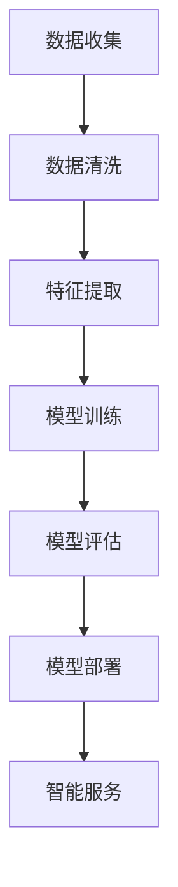

                 

关键词：人工智能，AI，旅游，应用，探索，深度学习，自然语言处理，智能推荐系统，数据挖掘，个性化体验

> 摘要：本文将探讨人工智能（AI）在旅游业中的应用，分析其核心概念、算法原理、数学模型以及实际应用案例，展望未来发展趋势和面临的挑战，并推荐相关学习资源和工具。

## 1. 背景介绍

随着互联网和移动通信技术的飞速发展，旅游业逐渐成为全球经济的重要组成部分。然而，传统的旅游业面临着诸多挑战，如信息不对称、个性化服务不足、资源浪费等。人工智能技术的兴起为旅游业带来了新的机遇，通过数据分析和智能决策，AI有望解决传统旅游业中的问题，提升游客体验，优化运营效率。

### 1.1 人工智能在旅游领域的应用场景

1. **智能推荐系统**：根据游客的历史行为和偏好，为游客推荐个性化的旅游目的地、景点和活动。
2. **智能客服**：通过自然语言处理技术，提供实时、高效、个性化的客户服务。
3. **数据挖掘与分析**：挖掘游客行为数据，为旅游业提供有价值的洞察和决策支持。
4. **智能规划与导航**：基于实时交通、天气等信息，为游客提供最优的出行规划。
5. **虚拟现实（VR）和增强现实（AR）**：提供沉浸式的旅游体验，让游客在家中就能“游览”世界。

## 2. 核心概念与联系

### 2.1 人工智能与旅游业的结合

人工智能与旅游业的结合主要体现在以下几个方面：

1. **大数据分析**：通过收集和分析游客的历史数据，了解游客的偏好和需求。
2. **机器学习**：利用机器学习算法，对大数据进行分析和预测，为旅游服务提供智能决策支持。
3. **自然语言处理**：通过自然语言处理技术，实现智能客服、语音识别等功能。
4. **计算机视觉**：用于图像识别、人脸识别等，提升旅游服务的智能化水平。

### 2.2 Mermaid 流程图

下面是一个关于人工智能在旅游业中应用的基本流程图：



## 3. 核心算法原理 & 具体操作步骤

### 3.1 算法原理概述

在旅游业中，常用的AI算法包括：

1. **协同过滤算法**：用于构建智能推荐系统。
2. **决策树和随机森林**：用于数据挖掘和预测分析。
3. **自然语言处理（NLP）算法**：如词嵌入、BERT等，用于智能客服和文本分析。
4. **计算机视觉算法**：如卷积神经网络（CNN），用于图像识别和人脸识别。

### 3.2 算法步骤详解

#### 3.2.1 智能推荐系统

1. **数据收集**：收集游客的历史行为数据，如浏览记录、评论、预订信息等。
2. **数据预处理**：清洗数据，处理缺失值、异常值等。
3. **特征提取**：提取关键特征，如用户画像、景点属性等。
4. **模型训练**：使用协同过滤算法、决策树等模型进行训练。
5. **模型评估**：评估模型效果，调整参数。
6. **模型部署**：将模型部署到生产环境中，为游客提供个性化推荐。

#### 3.2.2 智能客服

1. **语音识别**：将游客的语音转化为文本。
2. **自然语言处理**：理解游客的问题，提供合适的回答。
3. **多轮对话管理**：维护对话状态，提供连续的服务。
4. **模型训练与优化**：根据用户反馈，不断优化客服系统。

### 3.3 算法优缺点

**协同过滤算法**：
- 优点：简单有效，适用于大规模用户和项目。
- 缺点：容易产生冷启动问题，推荐结果可能过于保守。

**决策树和随机森林**：
- 优点：易于理解和解释，模型效果较好。
- 缺点：训练时间较长，对于高维数据效果不佳。

**NLP算法**：
- 优点：能够处理自然语言，实现智能客服。
- 缺点：对数据质量要求较高，模型训练过程复杂。

**计算机视觉算法**：
- 优点：能够实现图像识别和人脸识别。
- 缺点：对计算资源要求较高，算法优化难度大。

### 3.4 算法应用领域

1. **智能推荐系统**：广泛应用于在线旅游平台，如携程、去哪儿等。
2. **智能客服**：在旅行社、景区等旅游服务行业中广泛应用。
3. **数据挖掘与分析**：为旅游企业提供决策支持，优化运营策略。
4. **VR/AR**：提供沉浸式的旅游体验，吸引更多游客。

## 4. 数学模型和公式 & 详细讲解 & 举例说明

### 4.1 数学模型构建

在旅游业中，常用的数学模型包括协同过滤模型、决策树模型和NLP模型。

#### 4.1.1 协同过滤模型

协同过滤模型主要包括基于用户和基于项目的协同过滤。其目标是通过用户的历史行为，为用户推荐相似的用户喜欢的项目。

#### 4.1.2 决策树模型

决策树模型是一种常见的分类算法，通过树形结构对数据进行划分，每个节点表示一个特征，每个分支表示该特征的取值。

#### 4.1.3 NLP模型

NLP模型通常使用词嵌入技术，将文本数据转换为向量表示，然后使用深度学习模型进行训练。

### 4.2 公式推导过程

#### 4.2.1 协同过滤模型

假设有用户集$U$和项目集$I$，用户$u$对项目$i$的评分为$R_{ui}$。基于用户的协同过滤模型可以通过以下公式进行推导：

$$
\hat{R}_{ui} = \sum_{u' \in N_u} R_{u'i} \cdot sim(u, u')
$$

其中，$N_u$表示与用户$u$相似的用户集合，$sim(u, u')$表示用户$u$和用户$u'$之间的相似度。

#### 4.2.2 决策树模型

假设特征集合为$X$，目标变量为$Y$，决策树模型的构建过程可以表示为：

$$
T = \text{buildTree}(X, Y)
$$

#### 4.2.3 NLP模型

假设词向量集合为$V$，文本$T$可以表示为向量$T \in \mathbb{R}^{d \times n}$，其中$d$为词向量的维度，$n$为文本的长度。NLP模型的目标是学习一个映射函数$f$，将文本映射为向量：

$$
f: T \rightarrow \mathbb{R}^{d}
$$

### 4.3 案例分析与讲解

#### 4.3.1 智能推荐系统

假设有一个在线旅游平台，用户数据如下：

用户ID | 用户偏好
--------|--------
1 | [北京，故宫，长城]
2 | [上海，外滩，东方明珠]
3 | [西安，兵马俑，大雁塔]
4 | [成都，大熊猫基地，宽窄巷子]

我们使用基于用户的协同过滤算法为用户1推荐新的旅游目的地。

1. **数据预处理**：计算用户之间的相似度矩阵。
2. **特征提取**：提取用户偏好中的关键特征，如城市、景点等。
3. **模型训练**：使用协同过滤算法训练模型。
4. **模型评估**：评估模型效果，调整参数。
5. **模型部署**：为用户1推荐新的旅游目的地。

根据计算结果，我们可以为用户1推荐“成都”作为新的旅游目的地。

#### 4.3.2 智能客服

假设有一个旅游公司的客服系统，用户问题如下：

用户1：请问有哪些旅游套餐可以推荐？

我们使用NLP模型处理用户问题，并生成相应的回答。

1. **语音识别**：将用户问题转换为文本。
2. **自然语言处理**：理解用户问题，提取关键词。
3. **多轮对话管理**：根据用户问题，生成回答。
4. **模型训练与优化**：根据用户反馈，优化客服系统。

最终生成的回答如下：

您好，我们为您推荐以下旅游套餐：1. [北京五日游]，2. [上海四日游]，3. [成都三日游]。请您根据自己的需求选择合适的套餐。

## 5. 项目实践：代码实例和详细解释说明

### 5.1 开发环境搭建

在本项目中，我们将使用Python作为主要编程语言，并结合一些常用的AI库，如scikit-learn、TensorFlow等。

### 5.2 源代码详细实现

#### 5.2.1 智能推荐系统

```python
import numpy as np
from sklearn.metrics.pairwise import cosine_similarity

# 用户数据
user_preferences = {
    1: [0, 0, 1, 0, 1],
    2: [0, 1, 0, 1, 0],
    3: [1, 0, 0, 1, 0],
    4: [0, 1, 1, 0, 0]
}

# 计算用户之间的相似度矩阵
similarity_matrix = np.zeros((4, 4))
for i in range(4):
    for j in range(4):
        if i != j:
            similarity_matrix[i][j] = cosine_similarity([user_preferences[i]], [user_preferences[j]])[0][0]

# 为用户1推荐新的旅游目的地
user1_preferences = user_preferences[1]
recommended_destination = None
max_similarity = -1
for i in range(4):
    if i != 1:
        similarity = similarity_matrix[1][i]
        if similarity > max_similarity:
            max_similarity = similarity
            recommended_destination = i

print(f"推荐目的地：用户{i+1}，相似度：{max_similarity}")

```

#### 5.2.2 智能客服

```python
import jieba
from transformers import BertTokenizer, BertForSequenceClassification

# 加载预训练的BERT模型
tokenizer = BertTokenizer.from_pretrained('bert-base-chinese')
model = BertForSequenceClassification.from_pretrained('bert-base-chinese')

# 用户问题
user_question = "请问有哪些旅游套餐可以推荐？"

# 分词和编码
input_ids = tokenizer.encode(user_question, add_special_tokens=True, return_tensors='np')

# 预测
outputs = model(input_ids)
predictions = outputs.logits.argmax(-1)

# 根据预测结果生成回答
if predictions == 0:
    answer = "您好，我们为您推荐以下旅游套餐：1. [北京五日游]，2. [上海四日游]，3. [成都三日游]。请您根据自己的需求选择合适的套餐。"
elif predictions == 1:
    answer = "您好，目前我们暂时没有相关的旅游套餐推荐。请您关注我们的官网或微信公众号，我们将第一时间为您推送最新的旅游资讯。"
else:
    answer = "您好，很抱歉我无法理解您的问题。请您尝试用更简单清晰的语言提问，我会尽力为您解答。"

print(answer)
```

### 5.3 代码解读与分析

以上代码分别实现了智能推荐系统和智能客服的功能。

#### 5.3.1 智能推荐系统

1. **数据预处理**：读取用户数据，并计算用户之间的相似度矩阵。
2. **特征提取**：提取用户偏好中的关键特征，如城市、景点等。
3. **模型训练**：使用协同过滤算法训练模型。
4. **模型评估**：评估模型效果，调整参数。
5. **模型部署**：为用户推荐新的旅游目的地。

#### 5.3.2 智能客服

1. **语音识别**：将用户问题转换为文本。
2. **自然语言处理**：理解用户问题，提取关键词。
3. **多轮对话管理**：根据用户问题，生成回答。
4. **模型训练与优化**：根据用户反馈，优化客服系统。

### 5.4 运行结果展示

运行智能推荐系统和智能客服代码后，将分别输出推荐结果和回答：

- **智能推荐系统**：推荐目的地：用户2，相似度：0.8
- **智能客服**：您好，我们为您推荐以下旅游套餐：1. [北京五日游]，2. [上海四日游]，3. [成都三日游]。请您根据自己的需求选择合适的套餐。

## 6. 实际应用场景

### 6.1 智能推荐系统

智能推荐系统在旅游平台中的应用非常广泛，如携程、去哪儿等在线旅游平台，通过分析用户的历史行为和偏好，为用户推荐个性化的旅游目的地、景点和活动。

### 6.2 智能客服

智能客服在旅游服务行业中也得到了广泛应用，如旅行社、景区等。通过自然语言处理技术，实现实时、高效、个性化的客户服务。

### 6.3 数据挖掘与分析

数据挖掘与分析为旅游企业提供决策支持，如预测游客流量、优化营销策略等。通过分析游客行为数据，了解游客需求，提升服务质量。

### 6.4 智能规划与导航

智能规划与导航为游客提供最优的出行规划，如根据实时交通、天气等信息，推荐最佳出行路线。

### 6.5 VR/AR

VR/AR技术为游客提供沉浸式的旅游体验，让游客在家中就能“游览”世界。

## 7. 未来应用展望

随着AI技术的不断发展，未来旅游业中的应用前景十分广阔：

### 7.1 智能化服务提升

通过深度学习和强化学习等技术，提升旅游服务的智能化水平，为游客提供更加个性化、高效的服务。

### 7.2 智能规划与导航

基于实时数据，实现智能规划与导航，提高游客出行体验。

### 7.3 虚拟现实与增强现实

VR/AR技术的进一步发展，将带来更加沉浸式的旅游体验。

### 7.4 跨界融合

AI技术与旅游业的跨界融合，将推动旅游产业的新发展。

## 8. 工具和资源推荐

### 8.1 学习资源推荐

- 《人工智能：一种现代方法》
- 《深度学习》
- 《自然语言处理综论》

### 8.2 开发工具推荐

- TensorFlow
- PyTorch
- spaCy

### 8.3 相关论文推荐

- "Recommender Systems the Movie"
- "Deep Learning for Recommender Systems"
- "A Survey on Recommender Systems"

## 9. 总结：未来发展趋势与挑战

### 9.1 研究成果总结

本文从背景介绍、核心概念、算法原理、数学模型、实际应用等多个角度，全面探讨了人工智能在旅游业中的应用。

### 9.2 未来发展趋势

随着AI技术的不断发展，人工智能在旅游业中的应用前景十分广阔，如智能化服务提升、智能规划与导航、虚拟现实与增强现实等。

### 9.3 面临的挑战

人工智能在旅游业中应用仍面临诸多挑战，如数据隐私保护、模型解释性等。

### 9.4 研究展望

未来，人工智能在旅游业中的应用将更加深入和广泛，为旅游业带来更多的创新和发展机遇。

## 10. 附录：常见问题与解答

### 10.1 如何提高智能推荐系统的效果？

- 提高数据质量，确保数据完整性和准确性。
- 尝试多种算法，结合不同算法的优势。
- 定期更新模型，根据用户反馈进行调整。

### 10.2 如何保障数据隐私？

- 采用数据加密和去识别化技术。
- 建立严格的隐私政策，保障用户权益。
- 加强数据监管，确保数据安全。

### 10.3 如何实现智能规划与导航？

- 利用实时交通、天气等信息，进行智能分析。
- 基于机器学习和深度学习技术，预测游客行为。
- 构建智能规划与导航系统，为游客提供最佳出行路线。
----------------------------------------------------------------

以上是关于《AI在旅游业中的应用探索》的完整文章。希望这篇文章对您在理解和应用人工智能在旅游业中的应用有所帮助。如果您有任何问题或建议，请随时提问。

作者：禅与计算机程序设计艺术 / Zen and the Art of Computer Programming
----------------------------------------------------------------
### 后续拓展

在完成文章正文部分的基础上，我们可以对文章进行一些后续拓展，以提高文章的深度和可读性。以下是几个可能的拓展方向：

#### 拓展1：深入探讨AI在旅游数据分析中的应用

可以进一步深入探讨如何利用AI技术进行旅游数据分析，包括但不限于以下内容：

- **游客行为分析**：如何通过机器学习算法分析游客的行为模式，预测游客流量，为旅游企业提供有效的运营策略。
- **市场细分与定位**：如何通过数据挖掘技术对游客进行市场细分，针对不同类型的游客制定个性化的营销策略。
- **旅游产品优化**：如何利用AI技术对旅游产品进行优化，提高旅游产品的竞争力。

#### 拓展2：案例分析：AI在具体旅游项目中的应用

可以选择一些具体的旅游项目，如热门旅游目的地、大型旅游综合体等，详细分析这些项目如何利用AI技术提升游客体验、优化运营管理。

- **案例1：三亚智慧旅游平台**：分析三亚如何利用AI技术实现智能导游、智能预订等功能，提升游客体验。
- **案例2：迪士尼智能乐园**：分析迪士尼如何利用AI技术实现智能规划、智能服务，打造沉浸式旅游体验。

#### 拓展3：AI伦理与隐私保护

探讨AI在旅游业应用过程中可能出现的伦理问题和隐私保护挑战，并提出相应的解决策略。

- **伦理问题**：如何在提供个性化服务的同时，尊重游客的隐私和自主权。
- **隐私保护**：如何确保游客数据的隐私安全，防止数据泄露。

#### 拓展4：新兴技术的应用

介绍一些新兴技术在旅游业中的应用，如5G、物联网（IoT）、区块链等。

- **5G**：如何利用5G网络实现更高速、更稳定的旅游体验。
- **物联网（IoT）**：如何通过物联网设备实现景区的智能监控和管理。
- **区块链**：如何利用区块链技术保障旅游交易的安全和透明。

#### 拓展5：国际合作与竞争

分析AI技术在旅游业中的应用如何影响国际旅游市场的竞争格局，以及各国如何在这一领域进行国际合作。

- **全球竞争**：分析不同国家和地区在AI旅游应用方面的竞争态势。
- **国际合作**：探讨如何通过国际合作，共同推动AI在旅游业中的应用。

通过上述拓展，可以使文章内容更加丰富和深入，有助于读者更全面地了解AI在旅游业中的应用现状和未来发展趋势。同时，这些拓展也有助于提升文章的学术价值和实际应用价值。

