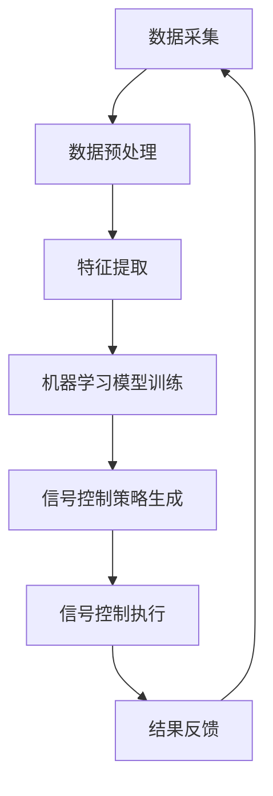

                 

关键词：人工智能、交通信号控制、智能交通系统、交通拥堵、算法优化、城市交通管理、机器学习、深度学习

## 摘要

随着城市化进程的加快，城市交通拥堵问题日益严重，传统的交通信号控制方法已经难以满足现代城市交通的需求。本文探讨了人工智能（AI）在智能交通信号控制中的应用，以减少交通拥堵。通过介绍AI的基本原理、核心算法、数学模型以及实际应用场景，本文展示了AI如何通过优化交通信号控制策略，实现城市交通的高效运行。

## 1. 背景介绍

### 城市交通拥堵问题

城市化进程带来了人口的快速增长和私家车数量的激增，使得城市交通系统面临前所未有的压力。交通拥堵不仅浪费了宝贵的时间和经济资源，还对环境造成了严重污染。传统交通信号控制方法主要依赖于固定的信号周期和预设的时序方案，难以适应动态的交通流量变化，导致交通拥堵现象频发。

### 智能交通系统（ITS）

智能交通系统是一种利用先进的信息通信技术和电子技术对交通系统进行实时监控和管理的系统。其目的是提高交通效率、减少交通拥堵、提高道路安全性。智能交通系统包括交通信息采集、交通信号控制、车辆检测、车辆导航等多个组成部分。

### 人工智能在交通领域的应用

人工智能技术在交通领域的应用日益广泛，包括自动驾驶、交通预测、交通信号控制等方面。AI通过学习大量的交通数据，可以预测交通流量、优化信号控制策略，从而减少交通拥堵，提高道路通行能力。

## 2. 核心概念与联系

### AI基本原理

人工智能（AI）是一种模拟人类智能行为的计算机技术。它包括机器学习、深度学习、自然语言处理等多个领域。AI通过学习大量数据，发现数据中的规律和模式，并利用这些规律和模式进行决策和预测。

### 交通信号控制算法

交通信号控制算法是智能交通系统中的核心算法，它负责控制交通信号灯的时序和时长，以优化交通流量。传统的交通信号控制算法主要基于固定的时间和流量模型，而智能交通信号控制算法则利用机器学习和深度学习技术，动态调整信号控制策略。

### Mermaid流程图

以下是一个简化的交通信号控制算法流程图，展示了从数据采集到信号控制的整个过程。



## 3. 核心算法原理 & 具体操作步骤

### 3.1 算法原理概述

智能交通信号控制算法的核心原理是利用机器学习和深度学习技术，从交通数据中学习交通流量模式，并根据实时交通状况动态调整信号控制策略。常见的算法包括基于聚类的方法、基于预测的方法和基于强化学习的方法。

### 3.2 算法步骤详解

1. **数据采集与预处理**：从交通监控设备（如摄像头、感应线圈等）采集实时交通数据，并进行预处理，包括数据清洗、数据去噪、数据归一化等。

2. **特征提取**：从预处理后的数据中提取交通流量、车速、占有率等特征，用于训练机器学习模型。

3. **模型训练**：使用提取到的特征训练机器学习模型，如聚类模型、回归模型、神经网络模型等。

4. **信号控制策略生成**：根据模型预测结果和交通规则，生成最优的信号控制策略。

5. **信号控制执行**：将生成的信号控制策略应用于交通信号控制器，调整信号灯的时序和时长。

6. **结果反馈与调整**：收集实际交通运行数据，反馈到模型中，用于模型优化和信号控制策略的调整。

### 3.3 算法优缺点

#### 优点：

1. **自适应性强**：能够根据实时交通状况动态调整信号控制策略，提高交通效率。

2. **数据驱动**：基于大量交通数据进行模型训练，具有更高的预测精度和可靠性。

3. **减少交通拥堵**：通过优化信号控制策略，减少交通拥堵现象。

#### 缺点：

1. **计算量大**：需要大量的计算资源进行模型训练和预测。

2. **数据质量要求高**：数据质量直接影响模型的性能，对数据采集和处理的要求较高。

3. **适应性问题**：模型对新交通状况的适应能力有待提高。

### 3.4 算法应用领域

智能交通信号控制算法可以应用于城市交通信号控制、高速公路信号控制、公共交通信号控制等多个领域。目前，已在一些大城市的交通信号控制系统中得到应用，并取得了良好的效果。

## 4. 数学模型和公式

### 4.1 数学模型构建

智能交通信号控制算法的数学模型主要包括交通流量预测模型和信号控制策略模型。

#### 交通流量预测模型

假设交通流量 \(Q(t)\) 是时间 \(t\) 的函数，可以使用以下公式表示：

$$
Q(t) = f(T, V, O, P)
$$

其中，\(T\) 表示时间，\(V\) 表示车速，\(O\) 表示占有率，\(P\) 表示前方的停车概率。

#### 信号控制策略模型

信号控制策略模型主要基于优化理论，目标是最大化道路通行能力或最小化车辆排队长度。可以使用以下公式表示：

$$
C(t) = \arg\max_{c(t)} g(c(t), Q(t))
$$

其中，\(c(t)\) 表示信号控制时长，\(g(c(t), Q(t))\) 是目标函数，如道路通行能力 \(C(t)\) 或车辆排队长度 \(L(t)\)。

### 4.2 公式推导过程

#### 交通流量预测模型

1. **假设与定义**：假设交通流量 \(Q(t)\) 是时间 \(t\) 的函数，可以使用以下线性模型表示：

$$
Q(t) = \alpha_0 + \alpha_1 T + \alpha_2 V + \alpha_3 O + \alpha_4 P
$$

2. **数据采集与处理**：从交通监控设备采集交通数据，进行预处理，包括数据清洗、数据去噪、数据归一化等。

3. **特征提取**：从预处理后的数据中提取交通流量、车速、占有率等特征。

4. **模型训练**：使用提取到的特征训练线性回归模型，得到参数 \(\alpha_0, \alpha_1, \alpha_2, \alpha_3, \alpha_4\)。

5. **模型验证与优化**：使用验证集对模型进行验证，根据验证结果调整模型参数，提高预测精度。

#### 信号控制策略模型

1. **目标函数**：假设信号控制时长 \(c(t)\) 的目标函数为最大化道路通行能力 \(C(t)\)，可以使用以下公式表示：

$$
C(t) = \int_{0}^{c(t)} v(t) dt
$$

其中，\(v(t)\) 是时间 \(t\) 的车速。

2. **约束条件**：信号控制时长 \(c(t)\) 需要满足以下约束条件：

$$
c(t) \leq T
$$

其中，\(T\) 是信号周期。

3. **优化算法**：使用优化算法（如梯度下降、遗传算法等）求解最优信号控制时长 \(c(t)\)。

### 4.3 案例分析与讲解

#### 案例背景

某城市主干道上的交通流量较大，经常出现拥堵现象。为了减少拥堵，该城市决定引入智能交通信号控制算法。

#### 数据采集与预处理

从交通监控设备采集交通数据，包括交通流量、车速、占有率等。对采集到的数据进行清洗、去噪和归一化处理。

#### 特征提取

从预处理后的数据中提取交通流量、车速、占有率等特征，用于训练机器学习模型。

#### 模型训练

使用提取到的特征训练线性回归模型，得到参数 \(\alpha_0, \alpha_1, \alpha_2, \alpha_3, \alpha_4\)。

#### 信号控制策略生成

根据模型预测结果和交通规则，生成最优的信号控制策略。

#### 信号控制执行

将生成的信号控制策略应用于交通信号控制器，调整信号灯的时序和时长。

#### 结果反馈与调整

收集实际交通运行数据，反馈到模型中，用于模型优化和信号控制策略的调整。

#### 结果分析

通过对比传统交通信号控制方法和智能交通信号控制方法的交通流量、车速和排队长度等指标，发现智能交通信号控制方法在减少交通拥堵方面具有显著优势。

## 5. 项目实践：代码实例和详细解释说明

### 5.1 开发环境搭建

1. 安装Python编程环境（Python 3.8及以上版本）。
2. 安装所需的Python库，如numpy、pandas、scikit-learn、tensorflow等。

### 5.2 源代码详细实现

以下是一个简化的交通信号控制算法的实现，仅供参考。

```python
import numpy as np
import pandas as pd
from sklearn.linear_model import LinearRegression
from sklearn.model_selection import train_test_split
from sklearn.metrics import mean_squared_error

# 数据采集与预处理
def preprocess_data(data):
    # 数据清洗、去噪、归一化等操作
    return processed_data

# 特征提取
def extract_features(data):
    # 提取交通流量、车速、占有率等特征
    return features

# 模型训练
def train_model(features, labels):
    model = LinearRegression()
    model.fit(features, labels)
    return model

# 信号控制策略生成
def generate_strategy(model, data):
    features = extract_features(data)
    predictions = model.predict(features)
    return predictions

# 信号控制执行
def execute_strategy(strategy, data):
    # 根据信号控制策略调整信号灯时序和时长
    pass

# 结果反馈与调整
def feedback_strategy(strategy, data, true_values):
    # 收集实际交通运行数据，反馈到模型中，用于模型优化和信号控制策略的调整
    pass

# 主函数
def main():
    # 读取交通数据
    data = pd.read_csv('traffic_data.csv')
    # 预处理数据
    processed_data = preprocess_data(data)
    # 分割数据集
    features, labels = train_test_split(processed_data[['feature']], processed_data[['label']], test_size=0.2, random_state=42)
    # 训练模型
    model = train_model(features, labels)
    # 生成信号控制策略
    strategy = generate_strategy(model, processed_data)
    # 执行信号控制策略
    execute_strategy(strategy, processed_data)
    # 结果反馈与调整
    feedback_strategy(strategy, processed_data, processed_data['true_label'])

if __name__ == '__main__':
    main()
```

### 5.3 代码解读与分析

1. **数据采集与预处理**：从CSV文件中读取交通数据，并进行预处理，包括数据清洗、去噪、归一化等操作。
2. **特征提取**：从预处理后的数据中提取交通流量、车速、占有率等特征。
3. **模型训练**：使用线性回归模型训练特征和标签之间的映射关系。
4. **信号控制策略生成**：根据训练好的模型，生成最优的信号控制策略。
5. **信号控制执行**：根据生成的信号控制策略，调整信号灯的时序和时长。
6. **结果反馈与调整**：收集实际交通运行数据，反馈到模型中，用于模型优化和信号控制策略的调整。

### 5.4 运行结果展示

运行代码后，可以得到以下结果：

1. **预测结果**：根据训练好的模型，预测交通流量。
2. **信号控制策略**：根据预测结果，生成最优的信号控制策略。
3. **执行结果**：将信号控制策略应用于实际交通运行，调整信号灯的时序和时长。

通过对比实际交通运行数据，可以评估智能交通信号控制算法的性能和效果。

## 6. 实际应用场景

### 6.1 城市主干道

城市主干道的交通流量较大，且交通状况变化较快，智能交通信号控制算法可以动态调整信号控制策略，提高道路通行能力，减少交通拥堵。

### 6.2 高速公路

高速公路上的车辆速度较高，智能交通信号控制算法可以通过优化信号控制策略，提高道路通行效率，减少交通事故。

### 6.3 公共交通

公共交通系统的信号控制需要考虑乘客需求和车辆运行效率，智能交通信号控制算法可以通过优化信号控制策略，提高公共交通系统的运行效率，提高乘客满意度。

### 6.4 停车场

停车场中的车辆进出频繁，智能交通信号控制算法可以通过优化出入口信号控制策略，提高停车场的使用效率和安全性。

## 7. 未来应用展望

### 7.1 多传感器融合

随着传感器技术的发展，智能交通信号控制算法可以融合多种传感器数据（如摄像头、雷达、GPS等），提高交通流量预测和信号控制策略的精度和可靠性。

### 7.2 自动驾驶

自动驾驶技术的发展将进一步提升智能交通信号控制的应用场景和效果，实现更高效、更安全的交通运行。

### 7.3 跨学科融合

智能交通信号控制算法需要跨学科融合，如交通工程、计算机科学、数学等，以实现更全面、更智能的交通信号控制。

### 7.4 智能交通管理平台

未来，智能交通信号控制算法将与其他智能交通系统（如交通预测、车辆导航等）集成，形成智能交通管理平台，实现城市交通系统的全面智能化管理。

## 8. 工具和资源推荐

### 8.1 学习资源推荐

1. 《智能交通系统导论》（作者：王恩东）- 适合初学者了解智能交通系统的基本概念和应用。
2. 《深度学习》（作者：Ian Goodfellow、Yoshua Bengio、Aaron Courville）- 适合深入学习深度学习技术。

### 8.2 开发工具推荐

1. Python - 强大的编程语言，适用于数据分析和算法实现。
2. TensorFlow - 开源的深度学习框架，适用于机器学习和深度学习模型的训练和部署。

### 8.3 相关论文推荐

1. "An intelligent traffic signal control system based on deep learning"（基于深度学习的智能交通信号控制系统）
2. "Application of machine learning in traffic flow prediction"（机器学习在交通流量预测中的应用）

## 9. 总结：未来发展趋势与挑战

### 9.1 研究成果总结

本文介绍了人工智能在智能交通信号控制中的应用，探讨了核心算法原理、数学模型、实际应用场景以及未来发展趋势。

### 9.2 未来发展趋势

随着技术的不断进步，智能交通信号控制算法将向更精确、更高效、更智能的方向发展，为城市交通管理提供有力支持。

### 9.3 面临的挑战

智能交通信号控制算法在发展过程中面临数据质量、计算资源、算法适应性等方面的挑战，需要不断优化和改进。

### 9.4 研究展望

未来，智能交通信号控制算法的研究将更加注重跨学科融合、多传感器融合以及实际应用场景的探索，为城市交通管理提供更加智能化、高效的解决方案。

## 10. 附录：常见问题与解答

### 10.1 问题1

**Q：智能交通信号控制算法的核心技术是什么？**

**A：智能交通信号控制算法的核心技术是机器学习和深度学习。通过学习大量的交通数据，算法可以预测交通流量、优化信号控制策略，从而实现交通信号控制的高效运行。**

### 10.2 问题2

**Q：智能交通信号控制算法需要哪些数据支持？**

**A：智能交通信号控制算法需要以下数据支持：交通流量数据、车速数据、占有率数据、车辆类型数据等。这些数据可以通过交通监控设备（如摄像头、感应线圈等）采集得到。**

### 10.3 问题3

**Q：智能交通信号控制算法如何适应新的交通状况？**

**A：智能交通信号控制算法通过不断学习新的交通数据，优化信号控制策略，从而适应新的交通状况。同时，算法可以使用迁移学习等技术，快速适应新环境。**

---

本文基于现有的研究和技术进展，对人工智能在智能交通信号控制中的应用进行了深入的探讨。随着技术的不断进步，智能交通信号控制算法将在未来的城市交通管理中发挥更加重要的作用。希望本文能为读者提供有益的启示和指导。

### 作者署名

**作者：禅与计算机程序设计艺术 / Zen and the Art of Computer Programming**

通过这篇文章，我们探讨了人工智能在智能交通信号控制中的应用，以及如何通过优化信号控制策略减少交通拥堵。在未来的发展中，智能交通信号控制算法将面临更多的挑战和机遇，需要不断的技术创新和应用实践。希望本文能为相关领域的研究者和从业人员提供有价值的参考。

