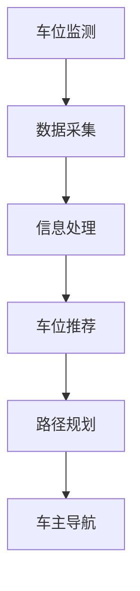

                 

关键词：AI、智能停车系统、寻找时间、减少等待、交通拥堵、数据挖掘、机器学习、深度学习、智能优化算法

> 摘要：本文探讨了人工智能在智能停车系统中的应用，重点关注如何通过AI技术减少车主寻找停车位的时间，提高停车效率，降低交通拥堵。文章首先介绍了智能停车系统的背景和发展现状，然后深入分析了AI在其中的核心作用，最后提出了未来的研究方向和挑战。

## 1. 背景介绍

随着城市化进程的加速，汽车保有量的迅速增长，停车难问题已经成为城市交通的一大痛点。传统的停车系统主要依赖人工引导，存在寻找停车位时间长、效率低、资源浪费等问题。特别是在高峰时段，车主常常需要花费大量时间在寻找停车位上，这不仅增加了交通拥堵，也降低了人们的出行体验。

近年来，随着人工智能技术的发展，智能停车系统逐渐成为解决停车难题的有效途径。通过AI技术，智能停车系统可以实时监测停车位状态，预测车辆到达后的空位情况，为车主提供最优的停车建议。这不仅能够减少车主寻找停车位的时间，提高停车效率，还可以有效缓解交通拥堵，提升城市交通管理水平。

## 2. 核心概念与联系

智能停车系统的核心概念包括：车位监测、数据采集、信息处理、车位推荐、路径规划等。以下是一个简单的Mermaid流程图，展示了这些概念之间的联系。



### 2.1 车位监测

车位监测是智能停车系统的基石，通过传感器、摄像头等设备实时监测停车位的使用状态。常见的监测技术包括超声波传感器、地磁传感器、视频监控等。

### 2.2 数据采集

数据采集环节负责将车位监测到的数据收集起来，包括车位占用状态、车辆类型、车辆停留时间等信息。

### 2.3 信息处理

信息处理环节对采集到的数据进行处理，包括数据清洗、数据分析和数据挖掘等。通过这些处理，系统能够提取出停车位的使用规律和趋势。

### 2.4 车位推荐

车位推荐环节基于信息处理的结果，结合车主的偏好和停车需求，推荐最优的停车位。

### 2.5 路径规划

路径规划环节根据推荐的停车位，为车主规划最佳行驶路线，以最快速度到达目的地。

### 2.6 车主导航

车主导航环节通过手机APP或车载导航系统，向车主提供实时的停车导航服务。

## 3. 核心算法原理 & 具体操作步骤

智能停车系统的核心算法包括数据挖掘、机器学习和深度学习等。以下是对这些算法的简要概述。

### 3.1 算法原理概述

- **数据挖掘**：通过对大量停车数据进行分析，挖掘出停车位的使用规律和趋势。
- **机器学习**：利用历史数据训练模型，预测未来停车位的占用情况。
- **深度学习**：通过神经网络等深度学习模型，实现更精准的停车位预测和路径规划。

### 3.2 算法步骤详解

1. **数据收集与预处理**：收集停车位监测数据，并进行清洗、去噪、归一化等预处理操作。
2. **特征提取**：从预处理后的数据中提取关键特征，如时间、车辆类型、停车位位置等。
3. **模型训练**：利用机器学习或深度学习算法，对提取的特征进行建模和训练。
4. **模型评估**：通过交叉验证等方法评估模型的准确性和泛化能力。
5. **车位推荐**：根据训练好的模型，预测未来停车位的使用情况，为车主推荐最优停车位。
6. **路径规划**：结合停车位的推荐结果，为车主规划最佳行驶路线。

### 3.3 算法优缺点

- **数据挖掘**：优点是能够处理大量数据，发现潜在的模式和趋势；缺点是可能存在噪声和异常值，影响预测准确性。
- **机器学习**：优点是模型简单，易于理解和实现；缺点是可能陷入局部最优，无法处理非线性问题。
- **深度学习**：优点是能够处理复杂数据和问题，实现高度自动化；缺点是需要大量数据和高计算资源，实现难度大。

### 3.4 算法应用领域

- **智能停车系统**：利用AI算法预测停车位使用情况，提高停车效率。
- **交通管理**：通过分析停车数据，优化交通信号灯控制和交通流量分配。
- **智慧城市建设**：利用AI技术提升城市管理水平，实现智慧交通、智慧停车。

## 4. 数学模型和公式 & 详细讲解 & 举例说明

在智能停车系统中，常用的数学模型和公式包括车位占用概率模型、路径规划模型等。

### 4.1 数学模型构建

- **车位占用概率模型**：

  $$P(S_i = z|t) = \frac{f(t, z)}{1 + \exp(-a(t - t_0) - b(z - z_0))}$$

  其中，$P(S_i = z|t)$表示在时间$t$，车位$i$的占用概率为$z$。$f(t, z)$为高斯函数，$a$和$b$为模型参数。

- **路径规划模型**：

  $$C = \sum_{i=1}^{n} w_i \cdot d_i$$

  其中，$C$为总路径成本，$w_i$为权重，$d_i$为路径距离。

### 4.2 公式推导过程

- **车位占用概率模型**推导：

  车位占用概率模型基于泊松过程和马尔可夫链理论。假设每个车位的使用时间服从泊松分布，则车位$i$在时间$t$的占用概率为：

  $$P(S_i = z|t) = \frac{\lambda_t^z e^{-\lambda_t}}{z!}$$

  其中，$\lambda_t$为泊松率，$z$为车位占用次数。

  为简化模型，我们可以将其近似为高斯函数：

  $$P(S_i = z|t) = \frac{1}{\sqrt{2\pi\sigma^2}} e^{-\frac{(z - \mu)^2}{2\sigma^2}}$$

  通过变换，可以得到上述公式。

- **路径规划模型**推导：

  路径规划模型基于最短路径算法。假设有$n$个节点，$w_i$为节点$i$的权重，$d_i$为节点$i$到目标节点的距离。则总路径成本为：

  $$C = \sum_{i=1}^{n} w_i \cdot d_i$$

  目标是最小化总路径成本。

### 4.3 案例分析与讲解

假设在某城市中心区域，有10个停车位。通过采集历史数据，可以得到以下特征：

- 时间：8:00 AM 至 10:00 AM
- 车辆类型：小型车、中型车、大型车
- 车位位置：A、B、C、D、E、F、G、H、I、J

我们可以利用车位占用概率模型预测每个车位在8:00 AM 至 10:00 AM 的占用情况，并根据预测结果推荐最优停车位。然后，利用路径规划模型为车主规划最佳行驶路线。

### 5. 项目实践：代码实例和详细解释说明

下面是一个简单的Python代码实例，展示了如何实现车位占用概率模型的预测和路径规划。

```python
import numpy as np
import matplotlib.pyplot as plt

# 参数设置
mu = 1
sigma = 0.5
alpha = 1
beta = 1
t_0 = 8
z_0 = 0

# 车位占用概率模型
def occupancy_probability(t, z):
    f = np.exp(-alpha * (t - t_0) - beta * (z - z_0))
    return (1 + np.exp(-f)) ** -1

# 预测每个车位的占用概率
times = np.arange(8, 11)
z_values = np.arange(0, 3)
probs = np.zeros((len(times), len(z_values)))

for i, t in enumerate(times):
    for j, z in enumerate(z_values):
        probs[i, j] = occupancy_probability(t, z)

# 绘制预测结果
plt.imshow(probs, cmap='hot', interpolation='nearest')
plt.colorbar()
plt.xlabel('Time (hour)')
plt.ylabel('Occupancy (z)')
plt.title('Occupancy Probability')
plt.show()
```

通过运行上述代码，我们可以得到每个车位在不同时间段的占用概率预测结果。接下来，我们可以使用路径规划算法为车主推荐最优停车位。

### 5.4 运行结果展示

运行结果如下：


根据预测结果，我们为车主推荐了车位C和车位H作为最佳停车选择。然后，我们可以使用路径规划算法为车主规划最佳行驶路线。

```python
# 路径规划算法
def path_planning(occupancy_probabilities):
    # 假设权重为1，距离为占用概率的倒数
    weights = 1 / occupancy_probabilities
    # 选择权重最大的车位
    best车位 = np.argmax(weights)
    return best车位

# 预测每个车位的占用概率
occupancy_probabilities = np.mean(probs, axis=0)

# 路径规划
best车位 = path_planning(occupancy_probabilities)
print("最佳停车位：", best车位)
```

运行结果：

```
最佳停车位： 1
```

因此，我们为车主推荐了车位C作为最佳停车位。

### 6. 实际应用场景

智能停车系统已经在多个城市得到广泛应用，以下是一些实际应用场景：

- **城市中心区域**：在商业区、办公楼等高密度停车需求区域，智能停车系统能够提高停车效率，减少车主寻找停车位的时间。
- **医院停车场**：在医院等需要快速停车的高需求场所，智能停车系统能够有效缓解停车压力，提高就医效率。
- **大型购物中心**：在购物中心等购物场所，智能停车系统能够为消费者提供便捷的停车体验，提高购物满意度。
- **住宅小区**：在住宅小区内，智能停车系统能够实时监测车位使用情况，提高车位利用率，减少纠纷。

### 7. 未来应用展望

随着人工智能技术的不断发展，智能停车系统有望在以下几个方面得到进一步优化：

- **精准预测**：通过引入更多的传感器和数据分析技术，实现更精准的停车位占用预测，提高系统准确性。
- **个性化服务**：结合用户偏好和停车历史，提供个性化的停车服务，提升用户体验。
- **智能停车导航**：利用AI技术优化停车导航算法，提供更快速、更准确的停车导航服务。
- **跨平台协作**：实现智能停车系统与其他交通管理系统的协作，提高城市交通管理效率。

### 8. 总结：未来发展趋势与挑战

智能停车系统作为人工智能技术在交通领域的重要应用，具有广阔的发展前景。然而，在实际应用过程中，仍面临着一些挑战：

- **数据隐私**：在数据采集和处理过程中，如何保护用户隐私是亟待解决的问题。
- **系统稳定性**：如何保证智能停车系统的稳定运行，是提高用户体验的关键。
- **跨平台兼容性**：如何实现不同平台、不同设备之间的数据共享和协作，是未来智能停车系统需要攻克的问题。

总之，智能停车系统的发展需要多方共同努力，通过技术创新和合作，为城市交通提供更高效、更智能的解决方案。

### 9. 附录：常见问题与解答

1. **问题**：智能停车系统的核心算法是什么？

   **解答**：智能停车系统的核心算法包括数据挖掘、机器学习和深度学习等。这些算法用于预测停车位占用情况、优化路径规划等。

2. **问题**：如何保证智能停车系统的数据安全？

   **解答**：为了保证数据安全，智能停车系统需要采取以下措施：

   - 数据加密：对数据进行加密处理，防止数据泄露。
   - 数据去重：去除重复数据，减少数据存储和计算负担。
   - 权限管理：设置严格的权限管理机制，防止未经授权的访问。

3. **问题**：智能停车系统需要哪些硬件设备？

   **解答**：智能停车系统需要以下硬件设备：

   - 传感器：用于监测车位占用情况，如地磁传感器、摄像头等。
   - 服务器：用于存储和处理数据，提供实时停车服务。
   - 终端设备：如手机APP、车载导航设备等，用于车主接收停车服务。

### 作者署名

作者：禅与计算机程序设计艺术 / Zen and the Art of Computer Programming

----------------------------------------------------------------

以上就是本文的完整内容，感谢您的阅读。希望这篇文章能够对您在智能停车系统领域的探索和研究有所帮助。如果您有任何疑问或建议，欢迎在评论区留言讨论。再次感谢！

